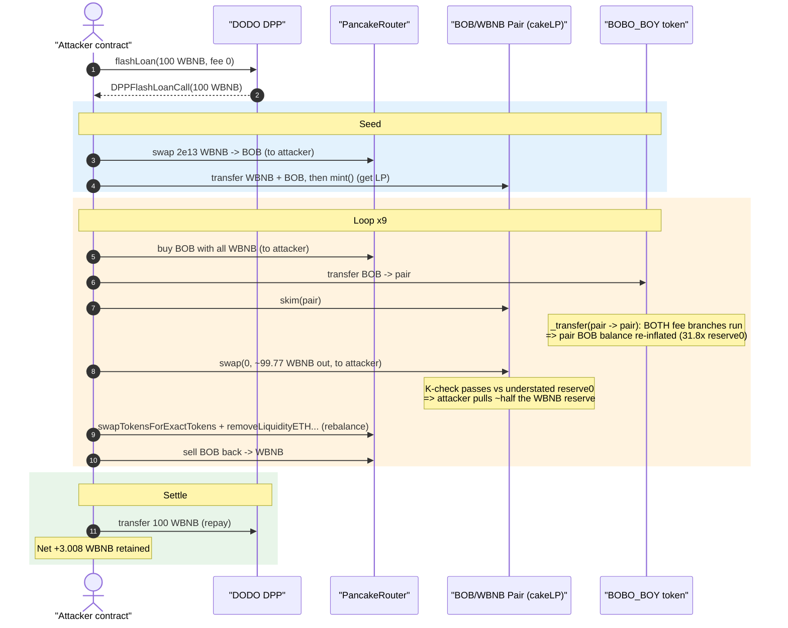
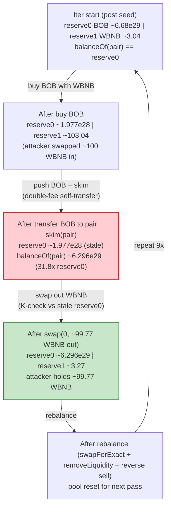
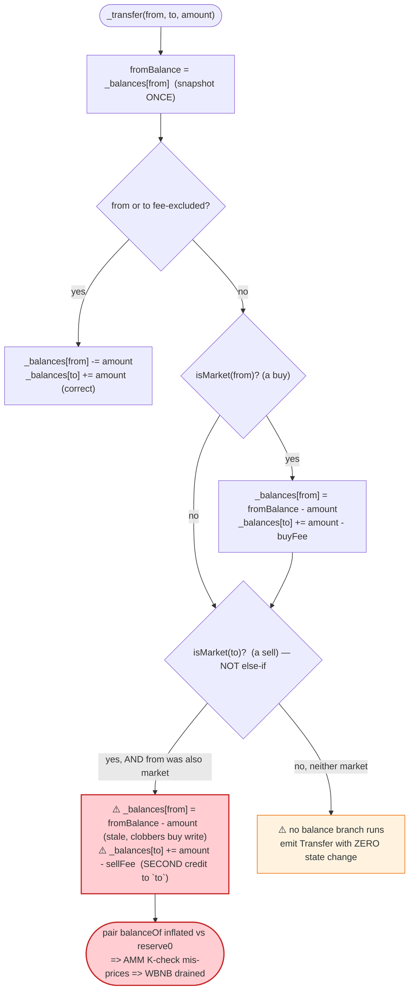

# BOBO_BOY (BOB) Exploit — Broken `_transfer` Fee Branches Desync Pool Reserves

> **Vulnerability classes:** vuln/logic/state-update · vuln/defi/fee-manipulation

> **Reproduction:** the PoC compiles & runs in an isolated Foundry project at
> [this project folder](.) (the umbrella DeFiHackLabs repo contains several unrelated PoCs
> that do not whole-compile, so this one was extracted).
> Full verbose trace: [output.txt](output.txt).
> Verified vulnerable source: [BOBO_BOY.sol](sources/BOBO_BOY_700eE2/BOBO_BOY.sol).

---

## Key info

| | |
|---|---|
| **Loss** | **~3.008 BNB** profit drained from the BOB/WBNB PancakeSwap pair (PoC header: "~3 BNB") |
| **Vulnerable contract** | `BOBO_BOY` (ticker **BOB**) — [`0x700eE24c350739e323Dcf6A50Ae3E7A3329C86aE`](https://bscscan.com/address/0x700eE24c350739e323Dcf6A50Ae3E7A3329C86aE#code) |
| **Victim pool** | BOB/WBNB PancakePair (`cakeLP`) — [`0x7CafdAaa0ba0F471c800DBaca94bDB943311939d`](https://bscscan.com/address/0x7CafdAaa0ba0F471c800DBaca94bDB943311939d) |
| **Helper contract (controller)** | `0xfa09693B851a9e417Fbfa28bcd744053e683cC4C` (unverified) — `preventBotPurchase`/`validation` hook |
| **Flash-loan source** | DODO DPP `0x81917eb96b397dFb1C6000d28A5bc08c0f05fC1d` (100 WBNB, fee 0) |
| **Attacker EOA** | [`0xcb733f075ae67a83a9c5f38a0864596e338a0106`](https://bscscan.com/address/0xcb733f075ae67a83a9c5f38a0864596e338a0106) |
| **Attacker contract** | [`0x0fe1983b8972630c866fe77ad873a66ec598b685`](https://bscscan.com/address/0x0fe1983b8972630c866fe77ad873a66ec598b685) |
| **Attack tx** | [`0xfb14292a531411f852993e5a3ba4e7eb63ed548220267b9b3f4aacc5572d3a58`](https://bscscan.com/tx/0xfb14292a531411f852993e5a3ba4e7eb63ed548220267b9b3f4aacc5572d3a58) |
| **Chain / block / date** | BSC / 34,428,628 (forked at `34,428,627`) / **2023-12-17** |
| **Compiler** | Solidity **v0.8.19**, optimizer **off** (200 runs metadata) |
| **Bug class** | Broken token transfer accounting → AMM reserve/balance desync (custom fee logic) |

---

## TL;DR

`BOBO_BOY` is a fee-on-transfer token whose `_transfer` ([BOBO_BOY.sol:470-503](sources/BOBO_BOY_700eE2/BOBO_BOY.sol#L470-L503))
splits its fee logic into **two independent `if` blocks** — one for `isMarket(from)` (a "buy"), one for
`isMarket(to)` (a "sell"). They are **not** mutually exclusive, and **both blocks recompute the debit from the
same stale `fromBalance` snapshot**:

```solidity
uint256 fromBalance = _balances[from];          // snapshot ONCE
...
if (isMarket(from)) {                            // buy branch
    _balances[from] = fromBalance - amount;      // writes from
    _balances[to]  += amount - fee;              // credits to
}
if (isMarket(to)) {                              // sell branch (NOT else-if)
    _balances[from] = fromBalance - amount;      // re-writes from from the STALE snapshot
    _balances[to]  += amount - fee;              // credits to AGAIN
}
```

When **both** endpoints are "market" addresses — i.e. the PancakeSwap **pair transferring to itself** (which is
exactly what `cakeLP.skim()` does internally) — the recipient (`to == pair`) is credited **twice** while the
debit uses the stale snapshot. The pair's *real* BOB `balanceOf` drifts far above the `reserve0` that the pair
believes it holds. The attacker amplifies this drift with a tight loop of `mint`/`skim`/`swap`/`removeLiquidity`,
then harvests it: because `reserve0` is grossly **understated** relative to the pair's actual BOB balance, the
constant-product `x·y ≥ k` check in `PancakePair.swap` lets the attacker pull out roughly **half the WBNB
reserve per loop iteration** while feeding back BOB the pair already over-holds.

Funded by a fee-free **100 WBNB DODO flash loan**, the attacker runs the loop **9 times**, repays the 100 WBNB,
and walks away with **~3.008 WBNB** of the pool's genuine liquidity.

---

## Background — what BOBO_BOY does

`BOBO_BOY` ([source](sources/BOBO_BOY_700eE2/BOBO_BOY.sol)) is a vanilla OpenZeppelin-style ERC20 with a custom
fee-on-transfer layer and an anti-bot "Controller" hook:

- **Total supply** `1e30` wei (1,000,000,000,000 BOB at 18 decimals), all minted to the owner in the constructor
  ([:371-384](sources/BOBO_BOY_700eE2/BOBO_BOY.sol#L371-L384)).
- **Fees**: `buyFee = 0%`, `sellFee = 3%`, where "market" means the configured PancakeRouter or the BOB/WBNB pair
  (`isMarket`, [:578-584](sources/BOBO_BOY_700eE2/BOBO_BOY.sol#L578-L584)). Fees route to `marketWallet`.
- **Controller hook**: `_beforeTokenTransfer` calls `_controller.preventBotPurchase(to, amount)` on every buy and
  `_controller.validation(...)` when validation is active ([:564-576](sources/BOBO_BOY_700eE2/BOBO_BOY.sol#L564-L576)).
  The on-chain controller at `0xfa096…` is unverified; in the trace it only emits events / updates timestamps and
  does **not** itself move BOB balances — it is incidental to the bug.

The token's own `_pair` is the BOB/WBNB PancakePair used as the victim pool. The relevant pool state at the fork
block (read from the trace's first `getReserves`/`balanceOf`):

| Parameter | Value |
|---|---|
| Pool BOB reserve (`reserve0`) | `667,942,574,456,166,649,735,833,002,939` (≈ 6.679e29 wei) |
| Pool WBNB reserve (`reserve1`) | `3,043,052,444,337,947,721` (≈ **3.043 WBNB**) |
| `buyFee` / `sellFee` | 0% / 3% |
| flash-loan principal | 100 WBNB (DODO, fee 0) |

---

## The vulnerable code

### 1. `_transfer` — two non-exclusive fee blocks over a stale snapshot

[BOBO_BOY.sol:470-503](sources/BOBO_BOY_700eE2/BOBO_BOY.sol#L470-L503):

```solidity
function _transfer(address from, address to, uint256 amount) internal virtual {
    require(from != address(0), "ERC20: transfer from the zero address");
    require(to   != address(0), "ERC20: transfer to the zero address");

    _beforeTokenTransfer(from, to, amount);

    uint256 fromBalance = _balances[from];                 // ⚠️ snapshot ONCE, reused below
    require(fromBalance >= amount, "ERC20: transfer amount exceeds balance");

    if (isExcludedFromFee[from] || isExcludedFromFee[to]) {
        _balances[from] = fromBalance - amount;
        _balances[to]  += amount;
    } else {
        if (isMarket(from)) {                              // "buy"  (pair/router -> user)
            uint fee = takeAFee(amount, buyFee);           // buyFee = 0
            _balances[from]          = fromBalance - amount;
            _balances[to]           += amount - fee;
            _balances[marketWallet] += fee;
        }
        if (isMarket(to)) {                                // "sell" (user -> pair/router) — NOT else-if
            uint fee = takeAFee(amount, sellFee);          // sellFee = 3%
            _balances[from]          = fromBalance - amount; // ⚠️ re-derives from the SAME stale snapshot
            _balances[to]           += amount - fee;         // ⚠️ second credit to `to`
            _balances[marketWallet] += fee;
        }
    }

    emit Transfer(from, to, amount);                       // emitted once, regardless of branch math
    _afterTokenTransfer(from, to, amount);
}
```

Two distinct defects compound here:

1. **Non-exclusive branches over a stale snapshot.** Both blocks assign `_balances[from] = fromBalance - amount`
   from the *same* pre-transfer snapshot. When both `isMarket(from)` and `isMarket(to)` are true (the pair sending
   BOB to itself), the second block clobbers the first's write to `from` and **adds a second credit to `to`**.
2. **A no-balance-movement path.** When neither `from` nor `to` is excluded and neither is "market", *no* balance
   branch runs at all — `emit Transfer` fires with zero state change (a free phantom transfer). Not the lever used
   here, but the same root mistake: balance updates are gated by partial, non-exhaustive conditions.

### 2. Where "pair sends to itself" comes from: `cakeLP.skim`

The attacker calls `cakeLP.skim(address(cakeLP))` ([Bob_exp.sol:78](test/Bob_exp.sol#L78)). PancakeSwap's `skim`
pushes `balanceOf(pair) - reserve` of each token to `to`; with `to == pair`, the BOB leg becomes
`BOB.transfer(pair → pair, excess)`. That single self-transfer triggers the double-fee path above and **re-inflates
the pair's BOB balance** relative to `reserve0` each iteration. (Verified in the trace: the `skim` self-transfer of
`628,723,571,470,136,448,393,235,691,983` BOB nets a delta of exactly `-fee = -18,861,707,144,104,093,451,797…`,
i.e. only the 3% sell fee leaves the pair — the rest is "self-credited" right back, leaving the pair holding far
more BOB than its synced reserve.)

### 3. The harvest: a stale `reserve0` under-prices the WBNB the attacker pulls

Right before the profitable swap each loop, the trace shows ([output.txt:1795-1815](output.txt)):

| Quantity | Value |
|---|---|
| Pair recorded `reserve0` (BOB) | `19,773,812,706,156,628,496,813,851,020` (≈ 1.977e28) |
| Pair **actual** BOB `balanceOf` | `629,635,677,032,188,983,438,252,472,244` (≈ 6.296e29) — **31.8× the reserve** |
| Pair `reserve1` (WBNB) | `103,043,052,444,337,947,721` (≈ 103.04 WBNB) |
| WBNB pulled out by the swap | `99,770,992,561,631,968,151` (≈ **99.77 WBNB**) |

The attacker computes a fake BOB "amountIn" against the **understated** `reserve0` and calls
`cakeLP.swap(0, ~99.77e18, attacker, ...)`. Because the pair already physically holds the BOB (its balance is 31.8×
its reserve), the post-swap `balance0 * balance1 ≥ reserve0 * reserve1` invariant inside `PancakePair.swap`
([PancakePair.sol:434-470](sources/PancakePair_7CafdA/PancakePair.sol)) is satisfied, and the pair hands over
~half its WBNB for tokens it was already over-credited.

---

## Root cause — why it was possible

A Uniswap-V2/PancakeSwap pair trusts that a token's `balanceOf` only changes through transfers it can account for,
and it re-prices via `reserve` snapshots updated on `swap`/`mint`/`burn`/`sync`. The constant-product check is the
pair's only defence.

`BOBO_BOY._transfer` quietly violates token conservation:

> For a transfer where **both** endpoints are "market" addresses, the credit to `to` runs twice and the debit to
> `from` is recomputed from a stale snapshot. The token therefore **mints balance into the pair** relative to what
> the pair's `reserve0` records. No equivalent WBNB enters the pair. After enough iterations the pair's true BOB
> balance dwarfs its `reserve0`, so the pair will exchange genuine WBNB for BOB it already holds — i.e. it pays out
> liquidity for nothing.

The composing design errors:

1. **`if … if` instead of `if … else if`.** Buy and sell handling are not mutually exclusive, so a pair-to-pair
   transfer executes both, double-crediting `to`.
2. **Stale `fromBalance` reuse.** Each branch writes `_balances[from] = fromBalance - amount` from a snapshot taken
   before either branch ran, so the second branch erases the first branch's debit accounting.
3. **No `balanceOf == sum(reserves accounted)` discipline.** The token never enforces that the sum of balances is
   conserved across a transfer; the AMM's K-check is the only thing standing between this accounting bug and a drain,
   and the attacker engineers a balance/reserve gap that satisfies K while still bleeding WBNB.
4. **`skim(pair)` as the inflation primitive.** Routing `skim` back to the pair turns the broken self-transfer into a
   reusable balance-inflation step, repeatable inside one transaction.

---

## Preconditions

- A BOB/WBNB PancakePair exists with real WBNB liquidity (the prize — ~3 WBNB net here).
- `sellFee` (or `buyFee`) makes the buy/sell branches *do something*, and `isMarket` returns true for both the
  router and the pair so a pair→pair `skim` transfer triggers the double-credit. Both hold for the deployed BOB.
- Working WBNB capital to seed the loop. Fully recovered intra-transaction, hence **flash-loanable**: the PoC borrows
  100 WBNB from a DODO DPP at **zero fee** ([Bob_exp.sol:46](test/Bob_exp.sol#L46)) and repays it at the end
  ([Bob_exp.sol:104](test/Bob_exp.sol#L104)).
- No oracle/TWAP and no per-tx reserve-impact cap on the pair (standard PancakePair) — true by construction.

---

## Attack walkthrough (with on-chain numbers from the trace)

The pair's `token0 = BOB`, `token1 = WBNB`, so `reserve0 = BOB`, `reserve1 = WBNB`. All figures below are taken
directly from `Sync` / `Swap` / `balanceOf` lines in [output.txt](output.txt). The body runs inside
`DPPFlashLoanCall`, the DODO flash-loan callback ([Bob_exp.sol:51-105](test/Bob_exp.sol#L51-L105)).

| # | Step (PoC line) | What happens | Pool BOB reserve0 | Pool WBNB reserve1 |
|---|---|---|---:|---:|
| 0 | **Flash loan** ([:46](test/Bob_exp.sol#L46)) | Borrow **100 WBNB** from DODO (fee 0) | 667,942,574,…e29 | 3.043 |
| 1 | **Seed buy** ([:60-62](test/Bob_exp.sol#L60-L62)) | Swap `2e13` WBNB → `4.379e24` BOB to attacker | 667,938,195,…e29 | 3.043 |
| 2 | **Add liquidity** ([:64-69](test/Bob_exp.sol#L64-L69)) | `quote` WBNB + BOB → `cakeLP.mint(attacker)` (gets `9.016e18` LP) | 667,942,443,…e29 | 3.043 |
| 3 | **Loop ×9** ([:72-102](test/Bob_exp.sol#L72-L102)) | Per iteration: buy BOB → push BOB to pair → **`skim(pair)`** (double-credit) → **`swap` out ~half the WBNB** → `swapTokensForExactTokens` + `removeLiquidityETH…` → sell BOB back | desyncs each pass | drained ~½ each pass |
| 3a | Iteration 0, buy ([:73-75](test/Bob_exp.sol#L73-L75)) | Swap `~99.99e18` WBNB → `6.481e29` BOB to attacker | 19,773,812,…e28 | 103.04 |
| 3b | Iteration 0, push+skim ([:77-78](test/Bob_exp.sol#L77-L78)) | Send BOB to pair, `skim(pair)`: pair BOB **balanceOf 6.296e29 vs reserve0 1.977e28 (31.8×)** | 19,773,812,…e28 | 103.04 |
| 3c | Iteration 0, harvest ([:82](test/Bob_exp.sol#L82)) | `cakeLP.swap(0, 99.77e18, attacker)` — pulls **99.77 WBNB** for BOB the pair already over-holds | 629,635,677,…e29 | 3.272 |
| 3d | Iteration 0, rebalance ([:88-100](test/Bob_exp.sol#L88-L100)) | `swapTokensForExactTokens` + `removeLiquidityETHSupportingFee…` + reverse sell reset the pool for the next pass | 1.145e30 | 1.806 |
| 4 | **Repay** ([:104](test/Bob_exp.sol#L104)) | `WBNB.transfer(dodo, 100e18)` repays the flash loan | — | — |
| 5 | **Settle** ([:48](test/Bob_exp.sol#L48)) | Attacker WBNB balance logged | — | — |

**Why "the swap pulls ~half the WBNB":** with `reserve0` (BOB) understated to ≈ 1.977e28 but the pair physically
holding ≈ 6.296e29 BOB, the attacker can claim a BOB `amountIn` (≈ 6.045e29 computed from the over-held balance)
that, fed through PancakeSwap's `getAmountOut = (in·9975·reserveOut)/(reserveIn·10000 + in·9975)` against the *small*
`reserveIn`, returns ≈ `0.5 · reserveOut` of WBNB — `getAmountOut(6.045e29, 1.977e28, 103.04) = 99.77 WBNB`
([output.txt:1799-1800](output.txt)). Each loop iteration re-inflates the balance/reserve gap and repeats the half-drain.

### Profit accounting (WBNB)

| Item | Amount (WBNB) |
|---|---:|
| Flash loan borrowed (DODO) | 100.000000 |
| Flash loan repaid (DODO) | −100.000000 |
| **Net retained from the pool over 9 loop iterations** | **+3.008217** |
| **Attacker WBNB balance at end** (`log_named_decimal_uint`, [output.txt:1599](output.txt)) | **3.008216838352024283** |

The attacker started and ended with zero of their own capital (DODO principal repaid in full); the **3.008217 WBNB**
is pure extraction of the BOB/WBNB pool's genuine liquidity. PoC header rounds this to "~3 BNB".

---

## Diagrams

### Sequence of the attack



### Pool state evolution (one loop iteration)



### The flaw inside `_transfer`



---

## Remediation

1. **Make the fee branches mutually exclusive and snapshot-safe.** Use a single accounting block:
   compute the fee from the actual buy/sell context once, then perform exactly one debit and one credit. Never run
   both a buy and a sell branch in the same call, and never re-derive `_balances[from]` from a pre-transfer snapshot
   after it has already been written.
   ```solidity
   uint256 fee = isExcludedFromFee[from] || isExcludedFromFee[to]
       ? 0
       : isMarket(from) ? takeAFee(amount, buyFee)
       : isMarket(to)   ? takeAFee(amount, sellFee)
       : 0;
   _balances[from] -= amount;                 // single debit, on current balance
   _balances[to]   += amount - fee;           // single credit
   if (fee > 0) _balances[marketWallet] += fee;
   ```
2. **Cover the fall-through.** Ensure the function debits/credits on *every* path (the current code does nothing
   when neither party is excluded nor "market"). The simplest fix is the single-block form above, which always moves
   `amount`.
3. **Conserve supply.** Add an invariant test that `sum(_balances)` is unchanged by any transfer (and equals
   `totalSupply()`), and fuzz `transfer`/`transferFrom` with `from`/`to ∈ {pair, router, user, marketWallet}` to
   catch double-credit/no-op paths.
4. **Don't make the AMM the only guardrail.** A fee-on-transfer token that can desync a pair's `balanceOf` from its
   `reserve` will be drained via the constant-product invariant. If custom transfer logic is required, reuse a
   battle-tested ERC20 base and confine fee handling to a small, exhaustively-tested wrapper.
5. **Avoid `skim`-to-self foot-guns.** Self-transfers (`from == to`) should be a true no-op; explicitly short-circuit
   them before fee logic so a `skim(pair)` cannot re-inflate balances.

---

## How to reproduce

The PoC was extracted into a standalone Foundry project (the umbrella DeFiHackLabs repo fails to whole-compile under
`forge test`):

```bash
_shared/run_poc.sh 2023-12-Bob_exp -vvvvv
```

- RPC: a **BSC archive** endpoint is required (fork block `34,428,627`, Dec 2023). `foundry.toml` uses
  `https://bsc-mainnet.public.blastapi.io`, which serves historical state at that block; pruned public RPCs fail with
  `header not found` / `missing trie node`.
- Result: `[PASS] testExploit()` with the attacker holding **3.008216838352024283 WBNB** after repaying the flash loan.

Expected tail:

```
[PASS] testExploit() (gas: 3599239)
Logs:
  [End] Attacker BNB balance after exploit: 3.008216838352024283

Suite result: ok. 1 passed; 0 failed; 0 skipped
```

---

*Vulnerable BOBO_BOY source: [sources/BOBO_BOY_700eE2/BOBO_BOY.sol](sources/BOBO_BOY_700eE2/BOBO_BOY.sol).
Victim PancakePair: [sources/PancakePair_7CafdA/PancakePair.sol](sources/PancakePair_7CafdA/PancakePair.sol).
The `0xfa096…` controller is unverified on BscScan and is not the source of the bug.*
