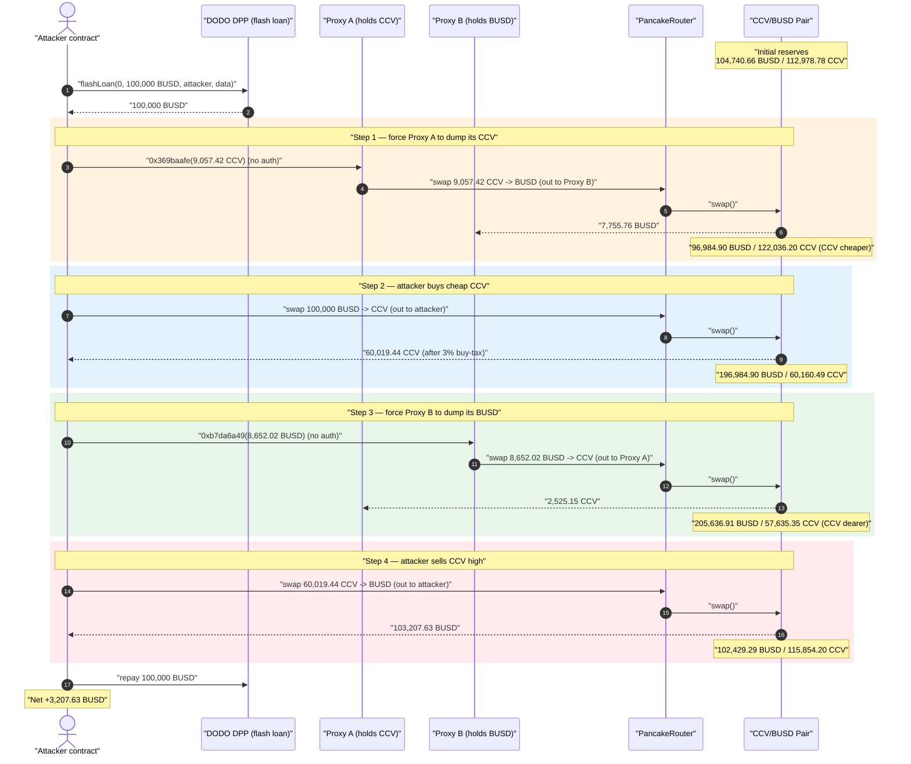
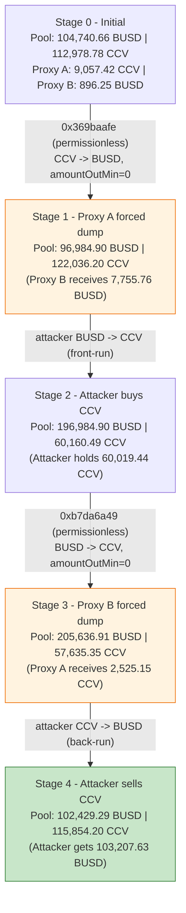
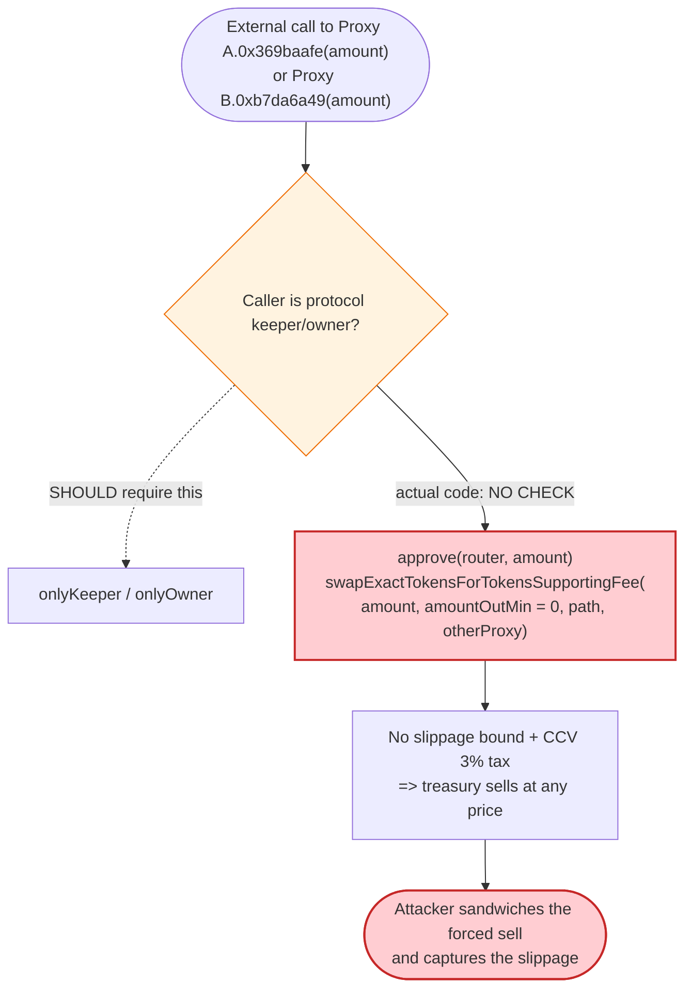

# CCV Exploit — Permissionless Treasury-Proxy Forced Liquidation Sandwich

> **Reproduction:** the PoC compiles & runs in an isolated Foundry project at
> [this project folder](.) (the umbrella DeFiHackLabs repo
> contains many unrelated PoCs that do not whole-compile, so this one was extracted).
> Full verbose trace: [output.txt](output.txt).
> Verified token source (fee logic): [contracts_CCV.sol](sources/CCV_89c27D/contracts_CCV.sol).
> The two vulnerable proxy *implementations* are **unverified** on BscScan; their behavior is
> reconstructed below from the live execution trace.

---

## Key info

| | |
|---|---|
| **Loss** | **~3,207.63 BUSD** drained from two protocol-owned treasury proxies via a sandwiched forced sell |
| **Vulnerable contracts** | Treasury proxy A — [`0x37177ccC66ef919894CeF37596BBebd76E7A40B2`](https://bscscan.com/address/0x37177ccC66ef919894CeF37596BBebd76E7A40B2#code) (holds CCV) · Treasury proxy B — [`0xE38d7ff85bB801D35382eeF15eB8263F2c751ecd`](https://bscscan.com/address/0xE38d7ff85bB801D35382eeF15eB8263F2c751ecd#code) (holds BUSD) |
| **Token** | `CCV` — [`0x89c27D81941708dBC9AA4d905443392cb4A8EF73`](https://bscscan.com/address/0x89c27D81941708dBC9AA4d905443392cb4A8EF73#code) |
| **Victim pool** | CCV/BUSD PancakeSwap-v2 pair — `0x4da070F3c4295389ddFF6d4398650001e412cB39` |
| **Flash-loan source** | DODO DPP (BUSD/?) — `0x6098A5638d8D7e9Ed2f952d35B2b67c34EC6B476` (no-fee flash loan) |
| **Attacker EOA** | `0x835b45d38cbdccf99e609436ff38e31ac05bc502` |
| **Attacker contract** | `0xb2f22296661ccc5530ebdbabb8264b82e977504d` |
| **Attack tx** | [`0x6ba4152db9da45f5751f2c083bf77d4b3385373d5660c51fe2e4382718afd9b4`](https://bscscan.com/tx/0x6ba4152db9da45f5751f2c083bf77d4b3385373d5660c51fe2e4382718afd9b4) |
| **Chain / block / date** | BSC / 34,739,874 (fork at 34,739,873) / Dec 28, 2023 |
| **Compiler** | Token: Solidity v0.8.17, optimizer 1 run · Proxies: v0.8.9 |
| **Bug class** | Missing access control on a value-moving function (permissionless forced liquidation) + AMM sandwich |

---

## TL;DR

The CCV protocol parks its working liquidity in two upgradeable proxy contracts:

- **Proxy A** (`0x3717…`) holds **CCV** and exposes a permissionless function (selector `0x369baafe`)
  that approves the PancakeRouter and **market-sells the proxy's entire CCV balance** into the
  CCV/BUSD pair, routing the BUSD proceeds to Proxy B.
- **Proxy B** (`0xE38d…`) holds **BUSD** and exposes a permissionless function (selector `0xb7da6a49`)
  that approves the router and **market-sells the proxy's entire BUSD balance** into the same pair,
  routing the CCV proceeds back to Proxy A.

Neither function has access control. Anyone can pass in the proxy's current balance as the argument
and force these treasury contracts to dump their holdings into the AMM at market — incurring slippage
and CCV's 3% transfer fee — for no benefit to the protocol. An attacker simply **sandwiches** those
two forced sells with their own flash-loaned trades and pockets the slippage the proxies bled into the
pool.

The attacker:

1. Flash-loans **100,000 BUSD** from a no-fee DODO DPP pool.
2. **Forces Proxy A to dump its 9,057 CCV** → 7,756 BUSD (which lands in Proxy B). This pushes the CCV
   price *down* (more CCV in the pool).
3. **Buys CCV** with the borrowed 100,000 BUSD — getting a large amount of now-cheap CCV (61,876 CCV).
4. **Forces Proxy B to dump its now-8,652 BUSD** → 2,525 CCV (which lands in Proxy A). This pushes the
   CCV price *back up* (more BUSD in the pool).
5. **Sells its 58,219 CCV** (post-fee) back for **103,208 BUSD** at the inflated price.
6. Repays the 100,000 BUSD flash loan, walking away with **3,207.63 BUSD** profit.

Net result: the value the two treasury proxies lost to slippage and CCV's sell-tax during their forced
liquidation is captured by the surrounding attacker swaps. Profit = **3,207.63 BUSD**.

---

## Background — what the system does

**CCV** ([source](sources/CCV_89c27D/contracts_CCV.sol)) is a fee-on-transfer ERC-20 on BSC paired
against BUSD on PancakeSwap. Its only relevant feature here is the transfer tax applied to AMM
buys/sells ([contracts_CCV.sol:160-202](sources/CCV_89c27D/contracts_CCV.sol#L160-L202)):

- A swap is detected when either side of a transfer is a registered `pairs[…]` address
  ([:135](sources/CCV_89c27D/contracts_CCV.sol#L135)).
- On a **buy** (`pairs[from]`) the buyer pays `buyFee1 = 1%` to `lpDistributeAdd` + `buyFee2 = 2%` to
  `market` ([:165-182](sources/CCV_89c27D/contracts_CCV.sol#L165-L182)).
- On a **sell** (`pairs[to]`) the seller pays `sellFee1 = 1%` + `sellFee2 = 2%` the same way
  ([:183-201](sources/CCV_89c27D/contracts_CCV.sol#L183-L201)).

In the trace, the 1% and 2% fee transfers go to `0x32A02A102Ca3ddB06CccEF17C1960Adde3c40DF0` (the
configured fee receiver) — e.g. [output.txt:1677-1679](output.txt#L1677) and
[output.txt:1747-1749](output.txt#L1747). This 3% tax is *paid by the proxies and by the attacker* and
is part of why the forced sells are pure loss to the treasury.

The two **treasury proxies** (`0x3717…` and `0xE38d…`) are EIP-1967 upgradeable proxies
([ERC1967Proxy, BscScan-verified shell](sources/ERC1967Proxy_37177c/openzeppelin_contracts_proxy_ERC1967_ERC1967Proxy.sol)).
At the attack block they delegatecall to **unverified** implementations
(`0x18F6e45B017187E19E62BA0118621c9A2200Ce0C` for Proxy A, `0x238217598aBb32A3a031f6a9cccC86F5946A07e3`
for Proxy B). Those implementations hold the protocol's CCV / BUSD and expose the two permissionless
"sell my whole balance" entry points that this exploit abuses.

The **flash loan** comes from a DODO DPP pool ([DPP.sol:1192-1211](sources/DPP_853512/DPP.sol#L1192-L1211)).
DODO's `flashLoan` only requires that the pool's reserves be restored by the end of the call
(`baseBalance >= _BASE_RESERVE_ || quoteBalance >= _QUOTE_RESERVE_`,
[DPP.sol:1208-1211](sources/DPP_853512/DPP.sol#L1208-L1211)) — i.e. it is effectively a **zero-fee**
loan, so the attacker only has to return the exact 100,000 BUSD it borrowed.

On-chain parameters at the fork block:

| Parameter | Value |
|---|---|
| CCV buy/sell fee | 1% + 2% = **3%** each way |
| Fee receiver (`market`/`lpDistributeAdd`) | `0x32A02A10…` |
| Pair `token0` / `token1` | **BUSD / CCV** (verified via `cast`) |
| Pair reserves (BUSD / CCV) before the attack | **104,740.66 BUSD / 112,978.78 CCV** ([output.txt:1634](output.txt#L1634)) |
| Proxy A (`0x3717…`) CCV balance | **9,057.42 CCV** ([output.txt:1614](output.txt#L1614)) |
| Proxy B (`0xE38d…`) BUSD balance | **896.25 BUSD** initially ([output.txt:1632](output.txt#L1632)) |

---

## The vulnerable code

### 1. CCV's transfer tax (verified) — bleeds 3% on every forced sell

```solidity
// contracts_CCV.sol
function _transfer(address from, address to, uint256 amount) internal {
    ...
    bool isSwap = pairs[from] || pairs[to];
    if (isSwap) {
        if (excludeFee[from] || excludeFee[to]) {
            _standardTransfer(from, to, amount);   // whitelist
        } else {
            _transferWithFee(from, to, amount);    // 3% tax
        }
    } else {
        _standardTransfer(from, to, amount);
    }
    ...
}
```

([contracts_CCV.sol:124-148](sources/CCV_89c27D/contracts_CCV.sol#L124-L148))

### 2. The permissionless "dump my whole balance" entry points (unverified — reconstructed from trace)

The two proxy implementations are unverified, but the trace makes their behavior unambiguous. Calling
`0x369baafe(uint256 amount)` on **Proxy A** executes (delegatecall into `0x18F6e45B…`,
[output.txt:1615-1659](output.txt#L1615)):

```solidity
// Proxy A, selector 0x369baafe  — NO access control
function dumpCCV(uint256 amount) external {
    CCV.approve(address(PancakeRouter), amount);                       // [output.txt:1617]
    address[] memory path = [CCV, BUSD];
    PancakeRouter.swapExactTokensForTokensSupportingFeeOnTransferTokens(
        amount, 0, path, PROXY_B /* 0xE38d… */, deadline);             // [output.txt:1622]
}
```

Calling `0xb7da6a49(uint256 amount)` on **Proxy B** mirrors it (delegatecall into `0x238217598…`,
[output.txt:1700-1742](output.txt#L1700)):

```solidity
// Proxy B, selector 0xb7da6a49  — NO access control
function dumpBUSD(uint256 amount) external {
    BUSD.approve(address(PancakeRouter), amount);                      // [output.txt:1702]
    address[] memory path = [BUSD, CCV];
    PancakeRouter.swapExactTokensForTokensSupportingFeeOnTransferTokens(
        amount, 0, path, PROXY_A /* 0x3717… */, deadline);             // [output.txt:1707]
}
```

The decisive facts visible in the trace:

- The call originates from the **attacker contract** (`msg.sender` is `ContractTest`), yet both succeed
  — there is **no `onlyOwner`/keeper/role check**. The PoC even ignores the return value
  ([CCV_exp.sol:47-52](test/CCV_exp.sol#L47-L52)).
- Each call swaps the proxy's **entire passed-in balance** with `amountOutMin = 0`
  ([output.txt:1622](output.txt#L1622), [output.txt:1707](output.txt#L1707)) — **no slippage
  protection** whatsoever.
- The proceeds are sent to the *other* proxy, so value is shuffled between the two treasury contracts
  while leaking 3% sell-tax + AMM slippage into the pool on each leg.

### 3. The flash-loan harness (PoC)

```solidity
// test/CCV_exp.sol
function DPPFlashLoanCall(address sender, uint256 baseAmount, uint256 quoteAmount, bytes calldata data) external {
    require(msg.sender == address(DODO), "Fail");
    address(proxy3717).call(abi.encodeWithSelector(bytes4(0x369baafe), CCV.balanceOf(address(proxy3717))));  // force Proxy A dump
    BUSDTOTOKEN();                                                                                            // buy CCV cheap
    address(proxye38d).call(abi.encodeWithSelector(bytes4(0xb7da6a49), BUSD.balanceOf(address(proxye38d)))); // force Proxy B dump
    TOKENTOBUSD();                                                                                            // sell CCV dear
    BUSD.transfer(address(DODO), 100_000 * 1e18);                                                             // repay
}
```

([CCV_exp.sol:45-55](test/CCV_exp.sol#L45-L55))

---

## Root cause — why it was possible

The treasury proxies expose a **value-moving operation (market-sell the whole balance) with no caller
restriction and no slippage bound.** That single missing access-control check turns a treasury
management routine into a *gift to the public*: anyone can force the protocol's own funds through the
AMM at the worst possible price and arrange to be on the other side of the trade.

Two independent weaknesses compound:

1. **Permissionless forced liquidation.** `0x369baafe` / `0xb7da6a49` should be callable only by the
   protocol's keeper. Because they are open, the attacker controls *when* the proxies sell — choosing
   the exact moment when their own surrounding swaps maximize extraction.
2. **`amountOutMin = 0` and no MEV/slippage guard.** The forced swaps accept any output, so they can be
   sandwiched arbitrarily. Combined with CCV's 3% transfer tax, every forced sell is guaranteed to be
   loss-making for the treasury.

The attack does **not** break the AMM invariant (unlike a reserve-burn bug); instead it is a classic
**sandwich around an attacker-triggered victim trade**. The "victim trade" just happens to be one the
attacker can summon on demand, for free, against someone else's money.

---

## Preconditions

- The two proxy implementations must expose the permissionless dump functions and hold a non-trivial
  balance (Proxy A held 9,057 CCV; Proxy B held 896 BUSD which grew to 8,652 BUSD after receiving
  Proxy A's proceeds). ✓ at the fork block.
- A liquid CCV/BUSD pair to sandwich (≈104.7k BUSD / 113k CCV). ✓
- Working capital in BUSD to set up the sandwich — fully recovered intra-transaction and therefore
  **flash-loanable**. The PoC borrows **100,000 BUSD** from a zero-fee DODO DPP pool
  ([CCV_exp.sol:41](test/CCV_exp.sol#L41)).

---

## Attack walkthrough (with on-chain numbers from the trace)

The pair's `token0 = BUSD`, `token1 = CCV`, so in every `Swap`/`Sync` event `amount0`/`reserve0` is
BUSD and `amount1`/`reserve1` is CCV. All reserve figures below come directly from the `Sync` events
in [output.txt](output.txt).

| # | Step (caller) | Pool BUSD reserve | Pool CCV reserve | Effect |
|---|---------------|------------------:|-----------------:|--------|
| 0 | **Initial** ([output.txt:1634](output.txt#L1634)) | 104,740.66 | 112,978.78 | Honest pool. |
| 1 | **Force Proxy A dump 9,057.42 CCV → 7,755.76 BUSD** to Proxy B ([output.txt:1637-1648](output.txt#L1637)) | 96,984.90 | 122,036.20 | More CCV in pool ⇒ CCV cheaper. (3% sell-tax skimmed.) |
| 2 | **Attacker buys: 100,000 BUSD → 61,875.71 CCV** (gross), nets 60,019.44 CCV after 3% buy-tax ([output.txt:1660-1696](output.txt#L1660)) | 196,984.90 | 60,160.49 | Attacker holds cheap CCV; pushes price up. |
| 3 | **Force Proxy B dump 8,652.02 BUSD → 2,525.15 CCV** to Proxy A ([output.txt:1707-1733](output.txt#L1707)) | 205,636.91 | 57,635.35 | More BUSD in pool ⇒ CCV dearer (favors attacker's pending sell). |
| 4 | **Attacker sells 60,019.44 CCV** (58,218.85 after 3% sell-tax) **→ 103,207.63 BUSD** ([output.txt:1745-1779](output.txt#L1745)) | 102,429.29 | 115,854.20 | Attacker realizes the inflated price. |
| 5 | **Repay 100,000 BUSD** to DODO ([output.txt:1781](output.txt#L1781)) | — | — | Flash loan closed (zero fee). |

Attacker BUSD balance: **0 → 103,207.63** after the sell ([output.txt:1779](output.txt#L1779)),
minus the 100,000 repaid = **3,207.63 BUSD** retained ([output.txt:1800](output.txt#L1800)).

### Profit accounting (BUSD)

| Flow | Amount |
|---|---:|
| Flash-loan in (DODO) | +100,000.00 |
| Buy CCV (step 2) | −100,000.00 |
| Sell CCV (step 4) | +103,207.63 |
| Flash-loan repay (step 5) | −100,000.00 |
| **Net profit** | **+3,207.63** |

The profit is exactly the spread the two treasury proxies bled into the pool (their forced sells'
slippage + the share of CCV's 3% tax the attacker's surrounding trades did *not* pay), captured by the
sandwich.

---

## Diagrams

### Sequence of the attack



### Pool / treasury state evolution



### The flaw: who may call the dump functions



---

## Remediation

1. **Add access control to the dump functions.** `0x369baafe` and `0xb7da6a49` move protocol funds
   through an AMM; they must be `onlyOwner`/`onlyKeeper` (or driven by an internal automation address),
   never publicly callable.
2. **Set a real `amountOutMin`.** Passing `0` as the minimum output invites sandwiching even for a
   legitimate keeper call. Compute a slippage-bounded minimum (oracle/TWAP-derived) and revert
   otherwise.
3. **Avoid market-selling the entire treasury balance in one block.** Cap per-call/per-block volume so
   a single transaction cannot move the pool enough to be profitably sandwiched, and prefer TWAP-style
   incremental selling.
4. **Use commit/private execution for treasury rebalances.** If on-chain rebalancing is required, route
   it through a private mempool / MEV-protected path so it cannot be front-/back-run.
5. **Reconsider the fee-on-transfer interaction.** Each forced sell pays CCV's 3% tax; routing treasury
   trades through the *taxed* pair guarantees value leakage even absent an attacker. Whitelist the
   proxies (`excludeFee`) or trade through an untaxed venue for internal rebalances.

---

## How to reproduce

The PoC was extracted into a standalone Foundry project (the umbrella DeFiHackLabs repo has many
unrelated PoCs that fail to compile under `forge test`'s whole-project build):

```bash
_shared/run_poc.sh 2023-12-CCV_exp -vvvvv
```

- RPC: a **BSC archive** endpoint is required (fork block 34,739,873, Dec 28 2023). `foundry.toml`
  uses `https://bsc-mainnet.public.blastapi.io`, which serves historical state at that block; most
  public BSC RPCs prune it and fail with `header not found` / `missing trie node`.
- Result: `[PASS] testExploit()` — final attacker BUSD balance **3,207,626,516,877,170,623,547 wei
  ≈ 3,207.63 BUSD**.

Expected tail:

```
Ran 1 test for test/CCV_exp.sol:ContractTest
[PASS] testExploit() (gas: 409498)
Logs:
  Attacker BUSD balance before attack:: 0
  Attacker BUSD balance before attack:: 3207626516877170623547

Suite result: ok. 1 passed; 0 failed; 0 skipped; finished in 31.10s
```

---

*Reference: DeFiHackLabs — CCV, BSC, ~3,200 BUSD. Attack tx
`0x6ba4152db9da45f5751f2c083bf77d4b3385373d5660c51fe2e4382718afd9b4`.*
