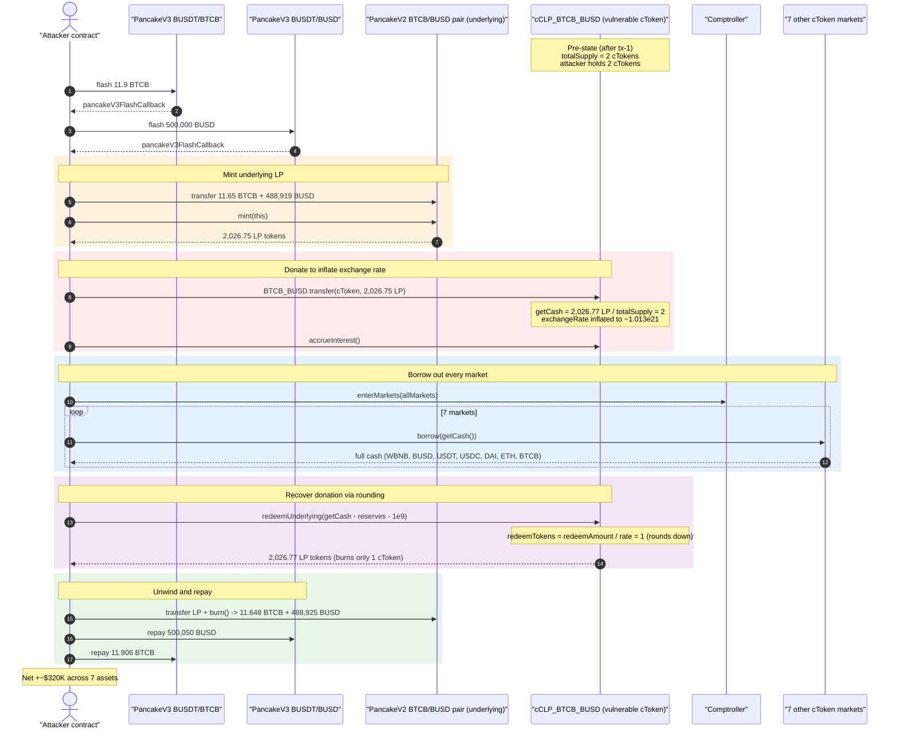
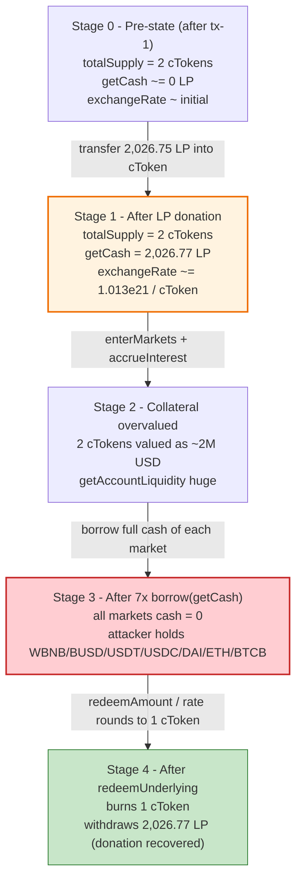
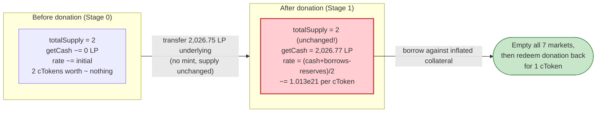

# Channels Finance Exploit — Compound-Fork Exchange-Rate Inflation via Donated Underlying

> **Reproduction:** the PoC compiles & runs in an isolated Foundry project at
> [this project folder](.) (the umbrella DeFiHackLabs repo does not whole-compile, so this PoC was
> extracted). Full verbose trace: [output.txt](output.txt). PoC source: [test/ChannelsFinance_exp.sol](test/ChannelsFinance_exp.sol).
>
> **Source availability:** every Channels Finance contract (cToken proxies, the shared `CErc20Delegate`
> implementation, the Comptroller, and the price oracle) is **UNVERIFIED** on BscScan, so no verified
> source could be downloaded. Channels Finance is a well-documented Compound-v2 fork; the vulnerable
> logic below is reconstructed from the canonical Compound `CToken` implementation and corroborated
> line-by-line against the live execution trace.

---

## Key info

| | |
|---|---|
| **Loss** | ~$320,000 across 7 markets (WBNB, BUSD, USDT, USDC, DAI, ETH, BTCB) |
| **Vulnerable contract** | `cCLP_BTCB_BUSD` (Channels Compound-fork cToken) — [`0x93790C641D029D1cBd779D87b88f67704B6A8F4C`](https://bscscan.com/address/0x93790C641D029D1cBd779D87b88f67704B6A8F4C) (UNVERIFIED) |
| **Vulnerable impl (delegate)** | [`0xBEBA905188a00b8C2FA2789E2550A3A3144b1C8f`](https://bscscan.com/address/0xBEBA905188a00b8C2FA2789E2550A3A3144b1C8f) (UNVERIFIED) |
| **Victim / drained markets** | Channels Comptroller [`0xFC518333F4bC56185BDd971a911fcE03dEe4fC8c`](https://bscscan.com/address/0xFC518333F4bC56185BDd971a911fcE03dEe4fC8c) + all 7 borrowable cToken pools |
| **Underlying LP token** | PancakeSwap V2 `BTCB/BUSD` LP — `0xF45cd219aEF8618A92BAa7aD848364a158a24F33` |
| **Attacker EOA** | [`0x20395d8e8a11cfd2541b942afdb810b7dcc64681`](https://bscscan.com/address/0x20395d8e8a11cfd2541b942afdb810b7dcc64681) |
| **Attacker contract** | [`0x07e536F23a197F6FB76F42aD01ac2Bcdc3BF738E`](https://bscscan.com/address/0x07e536F23a197F6FB76F42aD01ac2Bcdc3BF738E) |
| **First attack tx** | `0x711cc4ceb9701d317fe9aa47187425e16dae7d5a0113f1430e891018262f8fb5` |
| **Second attack tx** | `0x93372ce9c86a25f1477b0c3068e745b5b829d5b58025bb1ab234230d3473b776` |
| **Chain / block / date** | BSC / 34,806,205 / Dec 30, 2023 |
| **Compiler** | PoC pragma `^0.8.10` (project built under EVM `cancun`) |
| **Bug class** | Compound-fork cToken exchange-rate inflation via direct underlying donation (no virtual shares / no minimum first-mint) |

---

## TL;DR

`cCLP_BTCB_BUSD` is a Channels Finance money-market backed by the PancakeSwap **BTCB/BUSD LP token** as
its underlying. Like every Compound-v2 cToken, its exchange rate is

```
exchangeRate = (getCash() + totalBorrows − totalReserves) / totalSupply
```

The attacker first drove the cToken's **`totalSupply` down to 2 wei** of cTokens (in the un-recreated
first tx), then in the second tx **directly transferred ~2,026 BTCB/BUSD LP tokens of underlying into
the cToken** (a "donation"). Because `getCash()` is measured from the contract's *actual* underlying
balance (via the MasterChef `userInfo` stake position), the numerator exploded while the denominator
stayed at 2 — inflating the exchange rate to roughly **`2,026e21 underlying per 1 cToken`**.

With that inflated rate:

1. **Collateral overvaluation** — the attacker's 1–2 cTokens were now "worth" ~$2M of collateral, so
   `Comptroller.getAccountLiquidity` granted enormous borrowing power.
2. **Drain by borrowing** — the attacker called `borrow(getCash())` on all 7 other markets, sweeping
   100% of the cash out of cWBNB, cBUSD, cUSDT, cUSDC, cDAI, cETH and cBTC (trace lines
   [564](output.txt), [1504](output.txt), [2444](output.txt), [3386](output.txt), [4334](output.txt),
   [5274](output.txt), [6214](output.txt)).
3. **Recover the donation via the rounding bug** — `redeemUnderlying(getCash − reserves − 1e9)` burned
   only **1 cToken** to pull back **2,026.77 LP tokens** of underlying
   ([trace line 913: `Redeem(... redeemAmount: 2.026e21, redeemTokens: 1)`](output.txt)).

The entire operation is bootstrapped with PancakeSwap V3 flash loans (BTCB then BUSD), used only to
mint the LP tokens that are donated; everything is repaid in the same transaction. The net take is the
seven borrowed balances, ≈ **$320K**.

---

## Background — what Channels Finance is

Channels Finance is a **Compound v2 fork** lending market on BNB Chain. As in Compound:

- Each market is a **cToken** (`CErc20Delegate` behind a delegator proxy). Suppliers `mint` cTokens by
  depositing the underlying; the cToken's `exchangeRateStored()` converts between cTokens and underlying.
- A **Comptroller** (`0xFC518…`) tracks per-account collateral and enforces `borrowAllowed` /
  `redeemAllowed` using each market's `getAccountSnapshot` (cToken balance × exchange rate × collateral
  factor) and a price oracle (`0x089631…`).
- The unusual market here is `cCLP_BTCB_BUSD`, whose **underlying is a PancakeSwap LP token** that the
  cToken auto-stakes into a MasterChef-style farm (`0x73feaa1eE314F8c655E354234017bE2193C9E24E`,
  `userInfo(365, cToken)`). Consequently `getCash()` reads the farm's recorded stake
  ([trace lines 7148–7155](output.txt)) rather than a plain `balanceOf`.

The critical accounting identity, identical to upstream Compound `CToken.exchangeRateStoredInternal()`:

```solidity
// Compound v2 CToken.sol — canonical (Channels impl is UNVERIFIED but is a fork of this)
function exchangeRateStoredInternal() internal view returns (uint) {
    uint _totalSupply = totalSupply;
    if (_totalSupply == 0) {
        return initialExchangeRateMantissa;            // only when supply is exactly 0
    } else {
        uint totalCash = getCashPrior();               // = actual underlying held / staked
        uint cashPlusBorrowsMinusReserves =
            totalCash + totalBorrows - totalReserves;
        uint exchangeRate =
            cashPlusBorrowsMinusReserves * expScale / _totalSupply; // ⚠️ scales with donated cash
        return exchangeRate;
    }
}
```

Because `totalCash` is derived from the contract's *real* underlying balance, **anyone can inflate the
exchange rate by transferring underlying straight to the contract** — there is no virtual-share offset
and no minimum-liquidity lock. This is the canonical "Compound-fork first-depositor / donation"
vulnerability class (Hundred Finance, Midas, Onyx, etc.).

---

## The vulnerable code

Channels' on-chain bytecode is unverified, but the trace proves the implementation is the stock
Compound v2 `CToken`. The two routines that compose into the exploit:

### 1. Exchange rate scales linearly with donated underlying

```solidity
// numerator = cash (donated underlying) + borrows − reserves ; denominator = totalSupply
exchangeRate = (getCash() + totalBorrows − totalReserves) * 1e18 / totalSupply;
```

Trace evidence: after the attacker donates the LP, `getCash()` returns
**2,026,767,716,901,274,906,132** (`= 2026.77 LP`) while `totalSupply == 2`
([log line 14: "Total supply value in vulnerable contract after first attack tx: 2"](output.txt),
[getCash trace line ~7150](output.txt)). The rate is therefore ≈ `1.013e21 underlying / cToken`.

### 2. `redeemUnderlying` rounds the cTokens-to-burn *down*

```solidity
// Compound v2 CToken.redeemFresh(redeemTokensIn = 0, redeemAmountIn = redeemAmount)
redeemTokens = redeemAmountIn * 1e18 / exchangeRateMantissa;   // ⚠️ integer division, rounds toward 0
// burn `redeemTokens` cTokens, transfer out `redeemAmount` underlying
```

With the exchange rate at ~`1.013e21`, redeeming `2,026.77e18` underlying computes
`redeemTokens = 2026.77e21 / 1.013e21 ≈ 1` cToken (rounded down).
Trace evidence — [line 913](output.txt):

```
emit Redeem(redeemer: ContractTest, redeemAmount: 2026767690195621764176 [2.026e21], redeemTokens: 1)
```

i.e. **1 cToken burned, 2,026.77 LP tokens withdrawn**, returning the attacker's donated capital almost
in full (the PoC comment notes this exact rounding behaviour).

### 3. `borrow` trusts the inflated collateral value

`Comptroller.borrowAllowed` → `getHypotheticalAccountLiquidity` multiplies the attacker's cToken
balance by `exchangeRate × collateralFactor × oraclePrice`. With the rate inflated ~`1e21×`, the
1–2 cTokens count as millions of dollars of collateral, so each `borrow(getCash())` passes the liquidity
check and empties the target market ([borrow trace lines 564 / 1504 / 2444 / 3386 / 4334 / 5274 / 6214](output.txt)).

---

## Root cause — why it was possible

The Compound-v2 exchange-rate formula treats **all underlying physically held by the cToken** as backing
for the outstanding cToken supply. It assumes underlying only enters through `mint` (which atomically
mints matching cTokens). It has **no defense against a direct token transfer ("donation")** that adds
cash without adding supply.

Channels inherited this verbatim. The attack chains three consequences of that single flaw:

1. **Donation inflates the rate.** Transferring 2,026.77 LP tokens into a cToken with `totalSupply == 2`
   makes each cToken redeemable for ~half the donated pile, and worth ~$1M of collateral.
2. **Inflated rate is trusted as collateral.** The Comptroller computes borrowing power from
   `cTokenBalance × exchangeRate`, so a near-empty supply with a huge cash balance grants borrowing
   power vastly exceeding the attacker's real stake — letting them borrow out every other market.
3. **`redeemUnderlying` rounds cTokens-to-burn down**, so the attacker recovers the donated underlying
   for the price of a single cToken (1 wei), losing nothing on the donation itself.

The first transaction (not recreated in the PoC; see the PoC comment block at
[test/ChannelsFinance_exp.sol:68-71](test/ChannelsFinance_exp.sol#L68)) is what drove `totalSupply`
down to 2 — a low supply is the precondition that makes a modest donation produce an astronomically
high exchange rate. The second transaction (reproduced here) performs the donation, the borrows, and the
redemption.

---

## Preconditions

- **Low cToken supply** — `cCLP_BTCB_BUSD.totalSupply()` reduced to **2** before the donation
  ([log: "Total supply value … after first attack tx: 2"](output.txt)). A tiny denominator is what lets
  a donation blow up the exchange rate; this is set up in the first (un-recreated) tx.
- **LP underlying obtainable on demand** — the attacker mints BTCB/BUSD LP from PancakeSwap V2 using
  flash-loaned BTCB + BUSD, so the ~$2M donation needs no upfront capital.
- **Markets hold borrowable cash** — the 7 other Channels markets must have non-trivial `getCash()` to be
  worth draining (they did).
- **No virtual-shares / minimum-liquidity protection** in the cToken (the Compound-fork default).

> **PoC note:** the test does **not** replay the first tx (the author hit an underflow when recreating
> the borrower-liquidation step). Instead it `deal`s 2 PancakeSwap tokens, reads the post-tx state
> (`totalSupply == 2`, attacker holds 2 cTokens), and `transferFrom`s those 2 cTokens to itself so it can
> redeem the donated underlying. The second-tx exploit (donation → borrow → redeem) is reproduced
> faithfully and **passes**.

---

## Attack walkthrough (with on-chain numbers from the trace)

The PoC's `testExploit()` triggers a PancakeSwap V3 BTCB/BUSDT flash, which nests a BUSDT/BUSD flash; the
inner `pancakeV3FlashCallback` does all the work. All figures are from [output.txt](output.txt).

| # | Step | Concrete values (from trace) | Effect |
|---|------|------------------------------|--------|
| 0 | **Pre-state after tx-1** | `cCLP.totalSupply = 2`; attacker holds **2** cCLP cTokens; attacker pre-funded with **2.0 PancakeSwapToken** | Tiny denominator primed for donation. |
| 1 | **Flash BTCB** — `BUSDT_BTCB.flash(…, 11,900e15)` | 11.9 BTCB borrowed ([line 8156, fee 0.00595 BTCB](output.txt)) | Working BTCB for LP mint. |
| 2 | **Flash BUSD** — `BUSDT_BUSD.flash(…, 500,000e18)` | 500,000 BUSD borrowed ([line 8140, fee 50 BUSD](output.txt)) | Working BUSD for LP mint. |
| 3 | **Mint BTCB/BUSD LP** — transfer `reserveBTCB×1.15` + `reserveBUSD×1.15`, then `BTCB_BUSD.mint(this)` | initial reserves `10.13 BTCB / 425,147 BUSD`; deposited `11.65 BTCB / 488,919 BUSD`; **minted 2,026.75 LP** ([line 9 mint Transfer](output.txt)) | Attacker now holds ~2,026.75 LP underlying. |
| 4 | **Donate LP to cToken** — `BTCB_BUSD.transfer(cCLP, balance)` | **2,026.75 LP** sent to `cCLP_BTCB_BUSD` ([transfer to vulnerable contract](output.txt)) | `getCash()` jumps to ~2,026.77 LP; rate ≈ `1.013e21`/cToken. |
| 5 | **`accrueInterest()` + `enterMarkets(allMarkets)`** | enters all Channels markets as collateral | Activates the inflated cTokens as collateral. |
| 6 | **Borrow every market's full cash** — `borrow(getCash())` ×7 | cWBNB **46.348**, cBUSD **30,563.16**, cUSDT **178,930.19**, cUSDC **4,528.37**, cDAI **2,974.77**, cETH **14.654**, cBTC **1.3252** ([borrow lines](output.txt)) | All 7 markets emptied into attacker. |
| 7 | **Recover donation via rounding** — `redeemUnderlying(getCash − totalReserves − 1e9)` | `getCash 2,026,767,716,901,274,906,132` − `reserves 26,704,653,141,956` − `1e9` = **`2,026,767,690,195,621,764,176`** redeemed; **burns only 1 cToken** ([Redeem line 913](output.txt)) | Donated ~2,026.77 LP pulled back for 1 cToken. |
| 8 | **Burn LP → recover BTCB+BUSD; repay flashes** | LP `burn` returns **11.648 BTCB + 488,925 BUSD** ([Burn line 8118](output.txt)); repays 500,050 BUSD and 11.906 BTCB | Flash loans + fees repaid in-tx. |

### Borrowed amounts = the stolen funds

| Market | Borrowed (full `getCash`) |
|---|---:|
| cWBNB | 46.347850759575717716 WBNB |
| cBUSD | 30,563.160505593914423978 BUSD |
| cUSDT | 178,930.185523196372031135 USDT |
| cUSDC | 4,528.366501412365699137 USDC |
| cDAI | 2,974.769886904760157135 DAI |
| cETH | 14.653643136719662893 ETH |
| cBTC | 1.325184125030886443 BTCB |

### Profit accounting (net, after flash repayment)

The PoC's end-of-test balances are the **net profit** retained after every flash loan + fee was repaid
and the donated LP was burned back into its constituents:

| Asset | Net to attacker |
|---|---:|
| WBNB | 46.347850759575717716 |
| BUSD | 30,518.685194027130799517 |
| USDT (BUSDT) | 178,930.185523196372031135 |
| BTCB | 1.319274177267505847 |
| ETH | 14.653643136719662893 |
| USDC | 4,528.366501412365699137 |
| DAI | 2,974.769886904760157135 |

(The small deltas vs. the borrowed column — e.g. BUSD 30,563 → 30,519, BTCB 1.325 → 1.319 — are the
flash-loan fees and LP round-trip dust paid back in the same transaction.) Total realized ≈ **$320K**,
matching the PoC header.

---

## Diagrams

### Sequence of the attack



### cToken state / exchange-rate evolution



### Why the donation is theft: the exchange-rate identity



---

## Remediation

1. **Add a virtual-shares / dead-shares offset to the exchange rate.** Compute the rate as
   `(cash + borrows − reserves + VIRTUAL_ASSETS) / (totalSupply + VIRTUAL_SHARES)`. With a non-zero
   virtual offset, a donation no longer scales the rate without bound, and the 2-supply edge case becomes
   harmless. (This is the OpenZeppelin ERC-4626 / Compound-hardening standard fix.)
2. **Burn a minimum amount of cTokens on the first mint** (permanent dead shares) so `totalSupply` can
   never be driven down to a handful of wei where a donation dominates the denominator.
3. **Do not derive `getCash()` from a manipulable physical balance alone.** Track supplied principal
   internally (an accounting variable incremented only on `mint`/`redeem`) and ignore unsolicited
   transfers, instead of reading the live underlying / farm-stake balance that anyone can inflate.
4. **Round cToken burns in `redeemUnderlying` *up*, not down**, and require `redeemTokens > 0`. Rounding
   down lets the attacker withdraw underlying for fewer cTokens than the rate dictates; rounding in the
   protocol's favor closes the "recover the donation for 1 wei" leg.
5. **Cap how much a single account's collateral value can change within a block**, or use a time-weighted
   exchange rate for collateral valuation, so a donation cannot instantly mint borrowing power.
6. **Seed every new market with protocol-owned liquidity** before it is enabled as collateral, so it is
   never in the low-supply state the attack requires.

---

## How to reproduce

The PoC was extracted into a standalone Foundry project (the umbrella DeFiHackLabs repo does not
whole-compile under `forge test`):

```bash
_shared/run_poc.sh 2023-12-ChannelsFinance_exp -vvvvv
```

- RPC: a **BSC archive** endpoint is required (fork block 34,806,205 is from Dec 2023, long pruned by
  most public nodes). `foundry.toml` uses `https://bsc-mainnet.public.blastapi.io`, which serves
  historical state at that block. Public endpoints rate-limit (HTTP 429) on the ~11.5M-gas trace, so a
  retry may be needed; `bsc.drpc.org` returns `historical state not available` (not deep-archive).
- Result: `[PASS] testExploit()` — the post-attack log lines show the seven stolen balances.

Expected tail:

```
Exploiter WBNB balance after attack: 46.347850759575717716
Exploiter BUSD balance after attack: 30518.685194027130799517
Exploiter BUSDT balance after attack: 178930.185523196372031135
Exploiter BTCB balance after attack: 1.319274177267505847
Exploiter ETHToken balance after attack: 14.653643136719662893
Exploiter USDC balance after attack: 4528.366501412365699137
Exploiter DAI balance after attack: 2974.769886904760157135

Ran 1 test for test/ChannelsFinance_exp.sol:ContractTest
[PASS] testExploit() (gas: 11802817)
Suite result: ok. 1 passed; 0 failed; 0 skipped
```

---

*Reference: @AnciliaInc — https://twitter.com/AnciliaInc/status/1741353303542501455 (Channels Finance, BSC, ~$320K).
All Channels Finance contracts are unverified on BscScan; vulnerable logic shown is the canonical
Compound v2 `CToken` that Channels forks, corroborated against the live trace in [output.txt](output.txt).*
