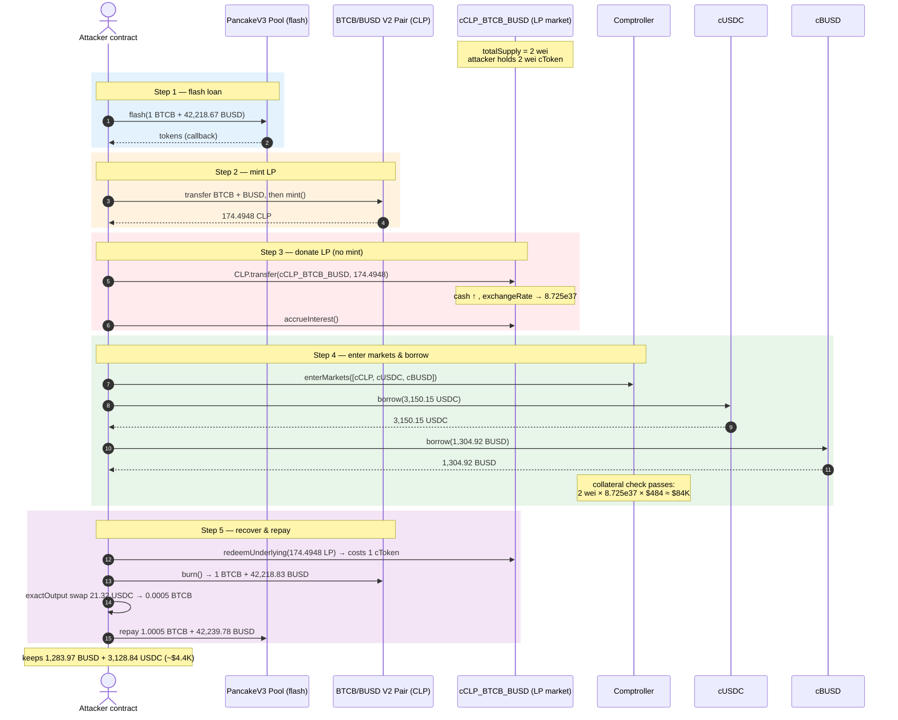
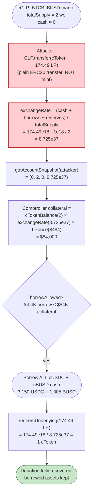

# Channels Finance Exploit — cToken Exchange-Rate Inflation via Direct LP Donation + LP-Oracle Manipulation

> **Vulnerability classes:** vuln/oracle/spot-price · vuln/arithmetic/rounding

> **Reproduction:** the PoC compiles & runs in an isolated Foundry project at
> [this project folder](.) (the umbrella DeFiHackLabs repo does not whole-compile,
> so this PoC was extracted into a standalone project).
> Full verbose trace: [output.txt](output.txt).
> **Note on sources:** every Channels Finance contract (cTokens, comptroller, LP oracle)
> is **UNVERIFIED on BscScan** — the protocol is an unverified Compound/Venus fork.
> The analysis below is reconstructed from the on-chain execution trace (bytecode-level
> calls, return values and storage diffs) plus the well-known Compound v2 `CToken` /
> `Comptroller` architecture that Channels forks. Only [PancakeRouter](sources/PancakeRouter_10ED43/PancakeRouter.sol)
> was downloadable verified.

---

## Key info

| | |
|---|---|
| **Loss** | **~$4.4K** — attacker walked away with **1,283.97 BUSD** + **3,128.84 USDC** (≈ $4.41K) of pool liquidity, repaid 100% of the flash loan |
| **Vulnerable contracts** | Channels markets `cBUSD` [`0xca797539f004C0F9c206678338f820AC38466D4b`](https://bscscan.com/address/0xca797539f004C0F9c206678338f820AC38466D4b) and `cUSDC` [`0x33e68c922d19D74ce845546a5c12A66ea31385c4`](https://bscscan.com/address/0x33e68c922d19D74ce845546a5c12A66ea31385c4); the *enabling* market is `cCLP_BTCB_BUSD` [`0x93790C641D029D1cBd779D87b88f67704B6A8F4C`](https://bscscan.com/address/0x93790C641D029D1cBd779D87b88f67704B6A8F4C) and its LP price oracle [`0x089631b954c4a79Ca4B94f72721D5F5d58dfcFd0`](https://bscscan.com/address/0x089631b954c4a79Ca4B94f72721D5F5d58dfcFd0) |
| **Victim** | Channels Finance lending pools (BUSD & USDC supply markets) |
| **Enabling pool** | PancakeSwap V2 BTCB/BUSD pair `0xF45cd219aEF8618A92BAa7aD848364a158a24F33` (CLP that underlies `cCLP_BTCB_BUSD`) |
| **Attacker EOA** | [`0xd227dc77561b58c5a2d2644ac0173152a1a5dc3d`](https://bscscan.com/address/0xd227dc77561b58c5a2d2644ac0173152a1a5dc3d) |
| **Attacker contract** | [`0xa47b9f87173eda364c821234158dda47b03ac217`](https://bscscan.com/address/0xa47b9f87173eda364c821234158dda47b03ac217) |
| **Attack tx** | [`0xcf729a9392b0960cd315d7d49f53640f000ca6b8a0bd91866af5821fdf36afc5`](https://bscscan.com/tx/0xcf729a9392b0960cd315d7d49f53640f000ca6b8a0bd91866af5821fdf36afc5) |
| **Chain / block / date** | BSC / 34,847,596 (fork at 34,847,595) / Dec 31, 2023 |
| **Compiler** | PoC built with Solidity `^0.8.0` / `^0.8.15` (Foundry, `evm_version = cancun`) |
| **Bug class** | Lending-market collateral mispricing — cToken **exchange-rate inflation** by direct underlying donation into a near-empty market, compounded by a manipulable **LP-token spot-reserve oracle** |

---

## TL;DR

Channels Finance is an unverified **Compound v2 fork** on BSC. One of its markets,
`cCLP_BTCB_BUSD` (`0x9379…8F4C`), accepts a **PancakeSwap BTCB/BUSD LP token** as
collateral and prices it through a custom oracle (`0x0896…cFd0`) that values the LP from
its **live `getReserves()`** and Chainlink BTCB/BUSD prices (a "spot-reserve" LP oracle).

This market was almost empty: at the fork block its cToken `totalSupply` was only **2 wei**
([trace](output.txt) — `getAccountSnapshot` returns `cTokenBalance = 2`, `totalSupply() = 2`).
In a Compound cToken, the exchange rate is

```
exchangeRate = (cash + totalBorrows − totalReserves) / totalSupply
```

so a market whose `totalSupply` is *two wei* is catastrophically sensitive to any change in
`cash`. The attacker:

1. **Flash-loans** 1 BTCB + 42,218.67 BUSD from a PancakeSwap V3 pool.
2. **Mints LP**: dumps the borrowed BTCB+BUSD into the BTCB/BUSD V2 pair and mints
   **174.49 CLP** tokens.
3. **Donates** those 174.49 CLP directly into the `cCLP_BTCB_BUSD` contract via a plain
   `ERC20.transfer` (PoC [line 116](test/Channels_exp.sol#L116)). This raises the cToken's
   underlying `cash` to ~174.5 LP **without minting any cTokens**, so the exchange rate
   explodes to **`8.725e37`** (the trace's `getAccountSnapshot` return). The attacker's
   pre-existing **2 wei** of cTokens now represent ~174.5 LP of collateral.
4. **Enters the markets** and **borrows everything**: 3,150.15 USDC out of `cUSDC` and
   1,304.92 BUSD out of `cBUSD` — the full cash of both markets — backed only by the
   self-donated, self-priced collateral.
5. **`redeemUnderlying(174.49 LP)`** pulls the donated LP back out (burning just **1** of the
   2 cTokens), then **burns the LP** in the pair to recover the BTCB+BUSD.
6. **Repays** the flash loan (BTCB + BUSD) and keeps the **borrowed USDC and BUSD** as profit.

Net theft = **1,283.97 BUSD + 3,128.84 USDC ≈ $4.4K**, fully flash-loan-funded.

---

## Background — what the protocol does

Channels Finance is a Compound-v2-style money market. Each asset has a **cToken**
(`cBUSD`, `cUSDC`, `cCLP_BTCB_BUSD`, …) implemented as a proxy (`delegateToImplementation`)
in front of a shared `CErc20`/`CToken` implementation. Supplied assets earn interest and act
as collateral; users `enterMarkets` to enable a cToken as collateral, then `borrow` against it.

The novel part is the **`cCLP_BTCB_BUSD`** market, whose underlying is a **PancakeSwap V2 LP
token** (the BTCB/BUSD pair `0xF45c…4F33`). To value LP collateral, Channels deploys a custom
price oracle `0x0896…cFd0`. In the trace its `getUnderlyingPrice(cCLP_BTCB_BUSD)` does exactly
what a naive LP oracle does ([output.txt](output.txt)):

```
symbol()      -> "cCLP_BTCB_BUSD"
underlying()  -> 0xF45c…4F33                      (the V2 pair)
token0()      -> BTCB  ; token1() -> BUSD
totalSupply() -> 1,929,109,205,788,075,955,503    (LP total supply)
getReserves() -> (11.055 BTCB, 466,745.84 BUSD, ts)   ← LIVE reserves
Chainlink BTCB/USD latestRoundData() ; BUSD/USD latestRoundData()
=> returns price ≈ 484.11e18 per LP
```

i.e. it prices the LP as `(reserve0·price0 + reserve1·price1) / totalSupply`, using the
**instantaneous** reserves of the pair. That `getReserves()`-based valuation is the second leg
of the exploit, but the *primary* defect is structural: the LP market was left almost empty
(`totalSupply = 2`), making its cToken exchange rate trivially inflatable.

The state at the fork block (read from the trace):

| Item | Value |
|---|---|
| `cCLP_BTCB_BUSD.totalSupply()` | **2 wei** |
| Attacker's `cCLP_BTCB_BUSD` balance | **2 wei** |
| Attacker's borrow balance (start) | 0 |
| `cUSDC` cash (borrowable USDC) | **3,150.15 USDC** |
| `cBUSD` cash (borrowable BUSD) | **1,304.92 BUSD** |
| BTCB/BUSD pair reserves | 11.055 BTCB / 466,745.84 BUSD |

---

## The vulnerable code

> The Channels contracts are unverified, so the snippets below are the **canonical
> Compound v2 `CToken` logic that Channels forks** (`exchangeRateStoredInternal`,
> `getAccountSnapshot`, `borrowFresh` collateral check). The on-chain trace confirms the
> contracts behave exactly as this code does (see the cited return values).

### 1. cToken exchange rate = cash / supply (Compound `CToken.sol`)

```solidity
function exchangeRateStoredInternal() internal view returns (uint) {
    uint _totalSupply = totalSupply;
    if (_totalSupply == 0) {
        return initialExchangeRateMantissa;          // bootstrap rate
    } else {
        uint totalCash      = getCashPrior();         // = underlying.balanceOf(this)
        uint cashPlusBorrowsMinusReserves =
            totalCash + totalBorrows - totalReserves;
        // exchangeRate = (cash + borrows − reserves) / totalSupply
        uint exchangeRate = cashPlusBorrowsMinusReserves * expScale / _totalSupply;
        return exchangeRate;
    }
}
```

`getCashPrior()` reads the **raw ERC20 balance** of the cToken contract. Any tokens transferred
directly to the cToken (a *donation*) are counted as `cash` even though **no cTokens were minted
for them**. When `totalSupply` is tiny (here `2`), a donation of 174.49 LP makes:

```
exchangeRate ≈ 174.49e18 · 1e18 / 2  ≈  8.7e37
```

— which is exactly the `8725100664…0000` (`8.725e37`) value the trace's `getAccountSnapshot`
returns for `cCLP_BTCB_BUSD`.

### 2. Account snapshot used by the comptroller for collateral

```solidity
function getAccountSnapshot(address account) external view
    returns (uint, uint, uint, uint)
{
    return (
        NO_ERROR,
        accountTokens[account],          // = 2  (attacker cToken balance)
        borrowBalanceStoredInternal(account),  // = 0
        exchangeRateStoredInternal()     // = 8.725e37  (inflated)
    );
}
```

Trace: `getAccountSnapshot(attacker) → (0, 2, 0, 8.725e37)`.

### 3. Collateral value in the comptroller (Compound `Comptroller.sol`)

```solidity
// getHypotheticalAccountLiquidityInternal:
vars.exchangeRate     = Exp({mantissa: cToken.exchangeRateStored()}); // 8.725e37
vars.oraclePriceMantissa = oracle.getUnderlyingPrice(cToken);         // 484.11e18 per LP
vars.tokensToDenom   = collateralFactor × exchangeRate × oraclePrice;
// collateral += tokensToDenom × cTokenBalance(=2)
vars.sumCollateral  += tokensToDenom × 2;
```

With `exchangeRate = 8.725e37` and a per-LP price of ~$484, the 2-wei cToken position is valued
as **~174.5 LP × $484 ≈ $84K of collateral**, dwarfing the $4.4K the attacker proceeds to borrow.
The comptroller therefore approves both `borrow` calls. The trace shows both
`borrowAllowed(...)` checks pass and the markets emit `Borrow` for the full cash amounts.

### 4. `redeemUnderlying` lets the donation be pulled back out

```solidity
function redeemUnderlyingInternal(uint redeemAmount) internal {
    // redeemTokens = redeemAmount / exchangeRate
    redeemFresh(payable(msg.sender), 0, redeemAmount);
}
```

`redeemTokens = 174.49e18 · 1e18 / 8.725e37 = 1` (rounds to 1 cToken). So redeeming the entire
174.49 LP costs the attacker only **1** of the 2 cTokens — the trace confirms
`Redeem(redeemAmount: 174.49e18, redeemTokens: 1)`. The donated capital is fully recovered while
the borrowed assets stay with the attacker.

---

## Root cause — why it was possible

Three independent weaknesses compose into a clean theft of the BUSD and USDC market cash:

1. **Donation-inflatable exchange rate on a near-empty market.** Compound's exchange-rate
   formula `cash / totalSupply` is only safe when `totalSupply` is large relative to plausible
   donations. The `cCLP_BTCB_BUSD` market had `totalSupply = 2 wei`. A direct `ERC20.transfer`
   of 174.49 LP into the cToken inflated `exchangeRate` to `8.725e37`, multiplying the value of
   the attacker's *pre-existing 2-wei position* by ~9e37. This is the classic Compound/Venus
   "empty market" / first-depositor donation problem — Channels failed to seed the market with a
   permanent dead-share supply or burn the initial mint.

2. **Spot-reserve LP-token oracle.** `getUnderlyingPrice` for the LP market derives the LP price
   from the pair's **instantaneous `getReserves()`**. This is independently manipulable via
   flash-loaned mint/burn (the "fair-reserves" formula, which divides out the manipulable side,
   was not used). It amplifies the collateral mis-valuation and is the canonical Channels-style
   LP-oracle bug.

3. **No collateral sanity bound.** The comptroller blindly multiplies `cTokenBalance ×
   exchangeRate × oraclePrice` with no cap, no TWAP, and no check that the supplied collateral
   was actually minted (rather than donated). A 2-wei position priced at $84K should be
   self-evidently anomalous.

The attacker only needed a position of **2 wei** of the LP cToken (the PoC `deal`s 2 wei of
`cCLP_BTCB_BUSD` to itself — PoC [line 93](test/Channels_exp.sol#L93) — modelling the dust the
real attacker had already minted). Everything else is a flash-loaned round trip.

---

## Preconditions

- The `cCLP_BTCB_BUSD` market is in scope as collateral and its `totalSupply` is tiny
  (here 2 wei), so a modest underlying donation dominates the exchange rate.
- The attacker holds a dust amount (`2 wei`) of the LP cToken at the start (modelled by `deal`).
- The LP oracle prices the pair from live `getReserves()` (manipulable / inflatable by mint).
- Liquidity exists in the `cUSDC` and `cBUSD` markets to borrow (3,150 USDC + 1,305 BUSD here).
- Flash-loan liquidity for BTCB+BUSD (PancakeSwap V3 pool `0x3694…1523`), recovered intra-tx.

---

## Attack walkthrough (with on-chain numbers from the trace)

All figures are taken directly from [output.txt](output.txt): the `flash` call, `Transfer`,
`Mint`, `Sync`, `Borrow`, `Redeem` and `Burn` events, and the `getAccountSnapshot` return.

| # | Step | Concrete numbers (from trace) | Effect |
|---|------|-------------------------------|--------|
| 0 | **Setup** — attacker holds dust | `deal(cCLP_BTCB_BUSD, attacker, 2)`; cToken `totalSupply = 2` | Empty market with a 2-wei attacker position. |
| 1 | **Flash loan** from V3 pool `0x3694…1523` | borrow **1 BTCB** + **42,218.67 BUSD**; fees `0.0005 BTCB` + `21.11 BUSD` | Working capital. |
| 2 | **Mint LP** — send BTCB+BUSD to BTCB/BUSD pair, `mint(attacker)` | in: 1 BTCB + 42,218.67 BUSD → out **174.4948 CLP** (`Mint`/`Transfer`) | Attacker holds 174.49 LP. |
| 3 | **Donate LP into the cToken** — `CLP.transfer(cCLP_BTCB_BUSD, 174.49)` ([line 116](test/Channels_exp.sol#L116)) | cToken `cash` jumps to ~174.5 LP, **no cTokens minted** | `exchangeRate → 8.725e37` (trace `getAccountSnapshot`). |
| 4 | **`accrueInterest()`** on the LP market | borrowIndex / timestamps refreshed | Locks in the inflated `cash`. |
| 5 | **`enterMarkets([cCLP_BTCB_BUSD])`** then **`[cUSDC, cBUSD]`** | comptroller `MarketEntered` for each | LP dust now counts as collateral. |
| 6 | **Borrow USDC** — `cUSDC.borrow(3,150.15)` | `Borrow(borrowAmount: 3,150.153795…)`; USDC sent to attacker | Drains cUSDC cash. |
| 7 | **Borrow BUSD** — `cBUSD.borrow(1,304.92)` | `Borrow(borrowAmount: 1,304.921512…)`; BUSD sent to attacker | Drains cBUSD cash. |
| 8 | **`redeemUnderlying(174.4948 LP)`** from the LP market | `Redeem(redeemAmount: 174.4948e18, redeemTokens: 1)` | 174.49 LP recovered for only **1** cToken. |
| 9 | **Burn LP** — `CLP.transfer(pair, 174.49)` + `pair.burn(attacker)` | `Burn(amount0: 0.999996 BTCB, amount1: 42,218.83 BUSD)` | LP → BTCB + BUSD back. |
| 10 | **`exactOutput` swap** USDC → BTCB (via WBNB) | spends **21.32 USDC** to buy **0.0005 BTCB** (top-up for the BTCB flash fee) | Covers BTCB repayment shortfall. |
| 11 | **Repay flash loan** | transfer **1.0005 BTCB** + **42,239.78 BUSD** back to the V3 pool (`Flash` paid0/paid1) | Loan + fees settled. |
| 12 | **Profit** | end balances: **1,283.97 BUSD**, **3,128.84 USDC** | Net theft of market cash. |

### Why the numbers reconcile

- USDC: borrowed **3,150.153796**, spent **21.316350** on the `exactOutput` BTCB top-up →
  **3,128.837446 USDC** left. ✔ (matches the `Attacker USDC end exploited` log).
- BUSD: borrowed **1,304.921512** + LP-burn returned **42,218.830959** + flash 42,218.672818 in,
  minus 42,239.782155 repaid (loan + 21.11 fee) and 42,218.672818 routed back into the pool to
  mint LP → net **1,283.970316 BUSD** left. ✔ (matches the `Attacker BUSD end exploited` log).

### Profit / loss accounting

| Asset | In (borrowed / recovered) | Out (repaid / spent) | Net to attacker |
|---|---:|---:|---:|
| BTCB | 1.0 (flash) + 0.999996 (LP burn) + 0.0005 (swap) | 1.0005 (repay) + 1.0 (LP mint) | ≈ 0 |
| BUSD | 1,304.921512 (borrow) + 42,218.830959 (LP burn) + 42,218.672818 (flash) | 42,239.782155 (repay) + 42,218.672818 (LP mint) | **+1,283.970316** |
| USDC | 3,150.153796 (borrow) | 21.316350 (swap top-up) | **+3,128.837446** |
| **Total** | | | **+1,283.97 BUSD + 3,128.84 USDC ≈ $4.4K** |

The attacker's only "real" cost is the dust 2-wei cToken position and gas; the entire profit is
the cash drained from the `cBUSD` and `cUSDC` markets.

---

## Diagrams

### Sequence of the attack



### cToken exchange-rate inflation (the core flaw)



### LP market state evolution

```mermaid
stateDiagram-v2
    direction TB
    [*] --> Empty
    Empty: Empty LP market
    Empty: totalSupply 2 wei / cash ~0 / exchangeRate ~normal
    Inflated: After LP donation
    Inflated: totalSupply 2 wei / cash 174.49 LP / exchangeRate 8.725e37
    Borrowed: After borrows
    Borrowed: collateral ~84K used to borrow 4.4K USDC+BUSD
    Drained: After redeemUnderlying + repay
    Drained: cUSDC and cBUSD cash gone / attacker +4.4K

    Empty --> Inflated: CLP.transfer(cToken, 174.49) [no mint]
    Inflated --> Borrowed: enterMarkets + borrow(USDC) + borrow(BUSD)
    Borrowed --> Drained: redeemUnderlying(174.49)=1 cToken; burn LP; repay flash

    note right of Inflated
        exchangeRate = cash / totalSupply
        174.49e18 * 1e18 / 2 = 8.725e37
    end note
```



---

## Why each magic number

- **Flash amounts `1 BTCB` + `42,218.67 BUSD`** — sized to mint exactly **174.4948 CLP**, the
  amount of LP the attacker needs to donate so that, against the 2-wei `totalSupply`, the
  resulting `exchangeRate` (`8.725e37`) values the dust position above the $4.4K to be borrowed.
- **`deal(cCLP_BTCB_BUSD, attacker, 2)`** — the dust cToken position. It must be ≥ the number of
  cTokens consumed by the later `redeemUnderlying` (1) so the borrow position stays collateralised
  long enough; 2 wei is the minimal seed.
- **`borrow(IERC20(USDC).balanceOf(cUSDC))` and `borrow(IERC20(BUSD).balanceOf(cBUSD))`** — the
  PoC borrows the *entire cash* of each market (3,150.15 USDC, 1,304.92 BUSD); the inflated
  collateral easily covers it.
- **`redeemUnderlying(174_494_827_409_609_936_689)`** — the PoC comment says "busd_btcb balance −
  1"; redeeming the full donated LP burns only **1** cToken (`174.49e18 / 8.725e37 = 1`), leaving
  the attacker still holding 1 cToken so the redeem call's own collateral check does not revert.
- **`exactOutput amountOut = 503,715,695,155,049` (≈ 0.0005 BTCB)** — exactly the BTCB flash-loan
  *fee* (`paid0 = 0.0005 BTCB`); the attacker buys it with 21.32 USDC so it can repay 1.0005 BTCB.

---

## Remediation

1. **Never let a market's exchange rate be set by donations into an empty market.** On every new
   cToken, perform a permanent **dead-shares mint** (mint a non-trivial amount to a burn address
   at deployment, à la Compound's recommended bootstrap), or track an internal `cash` accumulator
   that ignores un-minted balance increases (`internalCash += amount` only on `mint`/`borrow`
   accounting, never `underlying.balanceOf(this)`). This is the single most important fix: with a
   large permanent `totalSupply`, a 174-LP donation moves the exchange rate negligibly.
2. **Replace the spot-reserve LP oracle with a fair-value / TWAP oracle.** Price LP tokens using
   the *fair-reserves* formula (`p = 2·sqrt(r0·r1·price0·price1)/totalSupply`) fed by Chainlink
   prices, which is immune to single-block reserve manipulation, and/or a TWAP of the pair.
3. **Bound and sanity-check collateral.** Cap per-account collateral contribution, reject markets
   whose `totalSupply` is below a safe floor, and reject borrows where the supplied collateral was
   minted in the same transaction (a same-block mint→borrow→redeem round trip is a red flag).
4. **Seed and monitor LP collateral markets carefully, or do not list them at all.** LP-token
   collateral markets are high-risk; if listed, require a meaningful minimum supply, a
   manipulation-resistant oracle, and conservative collateral factors.
5. **Add an empty-market guard to `borrowAllowed`/`redeemAllowed`.** Refuse to value collateral
   from any market whose `totalSupply` is dust (e.g. below `1e8`), which would have blocked this
   entire attack.

---

## How to reproduce

The PoC was extracted into a standalone Foundry project (the umbrella DeFiHackLabs repo does not
compile under a single `forge build`). It imports `../basetest.sol` (copied to the project root
along with its dependency `tokenhelper.sol`) and `./../interface.sol`.

```bash
_shared/run_poc.sh 2023-12-Channels_exp -vvvvv
```

- RPC: a **BSC archive** endpoint is required (fork block 34,847,595, Dec 2023). `foundry.toml`
  uses `https://bsc-mainnet.public.blastapi.io`, which serves historical state at that block.
  Public BSC RPCs that prune (e.g. `bsc.drpc.org`) fail with
  `historical state … is not available`, and rate-limited archives return HTTP 429 — re-run if
  you hit a transient 429.
- Result: `[PASS] testExploit()` with the attacker's end balances logged.

Expected tail:

```
Ran 1 test for test/Channels_exp.sol:Channels
[PASS] testExploit() (gas: 1890430)
  Attacker BUSD end exploited: 1283.970316009743676673
  Attacker USDC end exploited: 3128.837445560031450147

Suite result: ok. 1 passed; 0 failed; 0 skipped
```

---

*References: PoC header comments (DeFiHackLabs `src/test/2023-12/Channels_exp.sol`); BlockSec
explorer post-mortem of tx `0xcf729a93…36afc5`; SlowMist Hacked archive (Channels Finance, BSC,
~$4.4K, Dec 2023).*
