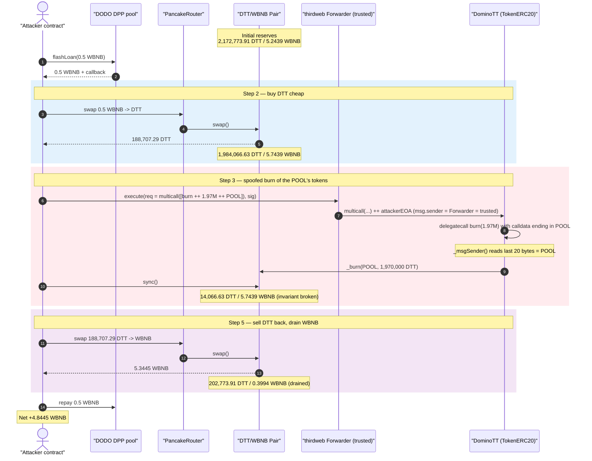
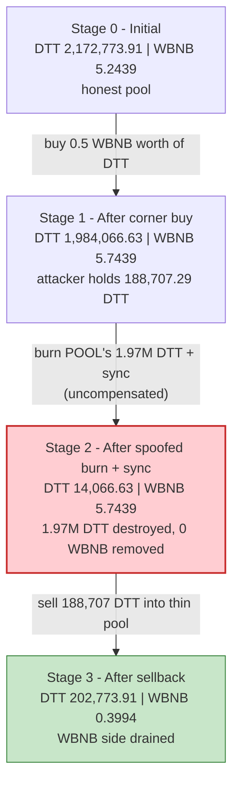
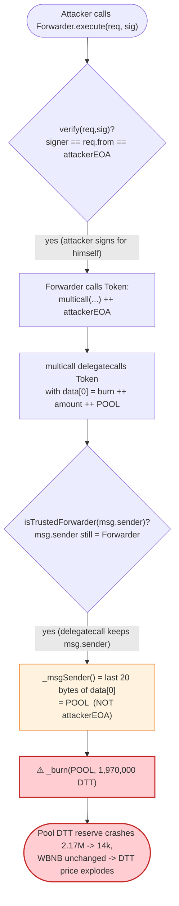
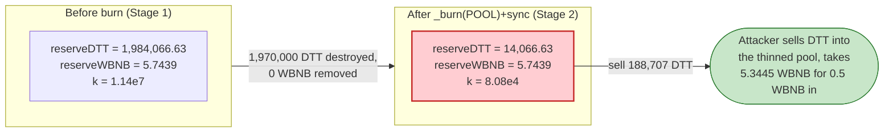

# DominoTT Exploit — thirdweb `Multicall` + `ERC2771` `_msgSender()` Spoofing Burns the Pool's Tokens

> **Vulnerability classes:** vuln/access-control/broken-logic · vuln/access-control/missing-auth

> **Reproduction:** the PoC compiles & runs in an isolated Foundry project at
> [this project folder](.) (the umbrella DeFiHackLabs repo contains many unrelated PoCs that do
> not whole-compile, so this one was extracted into a standalone Foundry project).
> Full verbose trace: [output.txt](output.txt).
> Verified vulnerable source: [contracts_token_TokenERC20.sol](sources/TokenERC20_0DaBDC/contracts_token_TokenERC20.sol).

---

## Key info

| | |
|---|---|
| **Loss** | **~4.84 WBNB** net profit to the attacker (≈5 WBNB drained from the DominoTT/WBNB pair); funded entirely by a 0.5 WBNB DODO flash loan |
| **Vulnerable contract** | `TokenERC20` (thirdweb token, deployed as "DominoTT") — [`0x0DaBDC92aF35615443412A336344c591FaEd3f90`](https://bscscan.com/address/0x0DaBDC92aF35615443412A336344c591FaEd3f90#code) |
| **Enabling contract** | thirdweb `Forwarder` (trusted ERC-2771 forwarder) — [`0x7C4717039B89d5859c4Fbb85EDB19A6E2ce61171`](https://bscscan.com/address/0x7C4717039B89d5859c4Fbb85EDB19A6E2ce61171#code) |
| **Victim pool** | DominoTT/WBNB PancakeSwap V2 pair — [`0x4f34b914D687195A73318ccC58D56D242b4dCcF6`](https://bscscan.com/address/0x4f34b914D687195A73318ccC58D56D242b4dCcF6) |
| **Attacker EOA** | [`0x835b45d38cbdccf99e609436ff38e31ac05bc502`](https://bscscan.com/address/0x835b45d38cbdccf99e609436ff38e31ac05bc502) |
| **Attacker contract** | [`0xaed80b8a821607981e5e58b7a753a3336c0bfd6f`](https://bscscan.com/address/0xaed80b8a821607981e5e58b7a753a3336c0bfd6f) |
| **Attack tx** | [`0x1ee617cd739b1afcc673a180e60b9a32ad3ba856226a68e8748d58fcccc877a8`](https://app.blocksec.com/explorer/tx/bsc/0x1ee617cd739b1afcc673a180e60b9a32ad3ba856226a68e8748d58fcccc877a8) |
| **Chain / block / date** | BSC / 34,141,660 / 2023-12-07 |
| **Compiler** | Token: Solidity v0.8.12, optimizer 20 runs · Forwarder: v0.8.12, optimizer 300 runs |
| **Bug class** | Access-control bypass via ERC-2771 meta-transaction `_msgSender()` spoofing through `multicall` delegatecall → un-compensated burn of an AMM pair's reserve → broken `x·y=k` invariant |

---

## TL;DR

"DominoTT" is a **thirdweb `TokenERC20`** — an off-the-shelf ERC20 that bundles three features that
compose into a critical hole:

1. **`ERC20Burnable.burn(amount)`** destroys tokens from **`_msgSender()`**
   ([ERC20BurnableUpgradeable.sol:26-28](sources/TokenERC20_0DaBDC/lib_openzeppelin-contracts-upgradeable_contracts_token_ERC20_extensions_ERC20BurnableUpgradeable.sol#L26-L28)).
2. **`ERC2771Context._msgSender()`** — when `msg.sender` is a *trusted forwarder*, it reads the
   **last 20 bytes of calldata** as the "real" sender
   ([ERC2771ContextUpgradeable.sol:30-39](sources/TokenERC20_0DaBDC/contracts_openzeppelin-presets_metatx_ERC2771ContextUpgradeable.sol#L30-L39)).
3. **`Multicall.multicall(bytes[] data)`** **delegatecalls the token itself with attacker-chosen
   calldata** ([MulticallUpgradeable.sol:23-29](sources/TokenERC20_0DaBDC/lib_openzeppelin-contracts-upgradeable_contracts_utils_MulticallUpgradeable.sol#L23-L29)).

The attacker chains them: he submits a meta-transaction through the **trusted Forwarder** whose
payload is `multicall([ burn.selector ++ amount ++ POOL_ADDRESS ])`. Inside `multicall`, the inner
`burn` runs by `delegatecall`, so `msg.sender` is *still the trusted Forwarder* — but the calldata is
now the attacker's `burn` payload, whose **last 20 bytes are the pool's address**. `_msgSender()`
therefore returns the **pool**, and `burn` destroys **1,970,000 DominoTT held by the AMM pair** —
tokens the attacker never owned and was never authorized to touch.

He sandwiches this around a swap: buy DominoTT cheap, burn ~99% of the pool's DominoTT out of
existence, `sync()` the pair so the shrunken balance becomes the official reserve, then sell the
DominoTT he bought back into the now-degenerate pool to drain its WBNB. Funded by a 0.5 WBNB DODO
flash loan, the round-trip nets **+4.84 WBNB**.

---

## Background — what the pieces do

**DominoTT** is just a thirdweb [`TokenERC20`](sources/TokenERC20_0DaBDC/contracts_token_TokenERC20.sol)
behind a minimal proxy (the trace shows every call routed through a `delegatecall` to the
`TokenERC20` implementation). thirdweb tokens inherit, among other things:

- `ERC20BurnableUpgradeable` — public `burn(uint256)` / `burnFrom(address,uint256)`.
- `ERC2771ContextUpgradeable` — gasless meta-transactions: the token treats one or more
  **trusted forwarders** as relayers and recovers the *true* caller from trailing calldata bytes.
- `MulticallUpgradeable` — batch several self-calls in one transaction via `delegatecall`.

The token was initialized with the thirdweb **`Forwarder`**
([`0x7C4717…`](sources/Forwarder_7C4717/contracts_forwarder_Forwarder.sol)) registered as a trusted
forwarder. The Forwarder's `execute()` verifies an EIP-712 signature from `req.from`, then calls the
target with `abi.encodePacked(req.data, req.from)`
([Forwarder.sol:61-63](sources/Forwarder_7C4717/contracts_forwarder_Forwarder.sol#L61-L63)) —
appending the signer as the trailing 20 bytes the ERC-2771 token will read back.

The **victim pool** is a vanilla PancakeSwap V2 pair
([PancakePair.sol](sources/PancakePair_4f34b9/PancakePair.sol)) with `token0 = DominoTT`,
`token1 = WBNB`. Its `sync()`
([PancakePair.sol:491-492](sources/PancakePair_4f34b9/PancakePair.sol#L491-L492)) blindly trusts its
own token balances:

```solidity
function sync() external lock {
    _update(IERC20(token0).balanceOf(address(this)), IERC20(token1).balanceOf(address(this)), reserve0, reserve1);
}
```

On-chain state at the fork block (from the trace's `getReserves`/`balanceOf`):

| Parameter | Value |
|---|---|
| Pair `reserve0` (DominoTT) | 2,172,773.91 DTT |
| Pair `reserve1` (WBNB) | 5.2439 WBNB |
| Pair actual WBNB balance | 5.7439 WBNB (slightly above reserve) |
| Forwarder nonce for attacker EOA | 0 |
| DominoTT held by token contract itself | 0 |

---

## The vulnerable code

### 1. `burn` destroys tokens from `_msgSender()`

```solidity
// ERC20BurnableUpgradeable
function burn(uint256 amount) public virtual {
    _burn(_msgSender(), amount);     // ← whoever _msgSender() resolves to loses `amount`
}
```
[ERC20BurnableUpgradeable.sol:26-28](sources/TokenERC20_0DaBDC/lib_openzeppelin-contracts-upgradeable_contracts_token_ERC20_extensions_ERC20BurnableUpgradeable.sol#L26-L28)

### 2. `_msgSender()` trusts trailing calldata when called by a trusted forwarder

```solidity
// ERC2771ContextUpgradeable
function _msgSender() internal view virtual override returns (address sender) {
    if (isTrustedForwarder(msg.sender)) {
        assembly {
            sender := shr(96, calldataload(sub(calldatasize(), 20)))   // ← last 20 bytes of calldata
        }
    } else {
        return super._msgSender();
    }
}
```
[ERC2771ContextUpgradeable.sol:30-39](sources/TokenERC20_0DaBDC/contracts_openzeppelin-presets_metatx_ERC2771ContextUpgradeable.sol#L30-L39)

### 3. `multicall` delegatecalls the token with attacker-supplied calldata

```solidity
// MulticallUpgradeable
function multicall(bytes[] calldata data) external virtual returns (bytes[] memory results) {
    results = new bytes[](data.length);
    for (uint256 i = 0; i < data.length; i++) {
        results[i] = _functionDelegateCall(address(this), data[i]);   // ← calldata = data[i] (attacker-chosen)
    }
}
// ...
(bool success, bytes memory returndata) = target.delegatecall(data);  // delegatecall preserves msg.sender
```
[MulticallUpgradeable.sol:23-29, 41](sources/TokenERC20_0DaBDC/lib_openzeppelin-contracts-upgradeable_contracts_utils_MulticallUpgradeable.sol#L23-L41)

### 4. The trusted Forwarder is the trigger

```solidity
// Forwarder.execute
(bool success, bytes memory result) = req.to.call{ gas: req.gas, value: req.value }(
    abi.encodePacked(req.data, req.from)     // ← appends req.from; but multicall throws it away
);
```
[Forwarder.sol:61-63](sources/Forwarder_7C4717/contracts_forwarder_Forwarder.sol#L61-L63)

---

## Root cause — why it was possible

This is the well-known **OpenZeppelin `Multicall` + `ERC2771Context` interaction bug** (disclosed by
OpenZeppelin in late 2022 / advisory `GHSA-g4vp-m682-qqmp`), shipped inside thirdweb's pre-fix
`TokenERC20`. Three independently reasonable features become an authorization bypass when composed:

1. **`burn` authorizes by `_msgSender()`, not `msg.sender`.** Under ERC-2771 the "real caller" is
   whatever address is glued onto the end of calldata — *trusted because only a trusted forwarder is
   supposed to be able to set it.*

2. **`multicall` reintroduces attacker control over that trailing calldata.** When the call comes
   *through the trusted forwarder*, `msg.sender` inside the inner delegatecall is still the forwarder
   (delegatecall keeps `msg.sender`). But the inner call's **calldata is `data[i]`, fully chosen by
   the attacker.** The forwarder appended the *attacker's EOA* to the outer `multicall` calldata, yet
   that suffix lives on the *outer* frame; the *inner* `burn` frame sees only `data[i]`, whose last
   20 bytes the attacker filled with the **pool address**.

   > Net effect: a trusted relayer says "this is a call from `attackerEOA`," but `multicall` lets the
   > attacker overwrite the spoof target. `burn` reads `_msgSender() == POOL` and burns the pool's
   > tokens. The forwarder's signature only proves the attacker authorized *himself* as relayer — it
   > says nothing about whose tokens get burned.

3. **`sync()` lets the corrupted balance become the official price.** PancakeSwap's `sync()` trusts
   the pair's raw `balanceOf`. Burning 1.97M DTT *out of the pair* and then `sync()`-ing tells the
   pair "your DTT reserve is now ~14k," while **no WBNB left**. `k` collapses and the marginal price
   of DTT explodes — the attacker, holding the DTT he bought a moment earlier, sells it back at the
   inflated rate and walks off with the WBNB.

The `burn` is *un-compensated*: it removes one side of the pool's reserves with no offsetting outflow,
which is precisely the value transfer the attacker monetizes.

---

## Preconditions

- The token registers a **trusted ERC-2771 forwarder** AND inherits the pre-fix **`Multicall`**
  (both true for this thirdweb `TokenERC20` build).
- The attacker can produce a **valid forwarder signature for `req.from = attackerEOA`** — trivial,
  because he signs for himself; the signature does not constrain whose tokens are burned. (In the PoC,
  `req.from` is the default anvil key `0xf39F…2266` with a pre-computed `r,s,v`; on-chain the real
  attacker signed with his own EOA. Nonce is 0.)
- A liquidity pool holds a large balance of the token (the DominoTT/WBNB pair holds 2.17M DTT and
  5.24 WBNB). The pool is the burn victim.
- Working WBNB capital to corner-buy and then sell — **fully recoverable intra-transaction, hence
  flash-loanable.** The PoC borrows just **0.5 WBNB** from the DODO `DPP` pool.

---

## Attack walkthrough (with on-chain numbers from the trace)

`token0 = DominoTT`, `token1 = WBNB`, so `reserve0 = DTT`, `reserve1 = WBNB`. All figures are taken
directly from `Sync`/`Swap` events and `balanceOf` returns in [output.txt](output.txt).

| # | Step | Pair DTT reserve | Pair WBNB reserve | Effect |
|---|------|-----------------:|------------------:|--------|
| 0 | **Initial** | 2,172,773.91 | 5.2439 | Honest pool (WBNB balance 5.7439). |
| 1 | **Flash loan** 0.5 WBNB from DODO `DPP` | — | — | Attack capital ([output.txt:33](output.txt)). |
| 2 | **Buy** — swap 0.5 WBNB → 188,707.29 DTT to attacker | 1,984,066.63 | 5.7439 | Attacker now holds 188,707.29 DTT ([output.txt:57-73](output.txt)). |
| 3 | **Spoofed burn** via Forwarder→`multicall`→`burn`: `_burn(POOL, 1,970,000 DTT)` | 14,066.63 *(balance)* | 5.7439 | Pool's DTT annihilated; `_msgSender()==pool` ([output.txt:86-99](output.txt)). |
| 4 | **`Pair.sync()`** | **14,066.63** | 5.7439 | Shrunken balance becomes the official reserve ([output.txt:106-113](output.txt)). |
| 5 | **Sell** — swap 188,707.29 DTT → 5.3445 WBNB to attacker | 202,773.91 | 0.3994 | DTT now cheap-to-sell vs. tiny reserve; drains WBNB ([output.txt:121-152](output.txt)). |
| 6 | **Repay** 0.5 WBNB to DODO | — | — | Flash loan closed ([output.txt:159-160](output.txt)). |

**Why the sellback is so profitable:** after step 4 the pair believes it holds only 14,066.63 DTT
against 5.7439 WBNB — a DTT price ~140× higher than at step 2, where the attacker bought 188,707 DTT.
The attacker dumps the *same* DTT he just bought (plus the freshly-cheap pool) and PancakeSwap's
constant-product formula hands him 5.3445 WBNB for it, vs. the 0.5 WBNB he paid.

### Profit accounting (WBNB)

| Direction | Amount |
|---|---:|
| Borrowed (DODO flash loan) | 0.5000 |
| Spent — corner buy (step 2) | 0.5000 |
| Received — sellback (step 5) | 5.3445 |
| Repaid — DODO flash loan (step 6, 0% fee) | 0.5000 |
| **Net profit** | **+4.8445** |

Confirmed by the PoC's own log: attacker WBNB balance `0 → 4844466907837911894` wei
(**4.8445 WBNB**) ([output.txt:6-7](output.txt)).

---

## Diagrams

### Sequence of the attack



### Pool state evolution



### The `_msgSender()` spoof inside `multicall`



### Why the burn is theft: constant-product before vs. after



---

## Why each magic number

- **Flash loan 0.5 WBNB:** the minimum working capital. It only has to buy enough DTT to later dump
  back into the post-burn pool; the corner-buy DTT *is* the profit vehicle, so the loan is sized to
  the buy.
- **Buy 0.5 WBNB → 188,707.29 DTT:** acquires the DTT the attacker will sell in step 5, while leaving
  the pool with 1,984,066.63 DTT.
- **Burn amount 1,970,000 DTT:** chosen so that after the burn the pool retains
  `1,984,066.63 − 1,970,000 = 14,066.63 DTT` — a deliberately tiny residual reserve. The larger the
  fraction burned, the more the price dislocates and the more WBNB the sellback extracts. The attacker
  could burn up to the pool's full DTT balance; ~99.3% is enough to capture essentially all the WBNB.
- **Target = pool address (`0x4f34b914…`) appended as `burn`'s trailing 20 bytes:** this is the
  spoofed `_msgSender()`. Pointing it at the pool is what makes `burn` destroy *the pool's* DTT
  instead of the attacker's.

---

## Remediation

1. **Upgrade past the vulnerable `Multicall`/`ERC2771Context` combo.** OpenZeppelin and thirdweb both
   shipped fixes: the patched `Multicall` strips/forwards the ERC-2771 suffix correctly (it appends
   the *real* `_msgSender()` to each sub-call) so the inner call can no longer be made to read an
   attacker-chosen address. Do not deploy a token that mixes pre-fix `Multicall` with a trusted
   forwarder.
2. **Never let `_msgSender()` be attacker-influenced in an authorizing function.** If meta-tx support
   is required, ensure every batching/delegate path re-derives and re-appends the genuine sender, or
   forbid `multicall` over functions whose authority comes from `_msgSender()` (e.g. `burn`,
   `transfer`, `approve`).
3. **Do not register a generic forwarder as trusted unless its calldata-suffix semantics are
   audited end-to-end.** The Forwarder is honest — it appends `req.from` — but `multicall` discards
   that suffix; the trust boundary must hold across *every* reachable internal path, not just the
   direct one.
4. **Pool-side defense.** AMMs cannot prevent a token from destroying their balance, but integrators
   should treat a token with `burn`/rebasing semantics as hostile: avoid `sync()`-driven pricing,
   prefer TWAP/oracle pricing, and add per-block reserve-change caps so a single transaction cannot
   move a reserve by ~99%.
5. **If "burn" must be exposed, scope it to `msg.sender` directly** (`_burn(msg.sender, amount)`),
   bypassing `_msgSender()`, so no meta-tx/multicall path can redirect the victim.

---

## How to reproduce

```bash
_shared/run_poc.sh 2023-12-DominoTT_exp -vvvvv
```

- **RPC:** a **BSC archive** endpoint is required (fork block 34,141,659 is from Dec 2023). The
  pruning public RPCs (`bsc.drpc.org`) fail with `historical state ... is not available`; the
  archive-capable `https://bsc-mainnet.public.blastapi.io` / `https://bnb.api.onfinality.io/public`
  serve the state but may 429 under load — retry a couple of times. `foundry.toml` is configured with
  `bsc = https://bsc-mainnet.public.blastapi.io`.
- **Result:** `[PASS] testExploit()`; attacker WBNB balance goes `0 → 4844466907837911894` wei
  (**4.8445 WBNB profit**).

Expected tail:

```
Ran 1 test for test/DominoTT_exp.sol:ContractTest
[PASS] testExploit() (gas: 361854)
Logs:
  Attacker WBNB balance before attack: 0
  Attacker WBNB balance before attack: 4844466907837911894

Suite result: ok. 1 passed; 0 failed; 0 skipped
```

---

*Bug class: ERC-2771 `_msgSender()` spoofing via pre-fix `Multicall` (OpenZeppelin advisory
GHSA-g4vp-m682-qqmp), monetized through an un-compensated AMM reserve burn. BSC, 2023-12-07, ~5 WBNB.*
