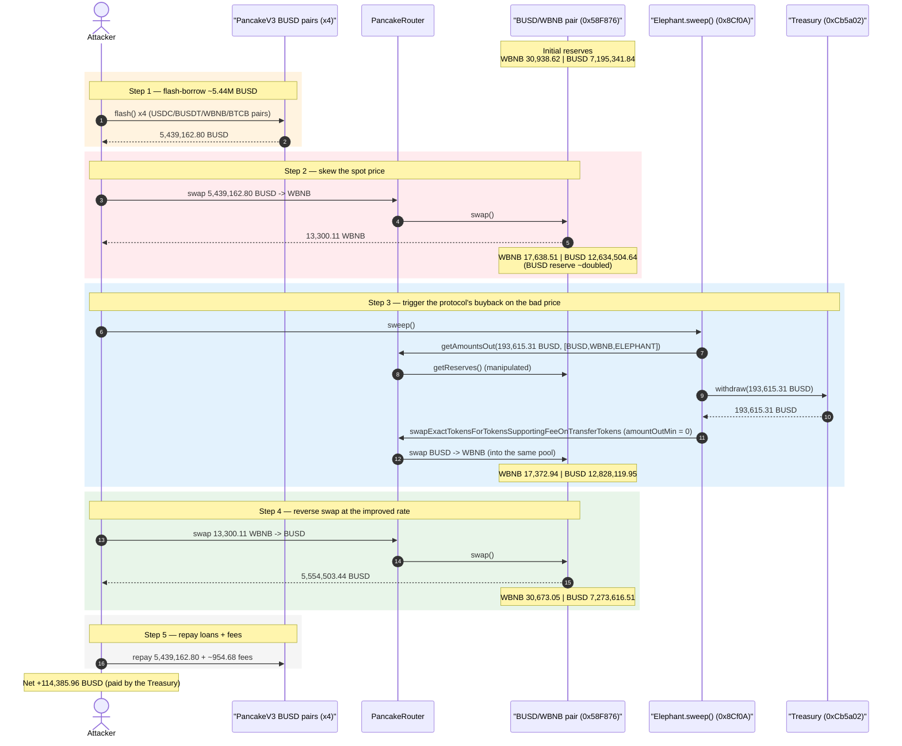
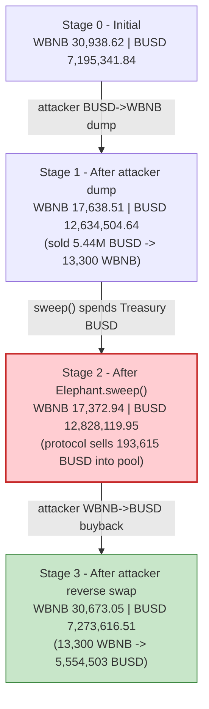
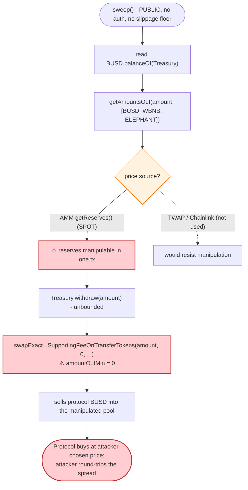

# Elephant Money (ElephantStatus) Exploit — Spot-Price Oracle Manipulation of `sweep()`

> One-line summary: An attacker flash-borrowed ~5.44M BUSD, skewed the PancakeSwap BUSD/WBNB pool, then triggered Elephant Money's permissionless `sweep()` — which prices its Treasury-funded buyback off that same manipulated spot pool — and round-tripped the distortion for **~114,386 BUSD (~$114K)** profit.

> **Reproduction:** the PoC compiles & runs in an isolated Foundry project at
> [this project folder](.) (the umbrella DeFiHackLabs repo does not whole-compile,
> so this PoC was extracted).
> Full verbose trace: [output.txt](output.txt).
> The vulnerable `sweep()` contract is **unverified** on BscScan; downloaded verified
> sources for the supporting contracts: [Treasury.sol](sources/Treasury_Cb5a02/Treasury.sol),
> [Elephant.sol](sources/Elephant_E283D0/Elephant.sol).

---

## Key info

| | |
|---|---|
| **Loss** | **~$114K** — 114,385.96 BUSD extracted (PoC). DeFiHackLabs header cites ~$165K total across the incident |
| **Vulnerable contract** | `ElephantStatus` (the `sweep()` contract) — [`0x8Cf0A553aB3896e4832ebCC519a7A60828AB5740`](https://bscscan.com/address/0x8Cf0A553aB3896e4832ebCC519a7A60828AB5740) (**unverified**) |
| **Funds source / victim** | Bankroll/Elephant `Treasury` — [`0xCb5a02BB3a38e92E591d323d6824586608cE8cE4`](https://bscscan.com/address/0xCb5a02BB3a38e92E591d323d6824586608cE8cE4) (holds the BUSD collateral that `sweep()` spends) |
| **Manipulated oracle pool** | PancakeSwap **BUSD/WBNB** pair — [`0x58F876857a02D6762E0101bb5C46A8c1ED44Dc16`](https://bscscan.com/address/0x58F876857a02D6762E0101bb5C46A8c1ED44Dc16) (token0 = WBNB, token1 = BUSD) |
| **ELEPHANT token** | [`0xE283D0e3B8c102BAdF5E8166B73E02D96d92F688`](https://bscscan.com/address/0xE283D0e3B8c102BAdF5E8166B73E02D96d92F688) (reflection / fee-on-transfer, 5% tax + 5% liquidity) |
| **Attacker EOA** | [`0xbbcc139933d1580e7c40442e09263e90e6f1d66d`](https://bscscan.com/address/0xbbcc139933d1580e7c40442e09263e90e6f1d66d) |
| **Attacker contract** | [`0x69bd13f775505989883768ebd23d528c708d6bcf`](https://bscscan.com/address/0x69bd13f775505989883768ebd23d528c708d6bcf) |
| **Attack tx** | [`0xd423ae0e95e9d6c8a89dcfed243573867e4aad29ee99a9055728cbbe0a523439`](https://explorer.phalcon.xyz/tx/bsc/0xd423ae0e95e9d6c8a89dcfed243573867e4aad29ee99a9055728cbbe0a523439) |
| **Chain / block / date** | BSC / 34,114,760 / Dec 6, 2023 |
| **Compiler** | PoC: Solidity ^0.8.10 (EVM cancun). ELEPHANT token: v0.6.12, optimizer 200 runs |
| **Bug class** | Spot-price (AMM-reserve) oracle manipulation + permissionless buyback trigger |

---

## TL;DR

Elephant Money runs a "bonding/treasury" mechanism (the `ElephantStatus` contract behind
`Elephant.sweep()`). Periodically — and **permissionlessly** — anyone can call `sweep()`. That
function pulls BUSD collateral out of the protocol `Treasury`, then **buys ELEPHANT on the open
market through PancakeSwap**, sizing and routing the buy using `PancakeRouter.getAmountsOut(...)`
along the `BUSD → WBNB → ELEPHANT` path.

`getAmountsOut` returns the **instantaneous spot quote** computed from the live pool reserves of the
**BUSD/WBNB** pair (`0x58F876…`) and the **WBNB/ELEPHANT** pair (`0x1CEa83…`). Those reserves are
freely manipulable in a single transaction. The attacker therefore:

1. **Flash-borrows ~5.44M BUSD** from four PancakeSwap-V3 BUSD pairs at once.
2. **Dumps all 5.44M BUSD → WBNB** into the BUSD/WBNB pool, nearly doubling its BUSD reserve and
   crashing the WBNB-per-BUSD spot price (i.e., making WBNB very "expensive" in BUSD terms there).
3. **Calls `Elephant.sweep()`.** With the pool distorted, the protocol's buyback withdraws 193,615
   BUSD from the Treasury and pushes it through the manipulated route — moving the pool **further in
   the attacker's favour** (it sells protocol BUSD into the same pool the attacker is positioned
   against).
4. **Swaps its WBNB back to BUSD**, recovering far more BUSD than it spent because the protocol's
   own `sweep()` enlarged the BUSD side of the pool in between.
5. **Repays the four flash loans + fees** and keeps the difference: **114,385.96 BUSD**.

The protocol effectively spent its Treasury's BUSD trading against a price it could not trust, and
the attacker captured the spread.

---

## Background — what Elephant Money does

Elephant Money is a Bankroll-Network-style "DeFi reserve" protocol on BSC. Relevant pieces:

- **`Treasury`** ([Treasury.sol](sources/Treasury_Cb5a02/Treasury.sol)) is a trivial vault: it holds
  a BEP20 (here BUSD) and exposes a single `withdraw(uint256)` that is gated by a `whitelist`
  ([Treasury.sol:198-200](sources/Treasury_Cb5a02/Treasury.sol#L198-L200)). The `ElephantStatus`
  sweep contract is whitelisted, so it can pull BUSD out at will.
- **`ELEPHANT`** ([Elephant.sol](sources/Elephant_E283D0/Elephant.sol)) is a reflection /
  fee-on-transfer token with a 5% reflection tax and a 5% liquidity fee
  ([Elephant.sol:927-931](sources/Elephant_E283D0/Elephant.sol#L927-L931)). This is why `sweep()`
  and the attacker both use `swapExactTokensForTokensSupportingFeeOnTransferTokens` for ELEPHANT legs.
- **`ElephantStatus.sweep()`** (the **unverified** contract `0x8Cf0A…`) is the buy-back/peg engine.
  Reconstructed from the on-chain trace, on each call it:
  1. reads how much BUSD the Treasury holds (`BUSD.balanceOf(Treasury)`),
  2. asks `PancakeRouter.getAmountsOut(amountBUSD, [BUSD, WBNB, ELEPHANT])` for the **spot** quote,
  3. `Treasury.withdraw(amountBUSD)` to fund itself,
  4. `swapExactTokensForTokensSupportingFeeOnTransferTokens(amountBUSD, 0, [BUSD, WBNB, ELEPHANT], …)`
     — a **slippage-free (`amountOutMin = 0`)** market buy of ELEPHANT,
  5. emits `Sweep(amountBUSD)`.

The two facts that make this exploitable: the BUSD spend amount and the swap are both driven by the
**current pool reserves**, and the call is **permissionless** with **zero slippage protection**.

---

## The vulnerable code

The `sweep()` contract itself is unverified, so its behaviour is reconstructed from the trace. The
supporting verified sources confirm the surrounding mechanics.

### 1. Treasury is whitelist-gated but trivially drained by the (whitelisted) sweep contract

```solidity
// sources/Treasury_Cb5a02/Treasury.sol:198-200
function withdraw(uint256 _amount) public onlyWhitelisted {
    require(token.transfer(_msgSender(), _amount));
}
```
[Treasury.sol:198-200](sources/Treasury_Cb5a02/Treasury.sol#L198-L200) — there is **no rate limit,
no price check, no cap**. Whatever amount `sweep()` decides to withdraw, it gets. In the attack the
sweep withdrew **193,615.31 BUSD** in one shot
([output.txt:156-163](output.txt#L156-L163)).

### 2. `sweep()` prices and routes its buyback off the live (manipulable) pool

From the trace, inside `Elephant::sweep()`:

```text
// output.txt:150  — spot quote that drives the buyback size/route
PancakeRouter::getAmountsOut(
    193615310121918999528294,                                  // 193,615.31 BUSD
    [BUSD, WBNB, ELEPHANT]                                     // route through manipulated pools
)
  ├─ 0x58F876…::getReserves()  → WBNB 17,638.51 | BUSD 12,634,504.64   // ← already skewed by attacker
  └─ 0x1CEa83…::getReserves()  → WBNB 84,521.33 | ELEPHANT 62,669.09

// output.txt:191 — the actual market buy, amountOutMin = 0 (no slippage guard)
PancakeRouter::swapExactTokensForTokensSupportingFeeOnTransferTokens(
    193615310121918999528294, 0, [BUSD, WBNB, ELEPHANT], …
)
```
[output.txt:145-254](output.txt#L145-L254). The `getReserves()` it reads belong to the very pool the
attacker just distorted in step 2, so the protocol acts on a price the attacker controls.

### 3. ELEPHANT is fee-on-transfer (why the FoT swap variant is used)

```solidity
// sources/Elephant_E283D0/Elephant.sol:927-931
uint256 public _taxFee = 5;
uint256 private _previousTaxFee = _taxFee;
uint256 public _liquidityFee = 5;
uint256 private _previousLiquidityFee = _liquidityFee;
```
[Elephant.sol:927-931](sources/Elephant_E283D0/Elephant.sol#L927-L931). Not the bug itself, but it
shapes the route (`…SupportingFeeOnTransferTokens`) used by both `sweep()` and the attacker.

---

## Root cause — why it was possible

The protocol uses an **AMM spot price as an oracle** to decide both *how much* of its Treasury to
spend and *at what implied rate* to buy ELEPHANT, and exposes that decision through a **permissionless,
zero-slippage** entry point. A PancakeSwap pair prices assets purely from `getReserves()`, and those
reserves can be moved arbitrarily within one transaction by a large swap. So:

1. **Spot-price oracle.** `sweep()` reads `getAmountsOut(...)` (i.e. `reserveOut/reserveIn` of the
   live pools) instead of a manipulation-resistant price (TWAP, Chainlink, etc.). An attacker who
   can move the reserve ratio controls the protocol's view of "fair" price.
2. **Permissionless trigger + no slippage bound.** `sweep()` can be called by anyone at any moment
   and swaps with `amountOutMin = 0`. The attacker chooses the exact instant — immediately after
   skewing the pool — and the protocol cannot refuse a bad fill.
3. **Unbounded Treasury draw.** The amount spent scales with the (manipulated) pool state and the
   Treasury balance, with no per-call cap or sanity check, so the protocol pushes a large amount of
   real BUSD through the distorted route.
4. **The buyback moves the pool the attacker is positioned against.** Because `sweep()` sells
   Treasury BUSD into the same BUSD/WBNB pool, it deepens the very distortion the attacker created,
   making the attacker's reverse swap even more profitable. The protocol pays the attacker's exit.

In short, the attacker turned the protocol's own peg-defense into a counterparty that buys high and
sells low on demand.

---

## Preconditions

- `sweep()` is callable (permissionless) and the Treasury holds BUSD collateral to spend (it held
  enough to fund a 193,615 BUSD withdrawal at the fork block).
- Deep enough BUSD liquidity to flash-borrow and skew the BUSD/WBNB pool — satisfied by the four
  PancakeSwap-V3 BUSD pairs used as flash sources (~5.44M BUSD aggregate).
- No TWAP / external oracle and no slippage floor on the buyback (both true).
- Working capital is **flash-loaned and fully repaid intra-transaction**, so the attack is
  effectively capital-free beyond gas + ~955 BUSD of flash fees.

---

## Attack walkthrough (with on-chain numbers from the trace)

The manipulated pool is the **BUSD/WBNB** pair `0x58F876…`, where `token0 = WBNB`, `token1 = BUSD`.
All figures are taken from the `Sync`/`Swap`/`Flash` events and `getReserves` calls in
[output.txt](output.txt).

| # | Step | BUSD/WBNB pool after (WBNB \| BUSD) | Attacker BUSD flow | Source |
|---|------|---|---:|---|
| 0 | **Initial** pool state | 30,938.62 \| 7,195,341.84 | — | [output.txt:117](output.txt#L117) |
| 1 | **Flash-borrow** BUSD from 4 V3 pairs: 1,395,162.14 (USDC/BUSD) + 3,017,079.05 (BUSDT/BUSD) + 421,679.79 (WBNB/BUSD) + 605,241.82 (BTCB/BUSD) = **5,439,162.80 BUSD** | unchanged | +5,439,162.80 | [output.txt:41-101](output.txt#L41-L101) |
| 2 | **Skew the pool**: swap **5,439,162.80 BUSD → 13,300.11 WBNB** (`swapExactTokensForTokens`) | **17,638.51 \| 12,634,504.64** | −5,439,162.80 BUSD / +13,300.11 WBNB | [output.txt:115-143](output.txt#L115-L143) |
| 3 | **`Elephant.sweep()`** withdraws **193,615.31 BUSD** from Treasury and market-buys ELEPHANT via `[BUSD→WBNB→ELEPHANT]`; the BUSD→WBNB hop sells 193,615.31 BUSD into the pool | **17,372.94 \| 12,828,119.95** | (protocol BUSD, not attacker's) | [output.txt:145-254](output.txt#L145-L254) |
| 4 | **Reverse swap**: attacker swaps its **13,300.11 WBNB → 5,554,503.44 BUSD** (`…SupportingFeeOnTransferTokens`) | **30,673.05 \| 7,273,616.51** | +5,554,503.44 BUSD | [output.txt:257-287](output.txt#L257-L287) |
| 5 | **Repay** 4 flash loans + fees (139.52 + 301.71 + 210.84 + 302.62 ≈ **954.68 BUSD**) | unchanged | −5,440,117.48 BUSD | [output.txt:289-353](output.txt#L289-L353) |
| 6 | **Final balance** | — | **114,385.96 BUSD** | [output.txt:356](output.txt#L356) |

**Why it nets a profit:** in step 2 the attacker sold 5,439,162.80 BUSD for 13,300.11 WBNB. In step
4 the same 13,300.11 WBNB bought back 5,554,503.44 BUSD — **115,340.64 BUSD more than it sold for**.
That uplift exists because the protocol's `sweep()` (step 3) sold an extra 193,615.31 BUSD into the
pool between the two legs, enlarging the BUSD reserve / cheapening BUSD relative to WBNB, so the
attacker's WBNB redeemed for more BUSD on the way out. After subtracting the ~954.68 BUSD of flash
fees, the net is **114,385.96 BUSD**.

### Profit / loss accounting (BUSD)

| Item | Amount (BUSD) |
|---|---:|
| Borrowed (4 flash loans) | 5,439,162.80 |
| BUSD sold for WBNB (step 2) | −5,439,162.80 |
| BUSD bought back with WBNB (step 4) | +5,554,503.44 |
| Flash-loan fees repaid (step 5) | −954.68 |
| Principal repaid (step 5) | −5,439,162.80 |
| **Net to attacker** | **+114,385.96** |
| **Funded by** | Elephant `Treasury` BUSD spent by `sweep()` (193,615.31 BUSD) into a pool tilted against the protocol |

The attacker's gain (114,386 BUSD) is a fraction of the 193,615 BUSD the protocol spent — the rest
was lost to LP fees and the FoT/reflection tax along the manipulated route. The protocol bore the
full Treasury outlay.

---

## Diagrams

### Sequence of the attack



### BUSD/WBNB pool state evolution



### The flaw inside `sweep()`



---

## Remediation

1. **Do not use AMM spot reserves as a price oracle.** Replace `getAmountsOut(...)`/`getReserves()`
   pricing with a manipulation-resistant source — a Chainlink feed, or at minimum a long-window TWAP
   — for any decision that spends Treasury funds.
2. **Enforce slippage protection.** Never swap with `amountOutMin = 0`. Compute a minimum-out from a
   trusted price and revert if the realized fill deviates beyond a tight tolerance.
3. **Gate or rate-limit `sweep()`.** Restrict it to a trusted keeper/role, or add a cooldown and a
   per-call/per-epoch cap on the BUSD it may withdraw and spend, so a single block cannot drain the
   Treasury through a distorted price.
4. **Add a sanity band on the buyback.** Compare the spot price to the trusted reference before
   acting; if they diverge beyond a threshold (a tell-tale of in-flight manipulation), skip the
   sweep that block.
5. **Cap single-transaction reserve impact.** Reject sweeps whose own swap would move the pool
   reserve by more than a small percentage — large self-impact is a red flag that the surrounding
   state is being gamed.

---

## How to reproduce

The PoC was extracted into a standalone Foundry project (the umbrella DeFiHackLabs repo has many
unrelated PoCs that fail to compile under a single `forge test` build):

```bash
_shared/run_poc.sh 2023-12-ElephantStatus_exp -vvvvv
```

- RPC: a **BSC archive** endpoint is required (fork block 34,114,760). `foundry.toml` uses
  `https://bsc-mainnet.public.blastapi.io`, which serves historical state at that block. Public BSC
  RPCs that prune history fail with `missing trie node` / `historical state ... is not available`,
  and rate-limited endpoints fail with HTTP 429 mid-trace — if that happens, wait ~30s and re-run, or
  run single-threaded (`forge test -vvvvv --threads 1`).
- Result: `[PASS] testExploit()`, ending BUSD balance **114,385.958781021756222682**.

Expected tail:

```
Ran 1 test for test/ElephantStatus_exp.sol:ContractTest
[PASS] testExploit() (gas: 1675092)
  Exploiter BUSD balance before attack: 0.000000000000000000
  Exploiter BUSD balance after attack: 114385.958781021756222682
Suite result: ok. 1 passed; 0 failed; 0 skipped; finished in 12.93s
```

---

*Reference: Phalcon analysis — https://twitter.com/Phalcon_xyz/status/1732354930529435940 (Elephant Money / ElephantStatus, BSC, ~$165K total).*
