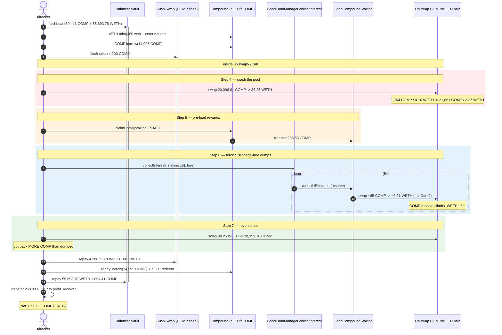
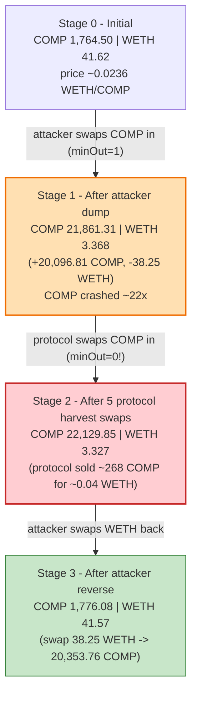
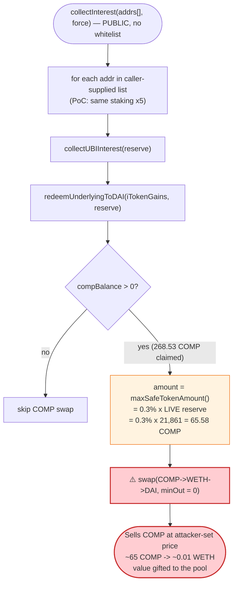
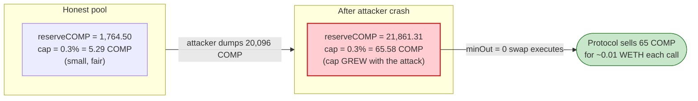

# GoodDollar `GoodCompoundStaking` Exploit — Slippage-Free COMP Reward Swap into a Pre-Manipulated Pool

> **Vulnerability classes:** vuln/defi/slippage · vuln/oracle/spot-price

> **Reproduction:** the PoC compiles & runs in an isolated Foundry project at
> [this project folder](.) (the umbrella DeFiHackLabs repo does not whole-compile under
> `forge test`, so this PoC was extracted standalone).
> Full verbose trace: [output.txt](output.txt).
> Verified vulnerable sources under [sources/](sources/).

---

## Key info

| | |
|---|---|
| **Loss** | ~$13K — **250.63 COMP** extracted (attacker COMP balance 7.42 → 258.05) |
| **Vulnerable contract** | `GoodCompoundStakingV2` (impl) — [`0x4A37A8D7cdb43D89b4DBD7ecFAEaF9bD39E24929`](https://etherscan.io/address/0x4A37A8D7cdb43D89b4DBD7ecFAEaF9bD39E24929#code), proxy [`0x7b7246C78e2F900D17646FF0CB2EC47D6BA10754`](https://etherscan.io/address/0x7b7246C78e2F900D17646FF0CB2EC47D6BA10754) |
| **Trigger entry point** | `GoodFundManager.collectInterest()` — proxy [`0x0c6C80D2061afA35E160F3799411d83BDEEA0a5A`](https://etherscan.io/address/0x0c6C80D2061afA35E160F3799411d83BDEEA0a5A), impl [`0x4A37A8…`](https://etherscan.io/address/0x4A37A8D7cdb43D89b4DBD7ecFAEaF9bD39E24929) |
| **Victim pool** | Uniswap V2 COMP/WETH pair — `0xCFfDdeD873554F362Ac02f8Fb1f02E5ada10516f` |
| **Attacker EOA** | [`0xdfab184bc668f16c1cb949228068588106924569`](https://etherscan.io/address/0xdfab184bc668f16c1cb949228068588106924569) |
| **Attacker contract** | [`0x2d89fb83c66b6c7c35818382517959e33a655b13`](https://etherscan.io/address/0x2d89fb83c66b6c7c35818382517959e33a655b13) |
| **Profit receiver** | `0xa8Ca14Af6ef32A1Be44652CA13d0071bf855f8DD` |
| **Attack tx** | [`0x1106418384414ed56cd7cbb9fedc66a02d39b663d580abc618f2d387348354ab`](https://etherscan.io/tx/0x1106418384414ed56cd7cbb9fedc66a02d39b663d580abc618f2d387348354ab) |
| **Chain / block / date** | Ethereum mainnet / fork at 18,759,540 / Dec 2023 |
| **Compiler** | Solidity v0.8.8, optimizer 1 run (0 runs in metadata) |
| **Bug class** | Price-oracle / slippage manipulation — protocol-side swap with `minOut = 0` into a reserve-skewed AMM pool |

---

## TL;DR

GoodDollar's `GoodCompoundStaking` contracts earn COMP from supplying assets to Compound. When
interest is harvested, the staking contract **sells its entire COMP reward balance on Uniswap V2
(COMP → WETH → DAI) with the minimum-output argument hard-coded to `0`** — i.e. **zero slippage
protection** (`redeemUnderlyingToDAI`,
[GoodCompoundStakingV2.sol:142-147](sources/GoodCompoundStakingV2_7b7246/contracts_staking_compound_GoodCompoundStakingV2.sol#L142-L147)).

The only guard is `maxSafeTokenAmount`
([UniswapV2SwapHelper.sol:19-42](sources/GoodCompoundStakingV2_7b7246/contracts_staking_UniswapV2SwapHelper.sol#L19-L42)),
which caps the swap at `maxLiquidityPercentageSwap = 0.3%` of the pool's **current** reserve. But that
cap is computed from the *live, manipulable* reserve, so an attacker who first crashes the COMP/WETH
pool simply pushes the cap up along with the (now worthless) COMP price.

The harvest is reachable permissionlessly: `GoodFundManager.collectInterest()`
([GoodFundManager.sol:221-249](sources/GoodFundManager_4A37A8/contracts_staking_GoodFundManager.sol#L221-L249))
accepts a **caller-supplied list of staking-contract addresses with no whitelist check** and calls
`collectUBIInterest()` on each. The attacker passes the same target **five times** to force five
slippage-free COMP dumps in one transaction.

The attacker, inside a Balancer flash loan (COMP + WETH) and a nested SushiSwap flash swap:

1. **Crashes the COMP/WETH pool** — swaps `20,096.81 COMP → 38.25 WETH` into the pair, taking the COMP
   reserve from `1,764.50 → 21,861.31` and the WETH reserve from `41.62 → 3.37`. COMP is now ~22× too
   cheap in this pool.
2. **Force-distributes COMP into the staking contract** via `Comptroller.claimComp` (268.53 COMP
   landed in the staking contract), so it has a reward balance to harvest.
3. **Triggers `collectInterest([staking ×5], true)`** — each `collectUBIInterest` sells ~65.58 COMP
   into the crashed pool for ~0.01 WETH (worth ~$0.02 of WETH for ~$3,600 of COMP at honest price),
   pumping the pool's COMP reserve and barely moving WETH.
4. **Reverses** — swaps the `38.25 WETH` back for `20,353.76 COMP`, i.e. **more COMP than it put in**,
   because the protocol's near-free COMP sales inflated the pool's COMP side.
5. **Unwinds** the flash loans (repays COMP+WETH to Balancer, COMP+WETH to SushiSwap, repays the
   Compound cETH/cCOMP positions) and ships **258.03 COMP** to the profit receiver.

---

## Background — what GoodDollar's staking does

GoodDollar runs UBI funded by DeFi yield. `GoodCompoundStakingV2`
([source](sources/GoodCompoundStakingV2_7b7246/contracts_staking_compound_GoodCompoundStakingV2.sol))
supplies an underlying token to Compound (here cDAI), accrues COMP governance-token rewards, and
periodically converts those rewards plus the interest into DAI/cDAI for the GoodDollar Reserve.

The harvest path is:

```
GoodFundManager.collectInterest([staking…])      ← permissionless keeper entry point
  └─ for each staking: collectUBIInterest(reserve)         (SimpleStakingV2.sol:389)
        └─ redeemUnderlyingToDAI(iTokenGains, reserve)     (GoodCompoundStakingV2.sol:117)
              ├─ swap entire COMP balance → WETH → DAI     (minOut = 0)   ← the bug
              └─ redeem cDAI interest → DAI → reserve
```

On-chain facts at the fork block:

| Parameter | Value |
|---|---|
| `maxLiquidityPercentageSwap` | `300` = **0.3%** of pool reserve ([SimpleStakingV2.sol:38](sources/GoodCompoundStakingV2_7b7246/contracts_staking_SimpleStakingV2.sol#L38)) |
| COMP swap `minOut` | **0** (hard-coded, [GoodCompoundStakingV2.sol:145](sources/GoodCompoundStakingV2_7b7246/contracts_staking_compound_GoodCompoundStakingV2.sol#L145)) |
| `collectInterest` staking-address validation | **none** — caller-supplied array ([GoodFundManager.sol:241-248](sources/GoodFundManager_4A37A8/contracts_staking_GoodFundManager.sol#L241-L248)) |
| COMP/WETH pool initial reserves | 1,764.50 COMP / 41.62 WETH |
| COMP claimable to staking (`claimComp`) | 268.53 COMP |

---

## The vulnerable code

### 1. The harvest swaps the *whole* COMP balance with `minOut = 0`

[`GoodCompoundStakingV2.redeemUnderlyingToDAI`](sources/GoodCompoundStakingV2_7b7246/contracts_staking_compound_GoodCompoundStakingV2.sol#L117-L188):

```solidity
function redeemUnderlyingToDAI(uint256 _amount, address _recipient) internal override
    returns (uint256 actualTokenGains, uint256 actualRewardTokenGains, uint256 daiAmount)
{
    uint256 compBalance = comp.balanceOf(address(this));   // ⚠️ ENTIRE reward balance
    uint256 redeemedDAI;
    if (compBalance > 0) {
        address[] memory compToDaiSwapPath = new address[](3);
        compToDaiSwapPath[0] = address(comp);
        compToDaiSwapPath[1] = uniswapContract.WETH();
        compToDaiSwapPath[2] = nameService.getAddress("DAI");
        actualRewardTokenGains = IHasRouter(this).maxSafeTokenAmount(   // cap = 0.3% of LIVE reserve
            address(comp), uniswapContract.WETH(), compBalance, maxLiquidityPercentageSwap
        );
        redeemedDAI = IHasRouter(this).swap(
            compToDaiSwapPath,
            actualRewardTokenGains,
            0,                          // ⚠️⚠️ _minTokenReturn = 0 → NO slippage protection
            _recipient
        );
    }
    ...
}
```

### 2. The "safety" cap scales *with* the manipulated reserve

[`UniswapV2SwapHelper.maxSafeTokenAmount`](sources/GoodCompoundStakingV2_7b7246/contracts_staking_UniswapV2SwapHelper.sol#L19-L42):

```solidity
function maxSafeTokenAmount(
    IHasRouter _iHasRouter, address _inToken, address _outToken,
    uint256 _inTokenAmount, uint256 _maxLiquidityPercentageSwap
) public view returns (uint256 safeAmount) {
    ...
    (uint112 reserve0, uint112 reserve1, ) = pair.getReserves();   // ⚠️ spot reserve, attacker-controlled
    uint112 reserve = reserve0;
    if (_inToken == pair.token1()) reserve = reserve1;

    safeAmount = (reserve * _maxLiquidityPercentageSwap) / 100000;  // 0.3% of CURRENT reserve
    return safeAmount < _inTokenAmount ? safeAmount : _inTokenAmount;
}
```

The comment claims this is an anti-sandwich limit. It is meaningless: the attacker first inflates the
COMP reserve to `21,861 COMP`, so `0.3% × 21,861 ≈ 65.58 COMP` — the function returns exactly
`65583941528193262325` in the trace ([output.txt:368](output.txt)). The cap *grew with the attack*.

### 3. The trigger has no staking-contract whitelist

[`GoodFundManager.collectInterest`](sources/GoodFundManager_4A37A8/contracts_staking_GoodFundManager.sol#L221-L249):

```solidity
function collectInterest(address[] calldata _stakingContracts, bool _forceAndWaiverRewards) external {
    ...
    for (uint256 i = _stakingContracts.length; i > 0; i--) {
        if (_stakingContracts[i - 1] != address(0x0)) {
            IGoodStaking(_stakingContracts[i - 1]).collectUBIInterest(reserveAddress);  // ⚠️ any address, any count
        }
    }
    ...
}
```

`_stakingContracts` is taken verbatim from the caller — no check that the addresses are registered
`activeContracts`. The PoC passes `[staking, staking, staking, staking, staking]` to force **five**
slippage-free COMP dumps in a single call ([GoodCompound_exp.sol:155-161](test/GoodCompound_exp.sol#L155-L161)).

---

## Root cause — why it was possible

The protocol performs a **value-bearing swap (COMP rewards → DAI) at the AMM spot price with no
trustworthy minimum-output bound.** Three design decisions compose into the loss:

1. **`minOut = 0` on the COMP→WETH leg.** The swap accepts *any* amount of WETH back, so a
   price-skewed pool lets the protocol sell its COMP for essentially nothing. This is the core flaw —
   slippage protection is the one thing that would have made the attack revert.
2. **The slippage cap is a function of the live reserve, not an oracle.** `maxSafeTokenAmount`
   computes `0.3% × reserve`, but a flash-loan-funded attacker controls `reserve`. Anchoring the
   "safe amount" to a manipulable spot quantity provides no protection — the cap simply tracks the
   manipulation.
3. **A permissionless, count-unbounded trigger.** `collectInterest()` lets anyone choose *when* and
   *how many times* the harvest runs, against any address, in the same transaction in which they have
   already skewed the pool. The attacker even pre-loads the rewards via `claimComp`, so there is
   always COMP to dump.

The net effect: each `collectUBIInterest` call moves real COMP from the staking contract into the
COMP/WETH pool at a price the attacker chose, and the attacker harvests the resulting reserve
imbalance by reversing its own position.

---

## Preconditions

- The COMP/WETH Uniswap V2 pool must be cheaply skewable — true for any V2 pool given enough working
  capital, which a flash loan supplies (Balancer COMP+WETH here, nested with a SushiSwap COMP flash
  swap).
- The staking contract must hold a COMP reward balance to harvest. The attacker manufactures this with
  `Comptroller.claimComp(staking, [cDAI])` (268.53 COMP), so it is not a real precondition on protocol
  state — it is created on demand.
- No timing gate blocks it: `collectInterest`'s interval `require` is **commented out**
  ([GoodFundManager.sol:230-233](sources/GoodFundManager_4A37A8/contracts_staking_GoodFundManager.sol#L230-L233))
  and `_forceAndWaiverRewards = true` skips the gas/UBI sanity requires.
- All capital is borrowed and repaid in-transaction → **flash-loanable**, near-zero attacker capital.

---

## Attack walkthrough (with on-chain numbers from the trace)

The COMP/WETH pair `0xCFfDde…` has `token0 = COMP`, `token1 = WETH` (so `reserve0 = COMP`,
`reserve1 = WETH`). All figures are taken from `getReserves`/`Sync`/`Transfer` lines in
[output.txt](output.txt). COMP and WETH are 18-decimals.

| # | Step (trace ref) | COMP reserve | WETH reserve | Effect |
|---|------------------|-------------:|-------------:|--------|
| 0 | **Initial** ([:209](output.txt)) | 1,764.50 | 41.62 | Honest pool; COMP ≈ 0.0236 WETH. |
| 1 | Balancer flash loan: 894.41 COMP + 55,693.78 WETH ([:52](output.txt)) | — | — | Working capital. |
| 2 | Withdraw WETH→ETH, `cETH.mint{value:450}`, `enterMarkets`, `cCOMP.borrow(14,995 COMP)` ([:74-180](output.txt)) | — | — | Pulls 14,995 COMP from Compound on borrow. |
| 3 | Nested SushiSwap flash swap: borrow 4,200 COMP ([:181](output.txt)); inside, `transferFrom(profit_receiver, 7.4 COMP)` → total **20,096.81 COMP** ([:206](output.txt)) | — | — | Amasses COMP to dump. |
| 4 | **Crash the pool**: swap `20,096.81 COMP → 38.25 WETH` ([:207-228](output.txt)) | **21,861.31** | **3.368** | COMP dumped; price collapses ~22×. |
| 5 | `claimComp(staking, [cDAI])` → **268.53 COMP** sent to staking ([:259-260](output.txt)) | 21,861.31 | 3.368 | Pre-loads reward balance to harvest. |
| 6 | `collectInterest([staking ×5], true)` → 5× `collectUBIInterest` | see below | see below | Protocol dumps COMP at the crashed price. |
| 6·1 | swap 1: `maxSafe = 65.58 COMP → 0.01 WETH → 23.59 DAI` ([:368-422](output.txt)) | 21,926.90 | 3.358 | COMP up, WETH ~flat; COMP sold for ~nothing. |
| 6·2 | swap 2: `65.78 COMP → 0.01001 WETH → 23.52 DAI` ([:562-596](output.txt)) | 21,992.68 | 3.348 | |
| 6·3 | swap 3: `65.98 COMP → 9.98e15 WETH → 23.45 DAI` ([:734-768](output.txt)) | 22,058.66 | 3.338 | |
| 6·4 | swap 4: `66.18 COMP → 9.95e15 WETH → 23.38 DAI` ([:906-940](output.txt)) | 22,124.83 | 3.328 | |
| 6·5 | swap 5: `5.01 COMP → 7.52e14 WETH → 1.77 DAI` ([:1084-1111](output.txt)) | 22,129.85 | 3.327 | Staking COMP exhausted. |
| 7 | **Reverse**: swap `38.25 WETH → 20,353.76 COMP` ([:1469-1494](output.txt)) | 1,776.08 | 41.57 | Gets back **more COMP than dumped** in step 4. |
| 8 | Repay SushiSwap: 4,206.32 COMP + 0.149 WETH ([:1495-1518](output.txt)) | 12,498.89 | 295.21 | Closes nested flash swap. |
| 9 | `cCOMP.repayBorrow(14,995 COMP)`, `cETH.redeem`, re-deposit 450 ETH→WETH ([:1529-1604](output.txt)) | — | — | Closes Compound positions. |
| 10 | Repay Balancer: 55,693.78 WETH + 894.41 COMP ([:1605-1616](output.txt)) | — | — | Flash loan settled. |
| 11 | `transfer(profit_receiver, 258.03 COMP)` ([:1619-1624](output.txt)) | — | — | Banked profit. |

The "1 WETH back per 65 COMP sold" is the whole heist: the protocol sold ~268 COMP across the five
calls (worth ~$13K at the honest ~$48/COMP) and received about **0.04 WETH (~$90)** total, gifting the
difference to the pool — which the attacker owned the rest of and reversed out of.

### Profit accounting (COMP, attacker's net)

| Item | COMP |
|---|---:|
| Attacker `profit_receiver` COMP, before ([:50](output.txt)) | 7.42 |
| Attacker `profit_receiver` COMP, after ([:1634](output.txt)) | 258.05 |
| **Net profit** | **+250.63** (≈ $13K) |

Final transfer to receiver was **258.03 COMP** ([:1619](output.txt)); combined with the 7.4 COMP it
contributed via `transferFrom` mid-attack, the receiver's balance nets to 258.05, i.e. **+250.63 COMP**
over the pre-attack 7.42. All flash loans (Balancer COMP+WETH, SushiSwap COMP) and the Compound
cETH/cCOMP positions are fully closed in-transaction.

---

## Diagrams

### Sequence of the attack



### COMP/WETH pool state evolution



### The flaw inside the harvest path



### Why the cap fails: spot reserve vs. honest reserve



---

## Why each magic number

- **`20,096.81 COMP` dumped (step 4):** assembled from the Balancer COMP flash loan + SushiSwap COMP
  flash swap (4,200) + cCOMP borrow (14,995) + a 7.4 COMP `transferFrom`. Large enough to crash the
  1,764-COMP pool ~22×, making the protocol's COMP worthless on the swap.
- **`claimComp` → 268.53 COMP:** the reward balance to be harvested. Manufactured on demand; the
  protocol will dump all of it.
- **`maxSafe = 65.58 COMP`:** exactly `0.3% × 21,861` — proof the "safety" cap tracked the
  manipulation instead of constraining it.
- **`minOut = 0`:** the literal hard-coded slippage bound on the COMP→WETH leg; the single line that
  makes the loss possible.
- **5× the same staking address:** drains the staking COMP balance over several swaps within the one
  permissionless call, since each `collectUBIInterest` is capped to `maxSafe`.

---

## Remediation

1. **Set a real `minOut`/slippage bound on the reward swap.** Compute the expected WETH/DAI out from a
   manipulation-resistant price (Chainlink/TWAP — the contract already wires a `compUsdOracle`) and
   pass it as `_minTokenReturn`. Reverting on bad execution price would have stopped this attack
   outright.
2. **Do not anchor the "safe amount" to spot reserves.** `maxSafeTokenAmount` must not derive its cap
   from `pair.getReserves()`; an attacker controls that. Bound the swap by an oracle-priced notional or
   a fixed protocol limit instead.
3. **Whitelist staking targets in `collectInterest`.** Validate each `_stakingContracts[i]` against the
   registered `activeContracts` set and reject duplicates, so the harvest can only run against
   legitimate contracts the expected number of times.
4. **Guard the harvest against same-block price manipulation.** Re-enable the collection interval
   `require` (currently commented out) and/or require that the swap happen at a price consistent with a
   TWAP, so a freshly-skewed pool cannot be harvested in the same transaction.
5. **Don't route reward conversion through a single thin AMM pool with no checks.** Use a router with
   `amountOutMin` enforced, split across venues, or convert via an oracle-priced OTC/settlement path.

---

## How to reproduce

The PoC was extracted into a standalone Foundry project (the umbrella DeFiHackLabs repo does not
whole-compile under `forge test`):

```bash
_shared/run_poc.sh 2023-12-GoodCompound_exp -vvvvv
```

- RPC: an **Ethereum mainnet archive** endpoint is required (fork block 18,759,540). `foundry.toml`
  uses an Infura archive endpoint; if it 401s, rotate the `/v3/<key>` to another provided key.
- Result: `[PASS] testExploit()`; attacker COMP `7.42 → 258.05` (+250.63 COMP).

Expected tail:

```
Ran 1 test for test/GoodCompound_exp.sol:GoodCompound
[PASS] testExploit() (gas: 2739829)
  [Begin] Attacker COMP before exploit: 7.416522729556363808
  [End] Attacker COMP after exploit: 258.047626966913589004
Suite result: ok. 1 passed; 0 failed; 0 skipped
```

---

*Sources downloaded from Etherscan (verified): `GoodCompoundStakingV2`, `GoodFundManager`, plus the
GoodDollar reserve/staking dependency tree under [sources/](sources/).*
