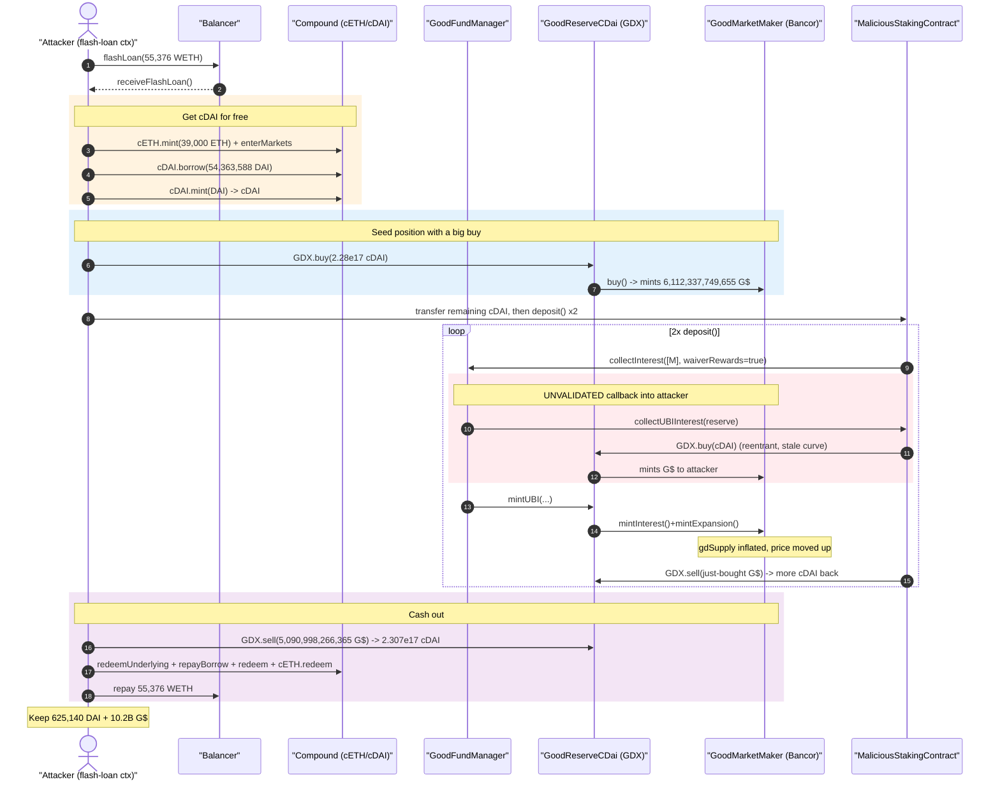
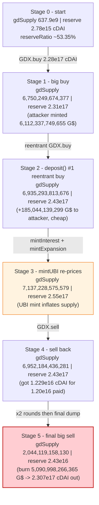
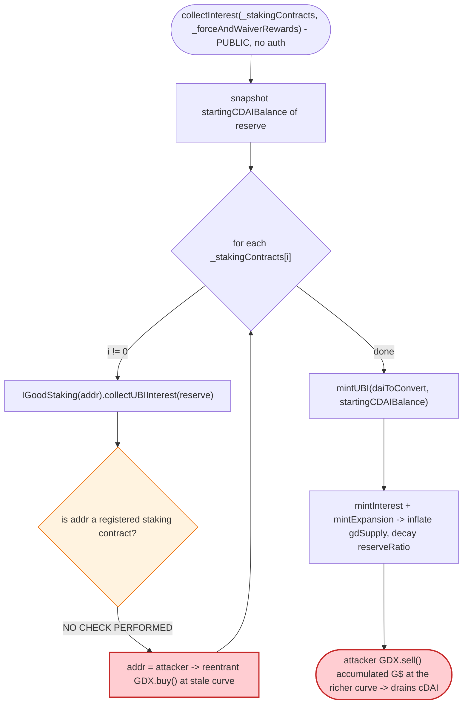

# GoodDollar Exploit — Unvalidated `collectInterest` Staking-Contract Callback → Reentrant Bonding-Curve Drain

> **Vulnerability classes:** vuln/input-validation/missing · vuln/reentrancy/cross-contract

> **Reproduction:** the PoC compiles & runs in an isolated Foundry project at
> [this project folder](.) (the umbrella DeFiHackLabs repo does not whole-compile, so this PoC was
> extracted). Full verbose trace: [output.txt](output.txt).
> Verified vulnerable source: [`GoodFundManager.collectInterest`](sources/GoodFundManager_4A37A8/contracts_staking_GoodFundManager.sol#L221-L300).

---

## Key info

| | |
|---|---|
| **Loss** | **~$2M** — drained from the GoodDollar reserve as **625,140.23 DAI** + **10,213,394,832.90 G$** (GoodDollar token) |
| **Vulnerable contract** | `GoodFundManager` (impl) — [`0x4A37A8D7cdb43D89b4DBD7ecFAEaF9bD39E24929`](https://etherscan.io/address/0x4A37A8D7cdb43D89b4DBD7ecFAEaF9bD39E24929#code), proxied at [`0x0c6C80D2061afA35E160F3799411d83BDEEA0a5A`](https://etherscan.io/address/0x0c6C80D2061afA35E160F3799411d83BDEEA0a5A) |
| **Also central to bug** | `GoodReserveCDai` (GDX, the Bancor reserve) [`0xa150a825d425B36329D8294eeF8bD0fE68f8F6E0`](https://etherscan.io/address/0xa150a825d425B36329D8294eeF8bD0fE68f8F6E0) · `GoodMarketMaker` [`0xDAC6A0c973Ba7cF3526dE456aFfA43AB421f659F`](https://etherscan.io/address/0xDAC6A0c973Ba7cF3526dE456aFfA43AB421f659F) |
| **Victim / source of funds** | The GoodDollar reserve's cDAI/DAI; the cDAI deposited by the attacker plus the value extracted by minting G$ at a stale curve |
| **Attacker EOA** | [`0x6738fa889ff31f82d9fe8862ec025dbe318f3fde`](https://etherscan.io/address/0x6738fa889ff31f82d9fe8862ec025dbe318f3fde) |
| **Attack contract** | [`0xf06ab383528f51da67e2b2407327731770156ed6`](https://etherscan.io/address/0xf06ab383528f51da67e2b2407327731770156ed6) |
| **Attack tx** | [`0x726459a46839c915ee2fb3d8de7f986e3c7391c605b7a622112161a84c7384d0`](https://app.blocksec.com/explorer/tx/eth/0x726459a46839c915ee2fb3d8de7f986e3c7391c605b7a622112161a84c7384d0) |
| **Chain / block / date** | Ethereum mainnet / fork block 18,802,014 / Dec 2023 |
| **Compiler** | Solidity v0.8.16, optimizer 1 run |
| **Bug class** | Missing input validation / access control → arbitrary external-call (reentrancy) → Bancor bonding-curve manipulation |

---

## TL;DR

GoodDollar's `GoodFundManager.collectInterest(address[] _stakingContracts, bool _forceAndWaiverRewards)` is a
**permissionless keeper function** that loops over a **caller-supplied** array of "staking contracts" and calls
`collectUBIInterest(reserve)` on each one
([`GoodFundManager.sol:241-248`](sources/GoodFundManager_4A37A8/contracts_staking_GoodFundManager.sol#L241-L248)).
It **never checks that those addresses are actually registered staking contracts** — unlike the sibling
`mintReward()` function, which does require `staking.blockStart > 0`
([`GoodFundManager.sol:364-376`](sources/GoodFundManager_4A37A8/contracts_staking_GoodFundManager.sol#L364-L376)).

This hands the attacker an **arbitrary external call** in the middle of the reserve's most sensitive accounting
window. The attacker passes its own `MaliciousStakingContract` as the "staking contract." When
`collectInterest` calls back into `collectUBIInterest`, the attacker **reentrantly buys G$ off the Bancor
bonding curve** ([PoC `collectUBIInterest`](test/GoodDollar_exp.sol#L166-L173)). Right after the callback returns,
`collectInterest` calls `mintUBI()`, which mints "interest + expansion" G$ to the distribution helper and
**advances the bonding-curve supply/reserve-ratio** —
([`GoodReserveCDai.mintUBI`](sources/GoodReserveCDai_2793a5/contracts_reserve_GoodReserveCDai.sol#L365-L398)).

By repeatedly entering this window (two `deposit()` iterations), the attacker accumulates a large G$ position
bought cheaply *before* the curve was re-priced, then **sells it all back** in one shot for far more cDAI than
it paid. The whole sequence is funded by a Balancer WETH flash loan → Compound borrow of the entire cDAI cash,
so the attacker walks away with **625,140 DAI** and **10.2 billion G$** for zero net capital.

---

## Background — what GoodDollar does

GoodDollar (G$) is a UBI token. Its monetary core is a **Bancor bonding curve** held by three cooperating
contracts:

- **`GoodReserveCDai`** (a.k.a. "GDX" / `RESERVE`) — holds the reserve token (**cDAI**) and mints/burns G$.
  Users `buy(cDAI → G$)` and `sell(G$ → cDAI)` against the curve
  ([`GoodReserveCDai.sol:185-309`](sources/GoodReserveCDai_2793a5/contracts_reserve_GoodReserveCDai.sol#L185-L309)).
- **`GoodMarketMaker`** — the Bancor math: it stores `(gdSupply, reserveSupply, reserveRatio)` per reserve token
  and prices buys/sells via `calculatePurchaseReturn` / `calculateSaleReturn`
  ([`GoodMarketMaker.sol:232-328`](sources/GoodMarketMaker_b3ff03/contracts_reserve_GoodMarketMaker.sol#L232-L328)).
- **`GoodFundManager`** — the keeper hub. `collectInterest()` is supposed to pull accrued interest from the
  protocol's *registered* staking contracts into the reserve, then `mintUBI()` mints new G$ to fund UBI while
  keeping the curve price constant
  ([`GoodFundManager.sol:221-300`](sources/GoodFundManager_4A37A8/contracts_staking_GoodFundManager.sol#L221-L300)).

The "keep price constant after minting interest" logic is the economically dangerous part: every time
`mintUBI()` runs it mints `gdInterestToMint + gdExpansionToMint` G$ and bumps the curve's `gdSupply`
*without a corresponding reserve change of equal proportion*. Anyone who can decide **when** that minting
happens — and trade **around** it — extracts the difference.

On-chain Bancor state read from the trace at the start of the attack
([first `calculatePurchaseReturn`](output.txt#L1812)):

| Bancor parameter (cDAI reserve) | Value at attack start |
|---|---|
| `gdSupply` | 637,911,924,722 (≈ 6.38e9, in 2-decimal G$) |
| `reserveSupply` (cDAI) | 2,777,285,891,385,682 (≈ 2.78e15) |
| `reserveRatio` | 533,488 (≈ **53.35%**, e6 precision) |
| cDAI cash available to borrow on Compound (`cDAI.getCash()`) | 54,363,588,496,665,202,261,586,443 DAI (≈ 54.36M DAI) |

---

## The vulnerable code

### 1. `collectInterest` calls back into a caller-supplied address with no registration check

```solidity
// GoodFundManager.sol
function collectInterest(
    address[] calldata _stakingContracts,        // ⚠️ caller controls this array
    bool _forceAndWaiverRewards
) external {                                      // ⚠️ no access control
    ...
    reserveAddress = nameService.getAddress("RESERVE");
    uint256 currentBalance      = daiToken.balanceOf(reserveAddress);
    uint256 startingCDAIBalance = iToken.balanceOf(reserveAddress);   // snapshot BEFORE callback
    for (uint256 i = _stakingContracts.length; i > 0; i--) {
        if (_stakingContracts[i - 1] != address(0x0)) {
            IGoodStaking(_stakingContracts[i - 1]).collectUBIInterest( // ⚠️ arbitrary external call
                reserveAddress
            );
        }
    }
    // Mints G$ based on whatever cDAI showed up during the callbacks
    (gdUBI, interestInCdai) = GoodReserveCDai(reserveAddress).mintUBI(
        daiToConvert,
        startingCDAIBalance,
        iToken
    );
    ...
}
```

[`GoodFundManager.sol:221-300`](sources/GoodFundManager_4A37A8/contracts_staking_GoodFundManager.sol#L221-L300).
There is **no** `require(rewardsForStakingContract[addr].blockStart > 0)` guard here — compare the registration
check that `mintReward()` *does* enforce at
[`GoodFundManager.sol:364-376`](sources/GoodFundManager_4A37A8/contracts_staking_GoodFundManager.sol#L364-L376):

```solidity
function mintReward(address _token, address _user) public {
    UserInfo memory userInfo = contractToUsers[msg.sender];
    Reward memory staking = rewardsForStakingContract[msg.sender];
    require(staking.blockStart > 0, "Staking contract not registered");   // ✅ guard present here…
    ...
}
```

…but **absent** in `collectInterest`. The attacker simply lists its own contract:

```solidity
// PoC MaliciousStakingContract
function deposit() external {
    address[] memory _stakingContracts = new address[](1);
    _stakingContracts[0] = address(this);          // ⚠️ "I am a staking contract"
    GoodFundManager.collectInterest(_stakingContracts, true);   // _forceAndWaiverRewards = true
    GoodDollarToken.approve(address(GDX), type(uint256).max);
    GDX.sell(GoodDollarToken.balanceOf(address(this)), 1, address(this), address(this));
}

// Callback fired by collectInterest — reentrancy point
function collectUBIInterest(address _recipient) external returns (uint256, uint256, uint256) {
    cDAI.approve(address(GDX), type(uint256).max);
    GDX.buy(cDAI.balanceOf(address(this)), 1, address(this));   // ⚠️ buy G$ at the stale curve
    return (0, 0, 0);
}
```

[`test/GoodDollar_exp.sol:151-173`](test/GoodDollar_exp.sol#L151-L173).

### 2. `mintUBI` inflates `gdSupply` (and re-prices the curve) right after the callback

```solidity
// GoodReserveCDai.sol
function mintUBI(uint256 _daiToConvert, uint256 _startingCDAIBalance, ERC20 _interestToken)
    external returns (uint256, uint256)
{
    cERC20(cDaiAddress).mint(_daiToConvert);
    uint256 interestInCdai = _interestToken.balanceOf(address(this)) - _startingCDAIBalance;
    uint256 gdInterestToMint  = getMarketMaker().mintInterest(_interestToken, interestInCdai);
    uint256 gdExpansionToMint = getMarketMaker().mintExpansion(_interestToken);   // ⚠️ mints G$, grows supply
    ...
    _mintGoodDollars(address(distributionHelper), gdInterestToMint + gdExpansionToMint, false);
    ...
}
```

[`GoodReserveCDai.sol:365-398`](sources/GoodReserveCDai_2793a5/contracts_reserve_GoodReserveCDai.sol#L365-L398).

`mintInterest` / `mintExpansion` add to `gdSupply` *without buying it with reserve*, which is exactly what the
attacker positioned itself to profit from:

```solidity
// GoodMarketMaker.sol
function mintInterest(ERC20 _token, uint256 _addTokenSupply) public returns (uint256) {
    ...
    uint256 toMint = calculateMintInterest(_token, _addTokenSupply);
    reserveToken.gdSupply     += toMint;          // supply grows
    reserveToken.reserveSupply += _addTokenSupply;
    return toMint;
}
function mintExpansion(ERC20 _token) public returns (uint256) {
    ...
    uint256 toMint = calculateMintExpansion(_token);
    reserveTokens[address(_token)].gdSupply += toMint;   // supply grows again
    expandReserveRatio(_token);                          // reserveRatio decays daily
    return toMint;
}
```

[`GoodMarketMaker.sol:358-411`](sources/GoodMarketMaker_b3ff03/contracts_reserve_GoodMarketMaker.sol#L358-L411).

---

## Root cause — why it was possible

`collectInterest` was written under the assumption that the `_stakingContracts` it iterates are **trusted,
pre-registered** GoodDollar staking contracts whose `collectUBIInterest` only transfers genuine accrued interest
into the reserve. That assumption is never enforced:

1. **No caller authorization.** `collectInterest` is `external` with no role gate — by design it is a
   permissionless keeper entry point.
2. **No element validation.** The function trusts the caller-supplied `_stakingContracts[]` verbatim. There is
   no `rewardsForStakingContract[addr].blockStart > 0` (or `activeContracts` membership) check — the very check
   that exists in `mintReward`. So **any address can be presented as a staking contract**, and
   `IGoodStaking(addr).collectUBIInterest(reserve)` becomes an **attacker-controlled external call**.
3. **Sensitive state mutated around an untrusted call.** The callback runs *between* the `startingCDAIBalance`
   snapshot and the `mintUBI` re-pricing. Inside the callback the attacker freely trades the Bancor curve
   (`GDX.buy`), and `GDX.buy`/`GDX.sell` carry **no reentrancy guard** of their own
   ([`GoodReserveCDai.sol:185-309`](sources/GoodReserveCDai_2793a5/contracts_reserve_GoodReserveCDai.sol#L185-L309)).
4. **UBI minting expands supply without proportionally adding reserve.** `mintInterest` + `mintExpansion` mint
   fresh G$ and decay the reserve ratio on a `lastExpansion`/daily cadence
   ([`GoodMarketMaker.sol:144-159`](sources/GoodMarketMaker_b3ff03/contracts_reserve_GoodMarketMaker.sol#L144-L159)).
   By controlling **when** that expansion fires and trading **immediately before/after** it, the attacker buys
   G$ at one curve and redeems it at a richer one.

Put together: a *permissionless function* + *unvalidated callback target* + *no reentrancy protection on the
curve* + *supply-inflating UBI mint* compose into a reserve drain. The single missing line — validating that
each `_stakingContracts[i]` is registered — is the root cause.

---

## Preconditions

- The Bancor reserve (`GoodReserveCDai`) holds meaningful cDAI and the curve is mintable (it was, with
  `gdSupply ≈ 6.38e9` and `reserveRatio ≈ 53.35%`).
- `collectInterest` is callable by anyone with `_forceAndWaiverRewards = true` (the attacker waives keeper gas
  rewards so the `interestInCdai >= gas costs` `require` is skipped —
  [`GoodFundManager.sol:264-288`](sources/GoodFundManager_4A37A8/contracts_staking_GoodFundManager.sol#L264-L288)).
- Working capital to (a) borrow the entire cDAI cash on Compound and (b) buy G$ on the curve. All of it is
  obtained **intra-transaction**: a Balancer WETH flash loan → `cETH.mint` collateral → `cDAI.borrow` of the
  full cash → `cDAI.mint` to get cDAI → `GDX.buy`. Hence the attack needs **no upfront capital**.

---

## Step-by-step attack walkthrough (with on-chain numbers from the trace)

All figures are taken directly from the `BalancesUpdated` / `TokenPurchased` / `TokenSold` events in
[output.txt](output.txt). cDAI amounts are 8-decimal; G$ amounts are 2-decimal.

| # | Step | Trace ref | Curve `gdSupply` → | Curve `reserveSupply` (cDAI) → | Effect |
|---|------|-----------|-------------------:|-------------------------------:|--------|
| 1 | **Flash loan** 55,376.48 WETH from Balancer | [L1606](output.txt#L1606) | — | — | No-fee WETH borrowed. |
| 2 | `WETH.withdraw(39,000)`, `cETH.mint{value:39,000 ETH}` → enter Compound market | [L1630](output.txt#L1630) | — | — | 1.94e14 cETH collateral. |
| 3 | `cDAI.borrow(cDAI.getCash())` = borrow **54,363,588.50 DAI** | [L1676](output.txt#L1676) | — | — | Drains all of Compound's cDAI cash as DAI. |
| 4 | `cDAI.mint(DAI balance)` → cDAI; `GDX.buy(228,488,820,035,379,889 cDAI, …)` | [L1796](output.txt#L1796) | 637.9e9 → **6,750,249,674,377** | 2.78e15 → **231,266,105,926,765,571** | Big buy: deposits ≈0.228 cDAI-units (8-dec: 2.28e17), mints **6,112,337,749,655 G$** to attacker; curve repriced. |
| 5 | Transfer remaining cDAI to `MaliciousStakingContract`; loop `deposit()` **#1** | [L1942](output.txt#L1942) | | | Enters the exploit window. |
| 5a | ↳ callback `collectUBIInterest`: `GDX.buy(12,025,727,370,283,153 cDAI)` | [L1979](output.txt#L1979) | 6.75e12 → **6,935,293,813,676** | 2.31e17 → **243,291,833,297,048,724** | Attacker buys **185,044,139,299 G$** at the curve *before* UBI re-mint. |
| 5b | ↳ `mintUBI` → `mintInterest`+`mintExpansion` mint UBI G$ | [L2061](output.txt#L2061) | grows to **7,137,228,575,579** | **255,317,560,667,331,877** | Supply inflated by UBI mint; price moved up. |
| 5c | ↳ back in `deposit()`: `GDX.sell(185,044,139,299 G$)` | [L2355](output.txt#L2355) | 7.137e12 → **6,952,184,436,281** | 2.55e17 → **243,018,342,493,518,707** | Attacker sells the just-bought G$ for **12,299,218,173,813,170 cDAI** (more than the 1.20e16 paid). |
| 6 | Loop `deposit()` **#2** (same buy→UBI-mint→sell) | [L2433](output.txt#L2433) | repeats | repeats | Second extraction round; supply pumped to ≈7.32e12. |
| 7 | Final `GDX.sell(5,090,998,266,365 G$)` (amount copied from the live attack) | [L2954](output.txt#L2954) | 7,135,117,424,495 → **2,044,119,158,130** | 255,043,617,075,980,662 → **24,336,495,703,626,720** | Burns the accumulated G$, pulls **230,707,121,372,353,942 cDAI** (≈ 2.307e17) out of the reserve. |
| 8 | `cDAI.redeemUnderlying(54,363,588.50 DAI)` → `cDAI.repayBorrow(...)` → `cDAI.redeem(rest)` → `cETH.redeem` | [L3031](output.txt#L3031) | — | — | Unwind Compound: repay the DAI loan, keep the surplus cDAI/DAI. |
| 9 | `WETH.deposit` + `WETH.transfer(Balancer, 55,376.48)` (with a 0.123 WETH top-up from a helper EOA) | [L3220](output.txt#L3220) | — | — | Repay the flash loan. |

After unwind, the attacker contract is left holding **625,140.228892 DAI** and
**10,213,394,832.90 G$** (`1,021,339,483,290` in 2-decimal units) —
[balance logs L1566-L1567](output.txt#L1566).

### Profit / loss accounting

| Item | Amount |
|---|---:|
| Flash-loaned WETH (returned) | 55,376.48 WETH |
| Compound DAI borrowed (repaid) | 54,363,588.50 DAI |
| **Net DAI extracted** | **625,140.228892 DAI** |
| **Net G$ extracted** | **10,213,394,832.90 G$** |
| Combined reported loss | **~$2,000,000** |

The DAI surplus is the cDAI the attacker dragged out of the reserve (step 7) minus what was needed to unwind the
Compound loan; the residual 10.2B G$ is the leftover minted/bought G$ not yet sold.

---

## Diagrams

### Sequence of the attack



### Bonding-curve state evolution



### The flaw inside `collectInterest`



---

## Remediation

1. **Validate every `_stakingContracts[i]` against the registry.** In `collectInterest`, before calling
   `collectUBIInterest`, require `rewardsForStakingContract[addr].blockStart > 0` (or check `activeContracts`
   membership) — the exact guard `mintReward` already enforces. This single check makes the attacker-controlled
   callback impossible.
2. **Add a reentrancy guard around the reserve's curve operations.** `GoodReserveCDai.buy/sell` and
   `GoodFundManager.collectInterest` should share a `nonReentrant` modifier (the contract already imports
   `ReentrancyGuardUpgradeable`) so no externally-triggered callback can trade the curve mid-accounting.
3. **Snapshot-and-verify interest, do not trust transferred balances.** `collectInterest` infers interest from
   the reserve's cDAI balance delta produced *by the callback*. Compute expected interest from each registered
   staking contract's `currentGains()` and reject deltas that do not match, so a malicious "staking contract"
   cannot manufacture state changes.
4. **Re-order so UBI minting cannot be sandwiched.** Perform all supply-inflating `mintUBI`/`mintExpansion`
   accounting atomically and only for validated contracts, with no untrusted external call in between.
5. **Restrict who can trigger expansion timing.** Because `mintExpansion` decays the reserve ratio on a daily
   cadence, gate the keeper path to trusted keepers or enforce that a single transaction cannot both trigger the
   expansion and trade around it.

---

## How to reproduce

The PoC was extracted into a standalone Foundry project (the umbrella DeFiHackLabs repo does not whole-compile
under `forge test`):

```bash
_shared/run_poc.sh 2023-12-GoodDollar_exp -vvvvv
```

- RPC: a **mainnet archive** endpoint is required (fork block 18,802,014). `foundry.toml` is pre-configured with
  an Infura archive endpoint.
- Result: `[PASS] testExploit()`.

Expected tail:

```
  Exploiter DAI balance before attack: 0.000000000000000000
  Exploiter GoodDollarToken balance before attack: 0.00
  Exploiter DAI balance after attack: 625140.228892298970966692
  Exploiter GoodDollarToken balance after attack: 10213394832.90
Suite result: ok. 1 passed; 0 failed; 0 skipped
```

---

*References: MetaSec analysis — https://twitter.com/MetaSec_xyz/status/1736428284756607386 · BlockSec Explorer tx
`0x726459a46839c915ee2fb3d8de7f986e3c7391c605b7a622112161a84c7384d0` (~$2M, GoodDollar, Ethereum).*
