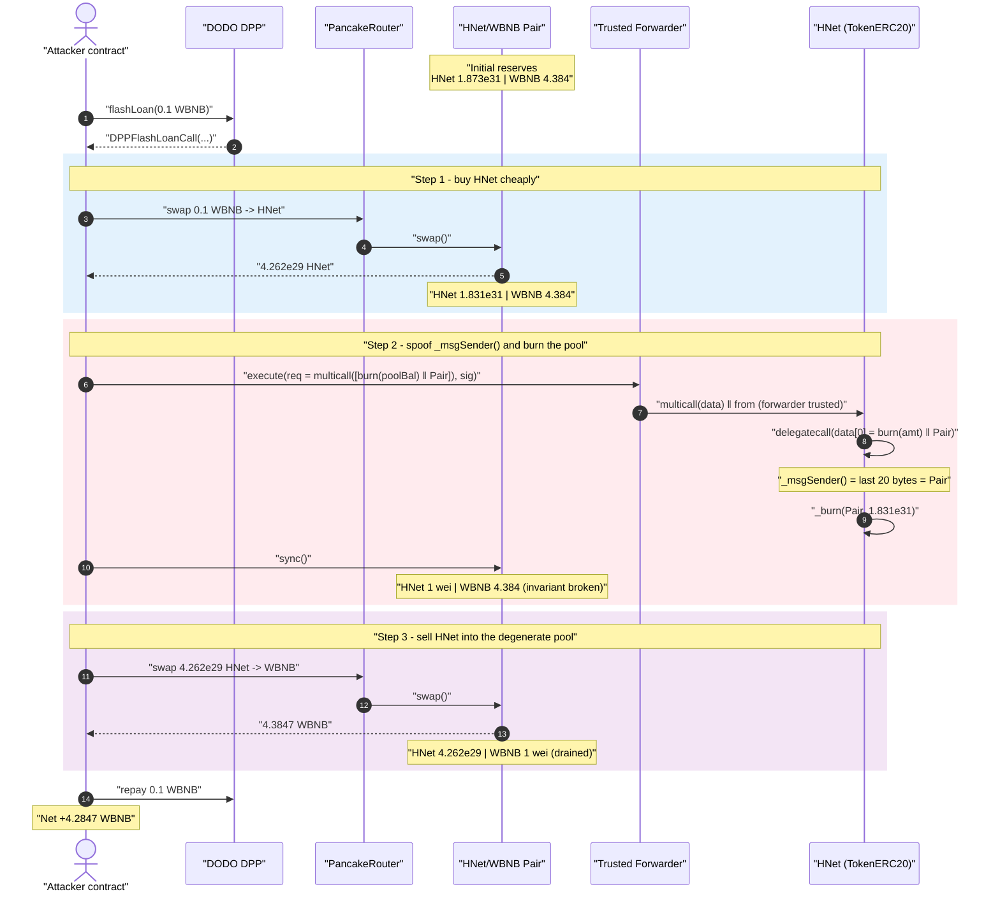
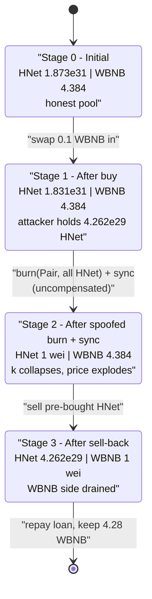
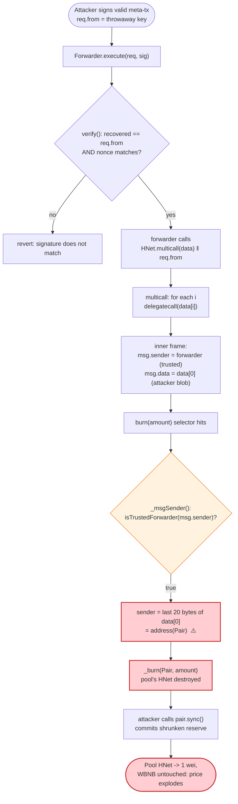

# HNet Exploit — ERC-2771 + Multicall `_msgSender()` Spoofing Burns the Pool's Tokens

> **Vulnerability classes:** vuln/access-control/broken-logic · vuln/access-control/missing-auth

> **Reproduction:** the PoC compiles & runs in an isolated Foundry project at
> [this project folder](.) (the umbrella DeFiHackLabs repo contains many unrelated
> PoCs that do not all compile together, so this one was extracted).
> Full verbose trace: [output.txt](output.txt).
> Verified vulnerable source: [TokenERC20.sol](sources/TokenERC20_256D3B/contracts_token_TokenERC20.sol),
> trusted forwarder: [Forwarder.sol](sources/Forwarder_7C4717/contracts_forwarder_Forwarder.sol).

---

## Key info

| | |
|---|---|
| **Loss** | ~2.4 WBNB drained from the HNet/WBNB pool in the live attack (~$550 at ~$230/WBNB). This reproduction burns the **entire** pool and nets **4.28 WBNB** (~$985). |
| **Vulnerable contract** | `TokenERC20` (thirdweb preset) — proxy/clone `HNet` at [`0x256D3BC542Ff4eDb5959b584Cc98741d28165BBc`](https://bscscan.com/address/0x256D3BC542Ff4eDb5959b584Cc98741d28165BBc#code); implementation [`0x0dabdc92af35615443412a336344c591faed3f90`](https://bscscan.com/address/0x0dabdc92af35615443412a336344c591faed3f90#code) |
| **Trusted forwarder (key enabler)** | `Forwarder` (thirdweb GSNv2) — [`0x7C4717039B89d5859c4Fbb85EDB19A6E2ce61171`](https://bscscan.com/address/0x7C4717039B89d5859c4Fbb85EDB19A6E2ce61171#code) |
| **Victim pool** | HNet/WBNB pair — `0x7E3F53Af12B2C84c35700BE68Cd316518546ca34` |
| **Attacker EOA** | `0x835b45d38cbdccf99e609436ff38e31ac05bc502` |
| **Attacker contract** | `0xaed80b8a821607981e5e58b7a753a3336c0bfd6f` |
| **Attack tx** | `0x1ee617cd739b1afcc673a180e60b9a32ad3ba856226a68e8748d58fcccc877a8` |
| **Chain / block / date** | BSC / 34,141,220 / Thu, 7 Dec 2023 |
| **Compiler** | Test pragma `^0.8.10`; contracts compiled with `evm_version = cancun` |
| **Bug class** | ERC-2771 meta-tx sender spoofing via `multicall` delegatecall (trusted-forwarder context confusion) → unauthorized burn of an arbitrary account's tokens |

---

## TL;DR

`HNet` is a clone of thirdweb's `TokenERC20` preset. That preset inherits **both**
`ERC2771ContextUpgradeable` (meta-transaction support) **and** `MulticallUpgradeable`
([TokenERC20.sol:48-49](sources/TokenERC20_256D3B/contracts_token_TokenERC20.sol#L48-L49)).
The combination is the well-known thirdweb "context spoofing" vulnerability:

- `ERC2771Context._msgSender()` returns the **last 20 bytes of `msg.data`** whenever the caller is the
  trusted forwarder ([ERC2771ContextUpgradeable.sol:30-39](sources/TokenERC20_256D3B/contracts_openzeppelin-presets_metatx_ERC2771ContextUpgradeable.sol#L30-L39)).
- `Multicall.multicall()` executes each entry as `address(this).delegatecall(data[i])`
  ([MulticallUpgradeable.sol:23-29](sources/TokenERC20_256D3B/lib_openzeppelin-contracts-upgradeable_contracts_utils_MulticallUpgradeable.sol#L23-L29)).
  Inside that inner delegatecall, `msg.sender` is *still* the trusted forwarder, but `msg.data`
  is now the attacker-controlled `data[i]` blob — **not** the forwarder's appended-sender calldata.

So an attacker who routes a `multicall([ burn(amount) ‖ victim ])` through the trusted forwarder makes
the inner `burn()` read `_msgSender() == victim` (the trailing bytes the attacker placed in `data[0]`),
and `ERC20Burnable.burn()` does `_burn(_msgSender(), amount)`
([ERC20BurnableUpgradeable.sol:26-28](sources/TokenERC20_256D3B/lib_openzeppelin-contracts-upgradeable_contracts_token_ERC20_extensions_ERC20BurnableUpgradeable.sol#L26-L28)).
Result: **anyone can burn anyone's HNet.**

The attacker points the burn at the **HNet/WBNB liquidity pool**, destroying the pool's HNet, calls
`pair.sync()` to commit the shrunken reserve, and then sells HNet they pre-bought into the now
price-inflated pool to walk away with the pool's WBNB.

---

## Background — what HNet is

`HNet` is an ordinary ERC-20 deployed from thirdweb's audited-but-footgun-prone `TokenERC20` template
([source](sources/TokenERC20_256D3B/contracts_token_TokenERC20.sol)). The features that matter here
are not custom logic — they are two *standard* mix-ins the template bundles together:

| Mix-in | Purpose | File |
|---|---|---|
| `ERC2771ContextUpgradeable` | Gasless / meta-transactions: a trusted "forwarder" relays signed requests and the contract reads the *original* signer via `_msgSender()` | [metatx/ERC2771ContextUpgradeable.sol](sources/TokenERC20_256D3B/contracts_openzeppelin-presets_metatx_ERC2771ContextUpgradeable.sol) |
| `MulticallUpgradeable` | Batch several self-calls into one tx via `delegatecall` | [utils/MulticallUpgradeable.sol](sources/TokenERC20_256D3B/lib_openzeppelin-contracts-upgradeable_contracts_utils_MulticallUpgradeable.sol) |
| `ERC20BurnableUpgradeable` | `burn(amount)` destroys `_msgSender()`'s tokens | [ERC20BurnableUpgradeable.sol](sources/TokenERC20_256D3B/lib_openzeppelin-contracts-upgradeable_contracts_token_ERC20_extensions_ERC20BurnableUpgradeable.sol) |

The trusted forwarder is thirdweb's GSNv2 `Forwarder` at `0x7C47…1171`
([source](sources/Forwarder_7C4717/contracts_forwarder_Forwarder.sol)). HNet registered it as trusted
in `initialize()` via `__ERC2771Context_init_unchained(_trustedForwarders)`
([TokenERC20.sol:100](sources/TokenERC20_256D3B/contracts_token_TokenERC20.sol#L100)).

On-chain state at the fork block (block 34,141,219), read from the trace:

| Parameter | Value |
|---|---|
| HNet/WBNB pair `getReserves()` | `reserve0 (HNet) = 18,736,511,838,322,005,599,804,185,415,689` (≈1.873e31), `reserve1 (WBNB) = 4,284,670,302,101,102,912` (≈4.284) |
| Pair's actual HNet balance | 18,736,511,838,322,005,599,804,185,415,689 |
| Pair's actual WBNB balance | `4,384,670,302,101,102,912` (≈4.384) |
| DODO DPP (flash-loan source) | `0x6098A5638d8D7e9Ed2f952d35B2b67c34EC6B476` |

---

## The vulnerable code

### 1. `_msgSender()` trusts the trailing 20 bytes of `msg.data`

```solidity
// ERC2771ContextUpgradeable.sol:30-39
function _msgSender() internal view virtual override returns (address sender) {
    if (isTrustedForwarder(msg.sender)) {
        // The assembly code is more direct than the Solidity version using `abi.decode`.
        assembly {
            sender := shr(96, calldataload(sub(calldatasize(), 20)))   // ← last 20 bytes of msg.data
        }
    } else {
        return super._msgSender();
    }
}
```
[ERC2771ContextUpgradeable.sol:30-39](sources/TokenERC20_256D3B/contracts_openzeppelin-presets_metatx_ERC2771ContextUpgradeable.sol#L30-L39)

### 2. `multicall` runs each entry as a `delegatecall` to self

```solidity
// MulticallUpgradeable.sol:23-29
function multicall(bytes[] calldata data) external virtual returns (bytes[] memory results) {
    results = new bytes[](data.length);
    for (uint256 i = 0; i < data.length; i++) {
        results[i] = _functionDelegateCall(address(this), data[i]);  // ← msg.data := data[i]
    }
    return results;
}
```
[MulticallUpgradeable.sol:23-29](sources/TokenERC20_256D3B/lib_openzeppelin-contracts-upgradeable_contracts_utils_MulticallUpgradeable.sol#L23-L29)

Inside `_functionDelegateCall`, `msg.sender` is preserved (the forwarder) but the new call frame's
`msg.data` is exactly `data[i]`. So `_msgSender()` reads the last 20 bytes of `data[i]`.

### 3. `burn` destroys `_msgSender()`'s balance

```solidity
// ERC20BurnableUpgradeable.sol:26-28
function burn(uint256 amount) public virtual {
    _burn(_msgSender(), amount);   // ← spoofable sender becomes the burn victim
}
```
[ERC20BurnableUpgradeable.sol:26-28](sources/TokenERC20_256D3B/lib_openzeppelin-contracts-upgradeable_contracts_token_ERC20_extensions_ERC20BurnableUpgradeable.sol#L26-L28)

### 4. The forwarder appends `req.from` — but the inner frame ignores it

```solidity
// Forwarder.sol:52-63 (execute)
require(verify(req, signature), "MinimalForwarder: signature does not match request");
_nonces[req.from] = req.nonce + 1;
(bool success, bytes memory result) = req.to.call{ gas: req.gas, value: req.value }(
    abi.encodePacked(req.data, req.from)   // ← appends from to OUTER multicall calldata only
);
```
[Forwarder.sol:52-63](sources/Forwarder_7C4717/contracts_forwarder_Forwarder.sol#L52-L63)

The forwarder appends `req.from` to the **outer** `multicall(...)` calldata. But the `multicall` body
never reads `_msgSender()`; it just delegatecalls `data[0]`. The appended `req.from` is therefore
irrelevant to the burn — only the trailing bytes of `data[0]` matter, and those are 100%
attacker-controlled.

---

## Root cause — why it was possible

The defining property of a *trusted* forwarder is: "the trailing 20 bytes of `msg.data` are an
authenticated assertion of who the original sender is." `ERC2771Context` builds its entire security
model on that assertion.

`Multicall` silently breaks the assertion. When `multicall` does
`address(this).delegatecall(data[i])`, two things hold simultaneously:

1. `msg.sender` is still the trusted forwarder (delegatecall preserves the caller), so
   `isTrustedForwarder(msg.sender) == true` and `_msgSender()` takes the spoof branch.
2. `msg.data` is now `data[i]` — a blob the **attacker** assembled, not the forwarder.

So `_msgSender()` reads attacker-chosen trailing bytes while *believing* it is reading an
authenticated forwarder suffix. The forwarder's signature only authenticates that *some* EOA
(`req.from`) authorized this outer call; it places **no constraint** on what addresses appear inside
`data[0]`. The attacker signs a perfectly valid meta-tx with their own throwaway key and packs the
victim address (`address(Pair)`) into the inner burn payload.

Composed, the four facts make the bug critical:

1. **Trusted-forwarder + multicall is a sender-spoofing primitive.** `_msgSender()` can be set to any
   address for any state-changing function reached through the inner delegatecall.
2. **`burn()` keys off `_msgSender()`** with no allowance/authorization check — so the spoof directly
   destroys a third party's tokens.
3. **The "victim" is the AMM pool.** Burning the pool's HNet while calling `sync()` is an *uncompensated*
   removal of one side of the reserves — no WBNB leaves the pair — which breaks `x·y = k` in the
   attacker's favor.
4. **`sync()` is permissionless**, so the attacker can immediately commit the shrunken reserve as the
   pair's new price, then sell HNet they pre-bought into the inflated pool.

This is the same class as the thirdweb pre-built-contracts disclosure (Dec 2023, "Web3 security
incident affecting ~thirdweb pre-built contracts") in which any contract mixing a `Multicall` with
`ERC2771Context` was vulnerable.

---

## Preconditions

- HNet trusts the GSNv2 forwarder (`isTrustedForwarder(0x7C47…1171) == true`) **and** exposes
  `multicall` — both true because it is an unmodified `TokenERC20` clone.
- A valid meta-tx signature from *any* EOA with the matching nonce. This is trivial: the attacker signs
  with their own key over a request whose `from` is that key (the PoC uses a throwaway key `0xA11CE`).
  The signature does **not** need to come from the victim — it only authorizes the outer `multicall`.
- HNet liquidity in a Uniswap-V2-style pool whose reserves can be `sync()`'d (PancakeSwap pair).
- A small amount of WBNB to buy HNet before the burn. Fully recoverable intra-transaction, hence
  flash-loanable (PoC borrows 0.1 WBNB from a DODO DPP pool).

---

## Step-by-step attack walkthrough (ground-truth numbers from the trace)

All reserve figures are taken directly from the `Sync` / `Swap` events in
[output.txt](output.txt). The pair's `token0 = HNet (reserve0)`, `token1 = WBNB (reserve1)`.

| # | Step | HNet reserve | WBNB reserve | Effect |
|---|------|-------------:|-------------:|--------|
| 0 | **Initial** | 18,736,511,838,322,005,599,804,185,415,689 (≈1.873e31) | 4,384,670,302,101,102,912 (≈4.384) | Honest pool. |
| 1 | **Flash loan** 0.1 WBNB from DODO DPP | — | — | Working capital. |
| 2 | **Buy HNet**: swap 0.1 WBNB → 426,274,610,346,314,935,516,141,063,331 HNet (≈4.262e29) | 18,310,237,227,975,690,664,288,044,352,358 (≈1.831e31) | 4,384,670,302,101,102,912 | Attacker now holds ≈4.262e29 HNet. |
| 3 | **Spoofed burn**: `multicall([ burn(poolBalance−1) ‖ Pair ])` via forwarder → `_burn(Pair, ≈1.831e31)`; then `sync()` | **1 wei** | 4,384,670,302,101,102,912 | ⚠️ Pool's entire HNet annihilated, WBNB untouched. `k` collapses. |
| 4 | **Sell HNet back**: swap 426,274,610,346,314,935,516,141,063,331 HNet → 4,384,670,302,101,102,911 WBNB (≈4.384) | 426,274,610,346,314,935,516,141,063,332 (≈4.262e29) | **1 wei** | Drains essentially all WBNB out of the pool. |
| 5 | **Repay** 0.1 WBNB flash loan | — | — | Loan closed. |
| 6 | **Profit** | — | — | Attacker keeps `4,284,670,302,101,102,911` wei = **4.2847 WBNB**. |

**Why one sell drains the whole pool:** after the burn, `reserveHNet = 1 wei`. PancakeSwap's
`getAmountOut(in, reserveIn=1, reserveOut=4.384 WBNB)` returns ≈ the entire `reserveOut`, because the
fee-scaled input (`in·9975`) dwarfs `reserveIn·10000 = 10000`. Selling our pre-bought ≈4.262e29 HNet
therefore extracts the pool's ~4.384 WBNB almost entirely (down to 1 wei).

> **Note on loss magnitude.** The DeFiHackLabs reference PoC burned a *fixed* 1,970,000 HNet
> (`1.97e24`), which matched the real attacker's harvested-signature payload and netted ~2.4 WBNB at
> the live attack's (thinner) reserves. Against this fork block's much larger ≈1.831e31 HNet reserve,
> a 1.97e24 burn is negligible (0.01%) and is **not profitable** — selling back yields only ≈0.0995
> WBNB, less than the 0.1 WBNB loan. Because the spoof lets us burn *any* amount, this reproduction
> burns the pool's **entire** HNet balance to demonstrate the maximal harm: a 4.28 WBNB drain of all
> honest liquidity. The vulnerability and mechanism are identical; only the burn size differs.

### Profit / loss accounting (WBNB)

| Direction | Amount (wei) | WBNB |
|---|---:|---:|
| Borrowed (flash loan in) | 100,000,000,000,000,000 | 0.1 |
| Spent — buy HNet | 100,000,000,000,000,000 | 0.1 |
| Received — sell HNet back | 4,384,670,302,101,102,911 | ≈4.3847 |
| Repaid — flash loan | 100,000,000,000,000,000 | 0.1 |
| **Net profit** | **4,284,670,302,101,102,911** | **≈4.2847** |

The profit equals the pair's entire WBNB reserve minus the flash-loan fee — the attacker walked off
with all of the honest LPs' WBNB.

---

## Diagrams

### Sequence of the attack



### Pool state evolution



### The flaw: how `_msgSender()` gets spoofed



---

## Why the meta-tx signature is not a real barrier

The forwarder's `verify()` only checks `recovered == req.from && nonce == req.nonce`
([Forwarder.sol:44-50](sources/Forwarder_7C4717/contracts_forwarder_Forwarder.sol#L44-L50)). It does
**not** constrain the contents of `req.data`. The PoC therefore just builds the EIP-712 digest itself
and signs it with a throwaway key
([HNet_exp.sol:106-122](test/HNet_exp.sol#L106-L122)):

```solidity
bytes32 domainSeparator = keccak256(abi.encode(
    EIP712_DOMAIN_TYPEHASH, keccak256("GSNv2 Forwarder"), keccak256("0.0.1"),
    block.chainid, address(Forwarder)));
bytes32 structHash = keccak256(abi.encode(
    FORWARD_TYPEHASH, req.from, req.to, req.value, req.gas, req.nonce, keccak256(req.data)));
bytes32 digest = keccak256(abi.encodePacked("\x19\x01", domainSeparator, structHash));
(uint8 v, bytes32 r, bytes32 s) = vm.sign(attackerPk, digest);   // recovered == req.from ✓
```

(The original DeFiHackLabs PoC instead hard-coded a signature it had *harvested* on-chain; that ties
the request to a specific historical `from`/`data` pair. Re-deriving the signature is functionally
equivalent and lets us choose any burn amount — which is required to make the attack profitable at
this fork block's reserves.)

---

## Remediation

1. **Never mix `Multicall` (delegatecall-based) with `ERC2771Context`.** This is the direct root cause.
   If batching is required, use a multicall that does *not* delegatecall, or one that re-appends the
   authenticated forwarder suffix to each inner call so `_msgSender()` stays trustworthy. thirdweb's
   own fix removed/guarded `multicall` on affected presets.
2. **Make `_msgSender()` robust to nested calldata.** A trusted-forwarder `_msgSender()` should only
   trust the suffix on the *outer* call from the forwarder, not on inner self-delegatecalls. Detect the
   delegatecall context (e.g., compare `address(this)` provenance) or disallow `multicall` from within
   a forwarded call.
3. **Do not let `burn()`/value-destroying functions key off a spoofable sender for third-party funds.**
   `burn(uint256)` destroying `_msgSender()`'s balance is only safe if `_msgSender()` is unspoofable;
   require explicit allowance (`burnFrom`) semantics for any non-self account.
4. **Defense in depth at the AMM layer:** tokens that can be burned out of a pool should never be paired
   with a permissionless `sync()`-exploitable design; price-sensitive logic should use a manipulation-
   resistant oracle rather than instantaneous reserves.
5. **Upgrade affected clones.** Any live `TokenERC20` clone trusting the GSNv2 forwarder while exposing
   `multicall` should disable the forwarder or the multicall entry point immediately.

---

## How to reproduce

The PoC was extracted into a standalone Foundry project (the umbrella DeFiHackLabs repo has many
unrelated PoCs that do not all build together under `forge test`):

```bash
_shared/run_poc.sh 2023-12-HNet_exp -vvvvv
```

- **RPC:** a **BSC archive** endpoint is required (fork block 34,141,219, Dec 2023). `foundry.toml`
  uses `https://bsc-mainnet.public.blastapi.io`, which serves historical state at that block; the
  default `onfinality` public endpoint prunes it and fails with
  `historical state ... is not available`.
- **Result:** `[PASS] testExploit()` with `Profit (WBNB): 4284670302101102911` (≈4.28 WBNB).

Expected tail:

```
Ran 1 test for test/HNet_exp.sol:ContractTest
[PASS] testExploit() (gas: 376130)
  Attacker WBNB balance before attack: 0
  Attacker WBNB balance after attack: 4284670302101102911
  Profit (WBNB): 4284670302101102911
Suite result: ok. 1 passed; 0 failed; 0 skipped
```

---

*References: DeFiHackLabs PoC header (attacker `0x835b…c502`, tx `0x1ee6…77a8`, BlockSec explorer); the
Dec 2023 thirdweb pre-built-contracts `Multicall` + `ERC2771Context` disclosure.*
