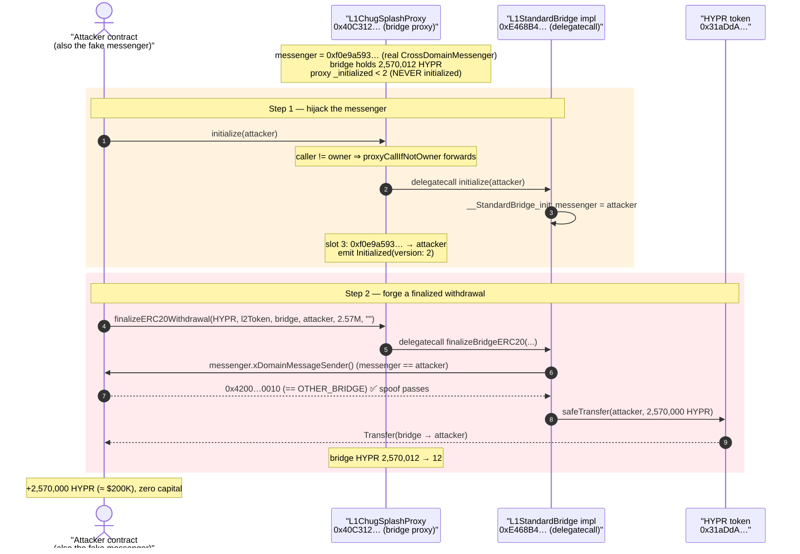
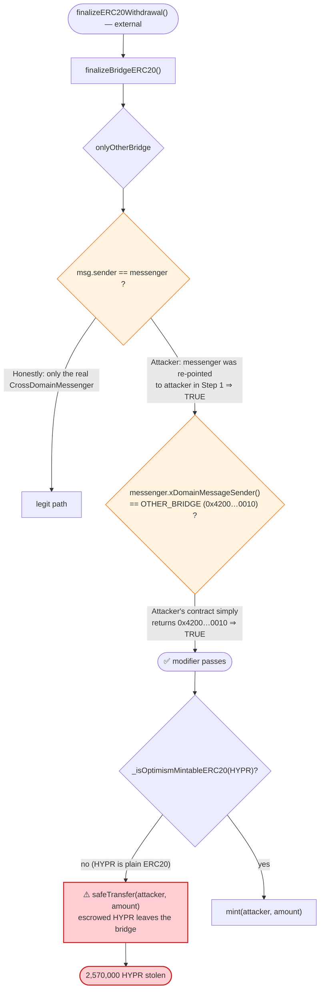
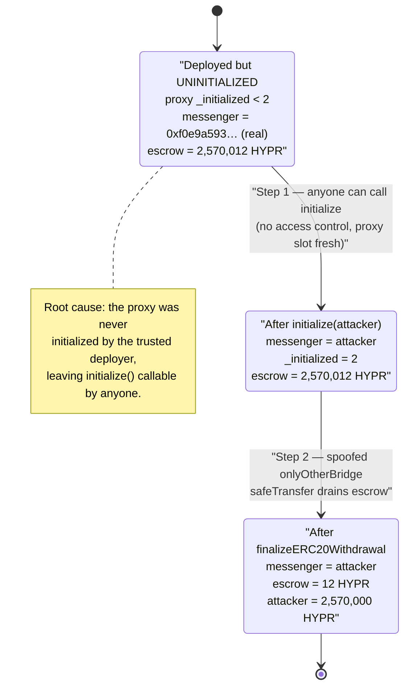

# HYPR Exploit — Uninitialized `L1StandardBridge` Proxy → Cross-Domain Messenger Spoof → Bridge Drain

> **Reproduction:** the PoC compiles & runs in an isolated Foundry project at
> [this project folder](.) (the umbrella DeFiHackLabs repo
> does not whole-compile, so this PoC was extracted).
> Full verbose trace: [output.txt](output.txt).
> Verified vulnerable sources:
> [src_L1_L1StandardBridge.sol](sources/L1StandardBridge_E468B4/src_L1_L1StandardBridge.sol),
> [src_universal_StandardBridge.sol](sources/L1StandardBridge_E468B4/src_universal_StandardBridge.sol),
> [contracts_legacy_L1ChugSplashProxy.sol](sources/L1ChugSplashProxy_40C312/contracts_legacy_L1ChugSplashProxy.sol).

---

## Key info

| | |
|---|---|
| **Loss** | ~$200,000 — **2,570,000 HYPR** drained from the project's L1 standard bridge |
| **Vulnerable contract** | `L1StandardBridge` proxy (`L1ChugSplashProxy`) — [`0x40C31236B228935b0329eFF066B1AD96e319595e`](https://etherscan.io/address/0x40C31236B228935b0329eFF066B1AD96e319595e#code) |
| **Implementation** | `L1StandardBridge` v1.2.1 — [`0xE468B43b4Ae4D750Cd6a5D7EdACC1A751302c99C`](https://etherscan.io/address/0xE468B43b4Ae4D750Cd6a5D7EdACC1A751302c99C#code) |
| **Token drained** | HYPR (`HyprTokenL1`) — [`0x31aDdA225642a8f4D7e90d4152BE6661ab22a5a2`](https://etherscan.io/address/0x31aDdA225642a8f4D7e90d4152BE6661ab22a5a2) |
| **Attacker EOA** | [`0x3ea6ba6d3415e4dfd380516c799aafa94e420519`](https://etherscan.io/address/0x3ea6ba6d3415e4dfd380516c799aafa94e420519) |
| **Attacker contract** | [`0xba6fa6e8500cd8eeda8ebb9dfbcc554ff4a3eb77`](https://etherscan.io/address/0xba6fa6e8500cd8eeda8ebb9dfbcc554ff4a3eb77) |
| **Attack tx** | [`0x51ce3d9cfc85c1f6a532b908bb2debb16c7569eb8b76effe614016aac6635f65`](https://explorer.phalcon.xyz/tx/eth/0x51ce3d9cfc85c1f6a532b908bb2debb16c7569eb8b76effe614016aac6635f65) |
| **Chain / block / date** | Ethereum mainnet / 18,774,584 / Dec 13, 2023 |
| **Compiler** | Solidity 0.8.15 (Optimism Bedrock bridge) / 0.8.15 (proxy) |
| **Bug class** | Uninitialized proxy → attacker-controlled cross-domain messenger → spoofed `onlyOtherBridge` authorization |

---

## TL;DR

HYPR deployed an **OP-Stack `L1StandardBridge`** behind a legacy `L1ChugSplashProxy`, but the proxy
was **never initialized**. The bridge implementation's
[`initialize(CrossDomainMessenger _messenger)`](sources/L1StandardBridge_E468B4/src_L1_L1StandardBridge.sol#L90)
is `public` and guarded only by OpenZeppelin's `reinitializer(2)` — and because the proxy's
`_initialized` storage slot had never been advanced (the implementation's own constructor ran in the
*implementation's* storage, not the proxy's), **anyone could call `initialize` on the proxy** and set the
bridge's trusted `messenger` to any address they liked.

The attacker:

1. **Called `initialize(attacker)`**, pointing the bridge's `messenger` storage slot at their own contract
   ([trace storage change @ slot 3](output.txt#L39): `0xf0e9a593…` → attacker).
2. **Called `finalizeERC20Withdrawal(HYPR, l2Token, bridge, attacker, 2_570_000e18, "")`**. This routes
   into `finalizeBridgeERC20`, which is gated by the
   [`onlyOtherBridge`](sources/L1StandardBridge_E468B4/src_universal_StandardBridge.sol#L109-L115) modifier:
   `msg.sender == messenger && messenger.xDomainMessageSender() == OTHER_BRIDGE`.
   - `msg.sender == messenger` — the attacker calls *through* their own contract acting as the messenger.
   - `messenger.xDomainMessageSender() == OTHER_BRIDGE` — the attacker's contract simply **returns the
     hard-coded L2 bridge predeploy** `0x4200…0010` from its `xDomainMessageSender()` function.
3. Both checks pass. HYPR is not an OptimismMintable token, so the bridge takes the **`safeTransfer`
   branch** and sends 2,570,000 HYPR straight out of its own balance to the attacker.

Net result: the attacker drained the bridge's entire HYPR balance (2,570,012 → 12 HYPR), ≈ **$200K**, in
two function calls, with no flash loan and no capital.

---

## Background — what the contracts do

This is a stock **Optimism Bedrock bridge stack** that the HYPR project deployed for its own L2:

- **`L1StandardBridge`** ([source](sources/L1StandardBridge_E468B4/src_L1_L1StandardBridge.sol)) is the
  canonical L1 side of an OP-Stack bridge. It escrows L1 ERC-20 deposits and, when a withdrawal is proven
  & finalized on L1, releases the escrowed tokens to the recipient. The release path
  (`finalizeERC20Withdrawal` → `finalizeBridgeERC20`) is supposed to be reachable **only** via a genuine
  cross-domain message from the L2 bridge, relayed by the L1 `CrossDomainMessenger`.
- **`StandardBridge`** (the shared parent,
  [source](sources/L1StandardBridge_E468B4/src_universal_StandardBridge.sol)) holds the `messenger`
  storage variable and defines the `onlyOtherBridge` authorization modifier.
- **`L1ChugSplashProxy`** ([source](sources/L1ChugSplashProxy_40C312/contracts_legacy_L1ChugSplashProxy.sol))
  is Optimism's legacy proxy: a near-vanilla delegatecall proxy whose only twist is that any call from a
  non-owner is transparently forwarded (delegatecalled) to the implementation
  ([`proxyCallIfNotOwner`](sources/L1ChugSplashProxy_40C312/contracts_legacy_L1ChugSplashProxy.sol#L87-L94)).
- **HYPR (`HyprTokenL1`)** is a plain upgradeable ERC-20 — *not* an `OptimismMintableERC20`. This matters:
  it means the bridge holds a real escrow balance and releases it via `safeTransfer`, rather than minting.

On-chain facts at fork block 18,774,584 (read from the trace):

| Parameter | Value |
|---|---|
| Bridge messenger slot (slot 3) **before** | `0xf0e9a593d3b252511adfb5ea16ebf0a0450b2a11` (the real `CrossDomainMessenger`) |
| Bridge messenger slot (slot 3) **after `initialize`** | `0x7fa9385be102ac3eac297483dd6233d62b3e1496` (the attacker) |
| Bridge HYPR balance **before** | **2,570,012 HYPR** |
| Bridge HYPR balance **after** | **12 HYPR** |
| Attacker HYPR balance **before / after** | 0 → **2,570,000 HYPR** |
| `OTHER_BRIDGE` (immutable) | `0x4200000000000000000000000000000000000010` (L2 standard bridge predeploy) |
| `messenger.xDomainMessageSender()` returned by attacker | `0x4200000000000000000000000000000000000010` |

The whole game: the bridge held its entire escrowed HYPR supply, and its release function trusts a
storage-mutable `messenger` that the attacker could re-point at themselves.

---

## The vulnerable code

### 1. `initialize` is `public` and only `reinitializer(2)`-guarded

```solidity
// src/L1/L1StandardBridge.sol
function initialize(CrossDomainMessenger _messenger) public clearLegacySlot reinitializer(2) {
    __StandardBridge_init({ _messenger: _messenger });
}
```
[src_L1_L1StandardBridge.sol:90-92](sources/L1StandardBridge_E468B4/src_L1_L1StandardBridge.sol#L90-L92)

`__StandardBridge_init` simply writes the caller-supplied address into the trusted messenger slot:

```solidity
// src/universal/StandardBridge.sol
function __StandardBridge_init(CrossDomainMessenger _messenger) internal onlyInitializing {
    messenger = _messenger;     // ← storage slot 3, fully attacker-controlled
}
```
[src_universal_StandardBridge.sol:125-127](sources/L1StandardBridge_E468B4/src_universal_StandardBridge.sol#L125-L127)

The implementation's constructor *does* call `initialize` — but in the implementation's own context:

```solidity
constructor() Semver(1, 2, 1) StandardBridge(StandardBridge(payable(Predeploys.L2_STANDARD_BRIDGE))) {
    initialize({ _messenger: CrossDomainMessenger(address(0)) });   // sets _initialized=2 on the IMPL, not the proxy
}
```
[src_L1_L1StandardBridge.sol:72-74](sources/L1StandardBridge_E468B4/src_L1_L1StandardBridge.sol#L72-L74)

Because a proxy delegatecalls the implementation, the implementation's constructor only ever touched the
**implementation contract's** storage. The **proxy's** `_initialized` slot was left at its default (`< 2`),
so `reinitializer(2)` happily admitted the attacker's call on the proxy.

### 2. The release path trusts the storage-mutable `messenger`

```solidity
// src/universal/StandardBridge.sol
modifier onlyOtherBridge() {
    require(
        msg.sender == address(messenger) && messenger.xDomainMessageSender() == address(OTHER_BRIDGE),
        "StandardBridge: function can only be called from the other bridge"
    );
    _;
}
```
[src_universal_StandardBridge.sol:109-115](sources/L1StandardBridge_E468B4/src_universal_StandardBridge.sol#L109-L115)

```solidity
function finalizeBridgeERC20(
    address _localToken, address _remoteToken,
    address _from, address _to, uint256 _amount, bytes calldata _extraData
) public onlyOtherBridge {
    if (_isOptimismMintableERC20(_localToken)) {
        ...
        OptimismMintableERC20(_localToken).mint(_to, _amount);
    } else {
        deposits[_localToken][_remoteToken] = deposits[_localToken][_remoteToken] - _amount;
        IERC20(_localToken).safeTransfer(_to, _amount);   // ⚠️ releases escrowed HYPR to attacker
    }
    _emitERC20BridgeFinalized(_localToken, _remoteToken, _from, _to, _amount, _extraData);
}
```
[src_universal_StandardBridge.sol:261-287](sources/L1StandardBridge_E468B4/src_universal_StandardBridge.sol#L261-L287)

`finalizeERC20Withdrawal` is the thin legacy wrapper the attacker called:

```solidity
function finalizeERC20Withdrawal(
    address _l1Token, address _l2Token, address _from, address _to, uint256 _amount, bytes calldata _extraData
) external {
    finalizeBridgeERC20(_l1Token, _l2Token, _from, _to, _amount, _extraData);
}
```
[src_L1_L1StandardBridge.sol:197-208](sources/L1StandardBridge_E468B4/src_L1_L1StandardBridge.sol#L197-L208)

### 3. The proxy forwards a non-owner's calls straight into the implementation

```solidity
// contracts/legacy/L1ChugSplashProxy.sol
modifier proxyCallIfNotOwner() {
    if (msg.sender == _getOwner() || msg.sender == address(0)) {
        _;
    } else {
        _doProxyCall();   // delegatecall into the bridge implementation
    }
}
```
[contracts_legacy_L1ChugSplashProxy.sol:87-94](sources/L1ChugSplashProxy_40C312/contracts_legacy_L1ChugSplashProxy.sol#L87-L94)

The attacker is not the proxy owner, so both `initialize(...)` and `finalizeERC20Withdrawal(...)` fall
through to `_doProxyCall()` and execute in the proxy's storage context — exactly what the attacker wants.

---

## Root cause — why it was possible

Three independent facts compose into a critical bug:

1. **The proxy was deployed but never initialized.** The standard, correct deployment of an OP-Stack bridge
   calls `proxy.upgradeToAndCall(impl, abi.encodeCall(initialize, (realMessenger)))` so that the proxy's
   `_initialized` slot becomes `2` and `messenger` is set to the genuine `CrossDomainMessenger`. HYPR's
   deployment skipped this: the proxy pointed at the implementation but the proxy's `_initialized` slot was
   still `< 2` and `messenger` still held an unverified value.

2. **`initialize` is permissionless.** It has no `onlyOwner`/`onlyAdmin` guard — only `reinitializer(2)`.
   The OP-Stack design assumes the *only* uninitialized window is the atomic upgrade-and-call performed by
   the trusted deployer. An uninitialized live proxy turns this into "anyone can set the messenger."

3. **Authorization is anchored on a storage-mutable address (`messenger`) plus a value (`xDomainMessageSender`)
   that the messenger itself reports.** Once the attacker controls `messenger`, *both* halves of
   `onlyOtherBridge` are under their control: `msg.sender == messenger` (they call through their own
   contract) and `messenger.xDomainMessageSender() == OTHER_BRIDGE` (they make their contract return the
   well-known L2 predeploy `0x4200…0010`). The check, intended to prove "this call originated from the L2
   bridge," is reduced to "the attacker says so."

> The genuine cross-domain security model is: a *real* `CrossDomainMessenger` only sets
> `xDomainMessageSender` to the L2 sender while relaying a *proven* L2→L1 message. By substituting a fake
> messenger, the attacker forges that provenance entirely.

The escrow drain is the natural consequence: with the gate bypassed, `finalizeBridgeERC20` releases as much
of the bridge's HYPR escrow as the attacker requests, and HYPR being a non-mintable token means it comes
straight out of the bridge's real balance via `safeTransfer`.

---

## Preconditions

- The bridge proxy is **uninitialized** at the proxy level (`_initialized < 2` in the proxy's storage). This
  was the live, deployed state of `0x40C312…` at the time of the attack.
- The bridge holds an escrow balance of the target token (2,570,012 HYPR).
- HYPR is **not** an `OptimismMintableERC20` (so the bridge releases via `safeTransfer`, not `mint`).
- No capital, flash loan, owner key, or special role is required — the attacker is a plain EOA via a tiny
  contract that implements `xDomainMessageSender()`.

---

## Attack walkthrough (with on-chain numbers from the trace)

All figures are from [output.txt](output.txt). The attacker's contract serves as the fake messenger and
implements `xDomainMessageSender()` to return the L2 predeploy.

| # | Step | Call | Effect (ground-truth) |
|---|------|------|------|
| 0 | **Initial** | — | Bridge `messenger` = `0xf0e9a593…` (real). Bridge holds **2,570,012 HYPR**. Attacker holds 0. |
| 1 | **Hijack the messenger** | `ChugSplash.initialize(attacker)` | `proxyCallIfNotOwner` → delegatecall → `__StandardBridge_init`. Storage **slot 3** changes `0xf0e9a593…` → `0x7fa9385b…` (attacker). `Initialized(version: 2)` emitted. ([trace L33-L41](output.txt#L33-L41)) |
| 2 | **Forge a finalized withdrawal** | `ChugSplash.finalizeERC20Withdrawal(HYPR, l2Token, bridge, attacker, 2_570_000e18, "")` | Routes to `finalizeBridgeERC20`. `onlyOtherBridge` calls `attacker.xDomainMessageSender()` → returns `0x4200…0010` == `OTHER_BRIDGE`. **Check passes.** ([trace L42-L47](output.txt#L42-L47)) |
| 3 | **Escrow released** | (inside step 2) `HYPR.transfer(attacker, 2_570_000e18)` | `Transfer(bridge → attacker, 2.57e24)`. Bridge HYPR balance: 2,570,012 → **12**. Attacker: 0 → **2,570,000**. `ERC20WithdrawalFinalized` + `ERC20BridgeFinalized` emitted. ([trace L56-L65](output.txt#L56-L65)) |
| 4 | **Verify** | `HYPR.balanceOf(attacker)` | **2,570,000 HYPR** (≈ $200K). ([trace L70-L73](output.txt#L70-L73)) |

Note: because HYPR is not Optimism-mintable, the `_isOptimismMintableERC20` probe
`supportsInterface(0x01ffc9a7)` reverts ([trace L48-L55](output.txt#L48-L55)) — the bridge falls into the
`else` (`safeTransfer`) branch, exactly the escrow-drain path.

### Profit / loss accounting

| Party | Asset | Before | After | Delta |
|---|---|---:|---:|---:|
| Bridge `0x40C312…` | HYPR | 2,570,012 | 12 | **−2,570,000** |
| Attacker | HYPR | 0 | 2,570,000 | **+2,570,000** |
| Attacker | Capital spent | — | — | **0** (no loan, no input token) |

The 2,570,000 HYPR ≈ **$200,000** at the contemporaneous HYPR price — the entire bridge escrow, taken for
the cost of two transactions' gas.

---

## Diagrams

### Sequence of the attack



### Authorization spoof — how `onlyOtherBridge` is defeated



### Bridge state evolution



---

## Remediation

1. **Initialize the proxy atomically at deployment.** Always deploy OP-Stack bridges via
   `upgradeToAndCall`/`setCode`-then-`initialize` in a single trusted transaction, so the proxy's
   `_initialized` slot is advanced and `messenger` is set to the real `CrossDomainMessenger` before the
   contract is ever live. Never leave a funded proxy in an uninitialized state.

2. **Make `initialize` access-controlled, not just `reinitializer`.** Gate it on the proxy owner/deployer
   (e.g. `onlyProxyAdmin` or a constructor-bound deployer), so even an uninitialized proxy cannot have its
   trusted addresses set by an arbitrary caller. `reinitializer(N)` protects against *re*-initialization but
   does nothing about *who* performs the first initialization.

3. **Do not anchor cross-domain authorization on a mutable, self-reported value.** `onlyOtherBridge` trusts
   `messenger` (storage-mutable) and `messenger.xDomainMessageSender()` (reported by that same address).
   Pin the messenger as an `immutable`/constructor-set value, or verify it against an independent registry,
   so it cannot be re-pointed by a later `initialize`.

4. **Add deployment-time invariant checks / post-deploy monitoring.** A simple check that
   `bridge.messenger()` equals the known `CrossDomainMessenger` (and that `_initialized == 2`) before
   funding the bridge would have caught this. Alert on any `Initialized` event from a live, funded bridge.

5. **Minimize standing escrow.** Bridges that hold large idle balances are high-value single points of
   failure; consider rate limits / withdrawal caps on `finalizeBridgeERC20` so a single forged finalization
   cannot drain the entire escrow.

---

## How to reproduce

The PoC was extracted into a standalone Foundry project (the umbrella DeFiHackLabs repo does not
whole-compile under `forge test`):

```bash
_shared/run_poc.sh 2023-12-HYPR_exp -vvvvv
```

- RPC: an **Ethereum mainnet archive** endpoint is required (fork block 18,774,584). `foundry.toml` uses an
  Infura archive endpoint; the default key was swapped for a working one (`6c80b4…`) because the originally
  configured key returned HTTP 401 (invalid project id).
- Result: `[PASS] testExploit()` — the exploiter's HYPR balance goes from 0 to 2,570,000.

Expected tail:

```
Ran 1 test for test/HYPR_exp.sol:ContractTest
[PASS] testExploit() (gas: 105730)
  Exploiter HYPR balance before attack: 0.000000000000000000
  Exploiter HYPR balance after attack: 2570000.000000000000000000
Suite result: ok. 1 passed; 0 failed; 0 skipped
```

---

*References: BlockSec — https://twitter.com/BlockSecTeam/status/1735197818883588574 ; MevRefund — https://twitter.com/MevRefund/status/1734791082376941810 (HYPR, Ethereum, ~$200K, uninitialized OP-Stack bridge proxy).*
