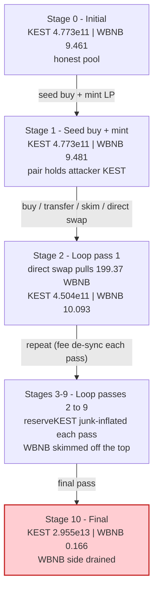
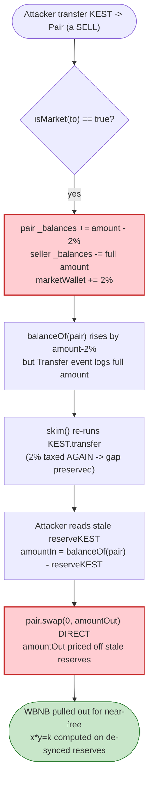

# KEST (KEKESANTA) Exploit — Fee-on-Transfer Reserve De-Sync + `skim()` Pool Drain

> **Reproduction:** the PoC compiles & runs in an isolated Foundry project at
> [this project folder](.) (the umbrella DeFiHackLabs repo does not whole-compile,
> so this PoC was extracted into a standalone project).
> Full verbose trace: [output.txt](output.txt).
> Verified vulnerable source: [KEKESANTA.sol](sources/KEKESANTA_7dda13/KEKESANTA.sol).

---

## Key info

| | |
|---|---|
| **Loss** | ~$2.3K — **9.295 WBNB** drained from the KEST/WBNB PancakeSwap pair (attacker net profit **9.115 WBNB**, flash-loan premium 0.18 WBNB) |
| **Vulnerable contract** | `KEKESANTA` (KEST) — [`0x7dda132dd57b773a94E27c5CAA97834A73510429`](https://bscscan.com/address/0x7dda132dd57b773a94E27c5CAA97834A73510429#code) |
| **Victim pool** | KEST/WBNB PancakePair — [`0x2D9fFa7ea5D1aAabA58e60168517b49F57E7f85b`](https://bscscan.com/address/0x2D9fFa7ea5D1aAabA58e60168517b49F57E7f85b) |
| **Flash-loan source** | Radiant `LendingPool` — `0xd50Cf00b6e600Dd036Ba8eF475677d816d6c4281` (200 WBNB, 0.09% premium) |
| **Attacker EOA** | [`0x90c4c1aa895a086215765ec9639431309633b198`](https://bscscan.com/address/0x90c4c1aa895a086215765ec9639431309633b198) |
| **Attacker contract** | [`0xc25979956d6f6acfc3702c68dff7a4d871eee4aa`](https://bscscan.com/address/0xc25979956d6f6acfc3702c68dff7a4d871eee4aa) |
| **Attack tx** | [`0x2fcee04e64e54f3dd9c15db9ae44e4cbdd57ab4c6f01941a3acf470dc60bfc16`](https://app.blocksec.com/explorer/tx/bsc/0x2fcee04e64e54f3dd9c15db9ae44e4cbdd57ab4c6f01941a3acf470dc60bfc16) |
| **Chain / block / date** | BSC / 34,402,343 / December 16, 2023 |
| **Compiler** | Solidity v0.8.19, optimizer **off** (200 runs default, `OptimizationUsed = 0`) |
| **Bug class** | Fee-on-transfer token de-syncing AMM reserves from real balances, weaponized via `skim()` + direct `swap()` |

---

## TL;DR

`KEKESANTA` (KEST) is a deflationary BEP-20 that charges a **2% fee on every buy and sell** against
its own PancakeSwap pair. Crucially, the fee is applied to the **recipient credit** of the transfer
([KEKESANTA.sol:967-991](sources/KEKESANTA_7dda13/KEKESANTA.sol#L967-L991)): on a *sell*
(`isMarket(to)` is true, i.e. tokens being sent *into* the pair) the contract credits the pair only
`amount - fee` KEST, while the sender is debited the full `amount`. The 2% never lands in the pair.

A Uniswap-V2/PancakeSwap pair caches its reserves separately from `balanceOf`, and resynchronizes
them in `mint`/`burn`/`swap`/`skim`/`sync`. KEST's fee therefore opens a permanent, attacker-pumpable
gap between the pair's **cached `reserveKEST`** and its **actual KEST balance**. The attacker turns
that gap into free WBNB by:

1. Flash-borrowing **200 WBNB** from Radiant.
2. Seeding the pair with KEST and minting LP so it holds a large KEST balance.
3. Running a **9-iteration loop** that, each pass:
   - buys KEST with all its WBNB through the router,
   - `transfer`s that KEST directly into the pair and calls `skim()` (the 2% fee on the skim's
     internal `transfer` keeps the pair's *balance* below what a fair re-sync would set),
   - reads the stale `reserveKEST`, computes `amountIn = balanceOf(pair) − reserveKEST`, and calls
     the pair's `swap()` **directly** to pull WBNB out at the manipulated price,
   - and tops up with a router `swapTokensForExactTokens` + `removeLiquidityETH…` to recycle KEST and
     WBNB for the next pass.
4. Repaying the 200.18 WBNB flash loan and keeping the difference.

Net result: the pair's WBNB reserve is bled from **9.461 WBNB → 0.166 WBNB** while its KEST reserve is
junk-inflated from 4.77e29 → 2.96e31. The attacker walks away with **9.115 WBNB** of profit.

---

## Background — what KEST does

`KEKESANTA` ([source](sources/KEKESANTA_7dda13/KEKESANTA.sol)) is a 1-trillion-supply
(`_totalSupply = 1e30` wei, 18 decimals — [:711](sources/KEKESANTA_7dda13/KEKESANTA.sol#L711))
deflationary token with three relevant features:

- **2% buy / 2% sell tax** routed to a `marketWallet`
  (`buyFee`/`sellFee` — [:725-727](sources/KEKESANTA_7dda13/KEKESANTA.sol#L725-L727),
  `takeAFee` — [:927-931](sources/KEKESANTA_7dda13/KEKESANTA.sol#L927-L931)).
- **An "anti-bot" controller** invoked from `_beforeTokenTransfer`
  ([:1123-1147](sources/KEKESANTA_7dda13/KEKESANTA.sol#L1123-L1147)) — `preventBotPurchase` /
  `validation`. It only records/validates; it does **not** stop the exploit (the trace shows
  `validationActive() == true` but the swaps still succeed).
- **`isMarket(addr)`** ([:1151-1163](sources/KEKESANTA_7dda13/KEKESANTA.sol#L1151-L1163)) — returns
  `true` for the router and the pair; this is what classifies a transfer as a buy or a sell.

The pair side is a vanilla **PancakePair** ([source](sources/PancakePair_2D9fFa/PancakePair.sol))
with the standard `mint`/`burn`/`swap`/`skim`/`sync` and the 0.25% swap fee — it has no bug of its
own. The vulnerability lives entirely in how KEST's fee interacts with that pair.

On-chain state at the fork block (block 34,402,343, from the trace's first `getReserves`):

| Parameter | Value |
|---|---|
| `totalSupply` | 1,000,000,000,000 KEST (1e30 wei) |
| `buyFee` / `sellFee` | **2% / 2%** |
| Pair `token0` / `token1` | KEST / WBNB |
| Pair cached `reserveKEST` (reserve0) | 477,302,959,604 KEST (4.773e29 wei) |
| Pair cached `reserveWBNB` (reserve1) | **9.461 WBNB** |
| Pair *actual* WBNB balance | 9.471 WBNB (0.01 already-skimmable excess) |

---

## The vulnerable code

### The fee is taken out of the recipient's credit, so the pair under-receives on sells

```solidity
function _transfer(address from, address to, uint256 amount) internal virtual {
    require(from != address(0), "ERC20: transfer from the zero address");
    require(to   != address(0), "ERC20: transfer to the zero address");
    _beforeTokenTransfer(from, to, amount);

    uint256 fromBalance = _balances[from];
    require(fromBalance >= amount, "ERC20: transfer amount exceeds balance");

    if (isExcludedFromFee[from] || isExcludedFromFee[to]) {
        _balances[from] = fromBalance - amount;
        _balances[to]  += amount;
    } else {
        if (isMarket(from)){                       // BUY: pair -> user
            uint fee = takeAFee(amount, buyFee);    // 2%
            _balances[from] = fromBalance - amount; // pair debited full amount
            _balances[to]  += amount - fee;         // user credited amount-fee
            _balances[marketWallet] += fee;
        }
        if (isMarket(to)){                          // SELL: user -> pair
            uint fee = takeAFee(amount, sellFee);   // 2%
            _balances[from] = fromBalance - amount; // user debited full amount
            _balances[to]  += amount - fee;         // ⚠️ PAIR credited only amount-fee
            _balances[marketWallet] += fee;
        }
    }

    emit Transfer(from, to, amount);                // ⚠️ event always logs full amount
    _afterTokenTransfer(from, to, amount);
}
```
[KEKESANTA.sol:935-1001](sources/KEKESANTA_7dda13/KEKESANTA.sol#L935-L1001)

The fee logic itself:

```solidity
function takeAFee(uint amount, uint feeType) public pure returns (uint){
    return amount * feeType / 100;   // 2% of amount
}
```
[KEKESANTA.sol:927-931](sources/KEKESANTA_7dda13/KEKESANTA.sol#L927-L931)

`isMarket` — what makes the pair a "taxed counterparty":

```solidity
function isMarket(address user) internal view returns(bool){
    if (user == address(_router) || user == address(_pair)) return true;
    return false;
}
```
[KEKESANTA.sol:1151-1163](sources/KEKESANTA_7dda13/KEKESANTA.sol#L1151-L1163)

---

## Root cause — why it was possible

A constant-product pair is only safe if its **cached reserves equal the tokens it actually holds**
after every operation. PancakeSwap maintains this by re-syncing `reserve = balanceOf(token, pair)`
inside `mint`/`burn`/`swap`/`skim`/`sync`, and it enforces `x·y ≥ k` *using those cached reserves*.

KEST breaks the invariant in two compounding ways:

1. **Sells silently shrink what the pair receives.** When the attacker sends KEST *into* the pair
   (a "sell", `isMarket(to)` true), the pair's KEST balance only rises by `amount − 2%`. The pair's
   `swap()` math, however, computes `amountIn = balanceOf(pair) − reserveKEST` and prices WBNB out of
   it. By repeatedly pushing KEST in and `skim`/`swap`-ing, the attacker controls the relationship
   between `balanceOf(pair)` and the stale `reserveKEST`, and can mint a favorable `amountIn` while
   leaving the WBNB side fully extractable.

2. **`balanceOf` ≠ reserve is directly readable and exploitable.** Because the fee is *not* reflected
   into reserves, an external caller can read the cached `reserveKEST`, read the real
   `balanceOf(pair)`, and call the pair's **low-level `swap()` directly** with a hand-computed
   `amountOut` — bypassing the router's slippage protection entirely. The PoC does exactly this
   ([KEST_exp.sol:82-85](test/KEST_exp.sol#L82-L85)):

   ```solidity
   (reserveKEST, reserveWBNB,) = KEST_WBNB.getReserves();
   uint256 amountIn  = KEST.balanceOf(address(KEST_WBNB)) - reserveKEST;   // the fee/skim gap
   uint256 amountOut = PancakeRouter.getAmountOut(amountIn, reserveKEST, reserveWBNB);
   KEST_WBNB.swap(0, amountOut, address(this), bytes(""));                 // pull WBNB for "free"
   ```

The four design decisions that compose into the loss:

- **Fee-on-transfer with no reserve reconciliation.** The token charges 2% but never tells the pair,
  so reserves and balances permanently diverge.
- **The fee is asymmetric in effect.** On a sell the *pair* eats the shortfall (it is credited
  `amount − fee` while the seller is debited `amount`), so each round-trip leaves stale value the
  attacker can monetize.
- **`skim()` re-introduces a fee.** `skim` calls KEST's own `transfer`, which taxes again — letting
  the attacker keep `balanceOf(pair)` just below where a clean sync would put it, preserving the gap.
- **No oracle / no `swapAndLiquify`-style internal accounting.** Nothing caps how far reserves can
  drift from balances, and the attacker can call the pair's `swap()` directly.

---

## Preconditions

- KEST charges a non-zero buy/sell fee (2% at the fork block) and **does not** push that fee back into
  the pair's reserves.
- The attacker can deal directly with the pair (`skim`, low-level `swap`) — always true; pairs are
  public.
- Working WBNB capital to amplify the per-iteration extraction. It is flash-loanable: the PoC borrows
  **200 WBNB** from Radiant at a 0.09% premium and repays it intra-transaction.

---

## Attack walkthrough (with on-chain numbers from the trace)

Pair `token0 = KEST`, `token1 = WBNB`, so `reserve0 = KEST`, `reserve1 = WBNB`. All figures come
directly from `Sync`/`Swap` events in [output.txt](output.txt). KEST amounts are in token units
(÷1e18 of the wei figure); WBNB in whole tokens.

| # | Step | KEST reserve | WBNB reserve | Effect |
|---|------|-------------:|-------------:|--------|
| 0 | **Initial** (flash loan of 200 WBNB just received) | 4.773e11 | 9.461 | Honest pool. Pair WBNB balance 9.471. |
| 1 | **Seed buy** — router `swapExactTokensForTokens…(1e16 WBNB → KEST)` | 4.768e11 | 9.471 | Attacker gets ~5.027e8 KEST. |
| 2 | **Seed LP** — `transfer` KEST + WBNB to pair, `mint()` | 4.773e11 | 9.481 | Pair now holds attacker's KEST; LP minted. |
| 3 | **Loop pass 1** — buy KEST with all WBNB; `transfer`→pair; `skim()`; direct `swap(0, 199.37 WBNB)` | 4.504e11 | 10.093 | Pulls **199.37 WBNB** out via the stale-reserve `swap`; then router buy-back + `removeLiquidityETH` recycle KEST/WBNB. |
| … | **Loop passes 2–9** — same pattern, each pass inflating `reserveKEST` and skimming WBNB | grows 4.5e11 → 2.96e13 | oscillates 0.16 ↔ 209 | KEST reserve junk-inflates each pass; WBNB is progressively drained off the top. |
| 10 | **Final state** after pass 9 | **2.955e13** | **0.166** | Pool's WBNB essentially emptied. |
| 11 | **Repay** — `approve(Radiant, 200.18)`, return flash loan | — | — | 200 principal + 0.18 premium. |

The WBNB reserve never sits still: each pass the attacker injects ~200 WBNB by buying KEST (reserve
spikes to ~209.46 WBNB in the intermediate `Sync` events), then the direct `swap()` and the
`removeLiquidityETH` pull WBNB back out, netting a few hundredths–tenths of a WBNB per pass. Over 9
passes the genuine 9.461 WBNB of liquidity is siphoned out.

### Profit / loss accounting (WBNB)

| Item | Amount (WBNB) |
|---|---:|
| Flash loan received (Radiant) | 200.000 |
| Flash loan repaid (principal + 0.09% premium) | −200.180 |
| Attacker WBNB balance **before** attack | 0.000 |
| Attacker WBNB balance **after** attack | **+9.115077346949637803** |
| **Net attacker profit** | **+9.115 WBNB** |
| Pool WBNB reserve drained (9.461 → 0.166) | ≈ 9.295 = 9.115 profit + 0.180 premium |

The ~9.295 WBNB pulled out of the pool exactly funds the 0.18 WBNB premium plus the 9.115 WBNB the
attacker keeps — confirming the loss is the pool LPs' honest WBNB liquidity.

---

## Diagrams

### Sequence of the attack

```mermaid
sequenceDiagram
    autonumber
    actor A as "Attacker contract"
    participant RAD as "Radiant LendingPool"
    participant R as "PancakeRouter"
    participant P as "KEST/WBNB Pair"
    participant T as "KEST token"

    A->>RAD: flashLoan(200 WBNB)
    RAD-->>A: 200 WBNB + executeOperation()

    Note over A,T: Seed — make the pair hold attacker KEST
    A->>R: swap 0.01 WBNB -> KEST
    A->>P: transfer KEST + WBNB, mint() LP

    rect rgb(255,235,238)
    Note over A,T: Loop x9 — de-sync & drain
    loop 9 times
        A->>R: swap ALL WBNB -> KEST (2% buy fee)
        A->>T: transfer KEST into pair (2% sell fee, pair under-credited)
        A->>P: skim() (fee re-applied, gap preserved)
        A->>P: getReserves(); amountIn = balanceOf(pair) - reserveKEST
        A->>P: swap(0, amountOut) directly -> pull WBNB
        A->>R: swapTokensForExactTokens (recycle)
        A->>R: removeLiquidityETHSupportingFeeOnTransferTokens
    end
    end

    A->>RAD: approve + repay 200.18 WBNB
    Note over A: Net +9.115 WBNB (the pool's honest liquidity)
```

### Pool state evolution



### Why the fee breaks the pair invariant



---

## Remediation

1. **Do not use a fee-on-transfer token as a raw AMM reserve asset.** If a token must charge transfer
   fees, the fee must be **reflected into the pair** (or excluded for the pair entirely) so cached
   reserves never diverge from real balances. The cleanest fix is `isExcludedFromFee[pair] = true`,
   making the pair a fee-free counterparty — then `balanceOf(pair)` always equals what the AMM
   expects, and `skim`/direct-`swap` cannot mine a gap.
2. **Never credit the pair `amount − fee` while debiting the sender `amount`.** Either burn the fee
   from the *sender's* side before the pair sees the transfer, or route fee collection so the pair is
   not the entity short-changed. The asymmetric credit in the `isMarket(to)` branch is the precise
   line that opens the exploitable gap.
3. **Emit the *actual* transferred amount.** `_transfer` emits `Transfer(from, to, amount)` even when
   `amount − fee` was moved; correct accounting and any off-chain reserve monitoring depend on the
   event matching the real balance delta.
4. **Add a reserve/balance reconciliation guard.** Protocols building on fee tokens should compare
   `balanceOf(pair)` against cached reserves and cap how far a single operation may move them, or use
   a TWAP/oracle for pricing rather than instantaneous reserves.
5. **Audit the dead-code branch.** In `_transfer`'s `else` block, a transfer where neither party is a
   market (a normal user→user move) updates **no balances at all** while still emitting `Transfer` —
   a separate accounting bug. A single, total-conserving fee path (debit sender `amount`, credit
   recipient `amount − fee`, credit `marketWallet` `fee`, unconditionally) removes both this and the
   pair-undercrediting issue.

---

## How to reproduce

```bash
_shared/run_poc.sh 2023-12-KEST_exp -vvvvv
```

- RPC: a **BSC archive** endpoint is required (fork block 34,402,343, Dec 2023). `foundry.toml` uses
  `https://bsc-mainnet.public.blastapi.io`, which serves historical state at that block; pruned
  public RPCs fail with `historical state ... is not available` / `header not found`.
- Result: `[PASS] testExploit()` — attacker ends with **9.115077346949637803 WBNB** starting from 0.

Expected tail:

```
Ran 1 test for test/KEST_exp.sol:KESTExploit
[PASS] testExploit() (gas: 3702580)
  Exploiter WBNB balance before attack: 0.000000000000000000
  Exploiter WBNB balance after attack: 9.115077346949637803
Suite result: ok. 1 passed; 0 failed; 0 skipped
```

---

*Reference: post-mortem thread — https://x.com/MetaSec_xyz/status/1736077719849623718 (KEST/KEKESANTA, BSC, ~$2.3K).*
