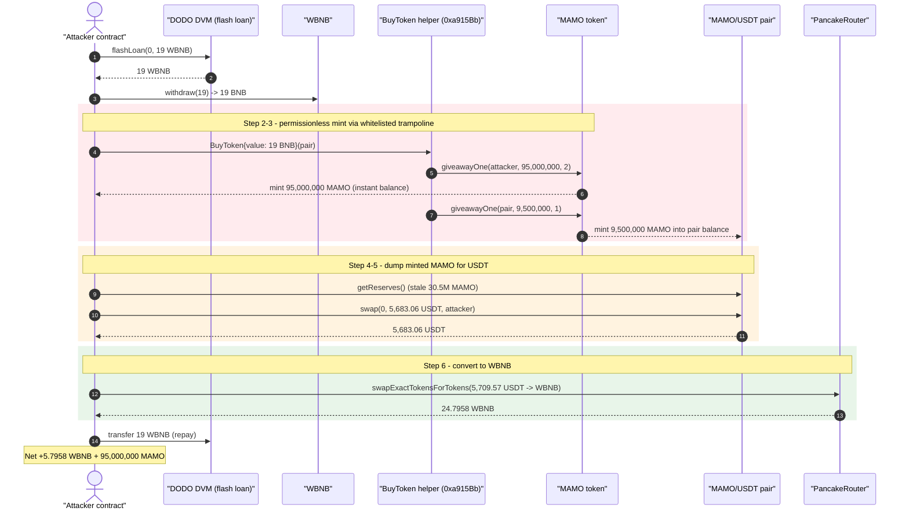
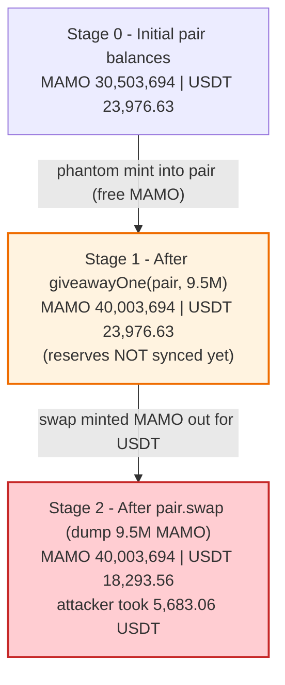
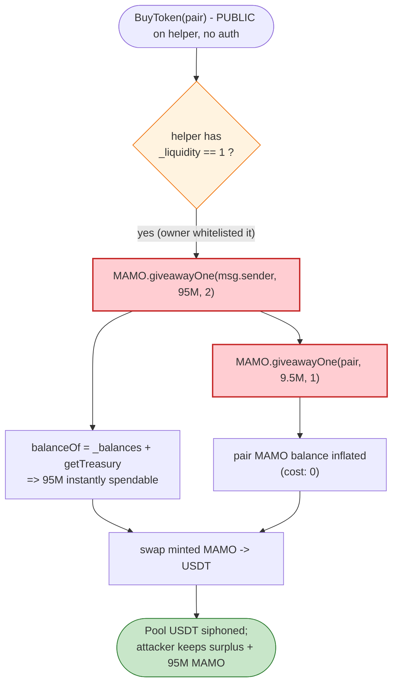

# MAMO (Matmo) Exploit — Permissionless Mint via Whitelisted `BuyToken` → `giveawayOne`

> **Reproduction:** the PoC compiles & runs in an isolated Foundry project at
> [this project folder](.) (the umbrella DeFiHackLabs repo does not whole-compile,
> so this PoC was extracted into a standalone project).
> Full verbose trace: [output.txt](output.txt).
> Verified vulnerable source: [sources/MAMO_4341bd/MAMO.sol](sources/MAMO_4341bd/MAMO.sol).

---

## Key info

| | |
|---|---|
| **Loss** | ~$3.3K — attacker netted **5.7958 WBNB** + 95,000,000 MAMO; the MAMO/USDT pair was drained of **5,683.06 USDT** |
| **Vulnerable contract (token)** | `MAMO` (Matmo) — [`0x4341bdCEd3908A45835C67A2DbBDe2d2dAA6645D`](https://bscscan.com/address/0x4341bdCEd3908A45835C67A2DbBDe2d2dAA6645D#code) |
| **Mint trampoline (unverified)** | `BuyToken` helper — [`0xa915Bb6D5C117fB95E9ac2edDaE68AAd5EdB5841`](https://bscscan.com/address/0xa915Bb6D5C117fB95E9ac2edDaE68AAd5EdB5841) (whitelisted `_liquidity==1`) |
| **Victim pool** | MAMO/USDT PancakePair — [`0x5813d7818c9d8F29A9a96B00031ef576E892DEf4`](https://bscscan.com/address/0x5813d7818c9d8F29A9a96B00031ef576E892DEf4) (PoC header labels this the "Vulnerable Contract"; the real flaw is in the token) |
| **Flash-loan source** | DODO DVM (WBNB/quote) — `0xD534fAE679f7F02364D177E9D44F1D15963c0Dd7` |
| **Attacker EOA** | [`0x829fe73463ceae6579973b8bcd1e018976040ec4`](https://bscscan.com/address/0x829fe73463ceae6579973b8bcd1e018976040ec4) |
| **Attacker contract** | [`0xd7a7d90b63da1b4e7ef79cb36935d38af0d6d0b4`](https://bscscan.com/address/0xd7a7d90b63da1b4e7ef79cb36935d38af0d6d0b4) |
| **Attack tx** | [`0x189a8dc1e0fea34fd7f5fa78c6e9bdf099a8d575ff5c557fa30d90c6acd0b29f`](https://bscscan.com/tx/0x189a8dc1e0fea34fd7f5fa78c6e9bdf099a8d575ff5c557fa30d90c6acd0b29f) |
| **Chain / block / date** | BSC / 34,083,189 / Dec 5, 2023 |
| **Compiler** | Solidity v0.8.18, optimizer disabled (200 runs) |
| **Bug class** | Broken access control on mint — a whitelisted "buy" trampoline that forwards to an unauthenticated `giveawayOne` mint |

---

## TL;DR

The MAMO token exposes two mint-like functions, `giveaway()` and `giveawayOne()`
([MAMO.sol:329-382](sources/MAMO_4341bd/MAMO.sol#L329-L382)), that emit `Transfer(0x0, addr, amount)`
and credit a "treasury" balance for an arbitrary address and amount. The **only** gate is
`_liquidity[_msgSender()] == 1` — a manually-managed whitelist of "liquidity" addresses.

A helper contract `0xa915Bb6D5C117fB95E9ac2edDaE68AAd5EdB5841` (unverified, but observable in the
trace) was added to that whitelist. It exposes a **permissionless** `BuyToken(address pair)` entry
point that, when called, invokes `giveawayOne` **twice**:

- mints **95,000,000 MAMO to `msg.sender`** (the caller), and
- mints **9,500,000 MAMO into the target pair**'s balance.

Because `balanceOf` counts treasury "fund" credits as spendable balance
([MAMO.sol:438-450](sources/MAMO_4341bd/MAMO.sol#L438-L450)), those minted tokens are immediately
transferable / swappable. So **anyone** can call `BuyToken`, receive a large MAMO balance for free,
and dump it into the MAMO/USDT pool.

The attacker:

1. Flash-loans 19 WBNB from a DODO DVM.
2. Unwraps it to BNB and calls `BuyToken{value: 19 BNB}(pair)` on the trampoline — getting **95M MAMO
   minted to itself** and **9.5M MAMO injected into the pair** (the latter inflating the pair's MAMO
   reserve and pre-positioning the dump).
3. Calls `pair.swap()` directly to sell 9.5M MAMO into the inflated pool → **5,683.06 USDT** out.
4. Swaps USDT → WBNB via the Pancake router → **24.7958 WBNB**.
5. Repays the 19 WBNB flash loan, keeping **5.7958 WBNB** plus 95M un-dumped MAMO.

Net result: free profit from a token whose mint authority was effectively public.

---

## Background — what MAMO does

`MAMO` ("Matmo") is a hand-rolled BEP-20 with a "treasury" vesting layer ([source](sources/MAMO_4341bd/MAMO.sol)).
Instead of a single `_balances` mapping, an account's spendable amount is the sum of its plain
balance **plus** any unclaimed treasury "fund":

```solidity
function balanceOf(address account) public view returns (uint256) {
    return _balances[account] + getTreasury(account);   // treasury credits count as balance
}
```
([MAMO.sol:438-440](sources/MAMO_4341bd/MAMO.sol#L438-L440))

Key state:

| Field | Value / meaning |
|---|---|
| `_totalSupply` | 410,000,000,000 ether (fixed; **never increased** by giveaway) |
| `_capacity` | running tally of how much has been "minted" via giveaway, capped at `totalSupply()` |
| `_liquidity[addr]` | whitelist flag; `== 1` authorizes `giveaway`, `giveawayOne`, `swapTeasury`, `setTime` |
| `_treasury[tag][addr]` | per-address vesting buckets (`ANCHOR=0`, `BANK=1`) |

The treasury library lets a "fund" credit vest over time, but `giveawayOne(addr, amount, times>1)`
credits the `BANK` bucket directly, and `getTreasury` returns `fund - reward` immediately — so a
fresh credit with no `start`/`end` set is **fully counted as balance right away**
(`Treasury.count` returns `fund - reward` once `ts >= end`, and here `start == end == 0`, so the
`t.end > t.start` guard is false → `count` returns 0 from `count()`, but `getTreasury` reads
`fund - reward` directly, not through `count()`). The trace confirms the 95M was instantly spendable.

The mint surface is gated only by the whitelist; there is no per-call rate limit, no caller-identity
check beyond `_liquidity == 1`, and the trampoline that holds the whitelist flag exposes minting to
the public.

---

## The vulnerable code

### 1. `giveawayOne` — a whitelist-gated mint with no further checks

```solidity
function giveawayOne(
    address _addr,
    uint _amount,
    uint8 times
) external returns (bool) {
    require(_liquidity[_msgSender()] == 1, "Error: Operation failed");   // ← ONLY gate
    uint count = 0;
    if (times == 1) {
        _treasury[ANCHOR][_addr].incrFund(_amount);
    } else if (times > 1) {
        _treasury[BANK][_addr].incrFund(_amount);                        // credit arbitrary addr
    }

    unchecked { count += _amount; }
    emit Transfer(address(0), _addr, _amount);                           // looks like a real mint
    require(capacity() + count <= totalSupply(), "Error: capacity exceed");
    unchecked { _capacity += count; }
    return true;
}
```
([MAMO.sol:360-382](sources/MAMO_4341bd/MAMO.sol#L360-L382))

The sibling `giveaway()` ([MAMO.sol:329-358](sources/MAMO_4341bd/MAMO.sol#L329-L358)) does the same
for arrays of addresses. The capacity cap (`410e9 ether`) is astronomically large, so it imposes no
practical limit on per-attack minting.

### 2. The whitelist gate and how it's granted

```solidity
function lp(address account, uint8 tag) public onlyOwner {
    if (tag == 1) { _liquidity[account] = 1; }       // grant mint authority
    else if (tag == 2) { _liquidity[account] = 0; }
}
```
([MAMO.sol:452-462](sources/MAMO_4341bd/MAMO.sol#L452-L462))

The token owner had granted `_liquidity == 1` to the `BuyToken` helper
`0xa915Bb…`. That helper, in turn, exposes a **public** `BuyToken(address)` that anyone can call,
which forwards into `giveawayOne`. Effectively, the helper became an open mint faucet:

```
BuyToken(pair):
    MAMO.giveawayOne(msg.sender, 95_000_000e18, 2)   // mint 95M to caller
    MAMO.giveawayOne(pair,       9_500_000e18,  1)   // mint 9.5M into the pool
    (forward the received BNB onward)
```

This is reconstructed from the live trace
([output.txt:1598-1613](output.txt)) — the helper's bytecode is unverified on BscScan, but the two
`giveawayOne` sub-calls with those exact amounts are fully visible.

---

## Root cause — why it was possible

Three composable mistakes turn a "treasury giveaway" feature into a public mint:

1. **Mint authority is delegated to a contract that re-exposes it permissionlessly.** `giveawayOne`
   trusts any address with `_liquidity == 1`. The owner whitelisted a helper contract whose
   `BuyToken` function has **no access control and no economic check** — it mints a fixed 95M MAMO to
   `msg.sender` regardless of how much value (`msg.value`) is actually sent. The 19 BNB the attacker
   forwarded was not validated against the minted amount at all.

2. **Phantom mint that does not back the AMM price.** `giveawayOne(pair, 9.5M, 1)` injects MAMO
   directly into the pair's token balance, then the attacker swaps against it. Because the pair
   prices from reserves, dumping freshly-minted MAMO that cost nothing extracts the pool's USDT for
   free. The mint also doesn't move `_totalSupply`, so off-chain "supply" telemetry would not even
   flag it.

3. **Treasury credits are immediately spendable balance.** `balanceOf` sums `_balances + getTreasury`,
   and `getTreasury` returns `fund - reward` with no vesting enforcement for a freshly-funded bucket
   that has `start == end == 0`. So the 95M "vested giveaway" is liquid the instant it is minted —
   there is no lockup that would have given the team time to react.

The PoC header labels the **pair** as the vulnerable contract, but the pair behaves correctly; the
defect is the token's mint surface. The pair is merely the victim that holds the USDT being siphoned.

---

## Preconditions

- A whitelisted (`_liquidity == 1`) minting trampoline exists and exposes minting publicly — satisfied
  by `0xa915Bb…`, granted by the MAMO owner before the attack.
- The MAMO/USDT PancakePair holds USDT worth draining (pre-attack reserves below).
- Working capital in BNB to call `BuyToken` (19 BNB here) — fully recovered intra-transaction, so it
  is **flash-loanable**. The PoC sources it from a DODO DVM `flashLoan`.

---

## Attack walkthrough (with on-chain numbers from the trace)

For the MAMO/USDT pair, `token0 = MAMO`, `token1 = USDT`, so `reserve0 = MAMO`, `reserve1 = USDT`.
All figures are taken directly from the `getReserves`/`Sync`/`Swap`/`Transfer` lines in
[output.txt](output.txt).

| # | Step | Trace ref | MAMO reserve | USDT reserve | Effect |
|---|------|-----------|-------------:|-------------:|--------|
| 0 | Flash-loan 19 WBNB from DODO DVM | [:1582-1589](output.txt) | 30,503,694 (≈3.05e7) | 23,976.63 | Attacker now holds 19 WBNB. |
| 1 | `wbnb.withdraw(19)` → 19 BNB | [:1591-1597](output.txt) | — | — | WBNB unwrapped to native BNB. |
| 2 | `BuyToken{value:19 BNB}(pair)` → `giveawayOne(attacker, 95M, 2)` | [:1598-1604](output.txt) | — | — | **95,000,000 MAMO minted to attacker** (instantly spendable). |
| 3 | …same call → `giveawayOne(pair, 9.5M, 1)` | [:1605-1610](output.txt) | 40,003,694 (≈4.0e7) | 23,976.63 | **9,500,000 MAMO minted into the pair** — MAMO reserve inflated, USDT unchanged. |
| 4 | `getReserves()` → compute `getAmountOut(9.5M, r0, r1)` | [:1614-1617](output.txt) | 30,503,694¹ | 23,976.63 | Quote = **5,683.06 USDT** out for 9.5M MAMO in. |
| 5 | `pair.swap(0, 5,683.06 USDT, attacker, "")` | [:1618-1635](output.txt) | 40,003,694 | 18,293.56 | Attacker dumps the 9.5M-equivalent → receives **5,683.06 USDT**; pool USDT drops 5,683.06. |
| 6 | `usdt.swapExactTokensForTokens(5,709.57 USDT → WBNB)` via router (USDT/WBNB pool) | [:1643-1670](output.txt) | — | — | Attacker's full USDT balance (5,709.57²) → **24.7958 WBNB**. |
| 7 | `wbnb.transfer(DVM, 19)` — repay flash loan | [:1671-1677](output.txt) | — | — | 19 WBNB returned to DODO. |

¹ `getReserves` returns the **pre-`giveawayOne(pair,…)` snapshot** (reserves are not synced by a raw
mint into the pair's balance), so the attacker's `getAmountOut` is computed against the *stale*
30.5M MAMO reserve while the pair's *actual* MAMO balance is already 40M. The subsequent `pair.swap`
validates against actual balances and succeeds.

² The attacker's USDT balance going into step 6 is **5,709.57 USDT** — the 5,683.06 just received plus
a small pre-existing dust balance (~26.51 USDT) the attacker contract already held.

### Profit / loss accounting (per the trace)

| Direction | Asset | Amount |
|---|---|---:|
| In — flash loan | WBNB | 19.0000 |
| — `BuyToken` cost | BNB (from the 19 WBNB) | 19.0000 |
| Mint received (kept) | MAMO | 95,000,000 |
| Swap out — dump into pair | USDT | +5,683.06 |
| Swap out — USDT → WBNB | WBNB | +24.7958 |
| Out — flash-loan repay | WBNB | −19.0000 |
| **Net WBNB profit** | **WBNB** | **+5.7958** |
| **Plus** | **MAMO** | **+95,000,000 (undumped)** |

Begin/end balances confirmed by the test logs ([output.txt:1564-1567](output.txt)):

```
[Begin] Attacker WBNB before exploit: 0.000000000000000000
[Begin] Attacker MAMO before exploit: 0
[End]   Attacker WBNB after  exploit: 5.795775424049180160
[End]   Attacker MAMO after  exploit: 95000000000000000000000000
```

The pool's USDT side fell from 23,976.63 → 18,293.56 (−5,683.06 USDT, ~$5.7K nominal), and the
attacker walked off with that USDT (converted to 5.7958 WBNB net) plus 95M phantom-minted MAMO. The
reported total loss is ~$3.3K.

---

## Diagrams

### Sequence of the attack



### MAMO/USDT pool reserve evolution



### The flaw inside `BuyToken` → `giveawayOne`



---

## Remediation

1. **Never expose mint authority through a permissionless trampoline.** Any contract granted
   `_liquidity == 1` becomes a mint oracle for the token; its own external functions (`BuyToken`)
   must enforce the same trust assumptions as the underlying mint. Here, `BuyToken` should have been
   restricted to a trusted caller and/or required `msg.value` to economically back the minted amount.

2. **Make `giveaway` / `giveawayOne` genuinely privileged.** Gate them on `onlyOwner` (or a dedicated
   `MINTER_ROLE`), not on a mutable `_liquidity` flag that is also handed to integration contracts.
   A "liquidity" role and a "minter" role are different authorities and should never be conflated.

3. **Do not let arbitrary mints credit the AMM pair's balance.** `giveawayOne(pair, …)` directly
   inflates a pool reserve for free. Mints into a live pool must go through `pair.mint()` (with both
   tokens supplied) so the constant product is preserved, never as a one-sided balance injection.

4. **Enforce real vesting on treasury credits.** `getTreasury` should return `0` for buckets with
   unset `start`/`end` rather than counting the full `fund - reward` as immediately liquid. As written,
   the "vesting" layer provides no lockup and no defense.

5. **Cap and meter mints.** A per-transaction / per-epoch mint cap, plus emitting a dedicated `Mint`
   event (not a faked `Transfer(0x0,…)`), would make abuse detectable and bounded.

---

## How to reproduce

The PoC was extracted into a standalone Foundry project (the umbrella DeFiHackLabs repo has several
unrelated PoCs that fail to compile under a whole-project `forge test` build):

```bash
_shared/run_poc.sh 2023-12-MAMO_exp -vvvvv
```

- RPC: a **BSC archive** endpoint is required (fork block 34,083,188). `foundry.toml` uses
  `https://bsc-mainnet.public.blastapi.io`, which serves historical state at that block; most public
  BSC RPCs prune it and fail with `header not found` / `missing trie node`.
- Result: `[PASS] testExploit()` — attacker ends with **5.7958 WBNB** and **95,000,000 MAMO**.

Expected tail:

```
Ran 1 test for test/MAMO_exp.sol:ContractTest
[PASS] testExploit() (gas: 348161)
  [Begin] Attacker WBNB before exploit: 0.000000000000000000
  [Begin] Attacker MAMO before exploit: 0
  [End] Attacker WBNB after exploit: 5.795775424049180160
  [End] Attacker MAMO after exploit: 95000000000000000000000000
Suite result: ok. 1 passed; 0 failed; 0 skipped
```

---

*Reference: DeFiHackLabs — MAMO (Matmo), BSC, ~$3.3K. Attack tx
`0x189a8dc1e0fea34fd7f5fa78c6e9bdf099a8d575ff5c557fa30d90c6acd0b29f`.*
