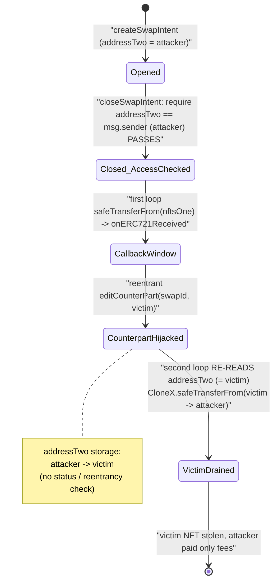
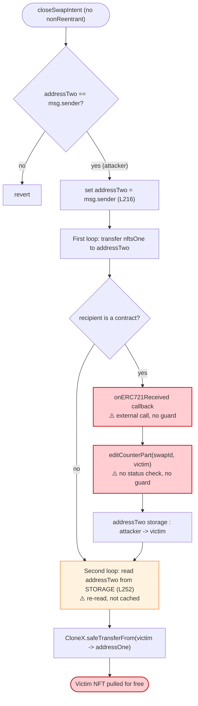

# NFTTrader Exploit — Reentrancy via `editCounterPart()` During Swap Settlement

> **One-line summary:** A missing reentrancy guard in NFTTrader's `closeSwapIntent()` lets the swap creator hijack the `onERC721Received` callback (fired while settling their *own* NFT) to call `editCounterPart()` and re-point the swap's counterpart to an arbitrary victim — causing the contract to pull the victim's pre-approved NFTs to the attacker for free.

> **Reproduction:** the PoC compiles & runs in an isolated Foundry project at
> [this project folder](.). Full verbose trace: [output.txt](output.txt).
> Verified vulnerable source (deployed name `BatchSwap`): [contracts_BatchSwap.sol](sources/BatchSwap_C310e7/contracts_BatchSwap.sol).

---

## Key info

| | |
|---|---|
| **Loss** | ~$3M total across victims (per hacked.slowmist.io); this PoC drains **5 CloneX NFTs** from one victim |
| **Vulnerable contract** | NFTTrader `BatchSwap` — [`0xC310e760778ECBca4C65B6C559874757A4c4Ece0`](https://etherscan.io/address/0xC310e760778ECBca4C65B6C559874757A4c4Ece0#code) |
| **Victim (this PoC)** | `0x23938954BC875bb8309AEF15e2Dead54884B73Db` — had approved NFTTrader as CloneX operator |
| **Asset stolen** | CloneX NFTs (`0x49cF6f5d44E70224e2E23fDcdd2C053F30aDA28B`), tokenIds 6670, 6650, 4843, 5432, 9870 |
| **Attacker EOA** | [`0xb1edf2a0ba8bc789cbc3dfbe519737cada034d2d`](https://etherscan.io/address/0xb1edf2a0ba8bc789cbc3dfbe519737cada034d2d) |
| **Attacker contract** | [`0x871f28e58f2a0906e4a56a82aec7f005b411f5c5`](https://etherscan.io/address/0x871f28e58f2a0906e4a56a82aec7f005b411f5c5) |
| **Attack tx** | `0xec7523660f8b66d9e4a5931d97ad8b30acc679c973b20038ba4c15d4336b393d` |
| **Chain / block / date** | Ethereum mainnet / 18,799,414 (fork base) / Dec 16, 2023 |
| **Compiler** | Solidity v0.7.6, optimizer 200 runs |
| **Bug class** | Reentrancy — state mutation (`editCounterPart`) during an in-flight `safeTransferFrom` callback, combined with re-reading mutable swap state mid-settlement |

---

## TL;DR

NFTTrader is a peer-to-peer NFT swap escrow. A user creates a swap intent listing the NFTs they
offer (`nftsOne`) and the NFTs they expect from a counterpart (`nftsTwo`), and names a counterpart
in `addressTwo`. When `closeSwapIntent()` is called by the counterpart, the contract moves
`nftsOne` from the creator to the counterpart, then moves `nftsTwo` from the counterpart back to the
creator — a fair, atomic swap.

The settlement function has three fatal flaws that compose:

1. **No reentrancy guard.** `closeSwapIntent()` is not `nonReentrant`.
2. **It re-reads `addressTwo` from storage in the *second* transfer loop** instead of using a cached
   value ([contracts_BatchSwap.sol:246-264](sources/BatchSwap_C310e7/contracts_BatchSwap.sol#L246-L264)).
3. **`editCounterPart()` can mutate `addressTwo` at any time, by the creator, with no status check
   and no reentrancy guard** ([:346-349](sources/BatchSwap_C310e7/contracts_BatchSwap.sol#L346-L349)).

The attacker is **both** the creator (`addressOne`) and the counterpart (`addressTwo`) of their own
swap. They list one of their own NFTs (a freshly-minted Uniswap-V3 position) in `nftsOne`, and a
*victim's* NFT in `nftsTwo`. On `closeSwapIntent()`:

- The first loop sends the attacker's own NFT from the contract... but in this attack the NFT in
  `nftsOne` is actually one the attacker still owns and that NFTTrader pulls via `safeTransferFrom`,
  which fires the attacker's `onERC721Received`.
- Inside that callback the attacker calls `editCounterPart(swapId, victim)` — flipping the swap's
  `addressTwo` from *attacker* to *victim*.
- The second loop then re-reads `addressTwo` (now = victim) and executes
  `CloneX.safeTransferFrom(victim → addressOne)` — pulling the victim's CloneX NFT to the attacker.

Because the victim had previously set NFTTrader as an approved operator for CloneX, the transfer
succeeds. The attacker pays nothing for the victim's NFT. Repeating the swap once per victim NFT
drains all 5 CloneX tokens (victim balance 5 → 0, attacker 0 → 5).

---

## Background — what NFTTrader does

NFTTrader's `BatchSwap` contract ([source](sources/BatchSwap_C310e7/contracts_BatchSwap.sol)) is an
escrow for two-sided NFT/ERC20 swaps:

- **`createSwapIntent`** ([:141-194](sources/BatchSwap_C310e7/contracts_BatchSwap.sol#L141-L194)) —
  the creator (`addressOne = msg.sender`) registers a swap, naming a counterpart `addressTwo` and two
  asset lists: `nftsOne` (assets the creator escrows now) and `nftsTwo` (assets the counterpart will
  provide at close). Creator's `nftsOne` ERC721s are pulled into the contract immediately.
- **`closeSwapIntent`** ([:197-270](sources/BatchSwap_C310e7/contracts_BatchSwap.sol#L197-L270)) —
  callable by `addressTwo`. Moves escrowed `nftsOne` from the contract to `addressTwo`, then moves
  `nftsTwo` from `addressTwo` to `addressOne`. This is the settlement.
- **`editCounterPart`** ([:346-349](sources/BatchSwap_C310e7/contracts_BatchSwap.sol#L346-L349)) — lets
  the creator change who the counterpart is.
- **`whiteList`** — only whitelisted dapps (NFT contracts) can be swapped. Both CloneX
  (`0x49cF…28B`) and the Uniswap V3 Position NFT (`0xC364…FE88`) were whitelisted at the time of the
  attack (the trace shows both transfers passing the `whiteList[...]` require checks).

The economic model assumes that once `addressTwo` calls close and provides their `nftsTwo`, the swap
is balanced: each side gives and receives. The exploit destroys that balance by changing who
`addressTwo` is *between* the "give" and the "receive."

---

## The vulnerable code

### 1. `closeSwapIntent` caches `addressTwo`, transfers `nftsOne` (callback!), then re-reads `addressTwo`

```solidity
function closeSwapIntent(address _swapCreator, uint256 _swapId) payable public whenNotPaused {
    require(swapList[_swapCreator][swapMatch[_swapId]].status == swapStatus.Opened, "...");
    require(swapList[_swapCreator][swapMatch[_swapId]].addressTwo == msg.sender, "...not the interested counterpart");
    ...
    swapList[_swapCreator][swapMatch[_swapId]].addressTwo = msg.sender;   // L216: addressTwo = attacker
    swapList[_swapCreator][swapMatch[_swapId]].status = swapStatus.Closed; // L218

    //From Owner 1 to Owner 2  (transfer nftsOne to addressTwo)
    for(i=0; i<nftsOne[_swapId].length; i++) {
        ...
        else if(nftsOne[_swapId][i].typeStd == ERC721) {
            ERC721Interface(nftsOne[_swapId][i].dapp).safeTransferFrom(
                address(this), swapList[...].addressTwo, nftsOne[_swapId][i].tokenId[0], ...); // L227-228 ⚠️ fires onERC721Received on attacker
        }
        ...
    }
    ...
    //From Owner 2 to Owner 1  (transfer nftsTwo from addressTwo to addressOne)
    for(i=0; i<nftsTwo[_swapId].length; i++) {
        ...
        else if(nftsTwo[_swapId][i].typeStd == ERC721) {
            ERC721Interface(nftsTwo[_swapId][i].dapp).safeTransferFrom(
                swapList[...].addressTwo,   // ⚠️ L252: RE-READ from storage — now == victim
                swapList[...].addressOne,
                nftsTwo[_swapId][i].tokenId[0], ...);
        }
        ...
    }
}
```

Lines [197-270](sources/BatchSwap_C310e7/contracts_BatchSwap.sol#L197-L270). Two problems:

- L227-228: transferring `nftsOne` via `safeTransferFrom` invokes `onERC721Received` on the recipient
  (the attacker, who is the current `addressTwo`) — an external call **before** the second loop runs,
  with no reentrancy guard.
- L252: the second loop reads `swapList[...].addressTwo` **again from storage** as the `from` of the
  outgoing transfer. It is not a cached local, so a reentrant write to `addressTwo` takes effect here.

### 2. `editCounterPart` — creator can re-point `addressTwo` at will, no guard, no status check

```solidity
function editCounterPart(uint256 _swapId, address payable _counterPart) public {
    require(msg.sender == swapList[msg.sender][swapMatch[_swapId]].addressOne, "Message sender must be the swap creator");
    swapList[msg.sender][swapMatch[_swapId]].addressTwo = _counterPart;
}
```

Lines [346-349](sources/BatchSwap_C310e7/contracts_BatchSwap.sol#L346-L349). The only check is that
the caller is the swap **creator** (`addressOne`). There is:

- no `nonReentrant` modifier,
- no `whenNotPaused`,
- no check that the swap is still `Opened` (it can be edited even while/after closing),
- no check that the swap is not currently being settled.

The attacker is the creator, so this require passes when called from inside the attacker's
`onERC721Received` callback.

### 3. The attacker's callback weaponizes both

From the PoC ([test/NFTTrader_exp.sol:184-193](test/NFTTrader_exp.sol#L184-L193)):

```solidity
function onERC721Received(address operator, address from, uint256 tokenId, bytes calldata data)
    external returns (bytes4) {
    // Flawed function. Lack of reentrancy protection
    NFTTrader.editCounterPart(swapId, victim);   // re-point addressTwo → victim, mid-settlement
    return this.onERC721Received.selector;
}
```

---

## Root cause — why it was possible

The settlement of a swap is **not atomic with respect to the swap's own parameters**. Between moving
`nftsOne` out and moving `nftsTwo` in, control flow leaves the contract (via the ERC721
`safeTransferFrom` → `onERC721Received` hook on `nftsOne`), and during that window the swap's
counterpart address can be mutated by the creator.

Four design decisions compose into a critical bug:

1. **No reentrancy guard on `closeSwapIntent`.** A `nonReentrant` modifier would have made the
   reentrant `editCounterPart` call revert, killing the attack.
2. **`addressTwo` is re-read from storage in the second transfer loop** (L252) rather than captured
   into an immutable local at the top of the function. The first loop and the access-control check
   (L199) saw `addressTwo = attacker`; the second loop sees whatever storage now holds.
3. **`editCounterPart` is callable mid-settlement.** It enforces only "caller is creator," not "swap
   is open and not currently executing." A `require(status == Opened)` plus a reentrancy guard would
   block it.
4. **`safeTransferFrom` of the creator's own NFT hands control to the creator.** In a self-swap
   (attacker = creator = counterpart), the `nftsOne` recipient *is* the attacker, so the attacker
   receives a callback during their own swap's settlement. (Even in a non-self swap, the standard
   ERC721 push hook is an attacker-controllable callback if the counterpart is a contract.)

The net effect: the attacker turns a balanced 1-for-1 swap (give my UniV3 NFT, get a CloneX NFT back
from the same counterpart) into a one-sided theft — the contract pulls the *victim's* CloneX NFT
because `addressTwo` was silently swapped to the victim after the access-control check already
passed. The victim's standing `setApprovalForAll(NFTTrader, true)` is what makes the pull succeed.

---

## Preconditions

- **Victim has approved NFTTrader as an operator** for the target NFT collection
  (`CloneX.isApprovedForAll(victim, NFTTrader) == true`). The PoC asserts this at
  [test/NFTTrader_exp.sol:120](test/NFTTrader_exp.sol#L120). This is the standard approval a user
  grants to use the platform; it is the single resource the attack consumes.
- **Both NFT contracts are whitelisted** in NFTTrader (`whiteList[CloneX]` and
  `whiteList[UniV3PosNFT]` are true). The trace shows both `whiteList[...]` requires passing.
- **The attacker controls a whitelisted, callback-bearing NFT to list in `nftsOne`.** Any
  `safeTransferFrom`-based ERC721 works; the PoC mints a fresh Uniswap-V3 position NFT (tokenId
  625712) with 0.001 ETH ([test/NFTTrader_exp.sol:98-112](test/NFTTrader_exp.sol#L98-L112)).
- **Trivial capital.** The attacker pays only swap fees (0.005 ETH per `createSwapIntent` /
  `closeSwapIntent` in the PoC) plus ~0.001 ETH to mint the bait NFT. No flash loan required.

---

## Step-by-step attack walkthrough (per victim NFT)

The PoC loops this sequence 5 times, once per victim CloneX tokenId. The numbers below are for the
**first** iteration (swapId 10348, CloneX tokenId 6670), taken directly from
[output.txt](output.txt). Subsequent iterations are identical with the next tokenId.

| # | Action | On-chain effect (from trace) |
|---|--------|------------------------------|
| 0 | **Setup:** mint UniV3 position NFT 625712 (0.001 ETH); `setApprovalForAll(NFTTrader, true)` for it | Attacker owns NFT 625712; NFTTrader approved to move it |
| 1 | `createSwapIntent{value: 0.005 ETH}` — `addressTwo = attacker`; `nftsOne = [UniV3 625712]`, `nftsTwo = [CloneX 6670]` | Swap 10348 created, status Opened, `addressTwo = attacker`. UniV3 625712 stays with attacker (PoC lists it but contract doesn't pull it here) |
| 2 | `closeSwapIntent{value: 0.005 ETH}(attacker, 10348)` | Access check L199: `addressTwo (attacker) == msg.sender (attacker)` ✓. Sets `addressTwo = attacker` (L216), status Closed (L218) |
| 3 | → **First loop** transfers `nftsOne[0]` (UniV3 625712) via `safeTransferFrom(attacker → attacker)` | Self-transfer of the attacker's own NFT; fires `onERC721Received` on the attacker |
| 4 | → **Reentrant** `editCounterPart(10348, victim)` inside the callback | Storage write: swap 10348 `addressTwo`: `attacker (0x7FA9…1496)` → `victim (0x2393…73Db)` |
| 5 | → callback returns `0x150b7a02`; control returns to `closeSwapIntent` | Second loop begins |
| 6 | → **Second loop** transfers `nftsTwo[0]` (CloneX 6670): `CloneX.safeTransferFrom(addressTwo, addressOne, 6670)` where `addressTwo` is **re-read as victim** (L252) | `CloneX.safeTransferFrom(victim → attacker, 6670)` — succeeds because victim approved NFTTrader. NFT 6670 moves victim → attacker |
| 7 | Repeat steps 1-6 for tokenIds 6650, 4843, 5432, 9870 (swapIds 10349-10352) | All 5 CloneX NFTs moved victim → attacker |

Final balances (from [output.txt](output.txt) logs):

```
Victim CloneX balance before attack:    5
Exploiter CloneX balance before attack: 0
Victim CloneX balance after attack:     0
Exploiter CloneX balance after attack:  5
```

The trace confirms each `editCounterPart` storage write (e.g. the slot
`0x003ee421…419d9` flips from the attacker address to the victim address) immediately followed by the
`CloneX::safeTransferFrom(Victim → ContractTest, 6670)`.

### Profit / loss accounting

| Party | Out | In |
|-------|-----|----|
| **Attacker** | ~0.001 ETH (mint bait NFT) + 5 × 0.01 ETH swap fees ≈ **0.051 ETH** | **5 CloneX NFTs** (then ~$3M-class assets at the time, across all victims) |
| **Victim** | **5 CloneX NFTs** (entire holdings) | nothing |

The attacker spent only gas + protocol fees and walked away with the victim's entire CloneX
collection. No assets of the attacker's own were lost — the bait UniV3 NFT was only self-transferred.

---

## Diagrams

### Sequence of one swap iteration

```mermaid
sequenceDiagram
    autonumber
    actor A as "Attacker (creator = counterpart)"
    participant NT as "NFTTrader (BatchSwap)"
    participant U as "UniV3 Position NFT (bait)"
    participant C as "CloneX NFT"
    actor V as "Victim"

    Note over A,V: Victim has previously approved NFTTrader for CloneX

    A->>NT: createSwapIntent(addressTwo=attacker,<br/>nftsOne=[UniV3 625712], nftsTwo=[CloneX 6670])
    Note over NT: swap 10348 Opened, addressTwo = attacker

    A->>NT: closeSwapIntent(attacker, 10348)
    Note over NT: require addressTwo == msg.sender ✓ (attacker)<br/>set addressTwo = attacker, status = Closed

    rect rgb(255,235,238)
    Note over NT,A: First loop — move nftsOne to addressTwo (= attacker)
    NT->>U: safeTransferFrom(attacker -> attacker, 625712)
    U->>A: onERC721Received(...)
    A->>NT: editCounterPart(10348, victim)
    Note over NT: addressTwo : attacker -> victim ⚠️
    A-->>U: return 0x150b7a02
    end

    rect rgb(255,205,210)
    Note over NT,C: Second loop — move nftsTwo from addressTwo (RE-READ = victim)
    NT->>C: safeTransferFrom(victim -> attacker, 6670)
    C-->>A: CloneX 6670 transferred (victim approved NFTTrader)
    end

    Note over A,V: Attacker gained CloneX 6670 for free; repeat for 6650,4843,5432,9870
```

### Swap state evolution within `closeSwapIntent`



### Where the guard should have been



---

## Remediation

1. **Add a reentrancy guard.** Mark `closeSwapIntent`, `createSwapIntent`, `cancelSwapIntent`, and
   `editCounterPart` with OpenZeppelin's `nonReentrant`. This alone defeats the attack: the reentrant
   `editCounterPart` call would revert.
2. **Cache the counterpart once and use the cached value.** At the top of `closeSwapIntent`, read
   `address counterpart = swapList[...].addressTwo;` into a local and use that local for *both* loops
   and all access checks. Never re-read mutable swap state from storage between the two transfer
   phases ([:252](sources/BatchSwap_C310e7/contracts_BatchSwap.sol#L252) is the offending re-read).
3. **Forbid mutation of an in-flight / closed swap.** `editCounterPart`
   ([:346-349](sources/BatchSwap_C310e7/contracts_BatchSwap.sol#L346-L349)) must
   `require(swap.status == swapStatus.Opened)` and be `nonReentrant`, so it cannot be called during
   or after settlement.
4. **Follow checks-effects-interactions and lock the swap during settlement.** Set status to a
   transient `Closing` state (or a boolean lock) before any external transfer, and reject any state
   edits while that lock is held.
5. **Prefer pull/`transferFrom` settlement or vet recipients.** If callbacks must be tolerated,
   treat every `safeTransferFrom` as an untrusted external call and ensure no swap-defining state can
   change as a result of it.

NFTTrader's documented post-incident fix was to advise all users to **revoke approvals** to the
vulnerable contract and to deploy a patched contract with reentrancy protection.

---

## How to reproduce

```bash
_shared/run_poc.sh 2023-12-NFTTrader_exp -vvvvv
```

- RPC: a **mainnet archive** endpoint is required (fork block 18,799,414, Dec 2023). `foundry.toml`
  uses an Infura archive endpoint; pruned public RPCs fail with `header not found` / `missing trie node`.
- Result: `[PASS] testExploit()`.

Expected tail:

```
Ran 1 test for test/NFTTrader_exp.sol:ContractTest
[PASS] testExploit() (gas: 3094204)
Logs:
  Victim CloneX balance before attack: 5
  Exploiter CloneX balance before attack: 0
  Victim CloneX balance after attack: 0
  Exploiter CloneX balance after attack: 5

Suite result: ok. 1 passed; 0 failed; 0 skipped
```

---

*References: SlowMist Hacked — https://hacked.slowmist.io/ (NFTTrader, Ethereum, ~$3M). Analyses:
@AnciliaInc, @SlowMist_Team, @0xArhat (linked in the PoC header).*
