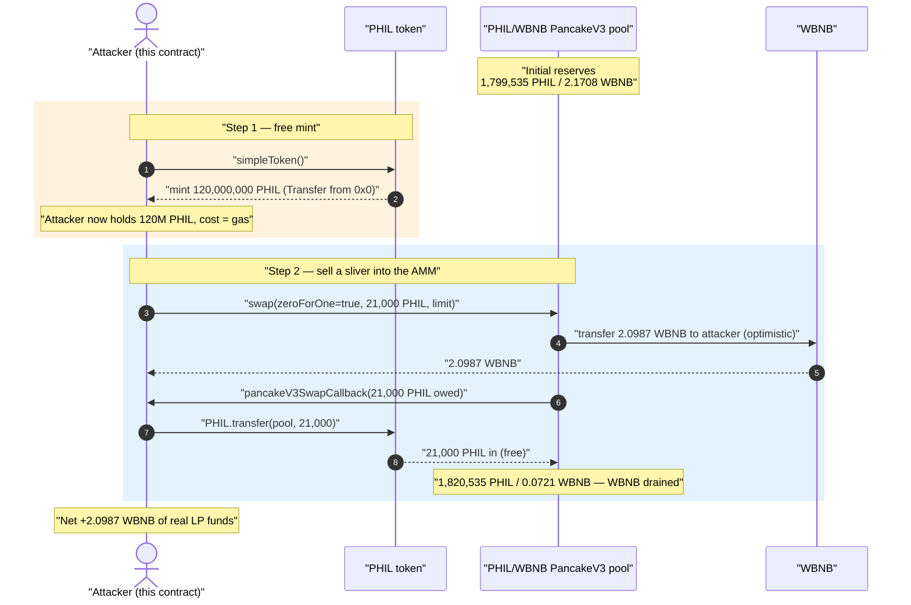
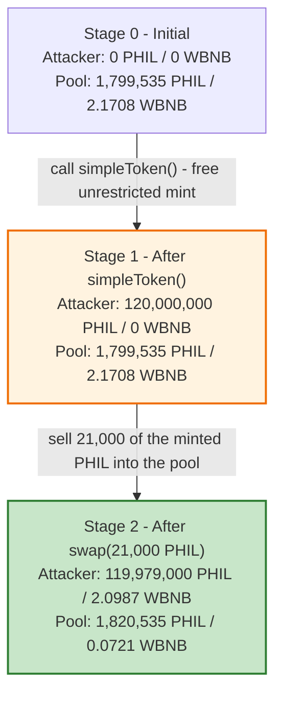
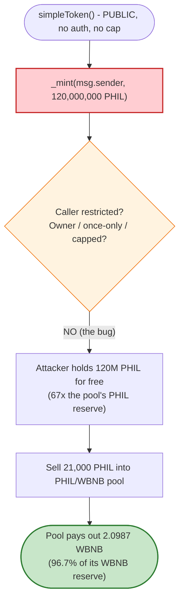

# PHIL (PhilC) Exploit — Public, Unrestricted `simpleToken()` Mint Drains the AMM Pool

> **Reproduction:** the PoC compiles & runs in an isolated Foundry project at
> [this project folder](.) (the umbrella DeFiHackLabs repo contains many unrelated
> PoCs that do not whole-compile, so this one was extracted).
> Full verbose trace: [output.txt](output.txt).
> The vulnerable `PHIL` token is **unverified** on BscScan; the AMM victim pool source
> is in [sources/PancakeV3Pool_b8b408](sources/PancakeV3Pool_b8b408).

---

## Key info

| | |
|---|---|
| **Loss** | ~**2.0987 WBNB** (~$510 at the Dec-2023 BNB price) drained from the PHIL/WBNB PancakeV3 pool |
| **Vulnerable contract** | `PHIL` (`PhilC`) — [`0x4308D314096878D3bf16C9d8DB86101F70BBebF1`](https://bscscan.com/address/0x4308D314096878D3bf16C9d8DB86101F70BBebF1) *(unverified)* |
| **Victim pool** | PHIL/WBNB PancakeV3 0.05% pool — [`0xb8b408A6BD3E43FCDE7D7AbC381ef10bcCcd5349`](https://bscscan.com/address/0xb8b408A6BD3E43FCDE7D7AbC381ef10bcCcd5349) |
| **Attacker EOA** | [`0x835b45d38cbdccf99e609436ff38e31ac05bc502`](https://bscscan.com/address/0x835b45d38cbdccf99e609436ff38e31ac05bc502) |
| **Attack tx** | [`0x20ecd8310a2cc7f7774aa5a045c8a99ad84a8451d6650f24e0911e9f4355b13a`](https://bscscan.com/tx/0x20ecd8310a2cc7f7774aa5a045c8a99ad84a8451d6650f24e0911e9f4355b13a) |
| **Chain / block / date** | BSC / 34,345,320 / Thu Dec 14, 2023 11:04 UTC |
| **Compiler** | PoC: Solidity ^0.8.10 (run with solc 0.8.34). Victim `PHIL`: legacy ABI dispatcher (`solc 0.5.x`-era bytecode, unverified) |
| **Bug class** | Missing access control on a public minting function (free, unlimited token issuance) |

---

## TL;DR

`PHIL` exposes a **public, parameter-less function `simpleToken()`** that mints the entire
initial token supply — **120,000,000 PHIL** — directly to `msg.sender`, with **no access control,
no one-time guard, and no supply cap check**. Anyone can call it and walk away with 120M freshly-minted
tokens for the price of gas.

Those tokens are real ERC-20 PHIL that the PHIL/WBNB PancakeV3 pool will price and pay out against.
The attacker:

1. Calls `PHIL.simpleToken()` → receives **120,000,000 PHIL** out of thin air (`Transfer` from `address(0)`).
2. Sells a tiny slice — just **21,000 PHIL** — into the PHIL/WBNB PancakeV3 pool.
3. The pool, which held only **2.1708 WBNB**, pays out **2.0987 WBNB** for that swap — draining ~96.7% of
   its entire WBNB liquidity.

Net result: the attacker pays gas + 21,000 worthless self-minted PHIL and pockets **2.0987 WBNB** of the
pool's real liquidity (LP funds). The remaining ~119.98M minted PHIL it still holds is icing — it could
have repeated the dump until the pool was empty, but a single 21,000-PHIL sell already took almost everything.

---

## Background — what PHIL does

`PHIL` (token name `PhilC`, symbol `PHIL`, 18 decimals) is a small ERC-20 token deployed on BSC with a
PancakeSwap V3 liquidity pool against WBNB. Reading the live contract at the fork block with `cast`:

| Parameter | Value |
|---|---|
| `name()` | `"PhilC"` |
| `symbol()` | `"PHIL"` |
| `decimals()` | `18` |
| `totalSupply()` (pre-attack) | **120,000,000 PHIL** (`1.2e26`) |
| Attacker EOA PHIL balance (pre-attack) | 0 |
| PHIL held by the pool (PHIL reserve) | **1,799,535 PHIL** (`1.799e24`) |
| WBNB held by the pool (WBNB reserve) | **2.1708 WBNB** ← the prize |

The pool is a PancakeSwap V3 pool with `token0 = PHIL`, `token1 = WBNB`, fee tier `500` (0.05%):

```text
$ cast call <pool> "token0()(address)"  # 0x4308...BebF1  (PHIL)
$ cast call <pool> "token1()(address)"  # 0xbb4C...095c  (WBNB)
$ cast call <pool> "fee()(uint24)"      # 500
```

The whole exploit hinges on one fact: the token contract lets *anyone* mint a quantity of PHIL
(120M) that **dwarfs the pool's PHIL reserve** (1.8M), so even dumping a small fraction of the minted
amount completely overwhelms the pool's price and drains the WBNB side.

---

## The vulnerable code

The `PHIL` token is **unverified** on BscScan, so there is no Solidity source to link. However, the
on-chain runtime bytecode and the exploit trace make the bug unambiguous.

### 1. The `simpleToken()` selector exists and mints to the caller

The function selector `simpleToken()` = `0x2a64e635` is present in the contract's public dispatcher
(confirmed via `cast code` — the legacy `63ffffffff16`-masked jump table at the contract head). When
called, it performs an ERC-20 mint to `msg.sender`. The runtime trace proves the mint
([output.txt](output.txt)):

```text
├─ [26697] PHIL::simpleToken()
│   ├─ emit Transfer(from: 0x0000…0000, to: ContractTest, value: 120000000000000000000000000 [1.2e26])
│   ├─  storage changes:
│   │   @ 0xb38645…bc96: 0 → 0x…6342fd08f00f6378000000   // attacker balance slot: 0 → 120,000,000e18
│   └─ ← [Stop]
```

Key facts visible in the trace:

- The `Transfer` event has `from = address(0)` — this is a **mint**, not a transfer of pre-existing tokens.
- The amount is **exactly the initial `totalSupply` of 120,000,000 PHIL** (`1.2e26`).
- The function takes **no arguments**, has **no `require`/`onlyOwner` guard** that reverts, and is callable by
  the test contract (a fresh, unprivileged EOA-equivalent).

There is no `msg.sender == owner` check, no "already minted" flag, and no max-supply guard that would block
a second caller — the function is simply a permissionless faucet for the full supply.

### 2. The victim AMM prices and pays out against those tokens

The PHIL/WBNB pool is a standard PancakeSwap V3 pool ([swap()](sources/PancakeV3Pool_b8b408/contracts_PancakeV3Pool.sol#L617-L623)).
It does exactly what it is designed to do: given PHIL paid in via the swap callback, it sends out WBNB
according to its constant-liquidity curve. The pool has no way to know the PHIL it receives was minted for
free, so it pays out genuine WBNB liquidity:

```solidity
function swap(
    address recipient,
    bool zeroForOne,
    int256 amountSpecified,
    uint160 sqrtPriceLimitX96,
    bytes calldata data
) external override returns (int256 amount0, int256 amount1) {
    require(amountSpecified != 0, 'AS');
    ...
}
```

The attacker's PoC pushes the swap to the price limit (`sqrtPriceLimitX96 = 4_295_128_740`, just above
`TickMath.MIN_SQRT_RATIO`) so the pool sells PHIL → WBNB until either the 21,000 PHIL is consumed or the
WBNB side is nearly exhausted.

---

## Root cause — why it was possible

The single root cause is **a public minting function with no access control and no supply guard**:

> `simpleToken()` is callable by anyone and mints the token's entire 120M initial supply to the caller.
> It was almost certainly intended as a one-time deployment/initialization helper (or a leftover test/demo
> function), but it was shipped public and un-gated.

Because the minted amount (120M) is ~67× the pool's PHIL reserve (1.8M), the attacker doesn't even need
fancy positioning, flash loans, or invariant tricks. They mint free tokens, then sell a sliver of them into
the AMM. The AMM honestly converts those free tokens into real WBNB at whatever price its curve dictates,
and since the attacker can supply effectively unlimited PHIL, they extract the pool's entire opposite-side
(WBNB) reserve.

The two conditions that compose into the loss:

1. **Unrestricted mint.** No `onlyOwner`, no initialized-once latch, no cap check on `simpleToken()`.
2. **A live AMM holding real WBNB liquidity priced against PHIL.** The mint would be harmless if PHIL had no
   market; the existence of the PancakeV3 PHIL/WBNB pool turns "free tokens" into "free WBNB."

This is the simplest and most classic token bug: **mint authority left open to the public.**

---

## Preconditions

- `simpleToken()` is public and reverts on neither the caller's identity nor on repeat calls (it does not — confirmed by the passing trace from an unprivileged caller).
- A liquidity pool exists that prices PHIL against a valuable asset (WBNB) and holds real reserves of that asset (2.1708 WBNB).
- The pool's PHIL reserve (1.8M) is small relative to the mintable amount (120M), so a small sell overwhelms it.
- No working capital is required — the attacker mints the inventory it sells. The only cost is gas.

---

## Attack walkthrough (with on-chain numbers from the trace)

`token0 = PHIL`, `token1 = WBNB`. All figures are taken directly from
[output.txt](output.txt).

| # | Step | Attacker PHIL | Attacker WBNB | Pool PHIL reserve | Pool WBNB reserve | Effect |
|---|------|--------------:|--------------:|------------------:|------------------:|--------|
| 0 | **Initial** | 0 | 0 | 1,799,535 | 2.1708 | Honest pool; attacker has nothing. |
| 1 | **`PHIL.simpleToken()`** — mint from `address(0)` | 120,000,000 | 0 | 1,799,535 | 2.1708 | Attacker holds 120M free PHIL. |
| 2 | **`pool.swap(zeroForOne=true, 21,000 PHIL)`** — pool sends WBNB out first, then the callback pays PHIL | 119,979,000 | **2.0987** | 1,820,535 | **0.0721** | Pool pays 2.0987 WBNB for 21,000 PHIL; WBNB side drained ~96.7%. |

The relevant raw trace fragment for step 2:

```text
├─ [155847] <pool>::swap(ContractTest, true, 21000e18 [2.1e22], 4295128740, 0x61)
│   ├─ WBNB::transfer(ContractTest, 2098651734690958892 [2.098e18])   // pool → attacker, 2.0987 WBNB out
│   ├─ ContractTest::pancakeV3SwapCallback(21000e18, -2098651734690958892, 0x61)
│   │   ├─ PHIL::transfer(<pool>, 21000e18)                            // attacker → pool, 21,000 PHIL in
│   ├─ emit Swap(amount0: 21000e18, amount1: -2098651734690958892, …)
│   └─ ← [Return] 21000e18, -2098651734690958892
├─ WBNB::balanceOf(ContractTest) → 2098651734690958892 [2.098e18]
```

Note the V3 callback ordering: the pool **optimistically sends the 2.0987 WBNB to the attacker first**,
then invokes `pancakeV3SwapCallback`, where the attacker pays the owed 21,000 PHIL from its freshly-minted
stockpile. The 21,000 PHIL it pays cost nothing to produce.

### Profit / loss accounting

| Direction | Asset | Amount |
|---|---|---:|
| Minted for free | PHIL | 120,000,000 |
| Paid into the pool | PHIL | 21,000 (free) |
| **Received from the pool** | **WBNB** | **2.098651734690958892** |
| Gas | BNB | negligible |
| **Net profit** | **WBNB** | **≈ 2.0987** (~$510 @ Dec-2023 BNB) |
| **Pool WBNB remaining** | WBNB | 0.0721 (was 2.1708) |

The attacker still holds ~119.98M minted PHIL afterward, which could be dumped to extract the residual
0.0721 WBNB too — but a single 21,000-PHIL sell already captured the overwhelming majority of the pool.
The reported headline loss (`~2 $BNB`) matches the WBNB received to the wei.

---

## Diagrams

### Sequence of the attack



### Pool / state evolution



### Why the mint is fatal



---

## Remediation

1. **Gate or remove `simpleToken()`.** Mint authority must never be public. If `simpleToken()` was a
   one-time supply-bootstrap helper, restrict it to the deployer/owner (`onlyOwner`) **and** make it
   single-use (revert if `totalSupply() != 0` or guard with an `initialized` latch). If it is leftover
   test/demo code, delete it before deployment.
2. **Enforce a hard max supply.** Any mint path should check `totalSupply() + amount <= MAX_SUPPLY` so a
   stray mint cannot inflate the supply arbitrarily, even if access control is somehow bypassed.
3. **Treat every state-changing external function as attacker-callable.** Audit the full public/external
   surface of the token for missing `onlyOwner`/role checks — `simpleToken()` is the obvious one here, but
   the same review must cover any other admin/init helpers.
4. **For LP/protocol owners:** never provide deep liquidity against a token whose mint authority is not
   provably renounced or strictly controlled. A free public mint turns any paired pool into a free withdrawal
   for the attacker.

---

## How to reproduce

The PoC was extracted into a standalone Foundry project (the umbrella DeFiHackLabs repo has many
unrelated PoCs that fail to compile under a whole-project `forge build`):

```bash
_shared/run_poc.sh 2023-12-PHIL_exp -vvvvv
```

- RPC: a **BSC archive** endpoint is required (fork block 34,345,319). `foundry.toml` uses
  `https://bsc-mainnet.public.blastapi.io`, which serves historical state at that block; many public BSC
  RPCs prune it and fail with `header not found` / `missing trie node`.
- Result: `[PASS] testExploit()` — the attacker goes from **0 WBNB** to **2.098651734690958892 WBNB**.

Expected tail:

```text
  Attacker WBNB balance before attack: 0.000000000000000000
  Attacker WBNB balance after attack: 2.098651734690958892

Suite result: ok. 1 passed; 0 failed; 0 skipped
Ran 1 test suite: 1 tests passed, 0 failed, 0 skipped (1 total tests)
```

---

*Reference: DeFiHackLabs — PHIL (PhilC), BSC, ~2 BNB. Attack tx
`0x20ecd8310a2cc7f7774aa5a045c8a99ad84a8451d6650f24e0911e9f4355b13a`.*
