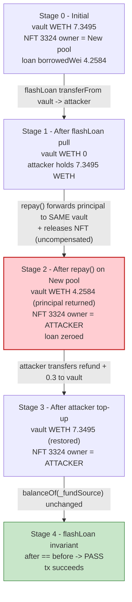
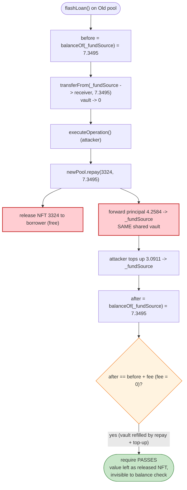

# Pine Protocol Exploit — Shared-Vault `flashLoan` Invariant Bypassed by Cross-Pool `repay()`

> **Reproduction:** the PoC compiles & runs in an isolated Foundry project at
> [this project folder](.) (the umbrella DeFiHackLabs repo
> contains many unrelated PoCs that do not compile together, so this one was extracted).
> Full verbose trace: [output.txt](output.txt).
> Verified vulnerable source: [ERC721LendingPool02.sol](sources/ERC721LendingPool02_4cB4E3/ERC721LendingPool02.sol).

---

## Key info

| | |
|---|---|
| **Loss** | ~$90K total (per [hacked.slowmist.io](https://hacked.slowmist.io/)); the PoC reproduces the drain of **NFT id 3324** alone — collateral worth ~4.26 WETH released for ~0 net cost |
| **Vulnerable contract** | `ERC721LendingPool02` (`repay` + `flashLoan`) — new pool [`0xC3f4659588b13f23E09Ec54783A3c407e39ad589`](https://etherscan.io/address/0xC3f4659588b13f23E09Ec54783A3c407e39ad589), old pool [`0x2405913d54fC46eEAF3Fb092BfB099F46803872f`](https://etherscan.io/address/0x2405913d54fC46eEAF3Fb092BfB099F46803872f) |
| **Shared lender vault (`_fundSource`)** | Pine Gnosis Safe — [`0xc490E4646A91C3CBaFa8c55540c94Dcd0212037e`](https://etherscan.io/address/0xc490E4646A91C3CBaFa8c55540c94Dcd0212037e) |
| **Collateral NFT** | Pudgy Penguins (PPG) — [`0xBd3531dA5CF5857e7CfAA92426877b022e612cf8`](https://etherscan.io/address/0xBd3531dA5CF5857e7CfAA92426877b022e612cf8), tokenId **3324** |
| **Attacker EOA** | [`0x05324c970713450bA0Bc12EfD840034FCB0A4BAa`](https://etherscan.io/address/0x05324c970713450ba0bc12efd840034fcb0a4baa) |
| **Attacker contract** | [`0x1d5586dA44328f28BFbBf59b808a87584355b3eF`](https://etherscan.io/address/0x1d5586da44328f28bfbbf59b808a87584355b3ef) |
| **Attack tx** | [`0xec7523660f8b66d9e4a5931d97ad8b30acc679c973b20038ba4c15d4336b393d`](https://explorer.phalcon.xyz/tx/eth/0xec7523660f8b66d9e4a5931d97ad8b30acc679c973b20038ba4c15d4336b393d) |
| **Chain / block / date** | Ethereum mainnet / fork at 18,835,344 / Dec 23, 2023 |
| **Compiler** | Implementation Solidity v0.8.3, optimizer 200 runs (project builds under 0.8.34) |
| **Bug class** | Broken accounting invariant — a flash-loan repayment check that can be satisfied by a side-effect of an unrelated function on a sibling contract that shares the same fund source |

---

## TL;DR

Pine Protocol runs two NFT lending pools (an "old" `ERC721LendingPool02` and a "new" one) that
**share the same lender vault** (`_fundSource = 0xc490…037e`, a Gnosis Safe). Each pool draws lending
liquidity from, and returns repayments to, that single vault.

`flashLoan()` ([ERC721LendingPool02.sol:1607-1650](sources/ERC721LendingPool02_4cB4E3/ERC721LendingPool02.sol#L1607-L1650))
moves WETH **out of the shared vault** to the borrower, runs the borrower's callback, then enforces a
single solvency invariant:

```solidity
require(
    availableLiquidityAfter == availableLiquidityBefore + amountFee,  // amountFee == 0
    "The actual balance of the protocol is inconsistent"
);
```

where `availableLiquidity = IERC20(_reserve).balanceOf(_fundSource)`. The check only asks: *"is the
vault's WETH balance back to where it started?"* It does **not** track who is repaying, why, or what
was given out in exchange.

`repay()` on the **other** pool
([:1769-1900](sources/ERC721LendingPool02_4cB4E3/ERC721LendingPool02.sol#L1769-L1900))
pulls the repay amount from the caller, then forwards the loan principal **back into that same shared
vault** (`_fundSource`) — and, once the loan is settled, **returns the NFT collateral to the
borrower**.

The attacker stitches these together inside one flash-loan callback:

1. Flash-borrow the vault's **entire** WETH balance from the **old** pool (drains the vault to 0).
2. Inside the callback, use that WETH to `repay()` the attacker's own outstanding loan on the **new**
   pool. The new pool forwards the principal **back into the same vault** and releases NFT 3324 to the
   attacker for free.
3. The old pool's `flashLoan` then sees the vault balance restored (the new pool's repayment refilled
   it) — invariant passes, no revert.

Net effect: the attacker **reclaims the NFT collateral without actually repaying anything of its own**
— the "repayment" that satisfied the new pool was funded by a flash loan that was itself "repaid" by
the new pool's principal-return into the shared vault. The attacker only had to top up the ~0.3 WETH
interest/fee shortfall.

---

## Background — what Pine Protocol does

Pine is a peer-to-pool NFT lending protocol. A borrower deposits an ERC-721 (here, a Pudgy Penguin)
as collateral and borrows WETH against it up to a max LTV; the WETH comes from a shared lender vault
(`_fundSource`). To get the NFT back, the borrower calls `repay()` with principal + accrued interest;
the pool forwards principal to the vault, takes a protocol fee, and transfers the NFT back to the
borrower.

Relevant on-chain state at the fork block (read from the trace / `cast`):

| Item | Value |
|---|---|
| `_fundSource` (old pool) | `0xc490…037e` (Gnosis Safe) |
| `_fundSource` (new pool) | `0xc490…037e` — **same vault** |
| Vault WETH balance (start) | **7.349504076 WETH** |
| New pool loan for NFT 3324 — `borrowedWei` | 4.2584 WETH |
| New pool loan for NFT 3324 — `borrower` | attacker EOA `0x0532…4BAa` |
| New pool loan — `loanStartBlock` / `interestBPS1000000XBlock` / `maxLTVBPS` | 18,835,311 / 444 / 4000 |
| Owner of PPG 3324 (start) | new pool `0xC3f4…d589` (held as collateral) |

The "old" pool address `0x2405913d…` serves the verified implementation directly; the "new" pool
`0xC3f465…` is a `BeaconProxy` ([BeaconProxy.sol](sources/BeaconProxy_C3f465/BeaconProxy.sol)) whose
beacon points at implementation `0xD3de1104…` — the same `ERC721LendingPool02` logic family.

---

## The vulnerable code

### 1. `flashLoan` — solvency invariant keyed on the *shared vault's* balance only

[ERC721LendingPool02.sol:1607-1650](sources/ERC721LendingPool02_4cB4E3/ERC721LendingPool02.sol#L1607-L1650)

```solidity
function flashLoan(
    address payable _receiver,
    address _reserve,
    uint256 _amount,
    bytes memory _params
) external nonReentrant {
    //check that the reserve has enough available liquidity
    uint256 availableLiquidityBefore = _reserve == address(0)
        ? address(this).balance
        : IERC20(_reserve).balanceOf(_fundSource);          // ← vault balance
    require(availableLiquidityBefore >= _amount, "There is not enough liquidity available to borrow");

    uint256 amountFee = 0;                                   // ← flash loan is FREE

    IFlashLoanReceiver receiver = IFlashLoanReceiver(_receiver);

    if (_reserve == address(0)) { ... } else {
        IERC20(_reserve).transferFrom(_fundSource, _receiver, _amount);  // pull FROM vault
    }

    receiver.executeOperation(_reserve, _amount, amountFee, _params);    // attacker callback

    uint256 availableLiquidityAfter = _reserve == address(0)
        ? address(this).balance
        : IERC20(_reserve).balanceOf(_fundSource);          // ← vault balance again

    require(
        availableLiquidityAfter == availableLiquidityBefore + (amountFee),  // == before + 0
        "The actual balance of the protocol is inconsistent"
    );
}
```

The invariant is purely "the vault holds the same WETH balance after as before". It is agnostic to
*how* the balance was restored. Any operation during the callback that pushes WETH into the vault —
including a `repay()` on a sibling pool that shares this exact `_fundSource` — counts toward
satisfying it.

### 2. `repay` — forwards principal into the shared vault and releases the NFT

[ERC721LendingPool02.sol:1769-1900](sources/ERC721LendingPool02_4cB4E3/ERC721LendingPool02.sol#L1769-L1900)

```solidity
function repay(uint256 nftID, uint256 repayAmount, address pineWallet)
    external nonReentrant whenNotPaused returns (bool)
{
    PineLendingLibrary.LoanTerms memory termsWithRealRate = _loans[nftID];
    termsWithRealRate.interestBPS1000000XBlock =
        _feeStructure.getClientRateByLenderRatePerBlock(_loans[nftID].interestBPS1000000XBlock);
    require(PineLendingLibrary.nftHasLoan(_loans[nftID]), "NFT does not have active loan");

    // pull repayAmount from caller
    require(IERC20(_supportedCurrency).transferFrom(msg.sender, address(this), repayAmount), ...);

    if (repayAmount >= PineLendingLibrary.outstanding(termsWithRealRate)) {
        // refund overpayment to caller
        IERC20(_supportedCurrency).transfer(msg.sender, repayAmount - outstanding);
        ...
        _loans[nftID].returnedWei = _loans[nftID].borrowedWei;   // loan considered fully repaid
        // ⚠️ release the collateral NFT back to the borrower
        IERC721(_supportedCollection).transferFrom(address(this), _loans[nftID].borrower, nftID);
    } else { ... }

    // ⚠️ forward (nearly) all WETH the pool now holds back to the SHARED vault
    IERC20(_supportedCurrency).transferFrom(
        address(this),
        _fundSource,                                              // ← same vault flashLoan drained
        IERC20(_supportedCurrency).balanceOf(address(this)) - (repaidInterest * feeCut / 10_000)
    );
    // protocol fee to control plane
    IERC20(_supportedCurrency).transferFrom(address(this), _controlPlane, repaidInterest * feeCut / 10_000);
    ...
}
```

The crucial line is `transferFrom(address(this), _fundSource, …)`: the principal the caller just
deposited is routed straight back into the vault the flash loan was pulled from. From the old pool's
viewpoint, "the loan got repaid."

---

## Root cause — why it was possible

The two pools are **not independent** — they share a single `_fundSource` vault, but each pool's
`flashLoan` measures its solvency invariant against that **shared** balance rather than against funds
the borrower is genuinely returning. The repayment invariant is satisfiable by *any* inflow to the
vault during the callback, and `repay()` on the sibling pool produces exactly such an inflow as a
side effect of releasing collateral.

Concretely, the bug composes from these design decisions:

1. **Shared vault, per-pool invariant.** `flashLoan` checks `balanceOf(_fundSource)`. Because the
   *other* pool also settles into `_fundSource`, a cross-pool `repay()` refills the very balance the
   flash loan emptied — so the invariant is met without the borrower actually repaying the flash loan
   from their own funds.
2. **`repay()` both moves money into the vault and gives the NFT back.** The collateral release and
   the principal-to-vault forward happen in the same call. Inside a flash loan, the principal is
   "borrowed liquidity," so the borrower obtains the NFT essentially for free.
3. **Zero flash-loan fee, no source/recipient binding.** `amountFee == 0` and the invariant never
   verifies that the repayment came from the flash-loan receiver. There is no notion of "you must
   return the borrowed WETH to *this* pool from *your own* balance."
4. **Free flash loan of the entire vault.** `flashLoan` lets anyone borrow up to the full vault
   balance with no fee, giving the attacker enough working capital to fund the cross-pool `repay()`.

The result is a self-funding loop: borrow the vault → repay your own loan with the borrowed funds →
the repayment refills the vault → the flash loan's "did you repay me?" check passes → you keep the
collateral. The only real outlay is the loan's accrued interest + protocol fee (~0.3 WETH here).

---

## Preconditions

- The attacker (borrower) has an **open loan on one pool** collateralized by an NFT they want back —
  here NFT 3324 on the new pool (`borrowedWei = 4.2584 WETH`, `borrower = attacker`). In the live
  attack the attacker first **bought the NFT and took out the loan** in preparatory txs
  (NFT buy tx `0x2f32…383b`, borrow tx `0xf4f2…857e`).
- The **two pools share the same `_fundSource`** (verified: both `= 0xc490…037e`).
- The vault holds at least the flash-loan amount in WETH (it held 7.35 WETH).
- Small extra WETH to cover the interest/fee shortfall so the loan registers as fully repaid (the PoC
  `deal`s an extra 0.3 WETH; the live attacker contract supplied it from prior profits).

---

## Attack walkthrough (with on-chain numbers from the trace)

All figures are taken directly from the verbose trace
([output.txt](output.txt), the `testExploit` call frame).

| # | Step | Actor / call | Amount (WETH) | Effect |
|---|------|-------------|--------------:|--------|
| 0 | **Initial** | vault balance; NFT 3324 held by new pool | vault = 7.349504 | Loan on NFT 3324 outstanding: `borrowedWei = 4.2584`, owner of NFT = new pool. |
| 1 | **Flash-borrow whole vault** | `oldPool.flashLoan(attacker, WETH, 7.349504, params)` → `transferFrom(vault → attacker)` | 7.349504 | Vault WETH balance → **0**; attacker holds 7.349504 WETH. |
| 2 | **Callback: approve + repay on new pool** | `executeOperation` → `newPool.repay(3324, 7.349504, address(0))` → `transferFrom(attacker → newPool)` | 7.349504 in | Attacker hands the flash-borrowed WETH to the new pool. |
| 3 | **New pool refunds overpayment** | `transfer(newPool → attacker)` (repay > outstanding) | 3.091094 back | Outstanding (principal + interest) ≈ 4.2584; excess refunded to attacker. |
| 4 | **New pool releases NFT for free** | `PPG.transferFrom(newPool → attacker, 3324)` | — | **Collateral 3324 now owned by attacker.** |
| 5 | **New pool forwards principal to shared vault** | `transferFrom(newPool → vault, 4.258406)` | 4.258406 | **Refills the exact vault the flash loan drained.** |
| 6 | **New pool sends fee to control plane** | `transferFrom(newPool → 0x19C5…81F9, 0.0000036)` | 3.62e-6 | Protocol interest fee. |
| 7 | **Attacker repays the flash loan** | `executeOperation` → `WETH.transfer(attacker → vault, 3.091098)` (after `deal`ing +0.3) | 3.091098 | Tops the vault back up to its original 7.349504. |
| 8 | **`flashLoan` invariant check** | `availableLiquidityAfter == availableLiquidityBefore` → 7.349504 == 7.349504 | — | **Passes — no revert.** |

After the transaction: vault WETH balance = **7.349504** (unchanged), NFT 3324 owner = **attacker**,
new pool loan for 3324 = **fully zeroed** (`borrowedWei = 0`, `borrower = address(0)`).

### Profit / loss accounting (NFT 3324 slice)

| Flow | Amount (WETH) |
|---|---:|
| Flash-borrowed from vault | 7.349504 |
| Repay sent into new pool | −7.349504 |
| Overpayment refund received | +3.091094 |
| Vault top-up to settle flash loan (from refund + 0.3 dealt) | −3.091098 |
| **Net WETH cost to attacker** | ≈ **−0.30** (interest/fee + dust) |
| **NFT 3324 reclaimed** | **+1 PPG (~4.26 WETH collateral value)** |

The attacker walks away owning the NFT while having paid only the small interest/fee. Repeated across
the protocol's outstanding loans, this is the ~$90K aggregate loss reported by SlowMist. The "vault
balance unchanged" log in the PoC is precisely why the attack is invisible to the flash-loan
invariant: the value left the protocol as **released collateral**, not as a vault balance delta.

---

## Diagrams

### Sequence of the attack

```mermaid
sequenceDiagram
    autonumber
    actor A as "Attacker (contract)"
    participant OP as "Old pool (flashLoan)"
    participant NP as "New pool (repay)"
    participant V as "Shared vault _fundSource"
    participant PPG as "PPG NFT 3324"

    Note over V: vault WETH = 7.3495<br/>NFT 3324 held by New pool<br/>loan: borrowedWei = 4.2584, borrower = A

    rect rgb(227,242,253)
    Note over A,V: Step 1 — flash-borrow the WHOLE vault
    A->>OP: flashLoan(A, WETH, 7.3495, params)
    OP->>V: transferFrom(vault -> A, 7.3495)
    Note over V: vault WETH = 0
    end

    rect rgb(255,243,224)
    Note over A,PPG: Step 2 — repay own loan on the OTHER pool
    OP->>A: executeOperation(...)
    A->>NP: repay(3324, 7.3495, address(0))
    A->>NP: transferFrom(A -> NP, 7.3495)
    NP->>A: transfer(NP -> A, 3.0911)  refund overpay
    NP->>PPG: transferFrom(NP -> A, 3324)  collateral released
    NP->>V: transferFrom(NP -> vault, 4.2584)  principal back to SAME vault
    NP-->>A: control-plane fee 0.0000036
    Note over V: vault WETH = 4.2584
    end

    rect rgb(232,245,233)
    Note over A,V: Step 3 — top up & settle flash loan
    A->>V: transfer(A -> vault, 3.0911)  (refund + 0.3 dealt)
    Note over V: vault WETH = 7.3495 (restored)
    end

    rect rgb(255,235,238)
    Note over A,OP: Step 4 — invariant passes
    OP->>OP: require(after == before)  7.3495 == 7.3495 OK
    end

    Note over A: A keeps NFT 3324; net cost ~0.3 WETH
```

### Vault & collateral state evolution



### Why the invariant is fooled



---

## Remediation

1. **Bind the flash-loan repayment to the borrowed funds, not the vault balance.** Track a delta that
   the *receiver* must return to *this pool* (pull-from-receiver or a dedicated escrow), instead of
   checking `balanceOf(_fundSource)`. A balance-equality check is trivially satisfied by any unrelated
   inflow to the shared vault during the callback.
2. **Do not share a single `_fundSource` across pools that each enforce their own solvency check
   against it.** If pools must share liquidity, the invariant must be computed over per-pool accounting
   (tracked debt) rather than the shared raw token balance, so one pool's `repay()` cannot satisfy
   another pool's `flashLoan` invariant.
3. **Charge a non-zero, mandatory flash-loan fee and require it be paid from the receiver.** This both
   prices the service and forces the `availableLiquidityAfter > availableLiquidityBefore` strict
   inequality, which a pure "money cycled through the vault" attack cannot produce.
4. **Take a reentrancy/global lock across pools.** Each pool here is independently `nonReentrant`, but
   they can be re-entered cross-contract (flashLoan on pool A → repay on pool B). A shared lock keyed
   on the common vault would block calling `repay` on the sibling pool while a flash loan from the
   vault is in flight.
5. **Settle collateral release against confirmed external funds.** `repay()` should not release the
   NFT until the principal is verifiably funded by the caller's own balance, not by liquidity that is
   itself an outstanding flash loan against the same vault.

---

## How to reproduce

The PoC was extracted into a standalone Foundry project (the umbrella DeFiHackLabs repo has many
unrelated PoCs that fail to compile under a single whole-project `forge test` build):

```bash
_shared/run_poc.sh 2023-12-PineProtocol_exp -vvvvv
```

- RPC: an **Ethereum mainnet archive** endpoint is required (fork block 18,835,344, Dec 2023).
  `foundry.toml`'s `mainnet` alias uses an Infura archive endpoint.
- Result: `[PASS] testExploit()`. The logs confirm the vault WETH balance is **unchanged**
  (7.349504076 before and after) while NFT 3324's owner flips from the new lending pool to the
  attacker EOA, and the loan record for 3324 is zeroed.

Expected tail:

```
Ran 1 test for test/PineProtocol_exp.sol:ContractTest
[PASS] testExploit() (gas: 546580)
  ...
  [After loan repay] Vault WETH balance ...: 7.349504076428393992
  [After loan repay] Owner of PPG NFT id 3_324 ...: 0x05324c970713450bA0Bc12EfD840034FCB0A4BAa
  [After loan repay] Status of the exploiter's loan ...: Borrowed wei: 0, Borrower: 0x0000...0000
Suite result: ok. 1 passed; 0 failed; 0 skipped
```

---

*References: Neptune Mutual analysis — https://medium.com/neptune-mutual/analysis-of-the-pine-protocol-exploit-e09dbcb80ca0 ; MistTrack — https://twitter.com/MistTrack_io/status/1738131780459430338 ; SlowMist Hacked (~$90K).*
