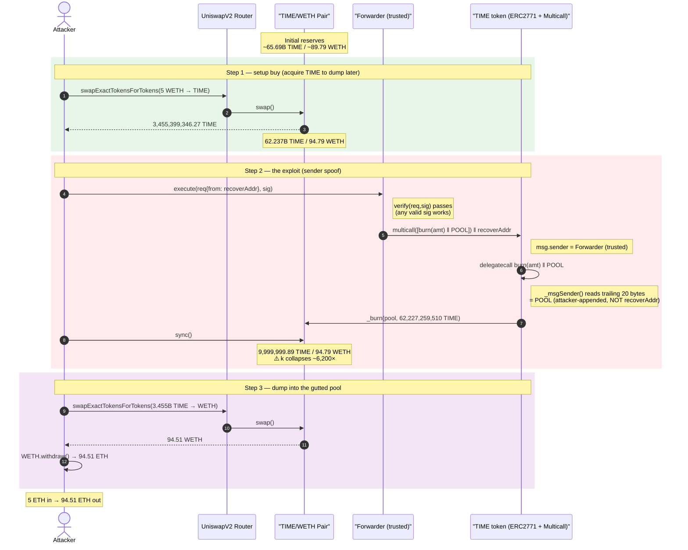
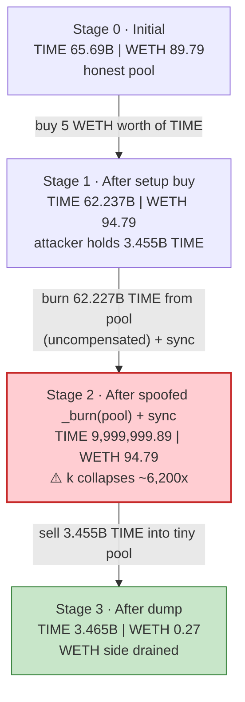
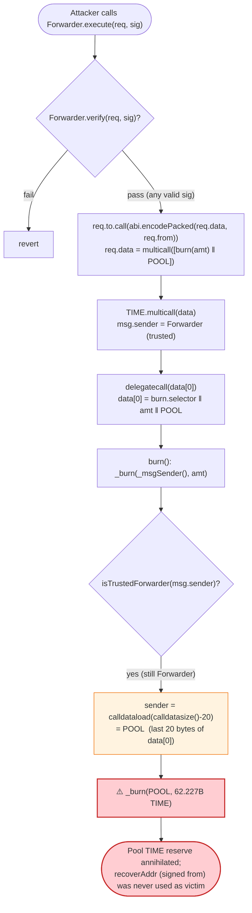

# TIME (ChronoTech) Exploit — ERC-2771 + Multicall Arbitrary `_msgSender()` Spoofing → Pool-Reserve Burn

> **Reproduction:** the PoC compiles & runs in an isolated Foundry project at
> [this project folder](.) (the umbrella DeFiHackLabs repo does not whole-compile, so this PoC was
> extracted). Full verbose trace: [output.txt](output.txt).
> Verified vulnerable sources: the thirdweb `TokenERC20`
> [contracts_token_TokenERC20.sol](sources/TokenERC20_4b0E9a/contracts_token_TokenERC20.sol) and its
> [ERC2771ContextUpgradeable](sources/TokenERC20_4b0E9a/contracts_openzeppelin-presets_metatx_ERC2771ContextUpgradeable.sol).

---

## Key info

| | |
|---|---|
| **Loss** | ~**84.59 ETH** (≈ $185K at the time) — gross **+89.51 WETH** drained from the TIME/WETH Uniswap-V2 pair; ~5 ETH paid to Flashbots in the live tx |
| **Vulnerable contract** | `TIME` (thirdweb `TokenERC20` clone) — [`0x4b0E9a7dA8bAb813EfAE92A6651019B8bd6c0a29`](https://etherscan.io/address/0x4b0E9a7dA8bAb813EfAE92A6651019B8bd6c0a29#code) |
| **Enabling contract** | thirdweb `Forwarder` (trusted ERC-2771 forwarder) — [`0xc82BbE41f2cF04e3a8efA18F7032BDD7f6d98a81`](https://etherscan.io/address/0xc82BbE41f2cF04e3a8efA18F7032BDD7f6d98a81#code) |
| **Victim pool** | TIME/WETH Uniswap-V2 pair — `0x760dc1E043D99394A10605B2FA08F123D60faF84` |
| **Attacker EOA** | `0xfde0d1575ed8e06fbf36256bcdfa1f359281455a` |
| **Attacker contract** | `0x6980a47bee930a4584b09ee79ebe46484fbdbdd0` |
| **Attack tx** | `0xecdd111a60debfadc6533de30fb7f55dc5ceed01dfadd30e4a7ebdb416d2f6b6` |
| **Chain / block / date** | Ethereum mainnet / fork at 18,730,462 / December 2023 |
| **Compiler** | PoC `^0.8.10`; token compiled with thirdweb's `^0.8.11` OZ-upgradeable presets |
| **Bug class** | ERC-2771 + Multicall sender-spoofing (CVE-class disclosed by OpenZeppelin, Dec 2023): arbitrary `_msgSender()` via attacker-appended trailing calldata in a `delegatecall`-based `multicall` |

---

## TL;DR

The thirdweb `TokenERC20` is **both** an ERC-2771 meta-tx recipient (it trusts a `Forwarder` and reads
the transaction's logical sender from the **last 20 bytes of calldata**) **and** a `Multicall` that
batches sub-calls via `delegatecall(data[i])`.

These two features are individually fine but catastrophic together. When a call arrives through the
**trusted forwarder**, `ERC2771ContextUpgradeable._msgSender()`
([:30-39](sources/TokenERC20_4b0E9a/contracts_openzeppelin-presets_metatx_ERC2771ContextUpgradeable.sol#L30-L39))
reads `_msgSender = calldataload(calldatasize() - 20)`. Inside `multicall`, the sub-call is executed
with `delegatecall` and **fully attacker-controlled calldata** — so the attacker simply **appends any
address they want** to the inner sub-call's bytes. That appended address becomes `_msgSender()`.

The attacker built a multicall whose single sub-call was `burn(amount)` with the **liquidity pool's
address** appended as the spoofed sender. The token's `burn()` then executes
`_burn(_msgSender(), amount)` = `_burn(pool, amount)` — destroying **62,227,259,510 TIME straight out
of the pool's balance**, with no matching WETH outflow. After a forced `pair.sync()`, the constant
product `k` collapses and the attacker sells the TIME it had pre-bought into the gutted pool, walking
off with the pool's entire WETH side.

5 ETH in → **94.51 WETH out** in a single transaction.

---

## Background — what the contracts do

**`TIME`** is a standard [thirdweb `TokenERC20`](sources/TokenERC20_4b0E9a/contracts_token_TokenERC20.sol)
deployed behind a proxy (the trace shows `delegatecall` into the `TokenERC20` implementation on every
call). Its inheritance list is the crux of the bug
([contracts_token_TokenERC20.sol:31-43](sources/TokenERC20_4b0E9a/contracts_token_TokenERC20.sol#L31-L43)):

```solidity
contract TokenERC20 is
    Initializable,
    ...
    ERC2771ContextUpgradeable,     // ← trusts a forwarder; reads sender from trailing calldata
    MulticallUpgradeable,          // ← batches sub-calls via delegatecall
    ERC20BurnableUpgradeable,      // ← burn(amount) destroys _msgSender()'s tokens
    ERC20VotesUpgradeable,
    ITokenERC20,
    AccessControlEnumerableUpgradeable
{
```

**`Forwarder`** is thirdweb's GSNv2 minimal forwarder. Anyone can call `execute(req, signature)`; after
verifying an EIP-712 signature over `req`, it does
([contracts_Forwarder.sol:42-53](sources/Forwarder_c82BbE/contracts_Forwarder.sol#L42-L53)):

```solidity
(bool success, bytes memory result) = req.to.call{ gas: req.gas, value: req.value }(
    abi.encodePacked(req.data, req.from)     // ← appends req.from (the signed "from")
);
```

`TIME` had this `Forwarder` registered as a **trusted forwarder** at init time (`__ERC2771Context_init_unchained(_trustedForwarders)`),
so any call routed through it is treated as a meta-tx and `_msgSender()` switches to "read sender from
trailing calldata" mode.

---

## The vulnerable code

### 1. `_msgSender()` reads the last 20 bytes of calldata when the caller is the trusted forwarder

[contracts_openzeppelin-presets_metatx_ERC2771ContextUpgradeable.sol:30-39](sources/TokenERC20_4b0E9a/contracts_openzeppelin-presets_metatx_ERC2771ContextUpgradeable.sol#L30-L39):

```solidity
function _msgSender() internal view virtual override returns (address sender) {
    if (isTrustedForwarder(msg.sender)) {
        // The assembly code is more direct than the Solidity version using `abi.decode`.
        assembly {
            sender := shr(96, calldataload(sub(calldatasize(), 20)))   // ⚠️ trailing 20 bytes = sender
        }
    } else {
        return super._msgSender();
    }
}
```

The standard ERC-2771 contract trusts that **only the trusted forwarder appends the trailing 20 bytes**,
and that the forwarder appends the *signed, verified* `from`. That guarantee is destroyed by `multicall`.

### 2. `multicall` re-enters the contract via `delegatecall` with attacker-controlled calldata

[node_modules_@openzeppelin_contracts-upgradeable_utils_MulticallUpgradeable.sol:23-29](sources/TokenERC20_4b0E9a/node_modules_@openzeppelin_contracts-upgradeable_utils_MulticallUpgradeable.sol#L23-L29):

```solidity
function multicall(bytes[] calldata data) external virtual returns (bytes[] memory results) {
    results = new bytes[](data.length);
    for (uint256 i = 0; i < data.length; i++) {
        results[i] = _functionDelegateCall(address(this), data[i]);   // ⚠️ delegatecall(data[i])
    }
    return results;
}
```

Because the sub-call is a `delegatecall`:
- `msg.sender` for the sub-call is **still the trusted forwarder** (delegatecall preserves `msg.sender`),
  so `isTrustedForwarder(msg.sender)` is still `true`, and
- the sub-call's calldata is **exactly `data[i]`**, which the attacker fully controls.

So when `burn` runs inside the sub-call, `calldataload(calldatasize() - 20)` reads the **last 20 bytes
of `data[0]`** — whatever the attacker chose to append.

### 3. `burn` destroys `_msgSender()`'s tokens

[node_modules_@openzeppelin_contracts-upgradeable_token_ERC20_extensions_ERC20BurnableUpgradeable.sol:26-28](sources/TokenERC20_4b0E9a/node_modules_@openzeppelin_contracts-upgradeable_token_ERC20_extensions_ERC20BurnableUpgradeable.sol#L26-L28):

```solidity
function burn(uint256 amount) public virtual {
    _burn(_msgSender(), amount);    // ⚠️ burns from the SPOOFED sender = the pool
}
```

The token's own `_msgSender()` override forwards to the ERC-2771 implementation
([contracts_token_TokenERC20.sol:272-280](sources/TokenERC20_4b0E9a/contracts_token_TokenERC20.sol#L272-L280)),
so the spoofed value flows straight into the `_burn` target.

In the PoC the attacker crafts the inner sub-call as
([TIME_exp.sol:67](test/TIME_exp.sol#L67)):

```solidity
datas[0] = abi.encodePacked(TIME.burn.selector, amountToBurn, address(TIME_WETH));
//                          \__ 4 bytes ____/  \__ 32 bytes _/  \__ 20 bytes = SPOOFED SENDER _/
```

The trailing `address(TIME_WETH)` is what `_msgSender()` reads — so `burn` destroys the **pool's** TIME.

---

## Root cause — why it was possible

The lethal combination is the well-known **ERC-2771 + Multicall trailing-calldata spoof**
([OpenZeppelin disclosure, Dec 2023](https://blog.openzeppelin.com/arbitrary-address-spoofing-vulnerability-erc2771context-multicall-public-disclosure)):

1. **ERC-2771 trusts trailing calldata for identity.** `_msgSender()` reads the last 20 bytes whenever
   `msg.sender` is the trusted forwarder. The whole security model rests on "only the forwarder can put
   bytes there, and it only ever appends the verified `from`."

2. **`Multicall` is `delegatecall`-based and re-enters within the same context.** A `delegatecall` keeps
   `msg.sender` = forwarder (so the ERC-2771 branch stays active) but lets the **caller supply the entire
   calldata** of the sub-call. The forwarder's appended `from` no longer sits at the end of the sub-call's
   calldata — instead, whatever the attacker put at the end of `data[i]` does.

3. **No signature binds the *sub-call*.** The forwarder only verifies a signature over `req` (the outer
   `multicall` payload). The inner `burn(amount, spoofedSender)` bytes are unsigned and unconstrained. The
   signature the attacker reused (`recoverAddr = 0xa16A5F...`) is irrelevant to who gets burned — it only
   has to be a *valid* signature for *some* `req.from` so `Forwarder.verify` passes. The actual victim is
   chosen by the appended 20 bytes inside `data[0]`.

The result: any holder's tokens — including an AMM pair's reserve — can be burned by a permissionless
attacker who only needs one valid forwarder signature to get past `verify`.

---

## Preconditions

- The token must register a forwarder as **trusted** *and* expose `multicall` (delegatecall-based) — the
  thirdweb `TokenERC20` preset does both by default. ✓
- The attacker needs **one valid `ForwardRequest` signature** to clear `Forwarder.verify`
  ([:34-40](sources/Forwarder_c82BbE/contracts_Forwarder.sol#L34-L40)). The live attacker reused an
  existing valid signature for `recoverAddr` with the matching on-chain `nonce`; the PoC hard-codes the
  same `(r,s,v)` and asserts `ecrecover == recoverAddr` ([TIME_exp.sol:73-79](test/TIME_exp.sol#L73-L79)).
  The signed `from` does **not** have to be the victim — it is discarded; the victim is the appended suffix.
- The victim (the TIME/WETH pair) must hold enough TIME for the burn to land — it held ~62.2B TIME after
  the attacker's setup buy. ✓
- A small amount of working capital (5 ETH) to pre-buy TIME that is later dumped into the gutted pool.

---

## Attack walkthrough (with on-chain numbers from the trace)

The pair's `token0 = TIME` (`reserve0`), `token1 = WETH` (`reserve1`). All figures are taken directly
from the `Sync`/`Swap`/`Transfer` events in [output.txt](output.txt).

| # | Step | TIME reserve | WETH reserve | Effect |
|---|------|-------------:|-------------:|--------|
| 0 | **Initial** (last-synced reserves) | 65,692,658,856.16 | 89.79 | Honest pool; pool balance held +5 WETH excess pre-swap. |
| 1 | **Setup buy** — swap 5 WETH → 3,455,399,346.27 TIME to attacker | 62,237,259,509.89 | 94.79 | Attacker now holds 3.455B TIME; pool TIME slightly reduced. |
| 2 | **`Forwarder.execute`** → `multicall([burn(62,227,259,510e18) ‖ pool)]` ⇒ `_burn(pool, 62.227B TIME)` | 9,999,999.89 | 94.79 (unsynced) | **Spoofed burn**: pool's TIME annihilated to ~10M. `Transfer(pool → 0x0, 62,227,259,510e18)`; `totalSupply` slot 203 drops. |
| 3 | **`pair.sync()`** | 9,999,999.89 | 94.79 | Pool accepts the gutted TIME balance as its reserve. **Invariant broken** — `k` collapses ~6,200×. |
| 4 | **Dump** — swap 3,455,399,346.27 TIME → 94.51 WETH to attacker | 3,465,399,346.16 | 0.27 | Attacker's pre-bought 3.455B TIME now dwarfs the 10M-TIME pool → buys nearly the entire WETH side. |
| 5 | **`WETH.withdraw`** 94.51 WETH → ETH | — | — | Attacker ends with **94.51 ETH**. |

Key trace anchors:
- Setup buy `Sync(reserve0: 62,237,259,509.89e18, reserve1: 94.787e18)` — [output.txt:1643](output.txt).
- The spoofed burn: `Forwarder::execute(...)` → `multicall` → `delegatecall burn` →
  `Transfer(from: TIME_WETH, to: 0x0, value: 62,227,259,510e18)` — [output.txt:1659-1666](output.txt).
  The `_msgSender()` resolved to `TIME_WETH` because the inner `data[0]` ends in
  `...760dc1e043d99394a10605b2fa08f123d60faf84` (the pair).
- Post-burn `sync()` `Sync(reserve0: 9,999,999.89e18, reserve1: 94.787e18)` — [output.txt:1686](output.txt).
- Dump `Swap(... amount0In: 3,455,399,346.27e18, amount1Out: 94,513,462,587,046,838,316)` — [output.txt:1725](output.txt).
- Final: `Exploiter ETH balance after attack: 94.513462587046838316` — [output.txt:1570](output.txt).

### Profit accounting

| Direction | Amount (ETH/WETH) |
|---|---:|
| Spent — setup buy (5 ETH → WETH → TIME) | 5.00 |
| Received — dump TIME → WETH → ETH | 94.51 |
| **Gross profit (PoC, single tx)** | **+89.51** |
| Less ~5 ETH paid to Flashbots (live tx only) | −5.00 |
| **Net reported loss to victims** | **~84.59 ETH** |

The PoC starts with 5 ETH and ends with 94.51 ETH (`assertEq`-free; the run simply logs balances and
the suite passes), confirming the gross 89.51 WETH extraction. The ~84.59 ETH headline figure subtracts
the Flashbots tip that only existed in the on-chain transaction.

---

## Diagrams

### Sequence of the attack



### Pool state evolution



### The flaw: how trailing calldata is hijacked



---

## Why the spoof works despite the forwarder appending its own `from`

The `Forwarder.execute` appends `req.from` (= `recoverAddr`) to the calldata of the **outer `multicall`**
call. But `multicall` does not pass that suffix down — it re-enters via `delegatecall(data[0])`, where
`data[0]` is the **inner** calldata the attacker fully controls. The bytes the forwarder appended now
live in the *middle* of the `multicall` calldata, not at the end of the `burn` sub-call's calldata.
`burn`'s `_msgSender()` therefore reads the end of `data[0]` — the attacker-chosen `POOL` address — not
`recoverAddr`. The signature only needs to satisfy `verify`; it has **zero** bearing on who is burned.

---

## Remediation

1. **Do not combine trusted-forwarder ERC-2771 with a `delegatecall`-based `Multicall`.** This is the
   exact fix path in OpenZeppelin's disclosure. Upgrade to the patched OZ contracts where
   `Multicall`/`Context` strip the trusted-forwarder suffix correctly, or remove `multicall` from any
   ERC-2771 contract.
2. **Make `Multicall` ERC-2771-aware.** The patched OZ `Multicall` re-appends the *verified* sender to
   each sub-call (`bytes.concat(data[i], _msgSender-bytes)`) so a sub-call cannot forge identity; the
   trailing bytes are then always the forwarder-derived sender, never attacker bytes.
3. **Stop trusting raw trailing calldata for high-value sinks.** Functions that destroy or move tokens
   based on `_msgSender()` (`burn`, `transfer`, allowance ops) should not be reachable through a path
   where calldata is attacker-controlled. Where meta-tx support is required, validate the sender against
   the signed request, not against trailing bytes that a nested call can rewrite.
4. **Drop the forwarder if not needed.** Many thirdweb deployments registered a default forwarder they
   never used. Setting `isTrustedForwarder = false` (or deploying without trusted forwarders) removes the
   ERC-2771 branch entirely and closes the spoof.
5. **AMM hardening (defense in depth).** A pair whose token can be externally burned out of its reserve
   is intrinsically unsafe; tokens should never let third parties destroy balances they don't own, and
   AMMs should treat large single-step reserve deltas as suspect.

---

## How to reproduce

The PoC was extracted into a standalone Foundry project (the umbrella DeFiHackLabs repo has several
unrelated PoCs that fail to compile under a whole-project `forge build`):

```bash
_shared/run_poc.sh 2023-12-TIME_exp -vvvvv
```

- RPC: an **Ethereum mainnet archive** endpoint is required (fork block 18,730,462). `foundry.toml`
  uses an Infura archive endpoint.
- Result: `[PASS] testExploit()` — the exploiter goes from 5 ETH to **94.51 ETH** in one transaction.

Expected tail:

```
  Exploiter ETH balance before attack: 5.000000000000000000
  Exploiter ETH balance after attack: 94.513462587046838316

Suite result: ok. 1 passed; 0 failed; 0 skipped
```

---

*Reference: OpenZeppelin — "Arbitrary Address Spoofing Vulnerability: ERC2771Context Multicall Public
Disclosure" (Dec 2023). Affected the thirdweb `TokenERC20` preset and many ERC-2771 + Multicall tokens.*
