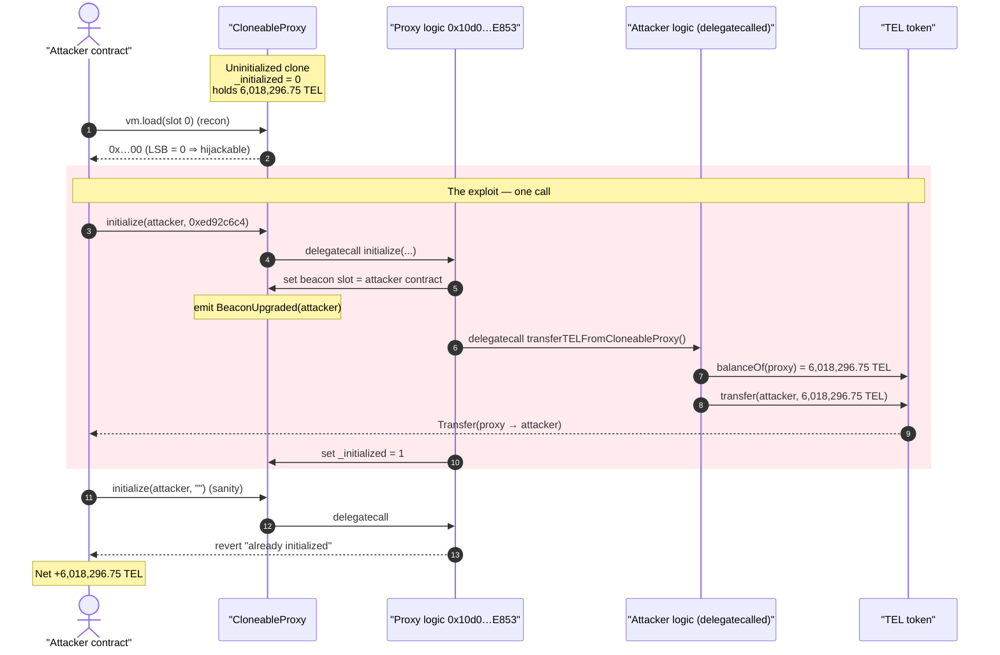
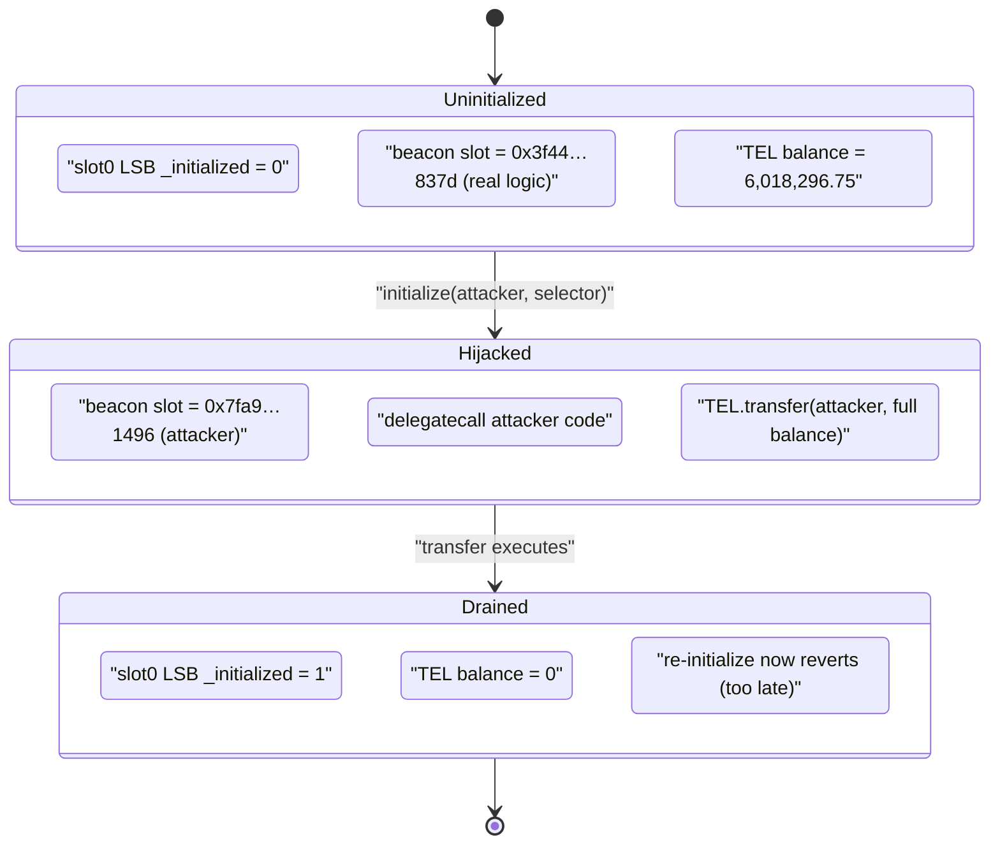
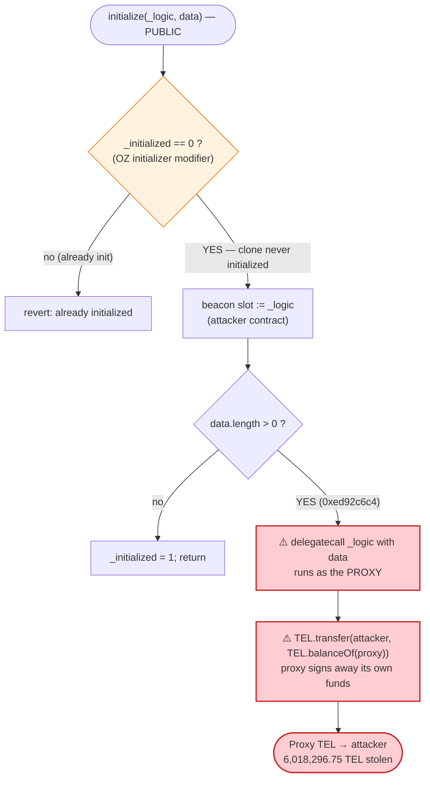

# Telcoin Exploit — Uninitialized `CloneableProxy` Hijacked via Public `initialize()`

> **Vulnerability classes:** vuln/access-control/uninitialized-proxy · vuln/access-control/uninitialized-owner

> **Reproduction:** the PoC compiles & runs in an isolated Foundry project at
> [this project folder](.) (the main DeFiHackLabs repo contains several unrelated
> PoCs that do not whole-compile, so this one was extracted).
> Full verbose trace: [output.txt](output.txt).
> The vulnerable `CloneableProxy` and its logic are **unverified** on Polygonscan; the
> token contract it drains (`TEL` / `UChildERC20`) is verified:
> [UChildERC20.sol](sources/UChildERC20_805b70/UChildERC20.sol).

---

## Key info

| | |
|---|---|
| **Loss** | ~$1.24M total across the incident; **6,018,296.75 TEL** drained from this one proxy clone in the reproduced tx |
| **Vulnerable contract** | `CloneableProxy#1` (EIP-1167 clone) — [`0x56BCADff30680EBB540a84D75c182A5dC61981C0`](https://polygonscan.com/address/0x56BCADff30680EBB540a84D75c182A5dC61981C0) (unverified) |
| **Proxy logic / `initialize` impl** | [`0x10d0E9755C67Ab37089aCb4f51E8b4eE407FE853`](https://polygonscan.com/address/0x10d0E9755C67Ab37089aCb4f51E8b4eE407FE853) (unverified) |
| **Drained token** | `TEL` (Telcoin), `UChildERC20` proxy [`0xdF7837DE1F2Fa4631D716CF2502f8b230F1dcc32`](https://polygonscan.com/address/0xdF7837DE1F2Fa4631D716CF2502f8b230F1dcc32) → logic [`0x805b70339183f9A98cC7fcB35fCbeb5Ac10713EA`](https://polygonscan.com/address/0x805b70339183f9A98cC7fcB35fCbeb5Ac10713EA) |
| **Attacker EOA** | [`0xdb4b84f0e601e40a02b54497f26e03ef33f3a5b7`](https://polygonscan.com/address/0xdb4b84f0e601e40a02b54497f26e03ef33f3a5b7) |
| **Attack tx (this clone)** | [`0x35f50851c3b754b4565dc3e69af8f9bdb6555edecc84cf0badf8c1e8141d902d`](https://app.blocksec.com/explorer/tx/polygon/0x35f50851c3b754b4565dc3e69af8f9bdb6555edecc84cf0badf8c1e8141d902d) |
| **Chain / block / date** | Polygon / 51,546,495 / 2023-12-25 |
| **Compiler (PoC)** | Solidity 0.8.34 (test harness), `evm_version = cancun` |
| **Bug class** | Unprotected initializer on an uninitialized proxy → arbitrary-logic `delegatecall` → fund theft |

---

## TL;DR

Telcoin deployed a fleet of upgradeable `CloneableProxy` contracts as EIP-1167 minimal clones that
forward all calls to a shared logic contract
[`0x10d0…E853`](https://polygonscan.com/address/0x10d0E9755C67Ab37089aCb4f51E8b4eE407FE853).
That logic exposes a **public, unprotected** `initialize(address _logic, bytes data)` which (1) sets
the proxy's ERC-1967 **beacon/implementation** slot to `_logic`, and (2) **`delegatecall`s `_logic`
with `data`**. The proxy clone for this attack had been deployed but **never initialized**
(`_initialized == 0`), so the guard `Initializable: contract is already initialized` did not fire.

The attacker simply:

1. Deployed a malicious "logic" contract exposing `transferTELFromCloneableProxy()`.
2. Called `CloneableProxy.initialize(attacker_logic, abi.encodePacked(transferTELFromCloneableProxy.selector))`.
3. Inside `initialize`, the proxy set its beacon to the attacker's contract and **`delegatecall`ed**
   `transferTELFromCloneableProxy()` — running in the proxy's own storage/identity context — which
   executed `TEL.transfer(attacker, TEL.balanceOf(proxy))`, sweeping the proxy's entire **6,018,296.75 TEL**.

No flash loan, no price manipulation, no privileged key. One public function call to an uninitialized
proxy turns the proxy into a puppet that signs away whatever it holds. The same pattern was repeated
against several Telcoin proxy clones for a combined ~$1.24M loss.

---

## Background — what `CloneableProxy` is

Telcoin's wallet/treasury infrastructure deploys many small per-purpose contracts as **EIP-1167 minimal
proxies** ("clones"). The clone bytecode of `0x56BCADff…981C0` is the canonical EIP-1167 stub:

```
0x363d3d373d3d3d363d73 10d0e9755c67ab37089acb4f51e8b4ee407fe853 5af43d82803e903d91602b57fd5bf3
```

i.e. *"delegatecall everything to `0x10d0…E853`"*. That shared logic contract is itself an
**upgradeable, beacon-style proxy implementation** built on OpenZeppelin's `Initializable`: it stores
the active implementation in the ERC-1967 beacon slot and is meant to be configured exactly once via
`initialize(address _logic, bytes data)`.

Confirmed from the live bytecode of `0x10d0…E853` (decoded selectors):

| Selector | Function | Source |
|---|---|---|
| `0xd1f57894` | `initialize(address,bytes)` | `cast 4byte d1f57894` |
| `0x5c60da1b` | `implementation()` | `cast 4byte 5c60da1b` |

And the ERC-1967 beacon slot it writes to:

```
keccak256("eip1967.proxy.beacon") - 1
= 0xa3f0ad74e5423aebfd80d3ef4346578335a9a72aeaee59ff6cb3582b35133d50
```

That is the **exact slot** that changes in the attack trace (see below).

The token being stolen, `TEL`, is Polygon's `UChildERC20`
([UChildERC20.sol](sources/UChildERC20_805b70/UChildERC20.sol)) — a standard Matic child ERC20. `TEL`
uses **2 decimals** (`TEL.decimals()` returns `2`), which is why a raw balance of `601,829,675`
prints as `6,018,296.75 TEL`. The token is an innocent bystander; it is the proxy's own TEL holdings
that get swept, via a perfectly valid `transfer` call made *by the proxy*.

---

## The vulnerable code

The proxy logic (`0x10d0…E853`) is unverified, but the behaviour is fully determined by the trace and
by the OpenZeppelin `Initializable` / `ERC1967` patterns it is built on. Reconstructed:

```solidity
// CloneableProxy logic @ 0x10d0E9755C67Ab37089aCb4f51E8b4eE407FE853 (reconstructed from trace + ABI)
contract CloneableProxy is Initializable {
    // slot 0 packs OZ Initializable's: uint8 _initialized (here used as bool) + bool _initializing
    // ERC-1967 beacon slot: 0xa3f0ad74...d50

    function initialize(address _logic, bytes memory data) external initializer {
        //              ^^^^^^^^^^^^^^^^^^^^^^^^^^^^^^^^^^   ⚠️ PUBLIC, only guarded by `initializer`
        _upgradeBeaconToAndCall(_logic, data, false);       // sets beacon = _logic; emits BeaconUpgraded
        // _upgradeBeaconToAndCall delegatecalls _logic with `data`:
        if (data.length > 0) {
            (bool ok, ) = _logic.delegatecall(data);        // ⚠️ delegatecall to ATTACKER-controlled code
            require(ok);
        }
    }

    function implementation() external view returns (address) { /* reads beacon slot */ }
}
```

The single load that proves the precondition (from
[output.txt:1598-1599](output.txt#L1598-L1599)):

```
VM::load(CloneableProxy#1, slot 0)
  └─ 0xa260d3506d4bae68003000240001000000000000000001000040001000000000
                                                                      ^^ last byte = 0x00
```

The least-significant byte (OZ `_initialized`) is **`0x00`** — the proxy clone was **never
initialized**. So `initializer` lets the call through.

The attacker-supplied logic is just one line ([test/Telcoin_exp.sol:78-80](test/Telcoin_exp.sol#L78-L80)):

```solidity
// Function will be delegatecalled from CloneableProxy#1
function transferTELFromCloneableProxy() external {
    TEL.transfer(msg.sender, TEL.balanceOf(address(CloneableProxy)));
}
```

Because it runs under `delegatecall`, `address(this)` *is* the proxy, and `TEL.transfer(...)` moves
the **proxy's** TEL to `msg.sender` (the attacker's outer contract).

---

## Root cause — why it was possible

Three design facts compose into a critical bug:

1. **The initializer is public and unprotected beyond the one-time `initializer` modifier.** Anyone can
   be the first caller of `initialize()` on an uninitialized clone. There is no `onlyOwner`,
   no deployer check, no factory-only restriction.
2. **The proxy clones were deployed but left uninitialized.** Deployment and initialization were not
   atomic. A clone sitting on-chain with `_initialized == 0` and a non-zero TEL balance is a live bomb:
   the first `initialize()` caller wins.
3. **`initialize()` does an arbitrary `delegatecall` to a caller-chosen address.** This is the
   detonator. `initialize(address _logic, bytes data)` lets the caller both **point the proxy at any
   logic contract** *and* **immediately execute arbitrary `data` against the proxy's own storage and
   token balances**. There is no allow-list of logic contracts and no constraint on `data`.

> The combination means a stranger can take over an uninitialized, funded proxy and, in the very same
> call, make it `delegatecall` code that transfers out everything it holds. The proxy authorizes the
> theft itself, so `TEL`'s ERC20 checks all pass.

The attack is a textbook **"unprotected initializer + arbitrary delegatecall"**. It needs no economic
manipulation; the only precondition is finding a clone that nobody initialized first.

---

## Preconditions

- A `CloneableProxy` clone exists on-chain, **holds TEL**, and has **`_initialized == 0`** (never
  initialized by Telcoin). Confirmed at the fork block: slot-0 LSB = `0x00`, TEL balance = 6,018,296.75.
- The shared logic's `initialize(address,bytes)` is reachable (public) — confirmed via the `d1f57894`
  selector in the live bytecode.
- The attacker controls a contract exposing the function selector it wants `delegatecall`ed
  (`transferTELFromCloneableProxy()` = `0xed92c6c4`) — here, the PoC's own `ContractTest`.
- No capital, no flash loan, no specific timing required.

---

## Attack walkthrough (with on-chain numbers from the trace)

All figures are read directly from [output.txt](output.txt). `TEL` decimals = 2.

| # | Step | Trace evidence | State / Effect |
|---|------|----------------|----------------|
| 0 | **Pre-state read.** Attacker reads `CloneableProxy#1` slot 0. | [out:1598-1599](output.txt#L1598-L1599) → `0x…000000` (LSB `00`) | `_initialized = 0` ⇒ proxy is hijackable. Proxy TEL balance = **6,018,296.75 TEL** ([out:1619-1621](output.txt#L1619-L1621)). |
| 1 | **Build payload.** `data = transferTELFromCloneableProxy.selector` = `0xed92c6c4`. | [test:49](test/Telcoin_exp.sol#L49) | Selector confirmed: `cast sig "transferTELFromCloneableProxy()" == 0xed92c6c4`. |
| 2 | **Call `initialize(attacker, 0xed92c6c4)`.** | [out:1611-1612](output.txt#L1611-L1612) | Proxy delegatecalls logic `0x10d0…E853`, which runs the initializer. |
| 3 | **Beacon hijack.** Logic sets ERC-1967 beacon slot to attacker contract; emits `BeaconUpgraded`. | [out:1615](output.txt#L1615), storage change [out:1634](output.txt#L1634) | Slot `0xa3f0…d50`: `…3f443c31…` (old logic) → `…7fa9385be102…` (attacker `ContractTest`). |
| 4 | **Malicious delegatecall.** Initializer `delegatecall`s the attacker's `transferTELFromCloneableProxy()` in the proxy's context. | [out:1618](output.txt#L1618) | Runs as the proxy. |
| 5 | **Sweep.** Reads `TEL.balanceOf(proxy)` = 601,829,675, then `TEL.transfer(attacker, 601,829,675)`. | [out:1619-1630](output.txt#L1619-L1630) | `Transfer(proxy → attacker, 6,018,296.75 TEL)`. Proxy TEL balance → 0. |
| 6 | **Initializer finishes.** Slot 0 LSB flips `00 → 01`. | storage change [out:1633](output.txt#L1633) | `_initialized = 1` now (a fitting tombstone). |
| 7 | **Post-checks.** Attacker TEL balance = **6,018,296.75 TEL**; a second `initialize("")` now reverts. | [out:1656](output.txt#L1656), [out:1659-1662](output.txt#L1659-L1662) | `Initializable: contract is already initialized` — the guard *now* works, after the theft. |

### Profit / loss accounting

| | TEL | Notes |
|---|---:|---|
| Attacker TEL before | 0.00 | [out:1564](output.txt#L1564) |
| Proxy TEL before | 6,018,296.75 | [out:1621](output.txt#L1621) |
| **TEL moved proxy → attacker** | **6,018,296.75** | single `transfer`, [out:1625](output.txt#L1625) |
| Attacker TEL after | 6,018,296.75 | [out:1576](output.txt#L1576) |
| Proxy TEL after | 0.00 | drained |

This PoC reproduces the theft from **one** clone. The published incident (BlockSec / SlowMist) totals
**~$1.24M** across multiple identically-vulnerable proxies.

---

## Diagrams

### Sequence of the attack



### Proxy state evolution



### Why the call authorizes its own theft



---

## Remediation

1. **Initialize atomically with deployment.** A proxy clone must never sit on-chain in an
   uninitialized-but-funded state. Deploy and `initialize` in the same transaction (e.g., a factory
   that `create2`s the clone and immediately initializes it), so there is no window for a stranger to
   be the first caller. Crucially, **do not transfer funds to a proxy until it is initialized.**
2. **Restrict who may initialize.** The `initialize` function should be callable only by the deployer /
   factory / owner, not by `msg.sender == anyone`. The OZ `initializer` modifier only guarantees
   *once*, not *by whom* — it is not access control.
3. **Never let `initialize` perform an arbitrary `delegatecall` to a caller-chosen target.** If the
   pattern requires setting an implementation + running an init hook, constrain the logic address to a
   vetted allow-list (or a fixed, audited implementation) and constrain `data` to a known initializer
   signature. An unconstrained `delegatecall(_logic, data)` reachable by the public is equivalent to
   "let anyone run any code as me."
4. **Sweep / pause idle clones.** Any already-deployed but uninitialized clones holding value should be
   initialized or drained-to-treasury defensively before an attacker finds them.

---

## How to reproduce

```bash
_shared/run_poc.sh 2023-12-Telcoin_exp -vvvvv
```

- RPC: a **Polygon archive** endpoint is required (fork block 51,546,495 is from Dec 2023).
  `foundry.toml` uses an Infura Polygon archive endpoint; most pruned public RPCs fail with
  `missing trie node` at that block.
- Result: `[PASS] testExploit()`. The test asserts the proxy is uninitialized before
  (`_initialized = 0`), drains its TEL, shows `_initialized = 1` after, and confirms a second
  `initialize` now reverts.

Expected tail:

```
Ran 1 test for test/Telcoin_exp.sol:ContractTest
[PASS] testExploit() (gas: 95357)
  Attacker TEL balance before exploit: 0.00
  CloneableProxy#1 storage packed slot 0 ... before ... uint8 _initializing: 0, bool _initialized: 0
  CloneableProxy#1 storage packed slot 0 ... after  ... uint8 _initializing: 0, bool _initialized: 1
  Attacker TEL balance after exploit: 6018296.75
Suite result: ok. 1 passed; 0 failed; 0 skipped
```

---

*References: BlockSec Phalcon — https://blocksec.com/phalcon/blog/telcoin-security-incident-in-depth-analysis ; SlowMist Hacked — https://hacked.slowmist.io/ (Telcoin, Polygon, ~$1.24M).*
