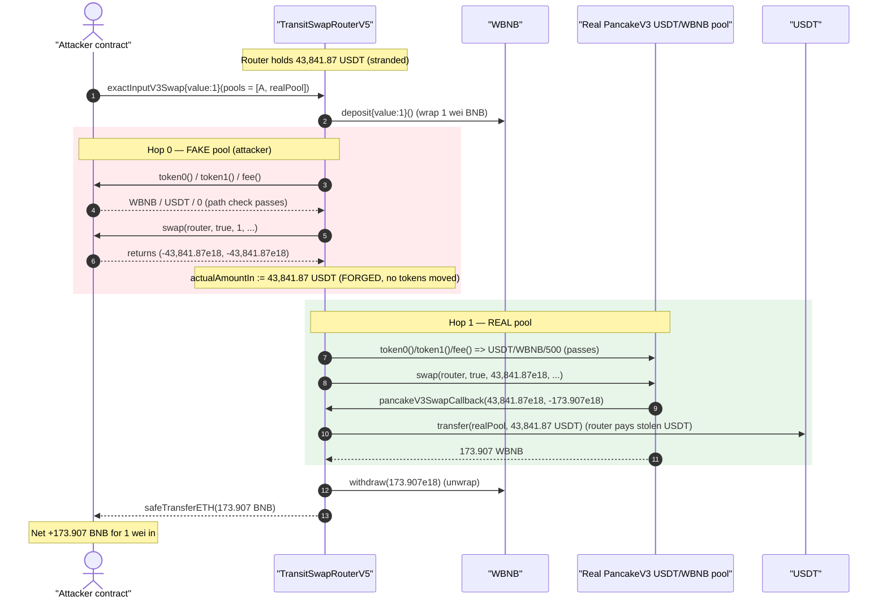
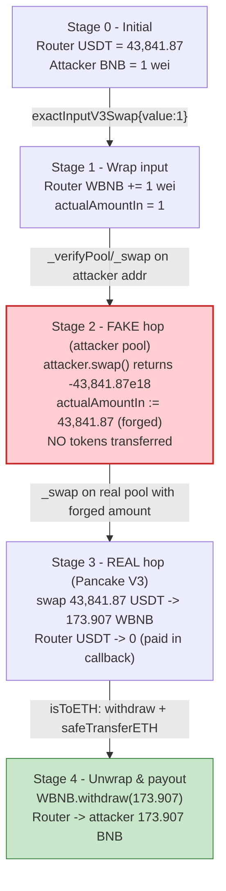
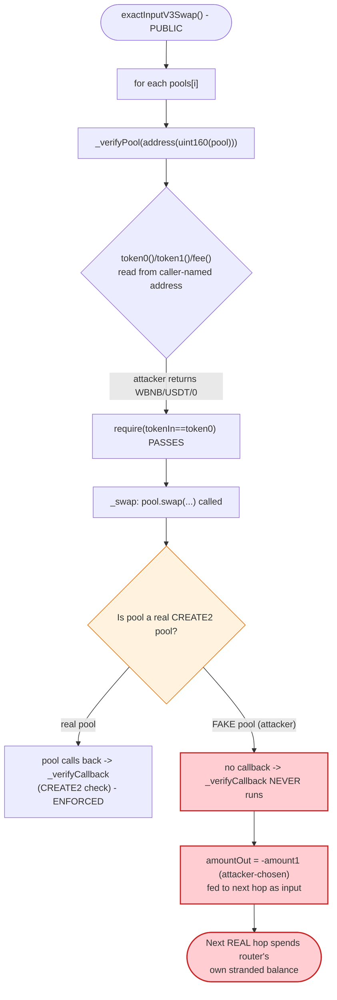

# Transit Finance (TransitSwap V5) Exploit — Forged "Pool" in `exactInputV3Swap` Drains Router-Held Funds

> **Vulnerability classes:** vuln/input-validation/missing · vuln/dependency/unsafe-external-call

> **Reproduction:** the PoC compiles & runs in an isolated Foundry project at
> [this project folder](.) (the umbrella DeFiHackLabs repo does not whole-compile,
> so this PoC was extracted into a standalone project).
> Full verbose trace: [output.txt](output.txt).
> Verified vulnerable source: [UniswapV3Router.sol](sources/TransitSwapRouterV5_000000/UniswapV3Router.sol).

---

## Key info

| | |
|---|---|
| **Loss (this tx)** | **~$43,841** — `43,841.87` USDT held by the router, swapped out as **173.907 BNB** to the attacker. The wider incident drained multiple tokens stranded in the router for a reported total of ~**$3.3M**. |
| **Vulnerable contract** | `TransitSwapRouterV5` — [`0x00000047bB99ea4D791bb749D970DE71EE0b1A34`](https://bscscan.com/address/0x00000047bB99ea4D791bb749D970DE71EE0b1A34#code) |
| **Victim funds** | Tokens (here USDT `0x55d3…7955`) that users/integrations had left sitting in the router |
| **Real pool used as exit** | PancakeSwap V3 USDT/WBNB pool `0x36696169C63e42cd08ce11f5deeBbCeBae652050` |
| **Attacker EOA** | `0x7FA9385bE102ac3EAc297483Dd6233D62b3e1496` (the PoC test contract address) |
| **Attack tx** | [`0x93ae5f0a121d5e1aadae052c36bc5ecf2d406d35222f4c6a5d63fef1d6de1081`](https://explorer.phalcon.xyz/tx/bsc/0x93ae5f0a121d5e1aadae052c36bc5ecf2d406d35222f4c6a5d63fef1d6de1081) |
| **Chain / block / date** | BSC / 34,506,417 / Dec 20, 2023 |
| **Compiler** | Solidity `v0.8.18+commit.87f61d96`, optimizer **1 run** |
| **Bug class** | Unvalidated, caller-supplied "pool" address → forged swap output / arbitrary external call (broken trust boundary in a DEX aggregator) |

---

## TL;DR

`TransitSwapRouterV5.exactInputV3Swap()` lets the caller pass an arbitrary list of "pools"
(`params.pools[]`). For each entry the router (1) **reads `token0()/token1()/fee()` off the
address to derive the swap path**, and (2) **calls `pool.swap(...)`** and uses the pool's
**self-reported return value** as the amount that flows into the next hop. There is **no
verification that the pool address is a real, factory-deployed Uniswap/Pancake V3 pool** before
those calls — the only genuine pool authentication (`_verifyCallback`, a `CREATE2` address check)
runs *inside the swap callback*, which a fake pool simply never invokes.

The attacker exploits this with a **two-element pools array**:

1. **`pools[0]` = the attacker's own contract.** The router calls `attacker.token0()` (returns
   WBNB), `attacker.token1()` (returns USDT), `attacker.fee()` (returns 0), so its path check
   passes. The router then calls `attacker.swap(...)`, which **returns a huge fake `amountOut`
   equal to the router's entire USDT balance (43,841.87 USDT) without transferring any tokens.**
2. **`pools[1]` = the real PancakeSwap V3 USDT/WBNB pool.** The router now feeds the forged
   `43,841.87 USDT` into a genuine swap against the real pool, paying out of the **router's own
   stranded USDT** and receiving `173.907 WBNB`.

Finally the router unwraps the WBNB and sends `173.907 BNB` to the attacker. The attacker put in
**1 wei of BNB** and walked away with **173.907 BNB** — the value of the USDT that had been left
sitting in the aggregator router.

---

## Background — what TransitSwap V5 does

TransitSwap (Transit Finance) is a **multi-DEX swap aggregator**. `TransitSwapRouterV5` is the
on-chain entry point that routes a user's trade through one or more underlying pools (Uniswap V2,
Uniswap/Pancake V3, cross-chain bridges, etc.). For V3-style routes it exposes
`exactInputV3Swap(ExactInputV3SwapParams)`
([UniswapV3Router.sol:62-64](sources/TransitSwapRouterV5_000000/UniswapV3Router.sol#L62-L64)).

The caller describes the route by packing each hop into a `uint256` inside `params.pools[]`:

- the **low 160 bits** are the pool address,
- the **top bit** (`_ZERO_FOR_ONE_MASK = 1 << 255`) encodes swap direction,
- a nibble of the **top byte** (`pool >> 248 & 0xf`) is later used to pick which V3 factory
  the pool is expected to come from (only inside the callback).

The router pulls `srcToken` from the caller (or wraps incoming native BNB), walks the pool list,
and at the end checks `returnAmount >= minReturnAmount` measured as the *delta* of the
destination token balance. Crucially, like most aggregator routers, **it is not supposed to hold
user funds between transactions** — but in practice tokens accumulate there from dust, failed
sweeps, fee residue, and naïve integrations. That stranded balance is exactly what the bug lets an
attacker steal.

---

## The vulnerable code

### 1. The router trusts a caller-supplied address as a "pool" for path derivation

`_verifyPool` reads `token0/token1/fee` **directly off whatever address the caller put in
`pools[i]`** and only checks that the *path tokens line up* — it never checks the address is a
legitimate, factory-deployed pool:

```solidity
function _verifyPool(address tokenIn, address tokenOut, uint256 pool)
    internal view returns (address nextTokenIn, bytes memory tokenInAndPoolSalt)
{
    IUniswapV3Pool iPool = IUniswapV3Pool(address(uint160(pool)));
    address token0 = iPool.token0();   // ⚠️ called on attacker-controlled address
    address token1 = iPool.token1();   // ⚠️ attacker chooses these return values
    uint24 fee = iPool.fee();
    bytes32 poolSalt = keccak256(abi.encode(token0, token1, fee));

    bool zeroForOne = pool & _ZERO_FOR_ONE_MASK == 0;
    if (zeroForOne) {
        require(tokenIn == token0, "Bad pool");   // ✅ passes if attacker returns tokenIn as token0
        if (tokenOut != address(0)) { require(tokenOut == token1, "Bad pool"); }
        nextTokenIn = token1;                     // ⚠️ next hop's input token is attacker-chosen
        tokenInAndPoolSalt = abi.encode(token0, poolSalt);
    } else { ... }
}
```
[UniswapV3Router.sol:156-179](sources/TransitSwapRouterV5_000000/UniswapV3Router.sol#L156-L179)

### 2. The router uses the pool's **self-reported** output as the next hop's input

```solidity
function _swap(address recipient, uint256 pool, bytes memory tokenInAndPoolSalt, uint256 amount)
    internal returns (uint256 amountOut)
{
    bool zeroForOne = pool & _ZERO_FOR_ONE_MASK == 0;
    if (zeroForOne) {
        (, int256 amount1) =
            IUniswapV3Pool(address(uint160(pool))).swap(   // ⚠️ swap() on a fake pool
                recipient, zeroForOne, amount.toInt256(), MIN_SQRT_RATIO + 1,
                abi.encode(pool, tokenInAndPoolSalt)
            );
        amountOut = SafeMath.toUint256(-amount1);          // ⚠️ trusts attacker's return value
    } else { ... }
}
```
[UniswapV3Router.sol:131-154](sources/TransitSwapRouterV5_000000/UniswapV3Router.sol#L131-L154)

A real V3 pool would only release tokens after calling back into the router
(`pancakeV3SwapCallback`) to pull the input — and that callback is where the genuine pool-address
check lives. But a **fake pool never has to call back**: it just returns a fabricated
`amountOut`. The router happily threads that number into the next hop.

### 3. The multi-hop loop ties it together

```solidity
if (len > 1) {
    address thisTokenIn = tokenIn;
    address thisTokenOut = address(0);
    for (uint256 i; i < len; i++) {
        uint256 thisPool = params.pools[i];
        (thisTokenIn, tokenInAndPoolSalt) = _verifyPool(thisTokenIn, thisTokenOut, thisPool);
        if (i == len - 1 && !isToETH) { recipient = params.dstReceiver; thisTokenOut = tokenOut; }
        actualAmountIn = _swap(recipient, thisPool, tokenInAndPoolSalt, actualAmountIn); // ⚠️ carries forged amount forward
    }
    returnAmount = actualAmountIn;
}
```
[UniswapV3Router.sol:91-115](sources/TransitSwapRouterV5_000000/UniswapV3Router.sol#L91-L115)

### 4. The only real authentication is *inside the callback* — and the fake pool skips it

```solidity
function _verifyCallback(uint256 pool, bytes32 poolSalt, address caller) internal view {
    uint poolDigit = pool >> 248 & 0xf;
    UniswapV3Pool memory v3Pool = _uniswapV3_factory_allowed[poolDigit];
    require(v3Pool.factory != address(0), "Callback bad pool indexed");
    address calcPool = address(uint160(uint256(keccak256(abi.encodePacked(
        hex'ff', v3Pool.factory, poolSalt, v3Pool.initCodeHash)))));
    require(calcPool == caller, "Callback bad pool");   // ✅ real CREATE2 check — but only if a callback happens
}
```
[UniswapV3Router.sol:181-200](sources/TransitSwapRouterV5_000000/UniswapV3Router.sol#L181-L200)

This is the right check — but it runs in `pancakeV3SwapCallback` / `uniswapV3SwapCallback`, which
**only execute when a real pool calls back**. The attacker's hop-0 "pool" never calls back, so this
guard is never reached for it.

---

## Root cause — why it was possible

The router conflates "an address the caller named" with "a trusted Uniswap V3 pool." The genuine
trust anchor — verifying via `CREATE2` that `pool == keccak256(0xff, factory, salt, initCodeHash)`
— exists, but it only fires *reactively inside the swap callback*. For an aggregator that:

1. **reads accounting data (`token0/token1/fee`) off the caller-named address**, and
2. **uses the pool's own `swap()` return value as a quantity that drives subsequent transfers,**

...both of those reads happen **before** any callback, so a malicious contract can satisfy the path
check and fabricate an output amount with **zero real liquidity**.

Concretely, the composition that creates the critical bug:

1. **No pre-call pool validation.** `_verifyPool` should have computed the expected `CREATE2`
   address and required `address(uint160(pool)) == calcPool` *before* calling `token0()` etc.
   Instead it trusts the address.
2. **The hop output is the pool's self-report, not a measured balance delta.** `_swap` returns
   `-amount1` straight from the (fake) pool. A real V3 swap forces input via the callback; a fake
   one just lies about output.
3. **The router holds exploitable funds.** Aggregator routers should be pass-through, but USDT
   (and other tokens) had accumulated in `TransitSwapRouterV5`. The forged first hop "produces"
   exactly the router's USDT balance, and the second (real) swap spends that stranded USDT to buy
   WBNB for the attacker.
4. **Direction/path bits are attacker-controlled.** `zeroForOne` and the token ordering are read
   from caller input and the fake pool's return values, so the attacker freely shapes the route to
   land on a real pool that can convert the stolen token into something liquid (WBNB → BNB).

In short: **the first hop manufactures a number, the second hop turns that number into a real
withdrawal of the router's own balance.**

---

## Preconditions

- The router must **hold a non-trivial balance of some ERC20** (here 43,841.87 USDT). This is the
  loot; no balance ⇒ no profit.
- A **real liquidity pool** must exist that can convert that token into something the attacker
  wants (here the genuine PancakeSwap V3 USDT/WBNB pool). The attacker only needs the real pool to
  hold enough of the *other* side (WBNB) to pay out.
- No allowlist/role is required — `exactInputV3Swap` is **permissionless**. The attacker supplies
  1 wei of BNB only to satisfy `msg.value == params.amount` for the ETH-in branch
  ([UniswapV3Router.sol:75-78](sources/TransitSwapRouterV5_000000/UniswapV3Router.sol#L75-L78)).
- `params.wrappedToken` (WBNB) must be on the `_wrapped_allowed` allowlist — WBNB is, so the
  `require(_wrapped_allowed[...])` passes.

---

## Step-by-step attack walkthrough (ground-truth numbers from the trace)

The PoC sets `srcToken = dstToken = BNB (address(0))`, `wrappedToken = WBNB`, `amount = 1`,
`pools = [attackerContract, realPancakeV3Pool]`. All figures below are read directly from
[output.txt](output.txt).

| # | Call in trace | Concrete values | Effect |
|---|---|---|---|
| 0 | `IERC20(usd).balanceOf(router)` | `43,841.867959016089190183` USDT | Router's stranded USDT — the prize. |
| 1 | `exactInputV3Swap{value: 1}(...)` | `amount = 1`, `pools.length = 2` | Enters multi-hop branch (`len > 1`). |
| 2 | `WBNB.deposit{value: 1}()` | wraps 1 wei BNB | `srcToken` is ETH ⇒ router wraps it; `actualAmountIn = 1` (fee 0). |
| 3 | `_verifyPool(WBNB, 0, pools[0]=attacker)` → `attacker.token0()=WBNB`, `token1()=USDT`, `fee()=0` | `zeroForOne=true`, `tokenIn(WBNB)==token0(WBNB)` ✓ | Path check passes; `nextTokenIn = USDT`. |
| 4 | `_swap(router, pools[0]=attacker, …, amount=1)` → `attacker.swap(...)` returns `(-43841.86e18, -43841.86e18)` | `amountOut = -amount1 = 43,841.867…e18` | **Forged output:** no tokens moved, but `actualAmountIn` is now 43,841.87 (the router's full USDT balance). |
| 5 | `_verifyPool(USDT, 0, pools[1]=realPool)` → real pool `token0()=USDT`, `token1()=WBNB`, `fee()=500` | `zeroForOne=true`, `tokenIn(USDT)==token0(USDT)` ✓ | Path check passes for the real pool. |
| 6 | `realPool.swap(router, true, 43841.867e18, MIN_SQRT_RATIO+1, …)` | pool sends `173.907186477338745776` WBNB to router; in callback router pays `43,841.867…` USDT | Real swap of the router's own USDT → WBNB. |
| 7 | `pancakeV3SwapCallback(43841.86e18, -173.9e18, data)` → `USDT.transfer(realPool, 43,841.867e18)` | router USDT balance → 0 (slot `…b3b251b4` cleared) | Router pays the stolen USDT into the real pool. |
| 8 | `WBNB.balanceOf(router) = 174.342…`; `WBNB.withdraw(173.907e18)` → `receive()` | router unwraps 173.907 WBNB → 173.907 BNB | `isToETH` path: `returnAmount = balanceDelta`. |
| 9 | `safeTransferETH(dstReceiver=attacker, 173.907e18)` | attacker receives **173.907186477338745776 BNB** | Profit realized. |

`emit TransitSwapped(srcToken: 0x0, dstToken: 0x0, dstReceiver: attacker, amount: 1,
returnAmount: 173.907…)` confirms a "1-wei swap" returning 173.9 BNB.

### Profit / loss accounting

| Party | Token | Before | After | Δ |
|---|---|---:|---:|---:|
| **Attacker** | BNB | `0.000000000000000001` (1 wei) | `173.907186477338745776` | **+173.907 BNB** |
| **TransitSwapRouterV5** | USDT | `43,841.867959016089190183` | `0` | **−43,841.87 USDT** |
| Real PancakeV3 pool | USDT / WBNB | — | +43,841.87 USDT / −173.907 WBNB | neutral swap (fair price) |

The attacker's cost is **1 wei of BNB plus gas**. The loss is borne entirely by the router's
stranded USDT, which is converted at the real pool's fair price into the BNB the attacker pockets.
(In the live incident the same primitive was repeated against every token sitting in the router,
for a reported ~$3.3M total.)

---

## Diagrams

### Sequence of the attack



### Router state / value flow



### Where the trust boundary breaks



---

## Why each magic number

- **`pools[0] = uint256(uint160(address(this)))`** — encodes the attacker's own contract as a
  "pool" with the top bit clear (`zeroForOne = true`). This is the forged hop; the attacker's
  `token0()/token1()/fee()` and `swap()` are crafted so the router's path check passes and the
  returned `amountOut` equals the router's full USDT balance.
- **`pools[1] = 0x01000…36696169…652050`** — low 160 bits are the real PancakeSwap V3 USDT/WBNB
  pool; the top byte `0x01` selects which V3 factory the callback will validate against
  (`pool >> 248 & 0xf`). With the top *bit* clear, this hop is also `zeroForOne = true`
  (USDT → WBNB), exactly what's needed to convert the stolen USDT into BNB.
- **`amount = 1`, `value = 1`** — the minimum to satisfy `msg.value == params.amount` on the
  ETH-in branch. The real input is irrelevant: the forged hop supplies the "amount" that matters.
- **`attacker.swap()` returns `(-USDTbal, -USDTbal)`** — negative `amount1` becomes
  `amountOut = -(-USDTbal) = USDTbal`. The router reads only `-amount1` for `zeroForOne`, so the
  attacker over-reports output and never has to deliver any token.

---

## Remediation

1. **Validate the pool address *before* touching it.** In `_verifyPool`, compute the expected
   `CREATE2` address from `(factory, keccak256(token0,token1,fee), initCodeHash)` and
   `require(address(uint160(pool)) == calcPool)` **before** trusting `token0/token1/fee` or
   calling `swap`. The `_verifyCallback` logic already does this — move (or duplicate) it to the
   pre-call path so fake pools are rejected up front.
2. **Never trust a pool's self-reported output as a transferable quantity.** Measure each hop's
   output as the *actual balance delta* the router received, not `-amount1` returned by the pool.
   A fake pool that transfers nothing then produces a zero delta and the route fails safely.
3. **Hold no idle funds in the router.** An aggregator router should be strictly pass-through:
   sweep any residual token balances to a treasury at the end of every call, and start each call
   from a measured `before` balance owned by the *caller*, not the router. With no stranded
   balance there is nothing to steal even if a fake pool slips through.
4. **Constrain `pools[]` to allowlisted factories.** Require every hop's factory index to map to a
   configured `_uniswapV3_factory_allowed` entry and verify membership during path construction,
   not only inside the callback.
5. **Use a router-owned scratch accounting** (input pulled from `msg.sender`, output credited to
   `dstReceiver`) so that the only ERC20 a swap can move is the amount the caller actually
   deposited for this specific call.

---

## How to reproduce

The PoC was extracted into a standalone Foundry project (the umbrella DeFiHackLabs repo has many
unrelated PoCs that fail to compile under a single `forge test` build):

```bash
_shared/run_poc.sh 2023-12-TransitFinance_exp -vvvvv
```

- RPC: a **BSC archive** endpoint is required (fork block 34,506,416). `foundry.toml` uses
  `https://bsc-mainnet.public.blastapi.io`, which serves historical state at that block; the
  default public endpoint pruned it and failed with `historical state ... is not available`.
- Result: `[PASS] testExploit()` — attacker BNB goes from 1 wei to **173.907 BNB**.

Expected tail:

```
Ran 1 test for test/TransitFinance_exp.sol:ContractTest
[PASS] testExploit() (gas: 231997)
Logs:
  Balance BNB before attack: 0.000000000000000001
  Balance USD of router: 43841.867959016089190183
  Balance BNB after attack: 173.907186477338745776

Suite result: ok. 1 passed; 0 failed; 0 skipped
```

---

*References: Phalcon alert — https://twitter.com/Phalcon_xyz/status/1737355152779030570 ;
attack tx https://explorer.phalcon.xyz/tx/bsc/0x93ae5f0a121d5e1aadae052c36bc5ecf2d406d35222f4c6a5d63fef1d6de1081 (Transit Finance, BSC, Dec 2023).*
