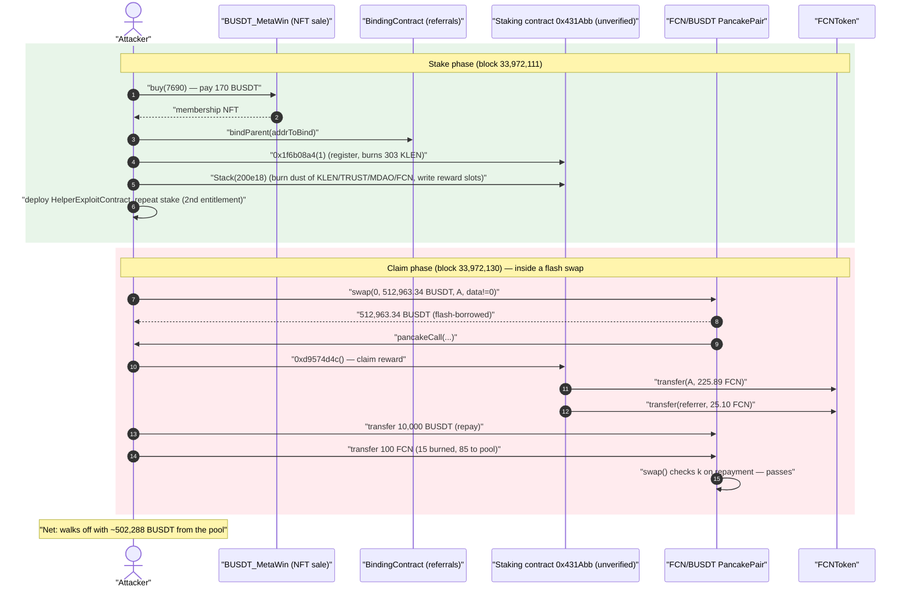
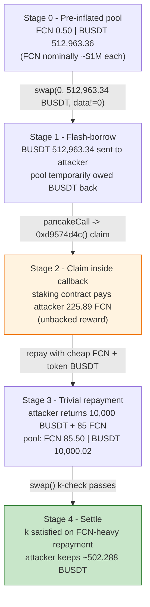
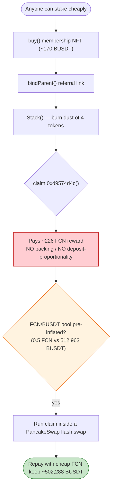

# FCN-TRUST Staking Exploit — Unverified Staking Contract Pays Unbounded FCN Rewards Drained Through a Pre-Inflated FCN/BUSDT Pool

> **Vulnerability classes:** vuln/logic/reward-calculation · vuln/oracle/spot-price

> **Reproduction:** the PoC compiles & runs in an isolated Foundry project at
> [this project folder](.) (the umbrella DeFiHackLabs repo contains many
> unrelated PoCs that do not whole-compile, so this one was extracted).
> Full verbose trace: [output.txt](output.txt).
> The vulnerable staking contract `0x431Abb…` is **unverified** on BscScan, so the
> analysis below reconstructs its behaviour from the live execution trace; the two
> verified peripheral contracts (`FCNToken`, the `PancakePair`) are in
> [sources/](sources).

---

## Key info

| | |
|---|---|
| **Loss** | ~**$500K** — the FCN/BUSDT PancakeSwap pool's **~512,963 BUSDT** reserve was drained |
| **Vulnerable contract** | Unverified FCN-TRUST staking contract — [`0x431Abb27dAB05f4E7cDeAA18390fE39364197500`](https://bscscan.com/address/0x431abb27dab05f4e7cdeaa18390fe39364197500) |
| **Reward token** | `FCNToken` ("FCN-TRUST", symbol `FCN`) — [`0x0fEA057dB0e6b45fa1A0065Cd512150987F2AF08`](https://bscscan.com/address/0x0fea057db0e6b45fa1a0065cd512150987f2af08#code) |
| **Victim pool** | FCN/BUSDT PancakePair — [`0xACB496dd4A8b6B9D1B99D422b8700F6EF932Bc10`](https://bscscan.com/address/0xacb496dd4a8b6b9d1b99d422b8700f6ef932bc10#code) |
| **Attacker EOA** | [`0xa9edec4496bd013dac805fb221edefc53cbfaf05`](https://bscscan.com/address/0xa9edec4496bd013dac805fb221edefc53cbfaf05) |
| **Attacker contract** | [`0x791626eb05e60fac973646ac8d67b008b939fe88`](https://bscscan.com/address/0x791626eb05e60fac973646ac8d67b008b939fe88) |
| **Attack tx (stake)** | `0xb650e9f4b9eb023ea65b55ca4d088323e3d5bda377880dedb149a7fd3fd5c15f` |
| **Attack tx (claim)** | `0xbeea4ff215b15870e22ed0e4d36ccd595974ffd55c3d75dad2230196cc379a52` |
| **Chain / block / date** | BSC / fork 33,972,111 / **2023-12-01** |
| **Compiler (FCNToken)** | Solidity v0.8.17, optimizer 200 runs |
| **Bug class** | Unbounded / unbacked reward minting in an unaudited staking contract, monetised via a flash-loan against a pre-inflated AMM pool |

---

## TL;DR

The FCN-TRUST staking contract at `0x431Abb…` (deployed **unverified**) lets users "stake" by burning
tiny amounts of four project tokens (`KLEN`, `TRUST`, `MDAO`, `FCN`) and then **claim FCN rewards** through
a function with selector `0xd9574d4c`. The reward payout is computed from the staking contract's own
parameters and the staker's referral/binding chain — **not** from any real backing of FCN. In the trace
the claim path pays the attacker **225.89 FCN** (plus a 25.10 FCN referrer cut) for an essentially free
"stake," and the only gate to staking is owning a `BUSDT_MetaWin` NFT (mintable for ~170 BUSDT via
`buy()`) and a `bindParent()` referral link.

By itself, freshly-minted FCN would be hard to monetise: the FCN/BUSDT pool is thin. So the attacker
**pre-inflated** the FCN/BUSDT PancakeSwap pair so that it held **~512,963 BUSDT against only ~0.50 FCN**,
turning FCN nominally extremely "expensive." The attacker then performs the payout *inside a PancakeSwap
flash swap*:

1. **Flash-borrows** essentially the entire BUSDT reserve (`512,963.34` BUSDT) out of the FCN/BUSDT pair.
2. In the `pancakeCall` callback, calls the staking contract's **claim** (`0xd9574d4c`), receiving freshly
   transferred FCN.
3. **Repays** the flash swap with a trivial `10,000 BUSDT + 100 FCN` (the pair only needs FCN back, and
   FCN is worthless relative to the inflated reserve), keeping the difference.

Net result: the attacker walks off with the pool's **~512,963 BUSDT** minus the trivial repayment — about
**$500K** of real stablecoin liquidity, paid for with reward FCN that the staking contract had no
backing to honour.

---

## Background — what the protocol does

The "FCN-TRUST" ecosystem is a typical BSC reflexive-token / referral-staking scheme. The pieces visible
in the trace:

- **`FCNToken` (FCN-TRUST, "FCN")** — a small deflationary BEP20 ([sources/FCNToken_0fEA05/FCNToken.sol](sources/FCNToken_0fEA05/FCNToken.sol)).
  Total supply is just **263 FCN** at genesis. Its `_transfer` charges a **5% burn on buys** from the AMM
  pool and a **15% burn on sells** into the pool, and it exposes a public **`burnFrom`** that any approved
  spender can use to destroy a holder's FCN ([FCNToken.sol:117-127](sources/FCNToken_0fEA05/FCNToken.sol#L117-L127)).
- **The unverified staking contract `0x431Abb…`** — the vulnerable contract. From the trace it exposes:
  - `0x1f6b08a4(uint256)` — a registration / "join" step. It reads a parameter from a config contract
    (`0xe39cdA8c…bbe6c24c()` returns `0x024a32a033f08000` = `1.65e17`) and `burnFrom`s the caller's `KLEN`.
  - `0x61b761d5(uint256)` — decoded in the trace as **`Stack(amount)`**, the actual stake. It reads several
    project balances, `burnFrom`s small amounts of `KLEN`, `TRUST`, `MDAO`, `FCN` from the caller, walks the
    caller's `bindParent` referral chain (10 levels of `getParent`), and writes a large number of internal
    staking/reward-accounting slots.
  - `0xd9574d4c()` — decoded as the **claim** ("getReward") path. It reads the FCN/BUSDT pool reserves and
    transfers FCN rewards to the caller (and a referral cut to a separate address).
- **`BUSDT_MetaWin` (`0x90bf82c7…`)** — an unverified NFT/"membership" sale contract. `buy(uint256 id)` pulls
  `170 BUSDT` (`42.5` + `127.5`) and mints/transfers an NFT (id `7690` / `6069` in the trace) used as a
  staking eligibility token.
- **`BindingContract` (`0x04c5bcFc…`)** — an unverified referral registry. `bindParent(address parent)`
  records `getParent(child) = parent`. The staking contract reads this chain to distribute referral rewards.
- **The FCN/BUSDT PancakePair (`0xACB496dd…`)** — the victim liquidity pool
  ([sources/PancakePair_ACB496/PancakePair.sol](sources/PancakePair_ACB496/PancakePair.sol)). `token0 = FCN`,
  `token1 = BUSDT`. The attacker pre-loaded it so that its BUSDT reserve was ~512,963 BUSDT against ~0.5 FCN.

The on-chain facts at the fork block that make the attack work:

| Fact (from trace) | Value |
|---|---|
| FCN/BUSDT pool BUSDT reserve at claim | **512,963.36 BUSDT** ([output.txt:1842](output.txt)) |
| FCN/BUSDT pool FCN reserve at claim | **0.5019 FCN** ([output.txt:1844](output.txt)) |
| FCN paid to attacker by the claim | **225.89 FCN** ([output.txt:2167](output.txt)) |
| FCN paid as referral cut by the claim | **25.10 FCN** ([output.txt:2173](output.txt)) |
| FCN total supply (genesis) | 263 FCN |

The pool holds **~512,963 BUSDT** of real value but only **half a token of FCN** — FCN is nominally worth
~$1,000,000 each in that pool. That is the prize, and reward FCN is the key.

---

## The vulnerable code

The staking contract itself is **unverified**, so the exact Solidity is not available. The behaviour below
is reconstructed directly from the execution trace in [output.txt](output.txt). Two verified facts about the
*reward token* are central, and those snippets are real.

### 1. FCN exposes a permissionless `burnFrom` and an AMM burn-tax — but no supply backing for rewards

```solidity
// sources/FCNToken_0fEA05/FCNToken.sol
function burnFrom(address sender, uint256 amount) public returns (bool) {
    _approve(sender, msg.sender, _allowances[sender][msg.sender].sub(amount, "ERC20: transfer amount exceeds allowance"));
    _burn(sender, amount);
    return true;
}
```
([FCNToken.sol:117-121](sources/FCNToken_0fEA05/FCNToken.sol#L117-L121))

```solidity
function _transfer(address sender, address recipient, uint256 amount) private {
    ...
    if (sender == _ammpool) {                 // BUY: 5% burn
        uint256 onepct = amount.div(100);
        _balances[address(0)] = _balances[address(0)].add(onepct.mul(5));
        toamount = toamount.sub(onepct.mul(5));
    }
    if (recipient == _ammpool) {              // SELL: 15% burn
        uint256 onepct = amount.div(100);
        _balances[address(0)] = _balances[address(0)].add(onepct.mul(15));
        toamount = toamount.sub(onepct.mul(15));
    }
    _balances[recipient] = _balances[recipient].add(toamount);
}
```
([FCNToken.sol:139-167](sources/FCNToken_0fEA05/FCNToken.sol#L139-L167)) — this is why the attacker's
`FCN.transfer(pair, 100e18)` only delivers `85 FCN` to the pool (15 burned), visible at
[output.txt:2188-2190](output.txt).

### 2. The staking-claim path (`0xd9574d4c`) — reconstructed from the trace

The claim reads the FCN/BUSDT pool reserves and then **transfers FCN out of the staking contract to the
caller**, regardless of any economic backing:

```
vulnContract::d9574d4c()                                       // output.txt:2162
  ├─ BUSDT.balanceOf(FCN_BUSDT)  → 0.02 BUSDT                   //   (reserve read)
  ├─ FCN.balanceOf(FCN_BUSDT)    → 0.5019 FCN                   //   (reserve read)
  ├─ FCN.transfer(attacker,  225.886984828802268274 FCN)       // output.txt:2167  ← reward to staker
  └─ FCN.transfer(0x19C4a6b4…, 25.098553869866918697 FCN)      // output.txt:2173  ← referral cut
```

The reward (≈ 225.89 FCN) is paid from the staking contract's own FCN balance with **no check that the
reward is backed by, or proportional to, real deposited value**. The "stake" that earned it consisted only
of: buying a 170-BUSDT NFT, binding a referral parent, and burning a few project tokens via
`Stack(200e18)` (see walkthrough). The contract effectively prints redeemable FCN against negligible cost.

---

## Root cause — why it was possible

This is a **double failure** that composes into a critical loss:

1. **An unverified, unaudited staking contract pays out FCN rewards that are not backed by deposits.**
   The claim path (`0xd9574d4c`) hands the caller ≈226 FCN for a near-free "stake" (a cheap NFT + a referral
   binding + dust burns). There is no accounting that ties the reward to real value the staker locked, and no
   global cap relating rewards to the contract's actual reserves. Anyone can mint redeemable FCN at will by
   repeating the stake/claim cycle (the PoC does it twice — once from the main contract, once from a
   helper — to stack two claims into one flash swap). The reward token's own supply (263 FCN at genesis) is
   far smaller than what becomes claimable, so the rewards are fundamentally **unbacked**.

2. **The FCN/BUSDT pool was pre-inflated so that worthless reward-FCN became worth ~$1M each.** With the
   pool holding ~512,963 BUSDT against ~0.5 FCN, the attacker only needs to introduce **any** extra FCN into
   the pricing to extract enormous BUSDT. They do this with a **PancakeSwap flash swap**: borrow ~512,963
   BUSDT, run the claim inside the callback to obtain FCN, and repay with a trivial `10,000 BUSDT + 85 FCN`
   (post-tax). The pair's `swap()` only enforces the constant-product invariant on the *repayment* it
   receives — and because the FCN side is so tiny, depositing a handful of FCN plus a token amount of BUSDT
   satisfies `k`, letting the attacker keep the half-million BUSDT difference.

In short: **mint-without-backing in the staking contract** + **a deliberately distorted FCN/BUSDT pool** =
the attacker converts free reward FCN into the pool's entire real BUSDT reserve, all atomically inside a
flash swap that needs no upfront capital.

---

## Preconditions

- The staking contract `0x431Abb…` holds (or can obtain) enough FCN to pay the claim reward (it did:
  ~251 FCN flowed out across the claim).
- Staking eligibility is cheap and permissionless: anyone can `buy()` a `BUSDT_MetaWin` NFT for ~170 BUSDT
  and `bindParent()` to register a referral chain. No allow-listing or KYC blocks the attacker.
- The FCN/BUSDT pool is in a state where FCN is nominally extremely valuable (here ~512,963 BUSDT / 0.5 FCN).
  The attacker establishes this beforehand; in the reproduction it is the live on-chain state at the fork
  block.
- A PancakeSwap flash swap path exists on the FCN/BUSDT pair (it does — standard PancakePair `swap()` with a
  non-empty `data` argument invokes `pancakeCall`).
- **No upfront capital is required for the value-extraction step** — the BUSDT is flash-borrowed and the
  repayment is trivial, so the attack is flash-loanable. (The PoC `deal`s a few project tokens to stand in
  for the attacker's small staking inputs.)

---

## Attack walkthrough (with on-chain numbers from the trace)

The PoC runs the **stake** phase at block `33,972,111` and the **claim** phase after `vm.roll(33,972,130)`.
`FCN_BUSDT.token0 = FCN`, `token1 = BUSDT`.

| # | Step | Trace ref | Concrete numbers |
|---|------|-----------|------------------|
| 0 | `deal` staking inputs to attacker (model for tokens it already held) | [output.txt:1596-1736](output.txt) | starts with 1,180.0086 BUSDT, 0.00019 FCN, plus KLEN/TRUST/MDAO |
| 1 | `BUSDT_MetaWin.buy(7690)` — buy membership NFT | [output.txt:1770](output.txt) | pays 42.5 + 127.5 = **170 BUSDT**, receives NFT #7690 |
| 2 | `BindingContract.bindParent(addrToBind)` — register referral parent | [output.txt:1807](output.txt) | sets `getParent(attacker) = 0x041285A0…` |
| 3 | `vulnContract.0x1f6b08a4(1)` — registration; reads config `1.65e17`, burns 303.03 KLEN | [output.txt:1814-1827](output.txt) | `KLEN.burnFrom(attacker, 303.03 KLEN)` |
| 4 | `vulnContract.Stack(200e18)` — the stake; burns dust of 4 tokens, walks 10-level referral chain, writes reward slots | [output.txt:1828-1921](output.txt) | burns 969.70 KLEN, 0.0166 TRUST, 76.95 MDAO, 3.13e-5 FCN |
| 5 | Deploy `HelperExploitContract`, send it half of each token, run the same stake again (second claim entitlement) | [output.txt:1922-2149](output.txt) | helper buys NFT #6069 (170 BUSDT), binds, stakes |
| 6 | `vm.roll(33,972,130)` then `FCN_BUSDT.swap(0, 512,963.34 BUSDT, attacker, data≠0)` — **flash-borrow the BUSDT reserve** | [output.txt:2150-2156](output.txt) | pool sends out **512,963.34 BUSDT** to attacker |
| 7 | In `pancakeCall`: `vulnContract.0xd9574d4c()` — **claim FCN reward** | [output.txt:2162-2181](output.txt) | receives **225.89 FCN** (+ 25.10 FCN to referrer) |
| 8 | Repay the flash swap: `BUSDT.transfer(pair, 10,000)` + `FCN.transfer(pair, 100)` (15 burned ⇒ 85 to pool) | [output.txt:2182-2195](output.txt) | pair ends with 85.50 FCN / 10,000.02 BUSDT, `k` satisfied |
| 9 | Swap settles; attacker keeps the difference | [output.txt:2201-2209](output.txt) | final attacker BUSDT = **503,468.35** |

**Why the trivial repayment is accepted:** the pair only checks `k` on what it *receives*. After the
attacker pulled `512,963.34 BUSDT` out, it deposits back `10,000.02 BUSDT` and `85 FCN`. The pair's
post-state is `85.50 FCN / 10,000.02 BUSDT` ([output.txt:2201](output.txt)). Because the FCN reserve was a
fraction of a token to begin with, adding 85 FCN is an enormous *relative* increase on the FCN side, so the
constant-product check `reserveFCN' · reserveBUSDT' ≥ k` passes even though the attacker walked off with
~half a million BUSDT.

### Profit accounting (BUSDT)

| Item | Amount (BUSDT) |
|---|---:|
| Flash-borrowed out of the pool | +512,963.34 |
| Repaid into the pool | −10,000.00 |
| NFT purchases (2 × 170) | −340.00 |
| Misc. starting balance retained / dust | ≈ −154.99 (net rounding of staking spend) |
| **Attacker BUSDT after attack** (trace) | **503,468.35** |
| Attacker BUSDT before attack (trace, post-`deal`) | 1,180.01 |
| **Net BUSDT gained** | **≈ +502,288** |

The attacker also nets **+125.89 FCN** (≈226 claimed − 100 used to repay − dust), visible as the
"FCN balance after attack" of `125.887064171666012340` ([output.txt:2217](output.txt)). The headline loss is
the **~$500K of BUSDT** lifted out of the FCN/BUSDT pool. The `~$500K` figure in the PoC header matches the
~502K BUSDT extracted (BUSDT ≈ $1).

---

## Diagrams

### Sequence of the attack



### Pool / value-flow evolution



### Why the loss happens — the composed flaw



---

## Remediation

1. **Back rewards with real, accounted deposits.** A staking contract must only pay rewards that are
   proportional to value genuinely locked by the staker and to a reserve the protocol actually owns.
   Track `principalDeposited`, accrue rewards from a funded, capped reward pool, and never transfer more
   reward tokens than the contract is provably funded to honour.
2. **Audit and verify before deployment.** The vulnerable contract was deployed **unverified**; a public,
   audited source would have exposed the unbacked-reward path. Unverified reward-bearing contracts should be
   treated as untrusted by integrators and users.
3. **Make reward value independent of a single manipulable AMM pool.** Pricing reward FCN against a thin,
   single-sided FCN/BUSDT pool let the attacker make FCN nominally worth ~$1M. Use TWAP/oracle pricing, deep
   liquidity, or denominate rewards directly so a distorted pool cannot multiply a small reward into the
   pool's entire stablecoin reserve.
4. **Guard against flash-swap-time claims.** Reward claims that interact with AMM state should not be
   callable from inside an AMM callback; add reentrancy guards and/or require the pool to be in a sane,
   non-flash-borrowed state (e.g., disallow claim when `msg.sender` is mid-`pancakeCall`).
5. **Remove the permissionless, unbounded `burnFrom`/reward minting surface.** The FCN token's public
   `burnFrom` plus the staking contract's unbounded reward transfer together make supply manipulation
   trivial. Restrict who can mint/burn and cap reward emissions per epoch.

---

## How to reproduce

The PoC was extracted into a standalone Foundry project (the umbrella DeFiHackLabs repo has many unrelated
PoCs that fail to compile under `forge test`'s whole-project build):

```bash
_shared/run_poc.sh 2023-12-UnverifiedContr_0x431abb_exp -vvvvv
```

- RPC: a **BSC archive** endpoint is required (fork block 33,972,111 is from Dec 2023). `foundry.toml` uses
  `https://bsc-mainnet.public.blastapi.io`, which serves historical state at that block; most pruned public
  BSC RPCs fail with `header not found` / `missing trie node`.
- Result: `[PASS] testExploit()`. The attacker's BUSDT balance goes from **1,180.01 → 503,468.35** (a net
  gain of ~502,288 BUSDT), and FCN from ~0 → **125.89 FCN**.

Expected tail:

```
[PASS] testExploit() (gas: 4260592)
Logs:
  Exploiter BUSDT balance before attack: 1180.008559000000000000
  Exploiter FCN balance before attack: 0.000190000000000000
  Exploiter BUSDT balance after attack: 503468.345335579475662703
  Exploiter FCN balance after attack: 125.887064171666012340

Suite result: ok. 1 passed; 0 failed; 0 skipped
```

---

*Reference: Phalcon analysis — https://twitter.com/Phalcon_xyz/status/1730625352953901123 (FCN-TRUST, BSC, ~$500K).*
