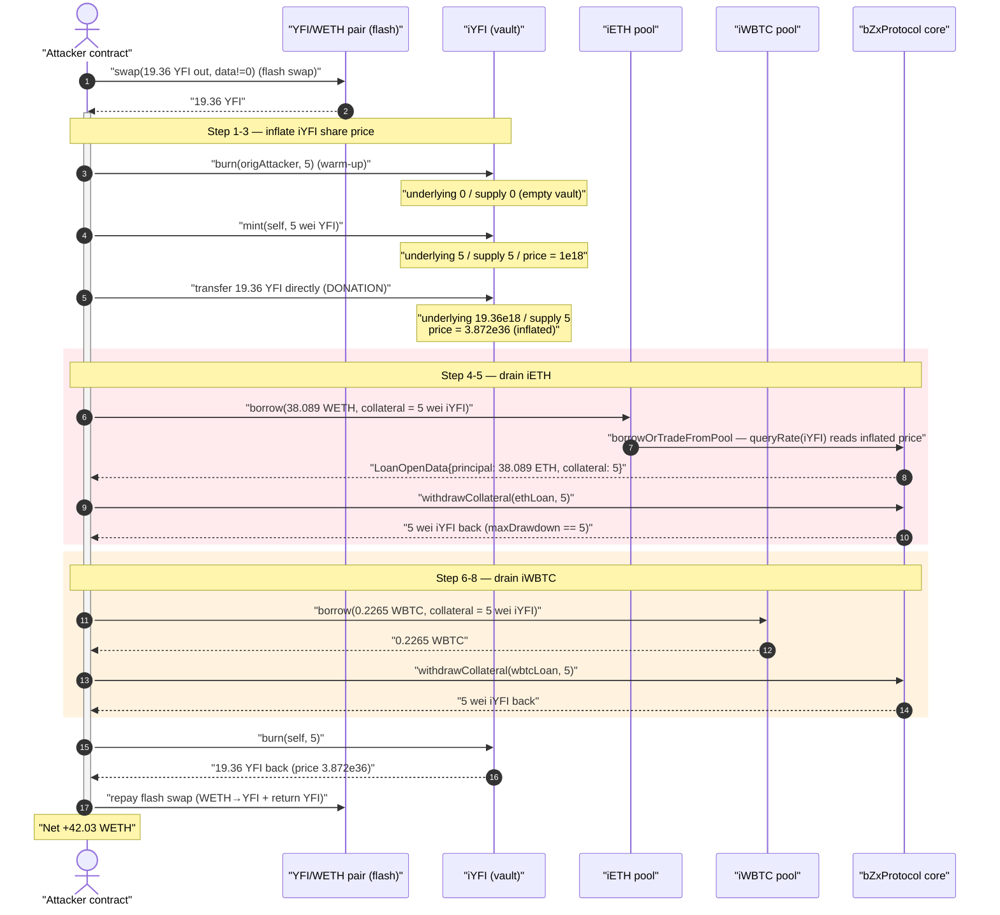
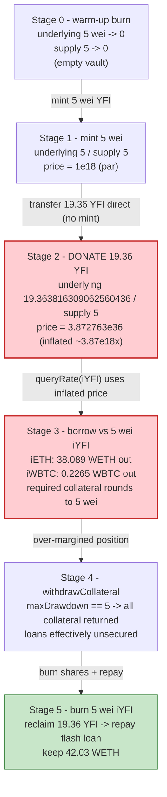
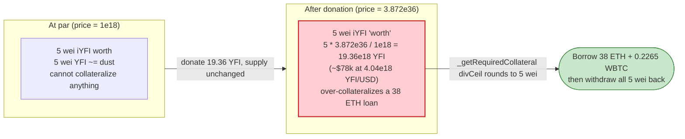

# bZx / Fulcrum `iToken` Exploit — Empty-Pool Share-Price Inflation (ERC4626-style Donation Attack)

> **Vulnerability classes:** vuln/arithmetic/rounding · vuln/logic/state-update

> **Reproduction:** the PoC compiles & runs in an isolated Foundry project at
> [this project folder](.) (the umbrella DeFiHackLabs repo contains many
> unrelated PoCs that do not whole-compile, so this one was extracted).
> Full verbose trace: [output.txt](output.txt).
> Verified vulnerable source (iToken logic):
> [LoanTokenLogicStandard.sol](sources/LoanTokenLogicWeth_9712dC/LoanTokenLogicStandard.sol).

---

## Key info

| | |
|---|---|
| **Loss** | ~$208K — drained the `iETH`, `iWBTC` (and other) Fulcrum lending pools |
| **Vulnerable contract** | `iYFI` iToken (`LoanToken` proxy → `LoanTokenLogicStandard` logic) — [`0x7F3Fe9D492A9a60aEBb06d82cBa23c6F32CAd10b`](https://etherscan.io/address/0x7f3fe9d492a9a60aebb06d82cba23c6f32cad10b#code) |
| **Logic implementation** | `LoanTokenLogicWeth` / `LoanTokenLogicStandard` — [`0x9712dC729916e154Daa327C36ad1b9f8E069fBA1`](https://etherscan.io/address/0x9712dC729916e154Daa327C36ad1b9f8E069fBA1#code) |
| **Drained pools** | `iETH` [`0xB983E01458529665007fF7E0CDdeCDB74B967Eb6`](https://etherscan.io/address/0xB983E01458529665007fF7E0CDdeCDB74B967Eb6), `iWBTC` [`0x2ffa85f655752fB2aCB210287c60b9ef335f5b6E`](https://etherscan.io/address/0x2ffa85f655752fB2aCB210287c60b9ef335f5b6E) |
| **bZx protocol core** | `bZxProtocol` [`0xD8Ee69652E4e4838f2531732a46d1f7F584F0b7f`](https://etherscan.io/address/0xD8Ee69652E4e4838f2531732a46d1f7F584F0b7f) (delegates to `LoanOpenings` / `LoanMaintenance`) |
| **Attacker EOA** | [`0x5a7c7eb8d13a53d42a15d2b1d1b694ccc5141ea5`](https://etherscan.io/address/0x5a7c7eb8d13a53d42a15d2b1d1b694ccc5141ea5) |
| **Attacker contract** | [`0x03b7Bb750A974e0BD34795013F66B669f4110e54`](https://etherscan.io/address/0x03b7bb750a974e0bd34795013f66b669f4110e54) |
| **Attack tx 1** | `0x0fc5c0d41e5506fdb9434fab4815a4ff671afc834e47a533b3bed7182ece73b0` |
| **Attack tx 2** | `0xb072f2e88058c147d8ff643694b43a42e36525b7173ce1daf76e6c06170b0e77` |
| **Chain / block / date** | Ethereum mainnet / 18,695,728 / Dec 1, 2023 |
| **Compiler** | iToken logic Solidity v0.5.17; PoC v0.8.10 (fork `evm_version = cancun`) |
| **Bug class** | Empty-vault share-price inflation via direct asset donation (ERC4626-style first-depositor / rounding attack) |

---

## TL;DR

A Fulcrum `iToken` is a yield-bearing lending share, priced as
`tokenPrice = underlyingHeld * 1e18 / totalSupply`
([LoanTokenLogicStandard.sol:848-860](sources/LoanTokenLogicWeth_9712dC/LoanTokenLogicStandard.sol#L848)).
When `totalSupply` and the underlying balance are tiny, an attacker can mint a
few wei of shares, then **donate** a large amount of the underlying directly to
the iToken contract. The share price explodes — in this attack one share went
from `1e18` to **`3.872e36`** (a ~3.8 billion× inflation).

bZx denominates loan collateral in the *collateral token* (here `iYFI`) and
converts it through `IPriceFeeds.queryRate`, which for an iToken reads exactly
that inflated `tokenPrice`. So **5 wei of `iYFI` is now "worth" enough to
collateralize an entire lending pool's reserves.** The attacker:

1. Flash-borrows `~19.36 YFI` from the SushiSwap-style `YFI/WETH` pair.
2. Burns the attack-contract's pre-existing `5` wei `iYFI`, emptying the `iYFI`
   pool to `0` underlying / `0` shares (a clean "first depositor" state).
3. Mints `5` wei `iYFI` for `5` wei `YFI` (price = `1e18`), then **donates** all
   `19.36 YFI` straight into the `iYFI` contract — inflating its share price to
   `3.872e36`.
4. Opens loans against the now-overvalued `5` wei `iYFI` collateral, borrowing
   **38.09 WETH** out of `iETH` and **0.2265 WBTC** out of `iWBTC`.
5. Because the collateral is so over-valued, `withdrawCollateral` returns all
   `5` wei `iYFI` back to the attacker (`maxDrawdown == full collateral`), then
   the attacker burns those `5` wei to reclaim the donated `19.36 YFI`.
6. Repays the YFI flash loan and keeps the borrowed ETH + WBTC.

The single PoC tx nets the attacker **~42.03 WETH** of profit (the borrowed ETH
plus the WBTC swapped to WETH, minus the YFI flash-loan repayment). The real
incident repeated this across multiple iToken pools for a total of ~$208K.

---

## Background — what a Fulcrum iToken is

bZx's Fulcrum product issues `iTokens` (`iETH`, `iWBTC`, `iYFI`, …). An iToken
is a lending-pool share: you `mint` it by depositing the underlying asset, you
`burn` it to redeem the underlying plus accrued interest, and the underlying is
lent out to margin-traders/borrowers via the shared `bZxProtocol` core.

The iToken contract ([`0x7F3Fe9…`](sources/LoanToken_7F3Fe9)) is a thin proxy
that `delegatecall`s into `LoanTokenLogicWeth` /
`LoanTokenLogicStandard` ([`0x9712dC…`](sources/LoanTokenLogicWeth_9712dC/LoanTokenLogicStandard.sol)).
Borrowing happens by calling `iToken.borrow(...)`, which forwards into the
bZx core's `LoanOpenings.borrowOrTradeFromPool`
([LoanOpenings.sol:34](sources/LoanOpenings_F426F2/LoanOpenings.sol#L34));
collateral is later released through `bZxProtocol.withdrawCollateral`
→ `LoanMaintenance.withdrawCollateral`
([LoanMaintenance.sol:104](sources/LoanMaintenance_91fcdb/LoanMaintenance.sol#L104)).

The exact iToken state at the fork block, observed in the trace, is what makes
the attack work:

| Fact (from trace) | Value |
|---|---|
| `iYFI` underlying held (`YFI.balanceOf(iYFI)`) before attack | dust (`5` wei after the warm-up burn) |
| `iYFI.totalSupply()` after the burn | **0** |
| Attacker's pre-positioned `iYFI` balance | **5** wei |
| `iETH` redeemable WETH reserve | **38.089742649328258427** WETH |
| `iWBTC` redeemable WBTC reserve | **0.22651422** WBTC (`22,651,422` sats) |
| Chainlink YFI/USD used by price feed | `4044382180629397000` (`4.04e18`) |

The whole exploit hinges on the iToken pool being reducible to an essentially
empty vault (`totalSupply ≈ 0`, underlying ≈ 0), at which point its share price
is attacker-controllable by donation.

---

## The vulnerable code

### 1. Share price is `underlying / supply`, with no virtual offset

```solidity
// LoanTokenLogicStandard.sol
function _tokenPrice(uint256 assetSupply) internal view returns (uint256) {
    uint256 totalTokenSupply = _totalSupply;
    return totalTokenSupply != 0 ?
        assetSupply
            .mul(WEI_PRECISION)        // * 1e18
            .div(totalTokenSupply)     // / totalSupply
        : initialPrice;                // 1e18 when supply == 0
}
```
([LoanTokenLogicStandard.sol:848-860](sources/LoanTokenLogicWeth_9712dC/LoanTokenLogicStandard.sol#L848))

`assetSupply` comes from `_totalAssetSupply`, which is just the contract's raw
underlying balance plus outstanding borrows
([:885-896](sources/LoanTokenLogicWeth_9712dC/LoanTokenLogicStandard.sol#L885)).
A raw `transfer` of the underlying token into the contract increases
`assetSupply` **with no corresponding `totalSupply` increase** — the classic
ERC4626 donation hole. There is no minimum supply, no dead-shares lock, and no
virtual-asset/virtual-share offset.

### 2. `mint` / `burn` round shares against price with no protection

```solidity
function _mintToken(address receiver, uint256 depositAmount) internal ... {
    require (depositAmount != 0, "17");
    _settleInterest(0);
    uint256 currentPrice = _tokenPrice(_totalAssetSupply(_totalAssetBorrowStored()));
    mintAmount = depositAmount.mul(WEI_PRECISION).div(currentPrice);  // deposit * 1e18 / price
    ...
    _mint(receiver, mintAmount);
}

function _burnToken(uint256 burnAmount) internal ... {
    ...
    uint256 currentPrice = _tokenPrice(_totalAssetSupply(_totalAssetBorrowStored()));
    uint256 loanAmountOwed = burnAmount.mul(currentPrice).div(WEI_PRECISION); // burn * price / 1e18
    ...
}
```
([_mintToken :378-403](sources/LoanTokenLogicWeth_9712dC/LoanTokenLogicStandard.sol#L378),
[_burnToken :405-431](sources/LoanTokenLogicWeth_9712dC/LoanTokenLogicStandard.sol#L405))

Mint at price `1e18` gives `5 → 5` shares; after a `19.36e18` donation the price
is `3.872e36`, so burning those same `5` shares pays back
`5 * 3.872e36 / 1e18 = 19.36e18` — the full donation, recovered intact.

### 3. Loan collateral is valued through the same inflated iToken price

```solidity
// LoanOpenings.sol
function _getRequiredCollateral(
    address loanToken, address collateralToken,
    uint256 newPrincipal, uint256 marginAmount, bool isTorqueLoan
) internal view returns (uint256 collateralTokenAmount) {
    if (loanToken == collateralToken) {
        collateralTokenAmount = newPrincipal.mul(marginAmount).divCeil(WEI_PERCENT_PRECISION);
    } else {
        (uint256 sourceToDestRate, uint256 sourceToDestPrecision) =
            IPriceFeeds(priceFeeds).queryRate(collateralToken, loanToken);   // queries iYFI price!
        if (sourceToDestRate != 0) {
            collateralTokenAmount = newPrincipal
                .mul(sourceToDestPrecision)
                .mul(marginAmount)
                .divCeil(sourceToDestRate * WEI_PERCENT_PRECISION);          // huge rate ⇒ ≈ 0 → rounds to dust
        }
    }
    ...
}
```
([LoanOpenings.sol:464-483](sources/LoanOpenings_F426F2/LoanOpenings.sol#L464))

With `collateralToken = iYFI` and its price inflated to `3.872e36`, `queryRate`
returns a gigantic `sourceToDestRate`, so the required collateral for borrowing
the entire `iETH` pool divides down to just **`5` wei of `iYFI`**. The trace
shows the loan opening as `LoanOpenData({ principal: 38.089 ETH, collateral: 5 })`.

### 4. The over-valued collateral can be fully withdrawn again

```solidity
// LoanMaintenance.sol
function withdrawCollateral(bytes32 loanId, address receiver, uint256 withdrawAmount)
    external nonReentrant pausable returns (uint256 actualWithdrawAmount)
{
    ...
    uint256 maxDrawdown = IPriceFeeds(priceFeeds).getMaxDrawdown(
        loanParamsLocal.loanToken, collateralToken,
        loanLocal.principal, collateral, loanParamsLocal.maintenanceMargin
    );
    if (withdrawAmount > maxDrawdown) actualWithdrawAmount = maxDrawdown;
    else                              actualWithdrawAmount = withdrawAmount;
    collateral = collateral.sub(actualWithdrawAmount, "withdrawAmount too high");
    loanLocal.collateral = collateral;
    ...
}
```
([LoanMaintenance.sol:104-156](sources/LoanMaintenance_91fcdb/LoanMaintenance.sol#L104))

Because the `5` wei `iYFI` is "worth" billions of times the loan, the position
is wildly over-margined, so `getMaxDrawdown` returns the **entire `5` wei**
(trace: `getMaxDrawdown(...) → 5`). The attacker withdraws all collateral while
keeping the borrowed assets.

---

## Root cause — why it was possible

The fundamental flaw is the **unbounded, donation-manipulable iToken share
price** combined with **using that same price to value loan collateral**:

1. **No virtual-share / dead-share protection on the vault.** `_tokenPrice =
   underlying * 1e18 / totalSupply` can be inflated arbitrarily by transferring
   the underlying directly into the contract — `totalSupply` does not move. This
   is the textbook ERC4626 first-depositor / donation attack. The bZx code
   predates the now-standard mitigation (OpenZeppelin's virtual offset / minimum
   liquidity lock).
2. **The pool could be reduced to an empty-vault state.** The attacker held a
   tiny `5`-wei share position from before; burning it brought `totalSupply` and
   underlying to `0`, giving a clean, fully-controllable starting point.
3. **Collateral is denominated in the collateral *token* and priced via that
   token's own (manipulable) iToken price.** `_getRequiredCollateral` and
   `getMaxDrawdown` both call `IPriceFeeds.queryRate(iYFI, loanToken)`, which
   internally reads `iYFI.tokenPrice()`. Inflating the iYFI price simultaneously
   (a) shrinks the collateral *required* to open a loan to dust, and (b) inflates
   the collateral *value* so all of it can be withdrawn afterwards.
4. **Integer rounding in `divCeil` collapses the required collateral to `5` wei.**
   Even `divCeil` rounds up only to `5` because the inflated rate makes the true
   value sub-wei; `5` wei iYFI fully covers an `38` ETH loan.

In short: a vault-pricing rounding bug (donation inflation) is laundered through
the lending protocol's collateral valuation, turning "shares I can make worth
anything" into "loans collateralized by nothing."

---

## Preconditions

- The targeted iToken pool must be reducible to an empty / near-empty vault
  (`totalSupply ≈ 0`, underlying ≈ 0). The attacker achieved this by pre-holding
  a `5`-wei `iYFI` position and burning it — see the warm-up `burn` at
  [test/bZx_exp.sol:103](test/bZx_exp.sol#L103).
- Enough of the underlying (`YFI`) to donate and inflate the price. The PoC
  sources this from a **flash swap** of the `YFI/WETH` pair
  ([test/bZx_exp.sol:91-94](test/bZx_exp.sol#L91)), so no upfront capital is
  required.
- The lending pools (`iETH`, `iWBTC`) must hold redeemable reserves to borrow
  out — `38.089 WETH` and `0.2265 WBTC` here.
- `iYFI` is an accepted collateral token in the bZx protocol with a loan-pricing
  path through `IPriceFeeds.queryRate` that reads the iToken's own `tokenPrice`.

---

## Attack walkthrough (with on-chain numbers from the trace)

All figures below are taken directly from [output.txt](output.txt). The PoC
reproduces "attack tx 1" (the iYFI-collateralized ETH+WBTC drain).

| # | Step | iYFI underlying (YFI) | iYFI totalSupply | iYFI price | Effect |
|---|------|----------------------:|-----------------:|-----------:|--------|
| 0 | **Flash-swap** `19.363816309062560431` YFI from `YFI/WETH` pair (10% of its `193.638…` YFI reserve) | — | — | — | Free working capital, repaid at end. |
| 1 | **Burn** attacker's pre-held `5` wei `iYFI` (via `vm.prank(origAttacker)`) | 5 → 0 | 5 → **0** | — | Pool emptied to a clean first-depositor state. |
| 2 | **Mint** `5` wei `iYFI` for `5` wei `YFI` | 0 → 5 | 0 → 5 | `1e18` | Attacker holds `5` wei shares at par. |
| 3 | **Donate** `19.363816309062560431` YFI directly to `iYFI` | 5 → **19.363816309062560436** | 5 | **`3.872763…e36`** | Share price inflated ~3.8e18× / ~3.87 billion× over par. |
| 4 | **Borrow** ETH: `iETH.borrow(principal = 38.089742649328258427 WETH, collateral = 5 wei iYFI)` | — | — | `3.872e36` | Loan opens; `LoanOpenData.collateral == 5`. Unwrapped to ETH and rewrapped to WETH. |
| 5 | **withdrawCollateral(ETH loan)** → returns all `5` wei `iYFI` (`maxDrawdown == 5`) | — | — | — | Collateral reclaimed; ETH loan effectively unsecured. |
| 6 | **Borrow** WBTC: `iWBTC.borrow(principal = 22,651,422 sats, collateral = 5 wei iYFI)` | — | — | `3.872e36` | Drains the entire `iWBTC` reserve. |
| 7 | **Swap** `0.22651422` WBTC → `4.175637839221447271` WETH (SushiSwap) | — | — | — | WBTC monetized to WETH. |
| 8 | **withdrawCollateral(WBTC loan)** → returns the `5` wei `iYFI` again | — | — | — | Collateral reclaimed again. |
| 9 | **Burn** `5` wei `iYFI` → `19.363816309062560436` YFI back (`price 3.872e36`) | 19.36 → 0 | 5 → 0 | — | Donated YFI fully recovered. |
| 10 | **Repay** flash loan: swap WETH → exact YFI and return `19.422…` YFI to the pair | — | — | — | Flash swap closed. |

Net at the end of `uniswapV2Call`, the attack contract holds the borrowed ETH +
the WETH from the WBTC swap, minus the WETH spent to buy back YFI for flash-loan
repayment.

### Profit accounting (WETH)

| Direction | Amount (WETH) |
|---|---:|
| Borrowed ETH from `iETH` (wrapped to WETH) | +38.089742649328258427 |
| WBTC drained → swapped to WETH | +4.175637839221447271 |
| **Gross before flash-loan repay** | **+42.265380488549705698** |
| WETH spent to buy back YFI for flash-loan repayment (`swapTokensForExactTokens`) | −0.238171969558556942 |
| **Net WETH balance after attack** | **42.027208518991148756** |

Logged in the trace:

```
Exploiter WETH balance before attack: 0.000000000000000000
Total underlying assets in the pool before deposit/mint: 0
Total shares before deposit/mint: 0
Total underlying assets in the pool after deposit/mint: 5
Total shares after deposit/mint: 5
Exploiter shares: 5
Exploiter WETH balance after attack: 42.027208518991148756
```

This PoC tx alone nets **~42.03 WETH** (≈ $94K at the time). The real incident
repeated the pattern across several iToken pools for a total reported loss of
**~$208K**.

---

## Diagrams

### Sequence of the attack



### Vault state evolution (iYFI)



### Why 5 wei collateralizes 38 ETH



---

## Remediation

1. **Add virtual-share / virtual-asset offset to iToken pricing** (the modern
   ERC4626 standard fix). Computing `tokenPrice` as
   `(underlying + 1) * 1e18 / (totalSupply + virtualShares)` makes donation
   inflation economically infeasible — the attacker would have to donate orders
   of magnitude more than they could ever recover.
2. **Lock minimum / dead shares on first deposit.** Permanently burn a small,
   fixed number of shares to a dead address when a pool is initialized, so
   `totalSupply` can never be driven to a manipulable near-zero value.
3. **Do not value loan collateral via a manipulable, single-pool share price.**
   `IPriceFeeds.queryRate` for an iToken should derive value from the *underlying*
   asset's external oracle (Chainlink) times a **conservative, bounded**
   share-to-underlying ratio, not the raw `underlying/supply` that any donor can
   move. Apply sanity bounds: reject quotes that imply a share price far from its
   historical/TWAP value.
4. **Track deposited underlying internally instead of using `balanceOf(this)`.**
   `_totalAssetSupply` reading the raw token balance is what makes donation
   "count" toward the price. Using an internal accounting variable that only
   changes on `mint`/`burn`/interest accrual closes the donation channel.
5. **Enforce a minimum collateral amount per loan** and reject loans where the
   computed `collateralAmountRequired` rounds to dust relative to the principal.

---

## How to reproduce

The PoC was extracted into a standalone Foundry project (the umbrella
DeFiHackLabs repo has many unrelated PoCs that fail to whole-compile under
`forge test`):

```bash
_shared/run_poc.sh 2023-12-bZx_exp -vvvvv
```

- RPC: an **Ethereum mainnet archive** endpoint is required (fork block
  18,695,728). `foundry.toml` uses an Infura archive endpoint; the original
  pinned mainnet key returned HTTP 401 and was rotated to a working Infura key.
- Result: `[PASS] testExploit()` with final
  `Exploiter WETH balance after attack: 42.027208518991148756`.

Expected tail:

```
Ran 1 test for test/bZx_exp.sol:ContractTest
[PASS] testExploit() (gas: 2690446)
  Exploiter WETH balance before attack: 0.000000000000000000
  ...
  Exploiter WETH balance after attack: 42.027208518991148756
Suite result: ok. 1 passed; 0 failed; 0 skipped
```

---

*References: PoC header (DeFiHackLabs `src/test/2023-12/bZx_exp.sol`);
post-mortem — https://x.com/MetaSec_xyz/status/1730811240942088263 ;
verified sources under [sources/](sources/).*
