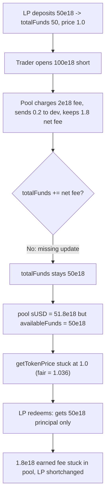

# Polynomial Protocol — missing totalFunds update in LiquidityPool.openShort shortchanges LP holders

> **Vulnerability classes:** vuln/accounting/fee-accounting · vuln/logic/missing-state-update · vuln/loss-of-funds/direct-drain

> **Reproduction:** a self-contained Foundry PoC that compiles & runs in an
> isolated project with **only `forge-std`** — no fork, no RPC, no `anvil_state`.
> Full trace: [output.txt](output.txt). PoC:
> [test/20230-h-07-missing-totalfunds-update-in-liquiditypools-openshort-c_exp.sol](test/20230-h-07-missing-totalfunds-update-in-liquiditypools-openshort-c_exp.sol).

<!-- non-defihacklabs -->
<!-- source-auditvault: https://github.com/Auditware/AuditVault/blob/main/findings/20230-h-07-missing-totalfunds-update-in-liquiditypools-openshort-c.md -->
<!-- date: 2023-03 -->

---

## Key info

| | |
|---|---|
| **Impact** | **HIGH** — openShort earns the pool a net trading fee it keeps as sUSD but never credits to totalFunds, so LP token price is under-stated and LP holders never receive the fee revenue they earned |
| **Protocol** | Polynomial Protocol — LiquidityPool |
| **Vulnerable code** | `LiquidityPool.openShort` — retains the net fee but is missing `totalFunds += feesCollected - externalFee;` |
| **Bug class** | Missing state update: earned revenue not reflected in fund accounting |
| **Finding** | Code4rena — Polynomial Protocol, 2023-03 · #20230 · reporter **auditor0517** |
| **Report** | [code4rena.com/reports/2023-03-polynomial](https://code4rena.com/reports/2023-03-polynomial) |
| **Source** | [AuditVault](https://github.com/Auditware/AuditVault/blob/main/findings/20230-h-07-missing-totalfunds-update-in-liquiditypools-openshort-c.md) |
| **Status** | Audit finding — disputed then confirmed by the sponsor, judged HIGH (loss of funds for users). Reproduced here as a standalone local PoC. |
| **Compiler** | `^0.8.24` (PoC) |

This is an **audit finding**, not a historical on-chain incident. The upstream
Code4rena source repo has been taken down, so the reduced PoC preserves the
vulnerable `openShort` fee handling verbatim and models the LiquidityPool's
fund/price accounting minimally (the short's principal is value-neutral at
open) so the "LP token value lost" harm becomes a checkable shortfall.

---

## TL;DR

1. `openShort` charges the trader a fee by paying out only
   `totalCost = tradeCost - fees`, so the pool keeps the fee.
2. Of that fee, `externalFee` goes to the dev/hedge and the remainder
   (`feesCollected - externalFee`) is the pool's earned revenue for LPs.
3. `openShort` is **missing** `totalFunds += feesCollected - externalFee;`, so
   `totalFunds` — which drives `getTokenPrice` — never grows with the fee.
4. The pool's real sUSD balance rises by the net fee while its accounting does
   not. `availableFunds` understates the balance and the LP token price is
   depressed. LP holders never receive the fee they earned.
5. In the PoC an LP deposits `50e18`; a short earns the pool a `1.8e18` net fee;
   the LP redeems and gets back only its `50e18` principal — the `1.8e18` fee is
   stuck, uncredited, in the pool.

---

## The vulnerable code

`LiquidityPool.openShort` — the trader pays the fee via a deduction of tradeCost
(verbatim), and the net fee is kept but never booked:

```solidity
totalCost = tradeCost - fees;
SUSD.safeTransfer(user, totalCost); // @> pool retains (feesCollected - externalFee) here
// MISSING: totalFunds += feesCollected - externalFee;
```

---

## Root cause

`openShort` performs the cash side of collecting a fee (it keeps sUSD) but omits
the accounting side (`totalFunds += net fee`). `totalFunds` is the input to
`getTokenPrice`, so the LP token price ignores the earned fee. The revenue sits
in the contract's balance, invisible to and unclaimable by the LP holders whose
capital backed the trade.

## Preconditions

- Any short is opened (a normal, permissionless trader action). Each open leaves
  another slice of net fee uncredited.

## Attack walkthrough

From [output.txt](output.txt):

1. An LP deposits `50e18`; `totalFunds = 50e18`, price `1e18`, pool holds
   `50e18` sUSD.
2. A trader opens a `100e18` short. The pool charges `2e18` fees, forwards
   `0.2e18` to the dev, and keeps the `1.8e18` net fee — but `totalFunds` stays
   `50e18` (the missing update).
3. **HARM (accounting):** the pool now holds `51.8e18` sUSD while
   `availableFunds = totalFunds - usedFunds = 50e18`; the accounting understates
   the balance by exactly the `1.8e18` net fee. `getTokenPrice` stays at `1e18`
   instead of rising to `(50+1.8)/50`.
4. **HARM (loss):** the LP redeems and receives only its `50e18` principal — not
   the `1.8e18` fee it earned. The net fee remains locked in the pool with no LP
   tokens left to claim it.

## Diagrams



## Impact

Every short opened credits the pool with a net fee that is never distributed to
LP holders: their token price is depressed and, on redemption, they receive less
than the fee-inclusive value their capital earned. Over many trades this is a
persistent, compounding loss of LP token value. The judge kept it HIGH as a loss
of funds for users.

## Remediation

Book the earned fee:

```diff
     totalCost = tradeCost - fees;
     SUSD.safeTransfer(user, totalCost);
+    totalFunds += feesCollected - externalFee;
```

## How to reproduce

```bash
cd ~/RustroverProjects/audits/evm-hack-registry/20230-h-07-missing-totalfunds-update-in-liquiditypools-openshort-c_exp
forge test -vvv
# Fully local — no fork, no RPC, no anvil_state required.
# Expected: test_missingTotalFundsUpdate PASSES (LP redeems only its 50e18
# principal; the 1.8e18 net fee is stuck in the pool).
```

PoC source: [test/20230-h-07-missing-totalfunds-update-in-liquiditypools-openshort-c_exp.sol](test/20230-h-07-missing-totalfunds-update-in-liquiditypools-openshort-c_exp.sol)
— drives the verbatim vulnerable `openShort` fee handling and re-asserts the LP
shortfall.

> Note: the short principal is modeled as value-neutral at open (collateral
> offsets the obligation) and getTokenPrice is a reduced form of the pool's price
> function; both isolate the fee-accounting bug. The vulnerable `openShort` fee
> handling and the missing `totalFunds += feesCollected - externalFee` update are
> faithful, as is the "LP never receives the earned fee" harm.

---

## Sources

- **AuditVault finding:** [20230-h-07-missing-totalfunds-update-in-liquiditypools-openshort-c.md](https://github.com/Auditware/AuditVault/blob/main/findings/20230-h-07-missing-totalfunds-update-in-liquiditypools-openshort-c.md)
- **Contest report:** [Code4rena — Polynomial Protocol (2023-03)](https://code4rena.com/reports/2023-03-polynomial)
- **Reduced-source provenance:** vulnerable `LiquidityPool.openShort` fee
  handling (`totalCost = tradeCost - fees; SUSD.safeTransfer(user, totalCost);`)
  and the recommended `totalFunds += feesCollected - externalFee;` fix
  reconstructed verbatim from the AuditVault finding and the merged contest
  report `code-423n4/2023-03-polynomial-findings@main`. The original contest
  source repo `code-423n4/2023-03-polynomial` has been taken down.
