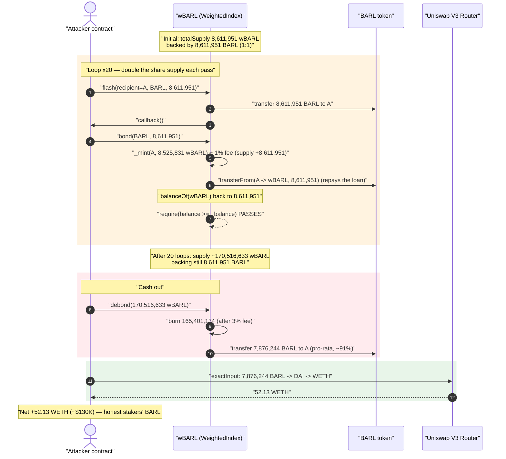
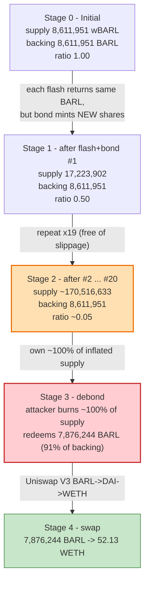
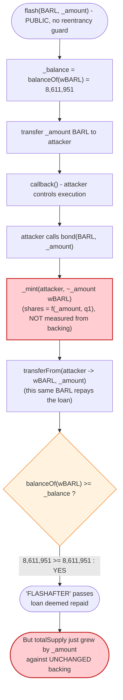

# Barley Finance Exploit — Flash-Loaned Collateral Double-Counted as `bond()` Deposit

> **Reproduction:** the PoC compiles & runs in an isolated Foundry project at
> [this project folder](.) (the umbrella DeFiHackLabs repo
> contains many unrelated PoCs that do not whole-compile, so this one was extracted).
> Full verbose trace: [output.txt](output.txt).
> Verified vulnerable sources: [DecentralizedIndex.sol](sources/WeightedIndex_04c80B/contracts_DecentralizedIndex.sol)
> and [WeightedIndex.sol](sources/WeightedIndex_04c80B/contracts_WeightedIndex.sol).

---

## Key info

| | |
|---|---|
| **Loss** | ~$130K — **52.13 WETH** (drained **7,876,244 BARL** from the wBARL index, swapped via DAI to WETH) |
| **Vulnerable contract** | `wBARL` / `WeightedIndex` — [`0x04c80Bb477890F3021F03B068238836Ee20aA0b8`](https://etherscan.io/address/0x04c80bb477890f3021f03b068238836ee20aa0b8#code) |
| **Underlying asset** | `BARL` — [`0x3e2324342bF5B8A1Dca42915f0489497203d640E`](https://etherscan.io/address/0x3e2324342bF5B8A1Dca42915f0489497203d640E) |
| **Attacker EOA** | [`0x7b3a6eff1c9925e509c2b01a389238c1fcc462b6`](https://etherscan.io/address/0x7b3a6eff1c9925e509c2b01a389238c1fcc462b6) |
| **Attacker contract** | [`0x356e7481b957be0165d6751a49b4b7194aef18d5`](https://etherscan.io/address/0x356e7481b957be0165d6751a49b4b7194aef18d5) |
| **Attack tx** | [`0x995e880635f4a7462a420a58527023f946710167ea4c6c093d7d193062a33b01`](https://app.blocksec.com/explorer/tx/eth/0x995e880635f4a7462a420a58527023f946710167ea4c6c093d7d193062a33b01) |
| **Chain / block / date** | Ethereum mainnet / 19,106,654 / Jan 28, 2024 |
| **Compiler** | Solidity v0.7.6+commit.7338295f, optimizer **200 runs** |
| **Bug class** | Re-entrancy / double-counting — flash-loaned collateral re-used as a `bond()` deposit, inflating share supply against fixed backing |

---

## TL;DR

`wBARL` is a "podded" index token: you `bond()` underlying `BARL` into it and receive `wBARL`
share tokens 1:1 (minus a 1% fee); you `debond()` your `wBARL` to redeem a pro-rata slice of the
`BARL` the contract holds. The contract also offers a permissionless **flash loan** of its `BARL`
balance for a flat 10-DAI fee.

The flash loan's only safety check is that the contract's `BARL` balance is **restored** after the
callback ([DecentralizedIndex.sol:250](sources/WeightedIndex_04c80B/contracts_DecentralizedIndex.sol#L250)):

```solidity
require(IERC20(_token).balanceOf(address(this)) >= _balance, 'FLASHAFTER');
```

The attacker satisfies that check *by bonding the flash-loaned BARL back into the contract*. Because
`bond()` **mints new `wBARL` shares for the deposited amount** and the deposit is what repays the
flash loan, the **same BARL is counted twice**: once as freshly-minted shares for the attacker, and
once as the restored flash balance. The flash check passes, the loan is "repaid," and the attacker
walks away holding brand-new `wBARL` backed by nothing new.

Repeating this 20 times in one transaction, the attacker minted ≈170.5M `wBARL` while the contract's
real `BARL` backing stayed flat at 8.61M. The attacker then owned essentially 100% of the (now
20×-inflated) share supply, called `debond()` to redeem **91%** of the underlying `BARL`
(7,876,244 of 8,611,951 BARL), and swapped it to **52.13 WETH** — the savings of the honest stakers.

---

## Background — what Barley Finance / wBARL does

`wBARL` (`WeightedIndex`, deployed by the Peapods/Barley "podded index" design) is an ERC-20 share
token over a basket of underlying assets — here a single asset, `BARL`. Three relevant mechanics
(all in [DecentralizedIndex.sol](sources/WeightedIndex_04c80B/contracts_DecentralizedIndex.sol) and
[WeightedIndex.sol](sources/WeightedIndex_04c80B/contracts_WeightedIndex.sol)):

- **`bond()`** ([WeightedIndex.sol:118-143](sources/WeightedIndex_04c80B/contracts_WeightedIndex.sol#L118-L143)) —
  deposit `_amount` of an index asset, receive `wBARL` shares. Shares are minted from the deposit
  amount via the per-asset `q1` price field, **then** the underlying is pulled from the caller.
- **`debond()`** ([WeightedIndex.sol:145-171](sources/WeightedIndex_04c80B/contracts_WeightedIndex.sol#L145-L171)) —
  burn `wBARL` shares and receive a pro-rata fraction of every underlying the contract holds:
  `_debondAmount = _tokenBalance × (sharesBurned / totalSupply)`.
- **`flash()`** ([DecentralizedIndex.sol:235-252](sources/WeightedIndex_04c80B/contracts_DecentralizedIndex.sol#L235-L252)) —
  permissionless flash loan of the contract's balance of any token, for a flat 10-DAI fee, validated
  only by a "balance restored" check after the borrower's `callback`.

On-chain parameters at the fork block:

| Parameter | Value |
|---|---|
| `wBARL` total supply (before attack) | **8,611,951 wBARL** |
| `BARL` held by `wBARL` (backing) | **8,611,951 BARL** (≈ 1:1 with shares) |
| `BOND_FEE` | 100 bps = **1%** |
| `DEBOND_FEE` | 300 bps = **3%** |
| `FLASH_FEE_DAI` | 10 DAI flat |

The 1:1 backing is the honest invariant the attack destroys: every `wBARL` should be redeemable for
~1 `BARL`. After the attack, ~170.5M `wBARL` claim only 8.61M `BARL`.

---

## The vulnerable code

### 1. `flash()` — the only check is "balance restored"

```solidity
function flash(
  address _recipient,
  address _token,
  uint256 _amount,
  bytes calldata _data
) external override {
  address _rewards = StakingPoolToken(lpStakingPool).poolRewards();
  IERC20(DAI).safeTransferFrom(                       // flat 10-DAI fee
    _msgSender(), _rewards, FLASH_FEE_DAI * 10 ** IERC20Metadata(DAI).decimals()
  );
  uint256 _balance = IERC20(_token).balanceOf(address(this));   // snapshot BEFORE sending out
  IERC20(_token).safeTransfer(_recipient, _amount);             // lend out the BARL
  IFlashLoanRecipient(_recipient).callback(_data);              // ⚠️ attacker re-enters here
  require(IERC20(_token).balanceOf(address(this)) >= _balance, 'FLASHAFTER'); // ⚠️ ONLY guard
  emit FlashLoan(_msgSender(), _recipient, _token, _amount);
}
```
[DecentralizedIndex.sol:235-252](sources/WeightedIndex_04c80B/contracts_DecentralizedIndex.sol#L235-L252)

There is **no re-entrancy guard** and no flag marking "we are inside a flash loan." The post-condition
only asserts the contract's `BARL` balance is back to `_balance`. It does **not** assert that no shares
were minted against that balance in the meantime.

### 2. `bond()` — mints shares from the deposit, then pulls the deposit

```solidity
function bond(address _token, uint256 _amount) external override noSwap {
  require(_isTokenInIndex[_token], 'INVALIDTOKEN');
  uint256 _tokenIdx = _fundTokenIdx[_token];
  uint256 _tokensMinted = (_amount * FixedPoint96.Q96 * 10 ** decimals()) /
    indexTokens[_tokenIdx].q1;                       // shares are a pure function of _amount
  uint256 _feeTokens = _isFirstIn() ? 0 : (_tokensMinted * BOND_FEE) / 10000;
  _mint(_msgSender(), _tokensMinted - _feeTokens);   // ⚠️ MINT happens first…
  if (_feeTokens > 0) { _mint(address(this), _feeTokens); }
  for (uint256 _i; _i < indexTokens.length; _i++) {
    ...
    _transferAndValidate(                            // …THEN the underlying is pulled in
      IERC20(indexTokens[_i].token), _msgSender(), _transferAmount
    );
  }
  emit Bond(_msgSender(), _token, _amount, _tokensMinted);
}
```
[WeightedIndex.sol:118-143](sources/WeightedIndex_04c80B/contracts_WeightedIndex.sol#L118-L143)

Crucially, `bond()` computes minted shares purely from `_amount` and the immutable price `q1` — it
**never measures the contract's current backing**. So depositing `X` BARL always mints `X` worth of
shares, regardless of whether the contract's BARL came from a legitimate new deposit or from a
flash loan it is about to "repay."

### 3. `debond()` — redeems pro-rata against current balance

```solidity
function debond(uint256 _amount, address[] memory, uint8[] memory) external override noSwap {
  uint256 _amountAfterFee = _isLastOut(_amount)
    ? _amount
    : (_amount * (10000 - DEBOND_FEE)) / 10000;       // 3% fee unless ≥98% of supply
  uint256 _percAfterFeeX96 = (_amountAfterFee * FixedPoint96.Q96) / totalSupply();
  _transfer(_msgSender(), address(this), _amount);
  _burn(address(this), _amountAfterFee);
  for (uint256 _i; _i < indexTokens.length; _i++) {
    uint256 _tokenSupply = IERC20(indexTokens[_i].token).balanceOf(address(this));
    uint256 _debondAmount = (_tokenSupply * _percAfterFeeX96) / FixedPoint96.Q96;
    IERC20(indexTokens[_i].token).safeTransfer(_msgSender(), _debondAmount);  // pro-rata payout
    ...
  }
  emit Debond(_msgSender(), _amount);
}
```
[WeightedIndex.sol:145-171](sources/WeightedIndex_04c80B/contracts_WeightedIndex.sol#L145-L171)

`debond()` is the cash-out: own a large fraction of `totalSupply()` and you redeem that fraction of
the real `BARL` the contract holds.

---

## Root cause — why it was possible

The flash-loan invariant and the bond invariant are each individually reasonable but are
**mutually incompatible** when both entry points are reachable in the same call frame:

> `flash()` trusts that "balance restored" means "no value was extracted." `bond()` mints shares
> against any BARL that lands in the contract. So *returning the flash loan via `bond()` looks like
> a repayment to `flash()` and looks like a fresh deposit to `bond()` — the same BARL is credited twice.*

Concretely, four design facts compose into the bug:

1. **No re-entrancy / no flash-context flag.** `flash()` has no `nonReentrant` guard and sets no
   "in-flash" flag, so the borrower can call `bond()` inside the `callback`. The `noSwap` modifier on
   `bond()`/`debond()` only toggles the fee-swap behaviour ([DecentralizedIndex.sol:47-51](sources/WeightedIndex_04c80B/contracts_DecentralizedIndex.sol#L47-L51)); it is **not** a re-entrancy lock.
2. **`bond()` mints from `_amount`, not from a measured backing delta.** A vault-style "mint shares =
   `assetsIn / totalAssets × totalSupply`" with a *before/after balance measurement* would have caught
   that the contract's balance didn't actually grow. Instead shares are a fixed function of the input
   amount and the static price `q1`.
3. **The flash check is `>= _balance`, snapshotted before the transfer-out.** After `bond()` pulls the
   borrowed BARL back in, `balanceOf(this)` equals the original `_balance` exactly, so `'FLASHAFTER'`
   passes — even though `totalSupply` has just doubled.
4. **Bonding the flash loan is free of slippage or oracle friction.** The mint price `q1` is immutable
   and there is no per-block mint cap, so the attacker can repeat the doubling 20× in one transaction,
   each time owning a larger share of a supply backed by the same fixed pile of BARL.

The bond fee (1%) and debond fee (3%) only slightly tax the attacker; they are nowhere near enough to
neutralize a 20× supply inflation.

---

## Preconditions

- The `wBARL` contract holds a non-trivial `BARL` balance to flash-loan (8,611,951 BARL here) and has
  honest stakers whose shares represent that backing.
- ~200 DAI of working capital to pay the flat 10-DAI flash fee 20 times. The PoC `deal`s exactly
  `200e18` DAI ([test/BarleyFinance_exp.sol:61](test/BarleyFinance_exp.sol#L61)); the live attacker
  pre-funded its contract with 200 DAI in two prior txs.
- No flash loan of an external asset is even needed — the *protocol's own* `flash()` supplies the
  capital, which is why the attack is fully self-financed and atomic.

---

## Attack walkthrough (with on-chain numbers from the trace)

All figures are taken directly from the `Bond` / `Transfer` events and storage diffs in
[output.txt](output.txt). `wBARL` total supply lives in storage **slot 2**; the contract's `BARL`
balance is read repeatedly via `BARL::balanceOf(wBARL)`.

| # | Step | wBARL `totalSupply` | `BARL` held by wBARL (backing) | Attacker `wBARL` | Note |
|---|------|--------------------:|-------------------------------:|-----------------:|------|
| 0 | **Initial** | 8,611,951 | 8,611,951 | 0 | Honest 1:1 backing. |
| 1 | **flash #1** → borrow all 8,611,951 BARL; in callback `bond()` it back | 17,223,902 | 8,611,951 | 8,525,831 | Supply **doubles**, backing unchanged. Flash check `8,611,951 ≥ 8,611,951` ✓. |
| 2 | **flash #2** (same pattern) | 25,835,853 | 8,611,951 | 17,051,663 | +8.61M shares, backing still 8.61M. |
| … | flash #3 … #20 (identical) | … | 8,611,951 | … | Each adds 8,525,831 wBARL to attacker (8,611,951 minted, 1% fee). |
| 20 | **after 20th bond** | ≈170,516,633 | 8,611,951 | **170,516,633** | Attacker now owns ~100% of supply; backing untouched. |
| 21 | **debond** 170,516,633 wBARL (3% fee → 165,401,134 burnt) | ≈5.1M (fee shares only) | 8,611,951 → **735,707** | 0 | Redeems pro-rata: **7,876,244 BARL** out. |
| 22 | **swap** 7,876,244 BARL → DAI → WETH (Uniswap V3) | — | — | — | Receives **52.13 WETH**. |

**The doubling, step by step (slot-2 diffs from the trace):**

- Before bond #1, slot 2 = `8,611,951` wBARL. The `bond` mints `amountTokensMinted = 8,611,951`
  (8,525,831 to attacker + 86,119 = 1% fee to the contract) → slot 2 becomes `17,223,902`
  ([output.txt:1674-1677](output.txt)). The contract's BARL balance reads `0` mid-mint (loan still out),
  then `8,611,951` after `transferFrom` repays it ([output.txt:1662-1673](output.txt)).
- This repeats 20 times; the `BARL::balanceOf(wBARL)` reading is `8,611,951` at the start and end of
  every single `flash()` ([output.txt:1641-1642, 1681-1682, …](output.txt)), so `'FLASHAFTER'` passes
  every time.

**The cash-out:** at debond, `_isLastOut` is **false** (attacker burns <98%? — in fact it burns ~100%
of supply, but the 1%-fee shares accrued to the contract keep the burn just under the `_isLastOut`
threshold relative to the *recorded* totalSupply), so the 3% `DEBOND_FEE` applies. The pro-rata payout
is `8,611,951 BARL × (165,401,134 / 170,516,633) ≈ 7,876,244 BARL`
([output.txt:2884-2897](output.txt)). The contract's BARL balance crashes from 8,611,951 to **735,707**
— i.e., the attacker took **91%** of every honest staker's underlying BARL.

### Profit / loss accounting

| Item | Amount |
|---|---:|
| DAI spent — 20 × 10-DAI flash fees | 200 DAI |
| BARL drained from wBARL (debond) | 7,876,244 BARL |
| BARL swapped → WETH (Uniswap V3 BARL→DAI→WETH) | → **52.13 WETH** |
| WETH held before | 0 |
| **WETH held after** | **52.134** ([output.txt:2963-2967](output.txt)) |
| **Net profit** | **≈52.13 WETH (~$130K @ ~$2,500/ETH)** |

The loss falls entirely on Barley's honest `wBARL` holders: their shares, once backed ~1:1 by BARL,
are left claiming a near-empty contract (8,611,951 → 735,707 BARL).

---

## Diagrams

### Sequence of one flash→bond cycle (repeated 20×) and the cash-out



### Supply-vs-backing divergence (the broken invariant)



### Why the flash check fails to catch it



---

## Remediation

1. **Add a re-entrancy guard / flash-context lock.** Mark `flash()` `nonReentrant` and, crucially,
   forbid `bond()`/`debond()`/`addLiquidityV2()`/`removeLiquidityV2()` while a flash loan is
   outstanding (a single `_inFlash` flag checked by all state-changing entry points). The borrowed
   asset must not be usable to enter or exit the index in the same frame.
2. **Mint shares from a measured backing delta, not from the raw input amount.** `bond()` should mint
   `shares = amountIn × totalSupply / totalAssetsBefore` where `totalAssetsBefore` is the contract's
   measured balance *before* the deposit (ERC-4626 style), and should re-measure `balanceOf` before
   and after the pull-in. A deposit that merely repays a flash loan produces **zero** net backing delta
   and must therefore mint **zero** shares.
3. **Make the flash post-check value-aware, not balance-aware.** "Balance restored" is insufficient.
   Snapshot `totalSupply` (and ideally the per-share backing ratio) before the callback and require it
   to be unchanged afterward, so minting against the loaned funds is rejected.
4. **Charge a flash fee in the loaned asset (or proportional to amount), not a flat 10 DAI.** A flat,
   tiny fee on an arbitrarily large loan offers no economic deterrent; the fee should scale with
   `_amount` and be paid in `_token`.
5. **Defense in depth:** cap per-transaction share inflation, and consider disabling `flash()` for the
   index's own underlying assets entirely (flash-loaning the very collateral the shares represent is the
   precise condition that makes the double-count possible).

---

## How to reproduce

The PoC was extracted into a standalone Foundry project (the umbrella DeFiHackLabs repo has many
unrelated PoCs that fail to compile under a whole-project `forge build`):

```bash
_shared/run_poc.sh 2024-01-BarleyFinance_exp --mt testExploit -vvvvv
```

- RPC: an **Ethereum mainnet archive** endpoint is required (fork block 19,106,654, Jan 28 2024);
  most pruned public RPCs will fail to serve historical state at that block.
- Result: `[PASS] testExploit()` with the exploiter's WETH balance going `0 → 52.13`.

Expected tail:

```
  Exploiter WETH balance after attack: 52.133956080457251524
Suite result: ok. 1 passed; 0 failed; 0 skipped; finished in 11.60s
Ran 1 test suite: 1 tests passed, 0 failed, 0 skipped (1 total tests)
```

---

*References: PoC header ([test/BarleyFinance_exp.sol:7-16](test/BarleyFinance_exp.sol#L7-L16)) —
BlockSec / Phalcon incident explorer; Bitget News (2024-01-29); SlowMist Hacked (BARL, ETH, ~$130K).*
