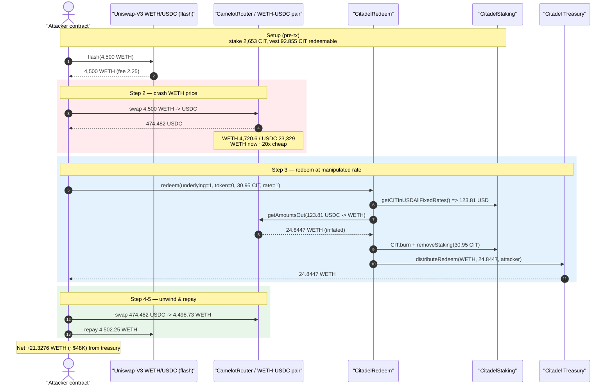
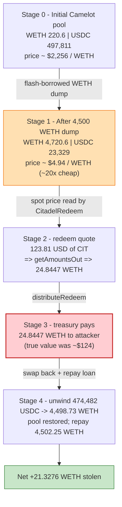
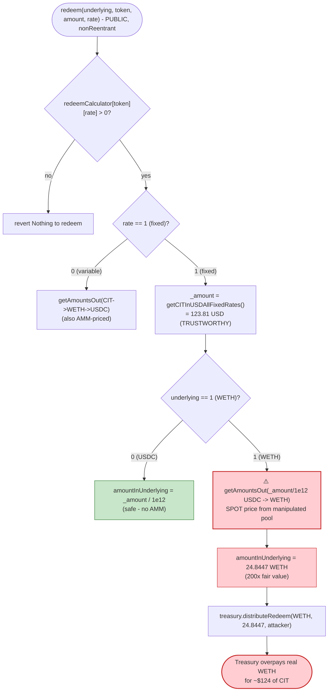

# Citadel Finance Exploit — Spot-Price Oracle Manipulation in `CitadelRedeem.redeem()`

> **Reproduction:** the PoC compiles & runs in an isolated Foundry project at
> [this project folder](.) (the umbrella DeFiHackLabs repo contains many
> unrelated PoCs that do not compile together, so this one was extracted).
> Full verbose trace: [output.txt](output.txt).
> Verified vulnerable source: [contracts_CITRedeem.sol](sources/CitadelRedeem_34b666/contracts_CITRedeem.sol).

---

## Key info

| | |
|---|---|
| **Loss** | ~$93K total across several redeem txs; **this PoC reproduces one redeem netting ≈ 21.33 WETH (~$48K)** drained from the Citadel treasury |
| **Vulnerable contract** | `CitadelRedeem` — [`0x34b666992fcCe34669940ab6B017fE11e5750799`](https://arbiscan.io/address/0x34b666992fcCe34669940ab6B017fE11e5750799) |
| **Victim** | Citadel treasury — [`0x5ed32847e33844155c18944Ae84459404e432620`](https://arbiscan.io/address/0x5ed32847e33844155c18944Ae84459404e432620) (holds the WETH/USDC backing) |
| **Price source abused** | Camelot WETH/USDC pair — `0x84652bb2539513BAf36e225c930Fdd8eaa63CE27` (via `CamelotRouter` `0xc873fEcbd354f5A56E00E710B90EF4201db2448d`) |
| **Flash-loan source** | Uniswap-V3 WETH/USDC pool — `0xC31E54c7a869B9FcBEcc14363CF510d1c41fa443` |
| **Attacker EOA** | [`0xfcf88e5e1314ca3b6be7eed851568834233f8b49`](https://arbiscan.io/address/0xfcf88e5e1314ca3b6be7eed851568834233f8b49) |
| **Attacker contract** | [`0xfcbf411237ac830dc892edec054f15ba7f9ea5a6`](https://arbiscan.io/address/0xfcbf411237ac830dc892edec054f15ba7f9ea5a6) |
| **One attack tx** | [`0xf52a681bc76df1e3a61d9266e3a66c7388ef579d62373feb4fd0991d36006855`](https://app.blocksec.com/explorer/tx/arbitrum/0xf52a681bc76df1e3a61d9266e3a66c7388ef579d62373feb4fd0991d36006855) |
| **Chain / block / date** | Arbitrum One / fork 174,659,183 → 174,662,726 / Jan 27, 2024 |
| **Compiler** | Solidity v0.8.20, optimizer **1000 runs** |
| **Bug class** | Spot-price (AMM `getAmountsOut`) oracle manipulation via flash loan |

---

## TL;DR

`CitadelRedeem.redeem()` lets a staker burn their redeemable CIT and receive an equivalent amount of
the treasury's WETH. To convert "CIT worth $X" into "amount of WETH", it asks a **live Camelot AMM
pair for the spot exchange rate** via `camelotRouter.getAmountsOut(...)`
([contracts_CITRedeem.sol:121-129](sources/CitadelRedeem_34b666/contracts_CITRedeem.sol#L121-L129)).
That spot rate is trivially manipulable inside a single transaction.

The attacker:

1. **Stakes 2,653 CIT** in `CitadelStaking` (2% deposit fee → 2,599.94 CIT staked), then waits/warps
   until a small slice (**92.855 CIT**) becomes redeemable via the linear epoch vesting schedule.
2. **Flash-borrows 4,500 WETH** from a Uniswap-V3 WETH/USDC pool.
3. **Dumps all 4,500 WETH into the Camelot WETH/USDC pair**, crashing the price of WETH in that pool:
   the WETH reserve balloons from **220.6 → 4,720.6 WETH** while the USDC reserve drops from
   **497,811 → 23,329 USDC**. WETH is now ~20× "cheaper" in USDC terms inside this pool.
4. **Calls `redeem(underlying=1 (ETH), token=0 (CIT), amount, rate=1)`.** Citadel computes the CIT's
   fixed-rate USD value (123.81 USD for the redeemed slice) and asks the *manipulated* pool
   `getAmountsOut(123.81 USDC → WETH)`. Because WETH is artificially cheap, the pool replies
   **24.84 WETH** — a wildly inflated payout for ~$124 of CIT. The treasury dutifully sends
   **24.84 WETH** to the attacker.
5. **Swaps the 474,482 USDC** (received in step 3) back to WETH, recovering ~4,498.7 WETH, and
   **repays the 4,500 WETH + 2.25 WETH fee** flash loan.

Net to the attacker in this single redeem: **≈ 21.33 WETH (~$48K)** of honest treasury assets, paid
for a CIT position whose true fixed-rate value was only ~$124. The live incident repeated this
several times for ~$93K total.

---

## Background — what Citadel's redeem flow does

Citadel Finance is a staking protocol on Arbitrum with three in-scope contracts:

- **`CIT`** ([source](sources/CIT_43cF18/contracts_CIT.sol)) — the ERC20 governance/utility token,
  with `mint`/`burn` callable by the protocol.
- **`CitadelStaking`** ([source](sources/CitadelStaking_5e93c0/contracts_CITStaking.sol)) — users
  deposit CIT at a **fixed** rate (`rate=1`) or **variable** rate (`rate=0`). Staked CIT vests
  linearly over `fullDistributionEpochs` (28 epochs × 6 h = 7 days); the amount currently redeemable
  is returned by `redeemCalculator()`
  ([:234-272](sources/CitadelStaking_5e93c0/contracts_CITStaking.sol#L234-L272)). For fixed-rate
  stakes, each stake records a `fixedRateAtStaking` (a USD price per CIT, 1e18-scaled), and
  `getCITInUSDAllFixedRates()`
  ([:350-375](sources/CitadelStaking_5e93c0/contracts_CITStaking.sol#L350-L375)) returns the
  fixed USD value of a given CIT amount.
- **`CitadelRedeem`** ([source](sources/CitadelRedeem_34b666/contracts_CITRedeem.sol)) — burns the
  redeemable CIT and pays the user the equivalent value out of the treasury, in either USDC or WETH.

The redeem payout for the **fixed-rate / WETH** path is the crux:

> Citadel knows the CIT's value in **USD** (from `fixedRateAtStaking`). To pay it in **WETH**, it must
> convert USD → WETH. Instead of a trusted oracle, it converts through a **Camelot AMM pool's
> instantaneous reserves** — which an attacker controls within the same transaction.

On-chain state at the fork block (from the trace):

| Item | Value | Source |
|---|---|---|
| Attacker CIT deposited | 2,653 CIT | [output.txt:63](output.txt) |
| Staked after 2% deposit fee | 2,599.94 CIT | [output.txt:101](output.txt) |
| Redeemable after vesting/warp | **92.855 CIT** | trace `redeemCalculator` ⇒ `[[0, 9.2855e19],[0,0]]` |
| Fixed USD value of 92.855 CIT | 371.42 USD (1e18) ⇒ **371.42 USDC** | trace `getCITInUSDAllFixedRates` |
| Camelot WETH/USDC reserves (pre) | **220.6 WETH / 497,811 USDC** | trace `getReserves()` |
| Treasury WETH balance | **72.668 WETH** | [output.txt:203](output.txt) |

---

## The vulnerable code

### `redeem()` prices the payout off a live AMM pool

```solidity
function redeem(uint256 underlying, uint256 token, uint256 amount, uint8 rate) public nonReentrant {
    ...
    uint256 amountAvailable = CITStaking.redeemCalculator(msg.sender)[token][rate];
    require(amountAvailable > 0, "Nothing to redeem");

    uint256 amountInUnderlying;
    address tokenAddy = underlying == 0 ? address(USDC) : address(WETH);
    ...
    // Fixed rate
    else {
        uint256 _amount = CITStaking.getCITInUSDAllFixedRates(msg.sender, amount); // USD value, 1e18
        require(amount <= amountAvailable, "Not enough CIT or bCIT to redeem");
        require(amount <= maxRedeemableFixed, "Amount too high");
        maxRedeemableFixed -= amount;
        if (underlying == 1) {
            address[] memory path = new address[](2);
            path[0] = address(USDC); // 1e6
            path[1] = address(WETH); // 1e18

            // ⚠️ spot price taken from Camelot pool reserves — manipulable in-tx
            uint[] memory a = camelotRouter.getAmountsOut(_amount / 1e12, path);

            amountInUnderlying = a[1];   // ⚠️ inflated WETH amount
        } else {
            amountInUnderlying = _amount / 1e12; // 1e6 USDC
        }
    }

    if (token == 0) {
        CIT.burn(CITStakingAddy, amount);
        CITStaking.removeStaking(msg.sender, address(CIT), rate, amount);
    } ...

    // ⚠️ treasury pays out the manipulated WETH amount
    treasury.distributeRedeem(tokenAddy, amountInUnderlying, msg.sender);
}
```

([contracts_CITRedeem.sol:85-145](sources/CitadelRedeem_34b666/contracts_CITRedeem.sol#L85-L145))

The line that does the damage is
[:127](sources/CitadelRedeem_34b666/contracts_CITRedeem.sol#L127):

```solidity
uint[] memory a = camelotRouter.getAmountsOut(_amount / 1e12, path); // USDC -> WETH, spot price
```

`getAmountsOut` is a pure function of the pair's **current reserves**. It has no TWAP, no staleness
guard, and no cross-check against any independent price. Whatever ratio the attacker pushes the pool
to in the same transaction is exactly the ratio Citadel uses to size its WETH payout.

The USDC path (`underlying == 0`) is safe — it pays `_amount / 1e12` directly from the recorded USD
value. **Only the WETH path routes through the AMM**, so the attacker specifically chooses
`underlying = 1`.

---

## Root cause — why it was possible

A constant-product AMM pair (`getAmountOut = in·feeNum·reserveOut / (reserveIn·feeDen + in·feeNum)`)
prices an asset purely from its current reserves. Anyone with enough capital — readily borrowed via a
flash loan — can move those reserves to almost any ratio for the duration of one transaction, then
move them back.

`CitadelRedeem` treats that instantaneous, attacker-movable ratio as the **authoritative price** for
how much treasury WETH a CIT position is worth:

> The protocol *knows* the redeemed CIT is worth **123.81 USD** (it computed it from
> `fixedRateAtStaking`). It then throws that trustworthy number away and re-derives "how much WETH is
> 123.81 USD" from a pool the attacker just emptied of USDC. The pool answers **24.84 WETH** (≈ $56K),
> and the treasury pays it.

The composing design decisions:

1. **Spot AMM as a USD↔WETH oracle.** `getAmountsOut` on a single Camelot pair is the only conversion
   used; no TWAP/Chainlink, no sanity bound on output vs. the known USD value.
2. **Attacker-funded reserves.** The reserve ratio is set by the attacker's own flash-borrowed WETH
   dump in the same tx, then unwound — so the manipulation is free apart from the flash-loan fee.
3. **No payout cap relative to known value.** Nothing checks that the WETH paid out (`a[1]`) is close
   to `_amount` USD at a fair price. A 200×-inflated payout passes every `require`.
4. **Permissionless entry with a cheap stake.** Anyone can become a redeemer by staking a small amount
   of CIT and letting a sliver vest; the redeem itself needs no privilege.

The PoC's choice of `redeemAmount = amountAvailable / 3`
([test/CitadelFinance_exp.sol:127-130](test/CitadelFinance_exp.sol#L127-L130)) is just sizing: it
redeems only as much CIT as the manipulated pool can profitably overpay for, balancing payout vs.
slippage on the unwind swap.

---

## Preconditions

- A fixed-rate (`rate=1`) CIT stake with a non-zero **vested/redeemable** slice
  (`redeemCalculator()[0][1] > 0`). The attacker manufactures this by depositing 2,653 CIT and warping
  past one epoch ([test/CitadelFinance_exp.sol:70-86](test/CitadelFinance_exp.sol#L70-L86)).
- `maxRedeemableFixed >= amount` — the owner-set budget that gates fixed redemptions
  ([:119](sources/CitadelRedeem_34b666/contracts_CITRedeem.sol#L119)). It was large enough at the time.
- The treasury holds enough WETH to satisfy the inflated payout (it held 72.668 WETH; the redeem drew
  24.84 WETH).
- Flash-loan liquidity in a WETH/USDC venue (Uniswap-V3 pool `0xC31E…`) plus enough capital to move
  the Camelot pool's reserves — all recovered intra-transaction, hence flash-loanable.

---

## Attack walkthrough (with on-chain numbers from the trace)

The Camelot pair `0x84652bb2…` has `token0 = WETH`, `token1 = USDC`. All figures are taken directly
from the `getReserves`/`Sync`/`Swap` traces in [output.txt](output.txt).

| # | Step | WETH reserve | USDC reserve | Effect |
|---|------|-------------:|-------------:|--------|
| 0 | **Initial** Camelot pool | 220.60 | 497,811 | Honest price ≈ $2,256 / WETH. |
| 1 | **Flash-borrow** 4,500 WETH from Uni-V3 (`flash`) | — | — | fee 2.25 WETH ([output.txt:361](output.txt)). |
| 2 | **Dump** 4,500 WETH → USDC on Camelot ([output.txt:147-195](output.txt)). Attacker receives **474,482 USDC**. | **4,720.60** | **23,329** | WETH price crashed ~20×; pool now WETH-rich, USDC-poor. |
| 3 | **`redeem(1, 0, 30.9517 CIT, 1)`** ([output.txt:227-273](output.txt)) | 4,720.60 | 23,329 | See sub-steps below. |
| 3a | `getCITInUSDAllFixedRates(30.9517 CIT)` ⇒ **123.81 USD** | — | — | True fair value of the redeemed CIT. |
| 3b | `getAmountsOut(123.81 USDC → WETH)` on manipulated pool ⇒ **24.8447 WETH** | — | — | ⚠️ 123.81 USDC "buys" 24.84 WETH (~$56K) because WETH is fake-cheap. |
| 3c | `CIT.burn(staking, 30.9517)` + `removeStaking` | — | — | Attacker's CIT slice destroyed. |
| 3d | `treasury.distributeRedeem(WETH, 24.8447, attacker)` ([output.txt:255-270](output.txt)) | — | — | **Treasury sends 24.8447 WETH to attacker.** |
| 4 | **Swap back** 474,482 USDC → **4,498.73 WETH** on Camelot ([output.txt:289-342](output.txt)) | 221.86 | 497,811 | Pool reserves restored ~to original; recovers most principal. |
| 5 | **Repay** flash loan: transfer **4,502.25 WETH** (4,500 + 2.25 fee) ([output.txt:343-350](output.txt)) | — | — | Loan closed. |

After the dust settles the attacker holds **21.3276 WETH** ([output.txt:367](output.txt)), having
started with 0.

### Why the manipulated quote is so lopsided

After step 2 the Camelot pool holds 4,720.6 WETH against only 23,329 USDC, so its implied price is
≈ $4.94 per WETH instead of ~$2,256. When Citadel asks "how much WETH is 123.81 USD?" at that fake
price, the answer is ≈ `123.81 / 4.94 ≈ 25` WETH (the trace returns 24.8447 after fees). The treasury
pays out real WETH at this counterfeit rate.

---

## Profit / loss accounting (WETH)

| Direction | Amount (WETH) | Source |
|---|---:|---|
| Flash loan principal in | 4,500.000 | [output.txt:117](output.txt) |
| WETH dumped into Camelot (step 2) | −4,500.000 | [output.txt:147](output.txt) |
| USDC→WETH unwind (step 4) | +4,498.733 | [output.txt:312-315](output.txt) |
| **Treasury payout (step 3d)** | **+24.845** | [output.txt:260](output.txt) |
| Flash-loan repayment (principal+fee) | −4,502.250 | [output.txt:343](output.txt) |
| **Net attacker balance** | **+21.3276** | [output.txt:367,371](output.txt) |

The net `21.3276 WETH` equals: treasury payout `24.8447` − flash fee `2.25` − unwind slippage
`≈ 1.27` = `21.33`. At the Jan-27-2024 WETH price (~$2,256) that is **≈ $48K** stolen from Citadel's
treasury in this single redeem; the live attacker repeated the loop for the reported ~$93K total.

---

## Diagrams

### Sequence of the attack



### Pool reserve & payout evolution



### The flaw inside `redeem()` (fixed-rate / WETH path)



---

## Remediation

1. **Do not price redemptions off a spot AMM.** The fixed-rate path already *knows* the redeemed CIT's
   value in USD (`getCITInUSDAllFixedRates`). To pay in WETH, convert USD→WETH with a manipulation-
   resistant source: a Chainlink ETH/USD feed, or a long-window Camelot/Uniswap TWAP — never a single
   `getAmountsOut` against live reserves.
2. **Bound the payout against the known value.** Require that the WETH paid out, valued at an
   independent oracle price, is within a tight tolerance of `_amount` USD (e.g. ±1–2%). A 200×-inflated
   quote must revert.
3. **Apply the same fix to the variable-rate path.** `rate == 0`
   ([:101-113](sources/CitadelRedeem_34b666/contracts_CITRedeem.sol#L101-L113)) also uses
   `getAmountsOut(CIT→WETH→USDC)` and is equally manipulable.
4. **Make flash-loan manipulation economically pointless.** TWAP/oracle pricing removes the single-tx
   manipulation window entirely; combined with a payout cap, the attack ceases to be profitable.
5. **Consider per-tx / per-block redemption limits** and minimum stake-age requirements so an attacker
   cannot cheaply manufacture a redeemable position right before manipulating the price.

---

## How to reproduce

The PoC was extracted into a standalone Foundry project (the umbrella DeFiHackLabs repo has many
unrelated PoCs that fail under a whole-project `forge build`):

```bash
_shared/run_poc.sh 2024-01-CitadelFinance_exp --mt testExploit -vvvvv
```

- RPC: an **Arbitrum archive** endpoint is required (the fork block 174,659,183 is historical).
  `foundry.toml` points `arbitrum` at an Infura archive endpoint; most pruned public RPCs will fail
  with `missing trie node` / `header not found`.
- Result: `[PASS] testExploit()`, ending with `Exploiter WETH balance after attack:
  21.327628237750659425`.

Expected tail ([output.txt](output.txt)):

```
Ran 1 test for test/CitadelFinance_exp.sol:ContractTest
[PASS] testExploit() (gas: 834636)
Logs:
  Exploiter total staked CIT amount (minus fee) before attack: 2599.940000000000000000
  Exploiter WETH balance before attack: 0.000000000000000000
  --------------------Start attack--------------------
  Flashloaned amount of WETH to swap and manipulate WETH/USDC pair: 4500.000000000000000000
  Available amount of CIT to redeem: 92.855000000000000000
  Available amount of CIT to redeem in USDC: 371420000
  --------------------End attack--------------------
  Exploiter WETH balance after attack: 21.327628237750659425
```

---

*References: Neptune Mutual — How Was Citadel Finance Exploited
(https://medium.com/neptune-mutual/how-was-citadel-finance-exploited-a5f9acd0b408); DeFiHackLabs.*
