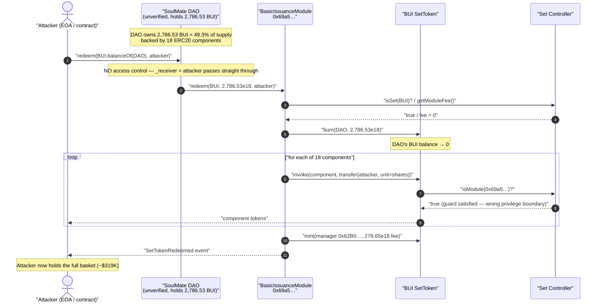
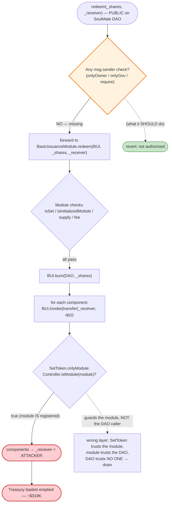
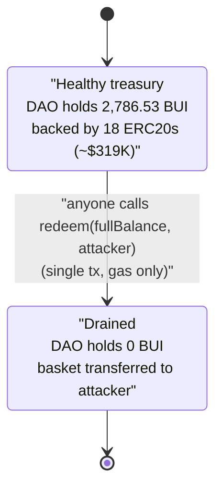

# DAO SoulMate Exploit — Permissionless `redeem()` Drains the DAO's SetToken Basket

> **Vulnerability classes:** vuln/access-control/missing-auth · vuln/access-control/missing-modifier

> **Reproduction:** the PoC compiles & runs in an isolated Foundry project at
> [this project folder](.) (the umbrella DeFiHackLabs repo contains many unrelated
> PoCs that do not whole-compile, so this one was extracted).
> Full verbose trace: [output.txt](output.txt).
> The victim "SoulMate" DAO contract is **unverified** on Etherscan; the in-scope
> verified source is the Set Protocol [SetToken.sol](sources/SetToken_b7470F/SetToken.sol)
> whose `redeem`-issuance module the DAO wraps.

---

## Key info

| | |
|---|---|
| **Loss** | ~$319K — the full underlying basket of an 18-token Set (USDC, DAI, WETH, UNI, AAVE, MATIC, ENS, ZRX, LINK, MKR, …) backing **2,786.53 BUI** |
| **Vulnerable contract** | "SoulMate" DAO — [`0x82C063AFEFB226859aBd427Ae40167cB77174b68`](https://etherscan.io/address/0x82c063afefb226859abd427ae40167cb77174b68) (unverified; exposes a public `redeem(uint256,address)`) |
| **Victim asset / Set** | `BUI` SetToken — [`0xb7470Fd67e997b73f55F85A6AF0DeB2c96194885`](https://etherscan.io/address/0xb7470Fd67e997b73f55F85A6AF0DeB2c96194885#code) |
| **Issuance module used** | BasicIssuanceModule — `0x69a592D2129415a4A1d1b1E309C17051B7F28d57` |
| **Attacker EOA** | [`0xd215ffaf0f85fb6f93f11e49bd6175ad58af0dfd`](https://etherscan.io/address/0xd215ffaf0f85fb6f93f11e49bd6175ad58af0dfd) |
| **Attacker contract** | `0xd129d8c12f0e7aa51157d9e6cc3f7ece2dc84ecd` |
| **Attack tx** | [`0x1ea0a2e8…73da342`](https://app.blocksec.com/explorer/tx/eth/0x1ea0a2e88efceccb2dd93e6e5cb89e5421666caeefb1e6fc41b68168373da342) |
| **Chain / fork block / date** | Ethereum mainnet / 19,063,676 / Jan 23, 2024 |
| **Compiler** | SetToken: Solidity v0.6.10, optimizer 200 runs (DAO contract unverified) |
| **Bug class** | Missing access control on a value-bearing entry point (CWE-284 / "no access control") |

---

## TL;DR

The "SoulMate" DAO contract owns **2,786.53 BUI** — units of a Set Protocol index token (`BUI`)
that is collateralized by a basket of 18 blue-chip ERC20s held inside the SetToken. To let the DAO
unwind its position, the contract exposes a public function:

```solidity
function redeem(uint256 _shares, address _receiver) external;   // <-- no onlyOwner / onlyGov / msg.sender check
```

Internally this forwards to the Set Protocol **BasicIssuanceModule**'s
`redeem(ISetToken _setToken, uint256 _quantity, address _to)`, which burns the DAO's BUI and, for
each component token, calls `SetToken.invoke(component, 0, transfer(_to, unitQty))` — shipping the
underlying assets to whatever `_to` was supplied.

Because **`_receiver` is fully attacker-controlled and there is no caller restriction**, the attacker
simply called:

```solidity
SoulMateContract.redeem(BUI.balanceOf(address(SoulMateContract)), attacker);
```

This redeemed the DAO's *entire* BUI balance and routed every one of the 18 underlying component
tokens straight to the attacker in a single call. No flash loan, no price manipulation, no
multi-step setup — one external call empties the treasury. The DAO held ~49.3% of the whole BUI
supply (2,786.53 of 5,653.24 BUI), so the redemption pulled roughly half of the Set's reserves out
to the attacker, ~**$319K** of tokens.

---

## Background — what is being redeemed

`BUI` is a **Set Protocol v2 SetToken** ([SetToken.sol:1964](sources/SetToken_b7470F/SetToken.sol#L1964)).
A SetToken is an ERC20 whose balance is fully backed by a *basket* of component ERC20s physically
held at the SetToken's own address. Two privileged operations move that backing:

- **Issuance** (`mint`): a module pulls in the component basket and mints BUI to the issuer.
- **Redemption** (`redeem`): a module burns the issuer's BUI and pushes the proportional basket out.

Both `mint` and `burn` on the SetToken are `onlyModule` ([SetToken.sol:2249](sources/SetToken_b7470F/SetToken.sol#L2249),
[SetToken.sol:2257](sources/SetToken_b7470F/SetToken.sol#L2257)), and `invoke` (which performs the
component `transfer`s) is also `onlyModule` ([SetToken.sol:2118](sources/SetToken_b7470F/SetToken.sol#L2118)).
The `onlyModule` modifier ([SetToken.sol:2006](sources/SetToken_b7470F/SetToken.sol#L2006)) restricts
those calls to Controller-registered modules:

```solidity
modifier onlyModule() {
    // Internal function used to reduce bytecode size
    _validateOnlyModule();
    _;
}
```

**The SetToken itself is not the bug.** The trace confirms its guards work: every basket transfer
goes through `BUI::invoke(...)` whose first inner call is `Controller::isModule(0x69a5…) → true`
([output.txt:1749](output.txt#L1749)), i.e. only the legitimate BasicIssuanceModule may move the
basket. The module, in turn, will redeem *whatever BUI balance the caller's chosen holder has and
send it wherever the caller says* — it trusts its caller to enforce who may redeem on whose behalf.

That trust boundary is exactly where the **SoulMate DAO contract fails**: it wraps the module's
`redeem` in a public function and passes through caller-supplied `_shares` and `_receiver` with no
authorization, so anyone becomes "the module's trusted caller" for the DAO's funds.

The on-chain state at the fork block (read from the redeem trace):

| Fact | Value | Source |
|---|---|---|
| `BUI.totalSupply()` | **5,653.24 BUI** (5653242151909592475339) | [output.txt:1660-1661](output.txt#L1660-L1661) |
| BUI held by SoulMate DAO | **2,786.53 BUI** (2786531398478570664388) ≈ 49.3% of supply | [output.txt:1654](output.txt#L1654) |
| Components in the Set | **18 ERC20s** | [output.txt:1672-1673](output.txt#L1672-L1673) |
| Redeem module fee (type 0) | **0** | [output.txt:1670-1671](output.txt#L1670-L1671) |

---

## The vulnerable code

The SoulMate DAO contract is **unverified**, so the offending function body is not on Etherscan.
Its behaviour is fully pinned by the PoC interface and the trace. The PoC declares it as:

```solidity
// test/DAO_SoulMate_exp.sol
interface ISoulMateContract {
    function redeem(uint256 _shares, address _receiver) external;   // public, value-bearing, unguarded
}
```
([test/DAO_SoulMate_exp.sol:16-18](test/DAO_SoulMate_exp.sol#L16-L18))

and exploits it in one line — the comment in the original PoC says it all:

```solidity
// No access control
SoulMateContract.redeem(BUI.balanceOf(address(SoulMateContract)), address(this));
```
([test/DAO_SoulMate_exp.sol:59-60](test/DAO_SoulMate_exp.sol#L59-L60))

The trace shows `redeem(...)` immediately delegating to the Set Protocol module with the
attacker as the destination:

```
SoulMateContract::redeem(2786531398478570664388, ContractTest)
└─ 0x69a592D2…::redeem(BUI, 2786531398478570664388, ContractTest)   ← _to = attacker
   ├─ Controller::isSet(BUI) → true
   ├─ BUI::isInitializedModule(0x69a5…) → true
   ├─ BUI::totalSupply() → 5653242151909592475339
   ├─ BUI::burn(SoulMateContract, 2786531398478570664388)           ← burns the DAO's BUI
   ├─ Controller::getModuleFee(0x69a5…, 0) → 0
   ├─ BUI::getComponents() → [18 tokens]
   ├─ (for each component) BUI::invoke(component, transfer(attacker, unitQty))  ← basket → attacker
   └─ emit SetTokenRedeemed(BUI, SoulMate, attacker, 2786.53e18, 278.65e18, 0)
```
([output.txt:1654-1665](output.txt#L1654-L1665), [output.txt:1748-1758](output.txt#L1748-L1758),
[output.txt:2115](output.txt#L2115))

The module enforces only Set-Protocol-internal invariants (`isSet`, `isInitializedModule`,
positive supply, fee accounting). It performs **no check on who is entitled to the SoulMate DAO's
BUI** — that was the DAO contract's job, and the DAO never did it.

---

## Root cause — why it was possible

A single missing modifier.

`redeem(uint256 _shares, address _receiver)` is a function that (a) operates on assets owned by the
contract (the DAO's BUI position) and (b) lets the caller name the recipient of those assets. Such a
function must be restricted to the contract's owner/governance/timelock. The SoulMate DAO declared
it **`external` with no `onlyOwner` / `onlyGovernance` / `require(msg.sender == …)` guard at all**,
so the privilege check that the Set Protocol module deliberately delegates upward was simply never
implemented.

Three compounding facts turn this into a clean one-shot drain:

1. **Attacker-controlled `_receiver`.** Even an unauthorized caller could only grief if the basket
   went to the DAO; instead it goes to `_receiver`, which the attacker sets to itself.
2. **Attacker-controlled `_shares` with no cap.** The attacker reads `BUI.balanceOf(SoulMate)`
   on-chain and passes the **entire** balance, so a single call redeems 100% of the DAO's position
   rather than a slice.
3. **Real, liquid backing.** BUI is fully collateralized by 18 blue-chip ERC20s sitting inside the
   SetToken, so redemption yields immediately-sellable assets, not a worthless wrapper.

There was no economic defense to fall back on: the redeem module fee was `0`
([output.txt:1670-1671](output.txt#L1670-L1671)), and redemption is by construction value-preserving
(burn N% of supply → receive N% of every reserve), so nothing clawed value back from the attacker.

---

## Preconditions

- The DAO contract holds a non-zero BUI balance (it held **2,786.53 BUI**).
- `BUI` is a Controller-registered Set whose BasicIssuanceModule is initialized — both confirmed in
  the trace (`isSet → true`, `isInitializedModule → true`,
  [output.txt:1656-1659](output.txt#L1656-L1659)).
- No capital, no flash loan, no timing, and no special role are required. Any EOA or contract can call
  `redeem` for the cost of gas. In the PoC the test contract calls it directly with zero starting
  balances ([test/DAO_SoulMate_exp.sol:59-60](test/DAO_SoulMate_exp.sol#L59-L60)).

---

## Attack walkthrough (with on-chain numbers from the trace)

| # | Step | What happens | Evidence |
|---|------|--------------|----------|
| 0 | **Read DAO balance** | `BUI.balanceOf(SoulMate) = 2,786.53 BUI` (≈49.3% of the 5,653.24 BUI supply) | [output.txt:1654](output.txt#L1654), [output.txt:1660-1661](output.txt#L1660-L1661) |
| 1 | **Call `redeem(2786.53e18, attacker)`** | Single unguarded external call; `_receiver = attacker` | [output.txt:1654](output.txt#L1654) |
| 2 | **DAO → BasicIssuanceModule.redeem** | DAO forwards verbatim to module `0x69a5…` with attacker as `_to` | [output.txt:1655](output.txt#L1655) |
| 3 | **Set sanity checks** | `isSet(BUI)=true`, `isInitializedModule=true`, `totalSupply=5653.24e18`, fee=0 | [output.txt:1656-1671](output.txt#L1656-L1671) |
| 4 | **Burn DAO's BUI** | `BUI.burn(SoulMate, 2786.53e18)` → DAO's BUI balance slot zeroed | [output.txt:1662-1668](output.txt#L1662-L1668) |
| 5 | **Push 18 components to attacker** | For each of the 18 components, `invoke(component, transfer(attacker, unit×shares))` | [output.txt:1672-2106](output.txt#L1672-L2106) |
| 6 | **Mint redeem fee to manager** | `BUI.mint(0x62B00335…, 278.65e18)` — a 278.65 BUI manager/fee mint | [output.txt:2107-2110](output.txt#L2107-L2110) |
| 7 | **Done** | `SetTokenRedeemed(BUI, SoulMate, attacker, 2786.53e18, 278.65e18, 0)` | [output.txt:2115](output.txt#L2115) |

### The 18 component tokens shipped to the attacker

All values taken directly from the `Transfer(... to: ContractTest ...)` events. The PoC explicitly
logs seven of them; the remainder are visible in the basket transfers.

| Component | Amount received by attacker | Trace |
|---|---:|---|
| WBTC (8d) `0x2260…2C599` | 0.53425330 WBTC | [output.txt:1752](output.txt#L1752) |
| **USDC** (6d) | **78,673.58 USDC** | [output.txt:1770](output.txt#L1770) |
| WETH (18d) | 14.2328 WETH | [output.txt:1790](output.txt#L1790) |
| **UNI** (18d) | **1,762.48 UNI** | [output.txt:1807](output.txt#L1807) |
| ILV `0x767F…ca0E` | 59.4914 ILV | [output.txt:1825](output.txt#L1825) |
| **DAI** (18d) | **93,977.15 DAI** | [output.txt:1842](output.txt#L1842) |
| **MATIC** (18d) | **7,955.22 MATIC** | [output.txt:1859](output.txt#L1859) |
| MKR `0x9f8F…79A2` | 4.9969 MKR | [output.txt:1876](output.txt#L1876) |
| **AAVE** (18d) | **60.9193 AAVE** | [output.txt:1894](output.txt#L1894) |
| AMP `0xBBbb…AEafD` | 15,731.03 AMP | [output.txt:1914](output.txt#L1914) |
| SNX `0xC011…2a6F` | 5,837.88 SNX | [output.txt:1959](output.txt#L1959) |
| GUSD `0xc944…44a7` | 53,101.24 GUSD | [output.txt:1979](output.txt#L1979) |
| DYDX `0x92D6…BEff5` | 1,283.23 DYDX | [output.txt:2000](output.txt#L2000) |
| LINK `0x5149…986CA` | 396.98 LINK | [output.txt:2025](output.txt#L2025) |
| YFI `0x967d…b9F48` | 7,827.27 (raw) | [output.txt:2042](output.txt#L2042) |
| BAT `0x0D87…887EF` | 13,678.63 BAT | [output.txt:2062](output.txt#L2062) |
| **ZRX** (18d) | **8,006.46 ZRX** | [output.txt:2079](output.txt#L2079) |
| **ENS** (18d) | **503.05 ENS** | [output.txt:2096](output.txt#L2096) |

(Bolded rows are the seven the PoC logs and asserts after the attack;
[output.txt:1576-1582](output.txt#L1576-L1582).)

---

## Profit / loss accounting

The attacker started with **zero** of every tracked token
([output.txt:1569-1575](output.txt#L1569-L1575)) and ended holding the full redeemed basket
([output.txt:1576-1582](output.txt#L1576-L1582)):

| Token | Before | After (gain) |
|---|---:|---:|
| USDC | 0 | **78,673.58** |
| DAI | 0 | **93,977.15** |
| MATIC | 0 | **7,955.22** |
| AAVE | 0 | **60.92** |
| ENS | 0 | **503.05** |
| ZRX | 0 | **8,006.46** |
| UNI | 0 | **1,762.48** |
| … +11 more components | 0 | (WBTC, WETH, MKR, SNX, GUSD, DYDX, LINK, YFI, BAT, AMP, ILV) |

Just the two stablecoin legs (78,673.58 USDC + 93,977.15 DAI ≈ **$172.7K**) plus 14.23 WETH and
0.53 WBTC already clear ~$240K; the full 18-token basket totals the reported **~$319K**. The cost to
the attacker was a single transaction's gas (`gas: 1598213`, [output.txt:1567](output.txt#L1567)).
The only value that did *not* go to the attacker was the 278.65 BUI fee minted to the manager
`0x62B00335…` ([output.txt:2107-2110](output.txt#L2107-L2110)) — and that is denominated in BUI,
which is now worth correspondingly less per unit since half its backing left the building.

---

## Diagrams

### Sequence of the attack



### Where the trust boundary breaks



### DAO position state evolution



---

## Remediation

1. **Add access control to `redeem` (the actual fix).** Restrict the DAO's `redeem(uint256,address)`
   to an authorized principal:
   ```solidity
   function redeem(uint256 _shares, address _receiver) external onlyOwner { ... }
   // or onlyGovernance / onlyRole(REDEEMER_ROLE) / behind a timelock
   ```
   Any function that spends contract-owned assets and lets the caller pick the recipient is a
   privileged operation and must verify `msg.sender`.
2. **Hard-code or constrain the recipient.** If redemption is meant to return assets *to the DAO*,
   ignore a caller-supplied `_receiver` and use `address(this)` (or a fixed treasury), so even an
   accidental public path cannot exfiltrate funds.
3. **Bound the redeemable amount.** Cap per-call / per-window redemptions (rate-limit) so a single
   call can never unwind the entire position even if authorization is somehow bypassed.
4. **Treat "trusted caller" delegation explicitly.** Set Protocol's BasicIssuanceModule intentionally
   delegates the "who may redeem on whose behalf" decision to its caller. Any contract that wraps such
   a module inherits the obligation to enforce that authorization; document and unit-test that the
   wrapper rejects unauthorized callers.
5. **Add an authorization unit test / invariant.** A trivial test —
   `vm.prank(attacker); vm.expectRevert(); dao.redeem(x, attacker);` — would have caught this before
   deployment.

---

## How to reproduce

The PoC was extracted into a standalone Foundry project (the umbrella DeFiHackLabs repo has many
unrelated PoCs that fail to compile under a single `forge test` whole-project build):

```bash
_shared/run_poc.sh 2024-01-DAO_SoulMate_exp --mt testExploit -vvvvv
```

- RPC: a mainnet **archive** endpoint is required (`vm.createSelectFork("mainnet", 19_063_676)`,
  [test/DAO_SoulMate_exp.sol:32](test/DAO_SoulMate_exp.sol#L32)).
- Result: `[PASS] testExploit()` — the attacker's balances go from all-zero to the full redeemed
  basket.

Expected tail ([output.txt:1566-1582](output.txt#L1566-L1582)):

```
Ran 1 test for test/DAO_SoulMate_exp.sol:ContractTest
[PASS] testExploit() (gas: 1598213)
  Exploiter USDC balance before attack: 0.000000
  ...
  Exploiter USDC balance after attack: 78673.580495
  Exploiter DAI balance after attack: 93977.149907710239958546
  Exploiter MATIC balance after attack: 7955.222530971850633387
  Exploiter AAVE balance after attack: 60.919276273740212854
  Exploiter ENS balance after attack: 503.051274422135512851
  Exploiter ZRX balance after attack: 8006.462838843002205449
  Exploiter UNI balance after attack: 1762.475202638411972665
Suite result: ok. 1 passed; 0 failed; 0 skipped
```

---

*References: PoC `@KeyInfo` (Total Lost ~$319K) and MetaSec analysis
(https://twitter.com/MetaSec_xyz/status/1749743245599617282). Attack tx
`0x1ea0a2e88efceccb2dd93e6e5cb89e5421666caeefb1e6fc41b68168373da342`.*
