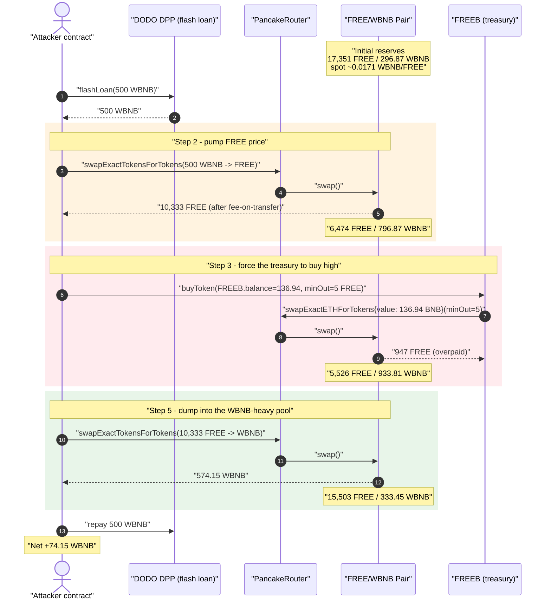
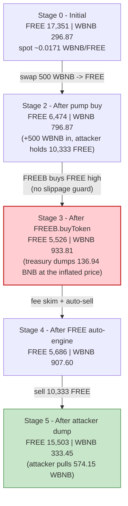
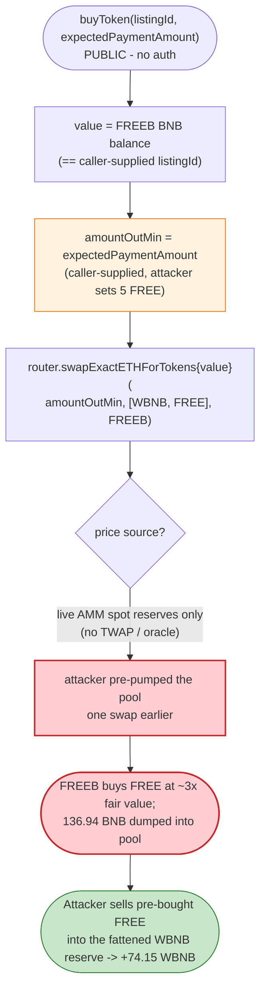

# Freedom (FREE / FREEB) Exploit — Slippage-less Treasury Buy at an Attacker-Manipulated Price

> **Reproduction:** the PoC compiles & runs in an isolated Foundry project at
> [this project folder](.) (the umbrella DeFiHackLabs repo contains many unrelated
> PoCs that do not whole-compile, so this one was extracted).
> Full verbose trace: [output.txt](output.txt).
> Verified source for the FREE token: [contracts_FREE.sol](sources/FreeDom_8A43Eb/contracts_FREE.sol).
> The vulnerable `FREEB.buyToken` lives in a closed-source proxy implementation
> (`0x8afEbC3244769a21504D73E94A56d56FE3698c25`); its behavior is reconstructed below
> directly from the execution trace.

---

## Key info

| | |
|---|---|
| **Loss** | **~74.15 WBNB** (≈ the BNB the `FREEB` "market-cap" contract wasted buying FREE high) |
| **Vulnerable contract** | `FREEB` proxy — [`0xAE3ADa8787245977832c6DaB2d4474D3943527Ab`](https://bscscan.com/address/0xAE3ADa8787245977832c6DaB2d4474D3943527Ab) (impl `0x8afEbC3244769a21504D73E94A56d56FE3698c25`) |
| **Companion token** | `FreeDom` (FREE) — [`0x8A43Eb772416f934DE3DF8F9Af627359632CB53F`](https://bscscan.com/address/0x8A43Eb772416f934DE3DF8F9Af627359632CB53F#code) |
| **Victim pool** | FREE/WBNB PancakePair — `0x24721eC014e19eA0e3c965AeE2b138cf4b72e941` |
| **Attacker EOA** | [`0x835b45d38cbdccf99e609436ff38e31ac05bc502`](https://bscscan.com/address/0x835b45d38cbdccf99e609436ff38e31ac05bc502) |
| **Attacker contract** | [`0x4512abb79f1f80830f4641caefc5ab33654a2d49`](https://bscscan.com/address/0x4512abb79f1f80830f4641caefc5ab33654a2d49) |
| **Attack tx** | [`0x309523343cc1bb9d28b960ebf83175fac941b4a590830caccff44263d9a80ff0`](https://bscscan.com/tx/0x309523343cc1bb9d28b960ebf83175fac941b4a590830caccff44263d9a80ff0) |
| **Chain / block / date** | BSC / fork at 35,123,710 (tx in 35,123,711) / Jan 2024 |
| **Funding** | DODO `DPP` flash loan (`0x6098A5638d8D7e9Ed2f952d35B2b67c34EC6B476`), 500 WBNB, fee-free |
| **Compiler** | FREE: Solidity v0.8.19 (opt 1/200); FREEB impl: v0.8.x; PoC built with Solc 0.8.34 |
| **Bug class** | Price-oracle / AMM-spot manipulation → un-slippage-protected treasury swap (`expectedPaymentAmount` controlled by caller) |

---

## TL;DR

`FREEB` is the "market-cap management" sidekick of the FREE token. It holds BNB in its own
treasury and exposes a **permissionless `buyToken(uint256 listingId, uint256 expectedPaymentAmount)`**
that performs a PancakeSwap **`swapExactETHForTokens`** spending `FREEB`'s own BNB on the
WBNB→FREE path, sending the bought FREE to `FREEB` itself.

The fatal detail (visible in the trace): the **amount of BNB spent and the minimum-output are both
caller-supplied** — the attacker calls `buyToken(FREEB.balance, 5e18)`, so `FREEB` spends its entire
**136.94 BNB** treasury and accepts as little as `5 FREE` out. There is no on-chain slippage guard, no
TWAP/oracle, and no access control.

The attack is a classic sandwich of the treasury's own buy:

1. **Flash-loan 500 WBNB** from DODO's `DPP`.
2. **Pump** the FREE/WBNB pool by swapping all 500 WBNB into FREE — FREE's spot price triples
   (pool goes from `17,351 FREE / 296.87 WBNB` to `6,474 FREE / 796.87 WBNB`).
3. **Make `FREEB` buy high** — call `buyToken(136.94e18, 5e18)`. `FREEB` market-buys FREE with its
   136.94 BNB at the inflated price, dumping that BNB into the pool (`→ 933.81 WBNB`) for almost
   no FREE in return.
4. **Dump** the attacker's 10,333 FREE back into the now-WBNB-heavy pool, pulling out **574.15 WBNB**.
5. **Repay** the 500 WBNB flash loan; keep the difference.

Net profit = **74.15 WBNB**, sourced almost entirely from the BNB `FREEB` burned buying FREE at a
price the attacker had set one swap earlier.

---

## Background — FREE + FREEB

`FreeDom` (FREE) ([contracts_FREE.sol:258-390](sources/FreeDom_8A43Eb/contracts_FREE.sol#L258-L390)) is a
fee-on-transfer "market-cap" token. Two of its quirks matter for the attack:

- **Auto-liquidity / auto-sell engine.** Every taxed transfer routes through
  `_beforeTokenTransfer → trigger(t)` ([:319-326](sources/FreeDom_8A43Eb/contracts_FREE.sol#L319-L326),
  [MktCap.trigger :223-253](sources/FreeDom_8A43Eb/contracts_FREE.sol#L223-L253)) and
  `_afterTokenTransfer → takeFee` ([:327-343](sources/FreeDom_8A43Eb/contracts_FREE.sol#L327-L343)).
  `takeFee` skims a fee in FREE and sends it to the contract; `trigger` periodically sells the
  accumulated FREE, withdraws WBNB, and pays "marketing" addresses (one of which is `FREEB`).
- **Dust-balance trick.** `balanceOf` returns `_initialBalance` (1 wei) for any account that holds 0
  ([:365-369](sources/FreeDom_8A43Eb/contracts_FREE.sol#L365-L369)) — cosmetic, not load-bearing here.

`FREEB` (`0xAE3ADa…527Ab`) is a separate upgradeable proxy. Its on-chain role is to spend a BNB
treasury to **buy FREE off the market** ("market-cap support"). It is *this* contract — not FREE
itself — that gets robbed.

On-chain facts at the fork block (from the trace):

| Fact | Value | Trace |
|---|---|---|
| Pool token0 / token1 | `token0 = FREE`, `token1 = WBNB` | swap `amount0Out` is FREE ([output.txt:1620](output.txt#L1620)) |
| Initial pool reserves | **17,351.17 FREE / 296.87 WBNB** (spot ≈ 0.0171 WBNB/FREE) | [output.txt:1617](output.txt#L1617) |
| `FREEB` BNB treasury | **136.94 BNB** | spent as `value` in [output.txt:1647](output.txt#L1647) |
| FREE `totalSupply` | 100,000 FREE | [output.txt:1687](output.txt#L1687) |

---

## The vulnerable code

### `FREEB.buyToken` — reconstructed from the trace

`FREEB`'s implementation is not verified on BscScan, but the delegatecall in the trace pins down its
behavior exactly. The external call and its arguments were:

```
FREEB::buyToken(listingId = 136938233021986089342, expectedPaymentAmount = 5e18)
  → 0x8afEbC…8c25::buyToken(...) [delegatecall]
      → Router::swapExactETHForTokens{value: 136938233021986089342}(
            5000000000000000000,                              // amountOutMin == expectedPaymentAmount
            [WBNB, FREE],                                     // path
            FREEB,                                            // recipient = the treasury itself
            deadline)
```
([output.txt:1643-1647](output.txt#L1643-L1647))

So, in effect:

```solidity
// FREEB (closed source) — behavior proven by the trace
function buyToken(uint256 listingId, uint256 expectedPaymentAmount) external {
    // listingId is used (directly or via lookup) as the BNB amount to spend,
    // and the call spends FREEB's *own* native balance.
    // expectedPaymentAmount is forwarded as amountOutMin — i.e. caller-chosen slippage.
    router.swapExactETHForTokens{ value: /* == listingId == FREEB.balance */ }(
        expectedPaymentAmount,        // ⚠️ caller-controlled minimum output
        [WBNB, FREE],
        address(this),                // bought FREE stays in FREEB
        block.timestamp
    );
}
```

The PoC calls it as:

```solidity
FREEB.buyToken(FREEBProxy.balance, 5 * 1e18);   // spend ALL of FREEB's BNB, accept ≥ 5 FREE
```
([test/Freedom_exp.sol:62](test/Freedom_exp.sol#L62))

### The companion FREE token's auto-engine (collateral mechanics)

The FREE-side transfers in the trace (fee skim of `20 FREE`, a `160 FREE` auto-sell, WBNB
`withdraw`, marketing payouts) are driven by `MktCap.trigger`:

```solidity
function trigger(uint t) internal canSwap(t) {
    ...
    if (toSell > 0) _sell(toSell);                      // dumps accrued FREE → WBNB
    IWBNB(token1).withdraw(IERC20(token1).balanceOf(address(this)));
    ...
    payable(marketingAddress[i]).transfer(cake);        // pays out, incl. FREEB
}
```
([contracts_FREE.sol:223-253](sources/FreeDom_8A43Eb/contracts_FREE.sol#L223-L253))

These movements are side effects of the attacker's FREE transfers; they do not defend the pool and
they hand a little extra BNB back to `FREEB`/marketing, but the dominant value flow is the
`buyToken` swap above.

---

## Root cause — why it was possible

`FREEB.buyToken` performs a **market swap using the protocol's own funds, priced entirely off the
instantaneous AMM spot reserve, with a caller-supplied minimum-output of effectively zero, and with
no access control.** Each of these alone is a smell; together they are a free piñata:

1. **Spot price is the only oracle.** `swapExactETHForTokens` prices BNB→FREE off the live pool
   reserves. Those reserves are trivially moved by a single preceding swap — exactly what a flash
   loan provides.
2. **Caller chooses the slippage bound.** `expectedPaymentAmount` is forwarded as `amountOutMin`.
   The attacker passes `5 FREE`, so the swap cannot revert no matter how badly `FREEB` overpays —
   the protocol's "don't get sandwiched" guard is handed to the adversary.
3. **Caller chooses (and maximizes) the spend.** The first argument resolves to `FREEB`'s entire
   `136.94 BNB` balance, so the attacker drains the treasury in one shot rather than nibbling.
4. **Permissionless.** Anyone can invoke `buyToken` at any moment, so the attacker decides *when* —
   i.e., right after they have skewed the pool and right before they unwind.

The economic result: `FREEB` buys FREE at ~3× its fair price, donating the overpayment into the pool
as WBNB. The attacker, holding the FREE they bought *before* the pump, sells into that fattened WBNB
reserve and walks away with the difference.

---

## Preconditions

- `FREEB` holds a non-trivial BNB treasury (136.94 BNB here) — the size of the prize.
- A FREE/WBNB AMM pool whose spot price is thin enough to move materially with the attacker's working
  capital. The 296.87-WBNB pool was easily tripled with a 500-WBNB flash loan.
- Working capital in WBNB to pre-pump the pool. It is fully recovered intra-transaction, so it is
  **flash-loanable** — the PoC borrows 500 WBNB from DODO's `DPP` (zero fee) and repays it in the
  same call ([test/Freedom_exp.sol:54,64](test/Freedom_exp.sol#L54-L64)).
- No on-chain restriction on who calls `buyToken` and no slippage/oracle guard inside it.

---

## Attack walkthrough (with on-chain numbers from the trace)

Pool is `token0 = FREE`, `token1 = WBNB`, so reserve0 = FREE, reserve1 = WBNB. All reserve figures
are taken from the `Sync` events in [output.txt](output.txt).

| # | Step | FREE reserve | WBNB reserve | Effect | Trace |
|---|------|-------------:|-------------:|--------|-------|
| 0 | **Initial** | 17,351.17 | 296.87 | Honest pool, spot ≈ 0.0171 WBNB/FREE. | [:1617](output.txt#L1617) |
| 1 | **Flash-loan** 500 WBNB from DODO `DPP` | 17,351.17 | 296.87 | Attacker now holds 500 WBNB; pool unchanged. | [:1591-1593](output.txt#L1591-L1593) |
| 2 | **Pump:** swap 500 WBNB → 10,876.89 FREE (fee-on-transfer nets attacker 10,333.04 FREE) | **6,474.28** | **796.87** | FREE spot ≈ tripled; attacker holds 10,333 FREE bought cheap. | [:1633-1641](output.txt#L1633-L1641) |
| 3 | **`FREEB.buyToken(136.94e18, 5e18)`** — `FREEB` spends 136.94 BNB on WBNB→FREE, gets 947.39 FREE (minus FoT) | **5,526.88** | **933.81** | Treasury buys FREE *high*; 136.94 WBNB dumped into pool. | [:1643-1672](output.txt#L1643-L1672) |
| 4 | FREE auto-engine side effects (fee skim 20 FREE, auto-sell 160 FREE → 26.21 WBNB to distributor, marketing payouts to FREEB / `0x41B6…`) | 5,686.88 | 907.60 | Minor; some BNB recycled back to FREEB. | [:1690-1771](output.txt#L1690-L1771) |
| 5 | **Dump:** swap 10,333.04 FREE → **574.15 WBNB** to attacker | 15,503.28 | 333.45 | Attacker unwinds into the WBNB-heavy pool. | [:1774-1791](output.txt#L1774-L1791) |
| 6 | **Repay** 500 WBNB to DODO `DPP` | — | — | Flash loan closed (fee-free). | [:1793-1798](output.txt#L1793-L1798) |

End state: attacker WBNB balance = **74.148897789587975743 WBNB**
([output.txt:1811-1813](output.txt#L1811-L1813)), starting from 0.

### Profit accounting (WBNB)

| Direction | Amount (WBNB) |
|---|---:|
| Flash-loan in | +500.00 |
| Spent — pump buy (step 2) | −500.00 |
| Received — dump sell (step 5) | +574.15 |
| Flash-loan repay (step 6) | −500.00 |
| **Net to attacker** | **+74.15** |

The 74.15 WBNB profit is, to within fee/rounding noise, the value `FREEB` destroyed in step 3:
it paid 136.94 WBNB into the pool but received FREE worth far less at honest prices, and the attacker
captured the bulk of that overpayment when unwinding. (Some of `FREEB`'s spend leaks to LPs and to the
FREE auto-engine's marketing payouts, which is why the attacker nets 74 of the 137 BNB rather than all
of it.)

---

## Diagrams

### Sequence of the attack



### Pool state evolution



### The flaw inside `FREEB.buyToken`



---

## Why each magic number

- **`flashLoan(500 WBNB)`** — sized so that swapping it all into FREE moves the 296-WBNB pool enough
  to roughly triple FREE's price, maximizing how much `FREEB` overpays in the next step while still
  being fully recoverable on the unwind.
- **`buyToken(FREEBProxy.balance, 5e18)`** — `FREEBProxy.balance` (136.94 BNB) forces `FREEB` to spend
  its *entire* treasury in a single buy; `5e18` is a throwaway `amountOutMin` (5 FREE) that guarantees
  the swap cannot revert on slippage even though `FREEB` is being grossly overcharged.
- **`WBNB.transfer(DODO, 500e18)`** — exact flash-loan repayment ([test/Freedom_exp.sol:64](test/Freedom_exp.sol#L64));
  DODO's `DPP` charges no fee, so 500 in = 500 out.

---

## Remediation

1. **Never price a treasury swap off raw AMM spot.** `buyToken` must reject manipulated prices: use a
   Chainlink/TWAP reference and revert if the pool's instantaneous price deviates beyond a small band
   from it.
2. **Set `amountOutMin` internally, not from the caller.** The minimum output must be computed by the
   contract from a trusted price (`expected = bnbIn × oraclePrice × (1 − maxSlippage)`), never passed
   in by whoever triggers the buy.
3. **Restrict who can trigger treasury actions.** Gate `buyToken` to an `onlyOwner`/keeper role, or at
   minimum make it un-sandwichable (commit-reveal / private mempool / per-block rate limit).
4. **Cap per-call spend.** Do not let a single call drain the whole BNB balance; bound it to a small
   percentage of treasury and/or a percentage of pool depth so one transaction cannot move the market.
5. **Add reentrancy / same-block guards** so a buy cannot be wrapped by an attacker's swaps within the
   same transaction.

---

## How to reproduce

The PoC was extracted into a standalone Foundry project (the umbrella DeFiHackLabs repo has many
unrelated PoCs that fail to whole-compile under `forge test`):

```bash
_shared/run_poc.sh 2024-01-Freedom_exp -vvvvv
```

- RPC: a **BSC archive** endpoint is required (fork block 35,123,710); most pruning public RPCs fail
  with `header not found` / `missing trie node` at this height. `foundry.toml`'s `bsc` alias must point
  to an archive node.
- Result: `[PASS] testExploit()` with the attacker's WBNB balance going `0 → 74.148…`.

Expected tail:

```
Ran 1 test for test/Freedom_exp.sol:ContractTest
[PASS] testExploit() (gas: 506716)
Logs:
  Attacker WBNB balance before attack:: 0
  Attacker WBNB balance before attack:: 74148897789587975743

Suite result: ok. 1 passed; 0 failed; 0 skipped
```

(The second log reuses the same label; it is the *post*-attack balance — `74.148897789587975743` WBNB
of profit.)

---

*Reference: DeFiHackLabs `2024-01/Freedom_exp.sol`; SlowMist Hacked — https://hacked.slowmist.io/ (FREE/FREEB, BSC).*
