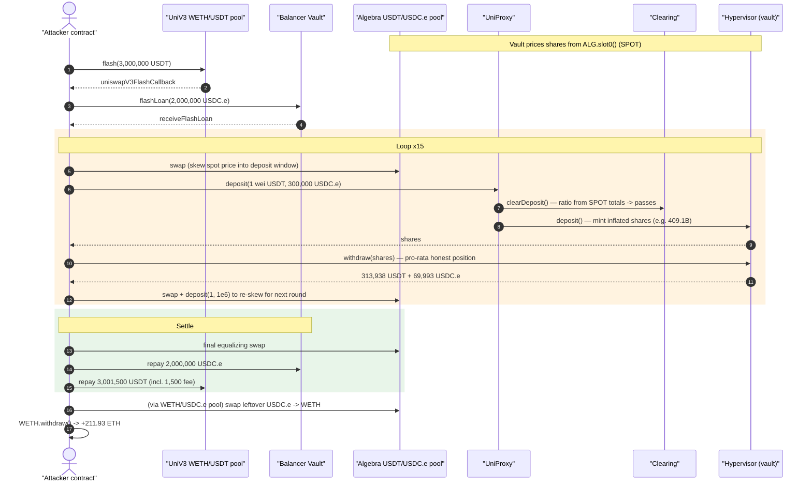
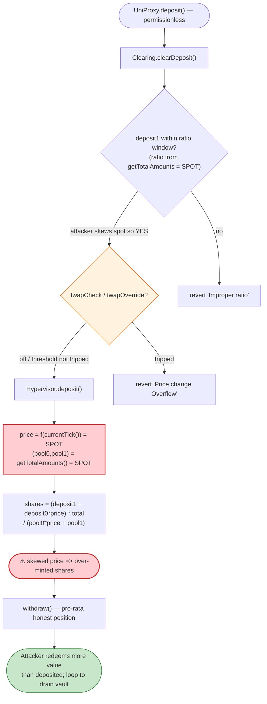
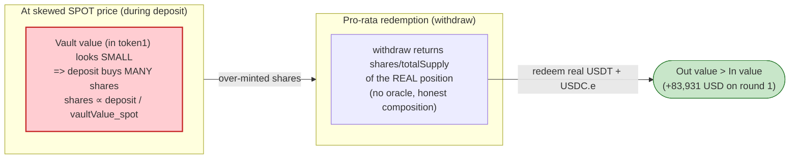

# Gamma Strategies (UniProxy / Hypervisor) Exploit — Spot-Price Vault-Share Inflation

> **Vulnerability classes:** vuln/oracle/spot-price · vuln/oracle/price-manipulation

> **One-line summary:** The Gamma `Hypervisor` mints LP shares using the **spot price** of its underlying Algebra (Uniswap-V3-style) pool, and the `UniProxy`/`Clearing` "Improper ratio" gate is computed from those same spot-derived reserves — so an attacker who flash-loans capital, skews the pool's spot price, and then deposits/withdraws in a tight loop repeatedly over-mints shares and walks off with the vault's genuine liquidity.

> **Reproduction:** the PoC compiles & runs in an isolated Foundry project at
> [this project folder](.) (the umbrella DeFiHackLabs repo has many PoCs that do
> not whole-compile, so this one was extracted). Full verbose trace:
> [output.txt](output.txt). Verified vulnerable sources:
> [Hypervisor.sol](sources/UniProxy_1F1Ca4/contracts_Hypervisor.sol),
> [UniProxy.sol](sources/UniProxy_1F1Ca4/contracts_UniProxy.sol),
> [Clearing.sol](sources/UniProxy_1F1Ca4/contracts_Clearing.sol).

---

## Key info

| | |
|---|---|
| **Loss** | **~$6.3M** across Gamma's affected Hypervisors (multiple vaults drained in the incident). This PoC reproduces the USDT/USDC.e vault drain, netting **211.93 WETH** to the attack contract in a single transaction. |
| **Vulnerable contracts** | `UniProxy` [`0x1F1Ca4e8236CD13032653391dB7e9544a6ad123E`](https://arbiscan.io/address/0x1F1Ca4e8236CD13032653391dB7e9544a6ad123E#code) + the `Hypervisor` (Gamma vault) + `Clearing` `0x1f7792eD527A399159583730017cdB5003D57f4F` |
| **Victim vault (this PoC)** | USDT/USDC.e `Hypervisor` — `0x61A7b3dae70D943C6f2eA9ba4FfD2fEcc6AF15E4` |
| **Manipulated pool** | Algebra (Quickswap V3) USDT/USDC.e pool — `0x3AB5DD69950a948c55D1FBFb7500BF92B4Bd4C48` |
| **Attacker EOA** | `0x5351536145610aa448a8bf85ba97c71caf31909c` |
| **Attack contract** | `0xfd42cba85f6567fef32bab24179de21b9851b63e` |
| **Attack tx** | [`0x025cf2858723369d606ee3abbc4ec01eab064a97cc9ec578bf91c6908679be75`](https://arbiscan.io/tx/0x025cf2858723369d606ee3abbc4ec01eab064a97cc9ec578bf91c6908679be75) |
| **Chain / block / date** | Arbitrum / fork at 166,873,291 / Jan 4, 2024 |
| **Compiler (victim)** | Solidity v0.7.6, optimizer 800 runs (Algebra pool: 0 runs) |
| **Bug class** | Spot-price LP-share inflation (oracle/price manipulation of vault accounting) |

Token map (both 6-decimal stablecoins; pool `token0 = USDT`, `token1 = USDC.e`):

| Symbol | Address | Decimals |
|---|---|---|
| USDT  | `0xFd086bC7CD5C481DCC9C85ebE478A1C0b69FCbb9` | 6 |
| USDC.e | `0xFF970A61A04b1cA14834A43f5dE4533eBDDB5CC8` | 6 |
| WETH  | `0x82aF49447D8a07e3bd95BD0d56f35241523fBab1` | 18 |

---

## TL;DR

Gamma's `Hypervisor` is an automated Uniswap-V3/Algebra liquidity-manager. Users deposit
token0+token1 through `UniProxy.deposit`; the proxy asks `Clearing.clearDeposit` to validate
the deposit ratio, then the `Hypervisor` mints LP shares.

Both the validation and the mint read the pool's **instantaneous price**:

- `Hypervisor.deposit` computes `price` from `currentTick()` (= `pool.slot0()`'s tick) and computes vault totals from `getTotalAmounts()`, which prices both positions at the live `slot0()` sqrtPrice ([Hypervisor.sol:125-142](sources/UniProxy_1F1Ca4/contracts_Hypervisor.sol#L125-L142), [:490-563](sources/UniProxy_1F1Ca4/contracts_Hypervisor.sol#L490-L563)).
- `Clearing.clearDeposit`'s "Improper ratio" gate calls `getDepositAmount` → `applyRatio(total0, total1)`, again using the spot-derived totals ([Clearing.sol:112-204](sources/UniProxy_1F1Ca4/contracts_Clearing.sol#L112-L204)).

The only price-manipulation defense is `checkPriceChange`, a TWAP-vs-spot comparison gated by
`twapCheck`/`twapOverride` ([Clearing.sol:211-223](sources/UniProxy_1F1Ca4/contracts_Clearing.sol#L211-L223)).
Its configured parameters (a wide `priceThreshold`, a long `twapInterval`) and its
fundamentally bounded design do **not** stop a same-block spot skew on a tight, deep stable pool.

The attacker therefore:

1. Flash-loans **3,000,000 USDT** (Uniswap-V3 `flash` on the WETH/USDT pool) and
   **2,000,000 USDC.e** (Balancer `flashLoan`).
2. **Swaps in the Algebra pool to skew its spot price** so the vault's reported `total0:total1`
   ratio lands inside the narrow deposit-ratio window for a lopsided deposit (1 wei USDT :
   300,000 USDC.e).
3. **Deposits → withdraws** through `UniProxy`/`Hypervisor` 15 times in a loop, each round
   minting more shares than the deposited assets are honestly worth and redeeming proportional
   underlying — siphoning the vault's real USDT/USDC.e a slice at a time. Between rounds it
   swaps to re-skew the price back into the deposit window.
4. **Repays both flash loans**, swaps the leftover USDC.e for WETH on the WETH/USDC.e pool,
   and unwraps.

Result: **211.93 WETH** profit to the attack contract for the USDT/USDC.e vault — the trace's
final log reads `Earned 211 ETH`.

---

## Background — what Gamma's Hypervisor does

A Gamma `Hypervisor` is an ERC-20 LP-share token wrapping an active Uniswap-V3 / Algebra
concentrated-liquidity position (a "base" range + a "limit" range). Depositors get fungible
shares; Gamma's keeper rebalances the underlying ranges.

The intended deposit flow is two-step:

```
user → UniProxy.deposit(deposit0, deposit1, to, hypervisor, minIn)
         │  require clearance.clearDeposit(...)        // ratio + (optional) TWAP gate
         └→ Hypervisor.deposit(deposit0, deposit1, to, from, inMin)  // mints shares
              require clearance.clearShares(...)        // max-supply gate
```

The `Hypervisor.deposit` mint formula is the heart of the matter
([Hypervisor.sol:110-164](sources/UniProxy_1F1Ca4/contracts_Hypervisor.sol#L110-L164)):

```solidity
uint160 sqrtPrice = TickMath.getSqrtRatioAtTick(currentTick());          // ← SPOT tick
uint256 price = FullMath.mulDiv(uint256(sqrtPrice).mul(sqrtPrice), PRECISION, 2**(96*2));

(uint256 pool0, uint256 pool1) = getTotalAmounts();                      // ← SPOT-priced totals

shares = deposit1.add(deposit0.mul(price).div(PRECISION));               // value deposit in token1 terms
...
uint256 total = totalSupply();
if (total != 0) {
  uint256 pool0PricedInToken1 = pool0.mul(price).div(PRECISION);
  shares = shares.mul(total).div(pool0PricedInToken1.add(pool1));        // shares ∝ deposit / vaultValue
}
_mint(to, shares);
```

`getTotalAmounts()` itself is fully spot-driven — it values both LP positions through
`_amountsForLiquidity`, which reads `pool.slot0()`
([Hypervisor.sol:490-495](sources/UniProxy_1F1Ca4/contracts_Hypervisor.sol#L490-L495),
[:550-563](sources/UniProxy_1F1Ca4/contracts_Hypervisor.sol#L550-L563)):

```solidity
function _amountsForLiquidity(int24 tickLower, int24 tickUpper, uint128 liquidity)
    internal view returns (uint256, uint256) {
    (uint160 sqrtRatioX96, , , , , , ) = pool.slot0();                    // ← SPOT
    return LiquidityAmounts.getAmountsForLiquidity(sqrtRatioX96, ..., liquidity);
}
```

`withdraw` redeems shares back to underlying **pro-rata** by burning the corresponding Uniswap
liquidity and forwarding proportional unused balances
([Hypervisor.sol:217-262](sources/UniProxy_1F1Ca4/contracts_Hypervisor.sol#L217-L262)). It does
**not** re-price against any oracle — it just returns `shares / totalSupply` of the actual
position. So if `deposit` over-mints shares at a skewed price, `withdraw` cashes those shares
out against the honest pool composition.

---

## The vulnerable code

### 1. Share mint uses spot price and spot-valued totals

[`Hypervisor.deposit`](sources/UniProxy_1F1Ca4/contracts_Hypervisor.sol#L110-L164):

```solidity
uint160 sqrtPrice = TickMath.getSqrtRatioAtTick(currentTick());   // currentTick() = pool.slot0().tick
uint256 price = FullMath.mulDiv(uint256(sqrtPrice).mul(sqrtPrice), PRECISION, 2**(96*2));
(uint256 pool0, uint256 pool1) = getTotalAmounts();               // priced at slot0()
shares = deposit1.add(deposit0.mul(price).div(PRECISION));
...
shares = shares.mul(total).div(pool0PricedInToken1.add(pool1));   // ⚠️ denominator is spot-priced vault value
_mint(to, shares);
```

Because `price`, `pool0` and `pool1` all move with the live `slot0()`, the denominator
`pool0PricedInToken1 + pool1` (the vault's "value in token1") and the numerator
`deposit1 + deposit0*price` can be pushed apart by skewing the pool's spot price. With the right
skew the same physical deposit mints **more shares** than it should.

### 2. The "Improper ratio" gate is also spot-derived

[`Clearing.clearDeposit`](sources/UniProxy_1F1Ca4/contracts_Clearing.sol#L112-L151) →
[`getDepositAmount`](sources/UniProxy_1F1Ca4/contracts_Clearing.sol#L159-L181) →
[`applyRatio`](sources/UniProxy_1F1Ca4/contracts_Clearing.sol#L190-L204):

```solidity
(uint256 total0, uint256 total1) = IHypervisor(pos).getTotalAmounts();   // ⚠️ SPOT again
...
ratioStart = FullMath.mulDiv(total0.mul(depositDelta), 1e18, total1.mul(deltaScale));
ratioEnd   = FullMath.mulDiv(total0.mul(deltaScale), 1e18, total1.mul(depositDelta));
// require deposit1 within [test1Min, test1Max] derived from this ratio
```

This check is meant to force deposits to match the vault's current asset ratio. But since
`total0/total1` is computed from the manipulable `slot0()`, the attacker simply moves the spot
price until the ratio window admits their intentionally-lopsided deposit. The gate validates the
deposit against the **same manipulated state** the mint trusts — it adds no independent
protection.

### 3. The TWAP guard is optional and bounded

[`Clearing.checkPriceChange`](sources/UniProxy_1F1Ca4/contracts_Clearing.sol#L211-L223) only runs
when `twapCheck || p.twapOverride`, and it compares spot to a `getSqrtTwapX96(_twapInterval)`
TWAP against a percentage `priceThreshold`:

```solidity
if (price.mul(100).div(priceBefore) > _priceThreshold ||
    priceBefore.mul(100).div(price) > _priceThreshold)
  revert("Price change Overflow");
```

In the live state the configured threshold/interval did not trip: the trace shows the TWAP being
queried (`getTimepoints([86400, 0])` at [output.txt:1807](output.txt)) and the deposit clearing
without a `"Price change Overflow"` revert. A coarse percentage band around a 1-day TWAP cannot
distinguish a legitimate move from a flash-loan-funded same-block skew on a deep stable pool — and
in any case the binding constraint here is the spot-derived **ratio** gate, not the TWAP.

---

## Root cause — why it was possible

> **Vault share price (mint and the deposit-ratio gate) is derived from the underlying pool's
> instantaneous `slot0()` price, which an attacker can move atomically within the exploit
> transaction using flash-loaned capital. Redemption (`withdraw`) is pro-rata against the honest
> position. The mint-vs-redeem asymmetry under a manipulable price lets the attacker extract more
> value than they deposit.**

Four design decisions compose into the bug:

1. **Spot price in `deposit`.** `currentTick()` / `slot0()` are used directly for both the per-
   token valuation (`price`) and the vault total valuation (`getTotalAmounts`). Any state read
   from `slot0()` is manipulable by a same-block swap.
2. **The validation reuses the manipulated state.** `clearDeposit`'s ratio window is computed from
   the very same spot-priced totals, so it cannot serve as a sanity check on the mint — both sides
   move together.
3. **The TWAP guard is weak/bypassable.** It is opt-in, threshold-based, and oriented against
   slow drift, not a same-block atomic skew; with the deployed parameters it did not fire.
4. **Redemption is honest/pro-rata.** `withdraw` returns `shares/totalSupply` of the real
   position with no oracle. Over-minted shares therefore redeem into real assets. Looping the
   deposit→withdraw cycle compounds the leak while keeping each step within the ratio window.

This is the canonical "first-deposit / share-inflation via manipulable price" class applied to a
concentrated-liquidity vault, rather than the simpler ERC-4626 first-depositor donation variant.

---

## Preconditions

- A Gamma `Hypervisor` whose `clearance` (Clearing) does **not** enforce an effective TWAP guard
  against same-block manipulation (here the configured threshold/interval did not trip).
- The underlying Algebra/Uniswap pool is manipulable within one transaction — true for any pool
  where flash-loaned size dwarfs in-range liquidity (a stable USDT/USDC.e pool with a narrow tick
  band qualifies).
- Working capital sourced atomically: **3,000,000 USDT** via Uniswap-V3 `flash`
  ([output.txt:1573](output.txt)) and **2,000,000 USDC.e** via Balancer `flashLoan`
  ([output.txt:1594](output.txt)). Both are repaid intra-transaction, so the attack is
  effectively capital-free aside from the **1,500 USDT** Uniswap flash fee
  ([output.txt:15814](output.txt), `3,001,500,000,000` repaid vs `3,000,000,000,000` borrowed).
- `UniProxy.deposit` is permissionless; deposits flow to the attacker's own `to` address and are
  immediately withdrawn.

---

## Attack walkthrough (with on-chain numbers from the trace)

Pool prices are read as Algebra `globalState().price` (sqrtP, Q64.96) / `tick`. The vault holds
USDT (`token0`) and USDC.e (`token1`), both 6-decimals. All figures below are taken directly from
[output.txt](output.txt).

| # | Step | Trace ref | Concrete numbers |
|---|------|-----------|------------------|
| 0 | **Initial vault state** | [output.txt:1747](output.txt), [:1760](output.txt) | Algebra spot tick `5`, sqrtP `7.924e28`. Vault `getTotalAmounts ≈ 1,346,xxx USDT-equivalent`, `totalSupply ≈ 1.339e12` shares. |
| 1 | **UniV3 flash** 3,000,000 USDT from WETH/USDT pool `0x641C…` | [output.txt:1573](output.txt) | `flash(this, 0, 3_000_000e6, "")` |
| 2 | **Balancer flash** 2,000,000 USDC.e (fee 0) | [output.txt:1594](output.txt) | `flashLoan([USDC.e],[2_000_000e6])` |
| 3 | **Skew Algebra spot** — swap USDT→USDC.e (and back) to move the price into the deposit window | [output.txt:1619](output.txt), [:1677](output.txt) | First skew swap drops tick `5 → -3112` (sqrtP `7.924e28 → 6.781e28`). |
| 4 | **Deposit** `(1 wei USDT, 300,000 USDC.e)` → mint inflated shares | [output.txt:1737](output.txt), [:2053](output.txt) | clearDeposit passes; `Deposit(... shares=409,106,149,215, d0=1, d1=300,000e6)`. |
| 5 | **Withdraw** the freshly-minted shares pro-rata | [output.txt:2062](output.txt), [:2160](output.txt) | `Withdraw(... shares=409,106,149,215 → 313,937.95 USDT + 69,993.10 USDC.e)`. **In: 300,000 USDC.e + 1 wei USDT; Out: 313,938 USDT + 69,993 USDC.e ≈ +83,931 USD of value.** |
| 6 | **Re-skew + small deposit** `(1, 1e6)` to nudge the ratio/tick back, then repeat | [output.txt:2308](output.txt), [:2724](output.txt) | tick oscillates `-3112 → 1157 → -1959 → 1157 …` across rounds. |
| 7 | **Loop ×15** of {skew → deposit(1,3e11) → withdraw → deposit(1,1e6)} | [output.txt:98-113 (PoC)](test/Gamma_exp.sol#L98-L113) | Shares minted per large deposit climb `409.1B → 751.7B` as the pool thins; cumulative withdraws total **3,973,255 USDT + 1,261,523 USDC.e**. |
| 8 | **Final equalizing swap** to net out balances and **repay** both flash loans | [output.txt:114-118 (PoC)](test/Gamma_exp.sol#L114-L118), [:15814](output.txt) | UniV3 repaid `3,001,500e6` USDT (3M + 1,500 fee); Balancer repaid `2,000,000e6` USDC.e. |
| 9 | **Swap leftover USDC.e → WETH** on WETH/USDC.e pool `0xC31E…`, then `WETH.withdraw` | [output.txt:15842](output.txt), [:15897](output.txt) | swap `473,566.52 USDC.e → WETH`; final WETH balance `211,931,772,755,607,189,177` wei. |
| 10 | **Profit** | [output.txt (tail)](output.txt) | `console.log("Earned 211 ETH")` → **211.93 WETH**. |

**Why depositing 300,000 USDC.e returns 313,938 USDT + 69,993 USDC.e:** the share count
`shares = (deposit1 + deposit0·price) · totalSupply / (pool0·price + pool1)` is inflated because
the skewed `price` shrinks the apparent vault value `(pool0·price + pool1)` relative to the
deposit's valued amount. Those inflated shares then redeem `shares/totalSupply` of the **honest**
position, pulling out both the real USDT side (which the attacker barely contributed) and a chunk
of USDC.e — net positive each round. Repeating in a loop drains the vault's genuine liquidity into
the attacker's balances, which are finally converted to WETH.

---

## Profit / loss accounting

For the USDT/USDC.e vault reproduced here (units: token native, 6-dec stables):

| Flow | Amount |
|---|---:|
| UniV3 flash borrowed (USDT) | 3,000,000 |
| Balancer flash borrowed (USDC.e) | 2,000,000 |
| UniV3 flash repaid (USDT, incl. 1,500 fee) | 3,001,500 |
| Balancer flash repaid (USDC.e, fee 0) | 2,000,000 |
| Cumulative vault withdraws (USDT) | 3,973,255 |
| Cumulative vault withdraws (USDC.e) | 1,261,523 |
| **Final WETH kept by attack contract** | **211.93 WETH** |

The attacker recovers 100% of the flash-loaned principal (minus the 1,500 USDT UniV3 fee) and
keeps the extracted value, converted to **211.93 WETH** for this vault. The headline incident
loss of **~$6.3M** spans all of Gamma's affected Hypervisors drained in the campaign using the
same technique.

---

## Diagrams

### Sequence of the attack



### Where the bug lives (deposit path)



### Why mint-vs-redeem asymmetry leaks value



---

## Why each magic number

- **`flash(0, 3_000_000e6)` USDT + `flashLoan(2_000_000e6)` USDC.e:** working capital large enough
  to (a) move the deep stable Algebra pool's spot price meaningfully and (b) fund the
  300,000-USDC.e-per-round deposits. Both repaid in-tx.
- **`deposit(1, 300_000_000_000)` = (1 wei USDT, 300,000 USDC.e):** a deliberately lopsided
  deposit. After the spot skew, the vault's ratio window admits it, and the inflated share count
  redeems disproportionately into the USDT side the attacker barely funded.
- **`deposit(1, 1_000_000)` = (1 wei USDT, 1 USDC.e):** a tiny "nudge" deposit used between rounds
  to keep the vault's tracked ratio/`totalSupply` positioned for the next large round.
- **`calculatePrice()` = `globalState().price * 85_572 / 100_000`** ([Gamma_exp.sol:56-59](test/Gamma_exp.sol#L56-L59)):
  the precise sqrt-price limit fed to each Algebra `swap` so the skew lands the spot price exactly
  inside the deposit-ratio window rather than overshooting it.
- **15 loop iterations** ([Gamma_exp.sol:98](test/Gamma_exp.sol#L98)): each round only extracts a
  slice of the vault (to stay within the ratio window and available depth); 15 rounds compound the
  drain to the full profit.

---

## Remediation

1. **Never price vault shares from spot (`slot0()`).** Compute `getTotalAmounts()`, the per-token
   `price`, and the deposit-ratio window from a **manipulation-resistant oracle** (a sufficiently
   long Uniswap/Algebra TWAP, or an external oracle), not from the instantaneous tick.
2. **Make the TWAP guard mandatory and tight.** Enforce `checkPriceChange` unconditionally with a
   short, conservative `priceThreshold` so that any same-block spot deviation from the TWAP reverts
   the deposit. A long-interval, wide-threshold opt-in guard is not a defense.
3. **Don't validate against the same manipulated state you mint from.** The "Improper ratio" gate
   must use the oracle price, otherwise it provides zero independent protection.
4. **Add a deposit/withdraw same-block / atomicity guard.** Disallow withdrawing shares minted in
   the same transaction (or charge a fee/lock), which alone neutralizes the deposit→withdraw loop
   even under a transient skew.
5. **Bound single-operation share issuance.** Cap how many shares one deposit can mint relative to
   `totalSupply` and the deposited notional, so a mispriced mint cannot disproportionately dilute.

(Gamma's published fix moved the Hypervisor/UniProxy to enforce TWAP-based price checks on the
deposit path and tightened the clearance configuration.)

---

## How to reproduce

The PoC was extracted into a standalone Foundry project (the umbrella DeFiHackLabs repo has many
PoCs that fail under a whole-project `forge build`):

```bash
_shared/run_poc.sh 2024-01-Gamma_exp --mt testExploit -vvvvv
```

- RPC: an **Arbitrum archive** endpoint is required (fork block 166,873,291). Most public Arbitrum
  RPCs prune that far back and fail with `header not found` / `missing trie node`.
- Result: `[PASS] testExploit()`. The final console line reports the profit.

Expected tail:

```
    ├─ [0] console::log("Earned %s ETH", 211) [staticcall]
    │   └─ ← [Stop]
    └─ ← [Stop]

Suite result: ok. 1 passed; 0 failed; 0 skipped; finished in 72.93s (...)
Ran 1 test suite in ...: 1 tests passed, 0 failed, 0 skipped (1 total tests)
```

---

*References: shouc / BlockSec — https://twitter.com/shoucccc/status/1742765618984829326 ;
Officer's Notes — https://twitter.com/officer_cia/status/1742772207997050899 ;
SlowMist Hacked — https://hacked.slowmist.io/ (Gamma Strategies, Arbitrum, ~$6.3M).*
