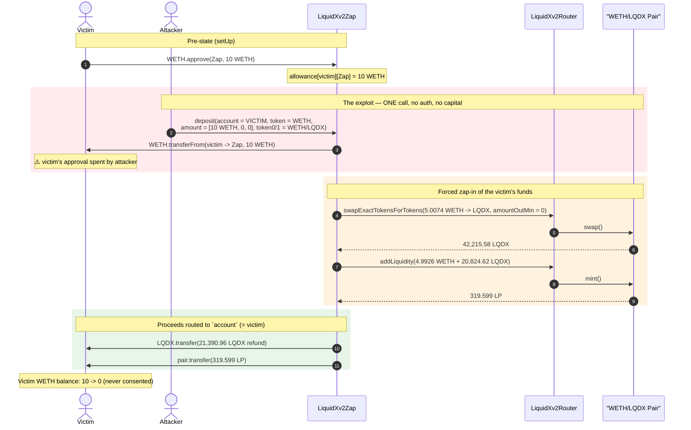
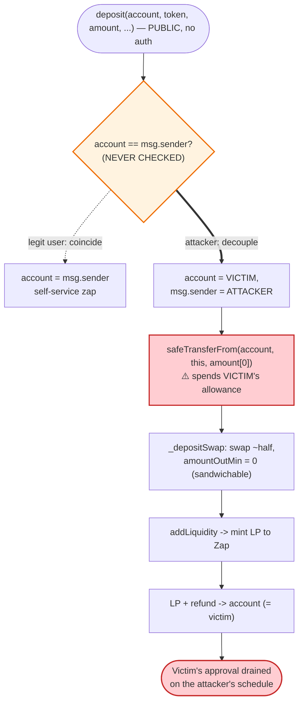
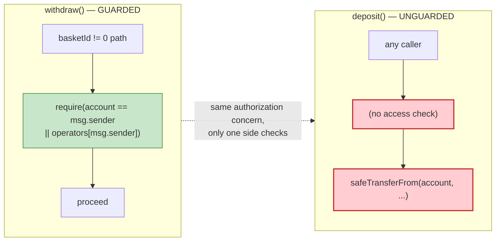

# LQDX / LiquidXv2Zap Exploit — Arbitrary-`account` `deposit()` Spends Anyone's Approval

> **Reproduction:** the PoC compiles & runs in an isolated Foundry project at
> [this project folder](.) (the umbrella DeFiHackLabs repo contains many unrelated PoCs that
> do not whole-compile, so this one was extracted).
> Full verbose trace: [output.txt](output.txt).
> Verified vulnerable source: [contracts_LiquidXv2Zap.sol](sources/LiquidXv2Zap_364f17/contracts_LiquidXv2Zap.sol).

---

## Key info

| | |
|---|---|
| **Loss** | Every WETH (or any token) a user has *approved* to the Zap is spendable by anyone. This PoC drains a victim's **10 WETH** approval; the live incident swept all outstanding approvals (SlowMist: ~$220K reported across affected users). |
| **Vulnerable contract** | `LiquidXv2Zap` — [`0x364f17A23AE4350319b7491224d10dF5796190bC`](https://etherscan.io/address/0x364f17a23ae4350319b7491224d10df5796190bc#code) |
| **Victim pool** | WETH/LQDX LiquidXv2 pair — [`0x1884C3D0ac1A3ACF0698b2a19866cee4cE27c31A`](https://etherscan.io/address/0x1884C3D0ac1A3ACF0698b2a19866cee4cE27c31A) |
| **LQDX token** | [`0x872952d3c1Caf944852c5ADDa65633F1Ef218A26`](https://etherscan.io/address/0x872952d3c1Caf944852c5ADDa65633F1Ef218A26) |
| **Attacker (PoC)** | EOA `0x000…Bad` (any address works — no authorization required) |
| **Disclosure** | SlowMist alert — https://twitter.com/SlowMist_Team/status/1744972012865671452 |
| **Chain / fork block / date** | Ethereum mainnet / 19,165,893 / ~Jan 2024 |
| **Compiler** | Solidity v0.8.19, optimizer 200 runs |
| **Bug class** | Missing `account == msg.sender` check → arbitrary spending of third-party ERC20 approvals (broken access control on a "deposit-for" function) |

---

## TL;DR

`LiquidXv2Zap.deposit()` lets the caller pass an arbitrary `account` address and then pulls funds
**from that `account`** via `safeTransferFrom`
([contracts_LiquidXv2Zap.sol:397-440](sources/LiquidXv2Zap_364f17/contracts_LiquidXv2Zap.sol#L397-L440)):

```solidity
function deposit(address account, address token, ... ) public payable returns(uint256) {
    ...
    IERC20(token).safeTransferFrom(account, address(this), amount[0]);   // ← pulls from `account`, not msg.sender
    ...
}
```

There is **no check that `account == msg.sender`**. The amount pulled (`amount[0]`) is fully
attacker-controlled. So **anyone** who has *approved* the Zap (a normal, expected step before using a
zap-in product) can have their entire allowance spent at any moment by any third party. The
attacker simply calls `deposit(victim, …)` with `amount[0]` set to the victim's outstanding allowance.

The victim's tokens are then swapped and zapped into LP — the resulting LP (and dust refund) is sent
back to the victim, but the victim never authorized this transaction, never chose the timing, and the
forced swap exposes them to sandwich/MEV extraction on the swap leg. In the wild this is a classic
**approval-drain**: the attacker front-runs every address with a live allowance and force-spends it.

---

## Background — what LiquidXv2Zap does

`LiquidXv2Zap` ([source](sources/LiquidXv2Zap_364f17/contracts_LiquidXv2Zap.sol)) is a "zap-in"
helper for the LiquidX V2 DEX. The intended flow for a user is:

1. The user `approve()`s the Zap to spend some token (e.g. WETH).
2. The user calls `deposit(...)`, which: pulls the token, swaps roughly half of it into the paired
   token (`_depositSwap`, [:513-545](sources/LiquidXv2Zap_364f17/contracts_LiquidXv2Zap.sol#L513-L545)),
   adds both sides as liquidity (`addLiquidity`,
   [:425](sources/LiquidXv2Zap_364f17/contracts_LiquidXv2Zap.sol#L425)), refunds the leftover reserve
   token, and hands the user the LP tokens
   ([:427-432](sources/LiquidXv2Zap_364f17/contracts_LiquidXv2Zap.sol#L427-L432)).

The "deposit on behalf of" capability is by-design — `deposit()` takes an `account` so an operator
could zap on someone's behalf. But the function is `public` with no operator gate, and it uses
`account` as the **funding source**, not as a mere bookkeeping label. That is the bug.

On-chain parameters at the fork block (WETH/LQDX pair, `token0 = LQDX`, `token1 = WETH`):

| Parameter | Value |
|---|---|
| Pool LQDX reserve (`reserve0`) | 83,432.26 LQDX |
| Pool WETH reserve (`reserve1`) | 4.874210 WETH |
| Victim WETH balance | 10 WETH |
| Victim allowance granted to Zap | 10 WETH |
| Zap's own WETH balance | 0 |

---

## The vulnerable code

### 1. `deposit()` pulls from an arbitrary `account`

```solidity
// contracts_LiquidXv2Zap.sol:397-411
function deposit(address account, address token, address tokenM, swapPath calldata path,
                 address token0, address token1, uint256[3] calldata amount, uint256 basketId)
    public payable returns(uint256)
{
    address pair = ILiquidXv2Factory(factory).getPair(token0, token1);
    require(pair != address(0), "LiquidXv2Zap: no pair");

    uint256[6] memory lvar;
    lvar[3] = msg.value;
    address inToken = token;
    if (token != address(0)) {
        lvar[3] = IERC20(token).balanceOf(address(this));
        IERC20(token).safeTransferFrom(account, address(this), amount[0]);  // ⚠️ funds come FROM `account`
        lvar[3] = IERC20(token).balanceOf(address(this)) - lvar[3];
    }
    ...
}
```

`account` is a free parameter; `amount[0]` is a free parameter; `msg.sender` is never compared to
`account`. The only constraint is that `account` must have a standing allowance on the Zap — which
is exactly the state every legitimate user puts themselves in.

### 2. The proceeds are routed to `account`, but that does not make the victim whole

The LP and the leftover-token refund are sent to `account`
([:426-432](sources/LiquidXv2Zap_364f17/contracts_LiquidXv2Zap.sol#L426-L432)):

```solidity
_refundReserveToken(account, token0, token1, lvar[4]-lvar[0], lvar[5]-lvar[1]);
if (basketId == 0) {
    IERC20(pair).safeTransfer(account, lvar[2]);   // LP tokens → account
} else {
    _addBalance(account, pair, basketId, lvar[2]);
}
```

This is what made the bug look "harmless" at a glance — the victim does receive *something* back. But
the victim (a) never consented to the transaction, (b) had their entire allowance drained on the
attacker's schedule, and (c) was force-pushed through an on-chain swap
(`_depositSwap` → `swapExactTokensForTokens` with `amountOutMin = 0`,
[:534](sources/LiquidXv2Zap_364f17/contracts_LiquidXv2Zap.sol#L534)) at whatever price the attacker
engineered — a zero-slippage swap that is trivially sandwichable for direct theft.

> Compare with `withdraw()` ([:442-455](sources/LiquidXv2Zap_364f17/contracts_LiquidXv2Zap.sol#L442-L455)),
> which **does** gate the privileged path:
> `require(account == msg.sender || operators[msg.sender], "LiquidXv2Zap: no access");`
> The same check is conspicuously **absent** from `deposit()`.

---

## Root cause — why it was possible

A "do X on behalf of `account`" function that moves `account`'s funds **must** verify that the caller
is authorized to act for `account` — either `msg.sender == account` or an explicit
operator/allowance-to-act relationship. `LiquidXv2Zap.deposit()` conflates *two distinct meanings* of
`account`:

1. **Funding source** — whose `transferFrom` allowance is consumed (line 409).
2. **Beneficiary** — who receives the LP and refunds (lines 426-432).

For a self-service zap these coincide (`account == msg.sender`), so the missing check is invisible in
normal use. But because `account` is caller-supplied and unchecked, an attacker decouples them: they
make the **victim** the funding source while the transaction is initiated by themselves. The victim's
ERC20 `approve()` — a grant of spending power to the *contract*, not to any particular caller — is
thereby spendable by everyone, because the contract will forward that power to whatever `account` the
caller names.

Two design facts compound it:

- **No operator gate on `deposit()`.** Unlike `withdraw()`, there is no
  `account == msg.sender || operators[msg.sender]` guard.
- **The internal swap uses `amountOutMin = 0`** ([:534](sources/LiquidXv2Zap_364f17/contracts_LiquidXv2Zap.sol#L534)).
  Even setting aside the consent issue, force-routing a victim's funds through a zero-slippage swap
  lets the attacker bundle a sandwich and convert "forced deposit" into outright extraction.

---

## Preconditions

- The victim has a **non-zero allowance** to `LiquidXv2Zap` for some token (the ordinary pre-state for
  anyone who has ever used, or intends to use, the zap). In the PoC the victim approves 10 WETH in
  `setUp()` ([test/LQDX_alert_exp.sol:77-78](test/LQDX_alert_exp.sol#L77-L78)).
- A valid `token0/token1` pair exists in the LiquidXv2 factory (here WETH/LQDX).
- **No capital, no flash loan, and no special role are required by the attacker** — `deposit()` is
  `public`. The attacker spends *the victim's* tokens.

---

## Attack walkthrough (with on-chain numbers from the trace)

The entire exploit is a **single call**:
`zap.deposit(victim, WETH, WETH, emptyPath, WETH, LQDX, [allowance, 0, 0], 0)`
([test/LQDX_alert_exp.sol:91-100](test/LQDX_alert_exp.sol#L91-L100)). The attacker sets
`amount[0] = WETH.allowance(victim, zap) = 10e18` so the full approval is swept.

The pair is `token0 = LQDX`, `token1 = WETH`. All figures below are taken directly from the
`Transfer` / `Swap` / `Sync` / `Mint` events in [output.txt](output.txt).

| # | Step | Trace line | LQDX reserve | WETH reserve | Effect |
|---|------|-----------:|-------------:|-------------:|--------|
| 0 | **Initial** (`getReserves`) | [1599](output.txt) | 83,432.257 | 4.874210 | Honest pool. Victim holds 10 WETH, allowance = 10 WETH. |
| 1 | **Pull victim funds** — `WETH.transferFrom(victim → zap, 10 WETH)` | [1609](output.txt) | 83,432.257 | 4.874210 | ⚠️ Victim's approval spent by the attacker. Zap now holds 10 WETH. |
| 2 | **`_depositSwap`** — swap **5.007361 WETH → 42,215.582 LQDX** (`amountOutMin = 0`) | [1624-1645](output.txt) | 41,216.675 | 9.881571 | ~half the WETH swapped into LQDX (Newton-`_calculateSwapAmount`). |
| 3 | **`addLiquidity`** — add 4.992639 WETH + 20,824.620 LQDX; mint **319.599 LP** to the Zap | [1654-1688](output.txt) | 62,041.295 | 14.874210 | Both sides deposited; LP minted to `address(this)`. |
| 4 | **Refund leftover** — `LQDX.transfer(victim, 21,390.962 LQDX)` | [1689-1694](output.txt) | 62,041.295 | 14.874210 | Excess LQDX (bought in step 2, not consumed by addLiquidity) sent to victim. |
| 5 | **Hand over LP** — `pair.transfer(victim, 319.599 LP)` (basketId == 0) | [1695-1700](output.txt) | 62,041.295 | 14.874210 | Victim ends with LP + dust LQDX, but **0 WETH**. |
| 6 | **Final** (`getReserves`) | [1707](output.txt) | 62,041.295 | 14.874210 | Pool WETH side grew by ~10 (the victim's forcibly-deposited funds). Victim WETH balance = **0** ([1711](output.txt)). |

The PoC's named logs confirm the pre/post state exactly:

```
victim WETH balance (ether) before attack: 10
victim approved on zap contract (ether):   10
before attack, LQDX in the pool: 83432
before attack, WETH in the pool: 4
after attack,  LQDX in the pool: 62041
after attack,  WETH in the pool: 14
victim WETH balance (ether) after attack:  0     ← the victim's 10 WETH was spent without consent
```

### What the attacker gains

In this minimal PoC the proceeds are routed back to `account` (the victim), so the demonstration
proves the **unauthorized spend** rather than a same-call exfiltration. The live exploitation path
turns this into theft by either:

- **Sandwiching the forced swap.** Step 2 swaps the victim's funds with `amountOutMin = 0`. The
  attacker front-runs with a buy, lets the victim's zero-slippage swap execute at the inflated price,
  then back-runs to capture the spread — net-draining the victim's WETH through the AMM.
- **Naming `account` = victim but choosing `token0/token1`/path** so the victim's funds are routed
  through an attacker-controlled or thinly-liquid pool, again with `amountOutMin = 0`.

Either way the root primitive — *spend anyone's approval at will* — is the critical bug; the swap-leg
slippage simply converts it into a clean profit.

---

## Diagrams

### Sequence of the attack



### Two meanings of `account`, and how the attacker splits them



### `deposit()` vs `withdraw()` — the guard that was forgotten



---

## Profit / loss accounting

| Quantity | Value | Source |
|---|---:|---|
| Victim WETH before | 10 WETH | trace [1581](output.txt) |
| Victim WETH after | **0 WETH** | trace [1711](output.txt) |
| WETH forcibly pulled (`transferFrom`) | 10 WETH | trace [1609](output.txt) |
| WETH swapped into LQDX (step 2) | 5.007361 WETH | `Swap.amount1In` [1645](output.txt) |
| WETH added as liquidity (step 3) | 4.992639 WETH | trace [1659](output.txt) |
| LP minted, sent to victim | 319.599 LP | trace [1680](output.txt), [1695](output.txt) |
| LQDX dust refunded to victim | 21,390.962 LQDX | trace [1689](output.txt) |
| Pool WETH reserve: before → after | 4.874210 → 14.874210 WETH | [1599](output.txt) / [1707](output.txt) |

The **direct, proven** loss is the **10 WETH spent without the victim's consent**. In the live
incident the same call shape was repeated against every address with an outstanding allowance,
producing the reported aggregate loss. The PoC routes proceeds back to the victim to isolate and
prove the access-control defect itself; in practice the `amountOutMin = 0` swap leg lets the attacker
extract the value via sandwich/MEV.

---

## Remediation

1. **Add the authorization check that `withdraw()` already has.** At the top of `deposit()`:
   ```solidity
   require(account == msg.sender || operators[msg.sender], "LiquidXv2Zap: no access");
   ```
   This restores the invariant that a function moving `account`'s funds must be called by `account`
   (or an explicitly authorized operator).
2. **Better: never accept an arbitrary funding `account` at all.** Pull funds from `msg.sender`
   (`safeTransferFrom(msg.sender, address(this), amount[0])`) and keep `account` only as the
   beneficiary label. A spending allowance to the contract should never be forwardable to a
   caller-named third party.
3. **Set a real slippage bound on the internal swap.** `_depositSwap` passes `amountOutMin = 0`
   ([:534](sources/LiquidXv2Zap_364f17/contracts_LiquidXv2Zap.sol#L534)); derive a minimum from a
   caller-supplied bound (the unused `amount[1]/amount[2]` slots, or a dedicated parameter) so a
   forced or front-run swap cannot be sandboxed at zero protection.
4. **Audit every "on-behalf-of" entry point for caller↔subject conflation.** Any function that takes
   an address parameter and then uses it as a `transferFrom` source is suspect; grep the codebase for
   `transferFrom(<param>, …)` where `<param>` is not `msg.sender`.

---

## How to reproduce

The PoC was extracted into a standalone Foundry project (the umbrella DeFiHackLabs repo has many
unrelated PoCs that fail `forge test`'s whole-project build):

```bash
_shared/run_poc.sh 2024-01-LQDX_alert_exp -vvvvv
```

- RPC: an Ethereum mainnet **archive** endpoint is required (fork block 19,165,893). `foundry.toml`
  maps `mainnet` to an Infura URL; substitute your own archive RPC if it is rate-limited.
- Result: `[PASS] testExploit()`.

Expected tail:

```
Ran 1 test for test/LQDX_alert_exp.sol:Exploit
[PASS] testExploit() (gas: 288111)
  victim WETH balance (ether) before attack: 10
  victim approved on zap contract (ether): 10
  before attack, LQDX in the pool: 83432
  before attack, WETH in the pool: 4
  after attack, LQDX in the pool: 62041
  after attack, WETH in the pool: 14
  victim WETH balance (ether) after attack: 0
Suite result: ok. 1 passed; 0 failed; 0 skipped
```

The line `victim WETH balance (ether) after attack: 0` is the proof: the attacker (`0x…Bad`), holding
no allowance of their own, spent the victim's entire 10 WETH approval in one unauthorized call.

---

*Reference: SlowMist alert — https://twitter.com/SlowMist_Team/status/1744972012865671452 (LQDX / LiquidX, Ethereum, Jan 2024).*
