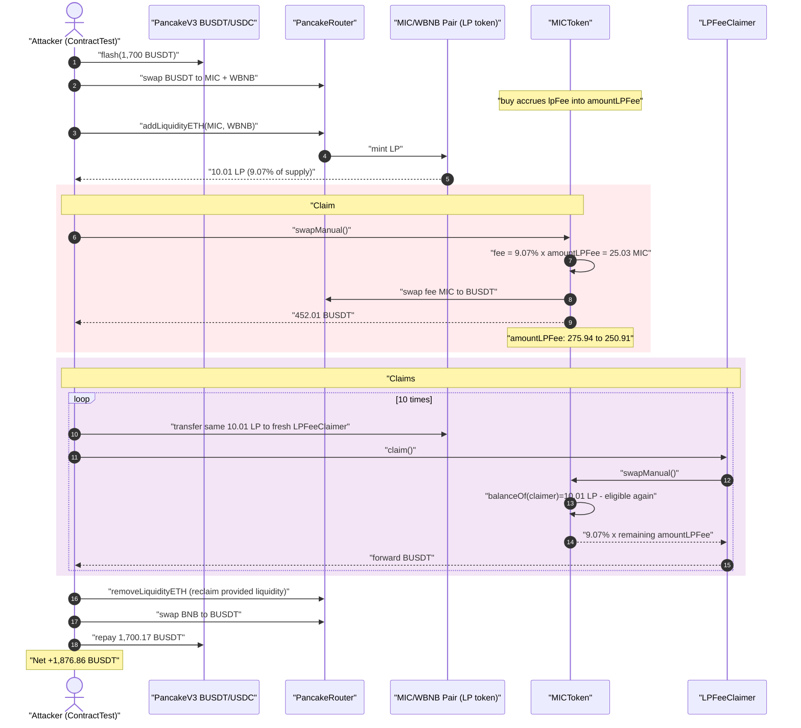
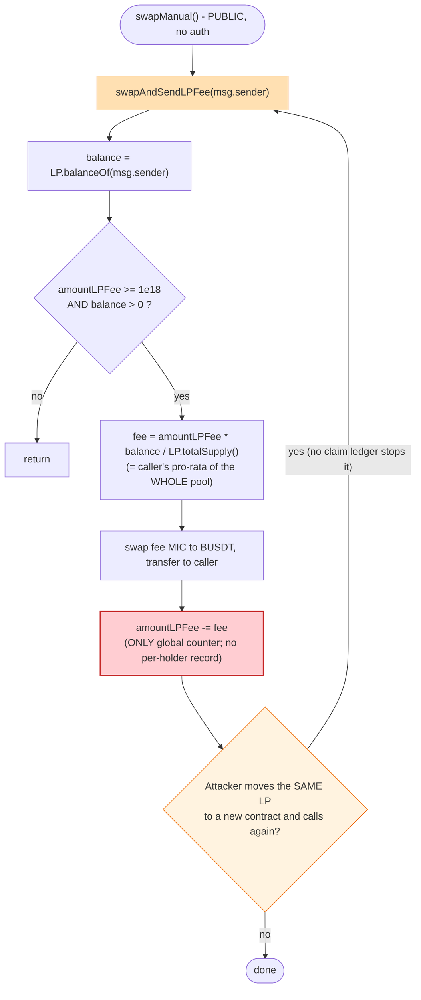
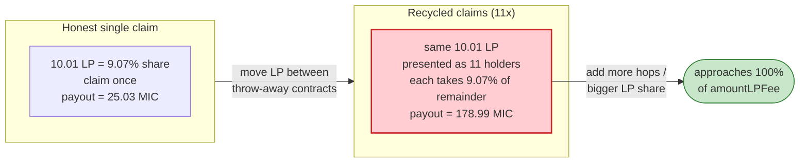

# MIC Token Exploit — LP-Fee Distributor Pays the Same LP Tokens Over and Over

> **Vulnerability classes:** vuln/logic/reward-calculation · vuln/logic/state-update

> **Reproduction:** the PoC compiles & runs in an isolated Foundry project at
> [this project folder](.) (the umbrella DeFiHackLabs repo contains many unrelated
> PoCs that do not whole-compile, so this one was extracted).
> Full verbose trace: [output.txt](output.txt).
> Verified vulnerable source: [sources/MICToken_b38c2d/MICToken.sol](sources/MICToken_b38c2d/MICToken.sol).

---

## Key info

| | |
|---|---|
| **Loss** | ~$500K cumulative on-chain (SlowMist); the forked single-tx PoC recovers **1,876.86 BUSDT** net |
| **Vulnerable contract** | `MICToken` — [`0xb38C2D2d6A168D41AA8eB4CEAd47E01BadbDCF57`](https://bscscan.com/address/0xb38C2D2d6A168D41AA8eB4CEAd47E01BadbDCF57#code) |
| **Vulnerable function** | `swapAndSendLPFee(address)` — [MICToken.sol:1373-1391](sources/MICToken_b38c2d/MICToken.sol#L1373-L1391), reachable via public `swapManual()` [:1223-1233](sources/MICToken_b38c2d/MICToken.sol#L1223-L1233) |
| **Victim pools** | MIC/WBNB pair `0xfEe55F16FD5Aec503B73146045b1474925a74dec`; LP-fee pool accrued inside the token (`amountLPFee`) |
| **Flashloan source** | PancakeV3 BUSDT/USDC pair `0x92b7807bF19b7DDdf89b706143896d05228f3121` (1,700 BUSDT) |
| **Attacker EOA** | [`0x1703062d657c1ca439023F0993D870F4707a37FF`](https://bscscan.com/address/0x1703062d657c1ca439023F0993D870F4707a37FF) |
| **Attacker contract** | [`0xaFEBc0A9e26fea567cC9E6Dd7504800c67f4E3fE`](https://bscscan.com/address/0xaFEBc0A9e26fea567cC9E6Dd7504800c67f4E3fE) |
| **Attack tx** | [`0x316c35d483b72700e6f4984650d217304146b3732bb148e32fa7f8017843eb24`](https://app.blocksec.com/explorer/tx/bsc/0x316c35d483b72700e6f4984650d217304146b3732bb148e32fa7f8017843eb24) |
| **Chain / fork block / date** | BSC / 34,905,161 / Jan 3, 2024 |
| **Compiler** | Solidity v0.8.19, optimizer **1 run** |
| **Bug class** | Reward/fee distribution without per-recipient claim accounting (re-claimable share via LP-token recycling) |

---

## TL;DR

`MICToken` accrues a "LP fee" in `amountLPFee` (a slice of every buy's volume). Anyone can call the
public `swapManual()`, which calls `swapAndSendLPFee(msg.sender)`. That function pays the caller a
**pro-rata** slice of the *current* `amountLPFee`:

```
fee = amountLPFee * pairLP.balanceOf(caller) / pairLP.totalSupply()
```

then converts `fee` MIC → BUSDT and ships it to the caller, decrementing `amountLPFee` by `fee`
([MICToken.sol:1373-1391](sources/MICToken_b38c2d/MICToken.sol#L1373-L1391)).

The fatal omission: **there is no record of who has already claimed.** The contract never marks an LP
holder as "paid for this epoch" and never resets `amountLPFee` per holder. So an attacker can:

1. Become an LP holder once (add MIC/WBNB liquidity), then
2. Claim their pro-rata slice via `swapManual()`, then
3. **Transfer the very same LP tokens to a fresh contract** and have *it* claim again — the
   `balanceOf(caller)` check passes for the new holder because it now physically holds the LP, and
   `amountLPFee` still has a (now-smaller) balance.

Repeating this with a chain of throw-away holder contracts drains the whole `amountLPFee` pool with a
single LP position. In the forked PoC the attacker holds **10.01 of 110.36 total LP (~9.07%)** and
claims **11 times** (once per holder contract), siphoning **178.99 MIC** of accrued fees (converted to
BUSDT) on top of recovering the liquidity it temporarily provided — netting **1,876.86 BUSDT** in one
flash-loaned transaction.

---

## Background — what MICToken does

`MICToken` ([source](sources/MICToken_b38c2d/MICToken.sol)) is a fee-on-transfer BSC token with a
PancakeSwap MIC/WBNB pair as its AMM. On every *buy* (transfer **from** an AMM pair) it slices off
several fee buckets ([:1289-1310](sources/MICToken_b38c2d/MICToken.sol#L1289-L1310)):

- six "address" fees (`addr1Fee … addr6Fee`) accrued into `amountAddr1Fee … amountAddr6Fee`, and
- an **LP fee** (`lpFee`) accrued into `amountLPFee` ([:1303-1304](sources/MICToken_b38c2d/MICToken.sol#L1303-L1304)).

All buckets sit as MIC inside the token contract. They are later "swapped and sent": the contract
swaps the accrued MIC → WBNB → USDT (BUSDT) via `swapTokensForCake`
([:1393-1407](sources/MICToken_b38c2d/MICToken.sol#L1393-L1407)) and forwards the BUSDT to the
beneficiary. The LP bucket is meant to reward liquidity providers, paid out **proportionally to LP
share**.

The trigger for distribution is either:

- a normal AMM buy (inside `_transfer`, [:1251-1267](sources/MICToken_b38c2d/MICToken.sol#L1251-L1267)
  with `swapAndSendLPFee(to)`), or
- the **permissionless** `swapManual()` entry point ([:1223-1233](sources/MICToken_b38c2d/MICToken.sol#L1223-L1233))
  with `swapAndSendLPFee(msg.sender)`.

On-chain state at the fork block (read from the trace):

| Parameter | Value |
|---|---|
| `lpFee` accrual (slot 22, `amountLPFee`) before attack | **275.94 MIC** |
| MIC/WBNB LP `totalSupply` (after attacker's add) | 110.36 LP |
| Attacker LP balance (after add) | 10.01 LP (**9.07%**) |
| `limitation` (buys allowed) | **true** (live trading) |

---

## The vulnerable code

### The LP-fee distributor — no claim tracking

[MICToken.sol:1373-1391](sources/MICToken_b38c2d/MICToken.sol#L1373-L1391):

```solidity
function swapAndSendLPFee(address _addr) private {
    if(blackListed[_addr] && blackListSwitch) {
        return;
    }
    uint256 balance = IUniswapV2Pair(uniswapPair).balanceOf(_addr);     // ← caller's CURRENT LP balance
    if(amountLPFee >= 1*(10**18) && balance > 0){
        uint256 total = IUniswapV2Pair(uniswapPair).totalSupply();
        uint256 fee = amountLPFee.mul(balance).div(total);             // ← pro-rata of the WHOLE pool
        if(fee >= 1*(10*13)){
            uint256 initialCAKEBalance = IERC20(usdt).balanceOf(address(this));
            swapTokensForCake(fee);                                     // MIC → WBNB → BUSDT
            uint256 newBalance = (IERC20(usdt).balanceOf(address(this))).sub(initialCAKEBalance);
            IERC20(usdt).transfer(_addr, newBalance);                   // ← paid to caller
            amountLPFee = amountLPFee.sub(fee);                         // ← only global counter decremented
            emit swapAndSendLPFeeEvent(_addr, fee);
        }
    }
}
```

There is **no `mapping(address => bool) claimed`**, **no per-holder snapshot**, and **no epoch reset**.
The only state mutation is the global `amountLPFee -= fee`. Whoever currently holds LP and calls in
gets paid `share% × amountLPFee` *of whatever is left*.

### The permissionless entry point

[MICToken.sol:1223-1233](sources/MICToken_b38c2d/MICToken.sol#L1223-L1233):

```solidity
function swapManual() public {        // ← anyone, anytime
    swapping = true;
    ...
    if(amountLPFee > 0) swapAndSendLPFee(msg.sender);   // ← pays msg.sender directly
    swapping = false;
}
```

`swapManual()` is fully public and routes the payout to **`msg.sender`**. So an attacker can call it
from any contract that happens to hold LP — and can manufacture as many such callers as it likes by
moving the same LP tokens around.

---

## Root cause — why it was possible

The LP-fee distributor confuses **"holds LP right now"** with **"is entitled to an un-paid slice of
this fee epoch."** Those are different facts. Three design decisions compose into the bug:

1. **Eligibility is computed from a *live, transferable* balance.** `balanceOf(_addr)` of an ERC20-LP
   token is freely movable within the same transaction. The same economic LP position can present
   itself as N different "holders" simply by being transferred N times.

2. **No per-recipient claim ledger.** The contract decrements only the global `amountLPFee`. It never
   remembers that a given holder (or a given LP unit) already drew its share. A correct design needs
   either a per-holder accumulator (MasterChef-style `rewardDebt`) or a one-shot "this epoch is fully
   distributed" snapshot.

3. **Permissionless `msg.sender` payout.** `swapManual()` lets the attacker *choose the recipient* (by
   being the caller) and *time the claim*, so they can interleave "claim → move LP → claim" freely.

Because `fee = amountLPFee × share`, each successive claim takes `9.07%` of the *remaining* pool. Eleven
claims with a 9.07% position extract `1 - 0.9093^11 ≈ 65%` of the accrued LP fees — and the attacker
could simply add more holder hops (or a larger initial LP share) to take essentially all of it.

The mechanism that *should* have stopped this — the fact that the attacker only owns 9.07% of the LP —
is defeated because the same 9.07% is **counted eleven times**.

---

## Preconditions

- `amountLPFee >= 1e18` (there is at least 1 MIC of accrued LP fee to steal). On-chain it was 275.94 MIC.
- `limitation == true` so the attacker can buy MIC through the pair (needed to add liquidity and to keep
  the swap path live). It was already `true` at the fork block.
- The attacker can obtain *some* LP balance (add a small amount of MIC/WBNB liquidity). It does **not**
  need to be a large share — more holder hops compensate for a small share.
- Working capital to seed the liquidity add and the buys; the PoC sources it from a **1,700 BUSDT
  PancakeV3 flashloan** ([test/MIC_exp.sol:60](test/MIC_exp.sol#L60)), so the attack is
  flash-loanable / near-zero-capital.

---

## Attack walkthrough (with on-chain numbers from the trace)

All figures are taken directly from `output.txt`. The MIC/WBNB pair is
`0xfEe5…4dec` (`token0 = MIC`, `token1 = WBNB`). `amountLPFee` lives in storage **slot 22** of the token.

| # | Step | Trace evidence | Effect |
|---|------|----------------|--------|
| 0 | **Flashloan 1,700 BUSDT** from the PancakeV3 BUSDT/USDC pair | `BUSDT_USDC::flash(... 1.7e21 ...)` [output.txt:64](output.txt) | Working capital, repaid at end (+0.01% fee). |
| 1 | **Swap half the BUSDT → MIC** and the other half → WBNB | `Router::swapExactTokensForTokensSupportingFeeOnTransferTokens(8.5e20 ...)` [output.txt:122](output.txt) | Acquire MIC + BNB to provide liquidity; the buy also **accrues more LP fee** into slot 22 (`0x0ef3… → 0x0ef5…`, [output.txt:347](output.txt)). |
| 2 | **`addLiquidityETH(MIC, …)`** | `Router::addLiquidityETH{value: 2.722e18}(MIC, 4.096e19 ...)` [output.txt:413](output.txt); `emit Transfer(0 → ContractTest, 1.001e19)` [output.txt:445](output.txt) | Attacker mints **10.01 LP**; LP `totalSupply` becomes 110.36 → attacker share **9.07%**. |
| 3 | **`MIC.swapManual()` (claim #0, payout to ContractTest)** | `emit swapAndSendLPFeeEvent(ContractTest, 25.03 MIC)` [output.txt:729](output.txt); BUSDT proceeds **452.01** [output.txt:725](output.txt) | `amountLPFee`: 275.94 → 250.91 MIC ([output.txt:735](output.txt)). |
| 4 | **Move the same 10.01 LP to a fresh `LPFeeClaimer`, call `claim()`** (claim #1) | `MIC_WBNB.transfer(LPFeeClaimer#1, 1.001e19)` [output.txt:751](output.txt); `swapManual()` sees `balanceOf=1.001e19`, `totalSupply=110.36` [output.txt:755-660](output.txt); `emit swapAndSendLPFeeEvent(LPFeeClaimer#1, 22.76 MIC)` [output.txt:825](output.txt) | Same LP, claimed again. `amountLPFee`: 250.91 → 228.15. |
| 5 | **Loop: hop the LP through 9 more fresh claimers** (`transferFrom` old→new, `claim()`) | claims #2-#10 emit `swapAndSendLPFeeEvent` for 20.70, 18.82, 17.11, 15.56, 14.15, 12.86, 11.70, 10.64, 9.67 MIC ([output.txt:927,1029,1131,1233,1335,1437,1539,1641,1743](output.txt)) | `amountLPFee` walks down to **96.95 MIC** ([output.txt:1745](output.txt)). |
| 6 | **Final claimer `remove()`s the liquidity** and swaps MIC → BNB | `Router::removeLiquidityETHSupportingFeeOnTransferTokens(MIC, 1.001e19 ...)` [output.txt:1770](output.txt) | Attacker reclaims the deposited liquidity (the 9.07% it provided). |
| 7 | **`BNBToBUSDT()`, repay flashloan (1,700.17 BUSDT)** | `BUSDT::transfer(BUSDT_USDC, 1.7e21)` [output.txt:1920](output.txt) | Loan repaid; profit kept. |
| 8 | **Final balance** | `log_named_decimal_uint("Exploiter BUSDT balance after attack", 1876.858)` [output.txt:1932](output.txt) | **+1,876.86 BUSDT**. |

### How the LP fee is paid each claim

Each `swapManual()`/`claim()` runs the same path:
`swapAndSendLPFee` computes `fee = amountLPFee × 10.01/110.36 = 9.07% × amountLPFee`, calls
`swapTokensForCake(fee)` which routes **MIC → WBNB → BUSDT** through the real pools, and forwards the
resulting BUSDT to the caller. For claim #0: `fee = 25.03 MIC`, swapped out to **452.01 BUSDT**
([output.txt:725-729](output.txt)). Because `balanceOf(caller)` returns the **identical 10.01 LP**
every single time (the same token units, just relocated), the eligibility check at
[:1377-1378](sources/MICToken_b38c2d/MICToken.sol#L1377-L1378) passes for all 11 callers.

### `amountLPFee` drained (storage slot 22, MIC)

| Claim | Recipient | `fee` claimed (MIC) | `amountLPFee` after |
|------:|-----------|--------------------:|--------------------:|
| — | (before) | — | 275.94 |
| #0 | ContractTest | 25.03 | 250.91 |
| #1 | LPFeeClaimer `0x5615…` | 22.76 | 228.15 |
| #2 | LPFeeClaimer `0x2e23…` | 20.70 | 207.46 |
| #3 | LPFeeClaimer `0xF628…` | 18.82 | 188.64 |
| #4 | LPFeeClaimer `0x5991…` | 17.11 | 171.53 |
| #5 | LPFeeClaimer `0xc718…` | 15.56 | 155.97 |
| #6 | LPFeeClaimer `0xa0Cb…` | 14.15 | 141.82 |
| #7 | LPFeeClaimer `0x1d14…` | 12.86 | 128.96 |
| #8 | LPFeeClaimer `0xA4AD…` | 11.70 | 117.26 |
| #9 | LPFeeClaimer `0x03A6…` | 10.64 | 106.62 |
| #10 | LPFeeClaimer `0xD6Bb…` | 9.67 | 96.95 |
| | **Total drained** | **178.99 MIC** | |

A single honest claim with that 9.07% LP position would have yielded just `25.03 MIC`. By recycling the
LP through 11 holders, the attacker took **7.2×** that — and could have taken essentially all 275.94 MIC
by adding more hops.

### Profit accounting

| Item | BUSDT |
|---|---:|
| Starting BUSDT | 0 |
| Flashloan in | +1,700.00 |
| Repay flashloan (+0.01% fee) | −1,700.17 |
| LP-fee theft (11× recycled claims) + liquidity reclaimed + dust | net **+1,876.86** |
| **Final balance** | **1,876.86** |

> Note: the PoC `deal`s a tiny 0.00331 BUSDT top-up ([test/MIC_exp.sol:73](test/MIC_exp.sol#L73),
> visible as a `VM::store` at [output.txt:48](output.txt)) to absorb fee-on-transfer rounding; it is
> immaterial to the result. The `~$500K` headline in the PoC banner is SlowMist's cumulative on-chain
> figure for the real incident; the single forked transaction here recovers 1,876.86 BUSDT, the steady
> profit of one drain cycle against the LP-fee pool size at this block.

---

## Diagrams

### Sequence of the attack



### The flaw inside `swapAndSendLPFee` / `swapManual`



### Why recycling beats the share cap



---

## Remediation

1. **Track claims per holder per epoch.** Replace the stateless pro-rata payout with an accounting model
   that remembers what each LP unit has already drawn — e.g. a MasterChef-style
   `accFeePerShare` accumulator and per-account `rewardDebt`, or a per-account `lastClaimedIndex`. A
   holder's claim must be debited against *their* entitlement, not against the global pool that anyone
   else can also draw from.

2. **Do not base reward eligibility on a freely-transferable live balance read.** A spot
   `LP.balanceOf(caller)` is sybil-able by transferring the same tokens between addresses within one
   transaction. Snapshot LP balances at epoch boundaries, or require the LP to be **staked/escrowed**
   in the distributor (so the same units cannot be presented by multiple callers).

3. **Make the distribution idempotent within an epoch.** Once the LP fee for an epoch is fully
   distributed, further `swapManual()` calls must pay zero until new fees accrue. Resetting/locking
   `amountLPFee` per epoch and recording claims prevents the "claim → move LP → claim" loop.

4. **Reconsider the permissionless `msg.sender` payout.** If anyone can trigger distribution to
   themselves, the recipient and timing are attacker-controlled. At minimum, distribution should pay a
   *fixed accounting destination* (the staking/escrow contract) rather than `msg.sender`, with claims
   pulled separately against recorded entitlements.

---

## How to reproduce

The PoC was extracted into a standalone Foundry project (the umbrella DeFiHackLabs repo has many
unrelated PoCs that fail to compile under a whole-project `forge build`):

```bash
_shared/run_poc.sh 2024-01-MIC_exp --mt testExploit -vvvvv
```

- RPC: a **BSC archive** endpoint is required (fork block 34,905,161). `foundry.toml` uses
  `https://bsc-mainnet.public.blastapi.io`, which serves historical state at that block; many public
  BSC RPCs prune it and fail with `header not found` / `missing trie node`.
- Result: `[PASS] testExploit()` with a positive BUSDT balance.

Expected tail:

```
Ran 1 test for test/MIC_exp.sol:ContractTest
[PASS] testExploit() (gas: 9307655)
  Exploiter BUSDT balance before attack: 0.000000000000000000
  Exploiter BUSDT balance after attack: 1876.858014356716658854

Suite result: ok. 1 passed; 0 failed; 0 skipped
```

---

*References: PoC banner (DeFiHackLabs) — Total Lost ~$500K; post-mortem thread:
https://x.com/MetaSec_xyz/status/1742484748239536173 ; SlowMist Hacked — https://hacked.slowmist.io/ (MIC, BSC).*
