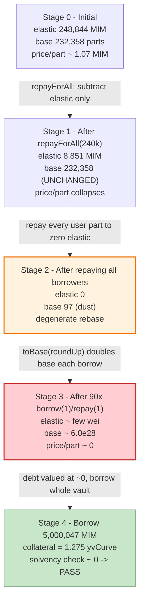
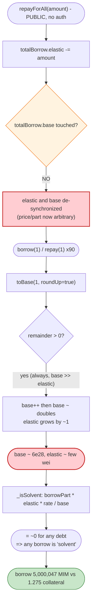

# Abracadabra / MIM Spell V2 Exploit — `repayForAll` Rebase De-sync + Rounding-Up Debt Inflation

> **Reproduction:** the PoC compiles & runs in an isolated Foundry project at
> [this project folder](.) (the umbrella DeFiHackLabs repo contains many
> unrelated PoCs that do not whole-compile, so this one was extracted).
> Full verbose trace: [output.txt](output.txt).
> Verified vulnerable source: [src_cauldrons_CauldronV4.sol](sources/CauldronV4_7259e1/src_cauldrons_CauldronV4.sol)
> and [lib_BoringSolidity_contracts_libraries_BoringRebase.sol](sources/CauldronV4_7259e1/lib_BoringSolidity_contracts_libraries_BoringRebase.sol).

---

## Key info

| | |
|---|---|
| **Loss** | ~$6.5M — attacker walked off with **349,003.46 MIM** + **1,807.68 WETH** (post-laundering balances) |
| **Vulnerable contract** | `CauldronV4` (MIM cauldron) — [`0x7259e152103756e1616A77Ae982353c3751A6a90`](https://etherscan.io/address/0x7259e152103756e1616A77Ae982353c3751A6a90#code) |
| **Victim accounting** | `DegenBox` (BentoBox V2) MIM vault — [`0xd96f48665a1410C0cd669A88898ecA36B9Fc2cce`](https://etherscan.io/address/0xd96f48665a1410C0cd669A88898ecA36B9Fc2cce) |
| **Asset drained** | MIM (Magic Internet Money) — [`0x99D8a9C45b2ecA8864373A26D1459e3Dff1e17F3`](https://etherscan.io/address/0x99D8a9C45b2ecA8864373A26D1459e3Dff1e17F3) |
| **Attacker EOA** | [`0x87f585809ce79ae39a5fa0c7c96d0d159eb678c9`](https://etherscan.io/address/0x87f585809ce79ae39a5fa0c7c96d0d159eb678c9) |
| **Attacker contract** | [`0xE1091D17473b049CcCD65c54f71677Da85b77A45`](https://etherscan.io/address/0xE1091D17473b049CcCD65c54f71677Da85b77A45) (created by `0x193E045BeE45C7573Ff89b12601C745AF739CE67`) |
| **Attack tx** | [`0x26a83db7e28838dd9fee6fb7314ae58dcc6aee9a20bf224c386ff5e80f7e4cf2`](https://app.blocksec.com/explorer/tx/eth/0x26a83db7e28838dd9fee6fb7314ae58dcc6aee9a20bf224c386ff5e80f7e4cf2) |
| **Chain / block / date** | Ethereum / fork at 19,118,659 / Jan 30, 2024 |
| **Compiler** | Solidity v0.8.16, optimizer **200 runs** |
| **Bug class** | Broken rebase invariant — interest-bearing-debt `Rebase` de-synchronized by `repayForAll`, then `toBase(roundUp=true)` exponentially inflates `totalBorrow.base` so debt is valued at ~0 |

---

## TL;DR

Abracadabra's `CauldronV4` tracks all borrower debt in a single BentoBox-style **`Rebase`** struct,
`totalBorrow { uint128 elastic; uint128 base; }`
([CauldronV4.sol:89](sources/CauldronV4_7259e1/src_cauldrons_CauldronV4.sol#L89)).
`elastic` is the total MIM owed (grows with interest), `base` is the total of all user "parts" (the
shares of that debt). A borrower's MIM debt is computed as `borrowPart × elastic / base`.

The exploit chains two flaws in this rebase:

1. **`repayForAll()` deletes `elastic` without touching `base`.** It is a permissionless function that
   subtracts a caller-supplied amount directly from `totalBorrow.elastic` while leaving `totalBorrow.base`
   completely unchanged ([CauldronV4.sol:695-714](sources/CauldronV4_7259e1/src_cauldrons_CauldronV4.sol#L695-L714)).
   The attacker flash-loans MIM and "repays everyone," collapsing `elastic` from
   **248,851 MIM → 8,851 MIM**, then individually repays every remaining borrower so the rebase reaches the
   degenerate state **`elastic = 0, base = 97`** (97 wei of dust parts left over from rounding-down repays).

2. **`toBase(roundUp = true)` inflates `base` exponentially when `elastic ≪ base`.** With the rebase
   de-synced, a `borrow(1 wei)` → `repay(1 part)` loop run 90 times
   ([MIMSpell2_exp.sol:230-235](test/MIMSpell2_exp.sol#L230-L235))
   makes the new `part` roughly **double every iteration** (1 → 98 → 195 → 389 → 777 → … → 6.0e28) because
   the round-up in [BoringRebase.sol:21-23](sources/CauldronV4_7259e1/lib_BoringSolidity_contracts_libraries_BoringRebase.sol#L21-L23)
   always grants ≥1 extra base part per borrow while `elastic` barely moves.

The combined effect: `totalBorrow.base` becomes astronomically larger than `totalBorrow.elastic`, so the
solvency check `borrowPart × elastic × rate / base`
([CauldronV4.sol:210](sources/CauldronV4_7259e1/src_cauldrons_CauldronV4.sol#L210)) evaluates to
**≈ 0 for any debt**. The attacker then borrows the cauldron's entire MIM balance —
**5,000,047.84 MIM** — against just **1.275 units** of yvCurve collateral, passes the solvency check, withdraws
the MIM, repays the 300,000 MIM flash loan, and keeps the rest.

---

## Background — how a MIM cauldron accounts for debt

`CauldronV4` is the lending engine behind Abracadabra Money. Users post collateral and borrow MIM. All
debt is pooled into one rebase:

```solidity
// CauldronV4.sol:89
Rebase public totalBorrow; // elastic = Total token amount to be repaid by borrowers,
                           // base    = Total parts of the debt held by borrowers
```

- **Borrowing** ([`_borrow`, :301-322](sources/CauldronV4_7259e1/src_cauldrons_CauldronV4.sol#L301-L322))
  converts the requested MIM `amount` (+ opening fee) into `part` via `totalBorrow.add(amount, true)` and
  credits `userBorrowPart[msg.sender] += part`.
- **Repaying** ([`_repay`, :333-344](sources/CauldronV4_7259e1/src_cauldrons_CauldronV4.sol#L333-L344))
  converts a `part` back into MIM `amount` via `totalBorrow.sub(part, true)` and debits the user's part.
- **Solvency** ([`_isSolvent`, :194-211](sources/CauldronV4_7259e1/src_cauldrons_CauldronV4.sol#L194-L211))
  values a user's debt as `borrowPart × totalBorrow.elastic × exchangeRate / totalBorrow.base`.

The whole system trusts the invariant that **`elastic` and `base` move together** — every borrow/repay
adjusts both sides proportionally, so `elastic / base` is the (interest-bearing) price of one debt part.
`repayForAll` and the round-up in `toBase` are the two places where that invariant is breakable.

State of the live cauldron at the fork block (read from the trace's first `totalBorrow()` call,
[output.txt L89](output.txt)):

| Field | Value |
|---|---|
| `totalBorrow.elastic` | 248,844.38 MIM |
| `totalBorrow.base` | 232,357.69 parts |
| Flash-loan fee on DegenBox | 0.05% (150 MIM on 300k) |
| Borrow opening fee | flat % charged on borrow (`BORROW_OPENING_FEE`) |
| MIM sitting in the cauldron's DegenBox account | ~5,000,047.84 MIM (the borrowable prize) |

---

## The vulnerable code

### 1. `repayForAll` — subtracts `elastic`, never touches `base`

```solidity
// CauldronV4.sol:695-714
function repayForAll(uint128 amount, bool skim) public returns(uint128) {
    accrue();

    if(skim) {
        // ignore amount and take every mim in this contract since it could be taken by anyone, the next block.
        amount = uint128(magicInternetMoney.balanceOf(address(this)));
        bentoBox.deposit(magicInternetMoney, address(this), address(this), amount, 0);
    } else {
        bentoBox.transfer(magicInternetMoney, msg.sender, address(this), bentoBox.toShare(magicInternetMoney, amount, true));
    }

    uint128 previousElastic = totalBorrow.elastic;

    require(previousElastic - amount > 1000 * 1e18, "Total Elastic too small");

    totalBorrow.elastic = previousElastic - amount;   // ⚠️ base is NOT reduced

    emit LogRepayForAll(amount, previousElastic, totalBorrow.elastic);
    return amount;
}
```

`repayForAll` is **permissionless** and pays down the *aggregate* MIM debt (`elastic`) on behalf of all
borrowers — but it intentionally leaves each `userBorrowPart` and `totalBorrow.base` intact (the idea is
to "gift" repayment to all users proportionally, lowering everyone's debt-per-part). The only sanity check
is `previousElastic - amount > 1000e18`. There is no protection against driving the `elastic/base` ratio
to a degenerate value when combined with manual repays.

### 2. `toBase(roundUp = true)` — always rounds the new part *up*

```solidity
// BoringRebase.sol:12-25
function toBase(Rebase memory total, uint256 elastic, bool roundUp) internal pure returns (uint256 base) {
    if (total.elastic == 0) {
        base = elastic;                                  // elastic==0 ⇒ base := elastic (1:1)
    } else {
        base = (elastic * total.base) / total.elastic;   // base scales by base/elastic
        if (roundUp && (base * total.elastic) / total.base < elastic) {
            base++;                                       // ⚠️ +1 part whenever there is any remainder
        }
    }
}
```

`_borrow` calls this with `roundUp = true`
([CauldronV4.sol:303](sources/CauldronV4_7259e1/src_cauldrons_CauldronV4.sol#L303)). When
`total.base ≫ total.elastic`, the multiplier `base/elastic` is enormous, so a 1-wei borrow mints a huge
number of new parts — and the round-up guarantees at least +1 even when the math would truncate to 0. That
is the lever that lets the attacker double `base` on every borrow while `elastic` creeps up by ~1.

### 3. `_isSolvent` divides by `base`

```solidity
// CauldronV4.sol:203-210
return
    bentoBox.toAmount(collateral, collateralShare.mul(...).mul(COLLATERIZATION_RATE), false)
    >=
    borrowPart.mul(_totalBorrow.elastic).mul(_exchangeRate) / _totalBorrow.base;  // ⚠️ ÷ inflated base ⇒ ≈0
```

Once `base` is inflated to ~1e28 while `elastic` is a handful of wei, the right-hand side (the USD value of
the borrower's debt) rounds to **zero**, so *any* borrow is deemed solvent against *any* collateral.

---

## Root cause — why it was possible

The single rebase `totalBorrow` encodes the price of one debt part as `elastic / base`. Two design choices
let an attacker drive that price toward zero:

1. **`repayForAll` breaks the `elastic ↔ base` coupling.** It is the *only* mutator in the contract that
   changes one side of the rebase without the other. By repaying nearly all `elastic` and then individually
   repaying every borrower's `part`, the attacker forces `totalBorrow = (elastic = 0, base = 97)` — a state
   the rebase math was never meant to enter (97 wei of leftover base parts that no `elastic` backs).
2. **The borrow rounding compounds in the attacker's favor.** With `elastic ≈ 0`, `toBase(roundUp=true)`
   mints disproportionately many parts for a 1-wei borrow, and the `borrow(1)/repay(1)` ping-pong lets the
   attacker re-trigger that round-up 90 times, doubling `base` each time. After 90 iterations `base` is
   ~1e28, `elastic` is still trivially small, and the per-part debt price is ~0.

Neither flaw alone is catastrophic; their composition turns a permissionless "repay everyone" convenience
function into a debt-valuation kill switch. This is fundamentally the same class as the BentoBox/`Rebase`
"first-depositor / degenerate-ratio" bug, but applied to the *borrow* side of an interest-bearing cauldron.

---

## Preconditions

- A cauldron with a **modest, repayable** `totalBorrow.elastic` (here ~248k MIM) — small enough to flash-loan
  and fully repay. The MIM cauldron's debt was small relative to the MIM idle in its DegenBox account.
- Access to a flash loan of MIM. The attacker used **`DegenBox.flashLoan` for 300,000 MIM** (fee 150 MIM)
  ([MIMSpell2_exp.sol:101](test/MIMSpell2_exp.sol#L101)).
- A complete list of the cauldron's active borrowers (15 users + 1 "special" user) so every outstanding
  `part` can be repaid to reach `elastic = 0`
  ([MIMSpell2_exp.sol:139-164](test/MIMSpell2_exp.sol#L139-L164),
  [handleSpecialUser, :211-220](test/MIMSpell2_exp.sol#L211-L220)).
- A small amount of accepted collateral (yvCurve-3Crypto) to post — only enough to pass the (now-trivial)
  solvency check. The attacker minted it intra-transaction via Curve + Yearn deposits.

No admin keys, no oracle manipulation, no governance. Everything is permissionless and atomic — the entire
attack runs inside one `onFlashLoan` callback.

---

## Attack walkthrough (with on-chain numbers from the trace)

All figures are taken from [output.txt](output.txt). The attack is one transaction: a 300,000-MIM flash loan
whose `onFlashLoan` callback ([MIMSpell2_exp.sol:125-201](test/MIMSpell2_exp.sol#L125-L201)) does everything.

| # | Step | `totalBorrow.elastic` | `totalBorrow.base` | Trace evidence |
|---|------|----------------------:|-------------------:|----------------|
| 0 | **Initial cauldron state** | 248,844.38 MIM | 232,357.69 | [L89](output.txt) `totalBorrow() → (2.488e23, 2.323e23)` |
| 1 | Flash-loan 300,000 MIM; deposit 8,894.38 MIM headroom to DegenBox | — | — | [L91](output.txt), [L92 deposit](output.txt) |
| 2 | Transfer 240,000 MIM to cauldron, **`repayForAll(240,000, skim=true)`** | 248,851.13 → **8,851.13** | 232,357.69 (unchanged) | [L126 `LogRepayForAll`](output.txt): `previousElastic 2.488e23 → newElastic 8.851e21` |
| 3 | **Repay all 15 listed borrowers** (`skim=true`), parts ranging 9.1e13 … 1.26e23 | falls toward ~0 | falls toward ~0 | [L136-L417](output.txt) 15× `CauldronV4::repay(user, true, borrowPart)` |
| 4 | **`handleSpecialUser`**: repay `borrowPart-100`, then `repay(1)` ×3 to land `elastic == 0` | **0** | **97** | [L500 `totalBorrow() → (0, 97)`](output.txt) (rebase now degenerate) |
| 5 | Mint collateral: swap MIM→USDT (Curve), add USDT to 3Crypto, deposit to yvCurve; deposit yvCurve to cauldron's DegenBox account | 0 | 97 | [L518-L640](output.txt) |
| 6 | **Inflate `base`** via `HelperExploitContract.exploit()`: `addCollateral(100)`, `borrow(1)`, then 90× `{borrow(1); repay(1)}` | ~tiny | **1 → 98 → 195 → … → 6.0e28** | `LogBorrow part:` sequence [L669 … L6010](output.txt) — part roughly **doubles every borrow** |
| 7 | Attacker posts **1.275 yvCurve** collateral (`addCollateral`) | tiny | ~6e28 | [L6047 `addCollateral(..., 1.275e18)`](output.txt) |
| 8 | **Borrow the cauldron's entire MIM: 5,000,047.84 MIM** — solvency passes because debt value ÷ inflated `base` ≈ 0 | — | — | [L6064 `borrow(..., 5.000e24)`](output.txt); [L6041 cauldron MIM balance = 5.000e24](output.txt) |
| 9 | `DegenBox.withdraw` 5,000,047.84 MIM to the attacker | — | — | [L6088 withdraw 5.000e24](output.txt) |
| 10 | **Repay flash loan**: transfer 300,150 MIM back to DegenBox (300,000 + 150 fee) | — | — | [L6101 transfer 3.0015e23](output.txt) |
| 11 | Launder profit: MIM→USDT (Curve `exchange_underlying`), MIM→USDC (Uni V3), USDC→WETH (Uni V3) | — | — | [MIMSpell2_exp.sol:104-116](test/MIMSpell2_exp.sol#L104-L116) |

### Why the `borrow(1)/repay(1)` loop doubles `base`

Starting from `(elastic, base)` with `base ≫ elastic`, one round does:

- `borrow(1)`: `toBase(1, roundUp=true) = floor(1 × base / elastic)` and, because the remainder is non-zero,
  `+1`. With `elastic` tiny this mints a part comparable to the *entire current base*, so the user's part
  (and `totalBorrow.base`) grows by roughly **+base**, i.e. it doubles. `elastic` only grows by ~1 (the
  borrowed wei, plus a wei of opening fee).
- `repay(1)`: removes exactly 1 part and the corresponding ~1 wei of elastic, leaving the freshly-doubled
  `base` essentially intact.

The trace shows the `part` value emitted by each `LogBorrow` marching
`1, 98, 195, 389, 777, 1553, 3105, …` and continuing to double until it reaches
`60,040,091,905,340,943,332,607,524,865` (~6.0e28) on the 90th iteration. The final, separate
`LogBorrow part: 5,000,047,843,134,993,049,370,268` is the attacker's real 5M-MIM borrow.

Once `base ≈ 6e28` and `elastic` is a few wei, `_isSolvent` computes
`borrowPart × elastic × rate / base ≈ 0`, so the 5M-MIM borrow against 1.275 collateral units is "solvent."

---

## Profit / loss accounting

The PoC's framing contract starts and ends measured in MIM and WETH ([output.txt L6-L9](output.txt)):

| | MIM | WETH |
|---|---:|---:|
| Before attack | 0 | 0 |
| **After attack** | **349,003.46** | **1,807.68** |

Intra-transaction flows:

| Flow | Amount (MIM) |
|---|---:|
| Flash loan borrowed | 300,000 |
| Flash loan fee | 150 |
| MIM minted out of the cauldron (the theft) | **5,000,047.84** |
| Flash loan repaid (principal + fee) | 300,150 |
| Gross MIM extracted before laundering | ~4,699,897 |

The attacker kept part of the proceeds as MIM and routed the rest through Curve (MIM→USDT) and Uniswap V3
(MIM→USDC→WETH), ending with **349,003.46 MIM + 1,807.68 WETH** in this PoC. Public post-mortems
(Phalcon, PeckShield, kankodu) priced the live incident at **≈ $6.5M**. The loss is borne by Abracadabra LPs
whose MIM was idle in the cauldron's DegenBox account.

---

## Diagrams

### Sequence of the attack

```mermaid
sequenceDiagram
    autonumber
    actor A as "Attacker (onFlashLoan)"
    participant DB as "DegenBox (BentoBox V2)"
    participant C as "CauldronV4"
    participant H as "HelperExploitContract"

    Note over C: "Initial rebase<br/>elastic = 248,844 MIM<br/>base = 232,358 parts"

    rect rgb(255,243,224)
    Note over A,C: "Step A — de-sync the rebase"
    A->>DB: "flashLoan(300,000 MIM)"
    A->>C: "transfer 240,000 MIM + repayForAll(240,000, skim=true)"
    Note over C: "elastic 248,851 -> 8,851<br/>base UNCHANGED (232,358)"
    A->>C: "repay() x15 listed borrowers (skim=true)"
    A->>C: "handleSpecialUser(): repay down to elastic == 0"
    Note over C: "rebase = (elastic = 0, base = 97)  degenerate"
    end

    rect rgb(255,235,238)
    Note over A,H: "Step B — inflate base via rounding"
    A->>H: "exploit()"
    H->>C: "addCollateral(100); borrow(1)"
    loop "90 times"
        H->>C: "borrow(1)  -> toBase(roundUp) mints ~+base parts"
        H->>C: "repay(1)   -> removes 1 part, base stays doubled"
    end
    Note over C: "base ~ 6.0e28, elastic ~ few wei<br/>per-part debt price ~ 0"
    end

    rect rgb(227,242,253)
    Note over A,C: "Step C — borrow the whole vault for free"
    A->>C: "addCollateral(1.275 yvCurve)"
    A->>C: "borrow(5,000,047.84 MIM)"
    Note over C: "_isSolvent: borrowPart*elastic*rate/base ~ 0 -> PASS"
    A->>DB: "withdraw(5,000,047.84 MIM)"
    A->>DB: "repay flash loan (300,150 MIM)"
    end

    Note over A: "Net: ~4.7M MIM kept -> laundered to 349,003 MIM + 1,807.68 WETH"
```

### Rebase state evolution



### The flaw: where the rebase invariant breaks



---

## Why each magic number

- **300,000 MIM flash loan** ([:101](test/MIMSpell2_exp.sol#L101)): working capital to fund `repayForAll`
  (240,000) plus the DegenBox deposit headroom (8,894.38) and per-user repay amounts; fully repaid at the end.
- **`repayForAll(240,000)`** ([:137](test/MIMSpell2_exp.sol#L137)): chosen to crush `elastic` from
  248,851 to 8,851 while staying above the `previousElastic - amount > 1000e18` guard (8,851 > 1,000).
- **`elastic + 50e18 - 240,000e18`** deposit sizing ([:133-135](test/MIMSpell2_exp.sol#L133-L135)): pre-funds
  the cauldron/DegenBox so that after `repayForAll` + per-user repays the residual `elastic` lands at exactly 0.
- **15 user repays + `handleSpecialUser`** ([:139-164](test/MIMSpell2_exp.sol#L139-L164),
  [:211-220](test/MIMSpell2_exp.sol#L211-L220)): every outstanding `userBorrowPart` must be cleared so the
  rebase reaches `elastic = 0`. `handleSpecialUser` leaves 100 parts then repays 1-at-a-time and asserts
  `elastic == 0`.
- **90× borrow/repay** ([HelperExploitContract.exploit, :226-237](test/MIMSpell2_exp.sol#L226-L237)): each
  iteration doubles `base`; ~90 doublings take `base` from ~97 to ~6e28, enough to value 5M MIM of debt at ≈0.
- **5,000,047.84 MIM borrow** ([:193](test/MIMSpell2_exp.sol#L193)): exactly the MIM balance the cauldron held
  in its DegenBox account at the fork block ([L6041](output.txt)) — the attacker drains it entirely.

---

## Remediation

1. **`repayForAll` must reduce `base` proportionally, or be removed.** Subtracting `elastic` without `base`
   is the de-sync primitive. Either burn an equivalent fraction of `base`, or replace the "gift to all
   borrowers" mechanic with an explicit per-user accounting that preserves `elastic/base`.
2. **Reject degenerate rebase states.** Guard against `totalBorrow.elastic == 0 && totalBorrow.base != 0`
   (and the inverse). A rebase with base but no elastic has no meaningful per-part price and must not accept
   new borrows.
3. **Do not let `toBase` round up unboundedly when `elastic ≪ base`.** Cap the parts minted per borrow, or
   forbid 1-wei borrows that mint parts far in excess of the borrowed value. The round-up that defends LPs in
   a healthy rebase becomes an inflation engine in a degenerate one.
4. **Add a minimum-borrow / dust floor.** The `borrow(1)/repay(1)` ping-pong relies on 1-wei operations; a
   minimum borrow amount and minimum part change neutralizes the doubling loop.
5. **Gate `repayForAll`.** At minimum restrict it (keeper/role) so an attacker cannot atomically combine it
   with mass repays inside a flash loan.
6. **Invariant test:** after any sequence of borrow/repay/repayForAll, assert that for every user
   `userBorrowPart × elastic / base` is monotonic and that total credited debt never under-values the
   protocol's MIM exposure.

Abracadabra's post-incident fix reintroduced the coupling between `elastic` and `base` and hardened the
cauldron's repay accounting.

---

## How to reproduce

The PoC was extracted into a standalone Foundry project (the umbrella DeFiHackLabs repo has many unrelated
PoCs that fail to compile under a whole-project `forge build`):

```bash
_shared/run_poc.sh 2024-01-MIMSpell2_exp --mt testExploit -vvvvv
```

- RPC: an **Ethereum archive** endpoint is required (fork block 19,118,659). The PoC selects the
  `"mainnet"` fork alias ([MIMSpell2_exp.sol:73](test/MIMSpell2_exp.sol#L73)); point that alias at an archive
  node that serves historical state at that block.
- Result: `[PASS] testExploit()`; the exploiter ends with 349,003.46 MIM and 1,807.68 WETH.

Expected tail ([output.txt](output.txt)):

```
  Exploiter MIM balance before attack: 0.000000000000000000
  Exploiter WETH balance before attack: 0.000000000000000000
  Exploiter MIM balance after attack: 349003.460855761652642273
  Exploiter WETH balance after attack: 1807.677833228065417403

Suite result: ok. 1 passed; 0 failed; 0 skipped
```

---

*References: kankodu (https://twitter.com/kankodu/status/1752581744803680680), Phalcon
(https://twitter.com/Phalcon_xyz/status/1752278614551216494), PeckShield
(https://twitter.com/peckshield/status/1752279373779194011). Abracadabra MIM Spell, Ethereum, ~$6.5M,
Jan 30, 2024.*
