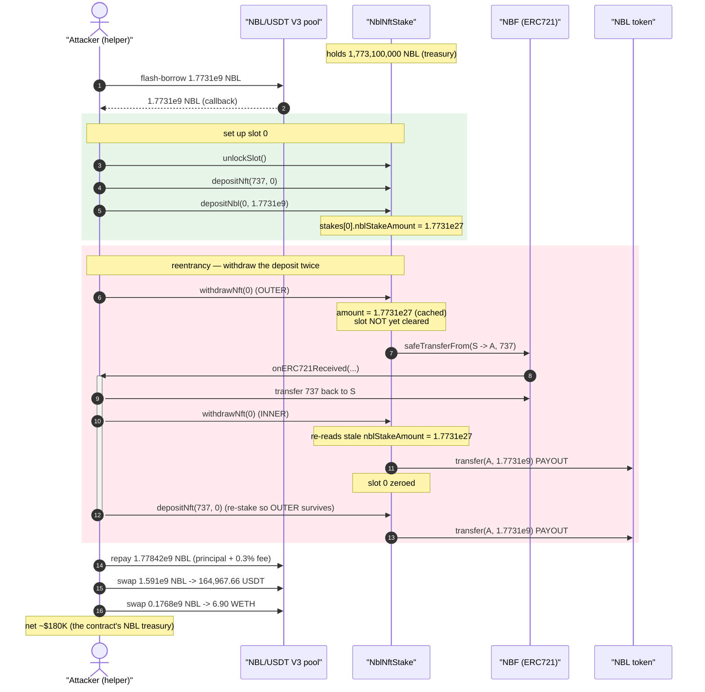
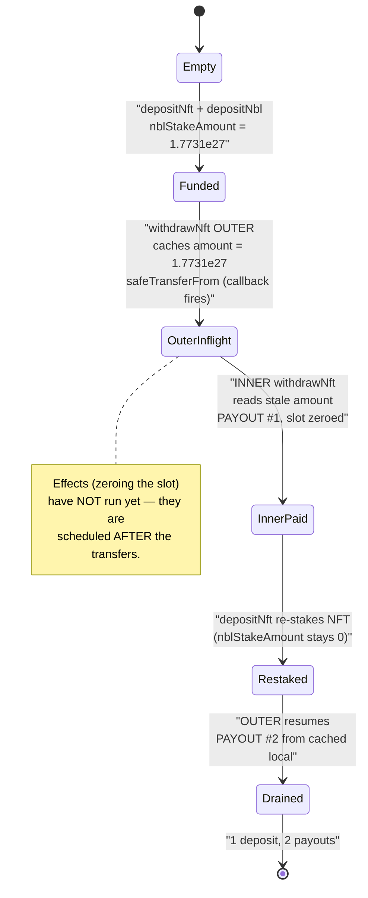
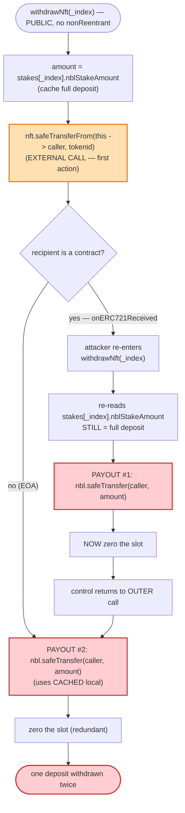

# NBLGAME (NblNftStake) Exploit — ERC721 `onERC721Received` Reentrancy Double-Withdraw

> **Reproduction:** the PoC compiles & runs in an isolated Foundry project at
> [this project folder](.) (the umbrella DeFiHackLabs repo contains several
> unrelated PoCs that do not whole-compile, so this one was extracted).
> Full verbose trace: [output.txt](output.txt).
> Verified vulnerable source: [NblNftStake.sol](sources/NblNftStake_549917/NblNftStake.sol).

---

## Key info

| | |
|---|---|
| **Loss** | ~$180K — **164,967.66 USDT + 6.90 WETH** extracted (the stake contract's entire **1,773,100,000 NBL** treasury, doubled then sold) |
| **Vulnerable contract** | `NblNftStake` — [`0x5499178919C79086fd580d6c5f332a4253244D91`](https://optimistic.etherscan.io/address/0x5499178919C79086fd580d6c5f332a4253244D91#code) |
| **Victim asset / drained balance** | NBL held by `NblNftStake` — 1,773,100,000 NBL ([`0x4B03afC91295ed778320c2824bAd5eb5A1d852DD`](https://optimistic.etherscan.io/address/0x4B03afC91295ed778320c2824bAd5eb5A1d852DD)) |
| **Flash-loan source** | NBL/USDT Uniswap V3 pool `0xfAF037caAfA9620bFAebc04C298Bf4A104963613` |
| **Attacker EOA** | `0x1FD0a6A5e232EebA8020A40535AD07013Ec4ef12` |
| **Attacker contract(s)** | `0xE4D41BDD6459198B33Cc795ff280cEE02d91087b` (main) + `0xfc3b08555b1c328ecf8b8a0ccd85679bf59bba4c` (selfdestruct helper) |
| **Attack tx** | `0xf4fc3b638f1a377cf22b729199a9aeb27fc62fe2983a65c4d14b99ee5c5b2328` |
| **Chain / fork block / date** | Optimism / 115,293,068 / Jan 25, 2024 |
| **Compiler** | Solidity v0.8.18, optimizer **200 runs** |
| **Bug class** | ERC-721 `safeTransferFrom` reentrancy (CEI violation) → withdraw the same deposit twice |

---

## TL;DR

`NblNftStake.withdrawNft()` returns a slot's staked NFT and staked NBL to the caller, **but it
performs the asset transfers before it clears the slot's stored amounts**
([NblNftStake.sol:1903-1932](sources/NblNftStake_549917/NblNftStake.sol#L1903-L1932)). The very first
transfer it does is `nft.safeTransferFrom(address(this), msg.sender, tokenid)`, which invokes the
recipient's `onERC721Received` hook **while `stakes[_index].nblStakeAmount` is still set to the full
deposit**. `withdrawNft` is **not** `nonReentrant` (the contract inherits `ReentrancyGuard` but never
applies the modifier here).

The attacker:

1. Flash-borrows the stake contract's **entire** NBL balance (1,773,100,000 NBL) from the NBL/USDT V3 pool.
2. Opens a slot (`unlockSlot`), deposits a borrowed NFT (`depositNft`), and deposits all 1.7731e9 NBL into that slot (`depositNbl`).
3. Calls `withdrawNft(0)`. Inside the resulting `onERC721Received`, it **re-enters** `withdrawNft(0)` — which re-reads the **stale, still-nonzero** `nblStakeAmount` and pays the deposit out a **second** time, then re-stakes the NFT so the outer call can complete.
4. The outer call then pays the **same** deposit out **again**, using the `amount` it cached in a local before the external call.

Result: the attacker deposited 1.7731e9 NBL once and withdrew it **twice** (3.5462e9 NBL out). The
extra ~1.7731e9 NBL came straight out of the stake contract's NBL treasury. The attacker repaid the
flash loan and swapped the surplus into **164,967.66 USDT + 6.90 WETH (~$180K)**.

---

## Background — what `NblNftStake` does

`NblNftStake` ([source](sources/NblNftStake_549917/NblNftStake.sol)) is the staking hub of the NBLGAME
GameFi protocol on Optimism. Each user owns up to 8 "slots"
([:1652](sources/NblNftStake_549917/NblNftStake.sol#L1652)), each holding one game NFT, an optional
inscription NFT, and an amount of the NBL reward token. Per-slot "power" feeds an external
`stakebook` that distributes rewards.

The relevant slot record is a `StakeInfo`
([:1637-1642](sources/NblNftStake_549917/NblNftStake.sol#L1637-L1642)):

```solidity
struct StakeInfo {
    uint256 nftTokenId;
    uint256 inscriptionId;
    uint256 nblStakeAmount;   // ← the value double-counted by the reentrancy
    uint256 begin;
}
mapping(address => StakeInfo[]) public userStakeInfo;
```

A user's flow is: `unlockSlot()` to create a slot, `depositNft(tokenId, index)` to stake an NFT,
`depositNbl(index, amount)` to stake NBL into that slot, and `withdrawNft(index)` to take everything
back. The NBL the contract holds (1,773,100,000 NBL at the fork block — confirmed by the
`NBL.balanceOf(NblNftStake)` reads at [output.txt L61-62, L95-96](output.txt)) is what backs every
user's `nblStakeAmount`. That balance is the prize.

---

## The vulnerable code

### `withdrawNft` — interactions happen before effects

```solidity
function withdrawNft(uint256 _index) public {                       // ← NO nonReentrant
    StakeInfo[] storage stakes = userStakeInfo[msg.sender];
    require(_index < stakes.length, "invalid stake index");

    uint tokenid = stakes[_index].nftTokenId;
    require(tokenid > 0, "no stake available");

    uint amount = stakes[_index].nblStakeAmount;                    // ① cache full deposit (1.7731e27)
    uint power  = getSlotPower(msg.sender, _index);

    nft.safeTransferFrom(address(this), msg.sender, tokenid);       // ② EXTERNAL CALL → onERC721Received
    if (stakes[_index].inscriptionId > 0) {
        inscription.safeTransferFrom(address(this), msg.sender, stakes[_index].inscriptionId);
    }

    uint discount = calcDiscount(stakes[_index].begin, amount);
    nbl.safeTransfer(community, discount);
    nbl.safeTransfer(msg.sender, SafeMath.sub(amount, discount));   // ③ pay out the CACHED amount

    uint multiply = slotPowerMultiplies[stakes.length - 1];
    power = SafeMath.mul(power, multiply) / 100;
    stakebook.withdraw(msg.sender, power);

    stakes[_index].nftTokenId     = 0;                              // ④ EFFECTS — far too late
    stakes[_index].inscriptionId  = 0;
    stakes[_index].nblStakeAmount = 0;
    stakes[_index].begin          = 0;

    emit WithdrawNft(msg.sender, tokenid);
}
```
([NblNftStake.sol:1903-1932](sources/NblNftStake_549917/NblNftStake.sol#L1903-L1932))

The ordering is **interactions before effects**: the NFT transfer at ② hands control to the
attacker while `stakes[_index].nblStakeAmount` still holds the full deposit, and the slot is not zeroed
until ④. Because `nft.safeTransferFrom` is the *first* thing done, the re-entry window is wide open
before any payout or state change.

### The guard exists but is never used

```solidity
contract NblNftStake is Ownable, ReentrancyGuard, ERC721Holder {   // ← ReentrancyGuard inherited
```
([NblNftStake.sol:1628](sources/NblNftStake_549917/NblNftStake.sol#L1628))

`NblNftStake` inherits OpenZeppelin's `ReentrancyGuard`
([:24-79](sources/NblNftStake_549917/NblNftStake.sol#L24-L79)) — the `nonReentrant` modifier is
available — but **not a single state-changing function applies it**. `depositNft`, `depositNbl`, and
`withdrawNft` are all unguarded.

### Re-deposit path used to satisfy the outer call

```solidity
function depositNft(uint256 _tokenid, uint256 _index) public {
    StakeInfo[] storage stakes = userStakeInfo[msg.sender];
    require(_index <= stakes.length && _index < 8, "slot not available");
    require(stakes[_index].nftTokenId == 0, "already staked!");     // satisfied: inner call zeroed it
    nft.safeTransferFrom(msg.sender, address(this), _tokenid);
    stakes[_index].nftTokenId = _tokenid;
    stakes[_index].nblStakeAmount = 0;                              // ← does NOT restore the NBL amount
    ...
}
```
([NblNftStake.sol:1863-1879](sources/NblNftStake_549917/NblNftStake.sol#L1863-L1879))

After the inner `withdrawNft` zeroes the slot, the attacker calls `depositNft` to put the NFT *back*
into the slot so the outer `withdrawNft` continues without reverting. Note `depositNft` sets
`nblStakeAmount = 0` — it cannot restore the NBL — yet the outer call still pays out the **cached**
`amount` it read before re-entry. That is where the duplication is realized.

---

## Root cause

`withdrawNft` violates the **Checks-Effects-Interactions** pattern. The harmful sequence is:

1. It **caches** `amount = stakes[_index].nblStakeAmount` into a local (step ①).
2. It makes an **external call** — `nft.safeTransferFrom` — which calls the attacker's
   `onERC721Received` *before* the payout and *before* the slot is cleared (step ②).
3. The slot's `nblStakeAmount` is only zeroed at the very end (step ④).

So during the reentrant window the slot still reports the full deposit, and the inner `withdrawNft`
pays it out. When control returns, the outer call pays out the *same* deposit again from its cached
local. One deposit, two payouts.

Two design decisions compose into the bug:

1. **`safeTransferFrom` is an attacker-controlled callback, executed first.** ERC-721's `safeTransferFrom`
   invokes `onERC721Received` on a contract recipient. Putting it before the effects turns a normal
   "return your NFT" step into a reentrancy entry point.
2. **The inherited reentrancy guard is never applied.** A single `nonReentrant` on `withdrawNft` (or
   on all three of `depositNft`/`depositNbl`/`withdrawNft`) would have made the re-entry revert with
   `"ReentrancyGuard: reentrant call"`.

The doubled NBL is paid out of the stake contract's pooled NBL balance — i.e., other users' staked
funds — so the loss is socialized across the protocol.

---

## Preconditions

- The stake contract holds enough NBL to satisfy a second withdrawal of the attacker's deposit. Here it
  held exactly 1,773,100,000 NBL, all of which the attacker borrowed and re-deposited, guaranteeing the
  duplicate withdrawal would clear.
- The attacker can deposit an NFT into a slot. The PoC simply moves NFT id `737` (grade 1) from the
  main attack contract into the helper ([NBLGAME_exp.sol:81-83](test/NBLGAME_exp.sol#L81-L83)).
- Working capital in NBL to fund `depositNbl`. This is fully flash-loanable: the contract's whole NBL
  balance is borrowed from the NBL/USDT V3 pool and repaid in the same transaction
  ([NBLGAME_exp.sol:85](test/NBLGAME_exp.sol#L85)).
- No `nonReentrant` guard on `withdrawNft` (true — see above).

---

## Attack walkthrough (with on-chain numbers from the trace)

All figures are taken directly from [output.txt](output.txt). NBL has 18 decimals; the
1,773,100,000 NBL principal appears as `1.7731e27` wei.

| # | Step | Call site | NBL effect |
|---|------|-----------|-----------:|
| 0 | Move NFT id 737 (grade 1) into the helper attacker contract | [test:81-83](test/NBLGAME_exp.sol#L81-L83) | — |
| 1 | **Flash-borrow** 1,773,100,000 NBL (== `NblNftStake`'s entire NBL balance) from the NBL/USDT V3 pool | [test:85](test/NBLGAME_exp.sol#L85) / [out:63-69](output.txt) | +1.7731e9 in |
| 2 | `unlockSlot()` → creates slot 0 (price 0 here) | [out:102-106](output.txt) | — |
| 3 | `depositNft(737, 0)` → NFT staked into slot 0 | [out:107-143](output.txt) | — |
| 4 | `depositNbl(0, 1.7731e9)` → all NBL staked into slot 0; `stakes[0].nblStakeAmount = 1.7731e27` | [out:146-179](output.txt) | −1.7731e9 (into stake) |
| 5 | `withdrawNft(0)` **(outer)** reads `amount = 1.7731e27`, then `safeTransferFrom(stake→attacker, 737)` fires `onERC721Received` **before** slot is cleared | [out:180-185](output.txt) | — |
| 6 | In `onERC721Received`: transfer NFT 737 back into stake, then call `withdrawNft(0)` **(inner)** | [test:117-129](test/NBLGAME_exp.sol#L117-L129) / [out:185-196](output.txt) | — |
| 7 | **inner** `withdrawNft(0)` reads the **stale** `nblStakeAmount = 1.7731e27`, returns NFT (re-enter flag now false), **pays out 1.7731e9 NBL**, zeroes slot 0 | [out:196-237](output.txt) | **+1.7731e9 out (1st)** |
| 8 | In the callback, `depositNft(737, 0)` re-stakes the NFT so the outer call can finish (sets `nblStakeAmount = 0`) | [out:238-272](output.txt) | — |
| 9 | **outer** `withdrawNft(0)` resumes and **pays out its cached `amount` = 1.7731e9 NBL again** | [out:287-292](output.txt) | **+1.7731e9 out (2nd)** |
| 10 | Repay flash loan: 1,778,419,300 NBL (= 1.7731e9 principal + 0.3% fee 5,319,300 NBL) | [out:310-315](output.txt) | −1.77842e9 out |
| 11 | Swap 90% of remaining NBL (1,591,002,630 NBL) → **164,967.66 USDT** | [test:132-143](test/NBLGAME_exp.sol#L132-L143) / [out:327-357](output.txt) | — |
| 12 | Swap remaining NBL (176,778,070 NBL) → **6.90 WETH** | [test:146-157](test/NBLGAME_exp.sol#L146-L157) / [out:360-386](output.txt) | — |

The two equal `NBL::transfer(... attacker, 1.7731e27)` events at
[out:214-215](output.txt) (inner) and [out:287-288](output.txt) (outer) are the smoking gun: one
deposit, two identical payouts.

### Why the re-entry doesn't revert

The outer `withdrawNft` is mid-execution when the inner call zeroes slot 0. If the attacker did nothing,
the outer call's later state writes (zeroing an already-zero slot) are harmless, but the *re-deposit* in
step 8 is what keeps the slot consistent — the inner call left `nftTokenId = 0`, and `depositNft`
(step 8) repopulates it. The decisive flaw is purely the **cached `amount` local**: even though the
slot is zeroed by the inner call, the outer call no longer reads the slot for the NBL payout — it uses
the value it captured before re-entry, so it pays the duplicate.

---

## Profit / loss accounting

| Quantity | Value |
|---|---:|
| `NblNftStake` NBL treasury at fork block (drained) | 1,773,100,000 NBL |
| NBL borrowed (flash) | 1,773,100,000 NBL |
| NBL deposited once (`depositNbl`) | 1,773,100,000 NBL |
| NBL withdrawn (inner + outer) | **3,546,200,000 NBL** |
| Flash repayment (principal + 0.3% fee) | 1,778,419,300 NBL |
| **Net NBL retained pre-swap** | **1,767,780,700 NBL** (= drained treasury − flash fee) |
| → swapped 90% → USDT | **164,967.658585 USDT** |
| → swapped 10% → WETH | **6.900257340231423430 WETH** |
| **Total extracted** | **≈ $180K** (164,968 USDT + 6.9 WETH @ ~$2.35K) |

The net NBL kept (1,767,780,700) equals the stake contract's entire NBL balance minus the 0.3% flash
fee — confirming the attacker walked off with the contract's whole NBL treasury, financed entirely by
the flash loan. PoC end-state: USDT `164967.658585`, WETH `6.900257340231423430`
([out:387-396](output.txt)).

---

## Diagrams

### Sequence of the attack



### Stake-slot state through the reentrancy



### The CEI violation inside `withdrawNft`



---

## Remediation

1. **Apply the reentrancy guard.** `NblNftStake` already inherits `ReentrancyGuard`. Add `nonReentrant`
   to `withdrawNft`, `depositNft`, `depositNbl`, and `emergencyWithdraw`. This alone makes the inner
   `withdrawNft` revert with `"ReentrancyGuard: reentrant call"`.
2. **Follow Checks-Effects-Interactions.** Zero the slot's state *before* any external transfer:
   read `amount`/`tokenid`, set `stakes[_index].nftTokenId = 0; nblStakeAmount = 0; inscriptionId = 0;
   begin = 0;` and call `stakebook.withdraw(...)`, and only **then** perform the NFT/NBL transfers. With
   the slot zeroed first, a re-entrant `withdrawNft` hits `require(tokenid > 0, "no stake available")`
   and reverts.
3. **Avoid attacker-controlled callbacks where possible.** If the slot does not need to support contract
   recipients, use a plain `transferFrom` (no `onERC721Received` hook) for the NFT return, or perform
   the NFT transfer **last**, after all accounting and token payouts.
4. **Validate accounting against actual holdings.** Track a global `totalStakedNbl` and assert that
   payouts never exceed it, so a duplicate withdrawal is caught even if a new reentrancy vector appears.

Any one of (1) or (2) fully closes this specific bug; both together is the robust fix.

---

## How to reproduce

The PoC was extracted into a standalone Foundry project (the umbrella DeFiHackLabs repo has several
unrelated PoCs that fail to compile under `forge test`'s whole-project build):

```bash
_shared/run_poc.sh 2024-01-NBLGAME_exp -vvvvv
```

- RPC: an **Optimism archive** endpoint is required (fork block `115293068`). The project's
  `foundry.toml` maps the `optimism` fork alias to such an endpoint; most pruned public RPCs will fail
  with `header not found` / `missing trie node` at this historical block.
- Result: `[PASS] testExploit()`.

Expected tail ([output.txt](output.txt)):

```
Ran 1 test for test/NBLGAME_exp.sol:ContractTest
[PASS] testExploit() (gas: 1039492)
Logs:
  Exploiter USDT balance before attack: 0.000000
  Exploiter WETH balance before attack: 0.000000000000000000
  Exploiter USDT balance after attack: 164967.658585
  Exploiter WETH balance after attack: 6.900257340231423430

Suite result: ok. 1 passed; 0 failed; 0 skipped
```

---

*References: SlowMist — https://twitter.com/SlowMist_Team/status/1750526097106915453 ·
Ancilia — https://twitter.com/AnciliaInc/status/1750558426382635036 · BlockSec Explorer tx
`0xf4fc3b638f1a377cf22b729199a9aeb27fc62fe2983a65c4d14b99ee5c5b2328` (Optimism, NBLGAME, ~$180K).*
