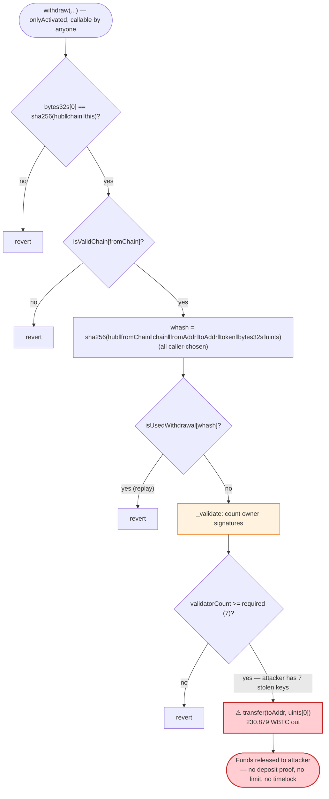
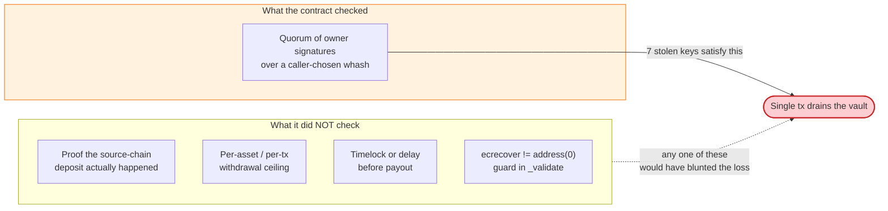

# Orbit Chain Bridge Exploit — Forged Validator Signatures Drain the ETH Vault

> **Reproduction:** the PoC compiles & runs in an isolated Foundry project at
> [this project folder](.) (the umbrella DeFiHackLabs repo contains many unrelated PoCs
> that fail to whole-compile, so this one was extracted).
> Full verbose trace: [output.txt](output.txt).
> Verified vulnerable source: [sources/EthVault_1Bf68A/EthVault.sol](sources/EthVault_1Bf68A/EthVault.sol)
> (the `EthVault.impl.sol` member of `_meta.json` holds the logic implementation reached via `delegatecall`).

---

## Key info

| | |
|---|---|
| **Loss** | ~**$81.5M** total across 5 assets (ETH, WBTC, USDT, USDC, DAI). This PoC reproduces the **WBTC leg: 230.879 WBTC** (≈ $9.8M at the time). |
| **Vulnerable contract** | Orbit `EthVault` proxy — [`0x1Bf68A9d1EaEe7826b3593C20a0ca93293cb489a`](https://etherscan.io/address/0x1bf68a9d1eaee7826b3593c20a0ca93293cb489a) (logic via `delegatecall` to `0xC3430BC8C2C05FC6b42114BF7F82a3e2f3Ee9454`) |
| **Victim** | The Orbit Bridge ETH-side vault (held ETH/WBTC/USDT/USDC/DAI bridged liquidity) |
| **Attacker EOA / `fromAddr`** | [`0x9263e7873613DDc598a701709875634819176AfF`](https://etherscan.io/address/0x9263e7873613ddc598a701709875634819176aff) |
| **Beneficiary `toAddr`** | `0x9ca536d01B9E78dD30de9d7457867F8898634049` |
| **Orbit Hub contract** | `0xB5680a55d627c52DE992e3EA52a86f19DA475399` |
| **Attack tx (WBTC leg)** | [`0xe0bada18fdc56dec125c31b1636490f85ba66016318060a066ed7050ff7271f9`](https://explorer.phalcon.xyz/tx/eth/0xe0bada18fdc56dec125c31b1636490f85ba66016318060a066ed7050ff7271f9) |
| **Chain / block / date** | Ethereum mainnet / fork at **18,908,049** / **Dec 31, 2023 – Jan 1, 2024** |
| **Compiler** | Vault source `^0.5.0`; PoC harness `^0.8.10` (trace built with Solc 0.8.34) |
| **Bug class** | Off-chain validator **private-key compromise** + on-chain signature-set verification with no on-chain spending limits / `ecrecover` zero-address guard |

---

## TL;DR

Orbit Bridge mints/releases assets on the destination chain only after a quorum of **validator
signatures** is presented to the vault's `withdraw()`. The ETH vault verifies those signatures with a
hand-rolled loop (`_validate`) that calls `ecrecover` on each `(v, r, s)` triple and counts how many
recover to a known owner. If `validatorCount >= required`, the funds are released — **no nonce on the
withdrawer, no per-asset limit, no timelock, no on-chain proof that the source-chain deposit ever
happened.**

The attacker obtained the validators' private keys off-chain (the Orbit signer infrastructure was
compromised) and simply **signed their own withdrawal message**: "send 230.879 WBTC to
`0x9ca5…4049`." They submitted those forged-but-cryptographically-valid signatures to
[`withdraw()`](sources/EthVault_1Bf68A/EthVault.sol) and the vault, finding 7 owner signatures over a
quorum it never independently anchored to a real deposit, dutifully transferred the WBTC out.

The PoC replays the **exact** on-chain `(v, r, s)` arrays and parameters against the forked vault. The
7 `ecrecover` calls in the trace return 7 distinct, legitimate validator addresses
([output.txt:1630-1643](output.txt#L1630-L1643)) — proving the signatures were genuinely produced by
the validator keys, i.e. a key-compromise, not a contract-logic bypass alone. The contract is the
*enabler*: its entire security rests on the secrecy of those keys, with zero on-chain defence in depth.

---

## Background — how the Orbit ETH vault releases funds

`EthVault` is a `delegatecall` proxy. The storage/layout contract is
[`EthVault.sol`](sources/EthVault_1Bf68A/EthVault.sol); the logic lives in `EthVaultImpl`
(the `EthVault.impl.sol` blob inside [`_meta.json`](sources/EthVault_1Bf68A/_meta.json)) and inherits
the classic Gnosis-style [`MultiSigWallet`](sources/EthVault_1Bf68A/EthVault.sol) for owner
bookkeeping (`isOwner`, `owners`, `required`).

The cross-chain release path is `withdraw(...)`:

1. Rebuild a "withdrawal hash" `whash = sha256(hubContract, fromChain, chain, fromAddr, toAddr, token, bytes32s, uints)`.
2. Require the hash has not been used (`isUsedWithdrawal[whash]`), then mark it used.
3. Call `_validate(whash, v, r, s)` to count how many of the supplied signatures recover to a current owner.
4. Require `validatorCount >= required`.
5. Transfer `uints[0]` units of `token` to `toAddr`.

Reading the on-chain state at the fork block (from the trace):

| Fact | Value | Source |
|---|---|---|
| `chain()` | `"ETH"` | [output.txt:1612-1613](output.txt#L1612-L1613) |
| Quorum check passed with | **7** valid owner signatures | [output.txt:1630-1643](output.txt#L1630-L1643) |
| WBTC held by vault before | **287.603 WBTC** (`28760310355`) | [output.txt:1645-1646](output.txt#L1645-L1646) |
| WBTC drained this tx | **230.879 WBTC** (`23087900000`) | [output.txt:1647-1648](output.txt#L1647-L1648) |
| `whash` computed by `withdraw` | `0x8df324c6…bf7b763d` | [output.txt:1628-1629](output.txt#L1628-L1629) |

The whole security model is: "if enough validator keys sign this message, it must be a real deposit."
There is **nothing else** — no Merkle proof of the source-chain event, no rate limit, no per-block cap.

---

## The vulnerable code

### 1. `withdraw()` — release gated only on a counted signature set

From `EthVaultImpl.withdraw` (the `EthVault.impl.sol` logic in
[`_meta.json`](sources/EthVault_1Bf68A/_meta.json)):

```solidity
function withdraw(
    address hubContract, string memory fromChain, bytes memory fromAddr,
    bytes memory toAddr, bytes memory token,
    bytes32[] memory bytes32s, uint[] memory uints,
    uint8[] memory v, bytes32[] memory r, bytes32[] memory s
) public onlyActivated {
    require(bytes32s.length >= 1);
    require(bytes32s[0] == sha256(abi.encodePacked(hubContract, chain, address(this)))); // "govId"
    require(uints.length >= 2);
    require(isValidChain[getChainId(fromChain)]);

    bytes32 whash = sha256(abi.encodePacked(
        hubContract, fromChain, chain, fromAddr, toAddr, token, bytes32s, uints));

    require(!isUsedWithdrawal[whash]);   // replay guard only
    isUsedWithdrawal[whash] = true;

    uint validatorCount = _validate(whash, v, r, s);  // ← the entire authorization
    require(validatorCount >= required);

    address payable _toAddr = bytesToAddress(toAddr);
    address tokenAddress    = bytesToAddress(token);
    if (tokenAddress == address(0)) {
        if (!_toAddr.send(uints[0])) revert();
    } else {
        if (tokenAddress == tetherAddress) {
            TIERC20(tokenAddress).transfer(_toAddr, uints[0]);
        } else {
            if (!IERC20(tokenAddress).transfer(_toAddr, uints[0])) revert();  // ← 230.879 WBTC out
        }
    }
    emit Withdraw(hubContract, fromChain, chain, fromAddr, toAddr, token, bytes32s, uints);
}
```

Every `require` here is satisfiable **by anyone who can produce a quorum of owner signatures over
`whash`** — and `whash` is fully chosen by the caller (`toAddr`, `token`, `uints[0]` are all attacker
inputs). The bridge never proves a corresponding deposit happened on the Orbit source chain; it trusts
the signatures to imply it.

### 2. `_validate()` — counts `ecrecover` hits, with two latent flaws

```solidity
function _validate(bytes32 whash, uint8[] memory v, bytes32[] memory r, bytes32[] memory s)
    private view returns (uint)
{
    uint validatorCount = 0;
    address[] memory vaList = new address[](owners.length);
    uint i = 0; uint j = 0;
    for (i; i < v.length; i++) {
        address va = ecrecover(whash, v[i], r[i], s[i]);   // ⚠️ no `va != address(0)` check
        if (isOwner[va]) {                                 // counts any recovered owner
            for (j = 0; j < validatorCount; j++) {
                require(vaList[j] != va);                  // de-dupes the same owner
            }
            vaList[validatorCount] = va;
            validatorCount += 1;
        }
    }
    return validatorCount;
}
```

Two structural weaknesses:

- **No `address(0)` guard.** `ecrecover` returns `address(0)` for malformed signatures. If `address(0)`
  were ever an owner, junk signatures would count. (In *this* incident the keys were real, so the
  attacker did not even need this trick — but it is the canonical latent bug in this contract family.)
- **The recovered owners are the *only* gate.** There is no binding to a real source-chain deposit, no
  per-asset withdrawal ceiling, and no timelock. Possession of `required` validator keys = unilateral
  power to drain the vault to any address.

---

## Root cause — why it was possible

The proximate cause of the December 2023 / January 2024 Orbit Bridge incident was an **off-chain
validator private-key compromise**: 7 of the 10 multisig signer keys were stolen (Orbit's required
quorum was 7), letting the attacker mint valid signatures over arbitrary withdrawal messages. The
on-chain code performed exactly as written — the 7 `ecrecover` results in the trace are 7 *genuine*
validator addresses:

```
ecrecover(whash, 27, …) → 0xa6dc28CbcB2f8060a00b4FA67F9b67775AC5a3a1
ecrecover(whash, 28, …) → 0x8a3F117Ef3b40f1661Dedf7f28fC33E7b6fae4F8
ecrecover(whash, 28, …) → 0x1c0Cd56F1c3E2cF13B9B44dBE5529104bade543E
ecrecover(whash, 27, …) → 0x7F4b332611818aE13c76f9222e2229f274Ded9BD
ecrecover(whash, 28, …) → 0x3924Ac70075078A7713f543b72e3F8817ecEc646
ecrecover(whash, 28, …) → 0x3b6590Ff12Ba188e465395E1610D8368613054B0
ecrecover(whash, 27, …) → 0x67C3c784C49d9ab8757ADb71491df1A1B38FbFA8
```
([output.txt:1630-1643](output.txt#L1630-L1643)) — all 7 hit `isOwner`, so `validatorCount = 7 ≥ required = 7`.

The *amplifying* root causes — the design decisions that turned a key compromise into an instant
$81.5M total loss with no friction — live in the contract:

1. **Signature quorum is the sole, unconstrained authorization.** `withdraw` releases *any* amount of
   *any* held asset to *any* address the moment a quorum signs. No Merkle/event proof that the deposit
   exists on the source chain; the bridge trusts the signers to embody that proof.
2. **No spending controls on-chain.** No per-asset cap, no per-tx/per-day limit, no cooldown, no
   timelock between authorization and payout. A single transaction can empty the vault.
3. **No defence in depth against `ecrecover` quirks.** `_validate` never rejects `address(0)`, the
   classic footgun that converts a single missing owner-slot mistake into a full bypass.
4. **Centralized, hot signer set.** 10 validator keys with a 7-of-10 quorum, evidently held in
   infrastructure reachable enough to be compromised together — the failure was not partial.

---

## Preconditions

- **Possession of a quorum of validator signatures** over an attacker-chosen withdrawal message. In the
  real incident this came from stolen private keys; in the PoC the historical `(v, r, s)` arrays are
  replayed verbatim ([test/OrbitChain_exp.sol:68-93](test/OrbitChain_exp.sol#L68-L93)).
- `isActivated == true` and the `fromChain` (`"ORBIT"`) is a registered valid chain — both true at the
  fork block.
- The chosen `whash` has not been used before (it had not — the PoC marks it used,
  [output.txt:1653-1654](output.txt#L1653-L1654)).
- The vault holds the target asset (287.603 WBTC at the time, of which 230.879 is taken).

No flash loan or capital is needed — the only "ingredient" is the compromised keys.

---

## Attack walkthrough (with on-chain numbers from the trace)

The attacker calls `withdraw()` directly on the vault proxy, which `delegatecall`s into the logic
contract at `0xC3430BC8…9454` ([output.txt:1618-1619](output.txt#L1618-L1619)).

| # | Step | Concrete values | Effect |
|---|------|-----------------|--------|
| 0 | **Pre-state** | Vault WBTC balance = **287.603 WBTC** (`28760310355`); attacker beneficiary balance = **0** | Honest bridge liquidity. |
| 1 | **Build govId** `bytes32s[0]` | `sha256(hub ‖ "ETH" ‖ vault) = 0x50f408…f060` | Passes `bytes32s[0]` check ([output.txt:1624-1625](output.txt#L1624-L1625)). |
| 2 | **Provide source tx hash** `bytes32s[1]` | `0xf7f60c98…0a1aaa` (the fabricated Orbit-chain "deposit") | Becomes part of `whash`. |
| 3 | **Provide amounts** `uints` | `[23087900000, 8, 8735]` = (230.879 WBTC, 8 decimals, depositId 8735) | Caller picks the payout amount. |
| 4 | **`withdraw` recomputes `whash`** | `sha256(…) = 0x8df324c6…bf7b763d` | The message the signatures must cover ([output.txt:1628-1629](output.txt#L1628-L1629)). |
| 5 | **Replay guard** | `isUsedWithdrawal[whash]` 0 → 1 | First use; allowed. |
| 6 | **`_validate` runs 7 `ecrecover`s** | 7 distinct owner addresses recovered | `validatorCount = 7` ([output.txt:1630-1643](output.txt#L1630-L1643)). |
| 7 | **Quorum check** | `7 >= required (7)` | Passes — authorization complete. |
| 8 | **Transfer out** | `WBTC.transfer(0x9ca5…4049, 23087900000)` | Vault WBTC `28760310355 → 5672410355`; beneficiary `0 → 23087900000` ([output.txt:1647-1654](output.txt#L1647-L1654)). |
| 9 | **Post-state** | Attacker beneficiary WBTC = **230.879 WBTC** | Funds gone ([output.txt:1657-1658](output.txt#L1657-L1658)). |

The storage diff confirms the theft in raw form: WBTC slot for the vault drops
`0x06b23f8253 → 0x01521a1cf3` (28,760,310,355 → 5,672,410,355) and the beneficiary slot goes
`0 → 0x0560256560` (23,087,900,000) ([output.txt:1650-1652](output.txt#L1650-L1652)).

### Profit / loss accounting (this WBTC leg)

| | Amount |
|---|---:|
| Vault WBTC before | 287.60310355 WBTC (`28760310355`) |
| Withdrawn to attacker | **230.879 WBTC** (`23087900000`) |
| Vault WBTC after | 56.72410355 WBTC (`5672410355`) |
| Attacker capital spent | 0 (no flash loan, only gas) |
| **Net to attacker (this leg)** | **+230.879 WBTC** (≈ $9.8M) |

The full incident repeated this pattern across ETH, WBTC, USDT, USDC and DAI for a combined
**~$81.5M**. This PoC reproduces the WBTC leg only; the other legs are identical in mechanism (different
`token`, `uints[0]`, and `(v,r,s)` set).

---

## Diagrams

### Sequence of the attack

```mermaid
sequenceDiagram
    autonumber
    actor A as "Attacker (holds stolen validator keys)"
    participant V as "EthVault proxy<br/>0x1Bf68A…489a"
    participant L as "EthVaultImpl (logic)<br/>0xC3430B…9454"
    participant EC as "ecrecover precompile"
    participant W as "WBTC token"

    Note over A: Off-chain: 7 of 10 validator<br/>private keys compromised
    A->>A: Sign chosen message<br/>(toAddr, WBTC, 230.879) → 7×(v,r,s)

    A->>V: withdraw(hub, "ORBIT", fromAddr, toAddr,<br/>WBTC, bytes32s, uints=[230.879e8,8,8735], v,r,s)
    V->>L: delegatecall withdraw(...)
    L->>L: whash = sha256(hub‖fromChain‖chain‖<br/>fromAddr‖toAddr‖token‖bytes32s‖uints)
    Note over L: whash = 0x8df324c6…bf7b763d
    L->>L: require(!isUsedWithdrawal[whash]); mark used

    rect rgb(255,235,238)
    Note over L,EC: _validate — the entire authorization
    loop 7 signatures
        L->>EC: ecrecover(whash, v[i], r[i], s[i])
        EC-->>L: a genuine validator address
        L->>L: isOwner[va] == true ⇒ validatorCount++
    end
    L->>L: require(validatorCount 7 >= required 7) ✓
    end

    L->>W: transfer(toAddr, 23087900000)
    W-->>A: 230.879 WBTC
    Note over V: Vault WBTC 287.60 → 56.72
```

### Where the trust collapses



### The defence-in-depth that was missing



---

## Remediation

1. **Do not let a raw signature quorum be the sole authorization.** Bind every withdrawal to a verifiable
   proof of the source-chain deposit (Merkle/SPV proof against a committed source-chain state root, or a
   light-client/attestation that the deposit event exists). Signers should attest to *proofs*, not to
   free-form "send X to Y" messages.
2. **Add on-chain spending controls.** Per-asset and per-time-window withdrawal ceilings, plus a global
   circuit breaker / pause that any signer (or a watcher) can trip. A bridge holding $80M+ should never
   be drainable in one transaction.
3. **Introduce a timelock between authorization and payout** for large withdrawals, giving monitors and
   honest signers time to veto an anomalous release (this alone would likely have stopped most of the loss).
4. **Harden `_validate`.** Reject `ecrecover` returning `address(0)`, and prefer audited libraries
   (OpenZeppelin `ECDSA`) over hand-rolled loops; reject malleable `s` values and enforce ordered,
   non-duplicate signers.
5. **Reduce signer-key blast radius.** Use threshold signatures / HSMs / per-key network isolation so
   that compromising the infrastructure cannot harvest a full quorum at once; rotate keys and require
   geographic/operational separation. The on-chain code was the multiplier, but the breach itself was a
   key-management failure that defence-in-depth must assume *will* happen.

---

## How to reproduce

The PoC was extracted into a standalone Foundry project (the umbrella DeFiHackLabs repo has many
unrelated PoCs that fail to compile under `forge test`'s whole-project build):

```bash
_shared/run_poc.sh 2024-01-OrbitChain_exp --mt testExploit -vvvvv
```

- RPC: an **Ethereum mainnet archive** endpoint is required (`foundry.toml` aliases `mainnet`); the fork
  block is **18,908,049**. Most pruned/public RPCs will fail with `header not found` / `missing trie node`.
- The PoC replays the historical `(v, r, s)` arrays and the exact `withdraw` parameters from the real
  attack tx, so the 7 `ecrecover` calls recover genuine validator addresses against forked state.
- Result: `[PASS] testExploit()`. The beneficiary's WBTC balance goes from **0 → 230.879 WBTC**.

Expected tail:

```
  Exploiter WBTC balance before attack: 0.00000000
  Exploiter WBTC balance after attack: 230.87900000

Suite result: ok. 1 passed; 0 failed; 0 skipped; finished in 7.28s
Ran 1 test suite: 1 tests passed, 0 failed, 0 skipped (1 total tests)
```

---

*References: SlowMist / SolidityScan post-mortems of the Orbit Chain bridge hack
(https://blog.solidityscan.com/orbit-chain-hack-analysis-b71c36a54a69), Dec 31 2023 – Jan 1 2024, ~$81.5M.*
