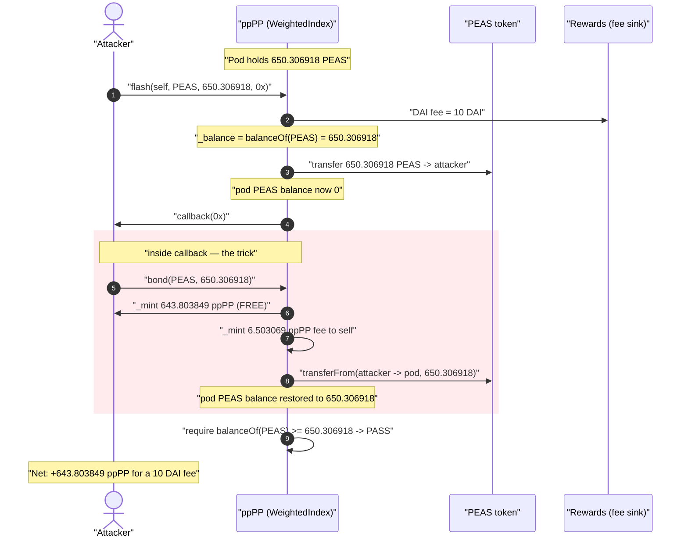
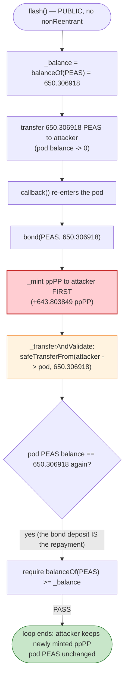
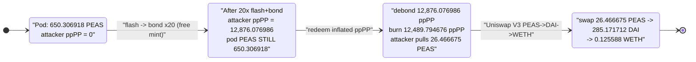

# Peapods Finance Exploit — Free Index-Token Mint via `flash()` + `bond()` Self-Collateralization

> **Reproduction:** the PoC compiles & runs in an isolated Foundry project at
> [this project folder](.) (the umbrella DeFiHackLabs repo contains many unrelated
> PoCs that do not compile together, so this one was extracted).
> Full verbose trace: [output.txt](output.txt).
> Verified vulnerable source: [contracts_DecentralizedIndex.sol](sources/WeightedIndex_dbB20A/contracts_DecentralizedIndex.sol)
> and [contracts_WeightedIndex.sol](sources/WeightedIndex_dbB20A/contracts_WeightedIndex.sol).

---

## Key info

| | |
|---|---|
| **Loss** | ~$1K (PoC extracts **0.1256 WETH** + dust; protocol's `PEAS` backing siphoned, index `ppPP` supply inflated ~20x) |
| **Vulnerable contract** | `WeightedIndex` ("ppPP" / Peapods pod) — [`0xdbB20A979a92ccCcE15229e41c9B082D5b5d7E31`](https://etherscan.io/address/0xdbB20A979a92ccCcE15229e41c9B082D5b5d7E31#code) |
| **Underlying asset / "victim"** | `PEAS` — [`0x02f92800F57BCD74066F5709F1Daa1A4302Df875`](https://etherscan.io/address/0x02f92800F57BCD74066F5709F1Daa1A4302Df875) (held inside ppPP) |
| **Attacker EOA / contract** | `0xbed4fbf7c3e36727ccdab4c6706c3c0e17b10397` |
| **Attack tx** | `0x95c1604789c93f41940a7fd9eca11276975a9a65d250b89a247736287dbd2b7e` ([BlockSec](https://app.blocksec.com/explorer/tx/eth/0x95c1604789c93f41940a7fd9eca11276975a9a65d250b89a247736287dbd2b7e)) |
| **Chain / block / date** | Ethereum mainnet / fork at **19,109,652** (one block before 19,109,653) / January 2024 |
| **Compiler** | Solidity v0.7.6 (`+commit.7338295f`), optimizer **200 runs** |
| **Bug class** | Re-entrancy-style accounting flaw — flash-loaned asset re-used as bond collateral; flash post-check satisfied by the bond's own deposit |

---

## TL;DR

`DecentralizedIndex` (the base of every Peapods pod, here the `WeightedIndex` instance "ppPP")
exposes a **fee-only flash loan of its own underlying index asset** — `flash()`
([contracts_DecentralizedIndex.sol:235-252](sources/WeightedIndex_dbB20A/contracts_DecentralizedIndex.sol#L235-L252)).
It lends out the pod's `PEAS` holdings, invokes the borrower's `callback`, and afterwards only requires
that the pod's `PEAS` balance is *back to where it started*:

```solidity
uint256 _balance = IERC20(_token).balanceOf(address(this));
IERC20(_token).safeTransfer(_recipient, _amount);
IFlashLoanRecipient(_recipient).callback(_data);
require(IERC20(_token).balanceOf(address(this)) >= _balance, 'FLASHAFTER');
```

Inside the callback the attacker calls `bond()`
([contracts_WeightedIndex.sol:114-139](sources/WeightedIndex_dbB20A/contracts_WeightedIndex.sol#L114-L139)) with **the exact `PEAS` it just borrowed**. `bond()`:

1. **mints index tokens first** (`_mint(msg.sender, _tokensMinted - _feeTokens)`), then
2. **pulls the `PEAS` in** via `_transferAndValidate` → `safeTransferFrom`.

Step 2 deposits the borrowed `PEAS` back into the pod, which simultaneously **repays the flash loan**
(the pod's `PEAS` balance is restored) **and counts as a real bond deposit** (the attacker keeps freshly
minted `ppPP`). The same tokens do double duty: collateral *and* loan repayment.

By looping flash → bond **20 times**, the attacker mints ~12,876 `ppPP` while only ever circulating the
pod's single ~650 `PEAS` balance, paying nothing but the flat **10 DAI** flash fee per loop. Finally the
attacker `debond()`s the inflated `ppPP` to drain `PEAS` and swaps it out via Uniswap V3 to WETH.

---

## Background — what Peapods pods do

A Peapods pod (`WeightedIndex`, deriving `DecentralizedIndex`) is an index/wrapper token. Users **bond**
underlying assets (here a single asset, `PEAS`) and receive pod tokens (`ppPP`) priced off the configured
per-token rate `q1`. They later **debond** to redeem a pro-rata slice of the pod's underlying holdings.

The base contract additionally offers:

- **`flash(recipient, token, amount, data)`** — a flash loan of *any token the pod holds*, including its own
  underlying index asset, for a **flat 10 DAI fee** routed to the rewards contract
  ([:235-252](sources/WeightedIndex_dbB20A/contracts_DecentralizedIndex.sol#L235-L252)).
- **`bond` / `debond`** — mint/burn pod tokens against the underlying.

On-chain state at the fork block (read from the trace):

| Parameter | Value |
|---|---|
| `PEAS` held by ppPP (the entire pod reserve) | **650.306918473813547768 PEAS** |
| `BOND_FEE` | 100 bps = **1%** (mints 1% extra to the pod, not to the bonder) |
| `FLASH_FEE_DAI` | **10 DAI** flat, per `flash()` call |
| Attacker starting capital | **200 DAI** (`deal`ed in the PoC) |
| `q1` (per-pod-token rate) | such that 650.306 PEAS ⇒ 650.306 `ppPP` minted (1:1 here) |

The pod holds only ~650 PEAS, yet `flash()` lets anyone borrow **all** of it at once, and `bond()` lets
the borrower turn that borrowed amount into a permanent mint — that interplay is the whole exploit.

---

## The vulnerable code

### 1. `flash()` lends the pod's own underlying and only checks the post-balance

[contracts_DecentralizedIndex.sol:235-252](sources/WeightedIndex_dbB20A/contracts_DecentralizedIndex.sol#L235-L252):

```solidity
function flash(
    address _recipient,
    address _token,
    uint256 _amount,
    bytes calldata _data
) external override {
    address _rewards = StakingPoolToken(lpStakingPool).poolRewards();
    IERC20(DAI).safeTransferFrom(                       // flat 10 DAI fee only
        _msgSender(), _rewards,
        FLASH_FEE_DAI * 10 ** IERC20Metadata(DAI).decimals()
    );
    uint256 _balance = IERC20(_token).balanceOf(address(this)); // snapshot BEFORE lending
    IERC20(_token).safeTransfer(_recipient, _amount);           // lend ALL the PEAS out
    IFlashLoanRecipient(_recipient).callback(_data);            // attacker re-enters here
    require(IERC20(_token).balanceOf(address(this)) >= _balance, 'FLASHAFTER'); // weak check
    emit FlashLoan(_msgSender(), _recipient, _token, _amount);
}
```

There is **no `nonReentrant` guard** and the only invariant enforced is "PEAS balance must not drop." Any
inflow of `PEAS` during the callback — *including a `bond()` deposit* — satisfies it.

### 2. `bond()` mints first, then pulls collateral — so the loaned PEAS repays the loan

[contracts_WeightedIndex.sol:114-139](sources/WeightedIndex_dbB20A/contracts_WeightedIndex.sol#L114-L139):

```solidity
function bond(address _token, uint256 _amount) external override noSwap {
    require(_isTokenInIndex[_token], 'INVALIDTOKEN');
    uint256 _tokenIdx = _fundTokenIdx[_token];
    uint256 _tokensMinted = (_amount * FixedPoint96.Q96 * 10 ** decimals()) /
        indexTokens[_tokenIdx].q1;
    uint256 _feeTokens = _isFirstIn() ? 0 : (_tokensMinted * BOND_FEE) / 10000;
    _mint(_msgSender(), _tokensMinted - _feeTokens);     // ⚠️ MINT happens before the pull
    if (_feeTokens > 0) { _mint(address(this), _feeTokens); }
    for (uint256 _i; _i < indexTokens.length; _i++) {
        uint256 _transferAmount = _i == _tokenIdx ? _amount : /* weighted */ ...;
        _transferAndValidate(                            // ⚠️ pulls the borrowed PEAS back in
            IERC20(indexTokens[_i].token), _msgSender(), _transferAmount
        );
    }
    emit Bond(_msgSender(), _token, _amount, _tokensMinted);
}
```

`_transferAndValidate` ([contracts_DecentralizedIndex.sol:128-139](sources/WeightedIndex_dbB20A/contracts_DecentralizedIndex.sol#L128-L139))
does a plain `safeTransferFrom(sender → pod)` — it does not distinguish "fresh capital from the user" from
"the pod's own PEAS that was just flash-lent to the user." So depositing the loaned PEAS both:

- **mints `ppPP` to the attacker** (the bond reward), and
- **restores the pod's PEAS balance**, satisfying `flash()`'s `'FLASHAFTER'` check.

### 3. `debond()` redeems the pod's underlying pro-rata

[contracts_WeightedIndex.sol:141-167](sources/WeightedIndex_dbB20A/contracts_WeightedIndex.sol#L141-L167):

```solidity
uint256 _percAfterFeeX96 = (_amountAfterFee * FixedPoint96.Q96) / totalSupply();
...
uint256 _debondAmount = (_tokenSupply * _percAfterFeeX96) / FixedPoint96.Q96;
IERC20(indexTokens[_i].token).safeTransfer(_msgSender(), _debondAmount);
```

After the inflation the attacker burns its `ppPP` to pull out the pod's PEAS.

---

## Root cause — why it was possible

The flash-loan invariant is the wrong one. `flash()` enforces *"the asset I lent must come back"* but it
does **not** enforce *"no new claim on that asset was minted while it was out of my custody."* `bond()`
violates exactly that: it creates a brand-new claim (`ppPP`) the instant the borrowed PEAS is returned.

Three design decisions compose into the bug:

1. **The pod flash-lends its own underlying index asset.** The thing being borrowed is the *same* asset
   that `bond()` accepts as collateral, so a single token balance can satisfy two unrelated obligations.
2. **`bond()` mints before (and independently of) verifying that the deposited collateral is *new*.** It
   relies solely on `safeTransferFrom` succeeding; the borrowed PEAS transfers in fine, so the mint stands.
3. **`flash()` has no re-entrancy / no-mint guard.** Re-entering `bond()` mid-callback is allowed, and the
   post-balance check is trivially passed by the bond's own deposit (`balanceOf` returns to the snapshot).

Net effect: the attacker manufactures `ppPP` out of thin air. Each loop, the *same* ~650 PEAS is lent out,
bonded back, and the attacker walks away with the freshly minted `ppPP` — paying only the flat 10 DAI flash
fee, regardless of how much it mints.

---

## Preconditions

- The pod holds some `PEAS` to flash-borrow (650.306 PEAS here) and `flash()`/`bond()` are permissionless.
- Working capital in DAI to pay the per-loop flash fee: **20 loops × 10 DAI = 200 DAI** (exactly the PoC's
  starting balance). This is the attacker's only real cost.
- A liquid `PEAS → DAI → WETH` route to cash out the redeemed PEAS (Uniswap V3, used at the end).

No price manipulation, no oracle, no governance — purely an accounting flaw reachable by anyone.

---

## Attack walkthrough (with on-chain numbers from the trace)

All figures are taken directly from the events in [output.txt](output.txt). The flash/bond loop runs
**20 times**; the table shows one representative loop plus the finale.

| # | Step | PEAS in pod (ppPP) | `ppPP` minted to attacker | Effect |
|---|------|-------------------:|--------------------------:|--------|
| 0 | **Initial** | 650.306918 | 0 | Honest pod, ~650 PEAS backing. |
| 1a | `flash(self, PEAS, 650.306918, "")` — pays 10 DAI fee, pod lends all PEAS | 0 (out on loan) | — | `_balance` snapshot = 650.306918. |
| 1b | inside `callback`: `bond(PEAS, 650.306918)` — `_mint` runs first | 0 | **+643.803849** (1% fee → pod) | Attacker minted ppPP *before* repaying. |
| 1c | bond's `safeTransferFrom` pulls the borrowed PEAS back into the pod | **650.306918** | — | Loan repaid **by the bond deposit itself**. |
| 1d | `flash` post-check: `650.306918 >= 650.306918` ✓ | 650.306918 | — | `'FLASHAFTER'` passes; loop nets +643.8 ppPP free. |
| … | **repeat 20×** (each loop: −10 DAI fee, +643.803849 ppPP) | 650.306918 | accumulating | Same PEAS recycled every loop. |
| 2 | After 20 loops | 650.306918 | **12,876.076986** | ppPP supply massively inflated. |
| 3 | `debond(12,876.076986, [PEAS], [100])` — burns 12,489.79 ppPP after debond fee | → 623.840244 left | — | Redeems pro-rata; attacker pulls **26.466675 PEAS**. |
| 4 | `exactInput`: 26.466675 PEAS → 285.171712 DAI → **0.125588 WETH** | — | — | Cash-out via Uniswap V3. |

Key trace anchors:

- Per-loop flash fee: `DAI::transferFrom(attacker → rewards 0x37B8…B9d1, 10e18)` (20 occurrences).
- Per-loop free mint: `emit Transfer(from: 0x0…0, to: attacker, value: 643803849289075412291)` i.e.
  **643.803849 ppPP** to the attacker, plus `… to: ppPP, value: 6503069184738135477` = **6.503069 ppPP**
  (the 1% `BOND_FEE`) — confirming `_tokensMinted = 650.306918`.
- Loan repayment = bond deposit: inside `bond`, `Peas::transferFrom(attacker → ppPP, 650306918473813547768)`
  restores the pod to 650.306918 PEAS; `flash`'s subsequent `Peas::balanceOf(ppPP) = 650.306918` ✓.
- Final accumulation: `ppPP::balanceOf(attacker) = 12876076985781508245820` = **12,876.076986 ppPP**.
- `debond` burn: `Transfer(ppPP → 0x0, 12489794676208062998445)` = **12,489.794676 ppPP** (after debond fee);
  PEAS returned to attacker: `Peas::transfer(ppPP → attacker, 26466674741698950990)` = **26.466675 PEAS**.
- Cash-out: `Swap(... amount0: 26.466675 PEAS, amount1: -285.171712 DAI)` then
  `WETH::transfer(pool → attacker, 125588245324910319)` = **0.125588 WETH**.

### Profit / loss accounting

| Item | Amount |
|---|---:|
| Attacker spent — 20 × 10 DAI flash fee | **200 DAI** |
| Attacker received — redeemed PEAS (26.466675) swapped out | **0.125588 WETH** (~$285 DAI of value) |
| Net to attacker | small positive (~$1K-scale per SlowMist) after gas/route |
| **Protocol damage** | `ppPP` supply inflated ~20× (650 → 12,876 minted), pod PEAS backing siphoned via debond, every honest `ppPP` holder's redemption value diluted |

The headline dollar figure is small (~$1K) only because the targeted pod was tiny (~650 PEAS). The *bug* is
unbounded relative to pod size: any pod is fully drainable for the price of N×10 DAI flash fees.

---

## Diagrams

### Sequence of one flash→bond loop (repeated 20×)



### Why the same PEAS does double duty



### Supply inflation over the attack



---

## Remediation

1. **Add re-entrancy protection to `flash()` (and ideally `bond`/`debond`).** A `nonReentrant` guard on
   `flash()` would block re-entering `bond()` during the callback, which is the entire exploit primitive.
2. **Never flash-lend the pod's own underlying index asset.** If flash loans are a feature, restrict the
   lendable set to assets that are *not* accepted by `bond()`. Lending the bondable asset means a single
   balance can simultaneously be "loan outstanding" and "collateral deposited."
3. **Make `flash()`'s post-condition mint-aware, not balance-aware.** Snapshot `totalSupply()` of the pod
   token (and per-asset balances) before the callback and require they are unchanged — not merely that the
   borrowed token's balance recovered. A balance-only check is satisfied by *any* inflow, including a bond.
4. **Pull collateral before minting in `bond()`.** Performing `_transferAndValidate` (the `safeTransferFrom`)
   *before* `_mint`, combined with disallowing the borrowed-asset path, removes the "mint first, repay with
   the same tokens" ordering. (Checks-effects-interactions on the deposit.)
5. **Track flash-loan state across entrypoints.** Set a `flashActive` flag in `flash()` and have `bond` /
   `debond` revert while it is set, so the borrowed funds cannot be recycled into the pod's own accounting.

---

## How to reproduce

The PoC was extracted into a standalone Foundry project (the umbrella DeFiHackLabs repo has many unrelated
PoCs that fail to compile under one whole-project `forge build`):

```bash
_shared/run_poc.sh 2024-01-PeapodsFinance_exp -vvvvv
```

- RPC: a mainnet archive endpoint is required (fork at block **19,109,652**).
- Result: `[PASS] testExploit()`.

Expected tail:

```
Ran 1 test for test/PeapodsFinance_exp.sol:ContractTest
[PASS] testExploit() (gas: 2363057)
Logs:
  Exploiter DAI balance before attack: 200.000000000000000000
  Exploiter WETH balance after attack: 0.125588245324910319

Suite result: ok. 1 passed; 0 failed; 0 skipped
```

---

*Reference: Peapods Finance, Ethereum mainnet, January 2024. Root cause: flash-loaned underlying re-used as
`bond()` collateral; `flash()`'s balance-only post-check satisfied by the bond's own deposit, minting index
tokens for free.*
