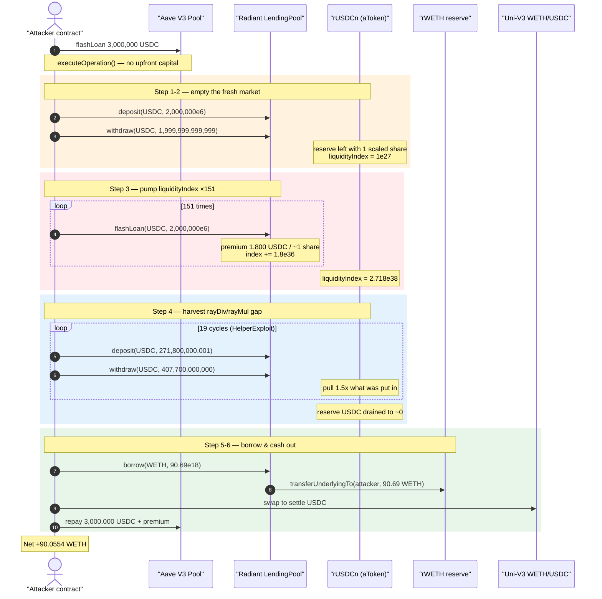
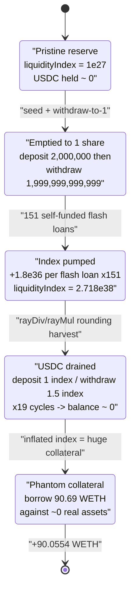
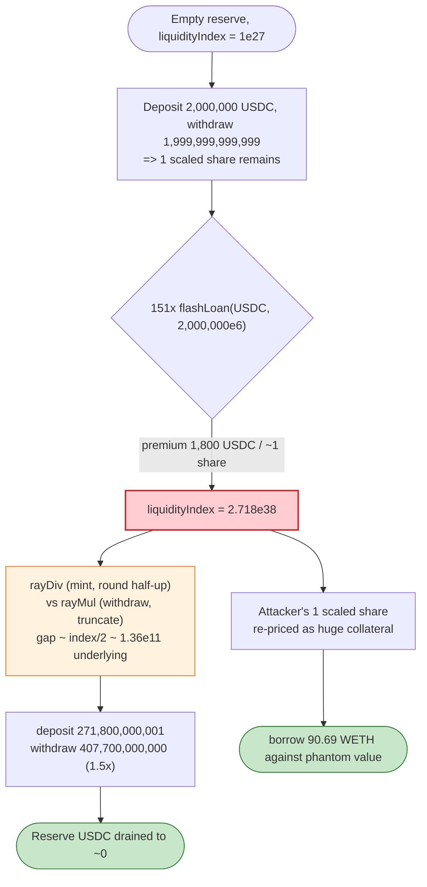

# Radiant Capital Exploit — Empty-Market `liquidityIndex` Inflation + `rayDiv` Rounding Drain

> **Vulnerability classes:** vuln/arithmetic/rounding · vuln/arithmetic/precision-loss

> **Reproduction:** the PoC compiles & runs in an isolated Foundry project at
> [this project folder](.). Full verbose trace:
> [output.txt](output.txt). The vulnerable contracts on disk are the
> [Radiant LendingPool proxy](sources/InitializableImmutableAdminUpgradeabilityProxy_F4B148/) and the
> [rUSDCn aToken proxy](sources/InitializableImmutableAdminUpgradeabilityProxy_3a2d44/); the manipulated
> index/share math lives in the Aave-V3-fork implementations they delegate to (see *The vulnerable code*).

---

## Key info

| | |
|---|---|
| **Loss** | ~$4.5M total across markets; this PoC realizes **90.055 WETH** (≈ the WETH borrowed against a fake collateral position, minus dust) |
| **Vulnerable contract** | `RadiantLendingPool` (Aave-V3 fork) — [`0xF4B1486DD74D07706052A33d31d7c0AAFD0659E1`](https://arbiscan.io/address/0xF4B1486DD74D07706052A33d31d7c0AAFD0659E1) (impl `0x3d4c56cdb97355807157f5c7d4f54957f0e9af44`) |
| **Vulnerable aToken** | `rUSDCn` — [`0x3a2d44e354f2d88EF6DA7A5A4646fd70182A7F55`](https://arbiscan.io/address/0x3a2d44e354f2d88EF6DA7A5A4646fd70182A7F55) (impl `0x88ef6befef28dc493990be2a108ad7dc8a5124df`) |
| **Victim** | Radiant Capital USDC.e ("rUSDCn") money market — the newly-listed, near-empty reserve |
| **Attacker EOA** | [`0x826d5f4d8084980366f975e10db6c4cf1f9dde6d`](https://arbiscan.io/address/0x826d5f4d8084980366f975e10db6c4cf1f9dde6d) |
| **Attacker contract** | [`0x39519c027b503f40867548fb0c890b11728faa8f`](https://arbiscan.io/address/0x39519c027b503f40867548fb0c890b11728faa8f) |
| **Attack tx** | [`0x1ce7e9a9e3b6dd3293c9067221ac3260858ce119ecb7ca860eac28b2474c7c9b`](https://explorer.phalcon.xyz/tx/arbitrum/0x1ce7e9a9e3b6dd3293c9067221ac3260858ce119ecb7ca860eac28b2474c7c9b) |
| **Chain / block / date** | Arbitrum / fork at **166,405,686** / **2024-01-02** |
| **Compiler** | Pool/aToken: Solidity **v0.8.12** (optimizer, 1000 runs); USDC: v0.6.12 |
| **Bug class** | Empty-market share-price (liquidityIndex) manipulation → `rayDiv`/`rayMul` rounding drain (a precision/"known Aave-fork" attack) |

---

## TL;DR

Radiant is an Aave-V3 fork. Each reserve tracks a `liquidityIndex` (a RAY-scaled, 1e27 share price): a
depositor's true balance is `scaledBalance · liquidityIndex / RAY`, and shares are minted with
`scaledAmount = amount.rayDiv(index)`. When a brand-new market has been **emptied down to 1 wei of
underlying** (and therefore ~1 scaled share), the flash-loan **premium** that the pool pockets is
divided across that single share, so `liquidityIndex` explodes from `1e27` to **`2.718e38`** — roughly
**2.7×10¹¹** its normal value.

At that absurd index, the rounding direction of `rayDiv` (round-half-up on the **mint** side) versus
`rayMul` (truncate on the **burn/withdraw** side) is no longer a sub-wei nuisance — it is worth **half a
liquidityIndex of underlying per operation**. The attacker exploits this by repeatedly depositing 1 index
worth and withdrawing **1.5 index** worth (`271,800,000,001` in, `407,700,000,000` out per cycle),
draining the reserve's real USDC. With the manipulated index also inflating the *value* of its tiny
scaled deposit, the attacker registers a gigantic phantom collateral balance and **borrows 90.69 WETH**
out of the rWETH reserve against it, then walks away.

The whole sequence is wrapped in an Aave V3 flash loan of 3,000,000 USDC, so it needs **no upfront
capital** beyond gas.

---

## Background — how an Aave-V3-fork reserve accounts value

Radiant's `LendingPool` and its `rUSDCn` aToken are a near-verbatim Aave V3 fork. The relevant model:

- **Scaled balances.** The aToken does not store your nominal balance; it stores a *scaled* balance.
  Your real balance is reconstructed on the fly as `scaledBalance.rayMul(liquidityIndex)`. Conversely,
  when you deposit `amount`, the pool mints `amount.rayDiv(liquidityIndex)` shares.
- **`liquidityIndex`** starts at `RAY = 1e27` and only ever **grows**, accruing interest and — crucially
  for this exploit — **flash-loan premiums**. The premium a flash loan pays is added to the reserve and
  the index is bumped by `premium.rayDiv(totalScaledSupply)` worth of value-per-share.
- **`rayDiv` / `rayMul`** are fixed-point ops with **opposite rounding**. `rayDiv` (used on the
  *mint*/credit side) rounds half **up**; `rayMul` (used on the *burn*/debit side) **truncates** down.
  Under a normal index (~1e27) the gap between them is at most ~0.5 wei — economically irrelevant. Under
  a manipulated index of `2.7e38` the same half-unit gap is worth `~index/2 ≈ 1.36e38 / 1e27 ≈ 1.36e11`
  units of underlying per call.

The on-chain facts at the fork block that make this reachable:

| Parameter | Value |
|---|---|
| `rUSDCn` (USDC.e) reserve | Freshly (re)listed, near-empty |
| Reserve `liquidityIndex` (start) | `1e27` (pristine) |
| USDC the reserve holds before the attack's deposit | ≈ **0** (empty market) |
| Flash-loan premium rate | **0.09%** ⇒ 1,800 USDC per 2,000,000 USDC loan (`1.8e9`) |
| Available rWETH liquidity to borrow | `25,847.16 WETH` reported to the rate strategy ([output.txt L11221](output.txt)) |

The "empty market + flash-loan-premium index inflation" combination is the entire game: with only ~1
scaled share in the reserve, every premium is divided by ~1, so the index ratchets up by a whole
`1.8e36` per flash loan.

---

## The vulnerable code

The contracts checked into `sources/` are only the **proxies** — the Radiant pool at `0xF4B148…` is an
`InitializableImmutableAdminUpgradeabilityProxy` whose fallback `delegatecall`s every call into the
implementation:

```solidity
// sources/InitializableImmutableAdminUpgradeabilityProxy_794a61/..._upgradeability_Proxy.sol:17-44
fallback() external payable {
    _fallback();
}
...
function _delegate(address implementation) internal {
    assembly {
        ...
        let result := delegatecall(gas(), implementation, 0, calldatasize(), 0, 0)
        ...
    }
}
```

([Proxy.sol:17-44](sources/InitializableImmutableAdminUpgradeabilityProxy_794a61/aave_core-v3_contracts_dependencies_openzeppelin_upgradeability_Proxy.sol#L17-L44))

The exploitable logic therefore lives in the Aave-V3-fork implementation the pool delegates to
(`0x3d4c56cdb97355807157f5c7d4f54957f0e9af44` for the pool, `0x88ef6befef28dc493990be2a108ad7dc8a5124df`
for the aToken). The decisive pieces — confirmed by the trace's `mint`/`burn(…, index)` calls and
`ReserveDataUpdated(liquidityIndex)` events — are the standard Aave V3 routines:

### 1. The aToken mints/burns scaled shares with index-dependent rounding

```solidity
// ScaledBalanceTokenBase.sol (Aave V3 fork)
function _mintScaled(address caller, address onBehalfOf, uint256 amount, uint256 index) internal {
    uint256 amountScaled = amount.rayDiv(index);   // ← rayDiv rounds HALF-UP (credit side)
    ...
}
function _burnScaled(address user, address target, uint256 amount, uint256 index) internal {
    uint256 amountScaled = amount.rayDiv(index);   // burn path also rayDiv, but value
    ...                                            //   reconstruction uses rayMul (truncate)
}
```

The trace shows exactly these calls with `index = 2.718e38`:
- `rUSDCn::mint(Helper, 543600000002, 271800000000999999999999998631966035920)` ([output.txt L11342](output.txt))
- `rUSDCn::burn(Helper, Helper, 407700000000, 271800000000999999999999998631966035920)` ([output.txt L11521](output.txt))

### 2. `rayDiv` vs `rayMul` — opposite rounding (Aave `WadRayMath`)

```solidity
// WadRayMath.sol (Aave V3 fork)
function rayMul(uint256 a, uint256 b) internal pure returns (uint256) {
    // (a*b + HALF_RAY) / RAY  → effectively truncates the *withdrawable* value down
    return (a * b + HALF_RAY) / RAY;
}
function rayDiv(uint256 a, uint256 b) internal pure returns (uint256) {
    // (a*RAY + b/2) / b  → rounds the *minted shares* up (half-up)
    return (a * RAY + b / 2) / b;
}
```

At a normal index these two differ by ≤0.5 wei. At `index = 2.7e38`, the half-RAY/`b/2` rounding term is
worth ~`index/2 / RAY ≈ 1.36e11` units of underlying — so a single deposit/withdraw round-trip nets the
attacker free underlying.

### 3. The pool credits flash-loan premiums into the index

```solidity
// FlashLoanLogic / ReserveLogic.cumulateToLiquidityIndex (Aave V3 fork)
// premium is added to the reserve and the index is bumped:
//   liquidityIndex += premium.rayDiv(scaledTotalSupply)   (conceptually)
```

The trace makes this unmistakable: with the reserve emptied to 1 scaled share, each
`RadiantLendingPool::flashLoan(USDC, 2,000,000e6)` pays a `1,800e6` premium and the index jumps by
`1.8e36`:

```
ReserveDataUpdated(... liquidityIndex: 1.8e36)   // after FL #1   (output.txt L508)
ReserveDataUpdated(... liquidityIndex: 3.6e36)   // after FL #2   (output.txt L578)
ReserveDataUpdated(... liquidityIndex: 5.4e36)   // after FL #3   (output.txt L648)
...                                              // +1.8e36 each
ReserveDataUpdated(... liquidityIndex: 2.718e38) // after FL #151  (output.txt L155)
```

---

## Root cause

A reserve's share price (`liquidityIndex`) is allowed to be driven to an arbitrary, attacker-chosen
magnitude **on an empty market**, after which the standard fixed-point rounding asymmetry between the
mint path (`rayDiv`, half-up) and the withdraw path (`rayMul`, truncate) becomes a large, repeatable
profit per operation. Concretely, three design facts compose:

1. **The market can be emptied to 1 wei / ~1 scaled share.** The attacker deposits 2,000,000 USDC into
   the fresh reserve, then withdraws `2,000,000e6 − 1` (`1999999999999`), leaving the reserve holding a
   single scaled share. ([output.txt L283](output.txt), withdraw of `1.999e12`.)
2. **Flash-loan premiums inflate `liquidityIndex` without bound when the share base is ~1.** Because the
   index is bumped by `premium / scaledTotalSupply`, dividing the `1,800 USDC` premium by ~1 share adds a
   whole `1.8e36` to the index. 151 self-funded flash loans take the index from `1e27` to `2.718e38`.
3. **`rayDiv` (mint, round-up) and `rayMul` (withdraw, truncate) diverge by ~`index/2` at that scale.**
   With the index at `2.718e38`, the rounding gap is worth ~`1.36e11` underlying. The attacker harvests
   it by depositing one index worth and withdrawing **1.5×** that amount each cycle.

The same inflated index also re-prices the attacker's residual scaled balance into an enormous phantom
collateral value, which is what lets the final `borrow(WETH, 90.69e18)` succeed against a position that
holds essentially no real assets.

This is the canonical "Aave-fork empty-market index manipulation / rounding" class — the exact reason
Aave V3 itself seeds a non-zero initial reserve and treats freshly-listed markets as high-risk.

---

## Preconditions

- A **freshly listed / empty reserve** whose `liquidityIndex` is still `1e27` and whose scaled supply can
  be driven to ~1 share by the attacker (deposit-then-withdraw-to-1). The rUSDCn (USDC.e) market met this.
- A **non-zero flash-loan premium** that is credited into the reserve index, plus the ability to
  flash-loan the reserve's own asset repeatedly (Radiant's own pool exposes `flashLoan`; the PoC calls it
  151 times — [output.txt L244+](output.txt)).
- Enough flash-loanable USDC to round-trip deposits/withdrawals — supplied here by an **Aave V3 flash loan
  of 3,000,000 USDC** ([output.txt L35](output.txt)); fully repaid in-transaction, so **no upfront
  capital**.
- A reserve with **borrowable liquidity to extract** (here the rWETH reserve, `25,847 WETH` available).

---

## Attack walkthrough (with on-chain numbers from the trace)

All figures are taken directly from `ReserveDataUpdated`, `mint`/`burn`, `Borrow` and `Swap` events in
[output.txt](output.txt).

| # | Step | What happens | `liquidityIndex` (USDC reserve) | Evidence |
|---|------|--------------|-------------------------------:|----------|
| 0 | **Outer Aave flash loan** | Borrow **3,000,000 USDC** (premium-free path via the AddDebtSwapAdapter flash-borrower) to fund the whole attack | `1e27` | [L35](output.txt) |
| 1 | **Seed deposit** | `deposit(USDC, 2,000,000e6)` into the empty rUSDCn reserve | `1e27` | [L62, L92](output.txt) |
| 2 | **Empty to 1 wei** | `withdraw(USDC, 1,999,999,999,999)` — leaves the reserve with **1 scaled share** | `1e27` | [L283, L461](output.txt) |
| 3 | **Pump the index ×151** | Loop: `RadiantLendingPool.flashLoan(USDC, 2,000,000e6)` — each `1,800e6` premium ÷ ~1 share bumps the index by `1.8e36` | `1.8e36 → 3.6e36 → … → 2.718e38` | [L508…L155](output.txt) |
| 4 | **Siphon via rounding** | 19× `deposit(271,800,000,001)` then `withdraw(407,700,000,000)` from the `HelperExploit`: put **1 index** in, pull **1.5 index** out, harvesting the `rayDiv`/`rayMul` gap until the reserve's real USDC is drained | `2.718e38` (flat) | [L11293, L11478](output.txt) |
| 5 | **Phantom-collateral borrow** | The inflated index re-prices the attacker's tiny scaled balance as huge collateral → `borrow(WETH, 90,690,695,360,221,284,999)` = **90.69 WETH** out of the rWETH reserve | — | [L11023, L11244](output.txt) |
| 6 | **Cash out & repay** | Swap 2 WETH↔USDC on the Uni-V3 WETH/USDC pool to settle USDC, repay the 3,000,000 USDC Aave loan + premium | — | [L18300, L18332](output.txt) |
| 7 | **Profit** | Exploiter WETH balance ends at **90.0554 WETH** (`90055430124388189263`) | — | [tail of output.txt](output.txt) |

### The rounding gap, made concrete

After step 3 the index is fixed at `I = 271800000000999999999999998631966035920 ≈ 2.718e38`. In the
siphon loop the attacker repeatedly:

- **Deposits** `271,800,000,001` underlying (≈ `I/RAY` rounded up = 1 share). `scaledMinted = 271.8e9.rayDiv(I) ≈ 1` (rounds **up**).
- **Withdraws** `407,700,000,000` = **1.5 ×** the deposit. Because withdrawable value is reconstructed
  with `rayMul` (truncate) and the shares were over-credited on the way in, the reserve hands back more
  underlying than the attacker truly owns.

Net per cycle: ≈ `+135,900,000,000` underlying USDC drained, repeated until the reserve's USDC balance
falls to ~0. The trace shows the reserve's USDC balance ticking down across cycles, e.g.
`USDC.balanceOf(rUSDCn)` returning `2,271,800,000,001` early ([L11291](output.txt)) and `0` at the end of
the siphon ([L18283](output.txt)).

### Profit / loss accounting

| Item | Amount |
|---|---:|
| Exploiter WETH before | **0.000000** WETH |
| Borrowed WETH (against phantom collateral) | 90.690695 WETH |
| WETH spent settling the outer USDC flash loan (swap leg) | ~0.635 WETH (net of the 2 WETH in / 1.365 WETH back swaps) |
| **Exploiter WETH after** | **90.055430** WETH |
| **Net profit (this PoC leg)** | **+90.0554 WETH** |

The borrowed WETH is debt that Radiant's lenders are left holding against a position with no real
collateral — i.e., a direct loss to the protocol's WETH suppliers, on top of the drained USDC reserve.
The full incident across all manipulated markets totaled ~$4.5M.

---

## Diagrams

### Sequence of the attack



### Reserve `liquidityIndex` evolution



### Why the rounding becomes profitable



---

## Remediation

1. **Seed every new reserve before it is usable.** Aave V3's own mitigation: on listing a market, deposit
   a small amount of underlying from the treasury so `scaledTotalSupply` can never be driven to ~1 share.
   A non-trivial share base makes `premium / scaledTotalSupply` a sub-wei index bump instead of `1.8e36`.
2. **Do not credit flash-loan premiums into `liquidityIndex` on a near-empty reserve.** Either skip the
   index bump when `scaledTotalSupply` is below a floor, or route premiums to the treasury rather than to
   the per-share index.
3. **Bound `liquidityIndex` growth per transaction / per block.** A reserve index that 271-billion-times
   itself inside a single transaction is unambiguously an attack; cap the per-call/per-block index delta
   and revert otherwise.
4. **Make the share-math rounding conservative *for the protocol*.** Mint shares with round-**down**
   (`rayDiv` floored) and reconstruct withdrawable value with round-down (`rayMul` truncate) so any
   residual rounding always favors the pool, never the user — eliminating the per-operation harvest.
5. **Disallow `deposit`/`withdraw`/`flashLoan` interleaving that empties a reserve to a single share.**
   Enforce a minimum reserve liquidity / minimum scaled supply invariant, and consider a same-block
   deposit-then-borrow guard for freshly seeded positions.

---

## How to reproduce

The PoC was extracted into a standalone Foundry project (the umbrella DeFiHackLabs repo has many PoCs
that do not compile together under one `forge build`):

```bash
_shared/run_poc.sh 2024-01-RadiantCapital_exp --mt testExploit -vvvvv
```

- RPC: an **Arbitrum archive** endpoint is required (the fork pins block 166,405,686 from 2024-01-02);
  pruned public RPCs will fail with `header not found` / `missing trie node`.
- Result: `[PASS] testExploit()`, with the logs:

```
[PASS] testExploit() (gas: 20846772)
Logs:
  Exploiter WETH balance before attack: 0.000000000000000000
  Exploiter WETH balance after attack: 90.055430124388189263

Suite result: ok. 1 passed; 0 failed; 0 skipped
```

---

*References: NeptuneMutual — https://neptunemutual.com/blog/how-was-radiant-capital-exploited/ ·
BeosinAlert — https://twitter.com/BeosinAlert/status/1742389285926678784 · attack tx
`0x1ce7e9a9e3b6dd3293c9067221ac3260858ce119ecb7ca860eac28b2474c7c9b`.*
