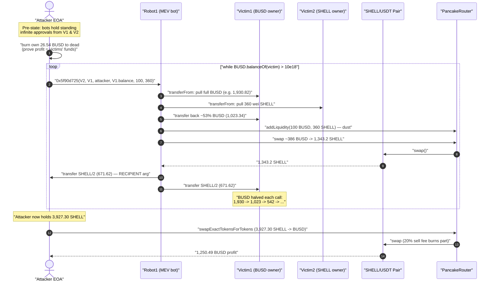
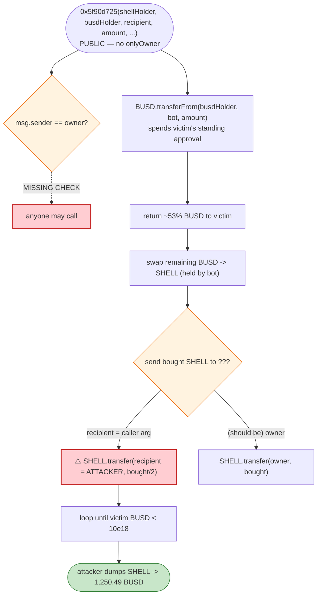
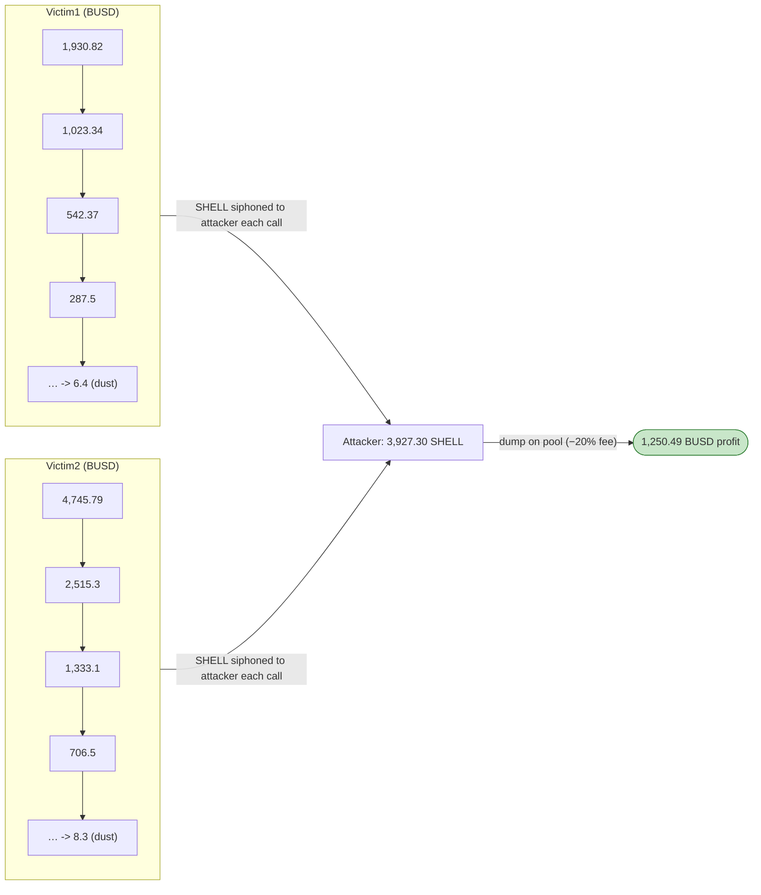

# SHELL MEV-Bot Drain — Permissionless Arbitrage Function with Attacker-Chosen Recipient

> **Vulnerability classes:** vuln/access-control/missing-auth · vuln/access-control/missing-modifier

> **Reproduction:** the PoC compiles & runs in an isolated Foundry project at
> [this project folder](.) (the umbrella DeFiHackLabs repo contains many unrelated
> PoCs that do not whole-compile, so this one was extracted).
> Full verbose trace: [output.txt](output.txt).
> Verified victim-token source: [SHELL.sol](sources/SHELL_5Df670/SHELL.sol). The two
> "Robot" contracts that actually held the funds are **closed-source** MEV bots
> (no verified bytecode on BscScan), so the analysis below reconstructs their
> logic from the execution trace.

---

## Key info

| | |
|---|---|
| **Loss** | ~$1,000 (≈ **1,250 BUSD** of the victims' stablecoin balances; SlowMist lists ~$1K). Two MEV-bot owners drained from **~6,677 BUSD** down to dust. |
| **Vulnerable contracts** | Two closed-source MEV/arbitrage bots: **Robot1** [`0xa898b78B7cbBabacf9d179C4C46c212c0aC66F46`](https://bscscan.com/address/0xa898b78B7cbBabacf9d179C4C46c212c0aC66F46) and **Robot2** [`0x923AA7C73909b21CF0854904dF2fA2394087f818`](https://bscscan.com/address/0x923AA7C73909b21CF0854904dF2fA2394087f818) |
| **Victims (bot owners / approvers)** | Victim1 [`0x100006d330F46e8f60359aFE62C29714e5D8438C`](https://bscscan.com/address/0x100006d330F46e8f60359aFE62C29714e5D8438C), Victim2 [`0xf5339777FE60a597316ad0B9Ed8A2b0444cF8317`](https://bscscan.com/address/0xf5339777FE60a597316ad0B9Ed8A2b0444cF8317) |
| **Tokens involved** | `BUSD`-pegged stablecoin (BSC-USD) `0x55d398326f99059fF775485246999027B3197955`; `SHELL` token [`0x5Df670150Be23c7BCF764E57F24D46BA88dCa621`](https://bscscan.com/address/0x5Df670150Be23c7BCF764E57F24D46BA88dCa621#code); SHELL/USDT pair `0x74aEDaf8Efb516cECd51b477DAF5f00E9c46F009` |
| **Attacker EOA** | `0x835b45d38cbdccf99e609436ff38e31ac05bc502` |
| **Attacker contract** | `0xd66a43d0a3e853b98d14268e240cf973e3fa986e` |
| **Attack tx** | [`0x24f114c0ef65d39e0988d164e052ce8052fe4a4fd303399a8c1bb855e8da01e9`](https://bscscan.com/tx/0x24f114c0ef65d39e0988d164e052ce8052fe4a4fd303399a8c1bb855e8da01e9) |
| **Chain / block / date** | BSC / 35,273,751 / **2024-01-15** |
| **Compiler** | SHELL token: Solidity v0.8.19, optimizer off. PancakePair: v0.5.16. |
| **Bug class** | Missing access control + attacker-controlled recipient on a permissionless function operating over pre-granted token approvals |

---

## TL;DR

Two BSC MEV/arbitrage bots ("Robot1", "Robot2") expose a **permissionless** function
with selector **`0x5f90d725`**. The bot owners had pre-approved the bots to spend their
**BUSD** and **SHELL**, expecting only the bot operator to call it. The function signature
is roughly:

```
0x5f90d725(address shellHolder, address busdHolder, address recipient,
           uint256 busdAmount, uint256 lpBusd, uint256 lpShell)
```

It (1) pulls `busdAmount` BUSD from `busdHolder` via `transferFrom`, (2) pulls a sliver of
SHELL from `shellHolder`, (3) seeds a tiny LP, (4) swaps roughly half of the pulled BUSD
into SHELL on the SHELL/USDT PancakeSwap pair, then (5) **sends the freshly-bought SHELL to
the caller-supplied `recipient`** and returns the leftover BUSD to the victim.

The fatal flaws:

1. **No access control** — anyone can invoke `0x5f90d725`.
2. **The output recipient is an attacker-chosen argument**, not the victim. The attacker
   simply passes its **own address** as `recipient`.
3. **The bots hold standing, near-infinite approvals** from the victims for both BUSD and
   SHELL, so an external caller can move the victims' funds at will.

The attacker calls the function in a loop, each iteration siphoning ~half of the victim's
remaining BUSD into SHELL that lands in the attacker's wallet, until the victims are drained
to dust. The attacker then dumps the accumulated **3,927.3 SHELL** back into the pool for
**1,250.49 BUSD** of pure profit.

---

## Background — what the system looks like

There is **no audited "protocol"** here in the usual sense. The components are:

- **SHELL token** ([SHELL.sol](sources/SHELL_5Df670/SHELL.sol)) — a Chinese-comment
  "DeFi fee token": a deflationary ERC20 whose `_swapPairList` main pair is `SHELL/USDT`,
  with an LP-tracking `_userInfo`, a 20% sell-destroy fee (`_sellBuyDestroyFee = 2000`,
  [SHELL.sol:145](sources/SHELL_5Df670/SHELL.sol#L145)), and add/remove-liquidity detection
  in `_transfer` ([SHELL.sol:247-301](sources/SHELL_5Df670/SHELL.sol#L247-L301)). SHELL itself
  is **not** the exploited contract — it is merely the asset the bots trade.
- The **PancakeSwap pair** `0x74aE…F009` (SHELL/BSC-USD), a standard Uniswap-V2
  `v0.5.16` pair. Reserves at the fork block: **reserve0 (SHELL) ≈ 10,942.5**, **reserve1
  (BSC-USD) ≈ 39,501.1** ([output.txt:1633](output.txt)).
- Two **MEV bots** (Robot1, Robot2) — closed-source contracts that run a "buy SHELL, seed
  LP, recycle BUSD" arbitrage/market-making routine on behalf of their owners (Victim1,
  Victim2). The owners granted the bots open-ended approvals for their BUSD and SHELL.

The on-chain starting balances of the victims (read in the trace):

| Victim | BUSD balance at block 35,273,750 |
|---|---:|
| **Victim1** (`0x1000…438C`) | **1,930.82 BUSD** ([output.txt:1604](output.txt)) |
| **Victim2** (`0xf533…8317`) | **4,745.79 BUSD** ([output.txt:2625](output.txt)) |
| **Total at risk** | **6,676.61 BUSD** |

Because the bots hold the victims' approvals and `0x5f90d725` is open to the public, those
balances are spendable by anyone.

---

## The vulnerable code

The Robot contracts are not verified, so there is no Solidity to quote for the bug itself.
What the trace shows unambiguously is how the function is invoked and how it routes funds.
The attacker's driver ([Shell_MEV_0xa898_exp.sol](test/Shell_MEV_0xa898_exp.sol)) calls the
raw selector with **its own address as the third argument**:

```solidity
// test/Shell_MEV_0xa898_exp.sol:38-44
while (BUSD.balanceOf(Victim1) > 10 * 1e18) {
    Robot1.call(
        abi.encodeWithSelector(
            bytes4(0x5f90d725),
            Victim2,                       // arg0: SHELL holder to pull from
            Victim1,                       // arg1: BUSD holder to pull from
            address(this),                 // arg2: RECIPIENT  ← attacker's address
            BUSD.balanceOf(address(Victim1)), // arg3: pull the victim's *entire* BUSD balance
            100,                           // arg4: tiny LP BUSD seed
            360                            // arg5: tiny LP SHELL seed
        )
    );
}
```

Reconstructed Robot logic for one `0x5f90d725(shellHolder, busdHolder, recipient, busdAmount, lpBusd, lpShell)` call, from [output.txt:1607-1717](output.txt):

```text
1.  BUSD.transferFrom(busdHolder, robot, busdAmount)          // pulls victim's full BUSD
2.  SHELL.transferFrom(shellHolder, robot, lpShell=360)       // pulls 360 wei SHELL
3.  BUSD.transfer(busdHolder, <part of busdAmount>)           // returns ~53% to the victim
4.  Router.addLiquidity(BUSD, SHELL, lpBusd=100, lpShell=360, …, to=robot, …)  // seed dust LP
5.  Router.swapExactTokensForTokens(<~part of busdAmount>, 0, [BUSD,SHELL], to=robot, …)
6.  SHELL.transfer(recipient,  boughtShell / 2)               // ⚠️ HALF the bought SHELL → attacker
7.  SHELL.transfer(busdHolder, boughtShell / 2)               // half back to the victim
```

The single defect that turns an ordinary market-making bot into a free ATM is **step 6**:
the SHELL the bot just bought *with the victim's BUSD* is sent to a **caller-controlled
`recipient`**, and **step 1/5** spend the victim's pre-approved BUSD with **no check that
`msg.sender` is the bot owner**.

For reference, the SHELL token's own `transferFrom` even *clears the standing approval to
MAX*, which is why each victim's allowance to the bot never decrements toward zero — the
bots were configured with effectively infinite, self-renewing approvals
([SHELL.sol:234-240](sources/SHELL_5Df670/SHELL.sol#L234-L240)):

```solidity
function transferFrom(address sender, address recipient, uint256 amount) public override returns (bool) {
    _transfer(sender, recipient, amount);
    if (_allowances[sender][msg.sender] != MAX) {
        _allowances[sender][msg.sender] = _allowances[sender][msg.sender] - amount;
    }
    return true;
}
```

---

## Root cause — why it was possible

This is **not** an AMM-invariant or pricing bug. The PancakeSwap pair and the SHELL token
behave exactly as designed. The loss comes entirely from the **MEV bots' own interface
design**:

1. **Permissionless privileged action.** `0x5f90d725` moves *other people's* tokens
   (the victims') yet has no `onlyOwner` / operator check. Anyone can call it.
2. **Attacker-controlled destination.** The address that receives the SHELL the bot buys is
   passed in as a parameter. There is no constraint tying `recipient` to the funding victim
   or to the bot owner, so the caller simply names itself.
3. **Standing infinite approvals.** The victims pre-approved the bots for BUSD and SHELL
   (and the SHELL token keeps `MAX` allowances pinned at MAX). The bot is therefore a live
   spending proxy over the victims' wallets; combined with (1) and (2), *any* third party
   inherits the victims' spending power.
4. **Caller-supplied amount = full balance.** The attacker passes
   `BUSD.balanceOf(victim)` as `busdAmount`, so each call operates on the maximum the victim
   still holds. Looping until the balance falls below `10 BUSD` extracts essentially all of
   it.

In short: a function that should have been `onlyOwner`, with a hard-coded `recipient = owner`,
was instead public with a free-form `recipient`. The standing approvals did the rest.

---

## Preconditions

- The victims must have **pre-approved** the bots to spend their BUSD and SHELL (true on
  chain; the bots are their own market-makers). No approval step appears in the PoC because
  it already exists in fork state.
- The victims must **hold a balance** worth draining (1,930.82 + 4,745.79 BUSD here).
- The function `0x5f90d725` must be **callable by anyone** (it is — `.call` from an arbitrary
  EOA succeeds).
- No flash loan or capital is required from the attacker. The attacker first dumps its own
  pre-existing BUSD to the dead address ([Shell_MEV_0xa898_exp.sol:35](test/Shell_MEV_0xa898_exp.sol#L35))
  precisely to *prove* the profit is sourced 100% from the victims, not from the attacker's
  own funds.

---

## Attack walkthrough (with on-chain numbers from the trace)

The pair's `token0 = SHELL` (reserve0), `token1 = BSC-USD` (reserve1). All figures are read
from `transferFrom` / `Swap` / `balanceOf` lines in [output.txt](output.txt).

Each `0x5f90d725` call on Robot1 pulls the victim's *entire* remaining BUSD, returns ~53% of
it, and converts the rest into SHELL that is split 50/50 between the attacker and the victim.
Net per call: the victim's BUSD roughly **halves**, and the attacker pockets SHELL.

### Victim BUSD draining sequence

| # | Caller | Victim1 BUSD | Victim2 BUSD | SHELL → attacker (this call) |
|---|--------|------------:|------------:|------------:|
| 0 | initial | 1,930.82 | 4,745.79 | — |
| 1 | Robot1 | 1,023.34 | — | 671.62 |
| 2 | Robot1 | 542.37 | — | 337.74 |
| 3 | Robot1 | 287.5 | — | 174.19 |
| 4 | Robot1 | 152.4 | — | 91.01 |
| 5 | Robot1 | 80.7 | — | 47.88 |
| 6 | Robot1 | 42.8 | — | 25.27 |
| 7 | Robot1 | 22.7 | — | 13.37 |
| 8 | Robot1 | 12.0 | — | 7.08 |
| 9 | Robot1 | 6.4 (loop exits <10) | — | 3.75 |
| 10–19 | Robot2 | — | 4,745.79 → **8.3** | 1,304.04 → 3.39 (10 calls) |

(Victim1 BUSD progression from [output.txt:1604,1719,1832,…](output.txt); Victim2 from
[output.txt:2625…](output.txt). The first Robot1 call's BUSD return of **1,023.34** to
Victim1 is visible at [output.txt:1623](output.txt); the split-SHELL transfers of
**671.62** to attacker and **671.62** to Victim1 are at [output.txt:1705](output.txt) and
[output.txt:1711](output.txt).)

After the loops, the attacker holds **3,927.30 SHELL** ([output.txt:3756](output.txt)), and
both victims are drained to dust (Victim1: 1,930.82 → 6.4; Victim2: 4,745.79 → 8.3).

### Final cash-out

The attacker dumps its 3,927.30 SHELL back into the pool via
`swapExactTokensForTokensSupportingFeeOnTransferTokens(SHELL → BSC-USD)`
([test/Shell_MEV_0xa898_exp.sol:57-64](test/Shell_MEV_0xa898_exp.sol#L57-L64)). The pair's
final swap pays the attacker **1,250.49 BSC-USD**
(`amount1In: 3,141.81 SHELL → amount0Out: 1,250.49`, [output.txt:3865](output.txt) —
the 20% SHELL sell-destroy fee burns part of the SHELL, hence 3,927 SHELL in → 3,141.8
reaching the pair).

> Note: the PoC's two `log_named_uint("Attacker BUSD balance before attack", …)` lines are
> both mislabeled. The first logs **0** (the attacker zeroed its own BUSD on purpose,
> [output.txt:1597](output.txt)); the second logs the **post-attack** profit of
> **1,250.49 BUSD** ([output.txt:3874](output.txt)).

### Profit / loss accounting (BUSD)

| Item | Amount |
|---|---:|
| Attacker's own BUSD at start | 26.54 |
| Attacker burns its own BUSD to dead address | −26.54 → **0** |
| Victim1 drained (1,930.82 → 6.4) | ≈ 1,924.4 of value extracted |
| Victim2 drained (4,745.79 → 8.3) | ≈ 4,737.5 of value extracted |
| SHELL accumulated by attacker | 3,927.30 SHELL |
| **Attacker final BUSD after dumping SHELL** | **1,250.49 BUSD** |
| **Attacker net profit** | **+1,250.49 BUSD** (from a 0 BUSD start) |

The victims collectively lost ~6,668 BUSD of *balance*, but because the bot recycled BUSD
through the deflationary, fee-charging SHELL pool (20% sell-destroy fee + AMM slippage), the
attacker's realized take was **1,250.49 BUSD** (~$1,000, consistent with SlowMist's figure).
The rest of the victims' value was bled into the SHELL pool reserves and burn fees.

---

## Diagrams

### Sequence of one drain iteration + cash-out



### Where the access-control / recipient flaw lives



### Victim BUSD balance decay (geometric halving)



---

## Remediation

1. **Add access control to the bot's privileged function.** `0x5f90d725` moves the owner's
   funds; it must be `onlyOwner` / `onlyOperator`. A permissionless function that spends
   pre-approved third-party tokens is a turnkey drain.
2. **Never accept the output recipient as a free parameter.** Hard-code the destination of
   bought tokens to `owner()` (or the funding account), so even an authorized call cannot
   redirect value. The destination should be derived from contract state, not from caller
   input.
3. **Do not grant standing infinite approvals to automated bots.** Approve per-trade amounts,
   or have the bot pull from a dedicated, ring-fenced operating wallet whose only assets are
   what the owner is willing to lose to a single transaction.
4. **Bind funding source to authorized actor.** If the function must move funds on behalf of
   a user, require that `busdHolder == msg.sender` (or an EIP-712 signature from the holder),
   not an arbitrary address whose approval merely happens to exist.
5. **Treat "the recipient is an argument" as a red flag in any token-moving function.**
   Output-redirection plus standing approvals is a recurring MEV-bot loss pattern; static
   checks should flag externally-callable functions that both spend `transferFrom` allowances
   and send proceeds to a caller-supplied address.

---

## How to reproduce

The PoC was extracted into a standalone Foundry project (the umbrella DeFiHackLabs repo has
many unrelated PoCs that fail to compile under a whole-project `forge build`):

```bash
_shared/run_poc.sh 2024-01-Shell_MEV_0xa898_exp --mt testExploit -vvvvv
```

- RPC: a **BSC archive** endpoint is required (fork block 35,273,750). `foundry.toml` uses
  `https://bsc-mainnet.public.blastapi.io`, which serves historical state at that block; many
  public BSC RPCs prune it and fail with `header not found` / `missing trie node`.
- Result: `[PASS] testExploit()`.

Expected tail ([output.txt:1566-1570](output.txt)):

```text
Ran 1 test for test/Shell_MEV_0xa898_exp.sol:ContractTest
[PASS] testExploit() (gas: 3255190)
Logs:
  Attacker BUSD balance before attack: 0
  Attacker BUSD balance before attack: 1250485519699724728444   # (mislabeled — this is the post-attack profit ≈ 1,250.49 BUSD)
```

---

*Reference: SlowMist Hacked — https://hacked.slowmist.io/ (SHELL / MEV-bot, BSC, ~$1K).
The Robot contracts are unverified; the function semantics above are reconstructed from the
verbose execution trace.*
