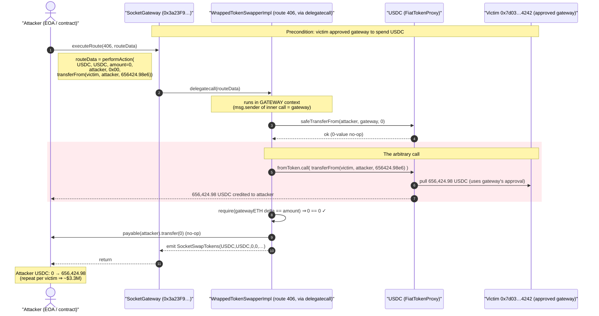
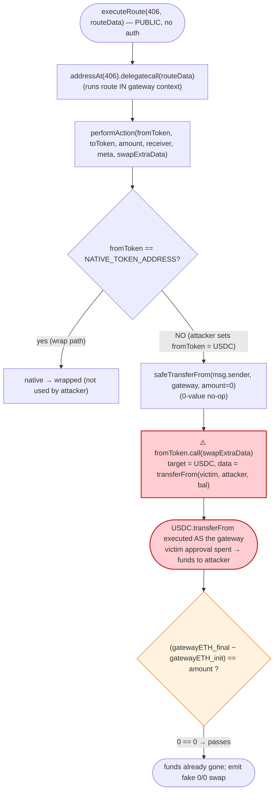
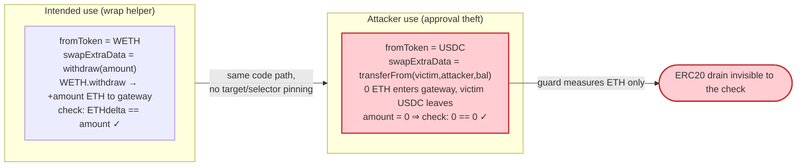

# Socket Gateway Exploit — Arbitrary `call` in `WrappedTokenSwapperImpl` Drains User Approvals

> **Reproduction:** the PoC compiles & runs in an isolated Foundry project at
> [this project folder](.) (the umbrella DeFiHackLabs repo
> contains many unrelated PoCs that do not whole-compile under `forge test`, so this one was extracted).
> Full verbose trace: [output.txt](output.txt).
> Verified vulnerable source: [src_swap_wrappedTokenSwapper_swapWrappedImpl.sol](sources/WrappedTokenSwapperImpl_CC5fDA/src_swap_wrappedTokenSwapper_swapWrappedImpl.sol).

---

## Key info

| | |
|---|---|
| **Loss** | **~$3.3M** across all approved users (multi-victim sweep). The PoC reproduces a single victim being drained of **656,424.98 USDC**. |
| **Vulnerable contract** | `WrappedTokenSwapperImpl` (route impl) — [`0xCC5fDA5e3cA925bd0bb428C8b2669496eE43067e`](https://etherscan.io/address/0xCC5fDA5e3cA925bd0bb428C8b2669496eE43067e#code) — added as **route id 406** |
| **Entry point** | `SocketGateway` — [`0x3a23F943181408EAC424116Af7b7790c94Cb97a5`](https://etherscan.io/address/0x3a23F943181408EAC424116Af7b7790c94Cb97a5) |
| **Victim (PoC)** | `0x7d03149A2843E4200f07e858d6c0216806Ca4242` — a user who had approved the gateway |
| **Drained token** | USDC — `0xA0b86991c6218b36c1d19D4a2e9Eb0cE3606eB48` |
| **Attacker EOA** | [`0x50DF5a2217588772471B84aDBbe4194A2Ed39066`](https://etherscan.io/address/0x50DF5a2217588772471B84aDBbe4194A2Ed39066) |
| **Attacker contract** | [`0xf2D5951bB0A4d14BdcC37b66f919f9A1009C05d1`](https://etherscan.io/address/0xf2D5951bB0A4d14BdcC37b66f919f9A1009C05d1) (created `0xd2bc9A9c2C39B8693ED4B2b72469032E87ED7F4a`) |
| **Attack tx** | [`0xc6c3331fa8c2d30e1ef208424c08c039a89e510df2fb6ae31e5aa40722e28fd6`](https://etherscan.io/tx/0xc6c3331fa8c2d30e1ef208424c08c039a89e510df2fb6ae31e5aa40722e28fd6) |
| **Chain / block / date** | Ethereum mainnet / fork at **19,021,453** / Jan 16, 2024 |
| **Compiler (PoC build)** | Solidity 0.8.34 (route originally compiled on 0.8.x) |
| **Bug class** | Arbitrary external call with attacker-controlled target + calldata, executed against approvals held by a shared spender |

---

## TL;DR

`SocketGateway` is a router whose `executeRoute(routeId, routeData)` blindly `delegatecall`s into the
route implementation at `routes[routeId]`
([src_SocketGateway.sol:87-102](sources/SocketGateway_3a23F9/src_SocketGateway.sol#L87-L102)).
A newly-added route, **id 406 → `WrappedTokenSwapperImpl`**, contains a `performAction` that, in its
ERC20→native branch, executes:

```solidity
(bool success, ) = fromToken.call(swapExtraData);
```

([swapWrappedImpl.sol:71](sources/WrappedTokenSwapperImpl_CC5fDA/src_swap_wrappedTokenSwapper_swapWrappedImpl.sol#L71))

Both `fromToken` (the call target) **and** `swapExtraData` (the calldata) are **fully attacker-controlled**.
Because the route runs via `delegatecall`, `msg.sender` of that inner call is the **SocketGateway itself** —
the very address that thousands of users had granted token approvals to. So the attacker simply makes the
gateway call `USDC.transferFrom(victim, attacker, victimBalance)` on its own behalf.

The single sanity check that should have stopped this —
`require((_finalBalanceTokenOut - _initialBalanceTokenOut) == amount)` — is trivially satisfied:
the attacker sets `amount = 0`, so the gateway's native-ETH balance delta (`0 == 0`) passes, while the
arbitrary call drains an ERC20 the check never looks at.

In the PoC, one approved victim is swept of **656,424.98 USDC**. In the live incident the attacker ran
this against every address that had a live approval to the gateway, for **~$3.3M** total.

---

## Background — Socket Gateway routing

Socket is a cross-chain liquidity/bridging aggregator. Its on-chain entry point, `SocketGateway`, is a
thin dispatcher: each "route" (a bridge or swap implementation) is registered under a numeric `routeId`,
and users call `executeRoute(routeId, routeData)` to invoke it.

```solidity
function executeRoute(uint32 routeId, bytes calldata routeData)
    external payable returns (bytes memory)
{
    (bool success, bytes memory result) = addressAt(routeId).delegatecall(routeData);
    if (!success) { assembly { revert(add(result, 32), mload(result)) } }
    return result;
}
```

([src_SocketGateway.sol:87-102](sources/SocketGateway_3a23F9/src_SocketGateway.sol#L87-L102))

Two facts make this dispatcher dangerous when combined with a bad route:

1. **It `delegatecall`s.** The route's code runs *in the gateway's storage and identity context*. Any
   external call the route makes has `msg.sender == SocketGateway`.
2. **The gateway is a shared approval sink.** To use any swap/bridge route, users approve the gateway to
   spend their tokens (the PoC's `setUp` does exactly this:
   `USDC.approve(_gateway, type(uint256).max)` — [SocketGateway_exp.sol:51](test/SocketGateway_exp.sol#L51)).
   Many users had standing, often unlimited, approvals.

So the security of *every* user approval rests on *every* registered route never making an arbitrary call.
Route 406 broke that.

---

## The vulnerable code

### Route 406: `WrappedTokenSwapperImpl.performAction`

The route is meant to wrap/unwrap a native token (e.g. ETH ⇄ WETH). The ERC20→native branch — the path
the attacker drives — is:

```solidity
function performAction(
    address fromToken,
    address toToken,
    uint256 amount,
    address receiverAddress,
    bytes32 metadata,
    bytes calldata swapExtraData
) external payable override returns (uint256) {
    uint256 _initialBalanceTokenOut;
    uint256 _finalBalanceTokenOut;

    if (fromToken == NATIVE_TOKEN_ADDRESS) {
        ...
    } else {
        _initialBalanceTokenOut = address(socketGateway).balance;

        // Swap Wrapped Token To Native Token
        ERC20(fromToken).safeTransferFrom(msg.sender, socketGateway, amount);   // amount = 0 (no-op)

        (bool success, ) = fromToken.call(swapExtraData);                       // ⚠️ ARBITRARY CALL
        if (!success) { revert SwapFailed(); }

        _finalBalanceTokenOut = address(socketGateway).balance;

        require(
            (_finalBalanceTokenOut - _initialBalanceTokenOut) == amount,        // 0 == 0  ✓ passes
            "Invalid wrapper contract"
        );

        // send ETH to the user
        payable(receiverAddress).transfer(amount);                             // transfer 0 (no-op)
    }
    ...
}
```

([swapWrappedImpl.sol:32-99](sources/WrappedTokenSwapperImpl_CC5fDA/src_swap_wrappedTokenSwapper_swapWrappedImpl.sol#L32-L99) — the critical line is
[:71](sources/WrappedTokenSwapperImpl_CC5fDA/src_swap_wrappedTokenSwapper_swapWrappedImpl.sol#L71))

The intent was: "pull `amount` of the wrapped token from the user, call `wrappedToken.withdraw(amount)`
to unwrap it into native ETH that lands in the gateway, then forward that ETH to the user." The check at
[:79-82](sources/WrappedTokenSwapperImpl_CC5fDA/src_swap_wrappedTokenSwapper_swapWrappedImpl.sol#L79-L82)
was supposed to ensure the call really produced `amount` of native ETH.

But the implementation lets the caller pick the call **target** (`fromToken`) and the **entire calldata**
(`swapExtraData`) with no allow-listing, no `withdraw`-selector pinning, and no relationship enforced
between them. There is no `nonReentrant`, no `onlyOwner`, and `executeRoute` is permissionless.

---

## Root cause — why it was possible

A `delegatecall` router is only as safe as its least-safe route, and route 406 introduced an **arbitrary
call primitive** in a context that holds (via delegatecall) the gateway's identity and therefore the
gateway's standing approvals.

Concretely, four design decisions compose into a critical bug:

1. **Unrestricted call target.** `fromToken` is used directly as the `.call` recipient. The attacker
   points it at **USDC** (any approved ERC20 works).
2. **Unrestricted calldata.** `swapExtraData` is forwarded verbatim as the call payload. The function was
   designed to receive a `WrappedToken.withdraw(uint256)` payload, but nothing checks the selector. The
   attacker supplies `transferFrom(victim, attacker, victimBalance)` (selector `0x23b872dd`).
3. **`delegatecall` identity.** Because `executeRoute` → `delegatecall`s the route, `fromToken.call(...)`
   originates from the **gateway** (`0x3a23F9…`). USDC sees `msg.sender = the approved spender`, so the
   pull succeeds with the victim's existing approval. No attacker approval is needed.
4. **A bypassable invariant check.** The one guard,
   `(_finalBalanceTokenOut - _initialBalanceTokenOut) == amount`, only measures the gateway's **native ETH**
   balance and compares it to the user-supplied `amount`. Setting `amount = 0` makes it `0 == 0`. The
   guard is blind to the ERC20 movement that actually does the damage, and the attacker sizes `amount` to
   neutralize it.

The combination turns a "wrap helper" into "the gateway will execute any call you want, as itself" — which,
for a shared approval sink, is a master key to every standing approval.

---

## Preconditions

- Route 406 is registered and live (the protocol/governance added the faulty `WrappedTokenSwapperImpl`).
  The bug is reachable by **anyone** the moment the route exists — `executeRoute` has no access control.
- A victim has a **non-zero, unspent ERC20 approval to the gateway** for the token being drained. In the
  PoC `targetUser` (`0x7d03149A…`) holds 656,424.98 USDC and had approved the gateway; the live attacker
  enumerated all such approvals and looped over them.
- No capital, flash loan, or market state is needed — this is a pure approval-theft primitive, not an AMM
  or oracle manipulation.

---

## Attack walkthrough (with on-chain numbers from the trace)

The PoC encodes a single `executeRoute(406, routeData)` call. All figures below come directly from
[output.txt](output.txt).

The crafted `routeData` is `performAction.selector (0x7899f9ed)` followed by ABI-encoded arguments
([trace L1605](output.txt#L1605)):

| performAction arg | Value | Why |
|---|---|---|
| `fromToken` | `USDC` (`0xA0b8…eB48`) | becomes the `.call` **target** |
| `toToken` | `USDC` | unused in this branch |
| `amount` | **0** | neutralizes the `== amount` ETH check |
| `receiverAddress` | attacker (`0x7FA9…1496`) | only receives a 0-ETH transfer |
| `metadata` | `0x00…00` | unused |
| `swapExtraData` | `transferFrom(victim, attacker, 656424984436)` (selector `0x23b872dd`) | the **arbitrary call payload** |

Step-by-step (`SocketGateway` = `0x3a23F9…`, drained as itself):

| # | Step | Trace evidence | Effect |
|---|------|----------------|--------|
| 0 | **Initial** — attacker USDC = 0; victim USDC = 656,424.984436 | [L1590](output.txt#L1590), [L1599](output.txt#L1599) | Attacker holds nothing; victim holds the prize. |
| 1 | `executeRoute(406, …)` → `delegatecall` into `WrappedTokenSwapperImpl::performAction(USDC, USDC, 0, attacker, 0x00, 0x23b872dd…)` | [L1605-1606](output.txt#L1605-L1606) | Route runs in gateway context. |
| 2 | `safeTransferFrom(msg.sender=attacker, gateway, 0)` — the intended "pull from user", here a **0-value no-op** | [L1607-1611](output.txt#L1607-L1611) | Transfers 0 USDC; passes. |
| 3 | **`fromToken.call(swapExtraData)`** ⇒ `USDC.transferFrom(victim 0x7d03…4242, attacker 0x7FA9…1496, 656424984436)` | [L1612-1620](output.txt#L1612-L1620) | ⚠️ Gateway, as approved spender, pulls the victim's entire USDC balance to the attacker. Victim balance storage slot `…b7a5b156` goes `0x…98d5fa5f74 → 0`. |
| 4 | `_finalBalanceTokenOut - _initialBalanceTokenOut == amount` ⇒ `gateway.balance` unchanged, `0 == 0` | [swapWrappedImpl.sol:79-82](sources/WrappedTokenSwapperImpl_CC5fDA/src_swap_wrappedTokenSwapper_swapWrappedImpl.sol#L79-L82) | Guard passes — it never saw the USDC move. |
| 5 | `payable(attacker).transfer(0)` (the "send ETH to user" step) | [L1621-1622](output.txt#L1621-L1622) | 0-ETH transfer, no-op. |
| 6 | `emit SocketSwapTokens(USDC, USDC, 0, 0, "wrappedTokenSwapperImpl", attacker, 0x00)` | [L1623](output.txt#L1623) | Logs a fake 0/0 swap. |
| 7 | **Final** — attacker USDC = 656,424.984436 | [L1628](output.txt#L1628), [L1642](output.txt#L1642) | Victim fully drained into attacker. |

The PoC demonstrates one victim for simplicity (its own comment notes
"*i didnt do a batch transferfrom for multiple target addresses, just did one*" — [SocketGateway_exp.sol:36](test/SocketGateway_exp.sol#L36)).
The live attack repeated steps 1-3 with a different `victim`/`amount`/`token` in `swapExtraData` for every
address with a live approval, summing to ~$3.3M.

### Profit accounting (USDC, PoC)

| Direction | Amount |
|---|---:|
| Attacker USDC before | 0 |
| Pulled from victim via gateway approval | 656,424.984436 |
| **Attacker USDC after** | **656,424.984436** |
| Attacker capital spent | 0 |
| **Net profit (PoC, single victim)** | **+656,424.98 USDC** |

The attacker invests nothing: the value is taken entirely from the victim's pre-existing approval. Real-world
total across all victims ≈ **$3.3M**.

---

## Diagrams

### Sequence of the attack



### Control / data flow through the dispatcher



### Why the guard is useless (intended vs. actual)



---

## Why each crafted value

- **`routeId = 406`** — the freshly-added route whose impl (`0xCC5fDA…`) contains the arbitrary-call bug.
  An older/benign route would not give this primitive.
- **`fromToken = USDC`** — doubles as the `.call` target. Any token the victim approved works; USDC was the
  large standing approval.
- **`amount = 0`** — the linchpin. It makes the intended "pull from caller" a no-op, makes the final
  `payable(receiver).transfer(amount)` a no-op, and (crucially) makes the ETH-delta guard `0 == 0`, so the
  whole flow succeeds without the attacker putting up any capital or producing any ETH.
- **`swapExtraData = transferFrom(victim, attacker, victimBalance)`** — the actual theft. Encoded with
  selector `0x23b872dd`; the route forwards it verbatim, and because of `delegatecall` the gateway executes
  it as itself, spending the victim's approval.
- **`receiverAddress = attacker`** — only ever receives a 0-ETH transfer; irrelevant to the loot, which
  arrives directly from the `transferFrom`.

---

## Remediation

1. **Never make an arbitrary, caller-specified external call from a shared-approval router.** The route
   must restrict both the **target** and the **selector**. For a wrap helper, hard-code the call to the
   specific wrapped-token contract and pin the selector to `withdraw(uint256)` / `deposit()` with
   protocol-constructed calldata, e.g.:
   ```solidity
   WrappedToken(wrappedTokenAddr).withdraw(amount);   // no caller-supplied target or data
   ```
   This removes the `fromToken.call(swapExtraData)` primitive entirely.
2. **Allow-list call targets.** If routes must call external contracts, maintain an on-chain registry of
   approved targets and revert on anything else. Never derive the target from a user-supplied `fromToken`.
3. **Audit every route added to a `delegatecall` dispatcher as if it were the gateway itself.** Under
   `delegatecall`, a route inherits the gateway's identity and all approvals to it. A single bad route
   compromises every standing approval — route addition must be gated and reviewed accordingly.
4. **Don't let a user-controlled `amount` define the success invariant.** The `== amount` check is
   self-referential: the attacker chooses `amount`. Validate real, attacker-independent post-conditions
   (e.g., that exactly the intended wrapped token was consumed and the intended native amount was produced),
   and measure the token actually being operated on — not only the gateway's ETH balance.
5. **Minimize approvals / use pull-then-act-then-refund with exact amounts.** Encourage finite approvals and
   sweep residual approvals after each operation so a compromised router cannot reach a user's full balance.

---

## How to reproduce

The PoC was extracted into a standalone Foundry project (the umbrella DeFiHackLabs repo has many unrelated
PoCs that fail to whole-compile under `forge test`):

```bash
_shared/run_poc.sh 2024-01-SocketGateway_exp -vvvvv
```

- RPC: an **Ethereum mainnet archive** endpoint is required (fork block 19,021,453). `foundry.toml`'s
  `mainnet` alias must point at an archive node serving historical state at that block; pruned RPCs fail
  with `header not found` / `missing trie node`.
- Result: `[PASS] testExploit()`. The attacker's USDC balance goes from **0 → 656,424.984436 USDC**, pulled
  out of the victim's approval via the gateway.

Expected tail:

```
    ├─ emit log_named_decimal_uint(key: "Attacker After exploit USDC Balance", val: 656424984436 [6.564e11], decimals: 6)
    └─ ← [Stop]

Suite result: ok. 1 passed; 0 failed; 0 skipped; finished in 4.90s (2.12s CPU time)

Ran 1 test suite in 6.90s: 1 tests passed, 0 failed, 0 skipped (1 total tests)
```

---

*References: Beosin — https://twitter.com/BeosinAlert/status/1747450173675196674 ; PeckShield —
https://twitter.com/peckshield/status/1747353782004900274 (Socket Gateway, Ethereum, ~$3.3M, Jan 16 2024).*
