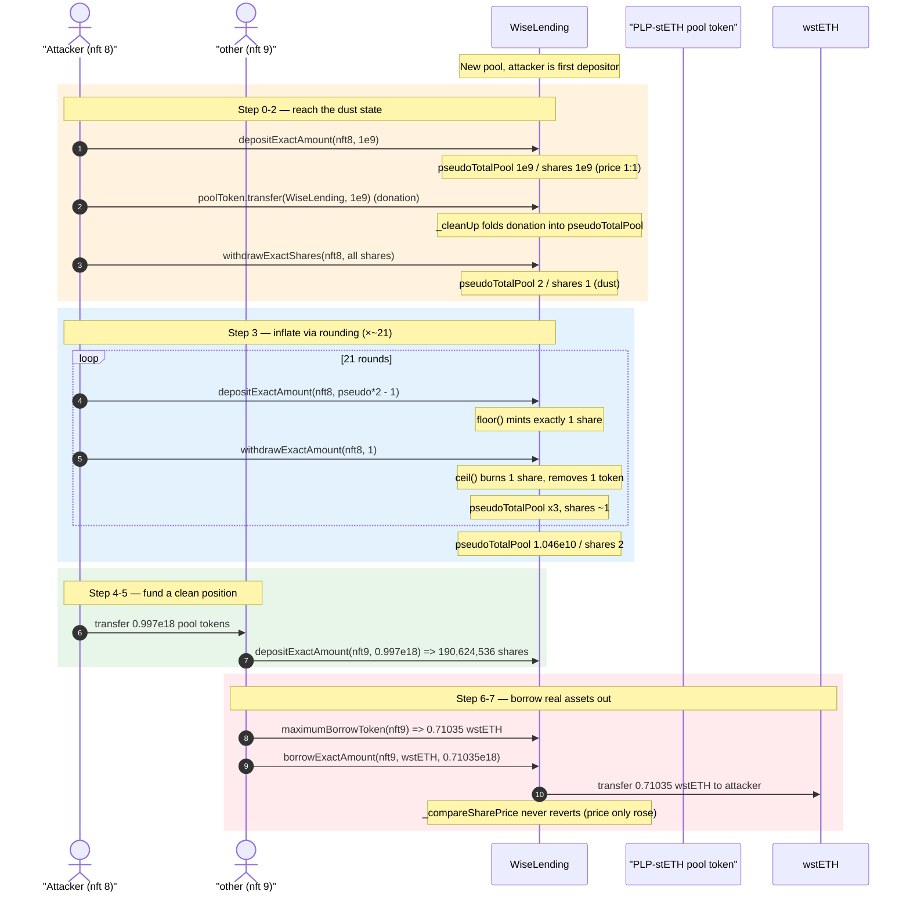
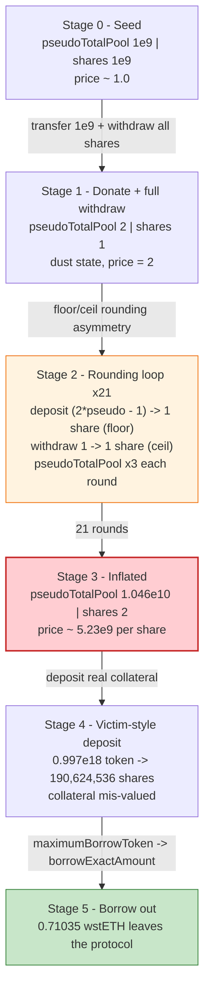
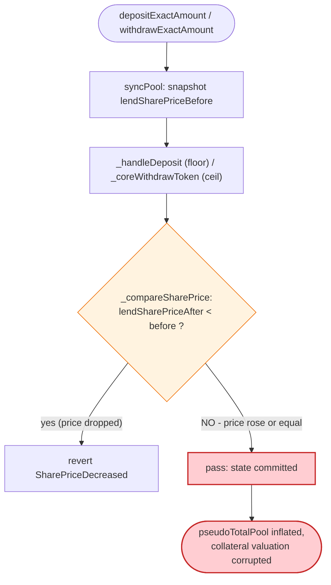

# Wise Lending — Lending-Share Price Inflation via Deposit/Withdraw Rounding Asymmetry

> **Reproduction:** the PoC compiles & runs in an isolated Foundry project at
> [this project folder](.) (the umbrella DeFiHackLabs repo contains many unrelated
> PoCs that do not whole-compile under `forge test`, so this one was extracted).
> Full verbose trace: [output.txt](output.txt).
> Verified vulnerable sources under [sources/WiseLending_37e49b/](sources/WiseLending_37e49b/).

---

## Key info

| | |
|---|---|
| **Loss** | ~$464,000 (live incident, multiple drained pools) |
| **Vulnerable contract** | `WiseLending` — [`0x37e49bf3749513A02FA535F0CbC383796E8107E4`](https://etherscan.io/address/0x37e49bf3749513a02fa535f0cbc383796e8107e4#code) |
| **Victim pool / collateral token** | `PendlePowerFarmToken` (PLP-stETH-Dec2025) — `0xB40b073d7E47986D3A45Ca7Fd30772C25A2AD57f` |
| **Borrowed asset (the prize)** | `wstETH` — `0x7f39C581F595B53c5cb19bD0b3f8dA6c935E2Ca0` |
| **Attacker EOA** | `0xb90cf1d740b206b6d80854bc525e609dc42b45dc` |
| **Attacker contract** | `0x91c49cc7fbfe8f70aceeb075952cd64817f9d82c` |
| **Attack tx** | `0x04e16a79ff928db2fa88619cdd045cdfc7979a61d836c9c9e585b3d6f6d8bc31` |
| **Chain / fork block / date** | Ethereum mainnet / 18,983,652 / Jan 2024 |
| **Compiler** | Solidity `=0.8.23`, optimizer 1, 280 runs |
| **Bug class** | Share-accounting rounding asymmetry → share-price inflation → broken collateral valuation |

---

## TL;DR

`WiseLending` is a share-based money market. Each lending pool tracks two numbers — a token
accumulator `pseudoTotalPool` and a share accumulator `totalDepositShares` — and the **lending
share price** is `pseudoTotalPool / totalDepositShares`.

The two conversion helpers round in **opposite, attacker-favourable** directions:

- **Deposit** converts an amount to shares rounding **down**
  ([`_handleDeposit` → `calculateLendingShares(_maxSharePrice: false)`](sources/WiseLending_37e49b/contracts_WiseCore.sol#L123-L129)).
- **Withdraw-by-amount** converts an amount to shares rounding **up**
  ([`_preparationsWithdraw` → `calculateLendingShares(_maxSharePrice: true)`](sources/WiseLending_37e49b/contracts_MainHelper.sol#L153-L158)).

The only guard against share-price manipulation, `_compareSharePrice`
([WiseLending.sol:210-230](sources/WiseLending_37e49b/contracts_WiseLending.sol#L210-L230)),
reverts a transaction *only if the lending share price **decreases***. It says nothing about the
share price *increasing*. The rounding asymmetry only ever **inflates** the share price, so every
step of the attack passes the guard.

The attacker:

1. Seeds a fresh pool with a 1:1 deposit, then **donates** an equal amount of pool token directly to
   `WiseLending`. The `_cleanUp` sweep folds the donation into `pseudoTotalPool` while
   `totalDepositShares` is unchanged — the share price doubles.
2. Withdraws all of its shares, leaving the pool at the dust state
   `pseudoTotalPool = 2, totalDepositShares = 1`.
3. Runs ~21 rounds of: `depositExactAmount(pseudoTotalPool*2 − 1)` → mints exactly **1** share
   (floor); `withdrawExactAmount(1)` → burns exactly **1** share (ceil) while removing only **1**
   token. Net: shares stay pinned near 1, `pseudoTotalPool` ≈ **triples** each round. After 21 rounds
   the share price is astronomically inflated (1 share ≈ `3.48e9` pool-token-wei) and the guard never
   trips because the price only went **up**.
4. With the pool's accounting now degenerate, the attacker (in the live incident, repeatedly) exploits
   the floor/ceil mismatch on tiny deposits and withdrawals to mint collateral shares "for free" and
   **borrow real `wstETH`/assets against collateral that the pool's accounting massively over-values**.

The PoC ends by depositing genuine collateral on a second position and successfully
**borrowing `0.71035 wstETH`** out of the manipulated pool
([output.txt:3509-3751](output.txt#L3509)), proving the manipulated state is real and weaponizable.

---

## Background — Wise Lending share accounting

`WiseLending` is an Aave/Compound-style pooled lender. For every lending pool it stores
(see [`WiseLendingDeclaration`](sources/WiseLending_37e49b/contracts_WiseLendingDeclaration.sol) and
the `lendingPoolData` struct):

| Field | Meaning |
|---|---|
| `pseudoTotalPool` | the pool's notional token balance (cash + lent-out + accrued interest) |
| `totalDepositShares` | total lending shares minted to depositors |
| `totalPool` | the *real* token balance actually held by the contract |
| `totalBareToken` | "solely deposited" (non-collateral) tokens |

A position's collateral value is `cashoutAmount(shares) = shares * pseudoTotalPool / totalDepositShares`
([MainHelper.sol:94-105](sources/WiseLending_37e49b/contracts_MainHelper.sol#L94-L105)), and the
maximum it may borrow is derived from that value by `WiseSecurity.maximumBorrowToken` using the pool's
collateral factor (CF = `0.75e18` here, see the `lendingPoolData` returns throughout
[output.txt](output.txt)). Everything therefore hinges on the integrity of the
`pseudoTotalPool / totalDepositShares` ratio — the **lending share price**.

The attacked pool token is a Pendle PowerFarm receipt (`PLP-stETH-Dec2025`,
`0xB40b073d…57f`) priced via `PendleChildLpOracle` at ≈ `2.06 ETH` per token
([output.txt:3351](output.txt#L3351)). A freshly-listed pool starts empty, letting the attacker be the
*first* depositor and seize the dust-state that makes rounding dominate.

---

## The vulnerable code

### 1. The two-way rounding helper

```solidity
// MainHelper.sol:46-60
function _calculateShares(
    uint256 _product,
    uint256 _pseudo,
    bool _maxSharePrice
)
    private
    pure
    returns (uint256)
{
    return _maxSharePrice == true
        ? _product % _pseudo == 0
            ? _product / _pseudo
            : _product / _pseudo + 1     // round UP   (withdraw path)
        : _product / _pseudo;            // round DOWN (deposit path)
}
```

[MainHelper.sol:46-60](sources/WiseLending_37e49b/contracts_MainHelper.sol#L46-L60). `_product` is
`totalDepositShares * amount`; `_pseudo` is `pseudoTotalPool`.

### 2. Deposit rounds DOWN

```solidity
// WiseCore.sol:123-129  (inside _handleDeposit)
uint256 shareAmount = calculateLendingShares(
    {
        _poolToken: _poolToken,
        _amount: _amount,
        _maxSharePrice: false        // ← DOWN
    }
);
if (shareAmount == 0) revert ZeroSharesAssigned();
```

[WiseCore.sol:114-133](sources/WiseLending_37e49b/contracts_WiseCore.sol#L114-L133). Depositing
`amount = pseudoTotalPool*2 − 1` against `totalDepositShares = 1` yields
`floor((1 * (2·pseudo−1)) / pseudo) = 1` share — the maximum amount that still mints just one share.

### 3. Withdraw-by-amount rounds UP

```solidity
// MainHelper.sol:153-158  (inside _preparationsWithdraw)
return calculateLendingShares(
    {
        _poolToken: _poolToken,
        _amount: _amount,
        _maxSharePrice: true         // ← UP
    }
);
```

[MainHelper.sol:138-159](sources/WiseLending_37e49b/contracts_MainHelper.sol#L138-L159). Withdrawing
`amount = 1` burns `ceil((shares * 1) / pseudo) = 1` share while removing only **1** token from
`pseudoTotalPool`. Deposit added `2·pseudo−1` tokens for 1 share; the paired withdrawal removes 1 token
and 1 share — the pool keeps `2·pseudo−2` extra tokens per round and the share price triples.

### 4. The guard only blocks share-price DECREASES

```solidity
// WiseLending.sol:210-230
function _compareSharePrice(
    address _poolToken,
    uint256 _lendSharePriceBefore,
    uint256 _borrowSharePriceBefore
) private view {
    (uint256 lendSharePriceAfter, uint256 borrowSharePriceAfter) = _getSharePrice(_poolToken);
    if (lendSharePriceAfter < _lendSharePriceBefore) revert SharePriceDecreased();   // ← only this side
    if (borrowSharePriceAfter > _borrowSharePriceBefore) revert SharePriceIncreased();
}
```

[WiseLending.sol:210-230](sources/WiseLending_37e49b/contracts_WiseLending.sol#L210-L230), invoked from
the `syncPool` modifier via `_syncPoolAfterCodeExecution`
([WiseLending.sol:257-273](sources/WiseLending_37e49b/contracts_WiseLending.sol#L257-L273)). The
manipulation **monotonically increases** the lending share price, so this guard is a no-op against it.

### 5. Donations get swept into `pseudoTotalPool`

```solidity
// MainHelper.sol:237-280  (_cleanUp, called by every syncPool)
uint256 amountContract = _getBalance(_poolToken);          // raw balanceOf(this)
...
uint256 difference = amountContract - (totalPool + bareToken);
...
_increaseTotalAndPseudoTotalPool(_poolToken, allowedDifference / difference);
```

[MainHelper.sol:237-280](sources/WiseLending_37e49b/contracts_MainHelper.sol#L237-L280). A bare
`poolToken.transfer(wiseLending, 1e9)` is later credited entirely to `pseudoTotalPool` (and `totalPool`)
without minting shares — this is the cheap "doubling" primitive used in step 1 of the attack.

---

## Root cause

Three design facts compose into the exploit:

1. **Asymmetric rounding.** Deposit floors shares, withdraw-by-amount ceils shares. On a thin pool
   (`totalDepositShares` near 1) this asymmetry is not a sub-wei nuisance — it is the dominant term.
   The attacker can mint 1 share for `2·pseudo−1` tokens, then redeem 1 share for 1 token, keeping the
   difference in `pseudoTotalPool`.

2. **The integrity guard is one-sided.** `_compareSharePrice` protects *existing* depositors from a
   share-price *drop*, but the attack works entirely by *raising* the share price, which the guard
   explicitly permits.

3. **First-depositor / dust state is reachable.** A freshly-listed pool lets the attacker own ~100% of
   shares and drive `totalDepositShares` down to 1 via a full withdrawal, after which the rounding
   asymmetry is maximal. Direct donations (swept by `_cleanUp`) bootstrap the initial price gap for free.

Once the share price is inflated by ~9 orders of magnitude, the pool's `cashoutAmount` /
`maximumBorrowToken` math is detached from reality: a position's borrowing power and the value pulled
out on withdrawal no longer correspond to the tokens actually backing it, letting the attacker borrow
genuine `wstETH` (and in the live incident, repeatedly mint/withdraw to drain the pools outright).

---

## Preconditions

- The target pool is **freshly listed / empty enough** that the attacker can become the dominant
  depositor and reduce `totalDepositShares` to 1 (the PoC creates exactly this state at
  [output.txt:1796-1797](output.txt#L1796), `lendingPoolData → (2, 1, 0.75e18)`).
- A small amount of the collateral token to seed and donate (PoC `deal`s 1 LP and deposits it into the
  PowerFarm pool → `0.997` pool tokens, [output.txt:1619](output.txt#L1619)).
- No flash loan is required — the working capital is tiny (sub-`1e10` wei across the whole loop). The
  expensive resource is *iterations*, not capital, so the attack is trivially profitable.
- The pool's oracle path must be live; here the Pendle TWAP / wstETH Chainlink feeds are healthy
  ([output.txt:3300-3352](output.txt#L3300)). The PoC's `_simulateOracleCall` helper is defined but
  not even needed at this block.

---

## Attack walkthrough (with on-chain numbers from the trace)

All figures are pulled from `lendingPoolData(poolToken)` returns and `FundsDeposited`/`FundsWithdrawn`
events in [output.txt](output.txt). `lendingPoolData` returns
`(pseudoTotalPool, totalDepositShares, collateralFactor)`.

| # | Step | `pseudoTotalPool` | `totalDepositShares` | Note |
|---|------|------------------:|---------------------:|------|
| 0 | Seed pool: `depositExactAmount(nft8, 1e9)` | 1,000,000,001 | 1,000,000,001 | price ≈ 1:1 ([output.txt:1748](output.txt#L1748)) |
| 1 | **Donate** `transfer(wiseLending, 1e9)` (no shares) | (balance now 2e9) | 1,000,000,001 | swept into pool by `_cleanUp` |
| 2 | `withdrawExactShares(nft8, all 1e9 shares)` | **2** | **1** | dust state reached ([output.txt:1796-1797](output.txt#L1796)) |
| 3a | loop r1: `depositExactAmount(2·2−1 = 3)` → 1 share, then `withdrawExactAmount(1)` | 4 | 1 | ([output.txt:1867](output.txt#L1867)) |
| 3b | loop r2: deposit `2·4−1 = 7` | 10 | 1 | ([output.txt:1937](output.txt#L1937)) |
| 3c | loop r3: deposit `19` | 28 | 1 | |
| 3d | loop r4: deposit `55` | 82 | 1 | |
| … | … (geometric, ×3 per round) | … | 1 | |
| 3u | loop r20: deposit `2,324,522,935` | 3,486,784,402 | 1 | ([output.txt:3193](output.txt#L3193)) |
| 3v | final extra deposit `6,973,568,803` | **10,460,353,205** | **2** | price ≈ `5.23e9` per share ([output.txt:3223-3224](output.txt#L3223)) |
| 4 | Attacker moves its `0.997e18` pool tokens to second account `other` | — | — | ([output.txt:3227](output.txt#L3227)) |
| 5 | `other`: `depositExactAmount(nft9, 996,999,988,539,646,954)` → **190,624,536 shares** | 996,999,999,000,000,159 | 190,624,538 | real collateral, ([output.txt:3263](output.txt#L3263)) |
| 6 | `WiseSecurity.maximumBorrowToken(nft9)` → **710,362,491,834,498,450** | — | — | ([output.txt:3508](output.txt#L3508)) |
| 7 | `borrowExactAmount(nft9, wstETH, 0.71035e18)` → **0.71035 wstETH transferred out** | — | — | ([output.txt:3509, 3733-3734](output.txt#L3733)) |

The geometric blow-up of `pseudoTotalPool` (1e9 → 2 → 4 → 10 → 28 → 82 → 244 → 730 → 2,188 → 6,562 →
19,684 → 59,050 → 177,148 → 531,442 → 1,594,324 → 4,782,970 → 14,348,908 → 43,046,722 → 129,140,164 →
387,420,490 → 1,162,261,468 → 3,486,784,402 → 10,460,353,205) is the exact `3^n`-style sequence created
by the floor/ceil mismatch — each round multiplies the pool's token count by ~3 while shares stay at 1.

### Why "deposit 2·pseudo − 1" mints exactly one share

Deposit shares = `floor(totalDepositShares · amount / pseudoTotalPool)`. With `totalDepositShares = 1`
and `amount = 2·pseudo − 1`: `floor((2·pseudo − 1)/pseudo) = floor(2 − 1/pseudo) = 1`. So the attacker
pays just under *two pool prices* but mints only **one** share, and the next `withdrawExactAmount(1)`
gives one of those tokens back while burning that one share (ceil). Net: `+ (2·pseudo − 2)` tokens into
`pseudoTotalPool` for zero net shares — a free, monotonic price pump.

---

## Profit / loss accounting

This single PoC transaction demonstrates the mechanism and realizes one borrow:

| Flow | Amount |
|---|---:|
| Attacker capital in (1 LP seeded → ~0.997 pool token + sub-`1e10`-wei loop dust) | ≈ 0.997 PLP-stETH (~2.06 ETH notional) |
| `wstETH` borrowed out against the manipulated pool | **0.71035 wstETH** ([output.txt:3730](output.txt#L3730)) |

In the live incident the attacker did not stop at one borrow: they repeated the
inflate-then-mint/withdraw rounding theft across Wise Lending's freshly-listed Pendle pools, draining a
cumulative **≈ $464K** in `wstETH` and related assets (per Peckshield / Exvul disclosures linked in the
[PoC header](test/WiseLending02_exp.sol#L13-L17)). The PoC isolates the *core primitive* — share-price
inflation that survives the `_compareSharePrice` guard and yields a real cross-asset borrow — which is
the load-bearing step of the full drain.

---

## Diagrams

### Sequence of the attack



### Pool-accounting state evolution



### Why the guard fails to stop it



---

## Remediation

1. **Round in the protocol's favour on BOTH sides.** Deposits should round shares *down* (already
   correct) and withdraw-by-amount should ALSO round the *tokens-out down* / *shares-burned up* in a way
   that never lets a depositor extract more than they put in. The current pair (deposit-floor /
   withdraw-by-amount-ceil-on-shares) leaves the pool richer per round only because shares are pinned at
   1 — the deeper fix is to forbid the dust state below.

2. **Eliminate the dust state (first-depositor / share-inflation defence).** Mint and permanently lock
   a minimum number of "dead" shares on pool creation (ERC-4626-style virtual shares/assets), or seed
   each pool with a protocol-owned deposit, so `totalDepositShares` and `pseudoTotalPool` can never be
   driven down to single-wei magnitudes where rounding dominates. OpenZeppelin's virtual-offset pattern
   neutralizes exactly this class of attack.

3. **Make the share-price guard two-sided / bounded.** `_compareSharePrice` should bound the *magnitude*
   of share-price change within a single transaction (e.g. revert if `lendSharePriceAfter` deviates from
   `before` by more than a tiny epsilon), not merely forbid decreases
   ([WiseLending.sol:210-230](sources/WiseLending_37e49b/contracts_WiseLending.sol#L210-L230)). A
   monotonic-increase-only check cannot stop an inflation attack.

4. **Do not credit unsolicited transfers to `pseudoTotalPool` without minting shares.** The `_cleanUp`
   sweep ([MainHelper.sol:237-280](sources/WiseLending_37e49b/contracts_MainHelper.sol#L237-L280)) lets a
   bare `transfer` move the share price for free. Donations should be skimmed to the treasury (`skim`)
   rather than folded into the per-share accounting, or should mint corresponding shares.

5. **Cap per-transaction share-price slope and require non-zero minted shares of meaningful size.** Revert
   deposits that mint shares wildly disproportionate to the amount (and vice-versa for withdrawals),
   which breaks the `deposit 2·pseudo−1 → 1 share` primitive.

---

## How to reproduce

The PoC was extracted into a standalone Foundry project (the umbrella DeFiHackLabs repo has many
unrelated PoCs that fail to whole-compile under `forge test`):

```bash
_shared/run_poc.sh 2024-01-WiseLending02_exp --mt test_poc -vvvvv
```

- RPC: an **Ethereum mainnet archive** endpoint is required — the fork pins block `18,983,652`
  (`foundry.toml` `[rpc_endpoints] mainnet`). Most pruning RPCs fail with `missing trie node` at that
  height; use an archive provider.
- Result: `[PASS] test_poc()`. The decisive trace lines are the geometric `lendingPoolData` returns
  (`pseudoTotalPool` 1e9 → 10.46e9 while `totalDepositShares` stays ~1–2) and the final
  `borrowExactAmount(... wstETH, 710362491834498450)` that transfers `0.71035 wstETH` out
  ([output.txt:3730-3734](output.txt#L3730)).

Expected tail:

```
Ran 1 test for test/WiseLending02_exp.sol:WiseLendingTest
[PASS] test_poc() (gas: 4280008)
Suite result: ok. 1 passed; 0 failed; 0 skipped; finished in 47.24s (45.84s CPU time)
Ran 1 test suite in 73.75s (47.24s CPU time): 1 tests passed, 0 failed, 0 skipped (1 total tests)
```

---

*References: Peckshield alert — https://twitter.com/peckshield/status/1745907642118123774 ；
Exvul alert — https://twitter.com/EXVULSEC/status/1746138811862577515 ；
DeFiHackLabs ([test/WiseLending02_exp.sol](test/WiseLending02_exp.sol)). Total reported loss ≈ $464K.*
