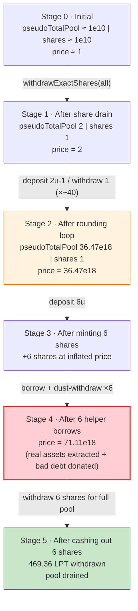
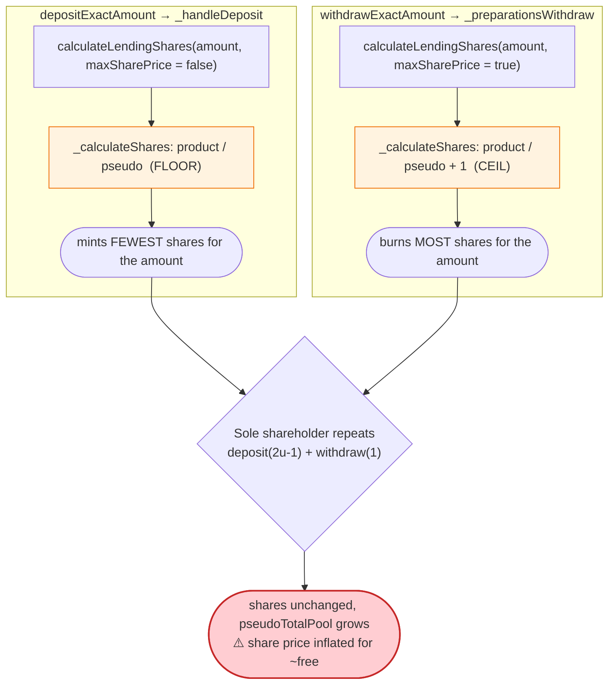
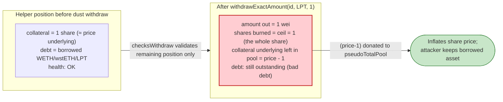

# Wise Lending Exploit — Lending-Share Price Inflation via Rounding Asymmetry + Bad-Debt Donation

> **Vulnerability classes:** vuln/arithmetic/rounding-direction · vuln/arithmetic/rounding

> **Reproduction:** the PoC compiles & runs in an isolated Foundry project at
> [this project folder](.) (the umbrella DeFiHackLabs repo
> contains many unrelated PoCs that do not whole-compile, so this one was extracted).
> Full verbose trace: [output.txt](output.txt).
> Verified vulnerable sources under [sources/WiseLending_37e49b/](sources/WiseLending_37e49b/).

---

## Key info

| | |
|---|---|
| **Loss** | ~$464K — ~73.50 WETH + 93.79 wstETH + ~469.4 LPT (Pendle wstETH LP) drained from the pool |
| **Vulnerable contract** | `WiseLending` — [`0x37e49bf3749513A02FA535F0CbC383796E8107E4`](https://etherscan.io/address/0x37e49bf3749513a02fa535f0cbc383796e8107e4#code) |
| **Victim pool** | Wise Lending `LPTPoolToken` (Pendle Power Farm token) pool — `0xB40b073d7E47986D3A45Ca7Fd30772C25A2AD57f` |
| **Attacker EOA** | [`0xb90cf1d740b206b6d80854bc525e609dc42b45dc`](https://etherscan.io/address/0xb90cf1d740b206b6d80854bc525e609dc42b45dc) |
| **Attacker contract** | [`0x91c49Cc7FBfE8f70AceEb075952cD64817f9d82c`](https://etherscan.io/address/0x91c49cc7fbfe8f70aceeb075952cd64817f9d82c) |
| **Attack tx** | [`0x04e16a79ff928db2fa88619cdd045cdfc7979a61d836c9c9e585b3d6f6d8bc31`](https://etherscan.io/tx/0x04e16a79ff928db2fa88619cdd045cdfc7979a61d836c9c9e585b3d6f6d8bc31) |
| **Chain / fork block / date** | Ethereum mainnet / 18,992,907 / Jan 12, 2024 |
| **Compiler (PoC build)** | Solidity 0.8.34 (Wise Lending source compiled under 0.8.x) |
| **Bug class** | Inflation/donation attack on a lending share-pool, enabled by deposit/withdraw rounding asymmetry + uncaught bad-debt donation |

---

## TL;DR

`WiseLending` is a pooled lending market where each pool tracks two scalars,
`pseudoTotalPool` (the underlying owed to all lenders) and `totalDepositShares`
(the receipt shares), and prices a share as `pseudoTotalPool / totalDepositShares`.
The conversion functions round **asymmetrically and in the protocol's favor**:

- **Deposit** mints shares with `_maxSharePrice = false` → floor division
  ([contracts_MainHelper.sol:46-60](sources/WiseLending_37e49b/contracts_MainHelper.sol#L46-L60),
  via `_handleDeposit` [contracts_WiseCore.sol:114-129](sources/WiseLending_37e49b/contracts_WiseCore.sol#L114-L129)).
- **Withdraw** burns shares with `_maxSharePrice = true` → **ceil** division
  ([contracts_MainHelper.sol:138-160](sources/WiseLending_37e49b/contracts_MainHelper.sol#L138-L160)).

That asymmetry lets an attacker who controls the *only* share in a pool repeatedly
"deposit `2·underlying − 1`, withdraw `1`" and leave underlying behind while the share
count never changes — i.e. **donate** underlying into `pseudoTotalPool` and inflate the
share price arbitrarily. The attacker also adds a second, larger donation channel: open
helper positions, borrow real assets against ~1 share of collateral, then call
`withdrawExactAmount(id, LPT, 1)`. Because the withdraw security check
([`checksWithdraw`](sources/WiseLending_37e49b/contracts_WiseCore.sol#L70-L75)) only
validates the *remaining* position and not the dust-rounding, the call burns the whole
collateral share, **donating `sharePrice − 1` underlying to the pool while the debt stays
outstanding as bad debt** ([WiseLending03_exp.sol:184-185](test/WiseLending03_exp.sol#L184-L185)).

With the share price pumped from `1` to **~71.1 LPT/share** (trace
[output.txt:1591](output.txt)), the attacker's 6 pre-bought shares
cash out **469.36 LPT** ([output.txt:8562](output.txt)) — almost the
entire pool — and the borrowed WETH/wstETH/LPT are never repaid. Net theft ≈ **$464K**.

---

## Background — how a Wise Lending pool accounts value

Each lending pool keeps a share model in `lendingPoolData[token]`
([contracts_WiseLendingDeclaration.sol](sources/WiseLending_37e49b/contracts_WiseLendingDeclaration.sol)):

| Field | Meaning |
|---|---|
| `pseudoTotalPool` | total underlying credited to lenders (incl. accrued interest) |
| `totalDepositShares` | total receipt shares outstanding |
| `collateralFactor` | LTV factor (0.75e18 for this pool) |

Share price = `pseudoTotalPool / totalDepositShares`. Deposits mint
`shares = floor(totalDepositShares · amount / pseudoTotalPool)` and withdrawals burn
`shares = ceil(totalDepositShares · amount / pseudoTotalPool)`. The pool token here is
`LPTPoolToken` (`PendlePowerFarmToken` `0xB40b…D57f`), itself a wrapper around a Pendle
wstETH LP market; the attacker funds everything with 520.54 PendleLPT
([output.txt:1574](output.txt)) wrapped into LPTPoolToken.

The on-chain pool state at the fork block (read from the trace):

| Parameter | Value | Source |
|---|---|---|
| Position 8 lending shares (pre-attack) | 10,000,000,000 (1e10) | [output.txt:1782](output.txt) |
| Pool `pseudoTotalPool` (pre-attack) | ≈ 10,000,011,445 | [output.txt:1803](output.txt) |
| Pool share price (pre-attack) | ≈ 1 | derived |
| `collateralFactor` | 0.75e18 | [output.txt:1827](output.txt) |

The attacker already controlled position-NFT **#8** (transferred to itself in
[WiseLending03_exp.sol:93-95](test/WiseLending03_exp.sol#L93-L95); on mainnet it was set
up by a prior tx). That single position held essentially all of the pool's shares — the
precondition that makes a donation attack viable.

---

## The vulnerable code

### 1. Asymmetric rounding in share conversion

```solidity
// sources/WiseLending_37e49b/contracts_MainHelper.sol:46-60
function _calculateShares(
    uint256 _product,
    uint256 _pseudo,
    bool _maxSharePrice
)
    private pure returns (uint256)
{
    return _maxSharePrice == true
        ? _product % _pseudo == 0
            ? _product / _pseudo
            : _product / _pseudo + 1        // ← WITHDRAW path rounds UP (ceil)
        : _product / _pseudo;               // ← DEPOSIT  path rounds DOWN (floor)
}
```

`cashoutAmount` (shares → underlying, used to size the final withdraw) does a *plain
floor* division and never adds the `+1` correction:

```solidity
// sources/WiseLending_37e49b/contracts_MainHelper.sol:94-105
function cashoutAmount(address _poolToken, uint256 _shares)
    public view returns (uint256)
{
    return _shares
        * lendingPoolData[_poolToken].pseudoTotalPool
        / lendingPoolData[_poolToken].totalDepositShares;
}
```

### 2. Deposit mints floor, withdraw burns ceil

```solidity
// sources/WiseLending_37e49b/contracts_WiseCore.sol:114-129
function _handleDeposit(...) internal returns (uint256) {
    uint256 shareAmount = calculateLendingShares({
        _poolToken: _poolToken,
        _amount:    _amount,
        _maxSharePrice: false               // ← floor: deposit gets the FEWEST shares
    });
    if (shareAmount == 0) revert ZeroSharesAssigned();
    ...
}
```

```solidity
// sources/WiseLending_37e49b/contracts_MainHelper.sol:138-160
function _preparationsWithdraw(...) internal view returns (uint256) {
    _checkOwnerPosition(_nftId, _caller);
    return calculateLendingShares({
        _poolToken: _poolToken,
        _amount:    _amount,
        _maxSharePrice: true                // ← ceil: withdraw burns the MOST shares
    });
}
```

Consequence at price `p` underlying/share, with the attacker owning the only share:
depositing `2p − 1` underlying mints `floor((2p−1)/p) = 1` share, and withdrawing `1`
underlying burns `ceil(1·1/p) = 1` share. Net: shares unchanged (still 1), but
`pseudoTotalPool` jumped by `(2p−1) − 1 = 2p − 2 ≈ 2p`. **The price roughly triples each
loop** (new price ≈ `p + (2p−1) − 1 ≈ 3p − 2`), with no token leaving the attacker except
1 wei per loop.

### 3. The bad-debt donation channel (helper positions)

```solidity
// test/WiseLending03_exp.sol:178-189 (attacker Helper.borrow)
function borrow(IERC20 asset, uint256 collateralAmount, uint256 debtAmount) external {
    uint256 positionId = PositionNFTs.mintPosition();
    LPTPoolToken.approve(address(wiseLending), type(uint256).max);
    wiseLending.depositExactAmount(positionId, address(LPTPoolToken), collateralAmount); // ≈ 1 share
    wiseLending.borrowExactAmount(positionId, address(asset), debtAmount);               // pull real asset
    // withdraw 1 wei -> burns the whole collateral share, donates (price-1) underlying,
    // leaves the debt as bad debt:
    wiseLending.withdrawExactAmount(positionId, address(LPTPoolToken), 1);
    asset.transfer(msg.sender, asset.balanceOf(address(this)));
    LPTPoolToken.transfer(msg.sender, LPTPoolToken.balanceOf(address(this)));
}
```

`withdrawExactAmount` only runs the per-position `checksWithdraw`
([contracts_WiseCore.sol:70-75](sources/WiseLending_37e49b/contracts_WiseCore.sol#L70-L75)):

```solidity
// sources/WiseLending_37e49b/contracts_WiseCore.sol:51-82
WISE_SECURITY.checksWithdraw(_nftId, _caller, _poolToken, _amount);
_coreWithdrawBare(_nftId, _poolToken, _amount, _shares);
```

The check passes for a 1-wei withdraw (the position keeps almost all of its *recorded*
collateral value), so the attacker withdraws `amount = 1` but burns `shares = 1` — the
position's only collateral share. The `(price − 1)` underlying that backed that share is
left in `pseudoTotalPool` while the borrow remains, i.e. it is **donated to the pool at the
cost of intentional bad debt**.

---

## Root cause — why it was possible

A share-based pool is only safe if the share↔underlying conversion is *consistent*: an
amount you can deposit for `n` shares must redeem for ≤ that amount, and the share supply
must never collapse to a tiny number while the underlying stays large. Wise Lending breaks
both invariants:

1. **Rounding favors the protocol in *both* directions, which favors a sole shareholder.**
   Deposits floor (you get fewer shares) and withdrawals ceil (you burn more shares). When
   one actor owns 100% of the shares, "rounding in favor of the protocol" is rounding *in
   favor of that actor* — every floor/ceil mismatch silently transfers value from
   `totalDepositShares` accounting into `pseudoTotalPool`, which the sole holder owns. This
   is the classic ERC4626-style inflation primitive, here driven by integer rounding rather
   than a direct ERC20 `transfer` donation.

2. **A single position can be reduced to `1 share / 2 underlying`.** The attacker first
   withdrew *all* of position 8's shares, leaving the pool at `pseudoTotalPool = 2,
   totalDepositShares = 1` ([output.txt:1827](output.txt)). With one share and a
   price of 2, the deposit/withdraw rounding loop has maximum leverage — there is no large
   honest share supply to dilute the manipulation.

3. **Dust withdrawal is not rounding-safe.** `withdrawExactAmount(.,.,1)` burns a full share
   for 1 wei of underlying because the withdraw path *ceils*. Combined with a fresh borrow,
   this lets the attacker permanently park collateral in the pool (`price − 1` underlying)
   while keeping the borrowed asset — the security layer validates position health but never
   asserts that "underlying removed ≈ shares burned · price."

4. **Bad debt is accepted silently outside liquidation.** The only `checkBadDebt`
   ([contracts_WiseCore.sol:580-582](sources/WiseLending_37e49b/contracts_WiseCore.sol#L580-L582))
   lives in `_coreLiquidation`. A normal borrow-then-dust-withdraw never trips it, so the
   helper positions walk away with WETH/wstETH/LPT and leave under-collateralized debt
   behind, which is exactly the donation the attacker wanted.

Together: inflate the price for free (loop), inflate it further while extracting real
assets (helper borrows), then redeem 6 pre-bought shares for ~the whole pool.

---

## Preconditions

- The attacker controls a position (NFT #8) holding effectively all of a pool's lending
  shares, so it can drain that pool to `1 share / 2 underlying`
  ([WiseLending03_exp.sol:93-100](test/WiseLending03_exp.sol#L93-L100),
  [output.txt:1782](output.txt)).
- The pool's underlying (`LPTPoolToken`) can be freely minted from PendleLPT and is small
  enough that a single actor can dominate share supply.
- Working capital in `LPTPoolToken` to run the donation loop and to over-collateralize 6
  helper borrows. The PoC seeds 520.54 PendleLPT
  ([WiseLending03_exp.sol:83](test/WiseLending03_exp.sol#L83)); peak outlay is recovered, so
  the attack is self-funding.
- Borrowable liquidity (WETH, wstETH, more LPT) present in the cross-collateral markets so
  the helper positions can extract real assets.

---

## Attack walkthrough (with on-chain numbers from the trace)

All share-price figures are the `console.log` lines emitted in
[output.txt:1577-1591](output.txt); the final cashout is the `FundsWithdrawn`
event at [output.txt:8562](output.txt).

| # | Step | Pool `pseudoTotalPool` / `shares` | Share price | Effect |
|---|------|---|---:|--------|
| 0 | **Initial** — position 8 holds all shares | ≈ 1e10 / 1e10 | ≈ 1 | Honest pool. |
| 1 | **Drain shares** — `withdrawExactShares(8, all)` ([:98-100](test/WiseLending03_exp.sol#L98-L100)) | **2 / 1** | **2** | Pool reduced to a single share — max manipulation leverage. |
| 2 | **Donation loop** — repeat `deposit(2·u − 1)` + `withdraw(1)` until price ≥ 36e18 ([:106-110](test/WiseLending03_exp.sol#L106-L110)) | 36,472,996,377,170,786,404 / 1 | **36.47e18** | Each loop ≈ triples the price; shares stay at 1, only 1 wei leaves per loop. |
| 3 | **Mint 6 shares** — `deposit(8, 6·u)` ([:117](test/WiseLending03_exp.sol#L117)) | 6·u added / **+6 shares** | 36.47e18 | Attacker now owns 6 shares at the inflated price (its real claim). |
| 4a | Helper #0 borrow 43.77 wstETH, dust-withdraw 1 ([:127](test/WiseLending03_exp.sol#L127)) | ↑ | **41.68e18** | wstETH pulled out; collateral share donated; price rises. |
| 4b | Helper #1 borrow 50.02 wstETH ([:132](test/WiseLending03_exp.sol#L132)) | ↑ | **47.64e18** | |
| 4c | Helper #2 borrow 23.44 LPT ([:137](test/WiseLending03_exp.sol#L137)) | ↑ | **54.44e18** | |
| 4d | Helper #3 borrow 73.50 WETH ([:142](test/WiseLending03_exp.sol#L142)) | ↑ | **62.22e18** | The big WETH leg. |
| 4e | Helper #4 borrow 27.74 LPT ([:147](test/WiseLending03_exp.sol#L147)) | ↑ | (rising) | |
| 4f | Helper #5 borrow 48.33 LPT ([:152](test/WiseLending03_exp.sol#L152)) | ↑ | **71.11e18** | Final price ≈ 71.1 LPT/share. |
| 5 | **Cash out 6 shares** — `withdrawExactAmount(8, LPT, getTotalPool())` ([:156](test/WiseLending03_exp.sol#L156)) | burns 6 shares for **469.36 LPT** | — | `getTotalPool` = 469,361,815,219,056,461,181 ([output.txt:8541-8562](output.txt)). |
| 6 | **Unwrap** — `LPTPoolToken.withdrawExactShares(...)` ([:158](test/WiseLending03_exp.sol#L158)) | — | — | Convert LPT back to PendleLPT. |

The borrow legs match the final balances exactly: wstETH `43.767… + 50.020… = 93.787…`
([output.txt:1597](output.txt) shows `93.787704969867736484`), WETH `73.498936139651450633`
([output.txt:1596](output.txt)).

### Why the donation loop works (numeric trace)

The first few real iterations from the trace (`FundsDeposited` / `FundsWithdrawn`
amounts at [output.txt:1842-2192](output.txt)):

| Loop | deposit amount (`2·u − 1`) | shares minted | withdraw amount | shares burned | new `pseudoTotalPool` |
|---|---:|---:|---:|---:|---:|
| start | — | — | — | — | 2 |
| 1 | 3 | 1 | 1 | 1 | 7 |
| 2 | 7 | 1 | 1 | 1 | 19 |
| 3 | 19 | 1 | 1 | 1 | 55 |
| 4 | 55 | 1 | 1 | 1 | 163 |
| 5 | 163 | 1 | 1 | 1 | 487 |
| … | (≈ ×3 each loop) | 1 | 1 | 1 | … → 36.47e18 |

`floor((2u−1)/u) = 1` mints exactly one share; `ceil(1/u) = 1` burns exactly one share;
net underlying added ≈ `2u − 2`, so `u → ~3u` per loop. After ~40 loops the price clears
36 ether and the attacker stops the loop ([WiseLending03_exp.sol:106](test/WiseLending03_exp.sol#L106)).

### Profit / loss accounting

| Asset | Attacker before | Attacker after | Delta | Source |
|---|---:|---:|---:|---|
| PendleLPT | 520.539781914590517894 | 518.978162578846757786 | **−1.56** | [output.txt:1574,1595](output.txt) |
| WETH | 0 | 73.498936139651450633 | **+73.50** | [output.txt:1596,8637](output.txt) |
| wstETH | 0 | 93.787704969867736484 | **+93.79** | [output.txt:1597,8640](output.txt) |

Plus the **469.36 LPT** cashed out of the pool (line [output.txt:8562](output.txt)),
which is unwrapped back into PendleLPT (so the net PendleLPT figure already nets the wrap
round-trip). The protocol is left holding the helper positions' **un-repaid debt** (the
borrowed WETH/wstETH/LPT) plus a near-empty pool. Reported total loss ≈ **$464K**.

---

## Diagrams

### Sequence of the attack

```mermaid
sequenceDiagram
    autonumber
    actor A as "Attacker (owns NFT #8)"
    participant W as WiseLending
    participant P as "LPT lending pool"
    participant H as "6 Helper positions"

    Note over P: Initial: pseudoTotalPool ≈ 1e10 / shares ≈ 1e10 (price ≈ 1)

    rect rgb(255,243,224)
    Note over A,W: Step 1 — collapse the pool to one share
    A->>W: withdrawExactShares(8, allShares)
    W->>P: burn all shares, transfer underlying out
    Note over P: pseudoTotalPool = 2 / shares = 1 (price = 2)
    end

    rect rgb(232,245,233)
    Note over A,W: Step 2 — rounding donation loop (price → 36.47e18)
    loop until price ≥ 36 ether
        A->>W: depositExactAmount(8, 2*u - 1) → mint floor = 1 share
        A->>W: withdrawExactAmount(8, 1) → burn ceil = 1 share
        Note over P: shares stays 1, pseudoTotalPool ≈ 3u
    end
    end

    rect rgb(227,242,253)
    Note over A,W: Step 3 — buy real claim
    A->>W: depositExactAmount(8, 6*u) → +6 shares
    end

    rect rgb(255,235,238)
    Note over A,H: Step 4 — borrow real assets, donate via bad debt
    loop 6 helpers
        A->>H: deposit ~1 share collateral
        H->>W: borrowExactAmount(id, asset, debt)
        W-->>H: WETH / wstETH / LPT out
        H->>W: withdrawExactAmount(id, LPT, 1) — burns whole share
        Note over P: (price-1) underlying donated; debt left as bad debt
    end
    Note over P: price → 71.11e18 LPT/share
    end

    rect rgb(243,229,245)
    Note over A,W: Step 5 — cash out
    A->>W: withdrawExactAmount(8, LPT, getTotalPool())
    W-->>A: 469.36 LPT for just 6 shares
    end

    Note over A: Net: +73.5 WETH, +93.8 wstETH, +469 LPT (≈ $464K)
```

### Share-price evolution



### The rounding flaw inside deposit vs. withdraw



### Why the dust withdraw is theft



---

## Remediation

1. **Make rounding directionally safe for users, not the sole holder.** Deposits should
   mint with the *same* rounding convention used to value a withdrawal of the same amount,
   and the conversion must never let `deposit(x)` then `withdraw(x)` increase
   `pseudoTotalPool`. The current floor-on-deposit / ceil-on-withdraw split is the inflation
   primitive — remove the asymmetry or always round against whoever is being credited.
2. **Forbid the pool from collapsing to a tiny share supply.** Enforce a minimum
   `totalDepositShares` / minimum liquidity (e.g. permanently lock the first shares, or seed
   each pool with dead shares), so no single position can reach the `1 share / 2 underlying`
   state where rounding has full leverage. This is the standard ERC4626 inflation defense.
3. **Reject dust/rounding-loss withdrawals.** Require `withdraw` to revert if the underlying
   actually transferred is materially smaller than `sharesBurned · price` (i.e. block the
   "burn a full share for 1 wei" path), and disallow withdrawals whose effect is a net
   donation to the pool.
4. **Check bad debt on every borrow/withdraw, not only on liquidation.** Move a
   `checkBadDebt`-style assertion into `_coreWithdrawToken` so a position cannot end a
   transaction under-collateralized; the helper "borrow then dust-withdraw collateral" loop
   would then revert.
5. **Cap single-operation share-price movement.** Any deposit/withdraw that moves a pool's
   share price by more than a small bound in one call (or one block) should revert; a price
   jumping from 1 to 71e18 is a clear manipulation signature.

---

## How to reproduce

The PoC was extracted into a standalone Foundry project (the umbrella DeFiHackLabs repo has
many unrelated PoCs that fail `forge`'s whole-project build):

```bash
_shared/run_poc.sh 2024-01-WiseLending03_exp --mt testExploit -vvvvv
```

- RPC: an **Ethereum mainnet archive** endpoint is required (`foundry.toml` aliases
  `mainnet`); the fork pins block **18,992,907**, whose historical state most pruned public
  RPCs cannot serve.
- Result: `[PASS] testExploit()`.

Expected tail:

```
  Attacker PendleLPT Balance before exploit: 520.539781914590517894
 ...
 Attacker PendleLPT Balance After exploit: 518.978162578846757786
  Attacker WETH Balance After exploit: 73.498936139651450633
  Attacker wstETH Balance After exploit: 93.787704969867736484
Suite result: ok. 1 passed; 0 failed; 0 skipped
```

---

*References: attacker writeup by @danielvf — https://twitter.com/danielvf/status/1746303616778981402 ;
pool-state setup tx https://etherscan.io/tx/0x67d6c554314c9b306d683afb3bc4a10e70509ceb0fdf8415a5e270a91fae52de .*
