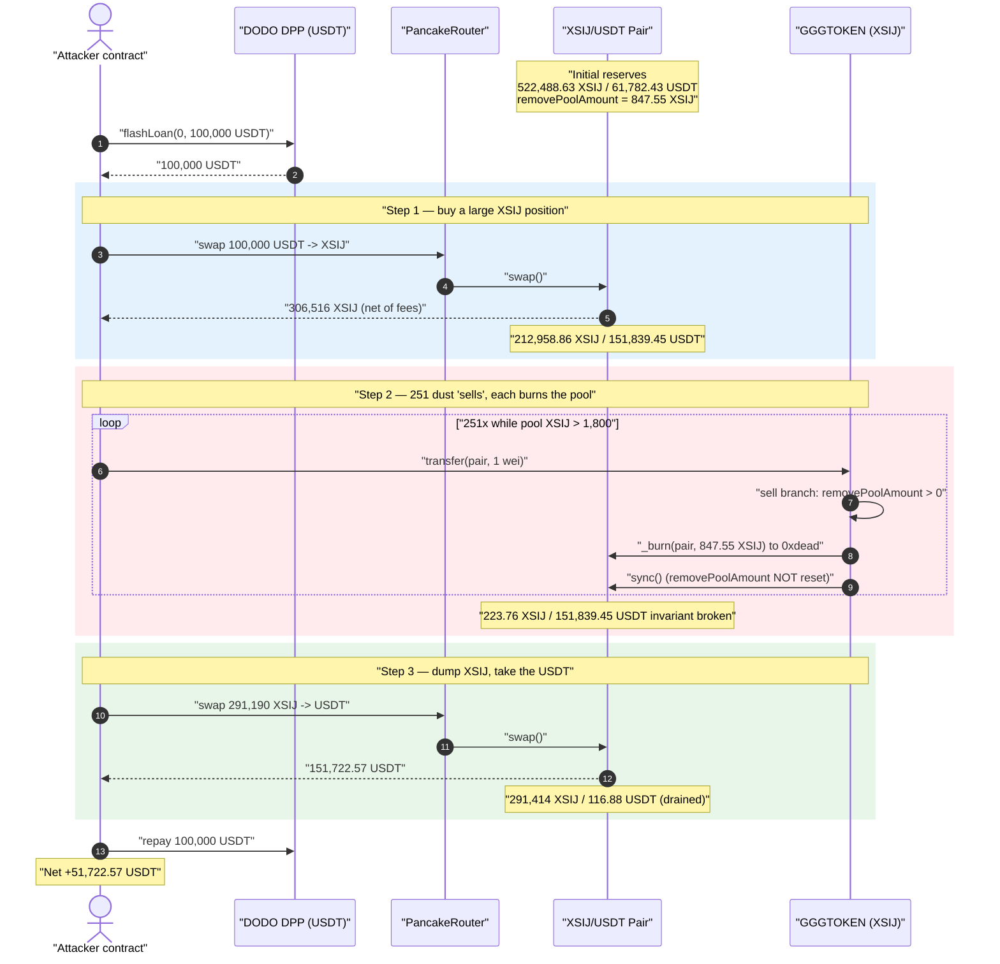
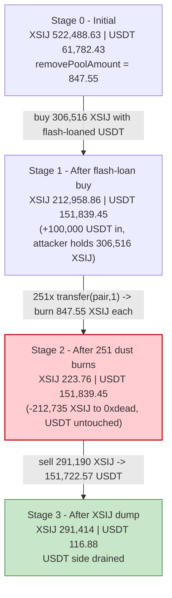
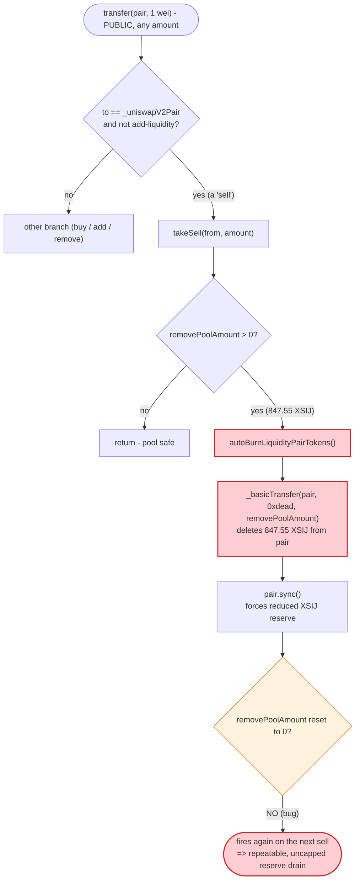
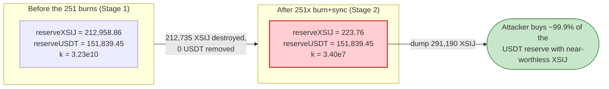

# XSIJ (GGGTOKEN) Exploit — Repeatable, Un-reset `autoBurnLiquidityPairTokens()` Pool Drain

> **Vulnerability classes:** vuln/logic/state-update · vuln/logic/missing-check

> **Reproduction:** the PoC compiles & runs in an isolated Foundry project at
> [this project folder](.) (the umbrella DeFiHackLabs repo
> contains many unrelated PoCs that do not whole-compile, so this one was extracted).
> Full verbose trace: [output.txt](output.txt).
> Verified vulnerable source: [GGGTOKEN.sol](sources/GGGTOKEN_31bfA1/GGGTOKEN.sol).

---

## Key info

| | |
|---|---|
| **Loss** | **~51,722.57 USDT** (≈ $51.7K) drained from the XSIJ/USDT PancakeSwap pair |
| **Vulnerable contract** | `GGGTOKEN` (token symbol **XSIJ**) — [`0x31bfA137C76561ef848c2af9Ca301b60451CaAC0`](https://bscscan.com/address/0x31bfA137C76561ef848c2af9Ca301b60451CaAC0#code) |
| **Victim pool** | XSIJ/USDT PancakePair — [`0xf43Fd71f404CC450c470d42E3F478a6D38C96311`](https://bscscan.com/address/0xf43Fd71f404CC450c470d42E3F478a6D38C96311) |
| **Flash-loan source** | DODO DPP — [`0x6098A5638d8D7e9Ed2f952d35B2b67c34EC6B476`](https://bscscan.com/address/0x6098A5638d8D7e9Ed2f952d35B2b67c34EC6B476) (USDT pool) |
| **Attacker EOA** | [`0xc4f82210c2952fcec77efe734ab2d9b14e858469`](https://bscscan.com/address/0xc4f82210c2952fcec77efe734ab2d9b14e858469) |
| **Attacker contract** | [`0x5313f4f04fdcc2330ccfa5ba7da2780850d1d7be`](https://bscscan.com/address/0x5313f4f04fdcc2330ccfa5ba7da2780850d1d7be) |
| **Attack tx** | [`0xf477089602fefcfc1dbdce15834476267914d64a1e6a52f07d3f135f091e1d27`](https://app.blocksec.com/explorer/tx/bsc/0xf477089602fefcfc1dbdce15834476267914d64a1e6a52f07d3f135f091e1d27) |
| **Chain / block / date** | BSC / 35,702,095 / Jan 30, 2024 |
| **Compiler** | Solidity `v0.8.6`, optimizer enabled (1 / 200 runs) |
| **Bug class** | Broken AMM invariant — repeatable, never-reset reserve burn callable from a permissionless transfer path |

---

## TL;DR

`GGGTOKEN` (XSIJ) is a meme/fee token with an "auto-nuke LP" mechanic. Whenever someone **sells**
XSIJ into the pair, `_transfer` checks a state variable `removePoolAmount` and, if it is non-zero,
calls `autoBurnLiquidityPairTokens()` ([GGGTOKEN.sol:615-617](sources/GGGTOKEN_31bfA1/GGGTOKEN.sol#L615-L617)).
That helper **burns `removePoolAmount` XSIJ directly out of the pair's balance and then calls
`pair.sync()`** ([GGGTOKEN.sol:720-728](sources/GGGTOKEN_31bfA1/GGGTOKEN.sol#L720-L728)) — an
*un-compensated* removal of one side of the reserves that breaks the constant-product invariant
`x·y = k`.

The fatal detail: **`removePoolAmount` is never reset to zero after the burn.** So the *same*
accumulated amount (here, **847.55 XSIJ**) is burned out of the pool **on every single sell**, and
nothing stops the attacker from generating an unlimited number of "sells" by transferring **1 wei**
of XSIJ to the pair address over and over.

The attacker:

1. **Flash-loans 100,000 USDT** from DODO DPP and buys **306,516 XSIJ** from the pool (driving the
   USDT reserve up to ~151,839 USDT).
2. **Spams 251 dust "sells"** — sending `1 wei` of XSIJ to the pair each time. Each transfer is
   classified as a sell, fires `autoBurnLiquidityPairTokens()`, and burns another **847.55 XSIJ**
   out of the pair (`reserve0`), while the USDT reserve (`reserve1`) **stays completely untouched**.
   This drives the pool's XSIJ reserve from ~212,959 down to **223.76 XSIJ**.
3. **Dumps its 291,190 XSIJ** into the now-degenerate pool and receives **151,722.57 USDT** — almost
   the entire USDT reserve.
4. **Repays the 100,000 USDT** flash loan and keeps the rest.

Net profit = **51,722.57 USDT**, verified to the wei by the PoC.

---

## Background — what GGGTOKEN/XSIJ does

`GGGTOKEN` ([source](sources/GGGTOKEN_31bfA1/GGGTOKEN.sol)) is a fee-on-transfer ERC20 with a tangle
of bolted-on "DeFi" features: buy/sell taxes, an inviter (referral) tree, LP dividends, an NFT
dividend distributor, and an "auto-nuke LP" deflation. The mechanic relevant to this hack is the
auto-nuke.

The token's `_transfer` ([GGGTOKEN.sol:586-667](sources/GGGTOKEN_31bfA1/GGGTOKEN.sol#L586-L667))
routes a transfer down one of four branches depending on whether it is a buy, sell, add-liquidity, or
remove-liquidity (decided by comparing the pair's *reported reserves* against its *actual token
balance* in `_isAddLiquidity` / `_isRemoveLiquidity`,
[GGGTOKEN.sol:974-1006](sources/GGGTOKEN_31bfA1/GGGTOKEN.sol#L974-L1006)).

Two of those branches form the bug:

**Remove-liquidity branch — accumulates `removePoolAmount`:**

```solidity
}else if(_isRemoveLiquidity() && from==_uniswapV2Pair){ // remove liquid
   uint256 removeLiquidityFeeAmount = (amount * removeLiquidityFee) / 10000;
   if(removeLiquidityFeeAmount > 0) {
     _basicTransfer(from, address(this), removeLiquidityFeeAmount);
   }
   amount = amount.sub(removeLiquidityFeeAmount);
   if(_addPoolTime[to] + poolTime > block.timestamp) {
      removePoolAmount += amount * 2500 / 10000;   // ← accumulate 25% of an early LP removal
   }
}
```
([GGGTOKEN.sol:626-634](sources/GGGTOKEN_31bfA1/GGGTOKEN.sol#L626-L634))

**Sell branch — drains the pool by `removePoolAmount` every time:**

```solidity
}else if(!_isAddLiquidity()&& getSellFee() > 0 && to==_uniswapV2Pair){//sell
    require(amount <= _maxSellTax, "Transfer limit");
    amount = takeSell(from,amount);

    if (removePoolAmount > 0) {
            autoBurnLiquidityPairTokens();    // ← fires on EVERY sell while removePoolAmount > 0
        }
}
```
([GGGTOKEN.sol:611-618](sources/GGGTOKEN_31bfA1/GGGTOKEN.sol#L611-L618))

At the fork block (BSC #35,702,095) the on-chain state was:

| Parameter | Value |
|---|---|
| Pool XSIJ reserve (`reserve0`) | **522,488.63 XSIJ** |
| Pool USDT reserve (`reserve1`) | **61,782.43 USDT** |
| `removePoolAmount` (pre-accumulated) | **847.5502039360449 XSIJ** |
| Sell-side / buy-side fee | ~4% (`getSellFee`/`getBuyFee` = 400 bps, of which 100 bps is burn) |
| Loop exit threshold (in PoC) | `balanceOf(pair) > 1800 XSIJ` |

The `removePoolAmount = 847.55 XSIJ` was left over from real LPs adding and then removing liquidity
within the `poolTime` window — exactly the state the auto-nuke was designed to react to. The attacker
simply weaponizes that leftover state.

---

## The vulnerable code

### 1. The burn deletes XSIJ from the pair and `sync()`s — and never resets the amount

```solidity
function autoBurnLiquidityPairTokens() internal returns (bool) {
    if (removePoolAmount > 0) {
        _basicTransfer(_uniswapV2Pair, address(0xdead), removePoolAmount);  // ⚠️ deletes pool XSIJ
    }
    //sync price since this is not in a swap transaction!
    IUniswapV2Pair pair = IUniswapV2Pair(_uniswapV2Pair);
    pair.sync();                                                            // ⚠️ forces reduced reserve
    emit AutoNukeLP();
    // ⚠️ removePoolAmount is NEVER set back to 0
    return true;
}
```
([GGGTOKEN.sol:720-729](sources/GGGTOKEN_31bfA1/GGGTOKEN.sol#L720-L729))

Two design errors compound here:

- **It moves XSIJ out of the pair to `0xdead` and then `sync()`s** — telling the pair "your XSIJ
  reserve is now `removePoolAmount` smaller" without any matching USDT leaving. This is a pure,
  one-sided reserve deletion; `k` collapses in the seller's favour.
- **`removePoolAmount` is never zeroed.** The comment claims this fires "since this is not in a swap
  transaction," but the guard `if (removePoolAmount > 0)` in the sell branch means it fires on
  *every* sell forever, each one burning the *full* `removePoolAmount` again. There is no
  per-removal bookkeeping; the variable behaves like a *permanent per-sell tax on the pool's own
  reserves*.

### 2. A 1-wei transfer to the pair counts as a "sell"

The sell branch is keyed purely on `to == _uniswapV2Pair`
([GGGTOKEN.sol:611](sources/GGGTOKEN_31bfA1/GGGTOKEN.sol#L611)). A direct
`token.transfer(pair, 1)` therefore enters the sell path and triggers the burn — no router, no actual
swap, no minimum amount. The attacker needs no XSIJ-side capital to keep "selling": 1 wei per call is
enough to fire `autoBurnLiquidityPairTokens()`.

---

## Root cause — why it was possible

A Uniswap-V2/PancakeSwap pair prices assets solely from its reserves and only enforces `x·y ≥ k`
*inside `swap()`*. `sync()` lets a pair trust its current token balance as the new reserve. XSIJ
abuses that trust:

> `autoBurnLiquidityPairTokens()` **destroys** XSIJ held by the pair and calls `pair.sync()`, with
> **no USDT removed**. Worse, because `removePoolAmount` is never reset, the destruction repeats on
> every sell — and a "sell" is just a 1-wei transfer to the pair. The XSIJ reserve can be ground down
> to dust while the USDT reserve sits fully intact, waiting to be bought out by whoever holds XSIJ.

The concrete decisions that compose into the bug:

1. **Burning from the pool is a value transfer to XSIJ holders.** Removing XSIJ from the pair without
   removing USDT shifts the entire USDT side toward whoever holds XSIJ. The attacker makes sure
   *they* hold essentially all the XSIJ (the 306,516 they bought in step 1).
2. **The burn is repeatable and uncapped.** `removePoolAmount` is not consumed/reset, so the same
   847.55 XSIJ is burned on each sell. 251 dust sells burned **212,735 XSIJ** out of the pool — over
   250× the "intended" single burn.
3. **The sell path is permissionless and amount-agnostic.** `to == _uniswapV2Pair` with `amount = 1`
   wei is sufficient to fire the burn, so the attacker fully controls how many times it executes.
4. **Buy/remove/add classification is reserve-vs-balance based and manipulable.** The attacker's own
   large buy and the contract's fee `transferSwap` set up the reserve/balance relationship so the
   subsequent dust transfers are reliably classified as sells (not add/remove), keeping the burn path
   live.

The buy/sell **tax** — the one mechanism that might have clawed value back — is only ~4% and applies
to the *transferred amount*, not to the pool burn; it does nothing to compensate the pool for the
reserves deleted by `autoBurnLiquidityPairTokens()`.

---

## Preconditions

- `removePoolAmount > 0`. In practice this is set whenever an LP that added liquidity within the last
  `poolTime` (30 days) later removes it — a normal protocol event. At the fork block it was already
  **847.55 XSIJ**.
- The token is in normal trading mode (`_startTimeForSwap > 0`, trading live), so buys and sells
  route through the taxed branches.
- Working capital in USDT to (a) buy a large XSIJ position and (b) be the dominant XSIJ holder when
  the pool is drained. Here the entire outlay is a **flash loan of 100,000 USDT** from DODO DPP,
  repaid in the same transaction — so the attack is effectively capital-free.

No access control or special role is required: `transfer`/`transferFrom` and the dust-sell path are
all public.

---

## Attack walkthrough (with on-chain numbers from the trace)

The pair's `token0 = XSIJ`, `token1 = USDT`, so `reserve0 = XSIJ`, `reserve1 = USDT`. All figures are
taken directly from the `Sync` / `Swap` events in [output.txt](output.txt).

| # | Step | XSIJ reserve | USDT reserve | Effect |
|---|------|-----------:|-------------:|--------|
| 0 | **Initial** ([output.txt:73](output.txt)) | 522,488.63 | 61,782.43 | Honest pool, `removePoolAmount = 847.55`. |
| 1 | **Flash-loan + buy** — DPP lends 100,000 USDT; swap 100,000 USDT → 322,648.78 XSIJ (attacker nets 306,516.34 after fees). Contract's fee `transferSwap` also fires. | 212,958.86 | 151,839.45 | Attacker holds 306,516 XSIJ; USDT reserve loaded to 151,839. |
| 2 | **Dust sell #1** — `transfer(pair, 1)` → sell branch → `autoBurnLiquidityPairTokens()` burns 847.55 XSIJ + `sync()` | 212,111.31 | 151,839.45 | First uncompensated burn; USDT untouched. |
| … | **Dust sells #2 … #251** — repeat `transfer(pair, 1)`; each burns another 847.55 XSIJ | ↓ −847.55 / step | 151,839.45 | USDT reserve frozen the entire time. |
| 3 | **After 251 burns** ([output.txt:9495](output.txt)) | **223.76** | 151,839.45 | XSIJ reserve annihilated (−212,735 XSIJ); `k` collapsed. |
| 4 | **Dump** — sell 291,190.52 XSIJ → 151,722.57 USDT ([output.txt:9532-9533](output.txt)) | 291,414.28 | **116.88** | Attacker buys out ~99.9% of the USDT reserve with near-worthless XSIJ. |
| 5 | **Repay** 100,000 USDT to DPP | — | — | Flash loan closed; profit retained. |

**Why each dust sell burns a fixed 847.55 XSIJ:** the burn amount is the *unchanged* `removePoolAmount`
state variable. The trace shows each `Sync` dropping `reserve0` by exactly
`847,550,203,936,044,874,707` wei (= 847.5502039360449 XSIJ) while `reserve1` is pinned at
`151,839,453,724,261,351,955,748` wei. 251 iterations × 847.55 XSIJ = 212,735.10 XSIJ burned, matching
the loop start (212,958.86) and end (223.76) reserves to the wei. The PoC's loop runs
`while (Xsij.balanceOf(pair) > 1800e18)`, so it stops once the pool's XSIJ balance is below 1,800.

**Why the final dump captures almost all the USDT:** with the XSIJ reserve at 223.76 and the USDT
reserve at 151,839.45, selling 291,190.52 XSIJ through PancakeSwap's `getAmountOut`
`out = (in·9975·resOut) / (resIn·10000 + in·9975)` yields
`(291190.52·9975·151839.45) / (223.76·10000 + 291190.52·9975) ≈ 151,722.57 USDT` — reproduced exactly
by the trace. Because `in` dwarfs `resIn`, the fee-scaled input saturates the denominator and the
seller extracts essentially the whole opposite reserve.

### Profit accounting (USDT)

| Direction | Amount |
|---|---:|
| Borrowed — DODO DPP flash loan | 100,000.00 |
| Spent — buy XSIJ (step 1) | 100,000.00 |
| Received — final XSIJ dump (step 4) | 151,722.57 |
| Repaid — DODO DPP flash loan | 100,000.00 |
| **Net profit** | **+51,722.57** |

The PoC logs confirm the EOA goes from **0 USDT** before to **51,722.57 USDT** after
([output.txt](output.txt), `Attacker USDT balance after exploit: 51722.572974878450156452`).

---

## Diagrams

### Sequence of the attack



### Pool state evolution



### The flaw inside `_transfer` / `autoBurnLiquidityPairTokens`



### Why the burn is theft: constant-product before vs. after



---

## Remediation

1. **Never burn from the liquidity pool.** A burn must only destroy tokens the protocol *owns* (its
   own balance / a treasury). Deleting `_basicTransfer(_uniswapV2Pair, 0xdead, removePoolAmount)` +
   `pair.sync()` eliminates the bug. If "deflation should reach the pool" is a product requirement,
   route it through the pair's own `burn()` (LP redemption) so **both** reserves move together and `k`
   is preserved.
2. **Consume the accumulator.** If a pool burn must happen, reset `removePoolAmount = 0` (or subtract
   the burned amount) immediately after `autoBurnLiquidityPairTokens()`. As written, the same amount is
   burned on every sell — the single most damaging detail of this hack.
3. **Don't treat raw transfers to the pair as taxable/triggering "sells".** The sell branch fires on
   any `transfer(pair, amount)` including 1 wei. Gate the auto-nuke behind genuine swap detection, or
   require a minimum/threshold so dust transfers cannot drive the mechanism.
4. **Cap single-operation reserve impact.** Any operation that can move a pool reserve by more than a
   small percentage should revert; an 847.55-XSIJ burn that, repeated, removes ~99.9% of a reserve is a
   red flag.
5. **Avoid reserve-vs-balance heuristics for buy/sell/add/remove classification.** `_isAddLiquidity` /
   `_isRemoveLiquidity` compare reported reserves to live balances and are manipulable within a single
   transaction; combined with fee-on-transfer logic they make the contract's own state machine an
   attack surface.

---

## How to reproduce

The PoC was extracted into a standalone Foundry project (the umbrella DeFiHackLabs repo has many
unrelated PoCs that fail to compile under `forge test`'s whole-project build):

```bash
_shared/run_poc.sh 2024-01-XSIJ_exp -vvvvv
```

- RPC: a **BSC archive** endpoint is required (the fork pins block 35,702,095). Most public BSC RPCs
  prune historical state at that block and fail with `header not found` / `missing trie node`; use an
  archive node.
- Result: `[PASS] testExploit()`, with the attacker's USDT balance going from `0` to ~`51,722.57`.

Expected tail:

```
Ran 1 test for test/XSIJ_exp.sol:Exploit
[PASS] testExploit() (gas: 11990254)
Logs:
  Attacker USDT balance before exploit: 0.000000000000000000
  Attacker USDT balance after exploit: 51722.572974878450156452

Suite result: ok. 1 passed; 0 failed; 0 skipped
```

The PoC ([test/XSIJ_exp.sol](test/XSIJ_exp.sol)) flash-loans 100,000 USDT from DODO DPP, buys XSIJ,
runs the dust-sell loop (`while (Xsij.balanceOf(Pair) > 1800e18) Xsij.transfer(Pair, 1)`), dumps the
XSIJ, and repays the loan inside `DPPFlashLoanCall`.

---

*Reference: CertiK Alert — https://x.com/CertiKAlert/status/1752384801535918264 (XSIJ / GGGTOKEN, BSC, ~$51K).*
