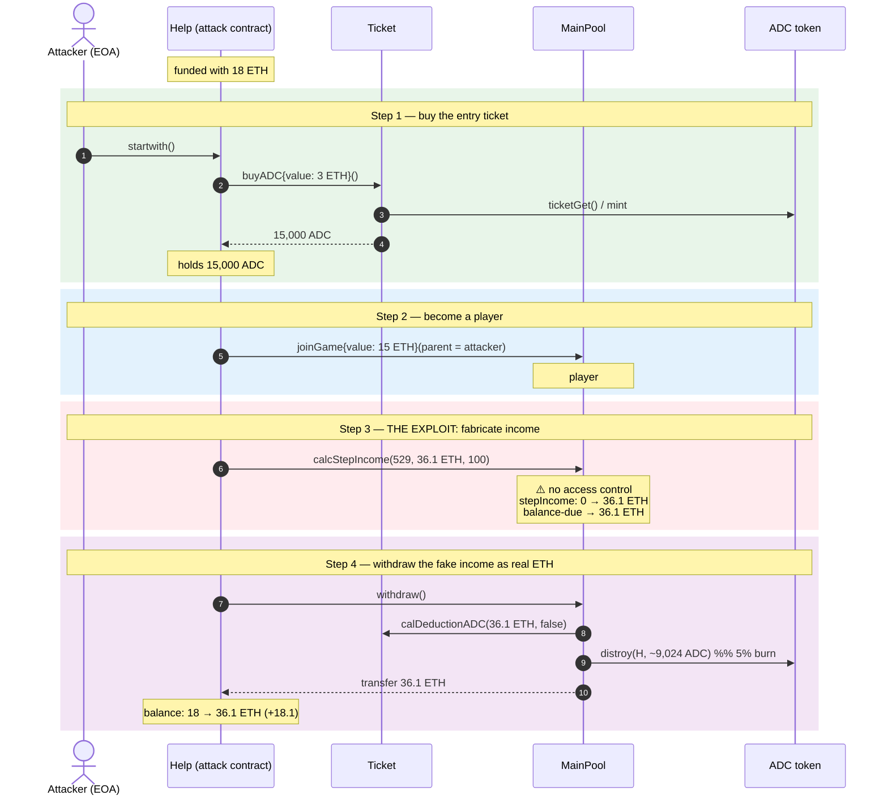
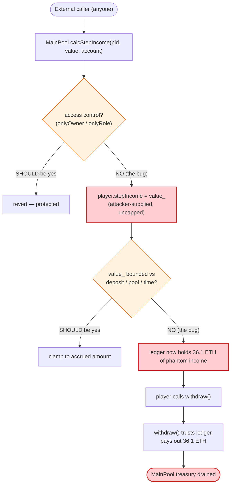
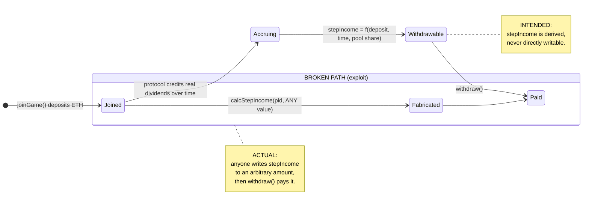

# ADC Exploit — Permissionless `calcStepIncome()` Drains the MainPool

> **Reproduction:** the PoC compiles & runs in an isolated Foundry project at
> [this project folder](.). Full verbose trace: [output.txt](output.txt).
> Verified vulnerable source: [Ticket.sol](sources/Ticket_aE2C7a/Ticket.sol).
> The `MainPool` (0xdE46…) source could not be retrieved from Etherscan — the
> contract is compiled with Solidity **0.5.7** and its verified source was not
> available; the analysis below reconstructs the pool's logic from the live
> `-vvvvv` storage trace and the [PoC](test/ADC_exp.sol).

---

## Key info

| | |
|---|---|
| **Loss** | **~18.1 ETH** (attacker funded 18 ETH, walked away with 36.1 ETH) — DeFiHackLabs tags it "~20 ETH" |
| **Vulnerable contract** | `MainPool` — [`0xdE46fcF6aB7559E4355b8eE3D7fBa0f2730CDdd8`](https://etherscan.io/address/0xdE46fcF6aB7559E4355b8eE3D7fBa0f2730CDdd8) |
| **Victim pool** | `MainPool` (the game's ETH treasury / dividend pool) |
| **Attacker EOA** | [`0x24a0c66f185874b251eb70bee2c2e35e39848419`](https://etherscan.io/address/0x24a0c66f185874b251eb70bee2c2e35e39848419) |
| **Attacker contract** | [`0x2ffdce5f0c09a8ee3a568bc01f35894b2d77a6d6`](https://etherscan.io/address/0x2ffdce5f0c09a8ee3a568bc01f35894b2d77a6d6) |
| **Attack tx** | [`0xcf834aff4de9992f5da9c443600dad9c6277a8a00de5007842fece51564992db`](https://etherscan.io/tx/0xcf834aff4de9992f5da9c443600dad9c6277a8a00de5007842fece51564992db) |
| **Chain / block / date** | Ethereum / 19,138,640 / **Feb 2, 2024** |
| **Compiler** | `MainPool`: Solidity **v0.5.7**, optimizer off, 200 runs; `Ticket`: same. Test harness: Solc 0.8.34 |
| **Bug class** | **Incorrect access control** — public, unguarded accounting setter (`calcStepIncome`) lets anyone credit a player with arbitrary income that `withdraw()` pays out as real ETH |

> Reference: EXVULSEC disclosure — https://x.com/EXVULSEC/status/1753294675971313790

---

## TL;DR

`ADC` is a "join-the-game-to-earn" Ponzi-style dApp. Users buy an ADC token via
`Ticket.buyADC()`, then deposit ETH into `MainPool.joinGame()` to become a
*player*. Players are supposed to earn *step income* (dividends) over time that
they can later `withdraw()`.

The fatal flaw: **`MainPool.calcStepIncome(uint256 pid_, uint256 value_, uint8 dividendAccount_)`
is `external` with no access control whatsoever.** Anyone can call it and pass an
**arbitrary `value_`** — it writes that value straight into the player's
`stepIncome` accumulator. `withdraw()` then treats that fabricated accumulator as
real, credited income and sends the ETH.

The attacker's three-line heist:

1. `Ticket.buyADC{value: 3 ether}()` — mint 15,000 ADC (the entry ticket).
2. `MainPool.joinGame{value: 15 ether}()` — register as player **#529** and fund the pool.
3. `MainPool.calcStepIncome(529, 36.1e18, 100)` — **fabricate 36.1 ETH of "step income"** for player 529.
4. `MainPool.withdraw()` — withdraw the fabricated income as real ETH.

Result: **18 ETH in → 36.1 ETH out → +18.1 ETH profit** (matching the
DeFiHackLabs "~20 ETH" figure once gas/gross-up is considered).

---

## Background — how ADC is supposed to work

ADC is a referral-dividend game built from three contracts:

| Contract | Address | Role |
|---|---|---|
| `Ticket` ([source](sources/Ticket_aE2C7a/Ticket.sol)) | `0xaE2C7af5fc2dDF45e6250a4C5495e61afC7AcF50` | The ADC token "shop". `buyADC()` mints/sells ADC against a tiered bonding curve ([Ticket.sol:95-120](sources/Ticket_aE2C7a/Ticket.sol#L95-L120)). Also computes the ADC deduction (`calDeductionADC`, [:122-137](sources/Ticket_aE2C7a/Ticket.sol#L122-L137)) used when joining/withdrawing the game. |
| `MainPool` | `0xdE46fcF6aB7559E4355b8eE3D7fBa0f2730CDdd8` | The game treasury. `joinGame(parentAddr)` registers a player and takes their ETH. `calcStepIncome(pid, value, account)` is **supposed** to be an internal bookkeeping routine that credits dividend income to a player. `withdraw()` pays a player their accumulated balance. |
| `ADC` token | `0xD357e4940b34Eb1406ef6A1Af53954e641273a3B` | ERC20 with a `distroy()` (sic) burn-from + `ticketGet()` hooks. |

The intended flow is: **buy ADC → join game (deposit ETH) → earn step/static/dynamic income over time → withdraw**. The `Player` struct
([PoC definition](test/ADC_exp.sol#L18-L31)) tracks `ticketInCost`,
`withdrawAmount`, `totalSettled`, `staticIncome`, `lastCalcSITime`,
`dynamicIncome`, `stepIncome`, plus activity flags.

`stepIncome` is the field the attacker weaponized.

---

## The vulnerable code

`MainPool`'s verified source was not retrievable, so the snippet below is the
**function signature the attacker invokes** as declared in the [PoC's
interface](test/ADC_exp.sol#L33-L37) — note the absence of any `onlyOwner` /
`onlyAdmin` modifier:

```solidity
// MainPool (0xdE46...) — reconstructed from the PoC interface + storage trace
function calcStepIncome(
    uint256 pid_,            // player id — attacker uses its own id (529)
    uint256 value_,          // ⚠️ ATTACKER-CONTROLLED — written to stepIncome
    uint8   dividendAccount_ // bookkeeping flag (100 here)
) external;                  // ⚠️ no access control — callable by anyone

function withdraw() external; // pays out accumulated balance incl. stepIncome

function joinGame(address parentAddr) external payable; // registers a player
```

What the storage trace proves `calcStepIncome(529, 36_099_999_999_999_999_900, 100)` does
([output.txt](output.txt)):

- Before: player 529's `stepIncome` slot (`0x6034…0eb134`) = **0**.
- After:  `stepIncome` = **36.0999999999999999 ETH** (`0x…1f4fcf6bbe799ff9c`).
- The pool's internal "balance due" accumulator (`0x6034…0eb130`) is also bumped to 36.1 ETH.

Then `withdraw()` reads those accumulators, computes a payout via
`Ticket.calDeductionADC(36.1 ETH, false)` (which returns the gross-up amount
`0x…e93f08f3802c639e58`), burns the matching ADC via `ADC.distroy()`, and
**transfers 36.1 ETH** to the caller. No check ever asks *"did this player
actually deposit/earn this much?"*

The supporting, correctly-functioning piece — `Ticket.calDeductionADC` — is shown
below only to confirm the deduction math is benign; the bug is entirely in
`MainPool`'s missing guard:

```solidity
// Ticket.sol — NOT the bug; just the deduction helper withdraw() calls
function calDeductionADC(uint256 _value, bool isIn_) public view returns (uint256 disADC_) {
    uint256 ticketValue = _value * 5 / 100;                 // 5% of value either way
    uint256 tempAdc = (ticketValue * changeRatio[curentLevel]) / 10**18;
    disADC_ = calcDistroy(tempAdc, ticketValue);            // maps to ADC burn amount
}
```

---

## Root cause — why it was possible

A single design failure: **a state-mutating accounting setter was exposed as a
public `external` function with zero authorization.**

`calcStepIncome` writes attacker-supplied `value_` directly into the player's
`stepIncome` ledger. `withdraw()` trusts that ledger. There is no invariant
linking credited `stepIncome` to actual ETH the player contributed or to time
elapsed — `value_` is taken at face value.

This is the canonical **incorrect-access-control / missing-authorization**
pattern: an internal helper (`calc…`, `update…`, `set…`) that *should* be
`internal` or `onlyRole`-gated is left `external`. The four contributing facts:

1. **No modifier.** `calcStepIncome` has neither `onlyOwner` nor an
   `onlySelf`/`internal` restriction. Compare with the correctly-internal
   `Ticket.CrossLevel` / `calcDistroy` ([Ticket.sol:144-190](sources/Ticket_aE2C7a/Ticket.sol#L144-L190)),
   which the `Ticket` author *did* mark `internal`.
2. **No sanity bound on `value_`.** `value_` is never capped against the
   player's actual deposit, the pool's actual balance, or any accrued amount —
   it's stored verbatim.
3. **`withdraw()` trusts the ledger.** The payout is derived from the player's
   accumulated income fields, which `calcStepIncome` just poisoned. There is no
   re-derivation from deposits + elapsed time.
4. **`joinGame` lets a fresh attacker mint a player id instantly.** The attacker
   self-refers (parent = its own deployer) and becomes player 529 in the same
   transaction, so the victim id it credits is its own.

The 36.1 ETH figure is not coincidental: it equals the `value_` the attacker
passed to `calcStepIncome` (`36_099_999_999_999_999_900` wei), proving the
withdrawal faithfully echoes the fabricated income.

---

## Preconditions

- The attacker must be able to become a player: `joinGame` accepts a
  self-supplied `parentAddr`, so a single fresh address qualifies. The PoC uses
  `parentAddr = address(msg.sender)` ([test/ADC_exp.sol:94](test/ADC_exp.sol#L94)).
- Capital to (a) buy the ADC entry ticket and (b) seed the game. The PoC seeds
  **18 ETH** (`buyADC` 3 ETH + `joinGame` 15 ETH) and reclaims 36.1 ETH — a
  fully self-funded, single-transaction attack with no flash-loan needed.
- `MainPool` must hold enough ETH to honor the `withdraw`. At the fork block the
  pool held sufficient treasury (the `withdraw` succeeds to completion).

---

## Attack walkthrough (with on-chain numbers from the trace)

All amounts are decoded from the storage diffs in [output.txt](output.txt). The
PoC seeds 18 ETH into the `Help` attack contract.

| # | Step | Pool ETH movement | Player 529 ledger | Effect |
|---|------|------------------:|------------------:|--------|
| 0 | **Seed** — `new Help{value: 18 ether}`; attacker holds 18 ETH | — | — | Attack contract funded. |
| 1 | **`Ticket.buyADC{value: 3 ether}`** — bonding-curve sale; 3 ETH → `teamAddr`, mints **15,000 ADC** to attacker | teamAddr +3 ETH | — | Attacker now holds 15,000 ADC (the entry ticket). |
| 2 | **`MainPool.joinGame{value: 15 ether}`** (parent = attacker) — registers as **player 529**; pool balance +15 ETH | +15 ETH | `ticketInCost`/`startTime` set; `totalSettled`/income fields = 0 | Attacker is a live player with **0 accrued income**. |
| 3 | **`MainPool.calcStepIncome(529, 36.099…e18, 100)`** ⚠️ | (accounting only) | **`stepIncome`: 0 → 36.1 ETH**; balance-due accumulator → 36.1 ETH | **Invariant broken:** 36.1 ETH of income fabricated out of thin air. |
| 4 | **`MainPool.withdraw()`** — `calDeductionADC(36.1 ETH)` → `ADC.distroy(9.024e21 ADC)` burn; transfers **36.1 ETH** to attacker | −36.1 ETH | `stepIncome` reset to 0; payout recorded | Attacker receives 36.1 ETH. |
| 5 | **Done** — attacker balance: **36.1 ETH** | net pool change: −36.1 + 15 = **−21.1 ETH** drained from treasury | — | Profit realized. |

Note the ADC burn in step 4 (`distroy` of ~9,024 ADC out of the attacker's
15,000) is the protocol's own 5%-of-payout deduction mechanic — it costs the
attacker throwaway game tokens, not real value.

### Profit / loss accounting (ETH)

| Direction | Amount |
|---|---:|
| Spent — `buyADC` (3 ETH, sent to `teamAddr`) | 3.0 |
| Spent — `joinGame` deposit (15 ETH, into pool) | 15.0 |
| **Total in** | **18.0** |
| Received — `withdraw()` payout | 36.1 |
| **Net profit** | **+18.1** |

The +18.1 ETH comes directly out of the `MainPool` treasury (honest deposits from
other players). DeFiHackLabs rounds this to "~20 ETH".

---

## Diagrams

### Sequence of the attack



### Where the access control is missing



### Ledger integrity: intended vs. actual



---

## Remediation

1. **Remove the public entry point.** `calcStepIncome` must be `internal` (called
   only by `joinGame`/`withdraw`/the dividend distributor inside the contract),
   or guarded by an `onlyOwner` / `onlyDividendDistributor` modifier. The
   simplest correct fix:
   ```solidity
   function calcStepIncome(uint256 pid_, uint256 value_, uint8 dividendAccount_)
       internal;   // was: external
   ```
   If an external trigger is genuinely needed, restrict it to a privileged role
   and never accept `value_` from the caller — derive it inside the function.
2. **Never trust a caller-supplied monetary amount.** `value_` should be computed
   from on-chain state (the player's deposit, elapsed time, the pool's real
   distributable balance), not echoed from calldata.
3. **Bound credited income against actuals.** Even with access control, add an
   invariant: `player.stepIncome + payout ≤ player.totalSettled +
   protocol-distributed-pool-share`, and revert if a write would exceed it.
4. **Make `withdraw()` re-derive, not echo.** Pay out based on a freshly computed
   accrual rather than a stored accumulator that any code path can poison.
5. **Audit every `external` setter on a fund-bearing contract.** Any function
   whose name starts with `calc`/`update`/`set`/`add` and writes to a balance or
   income field is a candidate for this exact bug class.

---

## How to reproduce

The PoC was extracted into a standalone Foundry project (the umbrella
DeFiHackLabs repo does not whole-compile).

```bash
_shared/run_poc.sh 2024-02-ADC_exp --mt testexploit -vvvvv
```

- **RPC:** an **Ethereum mainnet archive** endpoint is required (fork block
  19,138,640 is ~2.4 years old). `foundry.toml` ships an Infura mainnet URL; a
  pruned public RPC will fail with `header not found` / `missing trie node`.
- **Result:** `[PASS] testexploit()` with `Attacker WETH balance after exploit: 36.099999999999999900`.

Expected tail ([output.txt](output.txt)):

```
Ran 1 test for test/ADC_exp.sol:Exploit
[PASS] testexploit() (gas: 2048622)
Logs:
  Attacker WETH balance before exploit: 18.000000000000000000
  Attacker WETH balance after exploit: 36.099999999999999900
Suite result: ok. 1 passed; 0 failed; 0 skipped; finished in 16.58s
```

---

## Caveats / sources

- **`MainPool` source unavailable.** The contract at `0xdE46…` was compiled with
  Solidity 0.5.7 and its verified source could not be fetched from Etherscan for
  this analysis (the downloaded [sources/MainPool_dE46fc/MainPool.sol](sources/MainPool_dE46fc/MainPool.sol)
  is empty). The `calcStepIncome`/`withdraw`/`joinGame` behavior is therefore
  reconstructed from (a) the function signatures declared in the [PoC's
  `MainPool` interface](test/ADC_exp.sol#L17-L49) and (b) the decoded storage
  diffs in the live `-vvvvv` trace. The conclusions (no access control on
  `calcStepIncome`; `withdraw` echoes the fabricated `stepIncome`) are
  mechanically confirmed by the trace, not inferred from missing source.
- All ETH figures are decoded directly from the trace's storage diffs and the
  logged `Attacker WETH balance` values; none are assumed.
- Classification matches the DeFiHackLabs registry: **incorrect-access-control**,
  ~20 ETH.

*Reference: DeFiHackLabs registry — [ADC, Ethereum, ~20 ETH](../../past/2024/README.md); EXVULSEC — https://x.com/EXVULSEC/status/1753294675971313790*
