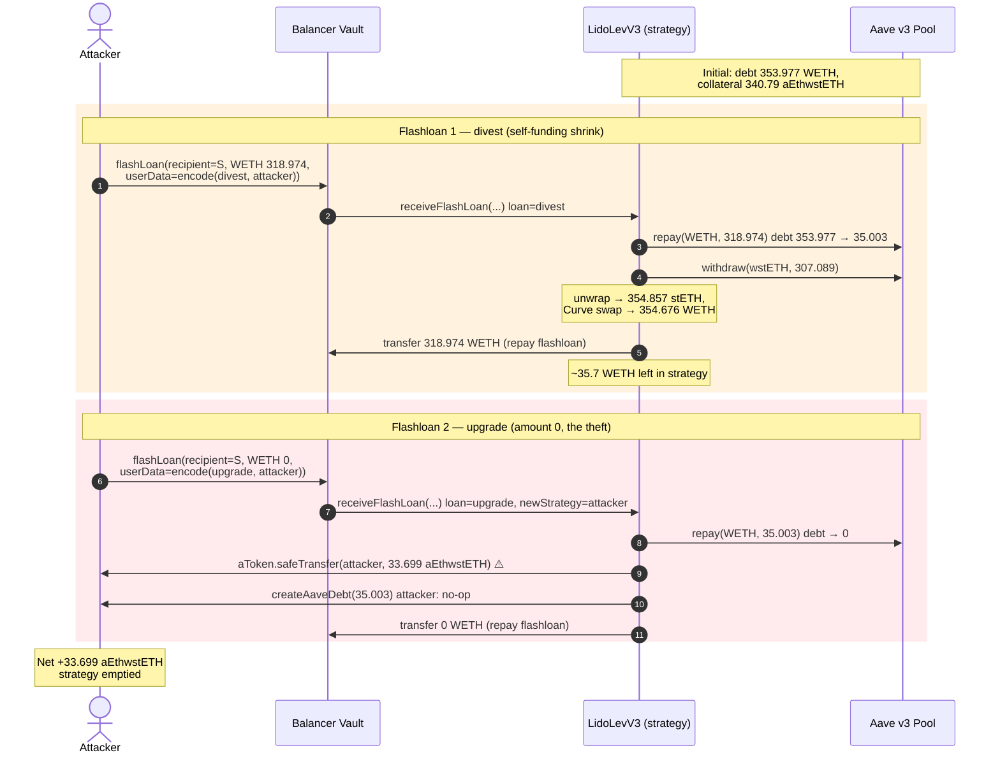
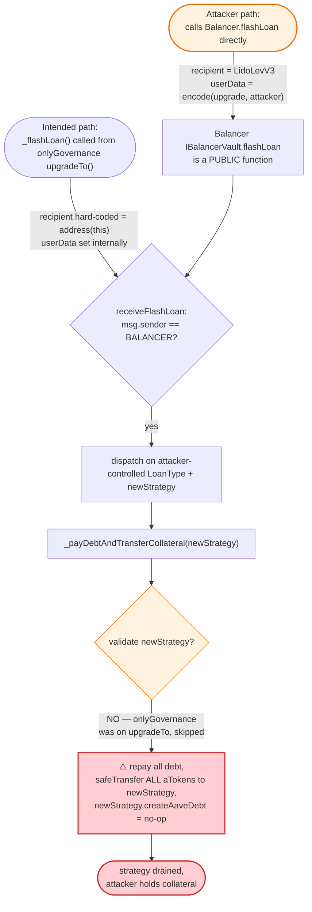
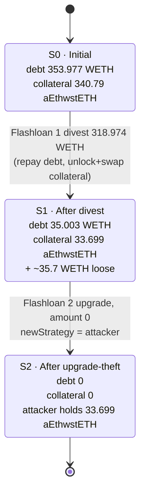

# Affine DeFi LidoLevV3 Exploit — Flashloan-Triggered `upgradeTo` Drains All Aave Collateral

> **Reproduction:** the PoC compiles & runs in an isolated Foundry project at
> [this project folder](.) (the main DeFiHackLabs repo holds many unrelated
> PoCs that do not build together, so this one was extracted).
> Full verbose trace: [output.txt](output.txt).
> Verified vulnerable source: [LidoLevV3.sol](sources/LidoLevEthStrategy_cd6ca2/src_strategies_LidoLevV3.sol).

---

## Key info

| | |
|---|---|
| **Loss** | **33.699 aEthwstETH** (~$115K at the time) — the strategy's entire remaining Aave collateral |
| **Vulnerable contract** | `LidoLevV3` (a.k.a. `LidoLevEthStrategy`) — [`0xcd6ca2f0d0c182C5049D9A1F65cDe51A706ae142`](https://etherscan.io/address/0xcd6ca2f0d0c182C5049D9A1F65cDe51A706ae142#code) |
| **Victim pool / protocol** | Affine DeFi `LidoLevV3` leveraged-staking strategy (Aave v3 position: wstETH collateral / WETH debt) |
| **Attacker EOA** | `0x09f6Be2a7D0d2789f01DDFAf04D4eAA94EfC0857` |
| **Attacker contract** | `0x12d85e5869258a80D4bEbE70d176d0F58b2d68E4` |
| **Attack tx** | [`0x03543ef96c26d6c79ff6c24219c686ae6d0eb5453b322e54d3b6a5ce456385e5`](https://etherscan.io/tx/0x03543ef96c26d6c79ff6c24219c686ae6d0eb5453b322e54d3b6a5ce456385e5) |
| **Chain / block / date** | Ethereum / 19,132,934 / February 2, 2024 |
| **Compiler** | Solidity `v0.8.16`, optimizer **1 run** |
| **Bug class** | Broken flashloan-callback access control — a Balancer flashloan lets any caller reach the governance-gated `_payDebtAndTransferCollateral` path with an attacker-chosen `newStrategy` |

---

## TL;DR

`LidoLevV3` uses Balancer flashloans internally to rebalance and to migrate assets to a new
strategy on upgrade. The Balancer callback `receiveFlashLoan`
([LidoLevV3.sol:82-107](sources/LidoLevEthStrategy_cd6ca2/src_strategies_LidoLevV3.sol#L82-L107))
only checks `msg.sender == BALANCER`. **Balancer's `flashLoan` lets anyone name the recipient**,
so the attacker calls `Balancer.flashLoan(LidoLevV3, …)` directly and supplies `userData =
abi.encode(LoanType.upgrade, attackerAddress)`. That routes the strategy into
`_payDebtAndTransferCollateral(attacker)`, which:

1. repays the strategy's full Aave debt with flash-loaned WETH, then
2. `aToken.safeTransfer(attacker, aToken.balanceOf(this))` — **handing the attacker the entire
   wstETH collateral position**.

The governance gate `onlyGovernance` on `upgradeTo`
([:306](sources/LidoLevEthStrategy_cd6ca2/src_strategies_LidoLevV3.sol#L306)) is meaningless here,
because the attacker never calls `upgradeTo` — they call Balancer, which then calls the strategy's
callback. Inside the callback, `newStrategy` is taken straight from attacker-controlled `userData`
with **no re-validation**.

The attack is two flashloans: a `divest` (loan 1) to bring the position to a known small residual
state cheaply, then the `upgrade` (loan 2, amount **0**) that sweeps the remaining ~33.7 aEthwstETH
collateral into the attacker's wallet for free.

---

## Background — what `LidoLevV3` does

`LidoLevV3` is an Affine DeFi leveraged-staking strategy
([source](sources/LidoLevEthStrategy_cd6ca2/src_strategies_LidoLevV3.sol)). It holds a
self-reinforcing Aave v3 E-mode position:

- **Collateral:** wstETH, supplied to Aave (recorded as `aEthwstETH` aTokens).
- **Debt:** WETH, borrowed at ~90% LTV (`borrowBps = 8999`, E-mode 1).
- **Leverage loop:** on invest it flash-loans WETH from Balancer, swaps ETH → wstETH via Lido,
  deposits the wstETH into Aave, then borrows WETH to repay the flash loan
  (`_addToPosition`, [:119-132](sources/LidoLevEthStrategy_cd6ca2/src_strategies_LidoLevV3.sol#L119-L132)).

All privileged operations (invest, divest, rebalance, upgrade) are funneled through one mechanism:
`Balancer.flashLoan(this, …)`. The callback `receiveFlashLoan` decodes a `LoanType` enum and a
`recipient` from `userData` and dispatches
([:82-107](sources/LidoLevEthStrategy_cd6ca2/src_strategies_LidoLevV3.sol#L82-L107)):

```solidity
enum LoanType { invest, divest, upgrade, incLev, decLev }   // 0, 1, 2, 3, 4

function receiveFlashLoan(ERC20[] memory, uint256[] memory amounts, uint256[] memory, bytes memory userData)
    external override
{
    if (msg.sender != address(BALANCER)) revert onlyBalancerVault();
    uint256 ethBorrowed = amounts[0];
    (LoanType loan, address newStrategy) = abi.decode(userData, (LoanType, address));

    if (loan == LoanType.divest)        _endPosition(ethBorrowed);
    else if (loan == LoanType.invest)   _addToPosition(ethBorrowed);
    else if (loan == LoanType.upgrade)  _payDebtAndTransferCollateral(LidoLevV3(payable(newStrategy)));
    else                                _rebalancePosition(ethBorrowed, loan);

    WETH.safeTransfer(address(BALANCER), ethBorrowed);   // repay flash loan
}
```

The intended caller of this machinery is the strategy itself via the internal `_flashLoan` helper
([:69-80](sources/LidoLevEthStrategy_cd6ca2/src_strategies_LidoLevV3.sol#L69-L80)), which is in turn
invoked from `onlyRole(STRATEGIST_ROLE)` / `onlyGovernance` entry points. **But nothing stops a
third party from asking Balancer to flash-loan directly *to the strategy*** — and once Balancer is
the `msg.sender`, the `onlyBalancerVault` guard passes for whatever `userData` the third party chose.

On-chain state at the fork block (19,132,935) read from
[output.txt](output.txt):

| Parameter | Value |
|---|---|
| `aEthwstETH` (collateral aToken) balance of strategy | ≈ 340.79 wstETH |
| WETH variable debt of strategy (`debtToken.balanceOf`) | 353.977 WETH |
| Aave wstETH `getReserveNormalizedIncome` | 1.000527e27 |
| Aave WETH `getReserveNormalizedVariableDebt` | 1.035025e27 |
| `getPooledEthByShares(1e18)` (stETH/wstETH rate) | 1.15555 |
| Balancer flash-loan fee | 0 |

---

## The vulnerable code

### 1. `receiveFlashLoan` trusts attacker-controlled `userData`

```solidity
function receiveFlashLoan(..., bytes memory userData) external override {
    if (msg.sender != address(BALANCER)) revert onlyBalancerVault();          // only check
    ...
    (LoanType loan, address newStrategy) = abi.decode(userData, (LoanType, address));  // ⚠ attacker-controlled
    ...
    else if (loan == LoanType.upgrade)
        _payDebtAndTransferCollateral(LidoLevV3(payable(newStrategy)));       // ⚠ newStrategy = attacker
    ...
}
```

Balancer's `IBalancerVault.flashLoan(recipient, tokens, amounts, userData)` is a **public** function:
anyone may pass `recipient = LidoLevV3`. The strategy has no way to know whether it was invoked by
its own `_flashLoan` helper or by a third party — both arrive with `msg.sender == BALANCER`.

### 2. `_payDebtAndTransferCollateral` sends all collateral to `newStrategy` without verifying it

```solidity
function _payDebtAndTransferCollateral(LidoLevV3 newStrategy) internal {
    uint256 debt = debtToken.balanceOf(address(this));
    AAVE.repay(address(WETH), debt, 2, address(this));                          // repay ALL debt

    // Transfer collateral (aTokens) to new Strategy.
    aToken.safeTransfer(address(newStrategy), aToken.balanceOf(address(this))); // ⚠ to attacker

    // Make the new strategy borrow exactly the same amount ... (skipped if attacker ignores)
    newStrategy.createAaveDebt(debt);
}
```

`newStrategy` is cast straight from `userData` and used as the transfer destination. The only
"validation" in the intended path is `upgradeTo`'s `onlyGovernance`
([:306-307](sources/LidoLevEthStrategy_cd6ca2/src_strategies_LidoLevV3.sol#L306-L307)) and
`_checkIfStrategy` ([:343-346](sources/LidoLevEthStrategy_cd6ca2/src_strategies_LidoLevV3.sol#L343-L346)),
but neither runs when the callback is entered via a direct Balancer flashloan.

### 3. `createAaveDebt` cannot claw anything back from the attacker

```solidity
function createAaveDebt(uint256 wethAmount) external {
    _checkIfStrategy(Strategy(msg.sender));   // checks msg.sender (old strategy), not `this`
    AAVE.borrow(address(WETH), wethAmount, 2, 0, address(this));
    WETH.safeTransfer(msg.sender, wethAmount);
}
```

When the attacker is `newStrategy`, the strategy calls `attacker.createAaveDebt(debt)`. The PoC's
attacker implements this as a no-op (`// do nothing`,
[test/AffineDeFi_exp.sol:67-71](test/AffineDeFi_exp.sol#L67-L71)), so the strategy never re-borrows
and never asks for the WETH back. The collateral is gone.

---

## Root cause — why it was possible

A flashloan-callback pattern conflated **two different trust questions**:

1. *"Am I being called by Balancer?"* — correctly answered by `msg.sender == BALANCER`.
2. *"Am I being called because *I* asked Balancer to flash-loan to myself, with parameters *I*
   chose?"* — **never checked**.

Balancer's `flashLoan` is a public good: anyone can direct a flashloan at any address that
implements `IFlashLoanRecipient`. By gating sensitive actions behind a `LoanType` in `userData`
rather than behind an internal-call flag, the strategy effectively delegated its `onlyGovernance`
authority to *whoever can get Balancer to call it* — i.e., the entire world.

Three compounding design decisions turn that into a total drain:

1. **`receiveFlashLoan` is a privileged dispatch table with a world-reachable entry point.** The
   `LoanType.upgrade` branch performs an action (`_payDebtAndTransferCollateral`) that moves every
   asset the strategy owns. Reaching it costs one Balancer call.
2. **`newStrategy` is read from `userData`, not from strategy state.** Even if a flashloan callback
   were acceptable for *rebalancing* (where `recipient` is hard-coded to `address(0)` and unused),
   the `upgrade` branch consumes the second decoded field as a destination address — exactly the
   field a third party controls.
3. **`_payDebtAndTransferCollateral` repays debt *before* moving collateral, then relies on the
   recipient to re-create the debt.** Once the collateral `safeTransfer` lands in the attacker's
   wallet, the strategy has no leverage: the attacker simply declines to borrow.

Note this is *not* a price/oracle/LTV bug — Aave itself behaved correctly. The wstETH collateral
was legitimately withdrawable because the strategy's WETH debt was being repaid in full; the bug is
that the strategy repaid that debt and redirected the unlocked collateral to an address it had no
business trusting.

---

## Preconditions

- A `LidoLevV3` strategy with a non-zero Aave position (collateral + debt). True for the live
  contract on Feb 2, 2024.
- The strategy must expose `receiveFlashLoan` as an `IFlashLoanRecipient` (it does, unavoidably,
  for its own rebalancing).
- Working capital to service the *first* flashloan's curve-swap slippage is **not required** — the
  first flashloan is self-funding (it unlocks enough collateral to repay itself); the second
  flashloan borrows **0**. The whole attack is capital-free beyond gas.

---

## Attack walkthrough (with on-chain numbers from [output.txt](output.txt))

The attacker performs two Balancer flashloans, both with `recipient = LidoLevV3` and
`userData = abi.encode(loanType, address(attacker))`.

Initial position: debt ≈ **353.977 WETH**, aToken collateral ≈ **340.79 aEthwstETH**.

| # | Step | Strategy WETH debt | Strategy aEthwstETH | Attacker aEthwstETH | Effect |
|---|------|-------------------:|---------------------:|---------------------:|--------|
| 0 | **Initial state** | 353.977 | 340.79 | 0 | Honest leveraged position. |
| 1 | **Flashloan 1 — `divest`**, borrow 318.974 WETH from Balancer to the strategy. `_endPosition` repays 318.974 WETH of Aave debt, withdraws proportional wstETH (307.089 wstETH), unwraps to 354.858 stETH, swaps on Curve → 354.676 WETH. Strategy repays the 318.974 WETH flash loan; ~35.7 WETH stays in the strategy as "unlocked collateral." | **35.003** | 33.699 | 0 | Position shrunk to a small residual; flashloan self-repaid. |
| 2 | **Flashloan 2 — `upgrade`**, borrow **0** WETH. `receiveFlashLoan` decodes `LoanType.upgrade` and `newStrategy = attacker`. `_payDebtAndTransferCollateral(attacker)` repays the remaining 35.003 WETH debt (using the WETH left in the strategy from step 1), then `aToken.safeTransfer(attacker, 33698806193381635860)` — moves **all** remaining aEthwstETH to the attacker. Strategy then calls `attacker.createAaveDebt(35002954502486078893)`, which is a no-op. | **0** | 0 | **33.699** | Collateral stolen; strategy emptied, debt cleared. |

Key trace receipts (from [output.txt](output.txt)):

- Flashloan 1 amount: `318973831042619036856` (318.974 WETH)
  ([output.txt:32](output.txt)).
- Debt after repay in flashloan 1: `35002954502486078893` (35.003 WETH)
  ([output.txt](output.txt), `VariableDebtToken::balanceOf` returns 3.5e19 in flashloan 2).
- wstETH withdrawn from Aave in flashloan 1: `307089429045260432253` (307.089 wstETH)
  (`Pool::withdraw`).
- wstETH unwrap → stETH: `354857315711054167339` (354.857 stETH, rate 1.15555)
  (`Lido::getPooledEthByShares`).
- Curve `exchange(1,0, 354857…, …)` → `354675630591246269703` WETH
  (`TokenExchange` event, [output.txt:79](output.txt)).
- Final aToken transfer to attacker: `aEthwstETH::transfer(ExploitTest, 33698806193381635860)`
  ([output.txt:184-198](output.txt)), `emit Transfer(from: LidoLevV3, to: ExploitTest, value: 33698806193381635860)`.
- Final logged balance: **`Exploiter aEthwstETH balance after attack: 33.698806193381635860`**
  ([output.txt:240](output.txt)).

### Why two flashloans?

The `upgrade` path's `_payDebtAndTransferCollateral` repays the strategy's *entire* debt before
transferring collateral. If the attacker had run `upgrade` first (against the full 353.977 WETH
debt), the strategy would have needed 353.977 WETH on hand to repay — which it did not have. So the
attacker first runs a `divest` for 318.974 WETH. That is a *legitimate-looking* divest (it repays
debt with flash-loaned WETH, unlocks proportional collateral, swaps it to WETH on Curve, and repays
the flash loan), but it leaves the strategy holding ~35.7 WETH of "loose" WETH — exactly enough to
repay the residual 35.003 WETH debt in the second flashloan. After flashloan 2, the debt is zero and
the collateral transfer costs nothing.

The 318.974 WETH figure is precisely `_getDivestFlashLoanAmounts`'s computed `ethNeeded` for
divesting the bulk of the position; the residual 35.003 WETH debt is what the curve-swap slippage
and rounding leave behind.

---

## Profit / loss accounting (aEthwstETH)

| Direction | Amount |
|---|---:|
| Attacker starting balance | 0.000 |
| Received via `_payDebtAndTransferCollateral` (flashloan 2) | +33.699 |
| Spent (flash-loan repayments) | 0 (flashloans repaid intra-tx from strategy's own unlocked funds) |
| **Net profit** | **+33.699 aEthwstETH** |

At the wstETH price on Feb 2, 2024 (~$3,420), 33.699 wstETH ≈ **$115,000**. The strategy was left
with zero collateral and zero debt — a hollowed-out vault.

---

## Diagrams

### Sequence of the attack



### How the access-control boundary is crossed



### Strategy position state across the two flashloans



---

## Remediation

1. **Never trust `userData` as an authorization channel.** Sensitive branches (`upgrade`,
   `invest`, `divest`, `rebalance`) must be reachable only from internal entry points that already
   passed `onlyRole`/`onlyGovernance`. The flashloan callback should at most execute a *pre-armed*
   action — e.g. read a transient storage flag / a `pendingUpgrade` storage slot set by the
   privileged function — rather than decoding the action type itself from caller-supplied bytes.
2. **Validate `newStrategy` inside `_payDebtAndTransferCollateral`, not only in `upgradeTo`.**
   `_checkIfStrategy(newStrategy)` must run on the actual destination before any transfer, and
   `createAaveDebt` must be verified to have actually re-created the debt (check the
   `debtToken.balanceOf` delta) before the function returns.
3. **Bound the flashloan callback to internally-initiated loans.** Either (a) have `_flashLoan`
   write a one-time `msg.sender`/nonce into storage that `receiveFlashLoan` clears and checks, or
   (b) use Balancer's `userData` only to carry a loan *id* that maps to a storage-records queue
   populated by privileged functions.
4. **Defense in depth: re-check the accounting invariant after the callback.** After any
   `upgrade`/`divest`, assert `collateral >= debt * (MAX_BPS / borrowBps)` (or that TVL is
   unchanged for an upgrade); revert if the operation moved value out of the strategy without a
   matching vault withdrawal.
5. **Minimize what a flashloan callback can do.** `_payDebtAndTransferCollateral` combines two
   irreversible value movements (repay debt + transfer all collateral). Splitting the upgrade into
   atomic, individually-authorized steps — and never transferring collateral to an address supplied
   by `userData` — would have prevented the single-call drain.

---

## How to reproduce

```bash
_shared/run_poc.sh 2024-02-AffineDeFi_exp --mt testExploit -vvvvv
```

- RPC: an **Ethereum mainnet archive** endpoint is required (the fork block 19,132,935 is from
  Feb 2024). `foundry.toml` uses an Infura mainnet key; most public RPCs prune state that old and
  fail with `header not found` / `missing trie node`.
- Expected result: `[PASS] testExploit()`.

Expected tail ([output.txt:240-245](output.txt)):

```
  Exploiter aEthwstETH balance before attack: 0.000000000000000000
  Exploiter aEthwstETH balance after attack: 33.698806193381635860
  Suite result: ok. 1 passed; 0 failed; 0 skipped; finished in 29.52s (28.27s CPU time)

  Ran 1 test suite in 37.34s (29.52s CPU time): 1 tests passed; 0 failed, 0 skipped (1 total tests)
```

---

*References: Phalcon analysis — https://twitter.com/Phalcon_xyz/status/1753020812284809440 ; attack tx
0x03543ef96c26d6c79ff6c24219c686ae6d0eb5453b322e54d3b6a5ce456385e5.*
