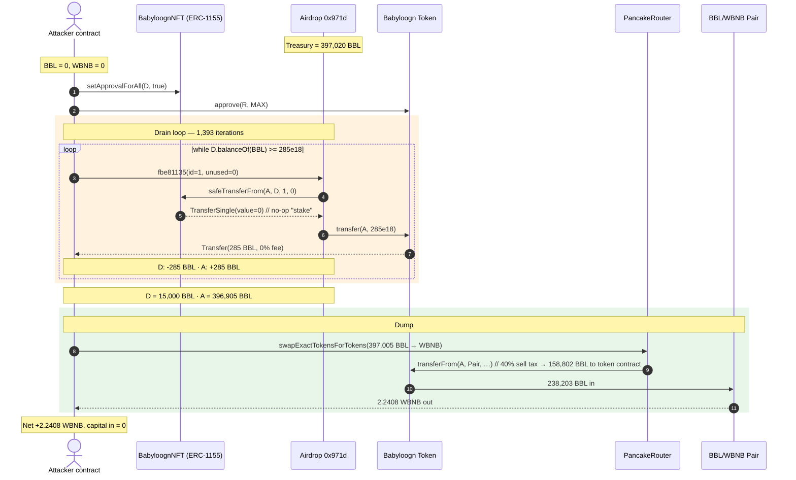
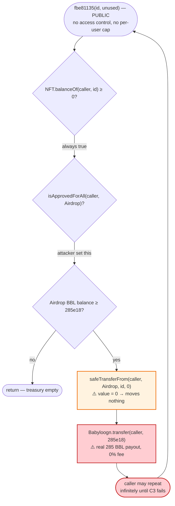
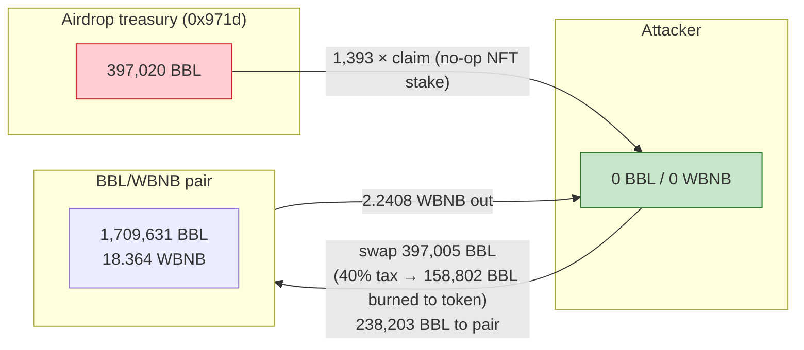

# Babyloogn Exploit — Permissionless Airdrop Drain via Zero-Value NFT "Stake"

> **Vulnerability classes:** vuln/logic/missing-check · vuln/access-control/missing-auth

> **Reproduction:** the PoC compiles & runs in an isolated Foundry project at
> [this project folder](.) (the main DeFiHackLabs repo holds many unrelated PoCs
> that do not compile together, so this one was extracted).
> Full verbose trace: [output.txt](output.txt).
> Verified token source: [sources/Token_7fe5fA/Token.sol](sources/Token_7fe5fA/Token.sol).

---

## Key info

| | |
|---|---|
| **Loss** | **~2.24 WBNB** (≈ $700 at the time) — drained from the Babyloogn/WBNB PancakeSwap pair |
| **Vulnerable contract** | Babyloogn Airdrop — [`0x971d08bbA900230298ADD23e61E04B04226b5073`](https://bscscan.com/address/0x971d08bbA900230298ADD23e61E04B04226b5073) (the `claim`-style function `0xfbe81135`) |
| **Looted token** | `Babyloogn` (BBL) — [`0x7fe5fAF242015Cf769Ae7feA565B96351Dd957A2`](https://bscscan.com/address/0x7fe5fAF242015Cf769Ae7feA565B96351Dd957A2) |
| **Victim pool** | Babyloogn/WBNB pair — `0xB726ebB38ED94239f5dd4f74A9Da30ab803e4568` |
| **Attacker EOA** | [`0x835b45D38cBdCCF99e609436Ff38E31AC05Bc502`](https://bscscan.com/address/0x835b45d38cbdccf99e609436ff38e31ac05bc502) |
| **Attacker contract** | [`0x3559EE265Fc9C5C9a333b07E0199480b4A84f369`](https://bscscan.com/address/0x3559ee265fc9c5c9a333b07e0199480b4a84f369) |
| **Attack tx** | [`0xd081d6bb…1ceb202`](https://app.blocksec.com/explorer/tx/bsc/0xd081d6bb96326be5305a6c00dd51d1799971794941576554341738abc1ceb202) |
| **Chain / block / date** | BSC / 36,159,516 / **Feb 15, 2024** (`block.timestamp = 1708007653`) |
| **Compiler** | Token: Solidity `^0.8.4`; PoC compiled with Solc `0.8.34` |
| **Bug class** | **Business-logic / access-control** — claim pays out tokens for a worthless (zero-amount) NFT transfer, with no per-user limit or real consumption |

---

## TL;DR

The Babyloogn project shipped an "airdrop" contract whose claim function (`0xfbe81135`)
hands out **285 Babyloogn per call** to any caller who (a) has approved the
Airdrop as an ERC-1155 operator and (b) passes any NFT `id`. The function then calls
`BabyloognNFT.safeTransferFrom(caller, airdrop, id, 0)` — i.e. it "takes" a **zero-amount**
NFT as the supposed stake — and in return `Babyloogn.transfer(caller, 285e18)` from the
Airdrop's own token treasury. Because the NFT transfer moves `value = 0`, the caller
loses nothing; the only real gate is `Babyloogn.balanceOf(airdrop) >= 285e18`.

The attacker simply wrapped that call in a `while` loop and pulled **1,393 × 285 = 396,905
Babyloogn** out of the airdrop wallet (out of an initial 397,020), then dumped the whole bag
through PancakeSwap for **2.2408 WBNB**. There is no flash loan, no reentrancy, no
price manipulation — just a public function that pays real tokens for a no-op NFT transfer
and has no claim cap.

---

## Background — what the system does

Babyloogn is a generic "tax + liquidity" ERC-20 of the kind spun up by token-minting
templates ([sources/Token_7fe5fA/Token.sol](sources/Token_7fe5fA/Token.sol)). Relevant
parameters baked in at construction:

- **40% sell tax** (`_sellLiquidityFee = 40`, `_totalTaxIfSelling = 40`,
  [Token.sol:280-286](sources/Token_7fe5fA/Token.sol#L280-L286)). Buy tax is 0.
- An internal **swap-and-liquify** hook in `_transfer`
  ([Token.sol:430-470](sources/Token_7fe5fA/Token.sol#L430-L470)) that, whenever the token
  contract holds more than `_minimumTokensBeforeSwap`, sells half the accrued tax for BNB
  and re-adds liquidity. (This is incidental to the exploit but fires once during the
  attack — see "Why the first claim looks different" below.)
- Tax applies **only when `sender` or `recipient` is a market pair** (`isMarketPair`)
  ([Token.sol:523-542](sources/Token_7fe5fA/Token.sol#L523-L542)). A direct
  wallet-to-wallet transfer between two non-pair addresses pays **no fee**.

The project also deployed:

- **`BabyloognNFT`** — `0x5eb47C41FC9BEcf123C9E484C51de37830842AdD`, an ERC-1155 used as the
  "ticket" for claiming the airdrop.
- **`Airdrop`** — `0x971d08bbA900230298ADD23e61E04B04226b5073`, a distribution contract
  seeded with **397,020 Babyloogn** (`3.9702e23`) earmarked for NFT holders.

The Airdrop was *not* open-sourced on-chain in this repo (only the Token was retrieved),
but its public function `0xfbe81135(uint256 id, uint256 /*unused*/)` is fully reconstructed
from the trace ([output.txt:1607-1708](output.txt#L1607-L1708)):

```
function fbe81135(uint256 id, uint256) external {
    require(BabyloognNFT.balanceOf(msg.sender, id) >= 0);          // trivially true
    require(BabyloognNFT.isApprovedForAll(msg.sender, address(this)));
    require(Babyloogn.balanceOf(address(this)) >= 285e18);
    BabyloognNFT.safeTransferFrom(msg.sender, address(this), id, 0); // ⚠️ amount = 0
    Babyloogn.transfer(msg.sender, 285e18);                          // ⚠️ pays 285 BBL
}
```

---

## The vulnerable code

The Token source we have is the Babyloogn ERC-20; the bug lives in the **Airdrop contract's
claim entrypoint**, which is verified behaviorally from the trace. The two load-bearing
lines (one of which is a no-op):

```solidity
// Airdrop.0xfbe81135 — reconstructed from the live trace
BabyloognNFT.safeTransferFrom(msg.sender, address(this), id, 0);  // moves ZERO NFTs
Babyloogn.transfer(msg.sender, 285e18);                           // pays 285 real BBL
```

Trace evidence for both halves (first claim,
[output.txt:1619-1647](output.txt#L1619-L1647)):

```
safeTransferFrom(ContractTest, Airdrop, 1, 0)
  └─ TransferSingle(operator: Airdrop, from: ContractTest, to: Airdrop, id: 1, value: 0)
Babyloogn.transfer(ContractTest, 285000000000000000000)
  └─ Transfer(from: Airdrop, to: ContractTest, value: 285000000000000000000)
```

The NFT side is a pure no-op: `value: 0`. The token side is a full 285-unit payout. There is
no claim counter, no per-address cap, no NFT burn, no time lock — `balanceOf(airdrop)` is the
only throttle, and the attacker just drains it to the floor.

The Token's `_transfer` that the Airdrop uses for the payout is fee-free on this leg because
neither the Airdrop nor the attacker is a market pair
([Token.sol:525-542](sources/Token_7fe5fA/Token.sol#L525-L542)):

```solidity
function takeFee(address sender, address recipient, uint256 amount) internal returns (uint256) {
    uint256 feeAmount = 0;
    if (isMarketPair[sender]) {           // Airdrop is NOT a market pair  → skip
        feeAmount = amount.mul(_totalTaxIfBuying.sub(_buyDestroyFee)).div(100);
        ...
    } else if (isMarketPair[recipient]) { // attacker is NOT a market pair → skip
        feeAmount = amount.mul(_totalTaxIfSelling.sub(_sellDestroyFee)).div(100);
        ...
    }
    ...
    return amount.sub(feeAmount.add(destAmount).add(airdropAmount)); // feeAmount == 0
}
```

So each of the 1,393 claims moves **exactly 285e18** — the trace shows the Airdrop balance
ticking down by `285e18` every call (397,020 → 396,735 → 396,450 → … → 15,000 BBL),
confirming zero tax leakage on the drain.

---

## Root cause — why it was possible

Three independent design flaws compose into a one-transaction drain:

1. **The "stake" is a no-op.** The claim requires an ERC-1155 `safeTransferFrom(…, value)`
   but hard-codes `value = 0`. An ERC-1155 transfer of amount zero is a valid, fee-less event
   that moves nothing. Treating it as proof-of-eligibility means the gate is decorative.

2. **No per-user limit / no consumption of the NFT.** The same NFT `id` can be "staked"
   repeatedly — the contract never marks an id or address as claimed. So one caller can
   invoke the function in a tight `while` loop until the treasury is empty.

3. **Payout is in liquid, tradeable tokens.** 285 Babyloogn per claim × 1,393 claims =
   ~397k tokens that the attacker immediately routes through the public PancakeSwap pair.
   Because the airdrop wallet was the single largest holder, dumping that bag moved the
   thin pool's WBNB reserve into the attacker's pocket.

> This is **not** a reentrancy or oracle bug. It is a pure business-logic / access-control
> failure: a public function that credits real value for a worthless action and has no rate
> limit.

---

## Preconditions

- The Airdrop holds ≥ 285e18 Babyloogn (it held 397,020e18 — enough for 1,393 full claims).
- The caller has called `BabyloognNFT.setApprovalForAll(airdrop, true)` so the Airdrop can
  act as an ERC-1155 operator. **No actual NFT ownership is required** — `balanceOf` is checked
  against `0` and the transfer moves `0`, so any address that approves can claim.
- Gas budget for ~1,393 iterations (the trace shows the whole loop costs ~36.8M gas, well
  under the BSC 140M block limit; no flash loan is needed because the attacker pays nothing).

---

## Attack walkthrough (with on-chain numbers from the trace)

Pool reserves are read at the fork block via `getReserves()`:
`token0 = Babyloogn = 1,709,631e18`, `token1 = WBNB = 18.364e18`
([output.txt:1660-1662](output.txt#L1660-L1662), [output.txt:28184-28186](output.txt#L28184-L28186)).

| # | Step | Airdrop BBL balance | Attacker BBL balance | Notes |
|---|------|--------------------:|---------------------:|-------|
| 0 | **Initial state** | 397,020 | 0 | Fork block 36,159,515. |
| 1 | `Babyloogn.approve(Router, MAX)` + `BabyloognNFT.setApprovalForAll(Airdrop, true)` | 397,020 | 0 | Set up router + airdrop operator approval. |
| 2 | **Claim #1** `Airdrop.0xfbe81135(1, 0)` | 396,735 | 285 | First claim also triggers the Token's `swapAndLiquify` on a pre-accrued tax balance (incidental — sells 2,679 BBL tax → 0.0287 BNB, re-adds liquidity). |
| 3 | **Claims #2 … #1,393** — `while (balanceOf(Airdrop) >= 285e18)` loop | 396,450 → … → 15,000 | 570 → … → 396,905 | 1,392 more iterations, each `+285 BBL` to attacker, `−285 BBL` from Airdrop. No fee on any of them. |
| 4 | **Final dump** — `Router.swapExactTokensForTokensSupportingFeeOnTransferTokens(397,005 BBL → WBNB)` | 15,000 | 0 | 40% sell tax routes 158,802 BBL to the token contract; 238,203 BBL reaches the pair and pulls **2.2408 WBNB** out. |
| 5 | **End** | 15,000 | 0 BBL, **2.2408 WBNB** | Pool left at 1,947,834 BBL / 16.12 WBNB. |

Concrete numbers pulled straight from the trace:

- Total claims: **1,393** (`grep -c "Airdrop::fbe81135" output.txt`).
- Airdrop balance first → last: `397,020e18` → `15,000e18`
  ([output.txt:1611](output.txt#L1611), [output.txt:28172](output.txt#L28172)).
- Attacker balance just before the dump: `397,005e18`
  ([output.txt:28174](output.txt#L28174)).
- Final swap output: `2,240,843,062,844,588,371 wei = 2.2408 WBNB`
  ([output.txt:28197-28199](output.txt#L28197-L28199)).

### Why the first claim looks different

In claim #1 the inner `Babyloogn.transfer` crosses the token contract's
`_minimumTokensBeforeSwap` threshold for *previously accrued* sell-tax tokens, so
`swapAndLiquify` fires once (swaps 2,679 BBL → 0.0287 BNB and re-adds liquidity,
[output.txt:1627-1700](output.txt#L1627-L1700)). This is a side effect of how the Token
manages tax, not part of the exploit — claims #2 onward are clean 285-BBL credits with no
side swap, which is why every subsequent iteration is byte-for-byte identical at ~22.7k gas.

### Profit / loss accounting (WBNB, this PoC)

| Direction | Amount |
|---|---:|
| Attacker capital in | **0** (no flash loan, no initial BNB) |
| Sell-tax absorbed (40% of 397,005 BBL = 158,802 BBL sent to token contract) | — (non-recoverable) |
| BBL actually swapped into the pair | 238,203 |
| **WBNB received** | **+2.2408** |
| **Net profit** | **+2.2408 WBNB** |

The attacker started with 0 WBNB and ended with 2.2408 WBNB
([output.txt:1586-1587](output.txt#L1586-L1587) vs [output.txt:28208-28209](output.txt#L28208-L28209)).
The 2.24 WBNB is the pool's BNB-side liquidity being bought with the dumped airdrop bag; the
40% sell tax merely caps how much of the bag is actually sellable.

---

## Diagrams

### Sequence of the attack



### Airdrop claim logic — the flaw



### Value flow — what the attacker actually captured



---

## Remediation

1. **Make the NFT stake real.** Require `value ≥ 1` (or a specific eligibility amount) in the
   `safeTransferFrom` and burn/mark the consumed NFT, so a single NFT cannot be re-used.
2. **Enforce a per-claimant cap.** Track `claimed[msg.sender]` and revert once a user has
   received their allocation; this alone would have capped the drain to 285 BBL per address.
3. **Add real access control / Merkle-claim listing.** An airdrop should verify the caller is
   on a precomputed allowlist (e.g. Merkle proof) rather than accepting any address that holds
   (or pretends to hold) an NFT.
4. **Decouple payout size from a fixed 285-unit bucket.** A claim function that pays a fixed,
   round number per call with only a treasury-balance floor is a textbook drain target — size
   payouts to the verified entitlement and no more.
5. **Time-lock / circuit-breaker the treasury.** A withdrawal-style daily cap on total outflow
   would have limited 1,393 rapid claims to a handful.

---

## How to reproduce

The PoC was extracted into a standalone Foundry project (the umbrella DeFiHackLabs repo
contains many unrelated PoCs that fail under `forge test`'s whole-project build):

```bash
_shared/run_poc.sh 2024-02-Babyloogn_exp --mt testExploit -vvvvv
```

- RPC: a **BSC archive** endpoint is required (fork block 36,159,515 is well over a year old).
  `foundry.toml` uses `https://bsc-mainnet.public.blastapi.io`; most public BSC RPCs prune
  this block and fail with `header not found` / `missing trie node`.
- Result: `[PASS] testExploit()` with **+2.24 WBNB**.

Expected tail ([output.txt:1566-1570](output.txt#L1566-L1570), [output.txt:28212-28214](output.txt#L28212-L28214)):

```
Ran 1 test for test/Babyloogn_exp.sol:ContractTest
[PASS] testExploit() (gas: 36819593)
Logs:
  Attacker WBNB balance before attack: 0
  Attacker WBNB balance before attack: 2240843062844588371

Suite result: ok. 1 passed; 0 failed; 0 skipped; finished in 16.25s (14.74s CPU time)
Ran 1 test suite in 330.88s (16.25s CPU time): 1 tests passed, 0 failed, 0 skipped (1 total tests)
```

(The PoC's second log line is mislabeled "before attack" in the source — it is the
post-attack balance; the value `2240843062844588371` = 2.2408 WBNB matches the final swap
output exactly.)

---

*Reference: BlockSec explorer —
[bsc/0xd081d6bb…1ceb202](https://app.blocksec.com/explorer/tx/bsc/0xd081d6bb96326be5305a6c00dd51d1799971794941576554341738abc1ceb202).
Airdrop contract bytecode was not open-sourced; the claim behavior above is reconstructed
from the executed transaction trace.*
