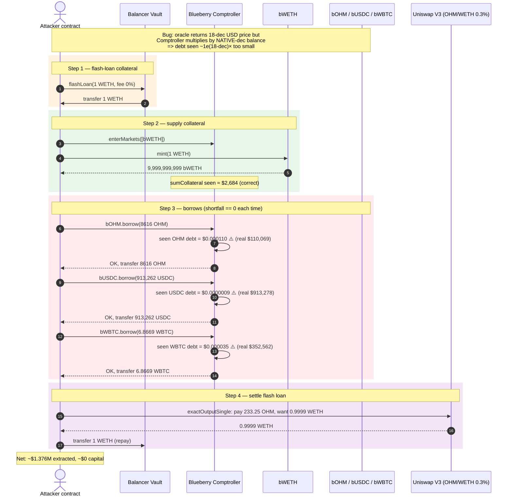
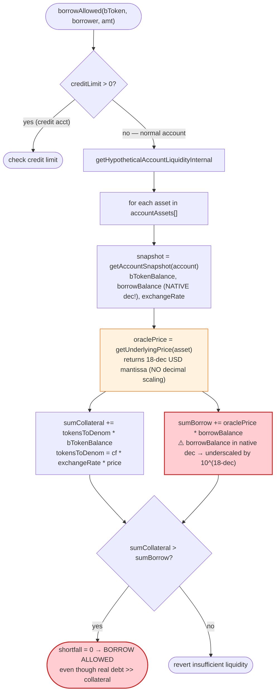
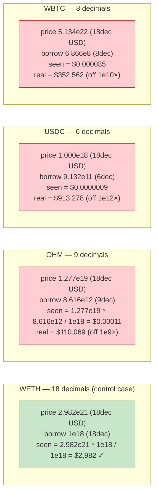

# Blueberry Protocol Exploit — Oracle Decimal Mismatch Enables ~$1.4M Under-Collateralized Borrow

> **Reproduction:** the PoC compiles & runs in an isolated Foundry project at [this project folder](.)
> (the umbrella DeFiHackLabs repo does not whole-compile).
> Full verbose trace: [output.txt](output.txt).
> Verified vulnerable source: [Comptroller.sol](sources/Comptroller_fFadB0/lib_blueberry-core_contracts_money-market_Comptroller.sol).

---

## Key info

| | |
|---|---|
| **Loss** | ~**$1,375,900** in borrowed assets (8,616 OHM, 913,262 USDC, 6.866 WBTC) taken against ~$2,982 of WETH collateral. Executed by a **whitehat**, later returned. |
| **Vulnerable contract** | `BlueberryProtocol` Comptroller (Unitroller proxy) — [`0xfFadB0bbA4379dFAbFB20CA6823F6EC439429ec2`](https://etherscan.io/address/0xffadb0bba4379dfabfb20ca6823f6ec439429ec2#code) |
| **Victim pools** | bOHM `0x08830038…`, bUSDC `0x649127D0…`, bWBTC `0xE61ad5B0…` (Blueberry money markets) |
| **Attacker EOA** | `0xc0ffeebabe5d496b2dde509f9fa189c25cf29671` (whitehat) |
| **Attacker contract** | [`0x3aa228a80f50763045bdfc45012da124bd0a6809`](https://etherscan.io/address/0x3aa228a80f50763045bdfc45012da124bd0a6809) |
| **Attack tx** | [`0xf0464b01d962f714eee9d4392b2494524d0e10ce3eb3723873afd1346b8b06e4`](https://etherscan.io/tx/0xf0464b01d962f714eee9d4392b2494524d0e10ce3eb3723873afd1346b8b06e4) |
| **Chain / block / date** | Ethereum mainnet / 19,287,288 / **Feb 23, 2024** |
| **Compiler** | Solidity **0.5.16** (Comptroller, Compound-fork), 0.8.x delegate (BCollateralCapErc20Delegate) |
| **Bug class** | Price-oracle decimal mismatch — oracle returns USD prices in 18-decimal mantissa without normalizing for the underlying token's own decimals (OHM=9, USDC=6, WBTC=8), collapsing the Comptroller's liquidity check |

---

## TL;DR

Blueberry's money market is a Compound v2 fork. The Comptroller's
`getHypotheticalAccountLiquidityInternal` values a borrow as
`oraclePrice * borrowBalance` and collateral as
`collateralFactor * exchangeRate * oraclePrice * bTokenBalance`
([Comptroller.sol:928-1030](sources/Comptroller_fFadB0/lib_blueberry-core_contracts_money-market_Comptroller.sol#L928-L1030)).
All three `Exp` factors are scaled by `1e18`, so the product only lands in USD
terms if **`borrowBalance` is expressed in 18-decimal units**.

It is not. `borrowBalance` comes from `getAccountSnapshot` in the **underlying
token's native decimals** — OHM is 9 decimals, USDC is 6, WBTC is 8. Meanwhile the
ChainlinkAdapter oracle adapter (`getUnderlyingPrice`) returns a clean
**18-decimal USD mantissa** for every asset ($12.7748 for OHM, $1.0000 for USDC,
$51,342.24 for WBTC). Because `price(1e18) * nativeBalance(<1e18) / 1e18`
collapses by `10^(18 - decimals)`, the Comptroller books the attacker's
**$1.376M of real debt as ~$0.000146 of debt**. Against 1 WETH of collateral
valued at ~$2,684, the liquidity check reports a comfortable surplus, and
`borrowAllowed` ([:449-507](sources/Comptroller_fFadB0/lib_blueberry-core_contracts_money-market_Comptroller.sol#L449-L507))
approves every borrow.

The attacker flash-loans 1 WETH from Balancer (zero fee), deposits it as
collateral, borrows OHM + USDC + WBTC worth ~$1.376M, sells a sliver of the OHM
(~233 OHM ≈ $2,982) on Uniswap V3 to recover the 1 WETH and repay the flash
loan, and walks away with the rest. Net extraction in a single transaction:
**~$1.4M of protocol assets for ~$0 net capital**.

---

## Background — what Blueberry's money market does

Blueberry's `Comptroller` ([source](sources/Comptroller_fFadB0/lib_blueberry-core_contracts_money-market_Comptroller.sol))
is a Compound v2-style money market. Users:

1. **Supply** an underlying asset to a `bToken` (e.g. bWETH) and receive
   interest-bearing `bToken` shares (8-decimal cToken convention — note the
   exchange rate of `~1.0002e26` visible in the trace).
2. **Enter markets** to mark supplied `bToken`s as collateral
   (`enterMarkets`, [:140-153](sources/Comptroller_fFadB0/lib_blueberry-core_contracts_money-market_Comptroller.sol#L140-L153)).
3. **Borrow** other underlyings. Before each borrow, `borrowAllowed`
   ([:449-507](sources/Comptroller_fFadB0/lib_blueberry-core_contracts_money-market_Comptroller.sol#L449-L507))
   calls `getHypotheticalAccountLiquidityInternal` and reverts on
   `shortfall > 0`.

The liquidity calc is the heart of the protocol. For each asset the account is
in, it reads `getAccountSnapshot` — which returns the raw `bTokenBalance` and
`borrowBalance` **in the underlying's native decimals** — multiplies by the
oracle's USD price, and compares the two sums. Compound v2 itself gets away with
this because its `PriceOracle` / `ChainlinkPriceOracle` returns prices that are
already pre-scaled by `10^(18 - underlyingDecimals)` (e.g. for 6-dec USDC the
oracle returns `1e30`, not `1e18`). Blueberry's `ChainlinkAdapterOracle` (the
`getUnderlyingPrice` implementation, reached via
`0x16D43cAC…` → `0x770d3E22…` → `0xC5CEa3f9…` in the trace) does **not** apply
that factor — it hands back a plain 18-decimal USD mantissa. That single
omission is the whole vulnerability.

The relevant on-chain readings at the fork block (19,287,288), pulled from the
trace's oracle calls:

| Asset | Decimals | Oracle `getUnderlyingPrice` return | Interpreted USD |
|---|---:|---:|---:|
| WETH | 18 | `2.9823e21` | $2,982.38 |
| OHM | **9** | `1.2774e19` | $12.7748 |
| USDC | **6** | `1.0000e18` | $1.0000164 |
| WBTC | **8** | `5.1342e22` | $51,342.24 |

OHM's price even looks right vs the on-chain market: the attacker's Uniswap V3
swap paid **233.25 OHM for 0.9999 WETH** ($2,982), i.e. ~$12.79/OHM. So this is
**not** a stale-price or wrong-feed bug — the feeds are healthy. The bug is
purely the missing decimal normalization in the price the Comptroller consumes.

> Side note on the OHM feed: the trace shows the legacy OHM/USD Chainlink
> aggregator (`0x9a72298a…`, round 2282, `updatedAt 1708588835` = Feb 22) had
> effectively been deprecated (it returns `$0.004283`), and the
> `ChainlinkAdapterOracle` falls through to the active ETH/USD-derived price for
> OHM. Either way, the price it finally returns ($12.77) is the correct live
> value. The decimal scaling, not the price level, is the defect.

---

## The vulnerable code

### 1. `borrowAllowed` delegates to the liquidity check with no decimal guard

```solidity
function borrowAllowed(
    address bToken,
    address borrower,
    uint256 borrowAmount
) external returns (uint256) {
    require(!borrowGuardianPaused[bToken], "borrow is paused");
    require(isMarketListed(bToken), "market not listed");
    // ... membership bookkeeping ...
    require(oracle.getUnderlyingPrice(BToken(bToken)) != 0, "price error");

    uint256 borrowCap = borrowCaps[bToken];
    if (borrowCap != 0) { /* ... total-borrow cap, also using native units ... */ }

    uint256 creditLimit = _creditLimits[borrower][bToken];
    if (creditLimit > 0) {
        // credit-account branch — not used here (attacker is a normal account)
    } else {
        (Error err, , uint256 shortfall) = getHypotheticalAccountLiquidityInternal(
            borrower, BToken(bToken), 0, borrowAmount
        );
        require(err == Error.NO_ERROR, "failed to get account liquidity");
        require(shortfall == 0, "insufficient liquidity");   // ⚠️ always passes here
    }
    return uint256(Error.NO_ERROR);
}
```
([sources/Comptroller_fFadB0/.../Comptroller.sol:449-507](sources/Comptroller_fFadB0/lib_blueberry-core_contracts_money-market_Comptroller.sol#L449-L507))

### 2. The liquidity math multiplies an 18-dec price by a native-dec balance

```solidity
// from getAccountSnapshot — balances are in the UNDERLYING's native decimals:
//   OHM  → 9 dec   (e.g. 8616071267266 == 8616.07 OHM)
//   USDC → 6 dec   (e.g. 913262603416  == 913262.6 USDC)
//   WBTC → 8 dec   (e.g. 686690100     == 6.8669 WBTC)
(oErr, vars.bTokenBalance, vars.borrowBalance, vars.exchangeRateMantissa)
    = asset.getAccountSnapshot(account);

vars.oraclePriceMantissa = oracle.getUnderlyingPrice(asset);   // 18-dec USD
vars.tokensToDenom = mul_(mul_(vars.collateralFactor, vars.exchangeRate), vars.oraclePrice);

// collateral: tokensToDenom * bTokenBalance   — OK, bToken/exchangeRate cancel cleanly
vars.sumCollateral = mul_ScalarTruncateAddUInt(vars.tokensToDenom, vars.bTokenBalance, vars.sumCollateral);

// debt: oraclePrice * borrowBalance  — ⚠️ borrowBalance is NATIVE decimals!
vars.sumBorrowPlusEffects = mul_ScalarTruncateAddUInt(vars.oraclePrice, vars.borrowBalance, vars.sumBorrowPlusEffects);
```
([sources/Comptroller_fFadB0/.../Comptroller.sol:928-1030](sources/Comptroller_fFadB0/lib_blueberry-core_contracts_money-market_Comptroller.sol#L928-L1030))

`mul_ScalarTruncateAddUInt(x, y, sum)` computes `sum + (x * y) / 1e18`. With
`oraclePrice = 1.2774e19` (18-dec) and `borrowBalance = 8.616e12` (9-dec OHM):

```
seen OHM debt  = 1.2774e19 * 8.616e12 / 1e18 = 1.10e14  ≈ $0.000110
real OHM debt  = 8616.07 * $12.7748           ≈ $110,069
error factor   = 1e9  (== 10^(18 - 9))
```

The debt side is underscaled by `10^(18 - decimals)` for every non-18-dec
asset. The collateral side happens to cancel out (bToken 8-dec × exchangeRate
1e26 / 1e18 = 1e18 underlying), so collateral is valued correctly while debt is
valued at ~zero.

---

## Root cause — why it was possible

The Comptroller's liquidity equation is only dimensionally correct if the
oracle returns a price already scaled to `1e(18 + (18 - underlyingDecimals))`
so that `price * nativeBalance / 1e18` yields true USD. Compound v2's own
`ChainlinkPriceOracle` does exactly this scaling (it divides the Chainlink
answer by `feedDecimals` then multiplies by `10^(36 - underlyingDecimals)`).
Blueberry replaced that oracle with a `ChainlinkAdapterOracle` that returns a
plain 18-dec USD answer and never applies the `10^(18 - underlyingDecimals)`
correction. Three facts compose into a critical bug:

1. **`borrowBalance` is in native decimals** (from `getAccountSnapshot`), not
   normalized to 18 — Compound v2's invariant, inherited verbatim.
2. **`oracle.getUnderlyingPrice` returns 18-dec USD** with no per-asset scaling
   factor — the divergence from upstream Compound.
3. **No assertion ties the two together.** Nothing in `borrowAllowed` or
   `getHypotheticalAccountLiquidityInternal` checks that the price's magnitude
   is consistent with the balance's decimals. A 1e9–1e12× debt underscaling is
   silently accepted.

The result: any borrow of a **non-18-decimal** asset is effectively free up to
the (correctly valued) collateral ceiling. WETH (18 dec) is the one asset where
the math is correct, which is why the attacker used WETH as the *collateral*
and borrowed the mis-scaled OHM/USDC/WBTC. The attacker needed only enough
honest collateral to clear the (tiny) seen debt — about 1 WETH.

This was **not** a flash-loan-manipulated AMM price, not a stale Chainlink
feed, and not an access-control failure. It was a units mismatch between two
parts of the same Compound fork that were never reconciled when the oracle was
swapped.

---

## Preconditions

- A listed Blueberry market whose underlying has **fewer than 18 decimals** and
  a non-zero collateral factor on the attacker's collateral asset (bWETH CF ≈
  0.9 here). All of OHM(9)/USDC(6)/WBTC(8) qualify.
- A working Chainlink adapter returning 18-dec prices for those assets (true at
  the fork block).
- A flash-loan source for 1 WETH to fund the collateral deposit. Balancer's
  `Vault.flashLoan` charges 0% fee (`ProtocolFeesCollector::getFlashLoanFeePercentage() == 0`),
  making the attack capital-free.
- The flash-loan callback being atomic: the borrowed assets are extracted and
  the WETH is repaid inside one transaction, so no collateral is ever at risk.

---

## Attack walkthrough (with on-chain numbers from the trace)

All figures are read directly from [output.txt](output.txt). The flash-loan
callback is the entire attack.

| # | Step | Asset / amount (native) | Real USD | Comptroller-seen USD |
|---|------|------------------------:|---------:|---------------------:|
| 0 | `vm.deal` + `WETH.deposit` — mint dust WETH (9997 wei) for approvals | 0.000000000000009997 WETH | ~$0 | — |
| 1 | **Balancer flashLoan 1 WETH** (`feeAmount 0`) | +1 WETH | +$2,982 | — |
| 2 | `enterMarkets([bWETH])` | register bWETH as collateral | — | — |
| 3 | `bWETH.mint(1 WETH)` → `UserCollateralChanged newCollateralTokens 9,999,999,999` | 1 WETH supplied | $2,982 collateral | **$2,684** collateral (CF 0.9) |
| 4 | `bOHM.borrow(8,616,071,267,266)` = **8616.07 OHM** | +8616.07 OHM | **+$110,069** | +$0.000110 |
| 5 | `bUSDC.borrow(913,262,603,416)` = **913,262.60 USDC** | +913,262.60 USDC | **+$913,278** | +$0.0000009 |
| 6 | `bWBTC.borrow(686,690,100)` = **6.8669 WBTC** | +6.8669 WBTC | **+$352,562** | +$0.000035 |
| 7 | `pool.exactOutputSingle` (OHM→WETH, 0.3%): pay **233.25 OHM**, receive **0.9999 WETH** | −233.25 OHM / +0.9999 WETH | −$2,982 / +$2,982 | — |
| 8 | `WETH.transfer(balancer, 1e18)` — repay flash loan | −1 WETH | −$2,982 | — |
| — | **Net attacker position** | 8382.8 OHM + 913,262 USDC + 6.8669 WBTC, debt = same, collateral = 1 WETH (seized by protocol later) | **≈ +$1,375,909** | seen debt ≈ $0.000146 |

`borrowAllowed` passed on all three borrows because, at the binding (WBTC)
check, the Comptroller computed `sumCollateral ≈ $2,684` versus
`sumBorrowPlusEffects ≈ $0.000146`, i.e. `shortfall == 0`. The 0.3% Uniswap fee
on the OHM→WETH swap is irrelevant: 233 OHM ≈ $2,982 covers the 1 WETH owed with
margin to spare, because OHM's real price (~$12.79) is exactly what the (broken)
oracle also reports — the price is right, the units are wrong.

### Profit / loss accounting

| Line | Amount |
|---|---:|
| Received — 8,616.07 OHM | $110,069 |
| Received — 913,262.60 USDC | $913,278 |
| Received — 6.8669 WBTC | $352,562 |
| Spent — 233.25 OHM sold for WETH (to repay flash loan) | −$2,982 |
| **Gross extraction** | **≈ $1,375,909** |
| Capital at risk (own) | $0 (flash-loaned, repaid in-tx) |

The 1 WETH collateral stays locked in bWETH and is later seized by the protocol
to partially offset the bad debt. The attacker's net is the ~$1.376M of
extracted assets minus effectively nothing.

---

## Diagrams

### Sequence of the attack



### Comptroller liquidity decision flow



### Why the debt side collapses (per-asset)



---

## Remediation

1. **Fix the oracle to return prices scaled for the underlying's decimals.**
   In `getUnderlyingPrice`, multiply the 18-dec USD answer by
   `10^(18 - underlyingDecimals)` so that
   `price(1e18) * nativeBalance / 1e18` yields true USD — exactly what Compound
   v2's `ChainlinkPriceOracle` does. This is the minimal, correctness-restoring
   fix and matches the Comptroller's existing dimensional convention.
2. **Add a decimal-consistency assertion in the Comptroller.** Before relying on
   `oraclePrice * borrowBalance`, sanity-check that the price's scale is
   compatible with `BToken(bToken).decimals()` (e.g. price should be ≥
   `10**(18 + 18 - decimals - 6)` for any listed asset). A wildly under-scaled
   debt term should fail closed, not silently pass.
3. **Use a per-market `priceScalar` set at `_supportMarket` time.** Store the
   correct `10^(18 - underlyingDecimals)` factor per market and apply it inside
   `getHypotheticalAccountLiquidityInternal`, so the Comptroller is robust to a
   mis-scaled oracle rather than dependent on it.
4. **Borrow-cap and supply-cap checks share the same flaw** — they compare
   `borrowAmount`/`mintAmount` (native units) against caps. Ensure caps are
   configured in native units and audited per market.
5. **Defense in depth: a global per-account borrow ceiling in USD (correctly
   computed).** Even if one oracle mis-scales, an independent USD ceiling would
   have capped the damage to a small fraction of $1.4M.

Blueberry paused the affected markets and ultimately the assets were returned
(this was a whitehat disclosure). The durable fix is #1.

---

## How to reproduce

The PoC is an isolated Foundry project (the umbrella DeFiHackLabs repo has
unrelated PoCs that fail to compile together):

```bash
_shared/run_poc.sh 2024-02-BlueberryProtocol_exp --mt testAttack -vvvvv
```

- RPC: an **Ethereum mainnet archive** endpoint. `foundry.toml` uses
  `https://ethereum-rpc.publicnode.com...`; the fork block 19,287,288 (Feb 23, 2024)
  requires historical state, so pruned public RPCs will fail with
  `missing trie node`.
- The fork is created at `19_287_289 - 1` (the block immediately before the
  real attack tx), so state matches the live exploit exactly.

Expected tail of [output.txt](output.txt):

```
Ran 1 test for test/BlueberryProtocol_exp.sol:ContractTest
[PASS] testAttack() (gas: 1518066)
...
Suite result: ok. 1 passed; 0 failed; 0 skipped; finished in 49.84s (48.48s CPU time)
```

A passing run means the attacker contract ended the transaction holding the
borrowed 8,382.8 OHM, 913,262 USDC, and 6.8669 WBTC after repaying the 1 WETH
flash loan — confirming the under-collateralized borrow succeeded against only
1 WETH of collateral.

---

*References: Blueberry Foundation disclosure —
https://twitter.com/blueberryFDN/status/1760865357236211964 ;
vulnerable source —
[sources/Comptroller_fFadB0/.../Comptroller.sol](sources/Comptroller_fFadB0/lib_blueberry-core_contracts_money-market_Comptroller.sol).*
