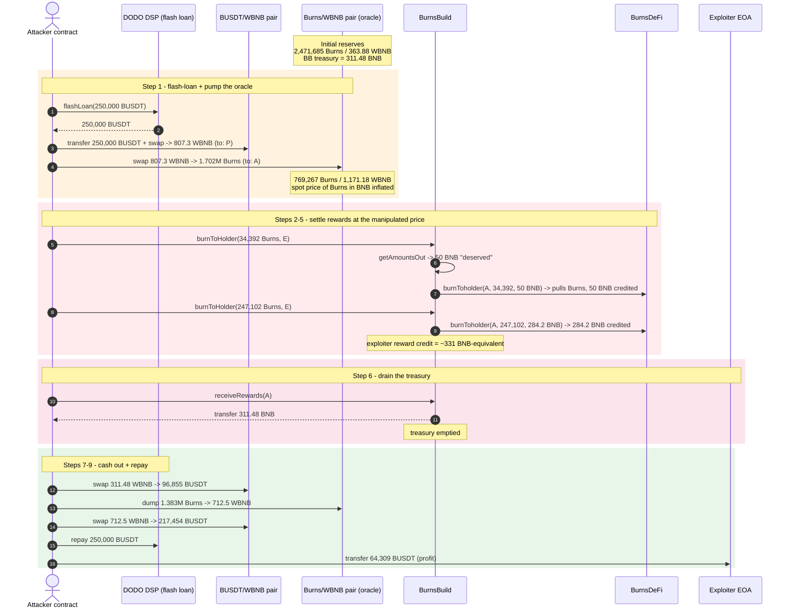
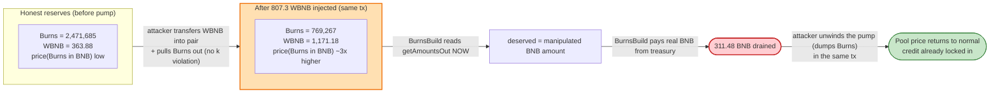
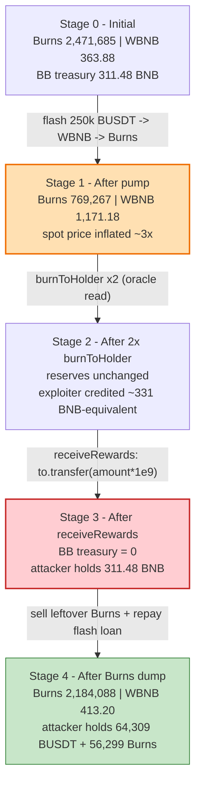

# BurnsDeFi / BurnsBuild Exploit — Spot-AMM Price-Oracle Manipulation in `burnToHolder`

> **Vulnerability classes:** vuln/oracle/spot-price · vuln/oracle/price-manipulation

> **Reproduction:** the PoC compiles & runs in an isolated Foundry project at
> [this project folder](.) (the umbrella DeFiHackLabs repo does not whole-build,
> so the PoC was extracted).
> Full verbose trace: [output.txt](output.txt).
> Verified vulnerable sources: [contracts_burnsBuild.sol](sources/BurnsBuild_4fb965/contracts_burnsBuild.sol)
> and [contracts_BurnsDeFi.sol](sources/BurnsDeFi_91f1d3/contracts_BurnsDeFi.sol).

---

## Key info

| | |
|---|---|
| **Loss** | ~$67K — **~31.15 BNB** drained from `BurnsBuild` plus ~64,310 BUSDT + ~56,299 Burns tokens sent to the attacker EOA |
| **Vulnerable contract** | `BurnsBuild` (the `burnToHolder` rewarder) — [`0x4fb9657Ac5d311dD54B37A75cFB873b127Eb21FD`](https://bscscan.com/address/0x4fb9657Ac5d311dD54B37A75cFB873b127Eb21FD#code) |
| **Token priced by the oracle** | `BurnsDeFi` ("Burns") — [`0x91f1d3C7ddB8d5E290e71f893baD45F16E8Bd7BA`](https://bscscan.com/address/0x91f1d3C7ddB8d5E290e71f893baD45F16E8Bd7BA) |
| **Manipulated pool** | Burns/WBNB PancakeSwap pair — `0x928cd66dFA268C69a37Be93BF7759dc8Ee676Bf8` |
| **Auxiliary pool** | BUSDT/WBNB PancakeSwap pair — `0x16b9a82891338f9bA80E2D6970FddA79D1eb0daE` |
| **Flash-loan source** | DODO DSP pool — `0xD5F05644EF5d0a36cA8C8B5177FfBd09eC63F92F` (250,000 BUSDT) |
| **Attacker EOA** | [`0xC9FBCf3EB24385491f73BbF691b13A6f8Be7C339`](https://bscscan.com/address/0xC9FBCf3EB24385491f73BbF691b13A6f8Be7C339) |
| **Attacker contract** | [`0xb5eebf73448e22ce6a556f848360057f6aadd4e7`](https://bscscan.com/address/0xb5eebf73448e22ce6a556f848360057f6aadd4e7) |
| **Attack tx** | `0x1d0af3a963682748493f21bf9e955ce3a950bee5817401bf2486db7a0af104b4` |
| **Chain / block / date** | BSC / 35,858,189 / Feb 4, 2024 |
| **Compiler** | Solidity **v0.8.23** (`commit.f704f362`), optimizer enabled, 200 runs |
| **Bug class** | Manipulated-reserve AMM price oracle (spot `getAmountsOut` used for value settlement); classic flash-loan oracle manipulation |

---

## TL;DR

`BurnsBuild.burnToHolder(amount, invitation)` lets a user "burn" Burns tokens and,
in exchange, receive **BNB** from the contract. The amount of BNB the user is
owed is computed with **PancakeRouter's spot `getAmountsOut`** reading the
Burns/WBNB pair reserves *at call time* ([contracts_burnsBuild.sol:664-674](sources/BurnsBuild_4fb965/contracts_burnsBuild.sol#L664-L674)).
There is no TWAP, no sanity cap, no freshness check. A Uniswap-V2 reserve is a
**donation-manipulable** price feed, so anyone who can move the pair reserves can
move the price the contract settles on.

The attacker flash-borrows **250,000 BUSDT** from a DODO pool, routes it
**BUSDT → WBNB → Burns** so that the borrowed liquidity is parked inside the
Burns/WBNB pair as extra **WBNB** (inflating the "Burns in terms of BNB" price),
then calls `burnToHolder` **twice** — once for `amountOut = 50 BNB`, once for
`amountOut = address(Burns).balance - 50 BNB`. Each call mints the attacker a
reward credit sized by the manipulated price and transfers BNB out of
`BurnsBuild`. Finally `receiveRewards` pulls the credited BNB to the attacker
contract. The borrowed BUSDT is repaid from selling the leftover Burns tokens
back through the same pools; everything left is profit.

---

## Background — what the system does

`BurnsDeFi` ([source](sources/BurnsDeFi_91f1d3/contracts_BurnsDeFi.sol)) is a
taxable ERC20 (2‰ burn + 1% marketing tax per transfer) with an auto-LP-burn
feature. It is paired with WBNB on PancakeSwap (`uniswapPair`). Its
`burnToholder(to, amount, balance)` is a privileged function callable **only by
`burnsHolder`** ([contracts_BurnsDeFi.sol:303-316](sources/BurnsDeFi_91f1d3/contracts_BurnsDeFi.sol#L303-L316)):
it pulls `amount` Burns from `to` into `burnsHolder` and forwards `balance`
wei of BNB from the token contract to `burnsHolder`.

`BurnsBuild` ([source](sources/BurnsBuild_4fb965/contracts_burnsBuild.sol)) is
that `burnsHolder`. It is a **reflection token** (Safemoon-style `_rOwned`/`_tOwned`)
that doubles as a "burn-to-earn" rewarder:

- `burnToHolder(amount, _invitation)` — public. Burns Burns tokens on behalf of
  the caller and credits the caller with BNB-equivalent rewards.
- `receiveRewards(to)` — public. Withdraws the caller's accrued reward (in BNB)
  to `to`.
- Rewards are sized by `canRewards(addr) = min(_balanceOf(addr) - burnAmount[addr], 2 * burnAmount[addr])`
  ([contracts_burnsBuild.sol:613-617](sources/BurnsBuild_4fb965/contracts_burnsBuild.sol#L613-L617)),
  i.e. up to 2× the caller's recorded "burn" principal.

The protocol's BNB treasury is held as plain native BNB on the `BurnsBuild`
contract (`payable(address(this)).balance`). At the fork block this was
**~31.15 BNB** (`311,480,345,900,000,000,000` wei — paid out by
`receiveRewards` at trace line 238).

---

## The vulnerable code

The oracle use sits inside `burnToHolder`:

```solidity
function burnToHolder(uint256 amount, address _invitation) external {
    address sender = _msgSender();
    require(amount >= 0, "TeaFactory: insufficient funds");
    ...
    address[] memory path = new address[](2);
    path[0] = address(_burnsToken);          // Burns
    path[1] = uniswapRouter.WETH();          // WBNB

    // ⚠️ SPOT price from the donation-manipulable Burns/WBNB pair:
    uint256 deserved = uniswapRouter.getAmountsOut(amount, path)[path.length - 1];
    require(payable(address(_burnsToken)).balance >= deserved, "not enough balance");

    _burnsToken.burnToholder(sender, amount, deserved);   // pulls Burns, pushes `deserved` BNB here
    _BurnTokenToDead(sender, amount);                     // distribute / burn Burns tokens
    burnFeeRewards(sender, deserved);                     // credit sender's reward ledger
}
```
> [contracts_burnsBuild.sol:649-678](sources/BurnsBuild_4fb965/contracts_burnsBuild.sol#L649-L678)

Two compounding mistakes:

1. **`deserved` is read from a single-block AMM spot price.** Reserves of a
   constant-product pool can be pushed by a same-block capital injection (or a
   flash loan), so `getAmountsOut` returns whatever the attacker just made it
   return. The contract then treats that number as ground truth for how much
   BNB to release.
2. **No settlement against the pair.** `burnToHolder` never actually performs a
   swap that would re-balance the pool — it just *reads* the price, then moves
   BNB out of `BurnsBuild`'s treasury. So the attacker can pump the reserve,
   get credited at the pumped price, then dump the reserve in the same tx; the
   credit is already locked in.

The payout path is:

```solidity
function receiveRewards(address payable to) external {
    ...
    uint256 amount = canRewards(addr);
    require(amount > 0, "Unable to receive rewards");
    Rewards[addr] = Rewards[addr].add(amount);
    ...
    to.transfer(amount.mul(10 ** 9));          // ⚠️ BNB leaves BurnsBuild here
    _transfer(addr, address(this), balance);
    ...
}
```
> [contracts_burnsBuild.sol:619-639](sources/BurnsBuild_4fb965/contracts_burnsBuild.sol#L619-L639)

The reward credit is denominated in `BurnsBuild`'s own (9-decimals) token
units, but the actual payout is **`amount * 1e9` wei of native BNB** — so a big
credit directly drains the BNB treasury.

---

## Root cause — why it was possible

A Uniswap-V2 `getAmountsOut` is a marginal-price formula over the *current*
reserves. It is safe for slippage checks; it is **not safe as a settlement
price**, because the reserves are controllable inside the same transaction.
`BurnsBuild` uses it as a settlement price and pays out BNB it actually owns
against that number.

The four design decisions that compose into the drain:

1. **`burnToHolder` is public** — anyone can request a "burn" and get a reward
   credit priced off the pair.
2. **The price feed is a single AMM reserve pair** with no TWAP, no min-output,
   no freshness check, and no cap on `deserved` relative to the caller's actual
   Burns input.
3. **The reward is settled in BNB that BurnsBuild genuinely holds** (its
   treasury), not in tokens swapped out of the pair — so the manipulated
   "deserved" number is paid by the protocol, not by the market.
4. **`receiveRewards` lets the caller sweep the full credited amount as native
   BNB** in the same transaction (`to.transfer(amount * 1e9)`), so the treasury
   is emptied before anything can re-price.

This is the same pattern as the Citadel Finance / Neptune Mutual class of
incidents (see the PoC header references); "price an on-chain action off a
manipulable LP reserve, then settle value against that price."

---

## Preconditions

- `BurnsDeFi.launch == true` (so `_transfer` and `burnToholder` don't revert
  with "unlaunch"). True at the fork block.
- `BurnsBuild._burnsToken` is set to `BurnsDeFi` and `BurnsBuild` holds Burns
  tokens + BNB. True on mainnet.
- Flash-loanable working capital. The attacker used a **250,000 BUSDT** DODO
  flash loan; no own capital required. DODO flash loans are free within the
  block as long as principal is returned.
- `BurnsBuild`'s BNB treasury (`payable(address(this)).balance`) is the prize.
  At block 35,858,189 it was **31.15 BNB**.

---

## Attack walkthrough (with on-chain numbers from the trace)

`Burns_WBNB` is the oracle pool. `token0 = Burns`, `token1 = WBNB`. All numbers
are read from the `Sync`/`Swap`/`Transfer` events in [output.txt](output.txt).
The two "reward legs" are the two `burnToHolder` calls; the attacker splits the
contract's entire Burns-token BNB-coverage into a 50-BNB and a ~284.2-BNB slice
(`amountOut1 = 50e18`, `amountOut2 = address(Burns).balance - 50e18`).

| # | Step | Burns_WBNB reserves (Burns / WBNB) | Effect |
|---|------|----------------------:|--------|
| 0 | **Flash-loan** 250,000 BUSDT from DODO DSP | 2,471,685 / 363.88 | Borrowed capital enters attacker contract. |
| 1 | **Pump**: route 250k BUSDT → WBNB in `BUSDT_WBNB`, forward **807.3 WBNB** into `Burns_WBNB`, pull **1.702M Burns** out to attacker | 769,267 / 1,171.18 | Pool WBNB reserve tripled; Burns/WBNB spot price of Burns vs BNB is **inflated**. Attacker holds 1.681M Burns. |
| 2 | `getAmountsIn(50 BNB, [Burns, WBNB])` = **34,392 Burns** | unchanged | Compute how many Burns "buy" 50 BNB at the inflated price. |
| 3 | **`burnToHolder(34,392 Burns, exploiter)`** — `getAmountsOut` confirms 50 BNB "deserved"; BurnsBuild credits `exploiter` ~6,878 BurnsBuild-tokens reward and burns the input | unchanged | Reward #1 locked: 50 BNB owed to exploiter, plus a 6,878 BurnsBuild reward credit. |
| 4 | `getAmountsIn(284.2 BNB, …)` = **247,102 Burns** | unchanged | Same trick for the rest of the contract's BNB coverage. |
| 5 | **`burnToHolder(247,102 Burns, exploiter)`** | unchanged | Reward #2 locked: 284.2 BNB owed, plus a 49,420 BurnsBuild reward credit. |
| 6 | **`receiveRewards(attackerContract)`** — BurnsBuild transfers **311.48 BNB** to the attacker contract (`amount.mul(1e9)`) | unchanged | **Treasury drained.** 311.48 BNB now sits on the attacker contract. |
| 7 | Wrap 311.48 BNB → WBNB; swap **311.48 WBNB → 96,855 BUSDT** in `BUSDT_WBNB` | (BUSDT/WBNB reserves updated) | Convert the stolen BNB to BUSDT. |
| 8 | Dump leftover **1.383M Burns → 712.5 WBNB → 217,454 BUSDT** through both pairs | Burns_WBNB → 2,184,088 / 413.20 | Liquidate the leftover Burns tokens. |
| 9 | Repay DODO **250,000 BUSDT**; send remaining **64,309 BUSDT** to `exploiter` EOA | — | Loan closed; profit banked. |

Concrete trace anchors:
- Flash-loan in: `DSP.flashLoan(250_000e18, …)` →
  `Transfer(DSP → ContractTest, 250_000 BUSDT)` (output.txt L75-78).
- Pump into Burns_WBNB: `BUSDT_WBNB.swap(... 807.3 WBNB … to: Burns_WBNB)`
  (L94-109), then `Burns_WBNB.swap(1.702M Burns … to: ContractTest)` (L114-133).
- First oracle read: `getAmountsIn(50 BNB, [Burns,WBNB]) = 34,392 Burns`
  (L134-137), followed by `burnToHolder(34,392, exploiter)` whose internal
  `getAmountsOut` returns 50 BNB (L138-145), then `_BurnTokenToDead` burns
  27,513 Burns to `0xdEaD` and transfers 6,878 BurnsBuild tokens to exploiter
  (L155-167).
- Second leg: `getAmountsIn(284.2 BNB, …) = 247,102 Burns` (L189-192),
  `burnToHolder(247,102, exploiter)` burns 197,682 Burns, transfers 49,420
  BurnsBuild to exploiter (L193-236).
- Treasury drain: `receiveRewards(ContractTest)` →
  `ContractTest::receive{value: 311,480,345,900,000,000,000}()` — i.e.
  **311.48 BNB** moved out of BurnsBuild (L237-250).
- Profit split: repay `DSP` 250,000 BUSDT (L383-388); transfer remaining
  **64,309.628 BUSDT** to exploiter EOA (L391-396); exploiter also keeps
  **56,298.93 Burns** (L418-422).

### Profit / loss accounting (BUSDT, 18 dp)

| Direction | Amount (BUSDT) |
|---|---:|
| DODO flash loan (borrowed) | 250,000.00 |
| Repaid to DODO | (250,000.00) |
| BUSDT netted from WBNB leg (step 7) | 96,855.55 |
| BUSDT netted from Burns dump (step 8) | 217,454.07 |
| **Net BUSDT to exploiter EOA** | **64,309.63** |
| **Plus leftover Burns tokens** | **56,298.93 Burns** |
| **Plus BNB extracted from BurnsBuild** | **311.48 BNB** (~$67K at the time) |

The ~$67K headline loss is the 311.48 BNB pulled out of `BurnsBuild`'s treasury
(the dump of the leftover Burns and the BUSDT routing just converts that BNB to
spendable stablecoins and repays the flash loan). The PoC's final log lines
confirm exactly: `Exploiter BUSDT balance after attack: 64309.628…` and
`Exploiter Burns balance after attack: 56298.933…`.

---

## Diagrams

### Sequence of the attack



### Why a spot AMM reserve is not a settlement price



### Pool state evolution through the tx



---

## Remediation

1. **Never settle value off a spot AMM reserve.** Replace
   `getAmountsOut(amount, [Burns, WBNB])` with a manipulation-resistant feed:
   a TWAP over a meaningful window (e.g. 30 min), a Chainlink-style oracle, or a
   Time-Weighted Average Price read from the pair itself via Uniswap V2
   `priceCumulative` slots. At minimum, sanity-cap the deviation from the TWAP.
2. **Cap per-call payout.** `deserved` should be bounded by both a global
   per-block BNB limit and a fraction of the caller's actual Burns input valued
   at a *conservative* price — never the instantaneous marginal price.
3. **Settle through the pool, not against the treasury.** If the product is
   "burn Burns, get BNB," the BNB should come from actually selling the Burns
   through the AMM (so the pool re-prices), not from a separate BNB vault
   priced off a reading of that same pool.
4. **Add a freshness / cooldown gate.** Reject `burnToHolder` if the pair
   reserves have moved more than X% in the last N blocks, or enforce a per-user
   cooldown. Flash-loan attacks are atomic; any delay breaks them.
5. **Make `receiveRewards` non-instant** (vesting, withdrawal queue, or a
   settlement window) so a locked-in manipulated credit cannot be cashed out in
   the same transaction before the price normalizes.
6. **Reduce centralization of the BNB treasury.** A single contract holding all
   reward BNB, payable on-demand via a public function whose amount is
   attacker-influenceable, is a honeypot. Segregate and timelock.

---

## How to reproduce

The PoC was extracted into a standalone Foundry project (the umbrella
DeFiHackLabs repo has many unrelated PoCs that fail to compile under a
whole-project `forge build`):

```bash
_shared/run_poc.sh 2024-02-BurnsDefi_exp --mt testExploit -vvvvv
```

- RPC: a **BSC archive** endpoint is required (fork block 35,858,189 is ~2 years
  old). `foundry.toml` uses `https://bsc-mainnet.public.blastapi.io`; most
  pruned public BSC RPCs fail with `header not found` / `missing trie node`.
- Result: `[PASS] testExploit()`.

Expected tail (from [output.txt](output.txt)):

```
Ran 1 test for test/BurnsDefi_exp.sol:ContractTest
[PASS] testExploit() (gas: 1329851)
Logs:
  Exploiter BUSDT balance before attack: 0.000000000000000000
  Exploiter Burns balance before attack: 0.000000000000000000
  Exploiter BUSDT balance after attack: 64309.628561934633642636
  Exploiter Burns balance after attack: 56298.933430646287662030

Suite result: ok. 1 passed; 0 failed; 0 skipped; finished in 25.82s (24.96s CPU time)
```

---

*References (from PoC header):*
- *SlowMist / @pennysplayer thread — https://twitter.com/pennysplayer/status/1754342573815238946*
- *Neptune Mutual write-up of the analogous Citadel Finance incident — https://medium.com/neptune-mutual/how-was-citadel-finance-exploited-a5f9acd0b408*
