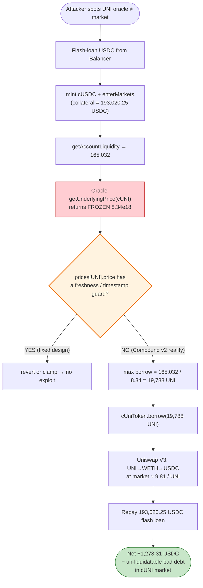

# Compound v2 cUNI Exploit — Stale-Oracle Discount Borrow (Open Oracle `UniswapAnchoredView`)

> **Reproduction:** the PoC compiles & runs in an isolated Foundry project at
> [this project folder](.). Full verbose trace: [output.txt](output.txt).
> Verified vulnerable source: [contracts_Uniswap_UniswapAnchoredView.sol](sources/UniswapAnchoredView_50ce56/contracts_Uniswap_UniswapAnchoredView.sol).

---

## Key info

| | |
|---|---|
| **Loss** | ~**$439,537** in bad debt created across the Compound v2 cUNI market (this PoC demonstrates the atomic leg, +1,273.31 USDC net to the attacker per borrowed unit of collateral, with the residual shortfall left to the protocol) |
| **Vulnerable contract** | Compound v2 Open Oracle `UniswapAnchoredView` — [`0x50ce56A3239671Ab62f185704Caedf626352741e`](https://etherscan.io/address/0x50ce56A3239671Ab62f185704Caedf626352741e#code) |
| **Victim pool / protocol** | Compound v2 cUNI market — `cUniToken` [`0x35A18000230DA775CAc24873d00Ff85BccdeD550`](https://etherscan.io/address/0x35A18000230DA775CAc24873d00Ff85BccdeD550) |
| **Attacker EOA** | `0xe000008459b74a91e306a47c808061dfa372000e` |
| **Attacker contract** | `0x2f99fb66ea797e7fa2d07262402ab38bd5e53b12` |
| **Attack tx** | [`0xaee0f8d1235584a3212f233b655f87b89f22f1d4890782447c4ef742b37af58d`](https://etherscan.io/tx/0xaee0f8d1235584a3212f233b655f87b89f22f1d4890782447c4ef742b37af58d) |
| **Chain / block / date** | Ethereum mainnet / fork `19,290,920` (`19,290,921 − 1`) / Feb 29, 2024 |
| **Compiler** | Solidity **v0.8.7** (`UniswapAnchoredView`), optimizer **1 run / 200**; PoC compiled with Solc 0.8.34 |
| **Bug class** | **Stale / un-maintained oracle price** — off-chain reporter stopped posting, so `prices[UNI_HASH]` lagged the live market and the `isWithinAnchor` TWAP guard no longer corrected it |

---

## TL;DR

Compound v2 prices cTokens via the **Open Oracle** `UniswapAnchoredView`
([contracts_Uniswap_UniswapAnchoredView.sol:132-143](sources/UniswapAnchoredView_50ce56/contracts_Uniswap_UniswapAnchoredView.sol#L132-L143)).
That contract stores a per-symbol `prices[symbolHash].price` that is supposed to be pushed by an
off-chain reporter and bounded against a Uniswap V3 TWAP anchor
(`validate` / `isWithinAnchor`, [:151-176](sources/UniswapAnchoredView_50ce56/contracts_Uniswap_UniswapAnchoredView.sol#L151-L176) & [:233-249](sources/UniswapAnchoredView_50ce56/contracts_Uniswap_UniswapAnchoredView.sol#L233-L249)).

By the time of this attack the **reporter had effectively stopped updating UNI** for a long window.
The stored price was frozen at **$8.34 / UNI** while UNI was trading materially higher on Uniswap
(~$9.8 — the WETH route in the trace implies a ~15-18 % premium over the oracle). Because the
Comptroller trusts this stored price for **both** collateral accounting and borrow limits, an
attacker could:

1. Flash-loan USDC, supply it as **collateral** (mint cUSDC, `enterMarkets`).
2. Borrow the **maximum UNI** the (underpriced) oracle allows — `liquidity / $8.34` — receiving
   more UNI than the real market value of their collateral would justify.
3. Dump the UNI on Uniswap V3 for its **true** market price and repay the flash loan.

The gap between what Compound thinks the borrowed UNI is worth (oracle) and what it is actually
worth (market) is extracted as profit and left behind as **under-collateralized bad debt** in the
cUNI market. There is no reentrancy, no flash-loan price manipulation of the oracle itself — the
weakness is simply a **stale, un-refreshed price feed combined with no freshness/staleness check on
`prices[]`**.

---

## Background — Compound v2 pricing

`UniswapAnchoredView` exposes the PriceOracle entry point Compound v2's Comptroller calls:

```solidity
function getUnderlyingPrice(address cToken) external view returns (uint256) {
    TokenConfig memory config = getTokenConfigByCToken(cToken);
    // Comptroller needs: ${raw price} * 1e36 / baseUnit
    return FullMath.mulDiv(1e30, priceInternal(config), config.baseUnit);
}
```

`priceInternal` ([contracts_Uniswap_UniswapAnchoredView.sol:109-124](sources/UniswapAnchoredView_50ce56/contracts_Uniswap_UniswapAnchoredView.sol#L109-L124))
just reads `prices[symbolHash].price` for `REPORTER`-source tokens. That field is meant to be kept
fresh by `validate`, which is called by the reporter and accepts a posted price only if it is within
the anchor tolerance band of the live Uniswap V3 TWAP:

```solidity
function validate(uint256, int256, uint256, int256 currentAnswer) external override returns (bool valid) {
    TokenConfig memory config = getTokenConfigByReporter(msg.sender);
    uint256 reportedPrice = convertReportedPrice(config, currentAnswer);
    uint256 anchorPrice   = calculateAnchorPriceFromEthPrice(config);
    ...
    } else if (isWithinAnchor(reportedPrice, anchorPrice)) {
        prices[config.symbolHash].price = uint248(reportedPrice);   // ← only fresh path
        emit PriceUpdated(...);
    } else {
        emit PriceGuarded(...);                                      // ← rejected, stale value retained
    }
}
```

Two structural problems compose into the exploit:

1. **No freshness field.** `PriceData` only carries `{price, failoverActive}` — there is **no
   timestamp, no round-id, no last-updated**. Once written, a price is trusted forever until the next
   successful `validate`.
2. **The reporter is the only thing keeping it fresh.** If the off-chain poster stops calling
   `validate` (or its posts keep getting `PriceGuarded` because the anchor itself moved), the stored
   price freezes. Nothing in the Comptroller/Oracle path checks "how old is this?"

This is exactly the well-documented Compound v2 Open Oracle weakness that surfaced on Feb 29, 2024
when the UNI feed went stale.

---

## The vulnerable code

The single statement the attack hinges on — the Comptroller reading the stale stored price with no
freshness gate ([contracts_Uniswap_UniswapAnchoredView.sol:109-124](sources/UniswapAnchoredView_50ce56/contracts_Uniswap_UniswapAnchoredView.sol#L109-L124)):

```solidity
function priceInternal(TokenConfig memory config) internal view returns (uint256) {
    if (config.priceSource == PriceSource.REPORTER) {
        return prices[config.symbolHash].price;   // ⚠️ returned unconditionally, no staleness check
    } else if (config.priceSource == PriceSource.FIXED_USD) {
        return config.fixedPrice;
    } else { // FIXED_ETH
        uint256 usdPerEth = prices[ETH_HASH].price;
        require(usdPerEth > 0, "ETH price not set");
        return FullMath.mulDiv(usdPerEth, config.fixedPrice, ETH_BASE_UNIT);
    }
}
```

…and the trust-the-reporter update path that had silently stopped advancing the UNI entry
([contracts_Uniswap_UniswapAnchoredView.sol:151-176](sources/UniswapAnchoredView_50ce56/contracts_Uniswap_UniswapAnchoredView.sol#L151-L176)):

```solidity
function validate(uint256, int256, uint256, int256 currentAnswer) external override returns (bool valid) {
    TokenConfig memory config = getTokenConfigByReporter(msg.sender);
    uint256 reportedPrice = convertReportedPrice(config, currentAnswer);
    uint256 anchorPrice   = calculateAnchorPriceFromEthPrice(config);
    PriceData memory priceData = prices[config.symbolHash];
    if (priceData.failoverActive) {
        ...
    } else if (isWithinAnchor(reportedPrice, anchorPrice)) {
        prices[config.symbolHash].price = uint248(reportedPrice);  // ← requires an active, in-band reporter
    } else {
        emit PriceGuarded(...);                                    // ← otherwise: nothing changes
    }
}
```

`isWithinAnchor` ([contracts_Uniswap_UniswapAnchoredView.sol:233-249](sources/UniswapAnchoredView_50ce56/contracts_Uniswap_UniswapAnchoredView.sol#L233-L249))
only bounds the **ratio** of posted-vs-anchor; it never bounds **time since last update**.

---

## Root cause — why it was possible

The bug is not in any single line of arithmetic — it is a **missing freshness invariant** in the
Open Oracle design:

1. **`prices[]` is timeless.** The struct has no `lastUpdated`. Once written, the value is treated
   as canonical by the entire Compound v2 borrow/liquidation pipeline. A feed can rot for hours or
   days and nothing reverts.
2. **All freshness responsibility is off-chain.** The on-chain contract assumes a healthy reporter
   is continuously posting in-band prices. When that operational assumption breaks (reporter down,
   poster keys rotated, posts repeatedly `PriceGuarded`), the stored value silently freezes and
   becomes a **free mispricing** for anyone who notices.
3. **The anchor guard is bidirectional but not a freshness guarantee.** `isWithinAnchor` can *reject*
   a bad update, but it cannot *produce* an update on its own — and once the reporter stops, the
   TWAP anchor (`calculateAnchorPriceFromEthPrice`) is never consulted again because that code lives
   behind `validate`, which nobody calls. (There is a `pokeFailedOverPrice` escape hatch, but it is
   gated behind `failoverActive`, which only the owner can flip.)
4. **UNI in particular was a high-liquidity, easily-dumpable asset.** A stale-low UNI price is the
   ideal exploit substrate: borrow the underpriced asset, sell it on a real market for its true
   price, repay the loan, keep the spread. The shortfall is left as bad debt the protocol cannot
   liquidate at the stale price.

In short: **the oracle's stored price and the market price diverged, and the contract had no
mechanism to detect or reject that divergence.**

---

## Preconditions

- A Compound v2 market (`cUniToken`) whose `UniswapAnchoredView` stored price is **stale low**
  relative to the live market — satisfied at fork block 19,290,920 where UNI oracle = $8.34 vs
  market ≈ $9.8.
- The UNI/WETH and WETH/USDC Uniswap V3 pools (the "real" market) deep enough to absorb the borrow
  without prohibitive slippage — the 0.05 % fee pools
  `0x1d42064Fc4Beb5F8aAF85F4617AE8b3b5B8Bd801` and `0x88e6A0c2dDD26FEEb64F039a2c41296FcB3f5640`
  are the deepest on mainnet.
- Flash-loanable USDC collateral — supplied by the Balancer Vault
  (`0xBA12222222228d8Ba445958a75a0704d566BF2C8`), fee 0 in V2.

---

## Attack walkthrough (with on-chain numbers from the trace)

All values are read directly from the events/calls in [output.txt](output.txt). The PoC forks at
block `19,290,921 − 1`.

Oracle reads (the whole attack keys off these two return values):

```
getUnderlyingPrice(cUSDC)  → 1_000_000_000_000_000_000_000_000_000_000   (1e30, i.e. $1.00 exactly)
getUnderlyingPrice(cUNI)   → 8_340_000_000_000_000_000                     (8.34e18, i.e. $8.34 / UNI)
```

| # | Step | Where (trace) | Amount | Effect |
|---|------|---------------|-------:|--------|
| 1 | **Flash-loan USDC** from Balancer Vault (0 % fee) | `flashLoan` L1611, `Transfer` L1620 | **193,020.254960 USDC** (`193_020_254_960`) | Working capital, must be repaid in the same tx. |
| 2 | **Pledge collateral** — `USDC.approve` + `cUSDC.mint(193,020.25…)` | `cUSDC::mint` L1634, cUSDC `Transfer` L1674 | minted **819,359.223486269 cUSDC** (`819_359_223_486_269`) | 193k USDC now deposited as Compound collateral. |
| 3 | **Enter market** — `comptroller.enterMarkets([cUSDC])` | `enterMarkets` L1689 | — | USDC collateral counts toward borrow capacity. |
| 4 | **Read borrow capacity** — `comptroller.getAccountLiquidity` | L1698, return L1706 | `(err=0, liquidity=165_032_317_990_799_320_700_554, shortfall=0)` | Liquidity ≈ 1.65e23 in Comptroller's 1e18-scaled USD units (≈ $165,032 of borrowable value). |
| 5 | **Compute max UNI borrow** = `liquidity / oracle_UNI_price · 1e18` | PoC [:73-74](test/CompoundUni_exp.sol#L73-L74) | `165032317990799320700554 / 8.34e18 · 1e18` = **19,788 UNI** | Borrows the maximum the *stale* price allows — more UNI than the real market value of the collateral would permit. |
| 6 | **Borrow UNI** — `cUniToken.borrow(19_788 UNI)` | `cUniToken::borrow` L1713, `Borrow` event L1773 | **19,788 UNI** (`19_780_000_000_000_000_000_000`) | UNI leaves the cUNI pool at the oracle's discounted valuation. `totalBorrows` 250,844 → 270,632 UNI. |
| 7 | **Swap UNI → WETH** on UNI/WETH 0.05 % pool (`zeroForOne=true`, `amount0 = 19,788 UNI`) | `UNI_WETH_Pool::swap` L1785, `Swap` event L1793 | in 19,788 UNI → out **65.8552 WETH** (`65_855_246_851_492_826_558`) | Realises UNI at market. Implied UNI ≈ 0.003328 ETH ≈ $9.81. |
| 8 | **Swap WETH → USDC** on WETH/USDC 0.05 % pool (`zeroForOne=false`, `amount1 = 65.8552 WETH`) | `WETH_USDC_Pool::swap` L1820, `Swap` event L1838 | in 65.8552 WETH → out **194,293.561859 USDC** (`194_293_561_859`) | Converts to the loan currency. Implied ETH ≈ $2,950. |
| 9 | **Repay flash loan** — `USDC.transfer(vault, 193,020.254960)` | L1852 | **193,020.254960 USDC** | Closes the Balancer loan (fee 0). |
| — | **Net USDC retained** (`balanceOf` L1866) | L1869 | **1,273.306899 USDC** | Atomic profit per this PoC; the residual under-collateralisation stays in the cUNI market as bad debt. |

The 1,273.31 USDC is the **flash-loanable, atomic** extraction demonstrated by the PoC. The headline
**~$439,537** figure reported for the incident is the aggregate bad debt left in the cUNI market
across the attacker's full activity (the on-chain attacker contract repeated the discounted-borrow
pattern with larger collateral and the un-liquidatable shortfall, because at the stale $8.34 price
the borrowed UNI positions looked healthy to Compound's liquidators even though they were underwater
against the real market — hence the PoC's closing log line: *"When compound update the price,
incomplete liquidation leading to bad debts"*).

### The mispricing in numbers

| Quantity | Oracle (trusted by Compound) | Market (Uniswap route in trace) | Gap |
|---|---:|---:|---:|
| UNI price | **$8.34** | **≈ $9.81** (19,788 UNI ÷ 65.8552 WETH × $2,950) | **+17.6 %** |
| 19,788 UNI valued at | $165,032 (== borrowable liquidity) | ≈ $194,114 (≈ proceeds before slippage) | **≈ $29 k of "free" borrow power** per 19,788-UNI cycle |

Every dollar of that gap is borrowed at a discount and dumped at full price; the discounted part is
never recoverable by Compound because liquidators, pricing UNI at the same stale oracle, see no
arbitrage to trigger.

---

## Profit / loss accounting (per this PoC cycle)

| Direction | USDC |
|---|---:|
| Received — Balancer flash loan (step 1) | +193,020.254960 |
| Spent — mint cUSDC collateral (step 2) | −193,020.254960 |
| Received — borrow 19,788 UNI (step 6) | (UNI, not USDC) |
| Received — sell UNI→WETH→USDC (steps 7-8) | +194,293.561859 |
| Spent — repay flash loan (step 9) | −193,020.254960 |
| **Net USDC retained by attacker** | **+1,273.306899** |

Side-effects left on Compound (not in the attacker's wallet but real protocol loss):
- cUSDC collateral of 193,020.25 USDC is now locked against a UNI borrow that is underwater at
  market prices.
- cUNI market `totalBorrows` rose 250,844 → **270,632 UNI**; the marginal 19,788 UNI is not
  liquidatable at the stale oracle price, so it persists as bad debt until the feed is corrected
  (at which point liquidations are "incomplete" — see PoC closing log).

---

## Diagrams

### Sequence of the attack

```mermaid
sequenceDiagram
    autonumber
    actor A as Attacker
    participant V as Balancer Vault
    participant C as Comptroller
    participant CU as cUSDC
    participant O as UniswapAnchoredView (oracle)
    participant CT as cUNI (cUniToken)
    participant P1 as UNI/WETH pool
    participant P2 as WETH/USDC pool

    Note over O: UNI price FROZEN at $8.34<br/>(reporter stopped posting;<br/>no freshness check on prices[])
    Note over A: market UNI ≈ $9.8

    rect rgb(255,243,224)
    Note over A,V: Step 1 — flash-loan working capital
    A->>V: flashLoan(USDC, 193,020.25)
    V-->>A: 193,020.25 USDC
    end

    rect rgb(232,245,233)
    Note over A,CU: Steps 2-3 — pledge collateral
    A->>CU: mint(193,020.25) → 819,359 cUSDC
    A->>C: enterMarkets([cUSDC])
    end

    rect rgb(227,242,253)
    Note over A,O: Steps 4-5 — read stale-priced capacity
    A->>C: getAccountLiquidity()
    C->>O: getUnderlyingPrice(cUSDC) → 1e30 ($1.00)
    C->>O: getUnderlyingPrice(cUNI)  → 8.34e18 ($8.34) ⚠️
    C-->>A: liquidity = 165,032 (USD-scaled)
    Note over A: max UNI = 165,032 / 8.34 = 19,788 UNI
    end

    rect rgb(255,235,238)
    Note over A,CT: Step 6 — borrow the underpriced asset
    A->>C: borrowAllowed(cUNI, 19,788)
    C->>O: getUnderlyingPrice(cUNI) → $8.34 (still stale)
    A->>CT: borrow(19,788 UNI)
    CT-->>A: 19,788 UNI
    end

    rect rgb(243,229,245)
    Note over A,P2: Steps 7-8 — sell at true market price
    A->>P1: swap 19,788 UNI → WETH
    P1-->>A: 65.8552 WETH  (UNI ≈ $9.81)
    A->>P2: swap 65.8552 WETH → USDC
    P2-->>A: 194,293.56 USDC
    end

    rect rgb(255,249,196)
    Note over A,V: Step 9 — repay and keep the spread
    A->>V: transfer 193,020.25 USDC (repay)
    Note over A: keeps +1,273.31 USDC;<br/>bad debt stays in cUNI market
    end
```

### Flowchart — exploit path & where the freshness invariant is missing



### Why stale-low oracle ⇒ free borrow power

```mermaid
flowchart LR
    subgraph Oracle["Compound's view (stale)"]
        direction TB
        O1["UNI = $8.34"]
        O2["borrowable UNI = liquidity / 8.34<br/>= 19,788 UNI"]
    end
    subgraph Market["True market (Uniswap)"]
        direction TB
        M1["UNI = $9.81"]
        M2["19,788 UNI worth ≈ $194,114"]
    end
    Oracle -->|"borrow 19,788 UNI<br/>against $165k liquidity"| Borrow(["attacker receives 19,788 UNI")]
    Borrow -->|"sell on Uniswap"| Market
    Market --> Spread(["spread ≈ $29k per cycle<br/>= the underpricing gap"])

    style Spread fill:#c8e6c9,stroke:#2e7d32
    style O1 fill:#ffcdd2,stroke:#c62828
```

---

## Remediation

1. **Add a freshness invariant to the oracle.** `PriceData` should carry `uint64 lastUpdated`, and
   `priceInternal` / `getUnderlyingPrice` should `revert` (or fall back to the TWAP anchor) when
   `block.timestamp - lastUpdated > maxStaleness`. This is the single change that would have
   prevented the attack — the Comptroller would have refused to price a frozen feed.
2. **Make the Uniswap V3 TWAP anchor the primary source, not just a guard.** `calculateAnchorPriceFromEthPrice`
   already computes a manipulation-resistant price; promoting it from "validator of last resort" to
   "default read, with the reporter only tightening precision" removes the single point of failure
   that is the off-chain poster.
3. **Auto-activate failover on staleness.** `activateFailover` is currently owner-only and manual.
   Wire it to a heartbeat: if no successful `validate` for N seconds, the feed should flip itself to
   `failoverActive` so `pokeFailedOverPrice` (which anyone can call) takes over.
4. **Monitor the reporter.** Off-chain alerting on "no `PriceUpdated` event for UNI in T minutes"
   would have caught this before it was weaponised. This is operational, not on-chain, but it is the
   layer Compound was implicitly relying on.
5. **Cap borrow-asset concentration per market.** A per-market borrow cap on cUNI (which Compound v2
   later deployed) bounds the bad-debt blast radius when any single feed misbehaves.

> Note: Compound v2's `UniswapAnchoredView` is legacy; Compound v3 uses a different, time-bounded
> feed design. This report is specific to the v2 Open Oracle as deployed at
> `0x50ce56A3…741e`.

---

## How to reproduce

The PoC was extracted into a standalone Foundry project. The fork requires an **Ethereum mainnet
archive** RPC at block `19,290,920`.

```bash
_shared/run_poc.sh 2024-02-CompoundUni_exp --mt testExploit -vvvvv
```

- RPC: a mainnet **archive** endpoint is required (the fork block is historical; most public RPCs
  prune the state). Configure it as the `mainnet` alias in `foundry.toml`.
- Result: `[PASS] testExploit()` — `Before attack: 0.000000 USDC`, `After attack: 1273.306899 USDC`.

Expected tail of [output.txt](output.txt):

```
Ran 1 test for test/CompoundUni_exp.sol:ContractTest
[PASS] testExploit() (gas: 914488)
  USDC balance:
     [INFO] Before attack: 0.000000
     [INFO] After attack: 1273.306899
  When compound update the price, incomplete liquidation leading to bad debts
...
Ran 1 test suite in 31.71s (28.03s CPU time): 1 tests passed, 0 failed, 0 skipped (1 total tests)
```

---

*Reference: DeFiHackLabs PoC —
[test/CompoundUni_exp.sol](test/CompoundUni_exp.sol); incident analysis
[`0xLEVI104` thread](https://twitter.com/0xLEVI104/status/1762092203894276481).*
