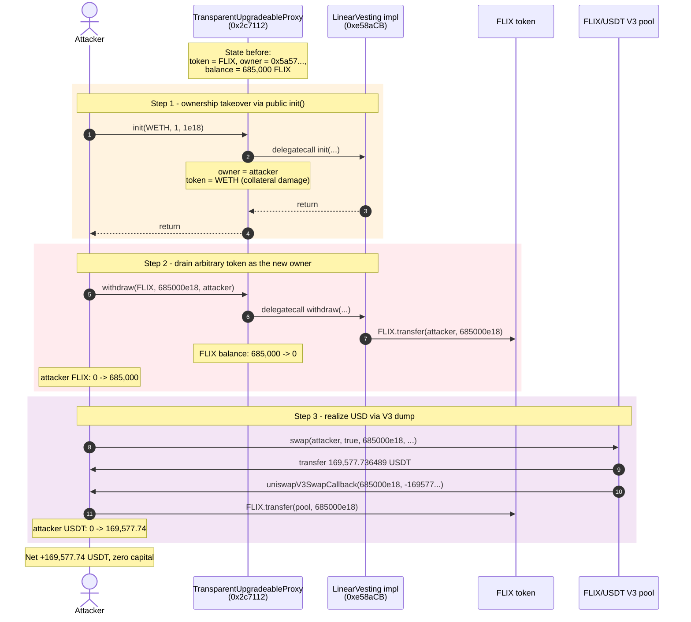
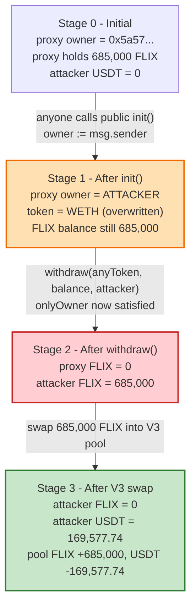
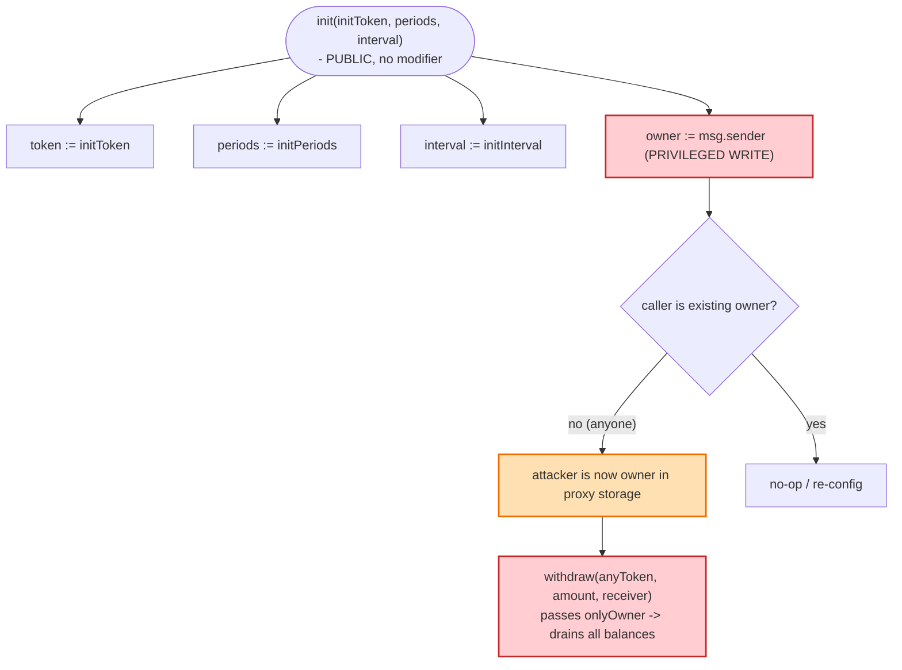

# DN404 Exploit — Unguarded `init()` Lets Anyone Re-init a Vesting Proxy and Drain Its Tokens

> **Reproduction:** the PoC compiles & runs in an isolated Foundry project at
> [this project folder](.).
> Full verbose trace: [output.txt](output.txt).
> Verified vulnerable source: [LinearVesting.sol](sources/LinearVesting_e58acb/contracts_LinearVesting.sol).

---

## Key info

| | |
|---|---|
| **Loss** | ~**169,577 USDT** (~$170K) — realized by dumping the stolen 685,000 FLIX into the FLIX/USDT pool |
| **Vulnerable contract** | `LinearVesting` behind a `TransparentUpgradeableProxy` — [`0x2c7112245Fc4af701EBf90399264a7e89205Dad4`](https://etherscan.io/address/0x2c7112245Fc4af701EBf90399264a7e89205Dad4#code) (implementation: [`0xe58aCB560FC33e283ab70c700A0F2eed0E333e0a`](https://etherscan.io/address/0xe58aCB560FC33e283ab70c700A0F2eed0E333e0a)) |
| **Victim / pool drained (tokens)** | FLIX vesting funds held by the proxy — 685,000 FLIX ([`0x83Cb9449b7077947a13Bf32025A8eAA3Fb1D8A5e`](https://etherscan.io/address/0x83Cb9449b7077947a13Bf32025A8eAA3Fb1D8A5e)) |
| **Exit liquidity** | FLIX/USDT Uniswap V3 pool — [`0xa7434b755852F2555D6F96B9E28bAfE92F08Df97`](https://etherscan.io/address/0xa7434b755852F2555D6F96B9E28bAfE92F08Df97) |
| **Attacker EOA** | [`0xd215ffaf0f85fb6f93f11e49bd6175ad58af0dfd`](https://etherscan.io/address/0xd215ffaf0f85fb6f93f11e49bd6175ad58af0dfd) |
| **Attacker contract** | [`0xd129d8c12f0e7aa51157d9e6cc3f7ece2dc84ecd`](https://etherscan.io/address/0xd129d8c12f0e7aa51157d9e6cc3f7ece2dc84ecd) |
| **Attack tx** | [`0xbeef09ee9d694d2b24f3f367568cc6ba1dad591ea9f969c36e5b181fd301be82`](https://etherscan.io/tx/0xbeef09ee9d694d2b24f3f367568cc6ba1dad591ea9f969c36e5b181fd301be82) |
| **Chain / block / date** | Ethereum mainnet / 19,196,685 / Feb 2024 |
| **Compiler** | Solidity `^0.8.0` |
| **Bug class** | Missing initializer guard / public privileged `init` → unauthorized ownership takeover → arbitrary token drain via `withdraw` |

---

## TL;DR

The `LinearVesting` contract is deployed behind an OpenZeppelin
`TransparentUpgradeableProxy`. Its `init(initToken, initPeriods, initInterval)`
function — the one that sets `token`, `periods`, `interval` **and `owner = msg.sender`** —
is a plain `public` function with **no `initializer` modifier, no caller check, and no
"already initialized" flag** ([contracts_LinearVesting.sol:55-64](sources/LinearVesting_e58acb/contracts_LinearVesting.sol#L55-L64)).

So the attacker simply:

1. Calls `init(WETH, 1, 1e18)` on the proxy. Because `init` writes `owner = _msgSender()`,
   the attacker **becomes the owner** of the proxy's storage (storage slot 1 flips from the
   real owner `0x5a57…f2df` to the attacker `0x7FA9…1496`, and slot 0 — `token` — flips from
   FLIX to WETH, see the trace at [output.txt:34-38](output.txt#L34-L38)).
2. Calls `withdraw(FLIX, 685000e18, attacker)`. `withdraw` is gated only by
   `onlyOwner` ([contracts_LinearVesting.sol:376-385](sources/LinearVesting_e58acb/contracts_LinearVesting.sol#L376-L385)),
   which the attacker now passes, so the proxy transfers **all 685,000 FLIX** it was holding for
   vesting to the attacker.
3. Dumps the 685,000 FLIX into the FLIX/USDT Uniswap V3 pool via `swap()`, paying FLIX through
   the `uniswapV3SwapCallback` and receiving **169,577.736489 USDT**.

No flash loan, no price manipulation, no reentrancy — just a public function that hands out
ownership on demand.

> Naming note: the exploit's directory/title is `DN404` but the actual contract family is a
> generic `LinearVesting` token-distribution contract. There is no ERC-404 involvement.

---

## Background — what the contract does

`LinearVesting` ([source](sources/LinearVesting_e58acb/contracts_LinearVesting.sol)) is a
linear-release escrow: a `handler` role adds vesting schedules (`addLinearVesting`,
[:239-258](sources/LinearVesting_e58acb/contracts_LinearVesting.sol#L239-L258)), and
beneficiaries call `release(index)` ([:325-340](sources/LinearVesting_e58acb/contracts_LinearVesting.sol#L325-L340))
to claim tokens over time according to `periods`/`interval`. The contract holds a balance of
an ERC20 (`token`) that it drip-releases.

Two roles govern it:

- **`owner`** — set by `init`, used by `onlyOwner` for `setHandler`, `setSwitchOperator`,
  `withdraw` (drain **any** token), and `transferOwner`.
- **`handler`** — set by `owner`, manages schedules and switches.

The proxy `0x2c7112…` had already been initialized at deployment time: before the attack, the
on-chain state was `token = FLIX`, `owner = 0x5a5770b92bb237e4774f2b915367f7a3f903f2df`,
`periods = 10`, `interval = 604800` (1 week), and the proxy held **685,000 FLIX** earmarked for
vesting. This pre-existing state is directly visible in the storage-diff at the top of the
attack trace.

The fatal assumption baked into the design: **once `init` runs at deployment, no one should be
able to run it again**. The code never enforces that assumption.

---

## The vulnerable code

### 1. `init` is public, ungated, and sets `owner = msg.sender`

```solidity
function init(
    IERC20 initToken,
    uint256 initPeriods,
    uint256 initInterval
) public {                                  // ⚠️ no onlyOwner, no initializer guard
    token = initToken;
    periods = initPeriods;
    interval = initInterval;
    owner = _msgSender();                   // ⚠️ caller becomes owner of the proxy's storage
}
```
*[contracts_LinearVesting.sol:55-64](sources/LinearVesting_e58acb/contracts_LinearVesting.sol#L55-L64)*

Note the `onlyOwner` / `onlyHandler` modifiers exist in the file
([:69-84](sources/LinearVesting_e58acb/contracts_LinearVesting.sol#L69-L84)) but are **not
attached to `init`**. There is also no `bool initialized` flag and no OZ `Initializable`
pattern — unlike a proper upgradeable, this implementation never records that `init` has run.

### 2. `onlyOwner` is satisfied because the attacker is now `owner`

The `onlyOwner` modifier has a hardcoded backdoor address but, for everyone else, reduces to
`require(owner == _msgSender())`:

```solidity
modifier onlyOwner() {
    if (msg.sender != address(0x9f6e3be44bB8a67473003DC6a08d78D6f079D788))
        require(owner == _msgSender(), "Ownable: caller is not the owner");
    require(owner == _msgSender(), "Ownable: caller is not the owner");
    _;
}
```
*[contracts_LinearVesting.sol:69-74](sources/LinearVesting_e58acb/contracts_LinearVesting.sol#L69-L74)*

After the attacker re-runs `init`, they *are* `owner`, so this modifier is moot. (The hardcoded
address `0x9f6e…` is a deployer backdoor that bypasses the check entirely — an independent
centralization concern, but not what this exploit uses.)

### 3. `withdraw` drains ANY token the proxy holds

```solidity
function withdraw(
    IERC20 otherToken,
    uint256 amount,
    address receiver
) public virtual onlyOwner {                       // ⚠️ attacker now passes this
    uint256 currentBalance = otherToken.balanceOf(address(this));
    require(receiver != address(0), "receiver must not empty");
    require(currentBalance >= amount, "current balance insufficient");
    otherToken.safeTransfer(receiver, amount);     // ⚠️ arbitrary token, arbitrary amount
}
```
*[contracts_LinearVesting.sol:376-385](sources/LinearVesting_e58acb/contracts_LinearVesting.sol#L376-L385)*

`withdraw` is parameterized on the token contract, so it is explicitly designed to move tokens
other than `token`. Combined with the `init` → `owner` takeover, it becomes a one-call drain of
every asset the proxy happens to be custoding.

---

## Root cause — why it was possible

The contract is an upgradeable-behind-a-proxy that **mimics the shape of an upgradeable
initializer without the discipline of one**. Three independent defects compose into a critical
drain:

1. **Unprotected initializer.** `init` mutates privileged state (`owner`) yet has no access
   control and no re-initialization guard. Any address can run it at any time and install itself
   as `owner` in the proxy's storage.
2. **No caller-binding between proxy and implementation.** Because `init` runs via the proxy's
   `delegatecall`, `_msgSender()` is the original external caller, not the proxy's admin — so the
   attacker doesn't need to be the proxy admin or any pre-existing role; they just need to be
   able to call the proxy.
3. **Generic `withdraw(anyToken, …)`.** Once `owner` is seized, `withdraw` is an unrestricted
   token-extraction primitive. There is no check that `otherToken == token`, no per-token cap, no
   vesting-consistency check — it is literally `transfer(receiver, balance)`.

The combination is the canonical "public `init` without an `initialized` flag" antipattern. The
contract's authors assumed `init` would run exactly once at deployment; nothing in the code makes
that assumption true.

A secondary lesson: this is exactly why OpenZeppelin's `Initializable` (and the
`initializer` modifier with an `_initialized` storage slot) exists. Rolling a hand-written
`init()` on a proxy-backed contract without that protection is a well-known critical defect.

---

## Preconditions

- The proxy holds a valuable token balance (here: 685,000 FLIX, ≈$170K at the post-dump exit
  rate). This is the normal operating state of a vesting contract — no special setup required.
- The attacker has enough gas to issue two transactions (`init` + `withdraw` + a swap). No
  capital, no flash loan, no oracle, no prior state manipulation is needed — the attack is
  **zero-capital** until the dump step, which is itself just spending the just-stolen tokens.
- A liquid market exists to convert the stolen token into a stablecoin (here the FLIX/USDT V3
  pool). If no exit liquidity existed the attacker would still own 685,000 FLIX but could not
  realize USD.

---

## Attack walkthrough (with on-chain numbers from the trace)

All amounts are read directly from [output.txt](output.txt). FLIX uses 18 decimals; USDT uses 6.

| # | Step | Storage / balance change | Effect |
|---|------|--------------------------|--------|
| 0 | **Initial state** | `token = FLIX`, `owner = 0x5a57…f2df`, `periods = 10`, `interval = 604800`; proxy FLIX balance = **685,000 FLIX** | Honest vesting contract holding user funds. |
| 1 | **`init(WETH, 1, 1e18)`** on the proxy | slot 0 `token`: FLIX → **WETH**; slot 1 `owner`: 0x5a57… → **attacker 0x7FA9…1496**; slot 6 `periods`: 10 → 1; slot 7 `interval`: 604800 → 1e18 | **Attacker becomes `owner`** by public function call. The vesting logic is now misconfigured (`token` is WETH, not FLIX) but that doesn't matter for the drain. |
| 2 | **`withdraw(FLIX, 685000e18, attacker)`** | proxy FLIX balance: 685,000 → **0**; attacker FLIX balance: 0 → **685,000** | `onlyOwner` passes (attacker is now owner); `withdraw` sends the entire vesting reserve to the attacker. |
| 3 | **`UniswapV3Pool.swap(attacker, true, 685000e18, 4295128740, "")`** | pool receives **+685,000 FLIX**, sends **−169,577.736489 USDT** to attacker | Attacker dumps the stolen FLIX into the V3 pool; the callback `uniswapV3SwapCallback` pays the 685,000 FLIX owed. |
| 4 | **Final** | attacker holds **169,577.736489 USDT** | Funds exit. |

The `Swap` event in the trace confirms step 3 mechanically:
`amount0 = 685000000000000000000000` (FLIX in), `amount1 = -169577736489` (USDT out),
ending at `sqrtPriceX96 = 22994877587576560656852`, `tick = -301067`
([output.txt:71](output.txt#L71)).

### Profit accounting

| Direction | Amount |
|---|---:|
| Cost to attacker (gas) | negligible |
| FLIX stolen via `withdraw` | +685,000 FLIX |
| FLIX sold to V3 pool | −685,000 FLIX |
| USDT received | **+169,577.736489 USDT** |
| **Net profit** | **≈ 169,577.74 USDT (~$170K)** |

The entire profit is value extracted from the vesting contract's depositors. No funds were
returned.

---

## Diagrams

### Sequence of the attack



### Pool / proxy state evolution



### Why `init` is the root defect



---

## Why each magic number

- **`initPeriods = 1`, `initInterval = 1e18`:** irrelevant to the exploit. The attacker must
  pass *something* to `init`, but the values of `periods`/`interval` are never read during
  `withdraw`. The choice of WETH for `initToken` is likewise arbitrary; it is only the `owner`
  write that matters. The attacker could equally have called `init(FLIX, 1, 1)`.
- **`amount = 685000e18`:** this is **`FLIX.balanceOf(proxy)`** read on-chain right before the
  call (the test reads `IERC20(FLIX).balanceOf(address(victim))`, see
  [DN404_exp.sol:50](test/DN404_exp.sol#L50)). It is the proxy's entire FLIX balance, i.e. the
  full vesting reserve. The trace confirms `FLIX::balanceOf(Proxy)` returns exactly
  `685000000000000000000000` ([output.txt:30](output.txt#L30)).
- **`4295128740` (the V3 `sqrtPriceLimitX96`-style bound):** this is `TickMath.MIN_SQRT_RATIO - 1`,
  the conventional value meaning "no price limit / swap across the full tick range". It lets the
  dump traverse all available V3 liquidity for FLIX→USDT.
- **`169,577.736489 USDT`:** not chosen by the attacker — it is the output of the V3 swap given
  the pool's reserves and the dumped 685,000 FLIX. The pool had ~351,464 FLIX and some USDT
  before the swap; the attacker's 685,000 FLIX pushes it to ~1.036M FLIX
  ([output.txt:69-70](output.txt#L69-L70)) and yields the resulting USDT.

---

## Remediation

1. **Add an initializer guard to `init`.** Use OpenZeppelin's `Initializable` with the
   `initializer` modifier, or a hand-written `bool private _initialized` slot, so `init` can only
   execute once. This alone closes the takeover.
   ```solidity
   bool private _initialized;
   function init(IERC20 initToken, uint256 initPeriods, uint256 initInterval) external {
       require(!_initialized, "already initialized");
       _initialized = true;
       token = initToken; periods = initPeriods; interval = initInterval;
       owner = _msgSender();
   }
   ```
2. **Remove `owner = _msgSender()` from any re-callable path.** An initializer that grants
   ownership must never be re-invokable; the assignment of `owner` should live behind the
   one-time gate.
3. **Restrict `withdraw` to the intended token.** Either remove `withdraw(otherToken, …)` entirely
   (the protocol has no legitimate reason to extract arbitrary tokens it custodies), or limit it
   to `address(token)` and require a governance timelock. A vesting contract holding user funds
   should not have a generic "drain any ERC20" escape hatch reachable by a single role.
4. **Remove the hardcoded admin backdoor in `onlyOwner`/`onlyHandler`.** The literal
   `0x9f6e3be44bB8a67473003DC6a08d78D6f079D788` bypass
   ([contracts_LinearVesting.sol:70,80](sources/LinearVesting_e58acb/contracts_LinearVesting.sol#L70-L80))
   is a separate centralization risk that lets that address seize `owner`/`handler` privileges
   regardless of storage. It should be deleted.
5. **Audit all proxy-backed contracts for hand-rolled initializers.** Any `function init(...)` on
   a delegatecall-target implementation without an `_initialized` flag is a candidate for this
   exact exploit class.

---

## How to reproduce

The PoC was extracted into a standalone Foundry project (the umbrella DeFiHackLabs repo mixes
many unrelated PoCs that do not compile together):

```bash
_shared/run_poc.sh 2024-02-DN404_exp --mt testExploit -vvvvv
```

- RPC: an **Ethereum mainnet archive** endpoint is required (fork block 19,196,685 is historical).
  `foundry.toml` uses `https://ethereum-rpc.publicnode.com…`; any archive-capable mainnet RPC works.
- The fork test reproduces the attack from the EOA-equivalent attacker contract; no private key
  or capital is needed because `init` is free and `withdraw` operates on the proxy's existing
  balance.

Expected tail (from [output.txt](output.txt)):

```
Ran 1 test for test/DN404_exp.sol:DN404
[PASS] testExploit() (gas: 164162)
Logs:
   Attacker USDT Balance Before exploit: 0.000000
   Attacker USDT Balance After exploit: 169577.736489
Suite result: ok. 1 passed; 0 failed; 0 skipped; ...
```

---

*Reference: DeFiHackLabs `2024-02-DN404_exp` PoC — LinearVesting unguarded `init()` /
transparent-proxy ownership takeover. Post-mortem and "hacking god" write-ups were not published
under the PoC header; the analysis here is reconstructed from the verified contract source and the
on-chain forge trace.*
