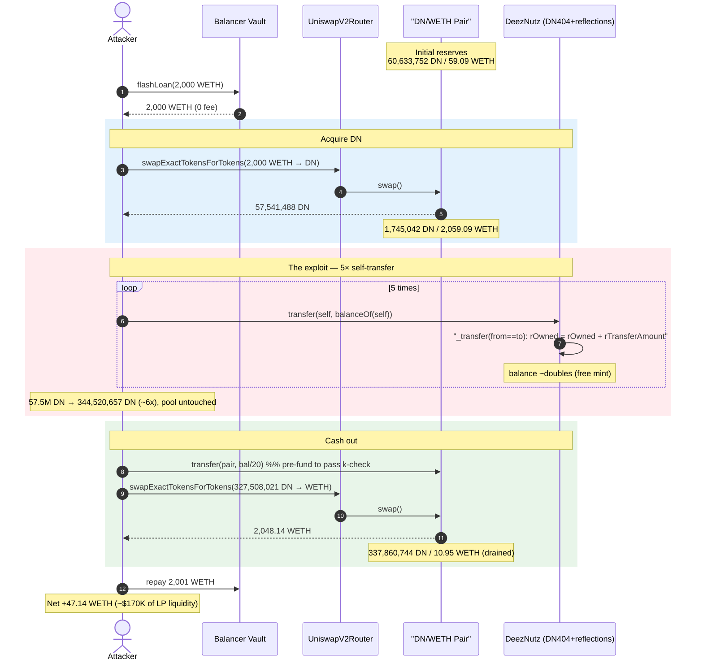
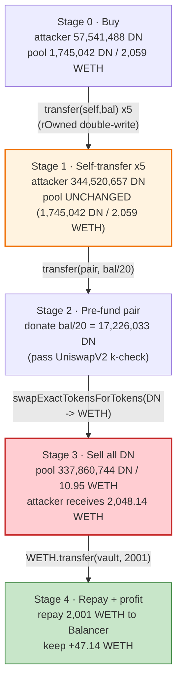
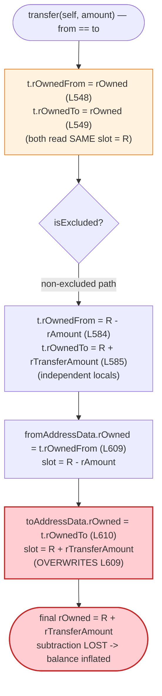
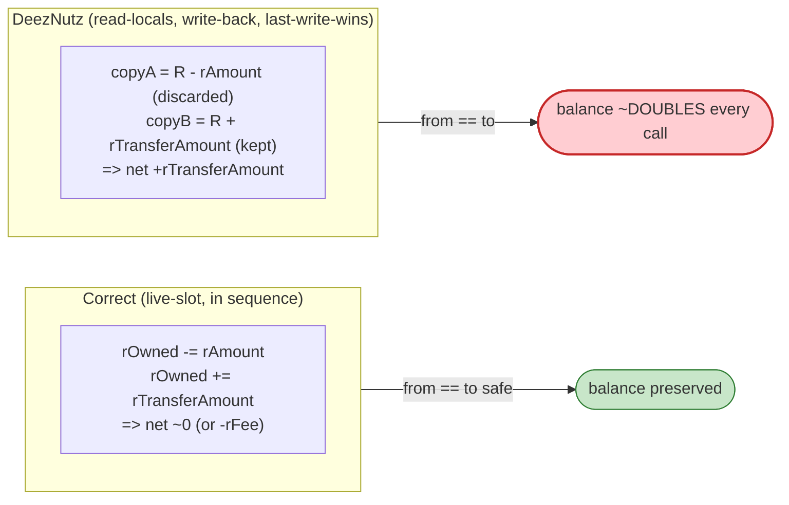

# DeezNutz (DN404) Exploit — Self-Transfer Balance Inflation in a Reflection-Fork of DN404

> **Vulnerability classes:** vuln/logic/state-update · vuln/arithmetic/precision-loss

> **Reproduction:** the PoC compiles & runs in an isolated Foundry project at
> [this project folder](.) (the umbrella DeFiHackLabs repo contains many unrelated
> PoCs that do not compile together, so this one is extracted).
> Full verbose trace: [output.txt](output.txt).
> Verified vulnerable source: [contracts_DN404Reflect.sol](sources/DeezNutz_b57E87/contracts_DN404Reflect.sol),
> [contracts_DeezNutz.sol](sources/DeezNutz_b57E87/contracts_DeezNutz.sol).

---

## Key info

| | |
|---|---|
| **Loss** | ~$170K — **47.14 WETH** of genuine pool liquidity drained |
| **Vulnerable contract** | `DeezNutz` (`$DN`) — [`0xb57E874082417b66877429481473CF9FCd8e0b8a`](https://etherscan.io/address/0xb57e874082417b66877429481473cf9fcd8e0b8a#code) |
| **Victim pool** | DN/WETH UniswapV2 pair — [`0x1fB4904b26DE8C043959201A63b4b23C414251E2`](https://etherscan.io/address/0x1fB4904b26DE8C043959201A63b4b23C414251E2) |
| **Attacker EOA** | [`0xd215fFAF0F85FB6f93f11E49Bd6175ad58af0DfD`](https://etherscan.io/address/0xd215ffaf0f85fb6f93f11e49bd6175ad58af0dfd) |
| **Attacker contract** | [`0xd129D8C12f0E7Aa51157D9E6cC3f7eCe2dc84ECd`](https://etherscan.io/address/0xd129d8c12f0e7aa51157d9e6cc3f7ece2dc84ecd) |
| **Attack tx** | [`0xbeefd8faba2aa82704afe821fd41b670319203dd9090f7af8affdf6bcfec2d61`](https://etherscan.io/tx/0xbeefd8faba2aa82704afe821fd41b670319203dd9090f7af8affdf6bcfec2d61) |
| **Chain / block / date** | Ethereum mainnet / fork block 19,277,802 / ~Feb 24, 2024 |
| **Funding** | 2,000 WETH flash loan from Balancer Vault (0-fee) |
| **Compiler** | `DeezNutz` Solidity v0.8.20 (optimizer, 100 runs); pair v0.5.16 |
| **Bug class** | Self-transfer accounting bug — aliased `from`/`to` storage write inflates balance |

---

## TL;DR

`DeezNutz` is a fork of Vectorized's **DN404** (hybrid ERC-20/ERC-721) that bolts a SafeMoon-style
**reflection** accounting layer on top. The reflection layer rewrites the core `_transfer` so that
each account's balance is derived from a reflected-units field `rOwned`
([contracts_DN404Reflect.sol:258-264](sources/DeezNutz_b57E87/contracts_DN404Reflect.sol#L258-L264)).

The rewritten `_transfer`
([:533-684](sources/DeezNutz_b57E87/contracts_DN404Reflect.sol#L533-L684)) caches the sender's and
recipient's `rOwned` into two **separate local copies** at the top of the function
([:548-549](sources/DeezNutz_b57E87/contracts_DN404Reflect.sol#L548-L549)), mutates them as if they
referred to two distinct accounts, then writes **both** copies back to storage
([:609-610](sources/DeezNutz_b57E87/contracts_DN404Reflect.sol#L609-L610)). When `from == to`
(a **self-transfer**), both copies alias the same storage slot. The function subtracts `rAmount`
into `rOwnedFrom` and adds `rTransferAmount` into `rOwnedTo`, then the `toAddressData.rOwned` write
**clobbers** the `fromAddressData.rOwned` write — so the subtraction is silently discarded and the
account is left with `rOwned + rTransferAmount`. **A self-transfer mints the transferred amount out
of thin air.**

The attacker:

1. Flash-borrows **2,000 WETH** from Balancer (0 fee) and buys **57,541,488 DN** from the pool.
2. Calls `DeezNutz.transfer(self, fullBalance)` **5 times**. Each self-transfer roughly **doubles**
   the reported balance, compounding **57.5M → 344.5M DN** (~6×) for free.
3. Sells the inflated DN back into the same pool, pulling **2,048.14 WETH** out (sending a small
   slice straight to the pair first "to pass the k-value test").
4. Repays the 2,000 WETH loan and walks off with **47.14 WETH** of the LPs' real liquidity.

---

## Background — what DeezNutz is

`DeezNutz` ([source](sources/DeezNutz_b57E87/contracts_DeezNutz.sol)) advertises itself as
*"a DN404 fork that adds fractionalized yield"*. Concretely it is **DN404 + reflections**:

- **DN404 base.** DN404 is a hybrid token: an ERC-20 balance whose whole-token portion is mirrored as
  ERC-721 NFTs. The canonical DN404 tracks balances as a plain `uint96 balance` field. DeezNutz keeps
  that `balance` field for NFT mint/burn bookkeeping but makes it **derived**, not authoritative.
- **Reflection layer (the fork's addition).** Balances are stored as reflected units `rOwned`
  ([:117](sources/DeezNutz_b57E87/contracts_DN404Reflect.sol#L117)) and converted to token amounts
  on read by dividing by a global rate `rTotal / tTotal`
  ([`tokenFromReflection`, :384-393](sources/DeezNutz_b57E87/contracts_DN404Reflect.sol#L384-L393)).
  As "fees" accrue, `rTotal` shrinks, the rate falls, and every holder's `balanceOf` rises — classic
  SafeMoon reflections. `taxFee` was **0** at the fork block, so no fee actually fired during the
  attack; the rate still drifts because the math is approximate.
- **Trading gate.** `transfer`/`transferFrom` revert for non-owners until the owner calls
  `enableTrading()` ([contracts_DeezNutz.sol:109-111, 228-230](sources/DeezNutz_b57E87/contracts_DeezNutz.sol#L109-L111)).
  At the fork block trading was already live, so this was no obstacle.

The critical design point: **DeezNutz replaced DN404's clean single-field balance update with a
two-field reflection update copied from a vanilla ERC-20 reflection token — but DN404's `_transfer`
must also support `from == to` self-transfers** (the base contract explicitly handles that case at
[:624-625](sources/DeezNutz_b57E87/contracts_DN404Reflect.sol#L624-L625) for NFT bookkeeping). The
reflection rewrite did not preserve self-transfer safety.

---

## The vulnerable code

### 1. Balances are stored as `rOwned` and read back via a rate

```solidity
// contracts_DN404Reflect.sol
function balanceOf(address owner) public view virtual returns (uint256) {
    AddressData storage ownerAddressData = _getDN404Storage().addressData[owner];
    if (ownerAddressData.isExcluded) return ownerAddressData.tOwned;
    return tokenFromReflection(ownerAddressData.rOwned);   // rOwned / rate
}
```

### 2. `_transfer` caches `rOwned` into two copies, mutates them, and writes BOTH back

```solidity
function _transfer(address from, address to, uint256 amount) internal virtual {
    ...
    AddressData storage fromAddressData = _addressData(from);
    AddressData storage toAddressData   = _addressData(to);

    _TransferTemps memory t;
    ...
    t.rOwnedFrom = fromAddressData.rOwned;   // L548  — for a self-transfer these two
    t.rOwnedTo   = toAddressData.rOwned;     // L549  — read the SAME slot → equal values
    ...
    unchecked {
        (uint256 rAmount, uint256 rTransferAmount, ... ) = _getValues(amount);
        ...
        // Transfer between non-excluded addresses (the path taken here):
        else if (!fromAddressData.isExcluded && !toAddressData.isExcluded) {
            t.rOwnedFrom = t.rOwnedFrom - rAmount;          // L584
            t.rOwnedTo   = t.rOwnedTo   + rTransferAmount;  // L585
            ...
        }
        ...
        // Update address data rOwned and tOwned
        fromAddressData.rOwned = t.rOwnedFrom;   // L609  — written first
        toAddressData.rOwned   = t.rOwnedTo;     // L610  — when from==to, OVERWRITES L609
        ...
    }
    emit Transfer(from, to, amount);
}
```

Source: [contracts_DN404Reflect.sol:533-684](sources/DeezNutz_b57E87/contracts_DN404Reflect.sol#L533-L684),
key lines [548-549](sources/DeezNutz_b57E87/contracts_DN404Reflect.sol#L548-L549),
[583-589](sources/DeezNutz_b57E87/contracts_DN404Reflect.sol#L583-L589),
[609-610](sources/DeezNutz_b57E87/contracts_DN404Reflect.sol#L609-L610).

### 3. The public `transfer` allows `to == msg.sender`

```solidity
// contracts_DeezNutz.sol
function transfer(address to, uint256 amount) public override returns (bool) {
    if (!tradingEnabled) {
        require(msg.sender == owner(), "Trading is not enabled");
    }
    _transfer(msg.sender, to, amount);   // no check that to != msg.sender
    return true;
}
```

Source: [contracts_DeezNutz.sol:105-114](sources/DeezNutz_b57E87/contracts_DeezNutz.sol#L105-L114).

---

## Root cause — why it was possible

A correct reflection-token `_transfer` updates each account exactly once: `rOwned[from] -= rAmount;
rOwned[to] += rTransferAmount;`. That is safe even when `from == to`, because the two read-modify-write
operations target the **same live storage slot in sequence** — the net change is
`-rAmount + rTransferAmount`, i.e. `≈ 0` (or `-rFee` when a fee applies).

DeezNutz instead does a **read-into-locals / mutate-locals / write-back-locals** pattern. For
`from == to`:

> 1. `t.rOwnedFrom` and `t.rOwnedTo` are **both** seeded with the *same* starting `rOwned = R`
>    (lines 548-549).
> 2. The non-excluded branch sets `t.rOwnedFrom = R − rAmount` and `t.rOwnedTo = R + rTransferAmount`
>    (lines 584-585). These are **independent** locals; the second does not see the first's subtraction.
> 3. The write-back does `rOwned = t.rOwnedFrom` (line 609) and then `rOwned = t.rOwnedTo` (line 610).
>    The **last write wins**, so the final stored value is `R + rTransferAmount` — the subtraction is
>    lost.

Net effect of one self-transfer: `rOwned` grows by `rTransferAmount = rAmount − rFee`. With `taxFee = 0`,
`rTransferAmount = rAmount = amount × rate`, so the account's *token* balance grows by `amount` — and
because the attacker passes `amount = balanceOf(self)`, **each self-transfer roughly doubles the
balance.** No tokens are pulled from anywhere; `totalSupply` (`$.totalSupply`, the DN404 field) is not
even touched on this path — only `rOwned` is corrupted, and `balanceOf` reads from `rOwned`.

Four facts compose into the exploit:

1. **Aliased storage writes.** `from == to` makes the two `rOwned` write-backs target one slot, and the
   read-into-locals pattern means the second clobbers the first instead of accumulating on it.
2. **`balanceOf` trusts `rOwned`.** The corrupted field is exactly the one `balanceOf` (and therefore
   Uniswap, when it computes swap output from token balances) reads.
3. **`transfer` permits self as recipient.** There is no `require(to != msg.sender)` and no DN404
   "same owner, no-op" fast-path in the reflection branch.
4. **An AMM monetizes the fake balance instantly.** Uniswap will pay real WETH for the inflated DN, so
   the attacker converts the minted-from-nothing tokens into the pool's genuine reserves.

The reflection rate (`rTotal/tTotal`) drifts as the attacker's `rOwned` balloons toward `rTotal`,
which is why the per-step growth in the trace is ~1.98× rather than exactly 2× and why one step even
appears to dip — but the direction is unambiguous: **balance is created for free** until the attacker
chooses to dump it.

---

## Preconditions

- **Trading enabled.** At the fork block `tradingEnabled` was already true, so anyone could call
  `transfer`. (Even if it were not, the bug is intrinsic and would trigger the moment trading opened.)
- **A liquid DN/WETH pool** to convert the inflated balance into real assets — present here with
  ~60.6M DN / ~59.1 WETH at fork.
- **`taxFee == 0`** (true here) maximizes the inflation per self-transfer (`rTransferAmount = rAmount`);
  a non-zero fee would only slow the doubling, not stop it.
- **Working capital** to seed the initial DN position. Supplied by a **2,000 WETH Balancer flash loan
  at 0 fee** ([output.txt:30-40](output.txt)); fully repaid intra-transaction, so the attack is
  effectively capital-free.

---

## Attack walkthrough (with on-chain numbers from the trace)

The pair's `token0 = DN`, `token1 = WETH`, so `reserve0 = DN`, `reserve1 = WETH`. All figures are
taken directly from `getReserves`, `Sync`, and `balanceOf` results in
[output.txt](output.txt). Amounts shown in whole tokens (÷1e18).

| # | Step | Attacker DN balance | Pool DN reserve | Pool WETH reserve | Effect |
|---|------|--------------------:|----------------:|------------------:|--------|
| 0 | **Flash-borrow** 2,000 WETH from Balancer | 0 | 60,633,752 | 59.09 | Capital acquired (0 fee). |
| 1 | **Buy DN** — swap 2,000 WETH → DN ([:52-86](output.txt)) | **57,541,488** | 1,745,042 | 2,059.09 | Attacker holds 57.5M DN; pool DN down ~97%. |
| 2 | **Self-transfer #1** `transfer(self, bal)` ([:92-106](output.txt)) | **113,886,170** | 1,745,042 | 2,059.09 | Balance ≈2×. Pool untouched. |
| 3 | **Self-transfer #2** ([:109-123](output.txt)) | **225,874,083** | 1,745,042 | 2,059.09 | ≈2× again. |
| 4 | **Self-transfer #3** ([:126-140](output.txt)) | **449,849,450** | 1,745,042 | 2,059.09 | ≈2× again. |
| 5 | **Self-transfer #4** ([:143-157](output.txt)) | 173,325,537 | 1,745,042 | 2,059.09 | Rate drift makes this step's reported number dip (rOwned still grew). |
| 6 | **Self-transfer #5** ([:160-174](output.txt)) | **344,520,657** | 1,745,042 | 2,059.09 | Final inflated balance ≈ 6× the bought amount. |
| 7 | **Seed pair** — `transfer(pair, bal/20)` = 17,226,033 DN ([:182-196](output.txt)) | 327,508,021 | 18,540,424¹ | 2,059.09 | "to pass the k value test" (PoC L60). |
| 8 | **Sell all DN** — swap 327,508,021 DN → WETH ([:199-233](output.txt)) | 0 | 337,860,744 | **10.95** | Pulls **2,048.14 WETH** out of the pool. |
| 9 | **Repay** 2,001 WETH to Balancer ([:237-242](output.txt)) | — | — | — | Loan + buffer repaid. |
| 10 | **Profit** | — | — | — | **47.14 WETH** retained ([:255-257](output.txt)). |

¹ Pool DN reserve after the direct `transfer(pair, …)` donation, read at [output.txt:206](output.txt).

**Why the self-transfer "doubles" the balance.** With `taxFee = 0`, one self-transfer leaves
`rOwned ← rOwned + rTransferAmount` where `rTransferAmount = amount × rate` and `amount = balanceOf(self)
= rOwned / rate`. Substituting, `rOwned_new = rOwned + (rOwned/rate)×rate = 2·rOwned`. The reported
balance moves by the same factor, perturbed only by the global rate sliding as `rOwned` approaches
`rTotal` (the `_getCurrentSupply` guard at
[:1276](sources/DeezNutz_b57E87/contracts_DN404Reflect.sol#L1276) resets the rate when the attacker's
share gets too large, producing the non-monotone step 5).

**Why "pass the k value test" (step 7).** The PoC donates `bal/20` DN straight to the pair before the
final swap (PoC [DeezNutz404_exp.sol:60](test/DeezNutz404_exp.sol#L60)). UniswapV2 enforces
`x·y ≥ k` only inside `swap()` using its *synced* reserves; pre-funding the pair with extra DN raises
the effective input so the router's single `swapExactTokensForTokens` clears the invariant check while
still draining the WETH side.

### Profit accounting (WETH)

| Direction | Amount |
|---|---:|
| Borrowed (Balancer flash loan) | 2,000.00 |
| Spent — buy DN (step 1) | 2,000.00 |
| Received — sell inflated DN (step 8) | **2,048.14** |
| Repaid to Balancer (step 9) | 2,001.00 |
| **Net profit** | **+47.14** |

The 2,000 WETH spent to buy DN is the same 2,000 WETH received back from selling the *legitimately
bought* portion; the extra **47.14 WETH** is pure extraction enabled by the ~287M DN that the
self-transfer bug minted for free. At ~$3,600/ETH (Feb 2024) that is **≈ $170K**, matching the
PoC header's `Total Lost : ~170K USD$` ([test/DeezNutz404_exp.sol:6](test/DeezNutz404_exp.sol#L6)).

---

## Diagrams

### Sequence of the attack



### Balance inflation vs. pool drain



### The flaw inside `_transfer` when `from == to`



### Correct vs. broken self-transfer



---

## Remediation

1. **Update a single live storage field, never two aliased local copies.** Mutate
   `fromAddressData.rOwned` and `toAddressData.rOwned` **directly** so that, when `from == to`, the
   second update sees the first:
   ```solidity
   fromAddressData.rOwned -= rAmount;
   toAddressData.rOwned   += rTransferAmount;   // if from==to, reads the just-decremented value
   ```
   This removes the read-into-locals / last-write-wins hazard entirely.
2. **Add an explicit self-transfer guard / fast-path.** At minimum,
   `if (from == to) { /* no-op or fee-only path */ return; }`, or `require(to != from)` if
   self-transfers are not a product requirement. Canonical DN404 already special-cases `from == to`
   for NFT bookkeeping ([:624-625](sources/DeezNutz_b57E87/contracts_DN404Reflect.sol#L624-L625)); the
   reflection branch must do the same for the *balance* update.
3. **Keep one authoritative balance source.** Forking DN404 (single `uint96 balance`) and then layering
   a second balance model (`rOwned`/rate) created two sources of truth that the rewritten `_transfer`
   failed to keep consistent. Either keep DN404's balance authoritative and apply reflections as a view
   transformation, or fully replace it — do not maintain both with hand-written dual writes.
4. **Add an invariant test for conservation.** A property test asserting that
   `sum(balanceOf) == totalSupply` and that `balanceOf(x)` is non-increasing across
   `transfer(x, x, amount)` would have caught this before deployment.
5. **Audit forks, don't trust the parent's safety.** DN404's safety properties do not survive being
   re-plumbed through a different accounting model; treat a fork's modified core paths as new code.

---

## How to reproduce

The PoC was extracted into a standalone Foundry project (the umbrella DeFiHackLabs repo has many
unrelated PoCs that fail to compile together under a single `forge test`):

```bash
_shared/run_poc.sh 2024-02-DeezNutz404_exp -vvvvv
```

- RPC: a **mainnet archive** endpoint is required (fork block 19,277,802). `foundry.toml` is configured
  with a `mainnet` alias; most pruned public RPCs will fail with `header not found` / `missing trie node`.
- Result: `[PASS] testExploit()` with `after attack, WETH amount: 47`.

Expected tail (see [output.txt](output.txt)):

```
  after swap, DeezNutz amount: 57541487
  after self transfer, DeezNutz amount: 113886170
  after self transfer, DeezNutz amount: 225874083
  after self transfer, DeezNutz amount: 449849449
  after self transfer, DeezNutz amount: 173325537
  after self transfer, DeezNutz amount: 344520656
  after swap back, WETH amount: 2048
  ------------------- flashloan finish ----------------
  after attack, WETH amount: 47

Suite result: ok. 1 passed; 0 failed; 0 skipped
```

---

*References: ImmuneBytes analysis — https://twitter.com/ImmuneBytes/status/1664239580210495489 ·
SlowMist Hacked — https://hacked.slowmist.io/ (DeezNutz / DN404, ~$170K).*
