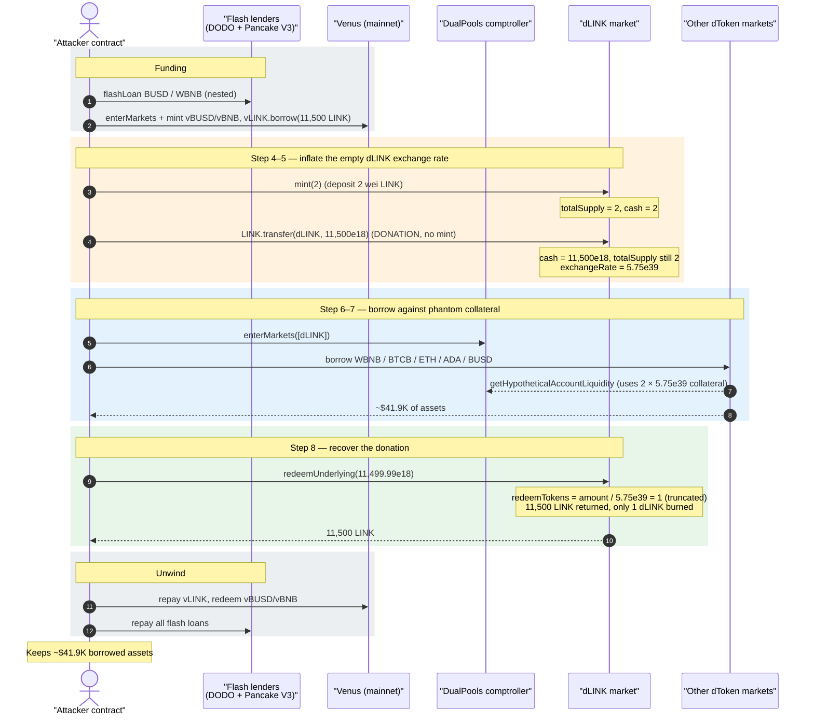
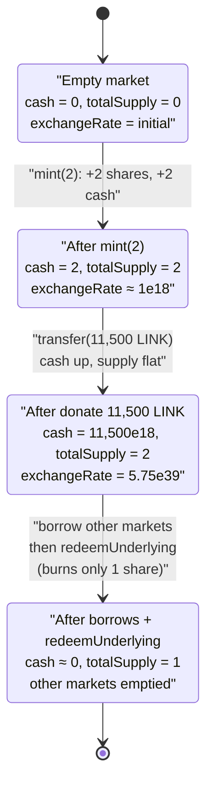
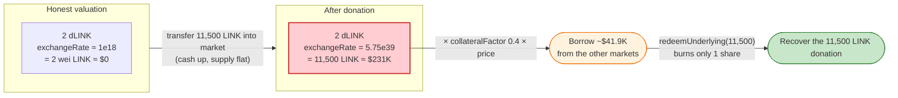

# DualPools Exploit — Donation-Inflated Exchange Rate Lets 2 wei of dLINK Borrow the Whole Pool

> **Reproduction:** the PoC compiles & runs in an isolated Foundry project at
> [this project folder](.) (the umbrella DeFiHackLabs repo contains many
> unrelated PoCs that do not whole-compile under `forge test`, so this one was
> extracted). Full verbose trace: [output.txt](output.txt).
> Verified vulnerable source: the dLINK money-market —
> [`dBep20Delegator`](sources/dBep20Delegator_8fBCC8/dBep20Delegator.sol)
> (proxy `0x8fBCC8…`, implementation `0xfffed596…`), whose
> `exchangeRateStoredInternal()` lives in the shared `VToken.sol`.

---

## Key info

| | |
|---|---|
| **Loss** | **~$41,893** — assets borrowed across 5 DualPools markets (50.07 WBNB, 0.1716 BTCB, 3.99 ETH, 6,378.8 ADA, 911.6 BUSD) against worthless collateral |
| **Vulnerable contract** | DualPools `dLINK` money-market — [`0x8fBCC81E5983d8347495468122c65E2Dc274eed9`](https://bscscan.com/address/0x8fBCC81E5983d8347495468122c65E2Dc274eed9#code) (proxy; impl `0xfFFed596EdCc9C557f67222C9AfF0FD1a27c5b66`) |
| **Victim protocol** | DualPools (Venus/Compound fork) — comptroller `Dualpools` [`0x5E5e28029eF37fC97ffb763C4aC1F532bbD4C7A2`](https://bscscan.com/address/0x5E5e28029eF37fC97ffb763C4aC1F532bbD4C7A2#code) |
| **Attacker EOA** | [`0x4645863205b47a0a3344684489e8c446a437d66c`](https://bscscan.com/address/0x4645863205b47a0a3344684489e8c446a437d66c) |
| **Attacker contract** | [`0x38721b0d67dfdba1411bb277d95af3d53fa7200e`](https://bscscan.com/address/0x38721b0d67dfdba1411bb277d95af3d53fa7200e) |
| **Attack tx** | [`0x90f374ca33fbd5aaa0d01f5fcf5dee4c7af49a98dc56b47459d8b7ad52ef1e93`](https://bscscan.com/tx/0x90f374ca33fbd5aaa0d01f5fcf5dee4c7af49a98dc56b47459d8b7ad52ef1e93) |
| **Chain / block / date** | BSC / fork at 36,145,771 (`36_145_772 - 1`) / Feb 2024 |
| **Compiler** | Solidity v0.5.16+commit.9c3226ce, optimizer enabled (1, runs 180) |
| **Bug class** | First-depositor / donation exchange-rate inflation in a Compound-fork lending market (collateral over-valuation → under-collateralized borrow + same-block redeem) |
| **Analysis ref** | [Lunaray write-up](https://lunaray.medium.com/dualpools-hack-analysis-5209233801fa) |

---

## TL;DR

DualPools is a Venus/Compound fork. Each money-market token (`dLINK`, `dWBNB`,
…) prices its own shares with the classic Compound formula
`exchangeRate = (cash + totalBorrows − totalReserves) / totalSupply`, where
`cash` is **the raw ERC20 balance of the market contract**
([`getCashPrior`](sources/dBep20Delegator_8fBCC8/dBep20Delegator.sol),
consumed by `getExchangeCash()` → `exchangeRateStoredInternal()` in
[`VToken.sol`](sources/dBep20Delegator_8fBCC8/dBep20Delegator.sol)).

The `dLINK` market was **empty** (`LINK.balanceOf(dLINK) == 0`,
`totalSupply == 0`). The attacker:

1. **Minted 2 wei** of dLINK by depositing 2 wei of LINK → `totalSupply = 2`.
2. **Donated 11,500 LINK directly** to the dLINK contract with a plain
   `transfer` (not a `mint`). This raised `cash` to `11,500e18` while
   `totalSupply` stayed at **2**.
3. The exchange rate therefore became
   `11,500e18 · 1e18 / 2 = 5.75e39` (confirmed in the trace: `getAccountSnapshot`
   returns mantissa `5750000000000000000000000000000000000000`). The comptroller
   now valued the attacker's **2 dLINK** at `2 × 5.75e39 = 1.15e40` underlying
   units = the full 11,500 LINK ≈ **$231K of collateral**.
4. Against this phantom collateral the attacker **borrowed every other DualPools
   market dry** — 50.07 WBNB, 0.1716 BTCB, 3.99 ETH, 6,378.8 ADA, 911.6 BUSD
   (~$41.9K total).
5. **Redeemed the 11,500 LINK back out** with `redeemUnderlying(11,499.99…898)`.
   Because `redeemTokens = redeemAmount / exchangeRate = 11,500e18 / 5.75e39 = 1`
   (integer-truncated), this redeem **burned only 1 dLINK** and returned all
   11,500 LINK. The attacker keeps the borrowed assets *and* recovers the
   donated LINK.

The whole thing is funded by flash loans (DODO DPP pools + a PancakeSwap-V3
flash), so the attacker risks ~zero capital. Net theft = the ~$41.9K of borrowed
assets.

---

## Background — DualPools as a Compound fork

DualPools deploys two comptrollers; the in-scope one is `Dualpools`
([`0x5E5e2802…`](https://bscscan.com/address/0x5E5e28029eF37fC97ffb763C4aC1F532bbD4C7A2#code)),
a Venus/Compound-style controller with markets `dLINK`, `dWBNB`, `dBTCB`,
`dETH`, `dADA`, `dBUSD`. Each market is a `dBep20Delegator` proxy delegating to a
shared implementation; the lending math (mint/redeem/borrow, exchange rate,
account snapshots) is in `VToken.sol`.

Two facts about the fork matter for this exploit:

- **Cash = raw ERC20 balance.** `getCashPrior()` returns
  `EIP20Interface(underlying).balanceOf(address(this))`. DualPools wraps this in
  `getExchangeCash()`:

  ```solidity
  function getExchangeCash() public view returns(uint cashPlusUSDMinusLoss) {
      cashPlusUSDMinusLoss = tradeModel.cashAddUSDMinusLoss(iUSDbalance, getCashPrior(), getPriceToken());
  }
  ```
  ([VToken.sol in the dLINK bundle](sources/dBep20Delegator_8fBCC8/dBep20Delegator.sol)).
  For the dLINK market `iUSDbalance == 0`, so `getExchangeCash()` is exactly the
  raw LINK balance. The trace confirms it: `cashAddUSDMinusLoss(0, 11500e18, price)`
  is called immediately after `LINK::balanceOf(dLINK) → 11,500e18`.

- **Exchange rate divides by `totalSupply`.** When `totalSupply > 0`:

  ```solidity
  function exchangeRateStoredInternal() internal view returns (MathError, uint) {
      uint _totalSupply = totalSupply;
      if (_totalSupply == 0) {
          return (MathError.NO_ERROR, initialExchangeRateMantissa);
      } else {
          uint totalCash = getExchangeCash();
          (mathErr, cashPlusBorrowsMinusReserves) = addThenSubUInt(totalCash, totalBorrows, totalReserves);
          (mathErr, exchangeRate) = getExp(cashPlusBorrowsMinusReserves, _totalSupply); // cash * 1e18 / totalSupply
          return (MathError.NO_ERROR, exchangeRate.mantissa);
      }
  }
  ```

The collateral the comptroller credits an account is
`accountTokens × exchangeRate × collateralFactor × price`. With `accountTokens = 2`
and an exchange rate the attacker can set arbitrarily high by donating
underlying, the collateral is whatever the attacker wants.

The relevant live parameters at the fork block (read from the trace):

| Parameter | Value |
|---|---|
| `LINK.balanceOf(dLINK)` before attack | **0** (empty market) |
| dLINK `collateralFactor` | `0.4e18` (40%) — `Dualpools.markets(dLINK)` → `(true, 4e17, false)` |
| LINK oracle price | `20.136523e18` USD |
| dLINK exchange rate after donation | **`5.75e39`** |
| Attacker dLINK balance | **2** (minted), 1 left after redeem |

---

## The vulnerable code

### 1. Exchange rate is fully controlled by the contract's token balance

[`VToken.sol` → `exchangeRateStoredInternal()`](sources/dBep20Delegator_8fBCC8/dBep20Delegator.sol):

```solidity
uint totalCash = getExchangeCash();            // == LINK.balanceOf(dLINK) for dLINK
(mathErr, cashPlusBorrowsMinusReserves) = addThenSubUInt(totalCash, totalBorrows, totalReserves);
(mathErr, exchangeRate) = getExp(cashPlusBorrowsMinusReserves, _totalSupply);
//                                  └─ exchangeRate = totalCash * 1e18 / totalSupply
```

`getCashPrior()` is the raw ERC20 balance — so **a direct token transfer to the
market (a "donation") raises `totalCash` without minting any shares**. When
`totalSupply` is tiny (here, 2), the exchange rate explodes.

### 2. The account snapshot the comptroller trusts uses that exchange rate verbatim

[`VToken.sol` → `getAccountSnapshot()`](sources/dBep20Delegator_8fBCC8/dBep20Delegator.sol):

```solidity
function getAccountSnapshot(address account) external view returns (uint, uint, uint, uint) {
    uint vTokenBalance = accountTokens[account];                  // = 2
    ...
    (mErr, exchangeRateMantissa) = exchangeRateStoredInternal();  // = 5.75e39
    return (uint(Error.NO_ERROR), vTokenBalance, borrowBalance, exchangeRateMantissa);
}
```

The comptroller's `getHypotheticalAccountLiquidity()` multiplies
`vTokenBalance · exchangeRate · collateralFactor · price` → the 2 wei of dLINK
backs a borrow of the entire 11,500-LINK donation's worth of collateral.

### 3. Redeem burns shares = `amount / exchangeRate`, which truncates to 1

[`VToken.sol` → `redeemFresh()`](sources/dBep20Delegator_8fBCC8/dBep20Delegator.sol):

```solidity
(vars.mathErr, vars.exchangeRateMantissa) = exchangeRateStoredInternal();  // 5.75e39
// redeemTokens = redeemAmountIn / exchangeRate
(vars.mathErr, vars.redeemTokens) = divScalarByExpTruncate(redeemAmountIn, Exp({mantissa: vars.exchangeRateMantissa}));
vars.redeemAmount = redeemAmountIn;
...
(vars.mathErr, vars.totalSupplyNew)  = subUInt(totalSupply, vars.redeemTokens);
(vars.mathErr, vars.accountTokensNew) = subUInt(accountTokens[redeemer], vars.redeemTokens);
```

`redeemUnderlying(11,499.99…898 LINK)` → `redeemTokens = 11,499.99e18 / 5.75e39 = 1`
(integer truncation). So the attacker pulls 11,500 LINK back out for the price of
**1 dLINK share**, leaving them with 1 dLINK still on deposit. The trace shows
`redeemAllowed(dLINK, attacker, 1)` and `redeemVerify(dLINK, attacker, 11,499.99e18, 1)`.

---

## Root cause — why it was possible

This is the canonical **Compound/Venus first-depositor (a.k.a. donation)
exchange-rate manipulation**, made trivially exploitable because the dLINK market
was empty:

1. **`cash` is a manipulable raw balance.** `getCashPrior()` reflects any tokens
   sent to the contract, including via plain `transfer`. A donation is
   indistinguishable from organic cash in the exchange-rate formula.
2. **No minimum supply / no dead-shares seeding.** With `totalSupply == 2`, the
   division `cash / totalSupply` produces a per-share value of any magnitude. A
   properly seeded market (large dead shares, or a virtual-shares offset) would
   dilute the donation to noise.
3. **Collateral valuation derives directly from the exchange rate.** The
   comptroller has no sanity bound on per-share value, no TWAP, and no check that
   the underlying was *minted* rather than *donated*. It blindly trusts
   `getAccountSnapshot`.
4. **Redeem rounds shares down.** `redeemTokens = amount / exchangeRate` truncates
   to 1, so the donated underlying is recoverable for ~free. The donation is not
   "burned" into the system; it is a refundable deposit that nonetheless counts as
   collateral while it sits there.

The combination means: deposit 2 wei → donate X → borrow ~X·CF worth of *other*
assets → redeem X back. The protocol's other markets are drained, the attacker
recovers the donation, and the only "cost" is gas + flash-loan fees.

---

## Preconditions

- A DualPools market with **negligible `totalSupply`** (the dLINK market was
  empty: `totalSupply == 0`, `LINK.balanceOf(dLINK) == 0` before the attack).
- The empty market must be **listed and usable as collateral**
  (`Dualpools.markets(dLINK)` → `(listed=true, collateralFactor=0.4e18, …)`).
- Other markets (`dWBNB`, `dBTCB`, `dETH`, `dADA`, `dBUSD`) hold borrowable
  liquidity.
- Working capital to fund the donation + Venus side-loop. The attacker sourced it
  entirely from flash loans (DODO DPP `flashLoan` × 2, PancakeSwap-V3 `flash`),
  so no real capital was at risk. The PoC reproduces this with the same flash-loan
  chain.

---

## Attack walkthrough (with on-chain numbers from the trace)

The PoC ([test/DualPools_exp.sol](test/DualPools_exp.sol)) nests three flash
loans, then performs a small **Venus mainnet** detour (borrowing 11,500 LINK from
real Venus using flash-loaned WBNB+BUSD as collateral) purely to *obtain the
11,500 LINK* used as the DualPools donation. The DualPools exploit itself is
steps 4–9 below.

| # | Step | Key on-chain values | Effect |
|---|------|--------------------|--------|
| 1 | DODO `DPPOracle_0x1b52.flashLoan(7.001 BUSD)` → `pancakeSwap.swap` → `DPPOracle_0x8191.flashLoan(312.5 WBNB, 154,451.7 BUSD)` | nested flash entry | Assemble working capital with no own funds. |
| 2 | On **Venus** (`0xfD36E2…`): `enterMarkets([vBUSD,vWBNB])`, `vBUSD.mint(224,451.7 BUSD)`, `vWBNB.mint{312.5 BNB}` | mints `9.69e14` vBUSD + `1.32e12` vBNB | Real collateral on Venus, used only to source LINK. |
| 3 | `vLINK.borrow(11,500 LINK)` | borrows 11,500 LINK from Venus | The LINK that will be donated to DualPools. |
| 4 | **`dLINK.mint(2)`** | `LINK.balanceOf(dLINK): 0 → 2`; `totalSupply: 0 → 2`; mints 2 dLINK | Establish a 2-wei position in the empty market. |
| 5 | **`LINK.transfer(dLINK, 11,499.99…998)`** (donation) | `LINK.balanceOf(dLINK): 2 → 11,500e18`; `totalSupply` unchanged at **2** | **Exchange rate jumps to `5.75e39`**. |
| 6 | `Dualpools.enterMarkets([dLINK])` | dLINK as collateral | 2 dLINK now valued at ~11,500 LINK (~$231K) × 0.4 CF. |
| 7 | Borrow the other markets: `dWBNB.borrow(50.07)`, `dBTCB.borrow(0.1716)`, `dETH.borrow(3.99)`, `dADA.borrow(6,378.8)`, `dBUSD.borrow(911.6)` | each `getHypotheticalAccountLiquidity` passes off the phantom collateral | **~$41.9K of assets extracted.** |
| 8 | **`dLINK.redeemUnderlying(11,499.99…898)`** | `redeemTokens = amount / 5.75e39 = 1` (truncated); 11,500 LINK returned, only **1 dLINK** burned | Donation recovered; attacker still holds 1 dLINK + all borrowed assets. |
| 9 | Unwind Venus (`vLINK.repayBorrow(11,500)`, `vBUSD.redeem`, `vWBNB.redeem`) and repay all flash loans | flash loans settled | Profit retained = the borrowed DualPools assets. |

The decisive trace fragment (step 5→6, dLINK `getAccountSnapshot` inside
`Dualpools.borrowAllowed`):

```
LINK::balanceOf(dLINK) → 11500000000000000000000   [1.15e22]
cashAddUSDMinusLoss(0, 11500000000000000000000, 20136523320000000000) → 0x…026f6a8f4e6380300000
getAccountSnapshot(attacker) → (0, 2, 0, 5750000000000000000000000000000000000000)   // err=0, tokens=2, borrow=0, exchangeRate=5.75e39
Dualpools.markets(dLINK) → (true, 400000000000000000, false)                          // listed, CF=0.4
```

`5.75e39 = 11,500e18 · 1e18 / 2`, exactly the inflated rate.

---

## Profit / loss accounting

**DualPools loss** (assets borrowed against the phantom collateral, valued at the
oracle prices in the trace):

| Asset | Amount borrowed | Oracle price (USD) | USD value |
|---|---:|---:|---:|
| WBNB | 50.074555 | $343.17 | $17,183.97 |
| BTCB | 0.171600 | $52,157.95 | $8,950.33 |
| ETH | 3.992080 | $2,792.30 | $11,147.07 |
| ADA | 6,378.808490 | $0.5800 | $3,699.43 |
| BUSD | 911.577469 | $1.0008 | $912.31 |
| **Total** | | | **$41,893.11** |

This matches the PoC header annotation `Total Lost : ~$42000 USD`.

**Attacker cost:** 2 wei of LINK (the initial `mint(2)`), fully dwarfed by the
recovered 11,500 LINK donation. Flash-loan principals (DODO BUSD/WBNB, Pancake-V3
BUSD) are all repaid in-transaction; the Venus side-loop is fully unwound
(`vLINK.repayBorrow`, `vBUSD/vWBNB.redeem`). Net = the ~$41.9K of DualPools assets,
minus gas and flash-loan fees.

---

## Diagrams

### Sequence of the attack



### dLINK exchange-rate state evolution



### Why 2 wei of collateral is worth $231K



---

## Remediation

1. **Seed every market with non-trivial dead shares at listing.** Mint a chunk of
   shares to a burn address (or to the protocol) before the market is usable, so
   `totalSupply` can never be small enough for a donation to move the exchange
   rate materially. This is the standard Compound-fork mitigation.
2. **Use virtual shares / virtual cash offsets in the exchange-rate formula**
   (ERC-4626-style), e.g. `exchangeRate = (cash + virtualCash) / (totalSupply + virtualShares)`,
   so the first-depositor / donation manipulation cannot inflate per-share value.
3. **Do not let donated (transferred-in, never-minted) underlying count toward
   collateral.** Track an internal `totalCashMinted` accounting variable updated
   only on `mint`/`redeem`/`borrow`/`repay`, and use it for exchange-rate and
   collateral math instead of the raw `balanceOf`. Reconcile excess raw balance
   into reserves rather than into share value.
4. **Bound per-share value and require a minimum collateral position.** Reject
   `enterMarkets`/borrow when a collateral market's `totalSupply` (or the
   account's share balance) is below a safety floor, and cap the exchange rate's
   growth per block.
5. **Don't list empty markets as collateral.** A freshly deployed market with
   zero organic supply should have `collateralFactor = 0` until it is seeded and
   has meaningful liquidity.

---

## How to reproduce

The PoC was extracted into a standalone Foundry project (the umbrella DeFiHackLabs
repo has many unrelated PoCs that fail to compile under `forge test`'s
whole-project build):

```bash
_shared/run_poc.sh 2024-02-DualPools_exp --mt testAttack -vvvvv
```

- RPC: a **BSC archive** endpoint is required (the fork block 36,145,771 is old).
  `foundry.toml` resolves the `bsc` alias to an archive RPC; pruned public RPCs
  will fail with `header not found` / `missing trie node`.
- Result: `[PASS] testAttack()`.

Expected tail (from [output.txt](output.txt)):

```
Ran 1 test for test/DualPools_exp.sol:ContractTest
[PASS] testAttack() (gas: 5089832)
...
Suite result: ok. 1 passed; 0 failed; 0 skipped; finished in 122.23s
Ran 1 test suite ...: 1 tests passed, 0 failed, 0 skipped (1 total tests)
```

---

*References: Lunaray — https://lunaray.medium.com/dualpools-hack-analysis-5209233801fa (DualPools, BSC, ~$42K).*
