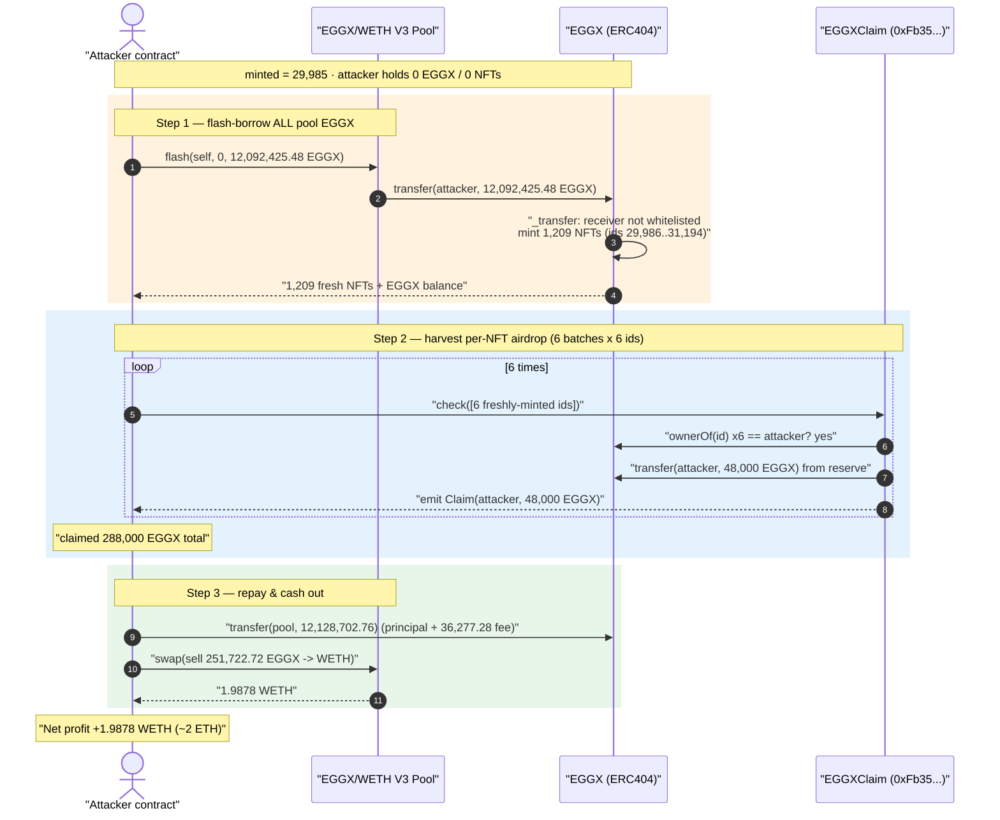
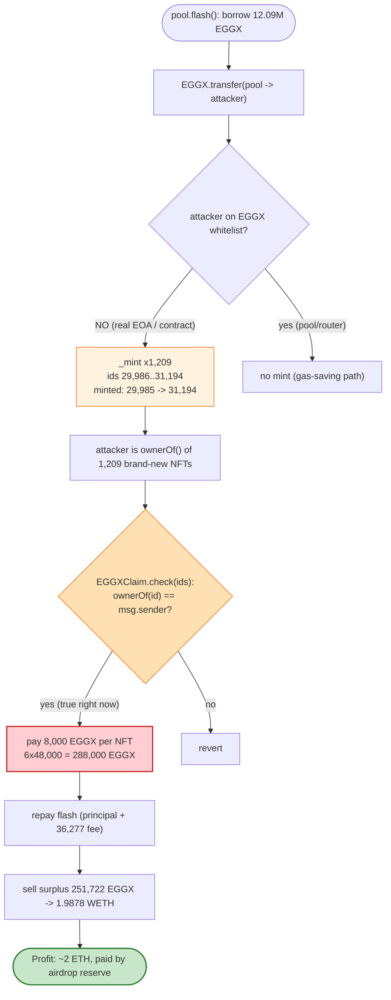
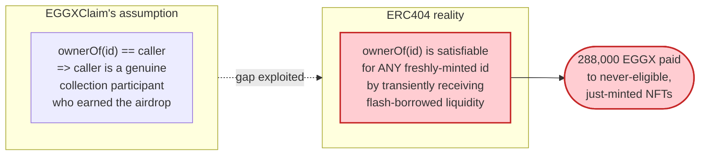

# EGGX Exploit — ERC404 Flash-Mintable NFTs Drain a Per-NFT Token Airdrop

> **Reproduction:** the PoC compiles & runs in an isolated Foundry project at
> [this project folder](.) (the umbrella DeFiHackLabs repo contains many PoCs that
> do not whole-compile under `forge test`, so this one was extracted).
> Full verbose trace: [output.txt](output.txt).
> Verified vulnerable token source (ERC404): [sources/EGGX_e2f95e/EGGX.sol](sources/EGGX_e2f95e/EGGX.sol).
> PoC: [test/EGGX_exp.sol](test/EGGX_exp.sol).

---

## Key info

| | |
|---|---|
| **Loss** | **1.9878 WETH (~2 ETH)** net to the attacker — paid out of the EGGX per-NFT airdrop reserve as **288,000 EGGX** that was then sold for WETH |
| **Vulnerable contract** | `EGGXClaim` (per-NFT airdrop / `check`) — [`0xFb35DE57B117FA770761C1A344784075745F84F9`](https://etherscan.io/address/0xFb35DE57B117FA770761C1A344784075745F84F9) |
| **Enabling contract** | `EGGX` (ERC404 token) — [`0xe2f95ee8B72fFed59bC4D2F35b1d19b909A6e6b3`](https://etherscan.io/address/0xe2f95ee8B72fFed59bC4D2F35b1d19b909A6e6b3#code) |
| **Liquidity source (flash)** | EGGX/WETH Uniswap V3 pool — [`0x26beBB6995a4736F088D129E82620eBA899B944F`](https://etherscan.io/address/0x26beBB6995a4736F088D129E82620eBA899B944F) |
| **Attacker EOA** | `0x7FA9385bE102ac3EAc297483Dd6233D62b3e1496` (the PoC test contract) |
| **Analysis ref** | https://x.com/PeiQi_0/status/1759826303044497726 |
| **Chain / block / date** | Ethereum mainnet / fork at **19,252,566** (one before 19,252,567) / Feb 2024 |
| **Token compiler** | EGGX: Solidity `v0.8.23`, optimizer 200 runs · Pool: `v0.7.6` · PoC `evm_version = shanghai` |
| **Bug class** | Flash-mintable ERC404 NFTs used to satisfy a per-NFT claim that checks only instantaneous `ownerOf`, with no eligibility snapshot |

---

## TL;DR

`EGGX` is an **ERC404** token: balances and NFTs are coupled. Every `_getUnit()` =
`10000 * 10**18` of fractional balance corresponds to exactly **one NFT**, and NFTs are
minted/burned *automatically* whenever a non-whitelisted address's balance crosses a unit
boundary inside `_transfer` ([sources/EGGX_e2f95e/EGGX.sol — `_transfer`](sources/EGGX_e2f95e/EGGX.sol)).

A separate airdrop contract, `EGGXClaim` at `0xFb35…`, exposes `check(uint256[] ids)` that
(per the trace) (a) verifies `EGGX.ownerOf(id) == msg.sender` for each id, then (b) **pays the
caller 8,000 EGGX per NFT** out of a pre-funded reserve and records a per-id claim timestamp. The
fatal assumption: it trusts that holding an NFT *right now* proves the holder is a legitimate
collection participant who earned the airdrop.

But ERC404 NFTs are **fungible-on-demand and flash-mintable**. The attacker:

1. Flash-borrows the **entire** EGGX balance of the V3 pool (12,092,425.48 EGGX) via
   `pool.flash(...)`. Because the attacker contract is **not** whitelisted, receiving that balance
   *mints 1,209 brand-new NFTs to the attacker* (token IDs 29,986 → 31,194) for free.
2. Inside the same flash callback, calls `EGGXClaim.check(...)` **6 times** with 36 of those
   freshly-minted NFT IDs. Each call passes the `ownerOf` check (the attacker genuinely owns them
   this instant) and pays out 48,000 EGGX → **288,000 EGGX claimed in total**.
3. Repays the flash loan (principal + 36,277.28 EGGX fee), keeps the surplus **251,722.72 EGGX**,
   and swaps it back through the pool for **1.9878 WETH** of profit.

The 288,000 EGGX never had to be "earned" — it was conjured by borrowing pool liquidity and giving
it back, exploiting the gap between ERC404's mint-on-receive mechanic and the claim contract's naive
point-in-time ownership check.

---

## Background

### ERC404 mint/burn coupling

`EGGX` inherits `ERC404`. The relevant internals
([sources/EGGX_e2f95e/EGGX.sol](sources/EGGX_e2f95e/EGGX.sol)):

```solidity
function _getUnit() internal view returns (uint256) {
    return 10000 * 10 ** decimals;   // decimals = 18  →  1 unit = 1e22 = 10,000 EGGX
}

function _transfer(address from, address to, uint256 amount) internal returns (bool) {
    uint256 unit = _getUnit();
    uint256 balanceBeforeSender = balanceOf[from];
    uint256 balanceBeforeReceiver = balanceOf[to];

    balanceOf[from] -= amount;
    unchecked { balanceOf[to] += amount; }

    if (!whitelist[from]) {                                   // burn NFTs the sender drops below
        uint256 tokens_to_burn = (balanceBeforeSender / unit) - (balanceOf[from] / unit);
        for (uint256 i = 0; i < tokens_to_burn; i++) { _burn(from); }
    }
    if (!whitelist[to]) {                                     // MINT NFTs the receiver crosses into
        uint256 tokens_to_mint = (balanceOf[to] / unit) - (balanceBeforeReceiver / unit);
        for (uint256 i = 0; i < tokens_to_mint; i++) { _mint(to); }   // ⚠️ free NFTs on receive
    }
    emit ERC20Transfer(from, to, amount);
    return true;
}
```

Two consequences matter:

- **Receiving a large fractional balance auto-mints many sequential NFTs** to a non-whitelisted
  recipient, each with a fresh, monotonically increasing `id = ++minted`.
- The mint is **free** — it requires no payment, no whitelist, no proof; it is a pure side-effect
  of an ERC20 transfer.

At the fork block, `minted` (storage slot 3) = **29,985**, so the next NFT minted will be #29,986.

### The EGGXClaim airdrop (`0xFb35…`)

The vulnerable contract's source is not verified/downloaded here, but its behavior is fully visible
in the trace ([output.txt:4891–4948](output.txt)). For each `check(uint256[6] ids)`:

```
for each id:  EGGX.ownerOf(id)  →  must equal msg.sender    (6× ownerOf staticcalls)
for each id:  EGGX.tokenURI(id)                              (reads traits)
EGGX.transfer(msg.sender, 48000e18)                          (ERC20Transfer from 0xFb35… → caller)
emit Claim(account = msg.sender, amount = 48000e18)
writes a per-id claim timestamp (0 → 0x…65d192ef)
```

So the airdrop pays **48,000 EGGX per 6-NFT batch = 8,000 EGGX per NFT**, sourced from a balance the
claim contract holds, and stamps each id as "claimed" to prevent that *specific id* being reused.

---

## The vulnerable interaction

The bug is the **composition** of two individually-reasonable designs:

1. ERC404 mints NFTs to anyone who momentarily holds enough fractional balance.
2. `EGGXClaim.check` gates the airdrop on `ownerOf(id) == msg.sender` **at call time**, with no
   snapshot of who held the NFT at airdrop-eligibility time and no check that the id was minted
   *before* some cutoff.

Because the pool's EGGX liquidity is flash-loanable, an attacker can transiently own an arbitrary
number of NFTs, harvest the per-NFT airdrop on all of them, and give the liquidity back — all atomically.

---

## Root cause

> **The airdrop credits freshly-mintable assets.** `EGGXClaim.check` decides eligibility from the
> *current* `EGGX.ownerOf(id)`, but ERC404 lets an attacker mint unlimited new NFTs for free by
> transiently receiving pool liquidity inside a flash loan. The 36 NFT ids the attacker claimed on
> (30,019 … 30,488) **did not exist** until the flash-loan transfer minted them moments earlier in
> the same transaction.

Concretely, four facts compose into the exploit:

1. **Flash-loanable enabling balance.** A Uniswap V3 pool will lend its entire EGGX balance via
   `flash()`; the attacker only owes a small fee. This provides the working capital with zero
   permanent stake.
2. **Mint-on-receive with no whitelist for the attacker.** Receiving 12.09M EGGX mints 1,209 NFTs to
   the attacker for free (the pool/router are whitelisted so they never minted these; the attacker
   is not). `minted` jumps 29,985 → 31,194 ([output.txt:4337](output.txt)).
3. **Eligibility = instantaneous `ownerOf`.** `check` never asks "was this id minted before the
   snapshot?" or "did this id ever belong to a real buyer?" — owning it *now* is sufficient.
4. **Per-id one-shot is irrelevant.** The per-id "claimed" timestamp only stops *re-claiming the same
   id*. With a flash loan the attacker has a near-unbounded supply of *new, never-claimed* ids, so the
   one-shot guard provides no economic protection.

The attacker simply harvests `8,000 EGGX × (number of freshly-minted NFTs it claims on)`.

---

## Preconditions

- The EGGX/WETH V3 pool holds enough EGGX to flash-borrow into many whole units
  (≥ 1e22 each). At fork: pool EGGX balance = **12,092,425.48 EGGX** ⇒ 1,209 mintable NFTs.
- `EGGXClaim` (`0xFb35…`) is funded with EGGX and pays per-NFT without an eligibility snapshot.
- The attacker contract is **not** on the EGGX `whitelist` (so it actually mints NFTs on receive).
- A few of the freshly-minted NFT ids have not been claimed before (trivially true — they did not
  exist a moment ago). The PoC uses 36 ids in 30,019 … 30,488.
- Working capital is the flash fee only; the attack is fully atomic and self-funding.

---

## Step-by-step attack walkthrough

`token0 = WETH`, `token1 = EGGX` for the pool (the swap callback returns `token1() = EGGX`,
[output.txt:10148](output.txt)). The flash borrows `amount1` (EGGX); the final swap is
`zeroForOne = false` (sell EGGX for WETH).

| # | Step | On-chain evidence | EGGX effect |
|---|------|-------------------|-------------|
| 0 | **Initial** — attacker has 0 WETH, 0 EGGX; pool EGGX = 12,092,425.48; pool WETH = 94.558; `minted` = 29,985 | [output.txt:24,45,4337](output.txt) | — |
| 1 | **Flash-borrow entire pool EGGX** `pool.flash(self, 0, 12,092,425.48 EGGX, data)` → pool `transfer`s it to the (non-whitelisted) attacker | [output.txt:42–](output.txt) | Auto-mints **1,209 NFTs** (ids 29,986→31,194) to attacker; `minted` → 31,194 |
| 2a | **Claim batch 1** `check([30342,30319,30031,30036,30028,30019])` — 6× `ownerOf` all return attacker; pays 48,000 EGGX | [output.txt:4891–4948](output.txt) | +48,000 EGGX (more NFTs minted from the payout) |
| 2b | **Claim batch 2** `check([30379,30363,30169,30267,30098,30484])` | [output.txt:4954](output.txt) | +48,000 EGGX |
| 2c | **Claim batch 3** `check([30281,30217,30245,30192,30027,30181])` | [output.txt:5013](output.txt) | +48,000 EGGX |
| 2d | **Claim batch 4** `check([30368,30488,30259,30284,30084,30395])` | [output.txt:5076](output.txt) | +48,000 EGGX |
| 2e | **Claim batch 5** `check([30408,30111,30365,30144,30176,30054])` | [output.txt:5139](output.txt) | +48,000 EGGX |
| 2f | **Claim batch 6** `check([30039,30045,30030,30070,30055,30213])` | [output.txt:5202](output.txt) | +48,000 EGGX |
| 3 | **Tally** attacker EGGX balance now **12,380,425.48** (= 12,092,425.48 + 288,000) | [output.txt:5265–5267](output.txt) | +288,000 EGGX total claimed |
| 4 | **Repay flash** `EGGX.transfer(pool, 12,128,702.76)` = principal 12,092,425.48 + fee **36,277.28** | [output.txt](output.txt) repay transfer | Pool EGGX back to 12,128,702.76; `Flash(... paid1 = 36,277.28)` |
| 5 | **Swap surplus** `pool.swap(self, zeroForOne=false, 251,722.72 EGGX, ...)` → receive **1.9878 WETH** | [output.txt:10138–10160](output.txt) | Sells leftover 251,722.72 EGGX |
| 6 | **Profit** attacker WETH balance = **1.9878 WETH** (started at 0) | [output.txt:10265–](output.txt) | net +1.9878 WETH |

The surplus EGGX sold in step 5 is exactly:
`288,000 (claimed) − 36,277.28 (flash fee) = 251,722.72 EGGX`
(`251722723557701918851880` wei = 2.517e23), confirmed by the pre-swap balance read at
[output.txt](output.txt) and the `Swap` event `amount1 = 251722723557701918851880`.

---

## Profit / loss accounting

### EGGX flow (the airdrop reserve is the victim)

| Item | EGGX |
|---|---:|
| Flash-borrowed principal (returned) | 12,092,425.48 |
| Airdrop claimed (6 × 48,000) | **+288,000.00** |
| Flash fee paid to pool | −36,277.28 |
| **Net EGGX harvested** | **+251,722.72** |

The 288,000 EGGX came out of `EGGXClaim`'s pre-funded balance — every `Claim` payout is an
`ERC20Transfer(from: 0xFb35…, to: attacker, 48000e18)` ([output.txt:4922](output.txt)). The
flash fee (36,277.28 EGGX) is a *cost to the pool's LPs*, but the dominant, intended-to-be-protected
loss is the airdrop drain.

### WETH realized (attacker's take-home)

| Direction | WETH |
|---|---:|
| Starting balance | 0 |
| Sold 251,722.72 surplus EGGX into pool | +1.9878 |
| **Net profit** | **+1.9878 WETH (~2 ETH)** |

Matches the PoC log `Attacker ETH balance after attack: 1987844781225447892` and the `@KeyInfo`
header "Total Lost : ~2 $ETH".

---

## Diagrams

### Sequence of the attack



### How free NFTs become free money



### Eligibility: what the claim assumes vs. what is true



---

## Why each magic number

- **`pool.flash(0, EGGX.balanceOf(pool))`** — borrows the *maximum* available EGGX so the attacker
  mints as many NFTs as possible (1,209), maximizing how many `check` batches it can run. Borrowing
  the whole side also means the swap-back in step 5 happens against a pool whose EGGX side is intact
  (it was repaid), so price impact on the surplus sale is modest.
- **36 NFT ids across 6 `check` calls** — `check` takes a fixed 6-element array; 6 calls × 6 ids =
  36 NFTs claimed at 8,000 EGGX each = **288,000 EGGX**. The specific ids (30,019 … 30,488) are an
  arbitrary subset of the 1,209 ids just minted (29,986 … 31,194); any unclaimed ids work.
- **Repay 12,128,702.76 EGGX** = principal `12,092,425.48` + V3 flash fee `36,277.28`
  (`paid1` in the `Flash` event). Everything above that — `251,722.72 EGGX` — is pure surplus.
- **`amountSpecified = EGGX.balanceOf(self)` = 251,722.72** on the final swap — dumps exactly the
  leftover EGGX for WETH, converting the harvested airdrop into the realized ~2 ETH profit.

---

## Remediation

1. **Snapshot airdrop eligibility; never credit live `ownerOf`.** Compute the eligible NFT set
   (and amounts) at a fixed historical block via a Merkle root or a stored snapshot, and verify
   claims against that root. An id that did not exist at the snapshot can never claim.
2. **Reject flash-mintable / newly-minted ids.** At minimum, require `id <= mintedAtSnapshot` (a
   cutoff captured when the airdrop opened) so ids minted after the program started are ineligible.
3. **Block contract / same-block ownership for claims.** Disallow `tx.origin != msg.sender`, or
   require the claimer to have owned the id for at least one block, defeating atomic flash-loan
   ownership. (Snapshotting per (1) is strictly better and should be preferred.)
4. **Decouple value from ERC404 NFT count for any reward.** Because ERC404 lets balance↔NFT count be
   manufactured on demand, no economic decision (airdrops, fee rebates, voting weight) should key off
   the *current* NFT count or `ownerOf`. If per-NFT rewards are required, escrow them to ids that were
   minted through genuine, paid collection mints recorded at mint time.
5. **Defense-in-depth on the ERC404 itself.** Auto-minting on receive for non-whitelisted addresses is
   the lever that makes pool liquidity flash-mint NFTs. Consider not minting NFTs to contracts, or
   requiring explicit opt-in before an address participates in NFT issuance.

---

## How to reproduce

The PoC was extracted into a standalone Foundry project (the umbrella DeFiHackLabs repo has many
unrelated PoCs that fail to compile under a whole-project `forge test`):

```bash
_shared/run_poc.sh 2024-02-EGGX_exp -vvvvv
```

- Network: an **Ethereum mainnet archive** RPC is required (`foundry.toml` maps `mainnet`); the fork
  pins block `19,252,567 - 1 = 19,252,566`. `evm_version = shanghai` is required for the V3 pool.
- The run is slow (~7–8 min wall) because the flash-loan transfer mints/burns ~1,209 NFTs in a loop
  and the trace is large under `-vvvvv`.

Expected tail:

```
Logs:
  Attacker ETH balance before exploit: 0
  Attacker EGGX exploit balance:: 12380425480766027049373298
  Attacker ETH balance after attack:: 1987844781225447892

Suite result: ok. 1 passed; 0 failed; 0 skipped
```

`Attacker ETH balance after attack ≈ 1.9878e18` = **~2 ETH** profit, harvested from the EGGX per-NFT
airdrop reserve.

---

## Caveat on sources

Only the **EGGX ERC404 token** and the **Uniswap V3 pool** were fetched into `sources/`. The actually
exploited contract — `EGGXClaim` at `0xFb35DE57B117FA770761C1A344784075745F84F9` (the `@KeyInfo`
"Vulnerable Contract") — is analyzed here purely from its on-chain behavior in
[output.txt](output.txt): the `ownerOf`/`tokenURI` reads, the `ERC20Transfer(from: 0xFb35…, 48000e18)`
payouts, the `Claim(account, 48000e18)` events, and the per-id timestamp storage writes. Its exact
source (e.g., whether trait/color requirements are enforced inside `check`) is not in scope here, but
the root cause — crediting flash-mintable ERC404 NFTs via a live-`ownerOf` eligibility test — is fully
established by the trace.

*Reference: @PeiQi_0 analysis — https://x.com/PeiQi_0/status/1759826303044497726 (EGGX, Ethereum, ~2 ETH).*
